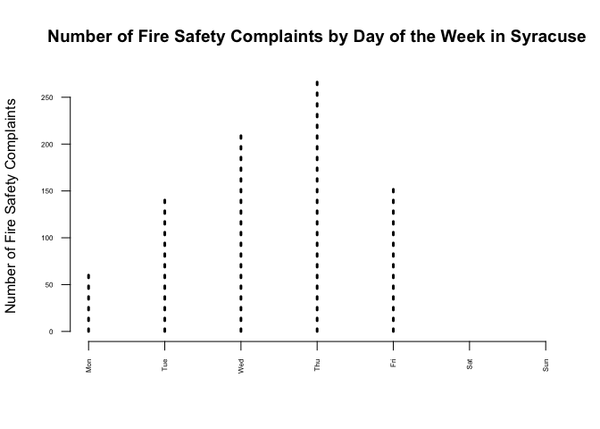
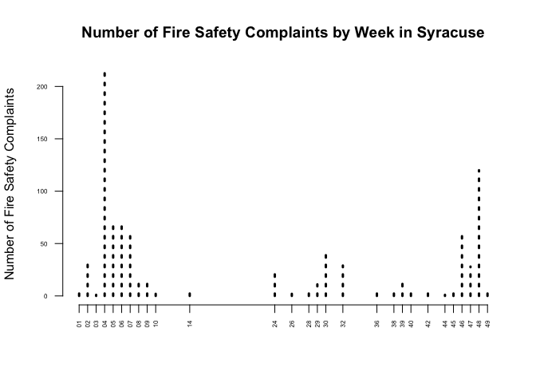
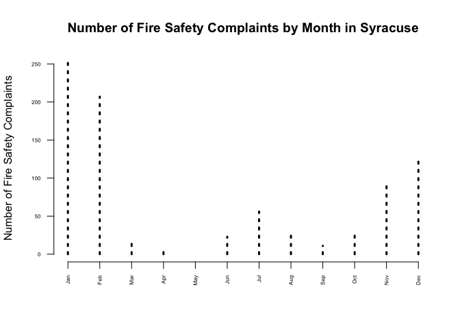
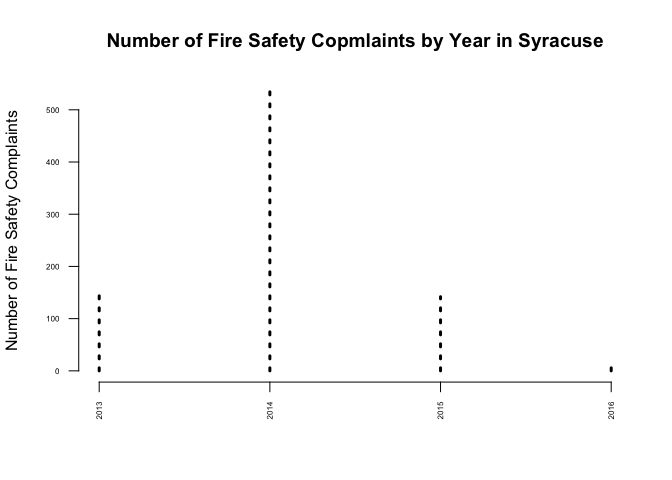
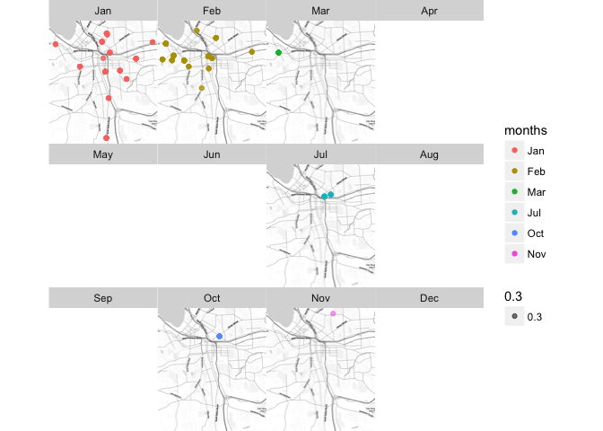

# Lab01
Chris Davis  
1/31/2017  


Load libraries

```r
library(dplyr)
library(pander)
library(ggmap)
```


Follow the steps in the Dates tutorial to read in the code violation data and drop all variables except violation dates, violation types, and their coordinates (lat,lon).

```r
data.url <- "https://raw.githubusercontent.com/lecy/code-orange/master/data/code%20violations.csv"
dat <- read.csv( data.url, stringsAsFactors=F)
dat <- tbl_df(dat)
dat <- select(dat, Complaint.Type, Violation.Date, lat, lon) %>% tbl_df
dat
```

<div data-pagedtable="false">
  <script data-pagedtable-source type="application/json">
{"columns":[{"label":["Complaint.Type"],"name":[1],"type":["chr"],"align":["left"]},{"label":["Violation.Date"],"name":[2],"type":["chr"],"align":["left"]},{"label":["lat"],"name":[3],"type":["dbl"],"align":["right"]},{"label":["lon"],"name":[4],"type":["dbl"],"align":["right"]}],"data":[{"1":"Illegal Trash Set Out","2":"12/22/2011 10:25","3":"43.02400","4":"-76.14822"},{"1":"Illegal Trash Set Out","2":"12/22/2011 10:26","3":"43.02400","4":"-76.14822"},{"1":"Illegal Trash Set Out","2":"12/22/2011 7:30","3":"43.02400","4":"-76.14822"},{"1":"Heating","2":"2/2/2012 15:57","3":"43.05106","4":"-76.17247"},{"1":"Heating","2":"2/2/2012 15:55","3":"43.05106","4":"-76.17247"},{"1":"Heating","2":"2/2/2012 16:03","3":"43.05106","4":"-76.17247"},{"1":"Heating","2":"2/2/2012 16:00","3":"43.05106","4":"-76.17247"},{"1":"Tree/Limb/Stump Removal","2":"2/2/2012 17:08","3":"43.03547","4":"-76.14819"},{"1":"Trash/Debris-Private, Occ","2":"1/19/2012 11:06","3":"43.05252","4":"-76.14264"},{"1":"Property Maintenance-Int","2":"1/26/2012 9:15","3":"43.06114","4":"-76.12280"},{"1":"Property Maintenance-Int","2":"1/26/2012 9:09","3":"43.06114","4":"-76.12280"},{"1":"Property Maintenance-Int","2":"1/26/2012 9:04","3":"43.06114","4":"-76.12280"},{"1":"Property Maintenance-Int","2":"1/26/2012 9:20","3":"43.06114","4":"-76.12280"},{"1":"Property Maintenance-Int","2":"1/26/2012 9:39","3":"43.06114","4":"-76.12280"},{"1":"Illegal Trash Set Out","2":"2/6/2012 5:48","3":"35.42610","4":"-119.02205"},{"1":"Bed Bugs","2":"1/10/2012 17:46","3":"43.06971","4":"-76.15820"},{"1":"Property Maintenance-Int","2":"1/19/2012 14:46","3":"43.05703","4":"-76.13298"},{"1":"Property Maintenance-Int","2":"1/19/2012 14:44","3":"43.05703","4":"-76.13298"},{"1":"Trash/Debris-Private, Occ","2":"1/26/2012 9:29","3":"43.05642","4":"-76.12415"},{"1":"Property Maintenance-Ext","2":"1/26/2012 22:30","3":"43.03687","4":"-76.17444"},{"1":"Illegal Trash Set Out","2":"1/31/2012 6:54","3":"43.07443","4":"-76.10850"},{"1":"Illegal Trash Set Out","2":"1/31/2012 6:53","3":"43.07443","4":"-76.10850"},{"1":"Illegal Trash Set Out","2":"1/31/2012 6:53","3":"43.07443","4":"-76.10850"},{"1":"Illegal Trash Set Out","2":"2/6/2012 5:47","3":"35.42610","4":"-119.02205"},{"1":"Illegal Trash Set Out","2":"2/6/2012 5:48","3":"35.42610","4":"-119.02205"},{"1":"Trash/Debris-Private, Occ","2":"2/7/2012 14:48","3":"43.06359","4":"-76.14392"},{"1":"Trash/Debris-Private, Occ","2":"2/9/2012 20:07","3":"43.03682","4":"-76.17106"},{"1":"Property Maintenance-Ext","2":"1/9/2012 22:25","3":"43.03617","4":"-76.16979"},{"1":"Property Maintenance-Ext","2":"1/9/2012 22:52","3":"43.03617","4":"-76.16979"},{"1":"Illegal Trash Set Out","2":"2/1/2012 14:20","3":"43.06329","4":"-76.14748"},{"1":"Trash/Debris-Private, Occ","2":"2/3/2012 15:47","3":"43.05440","4":"-76.14627"},{"1":"Trash/Debris-Private, Occ","2":"2/3/2012 19:49","3":"43.04988","4":"-76.17109"},{"1":"Illegal Trash Set Out","2":"2/13/2012 9:30","3":"43.03320","4":"-76.11575"},{"1":"Complaint Reqst - General","2":"3/6/2012 14:42","3":"43.05454","4":"-76.12914"},{"1":"Complaint Reqst - General","2":"3/6/2012 14:48","3":"43.05454","4":"-76.12914"},{"1":"Illegal Trash Set Out","2":"2/15/2012 10:13","3":"43.02955","4":"-76.12008"},{"1":"Trash/Debris-Private, Occ","2":"2/17/2012 15:13","3":"43.04689","4":"-76.11838"},{"1":"Trash/Debris-Private, Occ","2":"2/24/2012 15:18","3":"43.06907","4":"-76.14379"},{"1":"Trash/Debris-Private, Occ","2":"2/2/2012 9:03","3":"43.00145","4":"-76.14275"},{"1":"Illegal Trash Set Out","2":"2/13/2012 8:31","3":"43.03456","4":"-76.11714"},{"1":"Illegal Trash Set Out","2":"2/13/2012 8:31","3":"43.03456","4":"-76.11714"},{"1":"Illegal Trash Set Out","2":"2/17/2012 11:42","3":"43.06576","4":"-76.15255"},{"1":"Illegal Trash Set Out","2":"2/17/2012 11:42","3":"43.06576","4":"-76.15255"},{"1":"Property Maintenance-Int","2":"2/23/2012 8:46","3":"43.05440","4":"-76.14627"},{"1":"Complaint Reqst - General","2":"2/22/2012 13:21","3":"43.06232","4":"-76.14696"},{"1":"Illegal Trash Set Out","2":"2/28/2012 8:58","3":"43.06470","4":"-76.14128"},{"1":"Illegal Trash Set Out","2":"2/28/2012 8:58","3":"43.06470","4":"-76.14128"},{"1":"Illegal Trash Set Out","2":"2/28/2012 8:58","3":"43.06470","4":"-76.14128"},{"1":"Property Maintenance-Int","2":"2/29/2012 19:23","3":"43.01782","4":"-76.14624"},{"1":"Property Maintenance-Int","2":"2/29/2012 19:25","3":"43.01782","4":"-76.14624"},{"1":"Property Maintenance-Int","2":"2/29/2012 19:41","3":"43.01782","4":"-76.14624"},{"1":"Property Maintenance-Int","2":"2/29/2012 19:48","3":"43.01782","4":"-76.14624"},{"1":"Property Maintenance-Int","2":"2/29/2012 19:15","3":"43.01782","4":"-76.14624"},{"1":"Complaint Reqst - General","2":"2/22/2012 13:38","3":"43.06232","4":"-76.14696"},{"1":"Property Maintenance-Ext","2":"2/28/2012 8:35","3":"43.03127","4":"-76.16427"},{"1":"Property Maintenance-Ext","2":"2/28/2012 8:46","3":"43.03127","4":"-76.16427"},{"1":"Property Maintenance-Ext","2":"2/28/2012 8:42","3":"43.03127","4":"-76.16427"},{"1":"Trash/Debris-Private, Occ","2":"2/24/2012 8:54","3":"43.04356","4":"-76.11989"},{"1":"Trash/Debris-Private, Occ","2":"3/6/2012 13:23","3":"43.07069","4":"-76.15340"},{"1":"Property Maintenance-Int","2":"3/1/2012 13:54","3":"43.06049","4":"-76.14749"},{"1":"Property Maintenance-Int","2":"3/1/2012 13:56","3":"43.06049","4":"-76.14749"},{"1":"Property Maintenance-Int","2":"2/29/2012 19:32","3":"43.01782","4":"-76.14624"},{"1":"Property Maintenance-Int","2":"2/29/2012 19:46","3":"43.01782","4":"-76.14624"},{"1":"Property Maintenance-Int","2":"2/29/2012 19:34","3":"43.01782","4":"-76.14624"},{"1":"Trash/Debris-Private, Occ","2":"3/1/2012 11:05","3":"43.06350","4":"-76.14852"},{"1":"Trash/Debris-Private, Occ","2":"3/13/2012 13:58","3":"43.06350","4":"-76.14852"},{"1":"Illegal Trash Set Out","2":"3/6/2012 14:18","3":"43.06867","4":"-76.12690"},{"1":"Illegal Trash Set Out","2":"3/6/2012 14:18","3":"43.06867","4":"-76.12690"},{"1":"Illegal Trash Set Out","2":"3/6/2012 14:19","3":"43.06867","4":"-76.12690"},{"1":"Illegal Trash Set Out","2":"2/10/2012 14:27","3":"43.03596","4":"-76.11423"},{"1":"Illegal Trash Set Out","2":"2/16/2012 8:20","3":"43.06520","4":"-76.15936"},{"1":"Illegal Trash Set Out","2":"2/16/2012 8:21","3":"43.06520","4":"-76.15936"},{"1":"Illegal Trash Set Out","2":"2/16/2012 8:20","3":"43.06520","4":"-76.15936"},{"1":"Property Maintenance-Ext","2":"2/24/2012 15:32","3":"43.07144","4":"-76.14512"},{"1":"Property Maintenance-Ext","2":"2/24/2012 15:30","3":"43.07144","4":"-76.14512"},{"1":"Property Maintenance-Ext","2":"2/24/2012 15:31","3":"43.07144","4":"-76.14512"},{"1":"Illegal Trash Set Out","2":"2/23/2012 12:21","3":"43.06071","4":"-76.10526"},{"1":"Property Maintenance-Int","2":"3/1/2012 14:15","3":"43.06049","4":"-76.14749"},{"1":"Property Maintenance-Int","2":"3/1/2012 14:07","3":"43.06049","4":"-76.14749"},{"1":"Property Maintenance-Int","2":"3/1/2012 14:04","3":"43.06049","4":"-76.14749"},{"1":"Property Maintenance-Int","2":"3/1/2012 14:00","3":"43.06049","4":"-76.14749"},{"1":"Illegal Trash Set Out","2":"3/6/2012 8:24","3":"43.05347","4":"-76.13806"},{"1":"Illegal Trash Set Out","2":"3/6/2012 8:24","3":"43.05347","4":"-76.13806"},{"1":"Illegal Trash Set Out","2":"3/6/2012 8:24","3":"43.05347","4":"-76.13806"},{"1":"Illegal Trash Set Out","2":"3/6/2012 14:14","3":"43.06151","4":"-76.09377"},{"1":"Property Maintenance-Ext","2":"3/2/2012 20:31","3":"43.03643","4":"-76.17929"},{"1":"Property Maintenance-Ext","2":"3/2/2012 20:40","3":"43.03643","4":"-76.17929"},{"1":"Property Maintenance-Ext","2":"3/2/2012 20:12","3":"43.03643","4":"-76.17929"},{"1":"Property Maintenance-Ext","2":"3/2/2012 20:17","3":"43.03643","4":"-76.17929"},{"1":"Property Maintenance-Ext","2":"3/2/2012 20:37","3":"43.03643","4":"-76.17929"},{"1":"Property Maintenance-Ext","2":"3/2/2012 20:24","3":"43.03643","4":"-76.17929"},{"1":"Property Maintenance-Int","2":"3/7/2012 15:55","3":"43.03965","4":"-76.11992"},{"1":"Trash/Debris-Private, Occ","2":"3/8/2012 11:35","3":"43.06546","4":"-76.15292"},{"1":"Trash/Debris-Private, Occ","2":"3/8/2012 11:36","3":"43.06546","4":"-76.15292"},{"1":"Illegal Trash Set Out","2":"3/12/2012 9:02","3":"42.99473","4":"-76.13911"},{"1":"Illegal Trash Set Out","2":"3/12/2012 9:02","3":"42.99473","4":"-76.13911"},{"1":"Illegal Trash Set Out","2":"3/9/2012 7:46","3":"43.03650","4":"-76.17277"},{"1":"Building W/O Permit","2":"3/20/2012 15:28","3":"42.00558","4":"-76.53903"},{"1":"Building W/O Permit","2":"3/20/2012 15:25","3":"42.00558","4":"-76.53903"},{"1":"Property Maintenance-Int","2":"3/7/2012 16:08","3":"43.03965","4":"-76.11992"},{"1":"Property Maintenance-Int","2":"3/7/2012 16:11","3":"43.03965","4":"-76.11992"},{"1":"Property Maintenance-Int","2":"3/7/2012 16:21","3":"43.03965","4":"-76.11992"},{"1":"Property Maintenance-Int","2":"3/7/2012 16:30","3":"43.03965","4":"-76.11992"},{"1":"Trash/Debris-Private, Occ","2":"1/9/2012 21:30","3":"43.03682","4":"-76.17106"},{"1":"Illegal Trash Set Out","2":"2/1/2012 14:36","3":"43.04684","4":"-76.11493"},{"1":"Illegal Trash Set Out","2":"2/1/2012 14:37","3":"43.04684","4":"-76.11493"},{"1":"Building W/O Permit","2":"3/20/2012 15:30","3":"42.00558","4":"-76.53903"},{"1":"Property Maintenance-Int","2":"3/29/2012 18:38","3":"43.01942","4":"-76.14769"},{"1":"Property Maintenance-Int","2":"3/29/2012 18:49","3":"43.01942","4":"-76.14769"},{"1":"Property Maintenance-Int","2":"3/29/2012 8:50","3":"43.01942","4":"-76.14769"},{"1":"Property Maintenance-Int","2":"3/29/2012 18:20","3":"43.01942","4":"-76.14769"},{"1":"Property Maintenance-Int","2":"3/29/2012 18:43","3":"43.01942","4":"-76.14769"},{"1":"Illegal Trash Set Out","2":"4/3/2012 8:37","3":"43.06827","4":"-76.14932"},{"1":"Illegal Trash Set Out","2":"3/6/2012 14:14","3":"43.06151","4":"-76.09377"},{"1":"Illegal Trash Set Out","2":"3/8/2012 8:11","3":"43.02555","4":"-76.13937"},{"1":"Property Maintenance-Ext","2":"3/7/2012 19:13","3":"43.04960","4":"-76.17486"},{"1":"Illegal Trash Set Out","2":"3/9/2012 7:45","3":"43.03122","4":"-76.17571"},{"1":"Illegal Trash Set Out","2":"3/9/2012 7:44","3":"43.03122","4":"-76.17571"},{"1":"Trash/Debris-Private, Occ","2":"1/25/2012 10:53","3":"43.07266","4":"-76.16259"},{"1":"Illegal Trash Set Out","2":"2/21/2012 13:59","3":"43.03869","4":"-76.17010"},{"1":"Complaint Reqst - General","2":"3/16/2012 16:00","3":"43.03600","4":"-76.17164"},{"1":"Complaint Reqst - General","2":"3/16/2012 16:07","3":"43.03600","4":"-76.17164"},{"1":"Complaint Reqst - General","2":"3/16/2012 16:04","3":"43.03600","4":"-76.17164"},{"1":"Complaint Reqst - General","2":"3/16/2012 16:06","3":"43.03600","4":"-76.17164"},{"1":"Complaint Reqst - General","2":"3/16/2012 16:05","3":"43.03600","4":"-76.17164"},{"1":"Complaint Reqst - General","2":"3/16/2012 16:09","3":"43.03600","4":"-76.17164"},{"1":"Complaint Reqst - General","2":"3/16/2012 16:01","3":"43.03600","4":"-76.17164"},{"1":"Complaint Reqst - General","2":"3/16/2012 15:57","3":"43.03600","4":"-76.17164"},{"1":"Complaint Reqst - General","2":"3/16/2012 15:57","3":"43.03600","4":"-76.17164"},{"1":"Illegal Trash Set Out","2":"4/3/2012 8:38","3":"43.06827","4":"-76.14932"},{"1":"Property Maintenance-Ext","2":"4/10/2012 16:55","3":"43.07172","4":"-76.14935"},{"1":"Property Maintenance-Int","2":"3/23/2012 9:28","3":"43.04343","4":"-76.16356"},{"1":"Property Maintenance-Int","2":"3/23/2012 9:19","3":"43.04343","4":"-76.16356"},{"1":"Property Maintenance-Int","2":"3/23/2012 9:20","3":"43.04343","4":"-76.16356"},{"1":"Property Maintenance-Int","2":"3/23/2012 9:23","3":"43.04343","4":"-76.16356"},{"1":"Property Maintenance-Int","2":"3/23/2012 9:24","3":"43.04343","4":"-76.16356"},{"1":"Property Maintenance-Int","2":"3/23/2012 9:26","3":"43.04343","4":"-76.16356"},{"1":"Complaint Reqst - General","2":"3/16/2012 16:11","3":"43.03600","4":"-76.17164"},{"1":"Illegal Trash Set Out","2":"3/13/2012 8:08","3":"38.84886","4":"-97.60050"},{"1":"Property Maintenance-Int","2":"3/21/2012 13:41","3":"43.06719","4":"-76.14283"},{"1":"Property Maintenance-Int","2":"3/21/2012 13:45","3":"43.06719","4":"-76.14283"},{"1":"Property Maintenance-Int","2":"3/21/2012 13:47","3":"43.06719","4":"-76.14283"},{"1":"Property Maintenance-Int","2":"3/21/2012 13:50","3":"43.06719","4":"-76.14283"},{"1":"Illegal Trash Set Out","2":"3/26/2012 11:44","3":"43.06584","4":"-76.14136"},{"1":"Illegal Trash Set Out","2":"3/26/2012 11:44","3":"43.06584","4":"-76.14136"},{"1":"Trash/Debris-Private, Occ","2":"2/7/2012 21:08","3":"43.07124","4":"-76.16187"},{"1":"Trash/Debris-Private, Occ","2":"2/10/2012 16:41","3":"43.03880","4":"-76.17253"},{"1":"Water Shop:All Complaints","2":"2/14/2012 15:37","3":"43.05732","4":"-76.12474"},{"1":"Water Shop:All Complaints","2":"2/14/2012 15:30","3":"43.05732","4":"-76.12474"},{"1":"Water Shop:All Complaints","2":"2/14/2012 15:35","3":"43.05732","4":"-76.12474"},{"1":"Trash/Debris-Private, Occ","2":"2/24/2012 12:21","3":"43.06372","4":"-76.14248"},{"1":"Complaint Reqst - General","2":"3/12/2012 17:38","3":"32.53659","4":"-82.91960"},{"1":"Complaint Reqst - General","2":"3/12/2012 17:06","3":"32.53659","4":"-82.91960"},{"1":"Property Maintenance-Int","2":"3/23/2012 9:17","3":"43.04343","4":"-76.16356"},{"1":"Property Maintenance-Int","2":"3/23/2012 9:33","3":"43.04343","4":"-76.16356"},{"1":"Property Maintenance-Int","2":"3/23/2012 9:30","3":"43.04343","4":"-76.16356"},{"1":"Trash/Debris-Private, Occ","2":"4/2/2012 17:32","3":"43.04812","4":"-76.14742"},{"1":"Trash/Debris-Private, Occ","2":"4/23/2012 9:18","3":"43.02706","4":"-76.14799"},{"1":"Overgrowth: Private, Occ","2":"5/7/2012 15:44","3":"43.03325","4":"-76.17202"},{"1":"Trash/Debris-Private, Occ","2":"3/13/2012 19:04","3":"43.02112","4":"-76.16298"},{"1":"Trash/Debris-Private, Occ","2":"3/16/2012 15:08","3":"43.03636","4":"-76.12192"},{"1":"Illegal Trash Set Out","2":"3/26/2012 11:44","3":"43.06584","4":"-76.14136"},{"1":"Illegal Trash Set Out","2":"4/17/2012 14:30","3":"43.07584","4":"-76.14939"},{"1":"Illegal Trash Set Out","2":"4/17/2012 14:30","3":"43.07584","4":"-76.14939"},{"1":"Illegal Trash Set Out","2":"4/17/2012 14:31","3":"43.07584","4":"-76.14939"},{"1":"Overgrowth: Private, Occ","2":"4/18/2012 15:43","3":"43.02000","4":"-76.15195"},{"1":"Complaint Reqst - General","2":"4/10/2012 16:16","3":"43.03625","4":"-76.17081"},{"1":"Complaint Reqst - General","2":"4/10/2012 16:22","3":"43.03625","4":"-76.17081"},{"1":"Complaint Reqst - General","2":"4/10/2012 16:14","3":"43.03625","4":"-76.17081"},{"1":"Complaint Reqst - General","2":"4/10/2012 16:21","3":"43.03625","4":"-76.17081"},{"1":"Complaint Reqst - General","2":"4/10/2012 16:15","3":"43.03625","4":"-76.17081"},{"1":"Complaint Reqst - General","2":"4/10/2012 16:17","3":"43.03625","4":"-76.17081"},{"1":"Complaint Reqst - General","2":"4/10/2012 16:18","3":"43.03625","4":"-76.17081"},{"1":"Complaint Reqst - General","2":"4/10/2012 16:19","3":"43.03625","4":"-76.17081"},{"1":"Complaint Reqst - General","2":"4/10/2012 16:20","3":"43.03625","4":"-76.17081"},{"1":"Property Maintenance-Int","2":"4/24/2012 15:50","3":"43.08733","4":"-76.88479"},{"1":"Property Maintenance-Int","2":"4/24/2012 15:52","3":"43.08733","4":"-76.88479"},{"1":"Property Maintenance-Int","2":"4/24/2012 15:48","3":"43.08733","4":"-76.88479"},{"1":"Property Maintenance-Ext","2":"4/2/2012 16:11","3":"40.15994","4":"-74.91201"},{"1":"Property Maintenance-Int","2":"5/22/2012 16:02","3":"43.07119","4":"-76.15975"},{"1":"Property Maintenance-Int","2":"5/8/2012 16:09","3":"43.07119","4":"-76.15975"},{"1":"Property Maintenance-Int","2":"5/8/2012 16:09","3":"43.07119","4":"-76.15975"},{"1":"Property Maintenance-Int","2":"5/22/2012 16:02","3":"43.07119","4":"-76.15975"},{"1":"Property Maintenance-Int","2":"5/8/2012 16:09","3":"43.07119","4":"-76.15975"},{"1":"Property Maintenance-Int","2":"5/8/2012 16:09","3":"43.07119","4":"-76.15975"},{"1":"Complaint Reqst - General","2":"3/12/2012 17:32","3":"32.53659","4":"-82.91960"},{"1":"Complaint Reqst - General","2":"3/12/2012 17:01","3":"32.53659","4":"-82.91960"},{"1":"Complaint Reqst - General","2":"3/12/2012 17:51","3":"32.53659","4":"-82.91960"},{"1":"Illegal Trash Set Out","2":"3/12/2012 14:38","3":"43.00444","4":"-76.14222"},{"1":"Illegal Trash Set Out","2":"3/13/2012 8:28","3":"43.06153","4":"-76.15185"},{"1":"Illegal Trash Set Out","2":"3/13/2012 8:29","3":"43.06153","4":"-76.15185"},{"1":"Illegal Trash Set Out","2":"3/13/2012 8:28","3":"43.06153","4":"-76.15185"},{"1":"Illegal Trash Set Out","2":"3/20/2012 8:43","3":"41.53554","4":"-88.11089"},{"1":"Illegal Trash Set Out","2":"3/20/2012 8:42","3":"41.53554","4":"-88.11089"},{"1":"Illegal Trash Set Out","2":"3/20/2012 8:42","3":"41.53554","4":"-88.11089"},{"1":"Illegal Trash Set Out","2":"3/20/2012 8:43","3":"41.53554","4":"-88.11089"},{"1":"Property Maintenance-Ext","2":"4/11/2012 16:02","3":"43.07236","4":"-76.14444"},{"1":"Trash/Debris-Private, Occ","2":"4/23/2012 9:09","3":"43.02463","4":"-76.15054"},{"1":"Complaint Reqst - General","2":"5/7/2012 10:33","3":"43.06422","4":"-76.14187"},{"1":"Property Maintenance-Int","2":"5/8/2012 16:09","3":"43.07119","4":"-76.15975"},{"1":"Property Maintenance-Int","2":"5/8/2012 16:09","3":"43.07119","4":"-76.15975"},{"1":"Overgrowth: Private, Occ","2":"5/11/2012 9:14","3":"43.07338","4":"-76.13944"},{"1":"Overgrowth: Private, Occ","2":"5/11/2012 16:02","3":"40.70929","4":"-74.01233"},{"1":"Overgrowth: Private, Occ","2":"5/22/2012 16:51","3":"43.07637","4":"-76.15802"},{"1":"Illegal Trash Set Out","2":"5/3/2012 14:47","3":"43.02071","4":"-76.13175"},{"1":"Illegal Trash Set Out","2":"5/3/2012 14:47","3":"43.02071","4":"-76.13175"},{"1":"Complaint Reqst - General","2":"5/7/2012 10:02","3":"43.06422","4":"-76.14187"},{"1":"Overgrowth: Private, Occ","2":"5/17/2012 16:08","3":"43.01770","4":"-76.12922"},{"1":"Illegal Trash Set Out","2":"3/22/2012 14:38","3":"43.00933","4":"-76.15390"},{"1":"Illegal Trash Set Out","2":"3/22/2012 14:37","3":"43.00933","4":"-76.15390"},{"1":"Trash/Debris-Private, Occ","2":"3/30/2012 19:07","3":"43.06488","4":"-76.14838"},{"1":"Illegal Trash Set Out","2":"4/6/2012 9:59","3":"43.06353","4":"-76.15502"},{"1":"Illegal Trash Set Out","2":"4/6/2012 9:59","3":"43.06353","4":"-76.15502"},{"1":"Illegal Trash Set Out","2":"4/6/2012 9:59","3":"43.06353","4":"-76.15502"},{"1":"Illegal Trash Set Out","2":"4/10/2012 14:31","3":"43.06882","4":"-76.16159"},{"1":"Illegal Trash Set Out","2":"4/10/2012 14:30","3":"43.06882","4":"-76.16159"},{"1":"Illegal Trash Set Out","2":"4/10/2012 14:30","3":"43.06882","4":"-76.16159"},{"1":"Trash/Debris-Private, Occ","2":"4/11/2012 16:28","3":"43.06343","4":"-76.14082"},{"1":"Illegal Trash Set Out","2":"3/22/2012 14:54","3":"43.02881","4":"-76.15622"},{"1":"Illegal Trash Set Out","2":"3/22/2012 14:53","3":"43.02881","4":"-76.15622"},{"1":"Illegal Trash Set Out","2":"3/22/2012 14:54","3":"43.02881","4":"-76.15622"},{"1":"Illegal Trash Set Out","2":"3/22/2012 14:54","3":"43.02881","4":"-76.15622"},{"1":"Overgrowth: Private, Occ","2":"5/16/2012 16:26","3":"43.05318","4":"-76.09013"},{"1":"Illegal Trash Set Out","2":"6/5/2012 10:56","3":"43.07993","4":"-76.15731"},{"1":"Illegal Trash Set Out","2":"6/5/2012 10:56","3":"43.07993","4":"-76.15731"},{"1":"Property Maintenance-Int","2":"6/6/2012 16:09","3":"43.06489","4":"-76.14376"},{"1":"Property Maintenance-Int","2":"6/6/2012 16:09","3":"43.06489","4":"-76.14376"},{"1":"Property Maintenance-Int","2":"6/6/2012 16:09","3":"43.06489","4":"-76.14376"},{"1":"Property Maintenance-Int","2":"6/6/2012 16:09","3":"43.06489","4":"-76.14376"},{"1":"Property Maintenance-Int","2":"6/6/2012 16:09","3":"43.06489","4":"-76.14376"},{"1":"Illegal Trash Set Out","2":"4/16/2012 14:15","3":"43.00878","4":"-76.15686"},{"1":"Illegal Trash Set Out","2":"4/16/2012 14:15","3":"43.00878","4":"-76.15686"},{"1":"Property Maintenance-Ext","2":"5/7/2012 9:08","3":"43.01794","4":"-76.16216"},{"1":"Complaint Reqst - General","2":"5/10/2012 16:08","3":"32.53625","4":"-82.92155"},{"1":"Complaint Reqst - General","2":"5/10/2012 16:26","3":"32.53625","4":"-82.92155"},{"1":"Illegal Trash Set Out","2":"3/9/2012 7:47","3":"43.03650","4":"-76.17277"},{"1":"Trash/Debris-Private, Occ","2":"3/12/2012 13:02","3":"43.04730","4":"-76.11183"},{"1":"Zoning Violations","2":"3/29/2012 9:36","3":"43.05061","4":"-76.09161"},{"1":"Property Maintenance-Int","2":"4/30/2012 16:01","3":"43.01382","4":"-76.14553"},{"1":"Property Maintenance-Int","2":"4/30/2012 16:14","3":"43.01382","4":"-76.14553"},{"1":"Property Maintenance-Int","2":"4/30/2012 16:28","3":"43.01382","4":"-76.14553"},{"1":"Property Maintenance-Int","2":"4/30/2012 16:31","3":"43.01382","4":"-76.14553"},{"1":"Property Maintenance-Int","2":"4/30/2012 16:05","3":"43.01382","4":"-76.14553"},{"1":"Property Maintenance-Int","2":"4/30/2012 16:17","3":"43.01382","4":"-76.14553"},{"1":"Property Maintenance-Int","2":"3/15/2012 16:16","3":"43.02873","4":"-76.15729"},{"1":"Property Maintenance-Int","2":"6/6/2012 16:09","3":"43.06489","4":"-76.14376"},{"1":"Property Maintenance-Int","2":"6/6/2012 16:09","3":"43.06489","4":"-76.14376"},{"1":"Trash/Debris-Private, Occ","2":"3/12/2012 16:31","3":"43.06347","4":"-76.14324"},{"1":"Trash/Debris-Private, Occ","2":"4/19/2012 15:18","3":"34.05086","4":"-86.05546"},{"1":"Trash/Debris-Private, Occ","2":"4/19/2012 15:14","3":"34.05086","4":"-86.05546"},{"1":"Vacant Lot: Overgrown","2":"4/19/2012 15:13","3":"38.83463","4":"-97.62584"},{"1":"Vacant Lot: Overgrown","2":"4/19/2012 15:10","3":"38.83463","4":"-97.62584"},{"1":"Property Maintenance-Int","2":"3/15/2012 16:03","3":"43.02873","4":"-76.15729"},{"1":"Property Maintenance-Int","2":"3/15/2012 16:06","3":"43.02873","4":"-76.15729"},{"1":"Property Maintenance-Int","2":"3/15/2012 16:13","3":"43.02873","4":"-76.15729"},{"1":"Property Maintenance-Int","2":"3/15/2012 16:08","3":"43.02873","4":"-76.15729"},{"1":"Property Maintenance-Int","2":"3/15/2012 16:09","3":"43.02873","4":"-76.15729"},{"1":"Property Maintenance-Int","2":"3/15/2012 16:11","3":"43.02873","4":"-76.15729"},{"1":"Property Maintenance-Int","2":"3/15/2012 16:05","3":"43.02873","4":"-76.15729"},{"1":"Trash/Debris-Private, Occ","2":"3/16/2012 21:39","3":"43.04932","4":"-76.17647"},{"1":"Property Maintenance-Int","2":"2/8/2012 17:34","3":"43.06246","4":"-76.13930"},{"1":"Property Maintenance-Int","2":"2/8/2012 17:35","3":"43.06246","4":"-76.13930"},{"1":"Property Maintenance-Int","2":"2/8/2012 17:27","3":"43.06246","4":"-76.13930"},{"1":"Property Maintenance-Int","2":"2/8/2012 16:44","3":"43.06246","4":"-76.13930"},{"1":"Property Maintenance-Int","2":"2/8/2012 17:22","3":"43.06246","4":"-76.13930"},{"1":"Property Maintenance-Int","2":"2/8/2012 17:12","3":"43.06246","4":"-76.13930"},{"1":"Property Maintenance-Int","2":"2/8/2012 17:16","3":"43.06246","4":"-76.13930"},{"1":"Property Maintenance-Int","2":"2/8/2012 17:19","3":"43.06246","4":"-76.13930"},{"1":"Trash/Debris-Private, Occ","2":"3/16/2012 15:56","3":"43.06330","4":"-76.14262"},{"1":"Trash/Debris-Private, Occ","2":"4/9/2012 16:10","3":"36.21852","4":"-83.28421"},{"1":"Property Maintenance-Int","2":"4/30/2012 10:08","3":"43.05356","4":"-76.14685"},{"1":"Property Maintenance-Int","2":"4/30/2012 10:10","3":"43.05356","4":"-76.14685"},{"1":"Property Maintenance-Int","2":"5/7/2012 16:21","3":"42.99979","4":"-76.13667"},{"1":"Property Maintenance-Int","2":"5/7/2012 15:32","3":"42.99979","4":"-76.13667"},{"1":"Property Maintenance-Int","2":"5/7/2012 15:45","3":"42.99979","4":"-76.13667"},{"1":"Property Maintenance-Int","2":"5/7/2012 15:53","3":"42.99979","4":"-76.13667"},{"1":"Property Maintenance-Int","2":"2/3/2012 12:03","3":"43.02847","4":"-76.15060"},{"1":"Property Maintenance-Int","2":"2/3/2012 12:16","3":"43.02847","4":"-76.15060"},{"1":"Property Maintenance-Int","2":"2/3/2012 12:19","3":"43.02847","4":"-76.15060"},{"1":"Property Maintenance-Int","2":"2/3/2012 12:24","3":"43.02847","4":"-76.15060"},{"1":"Property Maintenance-Int","2":"2/3/2012 12:14","3":"43.02847","4":"-76.15060"},{"1":"Property Maintenance-Int","2":"2/3/2012 12:12","3":"43.02847","4":"-76.15060"},{"1":"Property Maintenance-Int","2":"2/3/2012 12:07","3":"43.02847","4":"-76.15060"},{"1":"Property Maintenance-Int","2":"2/3/2012 12:09","3":"43.02847","4":"-76.15060"},{"1":"Illegal Trash Set Out","2":"2/2/2012 14:48","3":"43.01573","4":"-76.16605"},{"1":"Illegal Trash Set Out","2":"2/2/2012 14:47","3":"43.01573","4":"-76.16605"},{"1":"Illegal Trash Set Out","2":"2/2/2012 14:48","3":"43.01573","4":"-76.16605"},{"1":"Property Maintenance-Int","2":"2/3/2012 15:33","3":"43.02285","4":"-76.15317"},{"1":"Property Maintenance-Int","2":"2/3/2012 15:31","3":"43.02285","4":"-76.15317"},{"1":"Complaint Reqst - General","2":"2/7/2012 16:16","3":"43.06209","4":"-76.15488"},{"1":"Complaint Reqst - General","2":"2/7/2012 16:22","3":"43.06209","4":"-76.15488"},{"1":"Complaint Reqst - General","2":"2/7/2012 16:23","3":"43.06209","4":"-76.15488"},{"1":"Bed Bugs","2":"1/3/2012 11:13","3":"40.57188","4":"-89.64272"},{"1":"Bed Bugs","2":"1/3/2012 10:56","3":"40.57188","4":"-89.64272"},{"1":"Bed Bugs","2":"1/3/2012 11:01","3":"40.57188","4":"-89.64272"},{"1":"Trash/Debris-Private, Occ","2":"4/11/2012 9:06","3":"43.01699","4":"-76.14959"},{"1":"Complaint Reqst - General","2":"1/26/2012 15:40","3":"43.07202","4":"-76.16022"},{"1":"Complaint Reqst - General","2":"1/30/2012 9:39","3":"43.07202","4":"-76.16022"},{"1":"Complaint Reqst - General","2":"1/26/2012 15:45","3":"43.07202","4":"-76.16022"},{"1":"Property Maintenance-Int","2":"5/7/2012 16:16","3":"42.99979","4":"-76.13667"},{"1":"Property Maintenance-Int","2":"5/7/2012 15:53","3":"42.99979","4":"-76.13667"},{"1":"Complaint Reqst - General","2":"4/9/2012 16:01","3":"43.05269","4":"-76.09588"},{"1":"Complaint Reqst - General","2":"4/9/2012 16:06","3":"43.05269","4":"-76.09588"},{"1":"Complaint Reqst - General","2":"4/9/2012 15:41","3":"43.05269","4":"-76.09588"},{"1":"Complaint Reqst - General","2":"4/9/2012 15:51","3":"43.05269","4":"-76.09588"},{"1":"Complaint Reqst - General","2":"4/9/2012 15:55","3":"43.05269","4":"-76.09588"},{"1":"Vacant Lot: Overgrown","2":"4/19/2012 15:12","3":"38.83463","4":"-97.62584"},{"1":"Illegal Trash Set Out","2":"4/27/2012 14:02","3":"43.03599","4":"-76.16687"},{"1":"Property Maintenance-Int","2":"6/5/2012 15:39","3":"43.06500","4":"-76.11846"},{"1":"Property Maintenance-Int","2":"6/5/2012 15:39","3":"43.06500","4":"-76.11846"},{"1":"Property Maintenance-Int","2":"6/5/2012 15:39","3":"43.06500","4":"-76.11846"},{"1":"Property Maintenance-Int","2":"6/5/2012 15:39","3":"43.06500","4":"-76.11846"},{"1":"Medical Waste-P/U Refused","2":"2/14/2012 11:14","3":"43.05746","4":"-76.12401"},{"1":"Illegal Trash Set Out","2":"4/4/2012 14:18","3":"43.06036","4":"-76.10844"},{"1":"Property Maintenance-Int","2":"2/3/2012 12:22","3":"43.02847","4":"-76.15060"},{"1":"Property Maintenance-Int","2":"2/6/2012 20:25","3":"43.04812","4":"-76.14742"},{"1":"Property Maintenance-Int","2":"2/6/2012 20:28","3":"43.04812","4":"-76.14742"},{"1":"Property Maintenance-Int","2":"2/6/2012 18:48","3":"43.04812","4":"-76.14742"},{"1":"Trash/Debris-Private, Occ","2":"1/11/2012 13:46","3":"43.05107","4":"-76.17273"},{"1":"Property Maintenance-Int","2":"2/3/2012 8:42","3":"43.06177","4":"-76.15526"},{"1":"Property Maintenance-Int","2":"2/3/2012 8:45","3":"43.06177","4":"-76.15526"},{"1":"Property Maintenance-Ext","2":"1/31/2012 14:02","3":"43.05596","4":"-76.15237"},{"1":"Property Maintenance-Ext","2":"1/31/2012 13:59","3":"43.05596","4":"-76.15237"},{"1":"Illegal Trash Set Out","2":"2/1/2012 14:31","3":"43.03124","4":"-76.18038"},{"1":"Illegal Trash Set Out","2":"2/1/2012 14:30","3":"43.03124","4":"-76.18038"},{"1":"Illegal Trash Set Out","2":"2/2/2012 14:18","3":"43.03498","4":"-76.16048"},{"1":"Illegal Trash Set Out","2":"2/2/2012 14:19","3":"43.03498","4":"-76.16048"},{"1":"Illegal Trash Set Out","2":"2/3/2012 10:18","3":"43.03771","4":"-76.17273"},{"1":"Property Maintenance-Int","2":"2/8/2012 17:23","3":"43.06246","4":"-76.13930"},{"1":"Property Maintenance-Int","2":"2/8/2012 17:15","3":"43.06246","4":"-76.13930"},{"1":"Property Maintenance-Int","2":"2/8/2012 17:32","3":"43.06246","4":"-76.13930"},{"1":"Illegal Trash Set Out","2":"2/23/2012 10:24","3":"43.01764","4":"-76.14550"},{"1":"Illegal Trash Set Out","2":"1/24/2012 14:11","3":"43.04578","4":"-76.17635"},{"1":"Trash/Debris-Private, Occ","2":"1/31/2012 14:11","3":"37.00491","4":"-93.21779"},{"1":"Trash/Debris-Private, Occ","2":"2/2/2012 16:09","3":"43.04795","4":"-76.13350"},{"1":"Trash/Debris-Private, Occ","2":"2/2/2012 16:07","3":"43.04795","4":"-76.13350"},{"1":"Illegal Trash Set Out","2":"12/21/2011 6:45","3":"43.04893","4":"-76.18121"},{"1":"Trash/Debris-Private, Occ","2":"1/26/2012 10:01","3":"43.06238","4":"-76.15055"},{"1":"Trash/Debris-Private, Occ","2":"1/26/2012 15:57","3":"43.06238","4":"-76.15055"},{"1":"Illegal Trash Set Out","2":"1/30/2012 6:58","3":"43.05650","4":"-76.14792"},{"1":"Illegal Trash Set Out","2":"1/30/2012 6:57","3":"43.05650","4":"-76.14792"},{"1":"Trash/Debris-Private, Occ","2":"2/1/2012 10:34","3":"43.05392","4":"-76.13888"},{"1":"Heating","2":"2/9/2012 14:46","3":"43.05916","4":"-76.11912"},{"1":"Complaint Reqst - General","2":"2/7/2012 16:25","3":"43.06209","4":"-76.15488"},{"1":"Complaint Reqst - General","2":"2/7/2012 16:26","3":"43.06209","4":"-76.15488"},{"1":"Complaint Reqst - General","2":"2/7/2012 16:21","3":"43.06209","4":"-76.15488"},{"1":"Trash/Debris-Private, Occ","2":"1/9/2012 21:41","3":"43.04997","4":"-76.17134"},{"1":"Trash/Debris-Private, Occ","2":"1/10/2012 9:17","3":"43.03359","4":"-76.17730"},{"1":"Trash/Debris-Private, Occ","2":"1/30/2012 15:46","3":"43.04805","4":"-76.18698"},{"1":"Trash/Debris-Private, Occ","2":"1/30/2012 15:45","3":"43.04805","4":"-76.18698"},{"1":"Property Maintenance-Int","2":"2/3/2012 8:44","3":"43.06177","4":"-76.15526"},{"1":"Property Maintenance-Int","2":"2/3/2012 8:44","3":"43.06177","4":"-76.15526"},{"1":"Property Maintenance-Int","2":"2/3/2012 8:46","3":"43.06177","4":"-76.15526"},{"1":"Property Maintenance-Int","2":"2/3/2012 8:46","3":"43.06177","4":"-76.15526"},{"1":"Property Maintenance-Int","2":"2/3/2012 8:51","3":"43.06177","4":"-76.15526"},{"1":"Property Maintenance-Int","2":"2/3/2012 8:47","3":"43.06177","4":"-76.15526"},{"1":"Trash/Debris-Private, Occ","2":"2/9/2012 12:49","3":"43.07740","4":"-76.15642"},{"1":"Bed Bugs","2":"1/17/2012 11:51","3":"43.05554","4":"-76.13402"},{"1":"Illegal Trash Set Out","2":"2/3/2012 14:40","3":"43.04118","4":"-76.12151"},{"1":"Trash/Debris-Private, Occ","2":"2/8/2012 15:06","3":"43.06086","4":"-76.14446"},{"1":"Property Maintenance-Ext","2":"2/16/2012 9:33","3":"43.03771","4":"-76.18065"},{"1":"Property Maintenance-Ext","2":"2/16/2012 9:16","3":"43.03771","4":"-76.18065"},{"1":"Property Maintenance-Ext","2":"2/16/2012 9:22","3":"43.03771","4":"-76.18065"},{"1":"Illegal Trash Set Out","2":"2/29/2012 14:46","3":"30.18018","4":"-92.52504"},{"1":"Trash/Debris-Private, Occ","2":"2/27/2012 16:17","3":"43.03734","4":"-76.12937"},{"1":"Trash/Debris-Private, Occ","2":"4/5/2012 8:59","3":"46.06309","4":"-118.30431"},{"1":"Property Maintenance-Ext","2":"4/30/2012 15:42","3":"43.01677","4":"-76.15666"},{"1":"Bed Bugs","2":"5/8/2012 16:20","3":"43.06277","4":"-76.15154"},{"1":"Trash/Debris-Private, Occ","2":"1/24/2012 14:20","3":"43.07637","4":"-76.16159"},{"1":"Illegal Trash Set Out","2":"1/30/2012 7:28","3":"39.78598","4":"-93.55306"},{"1":"Illegal Trash Set Out","2":"1/30/2012 7:27","3":"39.78598","4":"-93.55306"},{"1":"Heating","2":"1/31/2012 22:11","3":"43.06239","4":"-73.85031"},{"1":"Heating","2":"1/31/2012 21:36","3":"43.06239","4":"-73.85031"},{"1":"Complaint Reqst - General","2":"1/26/2012 15:41","3":"43.07202","4":"-76.16022"},{"1":"Complaint Reqst - General","2":"1/26/2012 15:38","3":"43.07202","4":"-76.16022"},{"1":"Trash/Debris-Private, Occ","2":"1/26/2012 6:43","3":"38.83463","4":"-97.62584"},{"1":"Illegal Trash Set Out","2":"1/31/2012 6:58","3":"43.05598","4":"-76.12924"},{"1":"Illegal Trash Set Out","2":"1/31/2012 6:58","3":"43.05598","4":"-76.12924"},{"1":"Complaint Reqst - General","2":"2/9/2012 16:17","3":"43.01494","4":"-76.15239"},{"1":"Complaint Reqst - General","2":"2/9/2012 16:20","3":"43.01494","4":"-76.15239"},{"1":"Complaint Reqst - General","2":"2/9/2012 16:22","3":"43.01494","4":"-76.15239"},{"1":"Complaint Reqst - General","2":"2/9/2012 16:13","3":"43.01494","4":"-76.15239"},{"1":"Complaint Reqst - General","2":"2/9/2012 16:15","3":"43.01494","4":"-76.15239"},{"1":"Complaint Reqst - General","2":"2/9/2012 16:09","3":"43.01494","4":"-76.15239"},{"1":"Complaint Reqst - General","2":"2/9/2012 16:16","3":"43.01494","4":"-76.15239"},{"1":"Complaint Reqst - General","2":"2/9/2012 16:06","3":"43.01494","4":"-76.15239"},{"1":"Complaint Reqst - General","2":"2/9/2012 16:08","3":"43.01494","4":"-76.15239"},{"1":"Complaint Reqst - General","2":"2/9/2012 16:19","3":"43.01494","4":"-76.15239"},{"1":"Complaint Reqst - General","2":"2/9/2012 16:22","3":"43.01494","4":"-76.15239"},{"1":"Property Maintenance-Int","2":"2/3/2012 9:09","3":"43.05441","4":"-76.16346"},{"1":"Property Maintenance-Int","2":"2/3/2012 9:03","3":"43.05441","4":"-76.16346"},{"1":"Property Maintenance-Int","2":"2/3/2012 9:06","3":"43.05441","4":"-76.16346"},{"1":"Property Maintenance-Int","2":"2/3/2012 9:08","3":"43.05441","4":"-76.16346"},{"1":"Property Maintenance-Int","2":"2/3/2012 9:02","3":"43.05441","4":"-76.16346"},{"1":"Property Maintenance-Int","2":"2/3/2012 9:10","3":"43.05441","4":"-76.16346"},{"1":"Property Maintenance-Int","2":"2/3/2012 8:53","3":"43.05441","4":"-76.16346"},{"1":"Trash/Debris-Private, Occ","2":"12/21/2011 10:00","3":"39.72405","4":"-105.20509"},{"1":"Trash/Debris-Private, Occ","2":"1/26/2012 9:46","3":"43.06665","4":"-76.15401"},{"1":"Illegal Trash Set Out","2":"1/26/2012 8:12","3":"43.03860","4":"-76.16205"},{"1":"Illegal Trash Set Out","2":"1/26/2012 8:11","3":"43.03860","4":"-76.16205"},{"1":"Tree Inspect/Problem Req","2":"2/8/2012 14:07","3":"43.06617","4":"-76.09092"},{"1":"Illegal Trash Set Out","2":"2/9/2012 6:37","3":"41.53609","4":"-88.11054"},{"1":"Complaint Reqst - General","2":"10/15/2012 15:44","3":"43.02542","4":"-76.17446"},{"1":"Illegal Trash Set Out","2":"2/3/2012 14:38","3":"43.03630","4":"-76.17091"},{"1":"Illegal Trash Set Out","2":"2/3/2012 14:38","3":"43.03630","4":"-76.17091"},{"1":"Illegal Trash Set Out","2":"2/3/2012 14:39","3":"43.03630","4":"-76.17091"},{"1":"Illegal Trash Set Out","2":"2/13/2012 9:34","3":"43.04315","4":"-76.12037"},{"1":"Property Maintenance-Ext","2":"2/22/2012 15:59","3":"43.02871","4":"-76.15216"},{"1":"Property Maintenance-Ext","2":"2/22/2012 15:55","3":"43.02871","4":"-76.15216"},{"1":"Illegal Trash Set Out","2":"2/23/2012 13:54","3":"43.01787","4":"-76.16000"},{"1":"Property Maintenance-Ext","2":"4/17/2012 16:02","3":"43.07259","4":"-76.14398"},{"1":"Property Maintenance-Ext","2":"4/17/2012 16:01","3":"43.07259","4":"-76.14398"},{"1":"Property Maintenance-Ext","2":"4/17/2012 16:07","3":"43.07267","4":"-76.14433"},{"1":"Property Maintenance-Ext","2":"4/17/2012 16:09","3":"43.07267","4":"-76.14433"},{"1":"Overgrowth: Private, Occ","2":"5/16/2012 16:00","3":"43.06662","4":"-76.15615"},{"1":"Overgrowth: Private, Occ","2":"5/30/2012 15:50","3":"43.06255","4":"-76.09219"},{"1":"Complaint Reqst - General","2":"5/18/2012 14:44","3":"43.03630","4":"-76.17091"},{"1":"Complaint Reqst - General","2":"5/18/2012 14:43","3":"43.03630","4":"-76.17091"},{"1":"Complaint Reqst - General","2":"3/6/2012 16:14","3":"43.04396","4":"-76.16872"},{"1":"Complaint Reqst - General","2":"3/28/2012 16:10","3":"43.04396","4":"-76.16872"},{"1":"Complaint Reqst - General","2":"3/6/2012 16:12","3":"43.04396","4":"-76.16872"},{"1":"Complaint Reqst - General","2":"3/28/2012 16:12","3":"43.04396","4":"-76.16872"},{"1":"Complaint Reqst - General","2":"12/20/2011 14:29","3":"43.04745","4":"-76.12207"},{"1":"Complaint Reqst - General","2":"12/20/2011 14:07","3":"43.04745","4":"-76.12207"},{"1":"Complaint Reqst - General","2":"12/20/2011 14:20","3":"43.04745","4":"-76.12207"},{"1":"Complaint Reqst - General","2":"12/20/2011 14:27","3":"43.04745","4":"-76.12207"},{"1":"Illegal Trash Set Out","2":"2/3/2012 10:19","3":"43.03771","4":"-76.17273"},{"1":"Illegal Trash Set Out","2":"2/3/2012 10:18","3":"43.03771","4":"-76.17273"},{"1":"Trash/Debris-Private, Occ","2":"2/7/2012 16:33","3":"43.01705","4":"-76.14898"},{"1":"Property Maintenance-Int","2":"3/22/2012 15:36","3":"43.05296","4":"-76.13869"},{"1":"Trash/Debris-Private, Occ","2":"2/21/2012 16:13","3":"43.05355","4":"-76.13848"},{"1":"Illegal Trash Set Out","2":"1/30/2012 7:22","3":"43.06058","4":"-76.13832"},{"1":"Illegal Trash Set Out","2":"1/30/2012 7:23","3":"43.06058","4":"-76.13832"},{"1":"Illegal Trash Set Out","2":"1/30/2012 7:22","3":"43.06058","4":"-76.13832"},{"1":"Complaint Reqst - General","2":"2/7/2012 16:27","3":"43.06209","4":"-76.15488"},{"1":"Complaint Reqst - General","2":"2/7/2012 16:27","3":"43.06209","4":"-76.15488"},{"1":"Complaint Reqst - General","2":"2/7/2012 16:22","3":"43.06209","4":"-76.15488"},{"1":"Complaint Reqst - General","2":"2/7/2012 16:28","3":"43.06209","4":"-76.15488"},{"1":"Complaint Reqst - General","2":"2/7/2012 16:23","3":"43.06209","4":"-76.15488"},{"1":"Illegal Trash Set Out","2":"2/14/2012 14:45","3":"43.02193","4":"-76.13083"},{"1":"Illegal Trash Set Out","2":"2/14/2012 14:45","3":"43.02193","4":"-76.13083"},{"1":"Illegal Trash Set Out","2":"2/10/2012 8:56","3":"43.03602","4":"-76.17751"},{"1":"Illegal Trash Set Out","2":"2/10/2012 7:52","3":"43.01367","4":"-76.14926"},{"1":"Illegal Trash Set Out","2":"2/10/2012 7:51","3":"43.01367","4":"-76.14926"},{"1":"Illegal Trash Set Out","2":"2/10/2012 7:52","3":"43.01367","4":"-76.14926"},{"1":"Trash/Debris-Private, Occ","2":"1/9/2012 10:02","3":"43.05732","4":"-76.19213"},{"1":"Illegal Trash Set Out","2":"1/27/2012 15:44","3":"43.07452","4":"-76.16099"},{"1":"Illegal Trash Set Out","2":"1/27/2012 15:46","3":"43.07452","4":"-76.16099"},{"1":"Illegal Trash Set Out","2":"4/4/2012 14:19","3":"43.06036","4":"-76.10844"},{"1":"Illegal Trash Set Out","2":"4/4/2012 14:18","3":"43.06036","4":"-76.10844"},{"1":"Property Maintenance-Ext","2":"5/7/2012 16:31","3":"43.02909","4":"-76.15529"},{"1":"Overgrowth: Private, Occ","2":"5/9/2012 15:53","3":"43.05029","4":"-76.18937"},{"1":"Overgrowth: Private, Occ","2":"5/22/2012 10:45","3":"43.06949","4":"-76.10573"},{"1":"Property Maintenance-Int","2":"5/23/2012 15:42","3":"43.06874","4":"-76.14406"},{"1":"Property Maintenance-Int","2":"5/23/2012 15:42","3":"43.06874","4":"-76.14406"},{"1":"Trash/Debris-Private, Occ","2":"6/12/2012 15:37","3":"43.06042","4":"-76.14905"},{"1":"Trash/Debris-Private, Occ","2":"2/14/2012 18:48","3":"43.07184","4":"-76.15729"},{"1":"Trash/Debris-Private, Occ","2":"2/17/2012 17:23","3":"43.05059","4":"-76.17336"},{"1":"Trash/Debris-Private, Occ","2":"2/7/2012 15:22","3":"43.04344","4":"-76.11988"},{"1":"Heating","2":"2/10/2012 10:17","3":"43.02431","4":"-76.14510"},{"1":"Heating","2":"2/10/2012 10:19","3":"43.02431","4":"-76.14510"},{"1":"Heating","2":"2/10/2012 10:20","3":"43.02431","4":"-76.14510"},{"1":"Heating","2":"2/10/2012 10:21","3":"43.02431","4":"-76.14510"},{"1":"Complaint Reqst - General","2":"12/20/2011 14:06","3":"43.04745","4":"-76.12207"},{"1":"Complaint Reqst - General","2":"12/20/2011 14:36","3":"43.04745","4":"-76.12207"},{"1":"Complaint Reqst - General","2":"12/20/2011 14:33","3":"43.04745","4":"-76.12207"},{"1":"Complaint Reqst - General","2":"12/20/2011 14:08","3":"43.04745","4":"-76.12207"},{"1":"Complaint Reqst - General","2":"12/20/2011 14:11","3":"43.04745","4":"-76.12207"},{"1":"Complaint Reqst - General","2":"12/20/2011 14:01","3":"43.04745","4":"-76.12207"},{"1":"Complaint Reqst - General","2":"12/20/2011 14:12","3":"43.04745","4":"-76.12207"},{"1":"Property Maintenance-Int","2":"2/24/2012 15:06","3":"43.08733","4":"-76.88479"},{"1":"Illegal Trash Set Out","2":"2/29/2012 14:39","3":"43.04690","4":"-76.10713"},{"1":"Illegal Trash Set Out","2":"1/31/2012 6:58","3":"43.05598","4":"-76.12924"},{"1":"Trash/Debris-Private, Occ","2":"2/1/2012 16:06","3":"43.02030","4":"-76.15623"},{"1":"Water Shop:All Complaints","2":"2/14/2012 15:50","3":"43.05438","4":"-76.12913"},{"1":"Water Shop:All Complaints","2":"2/14/2012 15:54","3":"43.05438","4":"-76.12913"},{"1":"Water Shop:All Complaints","2":"2/14/2012 15:52","3":"43.05438","4":"-76.12913"},{"1":"Complaint Reqst - General","2":"2/23/2012 9:54","3":"43.05899","4":"-76.12249"},{"1":"Complaint Reqst - General","2":"2/23/2012 9:56","3":"43.05899","4":"-76.12249"},{"1":"Illegal Trash Set Out","2":"2/24/2012 13:43","3":"43.03238","4":"-76.16271"},{"1":"Complaint Reqst - General","2":"3/16/2012 15:58","3":"43.07728","4":"-76.16137"},{"1":"Complaint Reqst - General","2":"3/16/2012 16:05","3":"43.07728","4":"-76.16137"},{"1":"Complaint Reqst - General","2":"3/16/2012 16:15","3":"43.07728","4":"-76.16137"},{"1":"Property Maintenance-Int","2":"2/3/2012 9:07","3":"43.05441","4":"-76.16346"},{"1":"Property Maintenance-Int","2":"2/3/2012 9:04","3":"43.05441","4":"-76.16346"},{"1":"Property Maintenance-Int","2":"2/3/2012 8:54","3":"43.05441","4":"-76.16346"},{"1":"Complaint Reqst - General","2":"5/18/2012 14:41","3":"43.03630","4":"-76.17091"},{"1":"Complaint Reqst - General","2":"5/18/2012 14:45","3":"43.03630","4":"-76.17091"},{"1":"Overgrowth: Private, Occ","2":"5/21/2012 15:36","3":"43.06649","4":"-76.15030"},{"1":"Zoning Violations","2":"5/31/2012 16:26","3":"43.02840","4":"-76.18236"},{"1":"Complaint Reqst - General","2":"7/17/2012 9:01","3":"43.02873","4":"-76.14258"},{"1":"Complaint Reqst - General","2":"7/17/2012 8:48","3":"43.02873","4":"-76.14258"},{"1":"Complaint Reqst - General","2":"7/17/2012 9:13","3":"43.02873","4":"-76.14258"},{"1":"Complaint Reqst - General","2":"7/17/2012 9:41","3":"43.02873","4":"-76.14258"},{"1":"Heating","2":"1/31/2012 22:20","3":"43.06239","4":"-73.85031"},{"1":"Trash/Debris-Private, Occ","2":"2/16/2012 21:14","3":"43.05111","4":"-76.17974"},{"1":"Trash/Debris-Private, Occ","2":"2/16/2012 21:18","3":"43.05111","4":"-76.17974"},{"1":"Property Maintenance-Ext","2":"3/14/2012 13:23","3":"43.02070","4":"-76.14502"},{"1":"Illegal Trash Set Out","2":"4/11/2012 14:34","3":"43.06649","4":"-76.13027"},{"1":"Overgrowth: Private, Occ","2":"5/15/2012 16:01","3":"43.07651","4":"-76.15784"},{"1":"Property Maintenance-Int","2":"3/21/2012 8:45","3":"43.03115","4":"-76.16426"},{"1":"Heating","2":"2/10/2012 10:23","3":"43.02431","4":"-76.14510"},{"1":"Heating","2":"2/10/2012 10:24","3":"43.02431","4":"-76.14510"},{"1":"Heating","2":"2/10/2012 10:26","3":"43.02431","4":"-76.14510"},{"1":"Heating","2":"2/10/2012 10:27","3":"43.02431","4":"-76.14510"},{"1":"Heating","2":"2/10/2012 10:28","3":"43.02431","4":"-76.14510"},{"1":"Trash/Debris-Private, Occ","2":"2/22/2012 9:45","3":"43.06092","4":"-76.14166"},{"1":"Illegal Trash Set Out","2":"3/12/2012 14:18","3":"43.04309","4":"-76.15956"},{"1":"Complaint Reqst - General","2":"2/1/2012 14:42","3":"43.03689","4":"-76.17121"},{"1":"Trash/Debris-Private, Occ","2":"2/8/2012 16:24","3":"43.03168","4":"-76.12229"},{"1":"Illegal Trash Set Out","2":"2/10/2012 10:58","3":"43.03290","4":"-76.18058"},{"1":"Illegal Trash Set Out","2":"2/10/2012 10:58","3":"43.03290","4":"-76.18058"},{"1":"Illegal Trash Set Out","2":"2/10/2012 10:58","3":"43.03290","4":"-76.18058"},{"1":"Trash/Debris-Private, Occ","2":"2/16/2012 20:55","3":"36.21852","4":"-83.28421"},{"1":"Vacant House Open toEntry","2":"2/23/2012 11:09","3":"43.03829","4":"-76.15337"},{"1":"Illegal Trash Set Out","2":"1/13/2012 7:23","3":"43.06592","4":"-76.13948"},{"1":"Illegal Trash Set Out","2":"1/13/2012 7:21","3":"43.06592","4":"-76.13948"},{"1":"Illegal Trash Set Out","2":"2/1/2012 7:28","3":"43.07098","4":"-76.15160"},{"1":"Illegal Trash Set Out","2":"2/1/2012 7:29","3":"43.07098","4":"-76.15160"},{"1":"Illegal Trash Set Out","2":"2/1/2012 7:28","3":"43.07098","4":"-76.15160"},{"1":"Trash/Debris-Private, Occ","2":"2/3/2012 9:21","3":"43.04663","4":"-76.11177"},{"1":"Illegal Trash Set Out","2":"2/14/2012 14:23","3":"43.01879","4":"-76.14814"},{"1":"Trash/Debris-Private, Occ","2":"2/21/2012 13:20","3":"43.06105","4":"-76.14860"},{"1":"Trash/Debris-Private, Occ","2":"2/24/2012 9:06","3":"41.10093","4":"-80.64132"},{"1":"Property Maintenance-Int","2":"3/1/2012 16:03","3":"34.19101","4":"-118.31523"},{"1":"Property Maintenance-Int","2":"3/1/2012 16:08","3":"34.19101","4":"-118.31523"},{"1":"Property Maintenance-Int","2":"3/1/2012 16:08","3":"34.19101","4":"-118.31523"},{"1":"Property Maintenance-Int","2":"3/1/2012 16:15","3":"34.19101","4":"-118.31523"},{"1":"Property Maintenance-Int","2":"3/1/2012 16:17","3":"34.19101","4":"-118.31523"},{"1":"Property Maintenance-Int","2":"3/1/2012 16:01","3":"34.19101","4":"-118.31523"},{"1":"Property Maintenance-Int","2":"3/21/2012 9:08","3":"43.03115","4":"-76.16426"},{"1":"Property Maintenance-Int","2":"3/21/2012 9:13","3":"43.03115","4":"-76.16426"},{"1":"Property Maintenance-Int","2":"3/21/2012 9:45","3":"43.03115","4":"-76.16426"},{"1":"Property Maintenance-Int","2":"3/21/2012 9:25","3":"43.03115","4":"-76.16426"},{"1":"Property Maintenance-Int","2":"3/21/2012 9:22","3":"43.03115","4":"-76.16426"},{"1":"Property Maintenance-Int","2":"3/21/2012 8:59","3":"43.03115","4":"-76.16426"},{"1":"Overgrowth: Private, Occ","2":"5/7/2012 9:13","3":"43.05556","4":"-76.11832"},{"1":"Property Maintenance-Int","2":"5/17/2012 11:19","3":"43.05354","4":"-76.12842"},{"1":"Trash/Debris-Private, Occ","2":"1/25/2012 11:34","3":"43.04864","4":"-76.10891"},{"1":"Illegal Trash Set Out","2":"2/9/2012 8:40","3":"43.03765","4":"-76.16055"},{"1":"Illegal Trash Set Out","2":"2/9/2012 8:39","3":"43.03765","4":"-76.16055"},{"1":"Illegal Trash Set Out","2":"2/14/2012 14:39","3":"43.02312","4":"-76.15196"},{"1":"Illegal Trash Set Out","2":"2/14/2012 14:39","3":"43.02312","4":"-76.15196"},{"1":"Illegal Trash Set Out","2":"2/23/2012 8:44","3":"43.07462","4":"-76.14084"},{"1":"Illegal Trash Set Out","2":"2/23/2012 8:44","3":"43.07462","4":"-76.14084"},{"1":"Trash/Debris-Private, Occ","2":"2/24/2012 10:29","3":"43.00145","4":"-76.14275"},{"1":"Trash/Debris-Private, Occ","2":"1/11/2012 9:33","3":"43.06486","4":"-76.15344"},{"1":"Illegal Trash Set Out","2":"1/24/2012 10:35","3":"43.04578","4":"-76.17635"},{"1":"Illegal Trash Set Out","2":"2/1/2012 14:27","3":"43.06153","4":"-76.15185"},{"1":"Trash/Debris-Private, Occ","2":"2/3/2012 8:59","3":"33.93637","4":"-94.35425"},{"1":"Illegal Trash Set Out","2":"2/6/2012 6:05","3":"43.06249","4":"-76.14252"},{"1":"Trash/Debris-Private, Occ","2":"2/7/2012 13:05","3":"14.66822","4":"120.98743"},{"1":"Illegal Trash Set Out","2":"2/10/2012 13:49","3":"43.05306","4":"-76.13881"},{"1":"Illegal Trash Set Out","2":"6/13/2012 14:05","3":"43.05944","4":"-76.15005"},{"1":"Illegal Trash Set Out","2":"6/13/2012 14:05","3":"43.05944","4":"-76.15005"},{"1":"Illegal Trash Set Out","2":"3/6/2012 10:02","3":"43.06069","4":"-76.14020"},{"1":"Illegal Trash Set Out","2":"3/6/2012 10:02","3":"43.06069","4":"-76.14020"},{"1":"Property Maintenance-Int","2":"3/16/2012 14:20","3":"43.04906","4":"-76.17486"},{"1":"Property Maintenance-Int","2":"3/16/2012 14:15","3":"43.04906","4":"-76.17486"},{"1":"Bed Bugs","2":"4/17/2012 16:11","3":"43.05366","4":"-76.14663"},{"1":"Overgrowth: Private, Occ","2":"5/8/2012 12:33","3":"43.04017","4":"-76.17206"},{"1":"Property Maintenance-Int","2":"2/3/2012 9:05","3":"43.05441","4":"-76.16346"},{"1":"Trash/Debris-Private, Occ","2":"2/13/2012 11:16","3":"43.06650","4":"-76.15439"},{"1":"Trash/Debris-Private, Occ","2":"2/13/2012 11:16","3":"43.06650","4":"-76.15439"},{"1":"Trash/Debris-Private, Occ","2":"2/13/2012 11:16","3":"43.06650","4":"-76.15439"},{"1":"Trash/Debris-Private, Occ","2":"2/8/2012 16:31","3":"43.04812","4":"-76.14742"},{"1":"Trash/Debris-Private, Occ","2":"2/10/2012 16:49","3":"42.93268","4":"-78.85170"},{"1":"Trash/Debris-Private, Occ","2":"2/15/2012 15:45","3":"42.93292","4":"-76.56325"},{"1":"Complaint Reqst - General","2":"7/17/2012 9:13","3":"43.02873","4":"-76.14258"},{"1":"Complaint Reqst - General","2":"7/17/2012 9:07","3":"43.02873","4":"-76.14258"},{"1":"Property Maintenance-Int","2":"4/12/2012 10:31","3":"43.01482","4":"-76.15896"},{"1":"Trash/Debris-Private, Occ","2":"5/2/2012 15:11","3":"43.05055","4":"-76.17666"},{"1":"Overgrowth: Private, Occ","2":"5/9/2012 13:42","3":"43.06203","4":"-76.10433"},{"1":"Illegal Trash Set Out","2":"5/9/2012 14:37","3":"43.01532","4":"-76.14927"},{"1":"Illegal Trash Set Out","2":"5/16/2012 14:14","3":"43.01683","4":"-76.14861"},{"1":"Trash/Debris-Private, Occ","2":"10/19/2011 10:26","3":"43.04411","4":"-76.11298"},{"1":"Illegal Trash Set Out","2":"2/1/2012 14:35","3":"40.52972","4":"-79.46803"},{"1":"Illegal Trash Set Out","2":"2/1/2012 14:34","3":"40.52972","4":"-79.46803"},{"1":"Illegal Trash Set Out","2":"2/1/2012 14:34","3":"40.52972","4":"-79.46803"},{"1":"Trash/Debris-Private, Occ","2":"2/6/2012 11:34","3":"43.04761","4":"-76.18400"},{"1":"Trash/Debris-Private, Occ","2":"2/9/2012 20:20","3":"43.03599","4":"-76.16687"},{"1":"Trash/Debris-Private, Occ","2":"3/7/2012 17:59","3":"43.01759","4":"-76.16320"},{"1":"Illegal Trash Set Out","2":"2/15/2012 10:10","3":"43.01905","4":"-76.14257"},{"1":"Illegal Trash Set Out","2":"2/15/2012 6:22","3":"43.01399","4":"-76.14113"},{"1":"Illegal Trash Set Out","2":"2/23/2012 13:57","3":"43.02914","4":"-76.15512"},{"1":"Heating","2":"3/1/2012 11:59","3":"43.06872","4":"-76.10365"},{"1":"Illegal Trash Set Out","2":"1/26/2012 10:20","3":"43.04480","4":"-76.18242"},{"1":"Illegal Trash Set Out","2":"1/26/2012 10:21","3":"43.04480","4":"-76.18242"},{"1":"Property Maintenance-Int","2":"1/30/2012 15:54","3":"43.06616","4":"-76.14041"},{"1":"Trash/Debris-Private, Occ","2":"2/23/2012 9:45","3":"43.06057","4":"-76.14465"},{"1":"Trash/Debris-Private, Occ","2":"12/8/2011 9:46","3":"43.02546","4":"-76.17135"},{"1":"Illegal Trash Set Out","2":"1/18/2012 10:43","3":"43.06733","4":"-76.13446"},{"1":"Property Maintenance-Ext","2":"2/3/2012 11:24","3":"43.06568","4":"-76.14214"},{"1":"Property Maintenance-Ext","2":"2/3/2012 11:17","3":"43.06568","4":"-76.14214"},{"1":"Property Maintenance-Ext","2":"2/3/2012 11:26","3":"43.06568","4":"-76.14214"},{"1":"Property Maintenance-Ext","2":"2/3/2012 11:19","3":"43.06568","4":"-76.14214"},{"1":"Property Maintenance-Ext","2":"2/3/2012 11:11","3":"43.06568","4":"-76.14214"},{"1":"Illegal Trash Set Out","2":"2/7/2012 8:48","3":"43.07146","4":"-76.14954"},{"1":"Property Maintenance-Int","2":"1/25/2012 16:07","3":"43.04812","4":"-76.14742"},{"1":"Property Maintenance-Int","2":"1/25/2012 16:05","3":"43.04812","4":"-76.14742"},{"1":"Property Maintenance-Int","2":"1/25/2012 16:10","3":"43.04812","4":"-76.14742"},{"1":"Property Maintenance-Int","2":"1/25/2012 16:09","3":"43.04812","4":"-76.14742"},{"1":"Illegal Trash Set Out","2":"2/1/2012 7:36","3":"43.04684","4":"-76.11493"},{"1":"Illegal Trash Set Out","2":"2/1/2012 7:36","3":"43.04684","4":"-76.11493"},{"1":"Trash/Debris-Private, Occ","2":"2/8/2012 15:26","3":"43.06072","4":"-76.09452"},{"1":"Property Maintenance-Ext","2":"1/20/2012 8:46","3":"43.03771","4":"-76.18065"},{"1":"Trash/Debris-Private, Occ","2":"2/7/2012 16:23","3":"43.01711","4":"-76.14882"},{"1":"Illegal Trash Set Out","2":"2/14/2012 6:30","3":"43.05808","4":"-76.14662"},{"1":"Property Maintenance-Ext","2":"2/22/2012 9:08","3":"43.03127","4":"-76.16427"},{"1":"Illegal Trash Set Out","2":"3/1/2012 14:44","3":"43.02166","4":"-76.16090"},{"1":"Illegal Trash Set Out","2":"3/1/2012 14:41","3":"43.02166","4":"-76.16090"},{"1":"Illegal Trash Set Out","2":"3/1/2012 14:41","3":"43.02166","4":"-76.16090"},{"1":"Property Maintenance-Int","2":"3/7/2012 15:03","3":"43.06378","4":"-76.14122"},{"1":"Trash/Debris-Private, Occ","2":"12/20/2011 16:07","3":"43.05467","4":"-76.12978"},{"1":"Trash/Debris-Private, Occ","2":"1/26/2012 9:05","3":"43.07013","4":"-76.15304"},{"1":"Trash/Debris-Private, Occ","2":"2/1/2012 15:44","3":"43.04216","4":"-76.13314"},{"1":"Property Maintenance-Int","2":"2/3/2012 21:13","3":"43.03284","4":"-76.15326"},{"1":"Property Maintenance-Int","2":"2/3/2012 21:17","3":"43.03284","4":"-76.15326"},{"1":"Property Maintenance-Int","2":"2/3/2012 21:27","3":"43.03284","4":"-76.15326"},{"1":"Property Maintenance-Int","2":"2/3/2012 21:35","3":"43.03284","4":"-76.15326"},{"1":"Property Maintenance-Int","2":"2/3/2012 21:45","3":"43.03284","4":"-76.15326"},{"1":"Trash/Debris-Private, Occ","2":"6/28/2011 9:17","3":"42.55773","4":"-70.90901"},{"1":"Bed Bugs","2":"1/12/2012 16:11","3":"43.03606","4":"-76.15667"},{"1":"Complaint Reqst - General","2":"2/7/2012 16:08","3":"43.07118","4":"-76.14396"},{"1":"Trash/Debris-Private, Occ","2":"2/23/2012 9:51","3":"43.06066","4":"-76.14378"},{"1":"Illegal Trash Set Out","2":"2/10/2012 8:53","3":"42.55520","4":"-70.90015"},{"1":"Trash/Debris-Private, Occ","2":"2/13/2012 15:25","3":"43.02917","4":"-76.18241"},{"1":"Trash/Debris-Private, Occ","2":"2/10/2012 16:04","3":"43.04004","4":"-76.16680"},{"1":"Illegal Trash Set Out","2":"2/15/2012 8:35","3":"43.02791","4":"-76.14839"},{"1":"Illegal Trash Set Out","2":"2/27/2012 7:44","3":"43.06281","4":"-76.10916"},{"1":"Illegal Trash Set Out","2":"2/27/2012 7:44","3":"43.06281","4":"-76.10916"},{"1":"Property Maintenance-Int","2":"3/16/2012 16:30","3":"43.05974","4":"-76.12324"},{"1":"Property Maintenance-Int","2":"3/16/2012 16:44","3":"43.05974","4":"-76.12324"},{"1":"Property Maintenance-Int","2":"3/16/2012 16:49","3":"43.05974","4":"-76.12324"},{"1":"Property Maintenance-Int","2":"3/16/2012 17:00","3":"43.05974","4":"-76.12324"},{"1":"Property Maintenance-Int","2":"3/16/2012 17:28","3":"43.05974","4":"-76.12324"},{"1":"Property Maintenance-Int","2":"3/16/2012 16:42","3":"43.05974","4":"-76.12324"},{"1":"Property Maintenance-Int","2":"3/1/2012 16:21","3":"34.19101","4":"-118.31523"},{"1":"Property Maintenance-Int","2":"3/1/2012 16:06","3":"34.19101","4":"-118.31523"},{"1":"Property Maintenance-Int","2":"3/1/2012 16:05","3":"34.19101","4":"-118.31523"},{"1":"Illegal Trash Set Out","2":"2/28/2012 14:33","3":"43.06790","4":"-76.10467"},{"1":"Property Maintenance-Int","2":"3/7/2012 15:57","3":"43.06872","4":"-76.10365"},{"1":"Property Maintenance-Int","2":"3/7/2012 15:53","3":"43.06872","4":"-76.10365"},{"1":"Property Maintenance-Int","2":"3/7/2012 15:43","3":"43.06872","4":"-76.10365"},{"1":"Trash/Debris-Private, Occ","2":"1/26/2012 15:33","3":"41.51346","4":"-89.71987"},{"1":"Trash/Debris-Private, Occ","2":"1/26/2012 15:31","3":"41.51346","4":"-89.71987"},{"1":"Property Maintenance-Int","2":"2/1/2012 20:49","3":"43.03630","4":"-76.16254"},{"1":"Property Maintenance-Int","2":"2/1/2012 21:07","3":"43.03630","4":"-76.16254"},{"1":"Property Maintenance-Int","2":"2/1/2012 21:41","3":"43.03630","4":"-76.16254"},{"1":"Property Maintenance-Int","2":"2/1/2012 22:00","3":"43.03630","4":"-76.16254"},{"1":"Property Maintenance-Int","2":"2/1/2012 21:33","3":"43.03630","4":"-76.16254"},{"1":"Property Maintenance-Int","2":"3/7/2012 16:06","3":"43.06872","4":"-76.10365"},{"1":"Property Maintenance-Int","2":"3/7/2012 15:51","3":"43.06872","4":"-76.10365"},{"1":"Complaint Reqst - General","2":"3/7/2012 17:12","3":"NA","4":"NA"},{"1":"Complaint Reqst - General","2":"3/7/2012 17:45","3":"NA","4":"NA"},{"1":"Complaint Reqst - General","2":"3/7/2012 17:22","3":"NA","4":"NA"},{"1":"Complaint Reqst - General","2":"3/7/2012 17:30","3":"NA","4":"NA"},{"1":"Trash/Debris-Private, Occ","2":"3/6/2012 8:55","3":"43.03681","4":"-76.12670"},{"1":"Trash/Debris-Private, Occ","2":"3/8/2012 12:40","3":"43.06278","4":"-76.15272"},{"1":"Property Maintenance-Int","2":"1/27/2012 10:13","3":"43.01983","4":"-76.14225"},{"1":"Property Maintenance-Int","2":"1/27/2012 9:22","3":"43.01983","4":"-76.14225"},{"1":"Property Maintenance-Int","2":"1/27/2012 9:37","3":"43.01983","4":"-76.14225"},{"1":"Property Maintenance-Int","2":"1/27/2012 10:26","3":"43.01983","4":"-76.14225"},{"1":"Property Maintenance-Int","2":"2/2/2012 9:22","3":"43.02076","4":"-76.16328"},{"1":"Overgrowth: Private, Occ","2":"5/15/2012 15:22","3":"43.06036","4":"-76.19633"},{"1":"Overgrowth: Private, Occ","2":"5/15/2012 15:22","3":"43.06036","4":"-76.19633"},{"1":"Overgrowth: Private, Occ","2":"5/14/2012 16:16","3":"41.53554","4":"-88.11089"},{"1":"Overgrowth: Private, Occ","2":"5/29/2012 16:02","3":"43.02335","4":"-76.15208"},{"1":"Property Maintenance-Int","2":"6/7/2012 15:49","3":"43.02011","4":"-76.15361"},{"1":"Property Maintenance-Int","2":"6/7/2012 15:53","3":"43.02011","4":"-76.15361"},{"1":"Property Maintenance-Int","2":"6/8/2012 21:56","3":"43.03558","4":"-76.17620"},{"1":"Property Maintenance-Int","2":"6/8/2012 21:56","3":"43.03558","4":"-76.17620"},{"1":"Property Maintenance-Int","2":"2/3/2012 18:54","3":"43.03284","4":"-76.15326"},{"1":"Property Maintenance-Int","2":"2/3/2012 20:58","3":"43.03284","4":"-76.15326"},{"1":"Property Maintenance-Int","2":"2/3/2012 21:05","3":"43.03284","4":"-76.15326"},{"1":"Property Maintenance-Int","2":"2/3/2012 21:10","3":"43.03284","4":"-76.15326"},{"1":"Trash/Debris-Private, Occ","2":"2/3/2012 20:21","3":"43.04989","4":"-76.17196"},{"1":"Property Maintenance-Int","2":"2/10/2012 15:22","3":"34.51991","4":"-81.99809"},{"1":"Illegal Trash Set Out","2":"2/23/2012 14:02","3":"43.03260","4":"-76.16272"},{"1":"Illegal Trash Set Out","2":"2/23/2012 14:03","3":"43.03260","4":"-76.16272"},{"1":"Illegal Trash Set Out","2":"2/14/2012 14:37","3":"43.02466","4":"-76.15304"},{"1":"Illegal Trash Set Out","2":"2/14/2012 14:36","3":"43.02466","4":"-76.15304"},{"1":"Water Shop:All Complaints","2":"2/14/2012 17:46","3":"43.05631","4":"-76.13370"},{"1":"Water Shop:All Complaints","2":"2/14/2012 17:48","3":"43.05631","4":"-76.13370"},{"1":"Property Maintenance-Int","2":"2/6/2012 19:58","3":"43.04812","4":"-76.14742"},{"1":"Property Maintenance-Int","2":"2/6/2012 20:13","3":"43.04812","4":"-76.14742"},{"1":"Property Maintenance-Int","2":"2/6/2012 20:07","3":"43.04812","4":"-76.14742"},{"1":"Property Maintenance-Int","2":"5/17/2012 11:19","3":"43.05354","4":"-76.12842"},{"1":"Property Maintenance-Int","2":"5/17/2012 11:19","3":"43.05354","4":"-76.12842"},{"1":"Property Maintenance-Int","2":"5/17/2012 11:19","3":"43.05354","4":"-76.12842"},{"1":"Trash/Debris-Private, Occ","2":"2/2/2012 9:14","3":"43.04745","4":"-76.11185"},{"1":"Trash/Debris-Private, Occ","2":"2/7/2012 15:38","3":"43.03564","4":"-76.15744"},{"1":"Complaint Reqst - General","2":"3/8/2012 15:51","3":"43.03157","4":"-76.17625"},{"1":"Illegal Trash Set Out","2":"3/6/2012 9:27","3":"43.07770","4":"-76.15876"},{"1":"Trash/Debris-Private, Occ","2":"2/16/2012 21:29","3":"43.03787","4":"-76.16965"},{"1":"Illegal Trash Set Out","2":"2/3/2012 10:14","3":"43.06971","4":"-76.15820"},{"1":"Illegal Trash Set Out","2":"2/3/2012 10:14","3":"43.06971","4":"-76.15820"},{"1":"Illegal Trash Set Out","2":"2/3/2012 10:14","3":"43.06971","4":"-76.15820"},{"1":"Trash/Debris-Private, Occ","2":"2/3/2012 15:33","3":"43.06109","4":"-76.14105"},{"1":"Trash/Debris-Private, Occ","2":"2/14/2012 19:06","3":"43.07156","4":"-76.15765"},{"1":"Trash/Debris-Private, Occ","2":"2/14/2012 19:08","3":"43.07156","4":"-76.15765"},{"1":"Trash/Debris-Private, Occ","2":"2/16/2012 15:42","3":"43.01402","4":"-76.15000"},{"1":"Yard Waste","2":"5/24/2012 16:08","3":"43.05688","4":"-76.14750"},{"1":"Property Maintenance-Int","2":"6/1/2012 15:57","3":"43.04637","4":"-76.11280"},{"1":"Property Maintenance-Ext","2":"6/1/2012 9:24","3":"43.05100","4":"-76.19418"},{"1":"Property Maintenance-Ext","2":"6/1/2012 9:24","3":"43.05100","4":"-76.19418"},{"1":"Property Maintenance-Ext","2":"6/1/2012 9:24","3":"43.05100","4":"-76.19418"},{"1":"Building W/O Permit","2":"6/11/2012 9:22","3":"43.01366","4":"-76.16629"},{"1":"Trash/Debris-Private, Occ","2":"6/12/2012 15:51","3":"43.06121","4":"-76.15090"},{"1":"Property Maintenance-Int","2":"5/7/2012 16:13","3":"42.99979","4":"-76.13667"},{"1":"Trash/Debris-Private, Occ","2":"3/7/2012 17:54","3":"43.01759","4":"-76.16320"},{"1":"Illegal Trash Set Out","2":"2/27/2012 7:02","3":"43.00885","4":"-76.15535"},{"1":"Property Maintenance-Ext","2":"2/24/2012 15:38","3":"43.07148","4":"-76.14470"},{"1":"Property Maintenance-Ext","2":"2/24/2012 15:39","3":"43.07148","4":"-76.14470"},{"1":"Trash/Debris-Private, Occ","2":"1/24/2012 10:50","3":"43.06059","4":"-76.14041"},{"1":"Illegal Trash Set Out","2":"2/1/2012 7:32","3":"42.24737","4":"-71.43034"},{"1":"Illegal Trash Set Out","2":"2/1/2012 7:32","3":"42.24737","4":"-71.43034"},{"1":"Property Maintenance-Int","2":"3/5/2012 9:16","3":"NA","4":"NA"},{"1":"Property Maintenance-Int","2":"3/5/2012 18:07","3":"NA","4":"NA"},{"1":"Property Maintenance-Int","2":"3/5/2012 9:10","3":"NA","4":"NA"},{"1":"Property Maintenance-Int","2":"3/5/2012 9:22","3":"NA","4":"NA"},{"1":"Property Maintenance-Int","2":"3/5/2012 17:56","3":"NA","4":"NA"},{"1":"Property Maintenance-Int","2":"3/5/2012 9:42","3":"NA","4":"NA"},{"1":"Property Maintenance-Int","2":"6/8/2012 23:11","3":"43.03558","4":"-76.17620"},{"1":"Property Maintenance-Int","2":"6/8/2012 23:33","3":"43.03558","4":"-76.17620"},{"1":"Property Maintenance-Int","2":"6/8/2012 23:33","3":"43.03558","4":"-76.17620"},{"1":"Property Maintenance-Int","2":"6/8/2012 23:33","3":"43.03558","4":"-76.17620"},{"1":"Property Maintenance-Int","2":"6/8/2012 21:56","3":"43.03558","4":"-76.17620"},{"1":"Property Maintenance-Int","2":"6/8/2012 23:33","3":"43.03558","4":"-76.17620"},{"1":"Property Maintenance-Int","2":"6/8/2012 21:56","3":"43.03558","4":"-76.17620"},{"1":"Property Maintenance-Int","2":"6/8/2012 21:56","3":"43.03558","4":"-76.17620"},{"1":"Trash/Debris-Private, Occ","2":"2/7/2012 20:41","3":"43.01402","4":"-76.15000"},{"1":"Illegal Trash Set Out","2":"2/10/2012 8:28","3":"43.01402","4":"-76.15000"},{"1":"Illegal Trash Set Out","2":"2/10/2012 8:27","3":"43.01402","4":"-76.15000"},{"1":"Illegal Trash Set Out","2":"2/10/2012 8:28","3":"43.01402","4":"-76.15000"},{"1":"Illegal Trash Set Out","2":"2/10/2012 10:57","3":"43.02544","4":"-76.15942"},{"1":"Illegal Trash Set Out","2":"2/10/2012 10:57","3":"43.02544","4":"-76.15942"},{"1":"Illegal Trash Set Out","2":"2/10/2012 10:57","3":"43.02544","4":"-76.15942"},{"1":"Illegal Trash Set Out","2":"2/9/2012 6:39","3":"43.07740","4":"-76.15642"},{"1":"Property Maintenance-Int","2":"3/7/2012 15:07","3":"43.06378","4":"-76.14122"},{"1":"Property Maintenance-Int","2":"3/7/2012 15:00","3":"43.06378","4":"-76.14122"},{"1":"Illegal Trash Set Out","2":"3/8/2012 14:33","3":"43.03678","4":"-76.17641"},{"1":"Complaint Reqst - General","2":"3/20/2012 10:13","3":"43.04681","4":"-76.10890"},{"1":"Property Maintenance-Int","2":"2/6/2012 19:06","3":"43.04812","4":"-76.14742"},{"1":"Property Maintenance-Int","2":"2/6/2012 19:36","3":"43.04812","4":"-76.14742"},{"1":"Trash/Debris-Private, Occ","2":"2/9/2012 19:32","3":"29.73460","4":"-95.38380"},{"1":"Property Maintenance-Int","2":"2/2/2012 9:20","3":"43.02076","4":"-76.16328"},{"1":"Property Maintenance-Int","2":"1/30/2012 9:14","3":"43.02076","4":"-76.16328"},{"1":"Property Maintenance-Int","2":"2/2/2012 9:19","3":"43.02076","4":"-76.16328"},{"1":"Property Maintenance-Int","2":"2/2/2012 9:17","3":"43.02076","4":"-76.16328"},{"1":"Illegal Trash Set Out","2":"2/14/2012 14:40","3":"43.01553","4":"-76.14211"},{"1":"Property Maintenance-Int","2":"3/9/2012 14:00","3":"43.06353","4":"-76.15502"},{"1":"Property Maintenance-Int","2":"3/9/2012 14:11","3":"43.06353","4":"-76.15502"},{"1":"Property Maintenance-Int","2":"3/9/2012 14:23","3":"43.06353","4":"-76.15502"},{"1":"Property Maintenance-Int","2":"2/1/2012 21:15","3":"43.03630","4":"-76.16254"},{"1":"Trash/Debris-Private, Occ","2":"2/7/2012 12:38","3":"43.05554","4":"-76.13402"},{"1":"Complaint Reqst - General","2":"2/15/2012 14:44","3":"43.01399","4":"-76.14113"},{"1":"Illegal Trash Set Out","2":"2/23/2012 14:27","3":"43.03361","4":"-76.16191"},{"1":"Illegal Trash Set Out","2":"3/8/2012 11:08","3":"41.10039","4":"-80.63711"},{"1":"Illegal Trash Set Out","2":"2/27/2012 7:39","3":"43.02325","4":"-76.14592"},{"1":"Illegal Trash Set Out","2":"3/2/2012 6:50","3":"43.06314","4":"-76.14179"},{"1":"Property Maintenance-Int","2":"3/16/2012 16:35","3":"43.05974","4":"-76.12324"},{"1":"Property Maintenance-Int","2":"3/16/2012 17:04","3":"43.05974","4":"-76.12324"},{"1":"Property Maintenance-Int","2":"3/16/2012 17:20","3":"43.05974","4":"-76.12324"},{"1":"Property Maintenance-Int","2":"3/16/2012 17:09","3":"43.05974","4":"-76.12324"},{"1":"Property Maintenance-Int","2":"3/16/2012 16:58","3":"43.05974","4":"-76.12324"},{"1":"Property Maintenance-Int","2":"3/16/2012 17:32","3":"43.05974","4":"-76.12324"},{"1":"Property Maintenance-Int","2":"3/16/2012 17:23","3":"43.05974","4":"-76.12324"},{"1":"Trash/Debris-Private, Occ","2":"2/23/2012 18:13","3":"42.10431","4":"-75.88379"},{"1":"Illegal Trash Set Out","2":"2/21/2012 7:07","3":"43.06415","4":"-76.13339"},{"1":"Trash/Debris-Private, Occ","2":"3/1/2012 10:40","3":"43.03983","4":"-76.17027"},{"1":"Trash/Debris-Private, Occ","2":"3/13/2012 9:33","3":"43.03983","4":"-76.17027"},{"1":"Complaint Reqst - General","2":"3/6/2012 16:09","3":"43.04812","4":"-76.14742"},{"1":"Complaint Reqst - General","2":"3/6/2012 16:06","3":"43.04812","4":"-76.14742"},{"1":"Illegal Trash Set Out","2":"2/1/2012 7:24","3":"43.07060","4":"-76.15066"},{"1":"Illegal Trash Set Out","2":"2/1/2012 7:24","3":"43.07060","4":"-76.15066"},{"1":"Illegal Trash Set Out","2":"2/14/2012 14:27","3":"41.51371","4":"-71.31351"},{"1":"Illegal Trash Set Out","2":"2/13/2012 13:32","3":"43.07137","4":"-76.15225"},{"1":"Illegal Trash Set Out","2":"2/13/2012 13:32","3":"43.07137","4":"-76.15225"},{"1":"Illegal Trash Set Out","2":"2/13/2012 13:32","3":"43.07137","4":"-76.15225"},{"1":"Trash/Debris-Private, Occ","2":"1/11/2012 12:22","3":"43.04158","4":"-76.16517"},{"1":"Bed Bugs","2":"1/23/2012 16:39","3":"33.99793","4":"-84.54684"},{"1":"Illegal Trash Set Out","2":"2/1/2012 14:38","3":"43.06476","4":"-76.15511"},{"1":"Illegal Trash Set Out","2":"3/6/2012 9:27","3":"43.07770","4":"-76.15876"},{"1":"Illegal Trash Set Out","2":"3/6/2012 9:27","3":"43.07770","4":"-76.15876"},{"1":"Trash/Debris-Private, Occ","2":"3/21/2012 10:12","3":"43.07327","4":"-76.13395"},{"1":"Property Maintenance-Ext","2":"5/3/2012 10:34","3":"43.07096","4":"-76.14547"},{"1":"Property Maintenance-Ext","2":"5/3/2012 10:34","3":"43.07096","4":"-76.14547"},{"1":"Property Maintenance-Ext","2":"4/12/2012 6:53","3":"43.07096","4":"-76.14547"},{"1":"Property Maintenance-Ext","2":"4/12/2012 6:59","3":"43.07096","4":"-76.14547"},{"1":"Illegal Trash Set Out","2":"2/1/2012 7:32","3":"42.24737","4":"-71.43034"},{"1":"Trash/Debris-Private, Occ","2":"2/6/2012 9:25","3":"43.03044","4":"-76.15003"},{"1":"Illegal Trash Set Out","2":"2/14/2012 14:26","3":"43.01470","4":"-76.15563"},{"1":"Bed Bugs","2":"2/24/2012 14:02","3":"44.81584","4":"-91.49536"},{"1":"Illegal Trash Set Out","2":"2/27/2012 7:45","3":"42.10434","4":"-75.85252"},{"1":"Illegal Trash Set Out","2":"3/9/2012 7:49","3":"43.06630","4":"-76.15314"},{"1":"Illegal Trash Set Out","2":"3/9/2012 7:48","3":"43.06630","4":"-76.15314"},{"1":"Illegal Trash Set Out","2":"2/9/2012 6:39","3":"43.07740","4":"-76.15642"},{"1":"Property Maintenance-Int","2":"2/10/2012 9:00","3":"43.02405","4":"-76.15258"},{"1":"Property Maintenance-Int","2":"2/10/2012 9:06","3":"43.02405","4":"-76.15258"},{"1":"Property Maintenance-Int","2":"2/10/2012 9:38","3":"43.02405","4":"-76.15258"},{"1":"Property Maintenance-Int","2":"2/10/2012 16:35","3":"43.02405","4":"-76.15258"},{"1":"Property Maintenance-Int","2":"2/10/2012 17:42","3":"43.02405","4":"-76.15258"},{"1":"Property Maintenance-Int","2":"2/10/2012 10:19","3":"43.02405","4":"-76.15258"},{"1":"Illegal Trash Set Out","2":"3/2/2012 6:50","3":"43.06314","4":"-76.14179"},{"1":"Property Maintenance-Int","2":"3/8/2012 16:10","3":"43.02156","4":"-76.15658"},{"1":"Property Maintenance-Int","2":"3/8/2012 16:27","3":"43.02156","4":"-76.15658"},{"1":"Property Maintenance-Int","2":"3/8/2012 16:51","3":"43.02156","4":"-76.15658"},{"1":"Property Maintenance-Int","2":"3/8/2012 16:33","3":"43.02156","4":"-76.15658"},{"1":"Property Maintenance-Int","2":"3/8/2012 16:38","3":"43.02156","4":"-76.15658"},{"1":"Property Maintenance-Int","2":"3/8/2012 16:42","3":"43.02156","4":"-76.15658"},{"1":"Property Maintenance-Int","2":"3/8/2012 16:45","3":"43.02156","4":"-76.15658"},{"1":"Property Maintenance-Int","2":"5/7/2012 16:04","3":"42.99979","4":"-76.13667"},{"1":"Property Maintenance-Ext","2":"5/14/2012 8:45","3":"37.00491","4":"-93.21779"},{"1":"Property Maintenance-Ext","2":"5/18/2012 16:19","3":"39.68094","4":"-104.97110"},{"1":"Property Maintenance-Ext","2":"5/18/2012 16:18","3":"39.68094","4":"-104.97110"},{"1":"Property Maintenance-Ext","2":"5/18/2012 16:20","3":"39.68094","4":"-104.97110"},{"1":"Overgrowth: Private, Occ","2":"5/30/2012 15:57","3":"43.03618","4":"-76.12646"},{"1":"Illegal Trash Set Out","2":"6/7/2012 14:09","3":"43.02387","4":"-76.13245"},{"1":"Bed Bugs","2":"6/27/2012 15:44","3":"43.06754","4":"-76.15730"},{"1":"Overgrowth: Private, Occ","2":"7/2/2012 16:23","3":"43.06059","4":"-76.14041"},{"1":"Trash/Debris-Private, Occ","2":"1/11/2012 8:58","3":"43.04745","4":"-76.11185"},{"1":"Trash/Debris-Private, Occ","2":"1/30/2012 15:21","3":"43.05073","4":"-76.17905"},{"1":"Illegal Trash Set Out","2":"2/1/2012 14:28","3":"43.02297","4":"-76.14875"},{"1":"Illegal Trash Set Out","2":"2/1/2012 14:29","3":"43.02297","4":"-76.14875"},{"1":"Illegal Trash Set Out","2":"2/1/2012 14:29","3":"43.02297","4":"-76.14875"},{"1":"Illegal Trash Set Out","2":"2/1/2012 14:28","3":"43.02297","4":"-76.14875"},{"1":"Trash/Debris-Private, Occ","2":"1/31/2012 14:20","3":"43.02374","4":"-76.15851"},{"1":"Trash/Debris-Private, Occ","2":"2/2/2012 16:17","3":"43.04745","4":"-76.12236"},{"1":"Illegal Trash Set Out","2":"2/23/2012 8:28","3":"43.06939","4":"-76.14496"},{"1":"Illegal Trash Set Out","2":"2/23/2012 8:27","3":"43.06939","4":"-76.14496"},{"1":"Illegal Trash Set Out","2":"2/23/2012 8:27","3":"43.06939","4":"-76.14496"},{"1":"Infestation","2":"2/28/2012 15:13","3":"43.06410","4":"-76.14313"},{"1":"Infestation","2":"2/28/2012 14:54","3":"43.06410","4":"-76.14313"},{"1":"Property Maintenance-Int","2":"3/9/2012 14:25","3":"43.06353","4":"-76.15502"},{"1":"Property Maintenance-Int","2":"3/9/2012 14:07","3":"43.06353","4":"-76.15502"},{"1":"Property Maintenance-Int","2":"3/9/2012 14:17","3":"43.06353","4":"-76.15502"},{"1":"Property Maintenance-Int","2":"3/9/2012 14:09","3":"43.06353","4":"-76.15502"},{"1":"Property Maintenance-Ext","2":"2/24/2012 16:04","3":"43.03138","4":"-76.16428"},{"1":"Complaint Reqst - General","2":"3/7/2012 14:08","3":"43.05679","4":"-76.16887"},{"1":"Complaint Reqst - General","2":"3/7/2012 14:10","3":"43.05679","4":"-76.16887"},{"1":"Property Maintenance-Int","2":"2/6/2012 20:02","3":"43.04812","4":"-76.14742"},{"1":"Property Maintenance-Int","2":"2/6/2012 20:15","3":"43.04812","4":"-76.14742"},{"1":"Illegal Trash Set Out","2":"2/8/2012 7:01","3":"43.04545","4":"-76.12204"},{"1":"Water Shop:All Complaints","2":"2/15/2012 14:11","3":"43.05196","4":"-76.13550"},{"1":"Water Shop:All Complaints","2":"2/15/2012 14:12","3":"43.05196","4":"-76.13550"},{"1":"Water Shop:All Complaints","2":"2/15/2012 14:10","3":"43.05196","4":"-76.13550"},{"1":"Property Maintenance-Ext","2":"2/17/2012 17:17","3":"43.02858","4":"-76.15690"},{"1":"Illegal Trash Set Out","2":"2/1/2012 14:37","3":"43.06476","4":"-76.15511"},{"1":"Property Maintenance-Ext","2":"2/6/2012 10:12","3":"41.33212","4":"-87.79227"},{"1":"Illegal Trash Set Out","2":"2/8/2012 10:55","3":"43.03031","4":"-76.18197"},{"1":"Illegal Trash Set Out","2":"2/8/2012 10:56","3":"43.03031","4":"-76.18197"},{"1":"Trash/Debris-Private, Occ","2":"2/29/2012 9:03","3":"43.02428","4":"-76.13731"},{"1":"Illegal Trash Set Out","2":"3/6/2012 8:25","3":"43.05380","4":"-76.13774"},{"1":"Illegal Trash Set Out","2":"3/6/2012 8:26","3":"43.05380","4":"-76.13774"},{"1":"Illegal Trash Set Out","2":"3/6/2012 8:26","3":"43.05380","4":"-76.13774"},{"1":"Property Maintenance-Ext","2":"2/23/2012 9:50","3":"43.03639","4":"-76.17539"},{"1":"Property Maintenance-Ext","2":"2/23/2012 9:40","3":"43.03639","4":"-76.17539"},{"1":"Trash/Debris-Private, Occ","2":"3/8/2012 23:31","3":"43.02408","4":"-76.15967"},{"1":"Trash/Debris-Private, Occ","2":"3/9/2012 0:32","3":"43.06493","4":"-76.15036"},{"1":"Illegal Trash Set Out","2":"3/13/2012 8:35","3":"43.05783","4":"-76.14867"},{"1":"Illegal Trash Set Out","2":"3/13/2012 8:34","3":"43.05783","4":"-76.14867"},{"1":"Illegal Trash Set Out","2":"3/13/2012 8:34","3":"43.05783","4":"-76.14867"},{"1":"Illegal Trash Set Out","2":"3/14/2012 11:22","3":"43.06026","4":"-76.09803"},{"1":"Illegal Trash Set Out","2":"6/7/2012 14:09","3":"43.02387","4":"-76.13245"},{"1":"Illegal Trash Set Out","2":"6/8/2012 14:24","3":"43.04257","4":"-76.16346"},{"1":"Illegal Trash Set Out","2":"6/8/2012 14:24","3":"43.04257","4":"-76.16346"},{"1":"Complaint Reqst - General","2":"5/10/2012 16:30","3":"32.53625","4":"-82.92155"},{"1":"Complaint Reqst - General","2":"5/10/2012 16:16","3":"32.53625","4":"-82.92155"},{"1":"Complaint Reqst - General","2":"5/10/2012 16:23","3":"32.53625","4":"-82.92155"},{"1":"Trash/Debris-Private, Occ","2":"5/9/2012 21:09","3":"43.03815","4":"-76.17501"},{"1":"Trash/Debris-Private, Occ","2":"3/1/2012 10:49","3":"43.03978","4":"-76.16218"},{"1":"Complaint Reqst - General","2":"3/14/2012 8:39","3":"43.06560","4":"-76.15932"},{"1":"Complaint Reqst - General","2":"3/14/2012 8:45","3":"43.06560","4":"-76.15932"},{"1":"Complaint Reqst - General","2":"3/12/2012 16:09","3":"43.06560","4":"-76.15932"},{"1":"Complaint Reqst - General","2":"3/14/2012 9:04","3":"43.06560","4":"-76.15932"},{"1":"Complaint Reqst - General","2":"3/14/2012 8:41","3":"43.06560","4":"-76.15932"},{"1":"Trash/Debris-Private, Occ","2":"3/8/2012 11:29","3":"43.06551","4":"-76.15303"},{"1":"Trash/Debris-Private, Occ","2":"4/4/2012 10:14","3":"43.04742","4":"-76.17797"},{"1":"Illegal Trash Set Out","2":"3/9/2012 7:48","3":"43.06630","4":"-76.15314"},{"1":"Illegal Trash Set Out","2":"2/7/2012 14:34","3":"43.06978","4":"-76.10884"},{"1":"Trash/Debris-Private, Occ","2":"2/21/2012 13:03","3":"43.06703","4":"-76.14370"},{"1":"Illegal Trash Set Out","2":"2/23/2012 14:29","3":"43.02236","4":"-76.16088"},{"1":"Illegal Trash Set Out","2":"2/23/2012 14:29","3":"43.02236","4":"-76.16088"},{"1":"Illegal Trash Set Out","2":"2/23/2012 14:29","3":"43.02236","4":"-76.16088"},{"1":"Property Maintenance-Int","2":"7/17/2012 7:17","3":"43.06234","4":"-76.14819"},{"1":"Property Maintenance-Int","2":"3/23/2012 16:35","3":"43.03044","4":"-76.15003"},{"1":"Trash/Debris-Private, Occ","2":"4/18/2012 16:00","3":"43.02695","4":"-76.14737"},{"1":"Property Maintenance-Int","2":"3/7/2012 16:25","3":"43.03965","4":"-76.11992"},{"1":"Property Maintenance-Int","2":"3/7/2012 16:02","3":"43.03965","4":"-76.11992"},{"1":"Property Maintenance-Int","2":"3/7/2012 16:13","3":"43.03965","4":"-76.11992"},{"1":"Trash/Debris-Private, Occ","2":"3/6/2012 9:33","3":"40.03129","4":"-75.33580"},{"1":"Trash/Debris-Private, Occ","2":"3/6/2012 16:06","3":"32.85829","4":"-84.59399"},{"1":"Trash/Debris-Private, Occ","2":"3/9/2012 13:49","3":"43.06541","4":"-76.10692"},{"1":"Property Maintenance-Int","2":"2/22/2012 14:42","3":"43.07434","4":"-76.16240"},{"1":"Property Maintenance-Int","2":"2/22/2012 14:47","3":"43.07434","4":"-76.16240"},{"1":"Property Maintenance-Int","2":"2/22/2012 14:43","3":"43.07434","4":"-76.16240"},{"1":"Complaint Reqst - General","2":"3/23/2012 15:03","3":"32.53659","4":"-82.91960"},{"1":"Complaint Reqst - General","2":"3/23/2012 14:56","3":"32.53659","4":"-82.91960"},{"1":"Complaint Reqst - General","2":"3/23/2012 15:26","3":"32.53659","4":"-82.91960"},{"1":"Complaint Reqst - General","2":"3/23/2012 15:33","3":"32.53659","4":"-82.91960"},{"1":"Complaint Reqst - General","2":"3/23/2012 15:09","3":"32.53659","4":"-82.91960"},{"1":"Property Maintenance-Int","2":"3/29/2012 16:07","3":"43.04249","4":"-76.16518"},{"1":"Property Maintenance-Int","2":"3/29/2012 16:08","3":"43.04249","4":"-76.16518"},{"1":"Property Maintenance-Int","2":"3/29/2012 16:08","3":"43.04249","4":"-76.16518"},{"1":"Property Maintenance-Int","2":"3/29/2012 16:13","3":"43.04249","4":"-76.16518"},{"1":"Property Maintenance-Int","2":"3/29/2012 16:01","3":"43.04249","4":"-76.16518"},{"1":"Property Maintenance-Int","2":"3/29/2012 16:05","3":"43.04249","4":"-76.16518"},{"1":"Property Maintenance-Int","2":"3/29/2012 16:10","3":"43.04249","4":"-76.16518"},{"1":"Property Maintenance-Int","2":"3/29/2012 16:16","3":"43.04249","4":"-76.16518"},{"1":"Trash/Debris-Private, Occ","2":"3/1/2012 16:27","3":"43.03429","4":"-76.16605"},{"1":"Illegal Trash Set Out","2":"3/9/2012 7:37","3":"43.04159","4":"-76.10445"},{"1":"Bed Bugs","2":"3/21/2012 9:21","3":"43.06837","4":"-76.15999"},{"1":"Bed Bugs","2":"3/21/2012 9:24","3":"43.06837","4":"-76.15999"},{"1":"Bed Bugs","2":"3/21/2012 9:23","3":"43.06837","4":"-76.15999"},{"1":"Property Maintenance-Int","2":"3/5/2012 9:53","3":"NA","4":"NA"},{"1":"Property Maintenance-Int","2":"3/5/2012 9:05","3":"NA","4":"NA"},{"1":"Trash/Debris-Private, Occ","2":"2/3/2012 23:15","3":"43.04017","4":"-76.17206"},{"1":"Illegal Trash Set Out","2":"2/7/2012 13:32","3":"43.05184","4":"-76.18764"},{"1":"Illegal Trash Set Out","2":"2/7/2012 13:31","3":"43.05184","4":"-76.18764"},{"1":"Illegal Trash Set Out","2":"2/7/2012 13:31","3":"43.05184","4":"-76.18764"},{"1":"Illegal Trash Set Out","2":"2/17/2012 12:30","3":"43.03579","4":"-76.16477"},{"1":"Illegal Trash Set Out","2":"2/17/2012 12:30","3":"43.03579","4":"-76.16477"},{"1":"Illegal Trash Set Out","2":"3/13/2012 8:36","3":"42.99572","4":"-76.15229"},{"1":"Complaint Reqst - General","2":"3/7/2012 14:07","3":"43.05679","4":"-76.16887"},{"1":"Complaint Reqst - General","2":"7/3/2012 7:15","3":"43.05679","4":"-76.16887"},{"1":"Complaint Reqst - General","2":"3/7/2012 14:09","3":"43.05679","4":"-76.16887"},{"1":"Trash/Debris-Private, Occ","2":"3/6/2012 10:10","3":"43.05355","4":"-76.13848"},{"1":"Trash/Debris-Private, Occ","2":"2/22/2012 18:04","3":"43.06458","4":"-76.14891"},{"1":"Trash/Debris-Private, Occ","2":"3/21/2012 9:09","3":"43.04736","4":"-76.17788"},{"1":"Trash/Debris-Private, Occ","2":"3/28/2012 9:29","3":"43.05596","4":"-76.15237"},{"1":"Trash/Debris-Private, Occ","2":"3/28/2012 9:30","3":"43.05596","4":"-76.15237"},{"1":"Complaint Reqst - General","2":"3/23/2012 15:12","3":"32.53659","4":"-82.91960"},{"1":"Trash/Debris-Private, Occ","2":"4/9/2012 8:55","3":"43.03733","4":"-76.11925"},{"1":"Property Maintenance-Int","2":"4/16/2012 10:54","3":"43.07327","4":"-76.13395"},{"1":"Property Maintenance-Int","2":"4/16/2012 11:01","3":"43.07327","4":"-76.13395"},{"1":"Property Maintenance-Int","2":"4/16/2012 11:12","3":"43.07327","4":"-76.13395"},{"1":"Property Maintenance-Int","2":"4/16/2012 11:17","3":"43.07327","4":"-76.13395"},{"1":"Property Maintenance-Int","2":"4/16/2012 11:09","3":"43.07327","4":"-76.13395"},{"1":"Complaint Reqst - General","2":"3/29/2012 14:35","3":"43.07568","4":"-76.15961"},{"1":"Illegal Trash Set Out","2":"1/25/2012 8:25","3":"43.05642","4":"-76.12415"},{"1":"Illegal Trash Set Out","2":"1/25/2012 8:25","3":"43.05642","4":"-76.12415"},{"1":"Illegal Trash Set Out","2":"1/25/2012 8:22","3":"43.05642","4":"-76.12415"},{"1":"Illegal Trash Set Out","2":"1/25/2012 8:24","3":"43.05642","4":"-76.12415"},{"1":"Trash/Debris-Private, Occ","2":"1/26/2012 9:47","3":"43.03976","4":"-76.17176"},{"1":"Trash/Debris-Private, Occ","2":"1/30/2012 16:03","3":"43.05240","4":"-76.16418"},{"1":"Illegal Trash Set Out","2":"2/14/2012 14:31","3":"43.06692","4":"-76.15110"},{"1":"Illegal Trash Set Out","2":"3/9/2012 7:26","3":"43.05421","4":"-76.12975"},{"1":"Illegal Trash Set Out","2":"3/9/2012 7:27","3":"43.05421","4":"-76.12975"},{"1":"Illegal Trash Set Out","2":"1/27/2012 14:31","3":"43.03888","4":"-76.17127"},{"1":"Property Maintenance-Int","2":"2/8/2012 16:01","3":"43.06288","4":"-73.85025"},{"1":"Trash/Debris-Private, Occ","2":"5/8/2012 16:17","3":"43.04007","4":"-76.16661"},{"1":"Illegal Trash Set Out","2":"2/15/2012 14:44","3":"43.01585","4":"-76.14379"},{"1":"Trash/Debris-Private, Occ","2":"3/6/2012 9:09","3":"43.03705","4":"-76.12736"},{"1":"Heating","2":"3/8/2012 15:51","3":"43.02847","4":"-76.15476"},{"1":"Complaint Reqst - General","2":"3/7/2012 17:17","3":"NA","4":"NA"},{"1":"Complaint Reqst - General","2":"3/7/2012 17:25","3":"NA","4":"NA"},{"1":"Complaint Reqst - General","2":"3/9/2012 15:56","3":"43.06181","4":"-76.15145"},{"1":"Complaint Reqst - General","2":"3/9/2012 15:59","3":"43.06181","4":"-76.15145"},{"1":"Complaint Reqst - General","2":"3/9/2012 15:57","3":"43.06181","4":"-76.15145"},{"1":"Complaint Reqst - General","2":"3/9/2012 15:52","3":"43.06181","4":"-76.15145"},{"1":"Complaint Reqst - General","2":"3/9/2012 15:50","3":"43.06181","4":"-76.15145"},{"1":"Property Maintenance-Int","2":"3/23/2012 16:33","3":"43.03044","4":"-76.15003"},{"1":"Property Maintenance-Int","2":"3/23/2012 16:31","3":"43.03044","4":"-76.15003"},{"1":"Property Maintenance-Int","2":"3/23/2012 16:42","3":"43.03044","4":"-76.15003"},{"1":"Property Maintenance-Int","2":"3/23/2012 16:44","3":"43.03044","4":"-76.15003"},{"1":"Property Maintenance-Int","2":"3/26/2012 8:47","3":"43.03044","4":"-76.15003"},{"1":"Infestation","2":"1/4/2012 12:06","3":"43.05361","4":"-76.14308"},{"1":"Infestation","2":"1/4/2012 12:11","3":"43.05361","4":"-76.14308"},{"1":"Infestation","2":"1/4/2012 11:53","3":"43.05361","4":"-76.14308"},{"1":"Property Maintenance-Int","2":"3/29/2012 16:17","3":"43.04249","4":"-76.16518"},{"1":"Property Maintenance-Int","2":"3/29/2012 16:15","3":"43.04249","4":"-76.16518"},{"1":"Property Maintenance-Int","2":"3/29/2012 16:04","3":"43.04249","4":"-76.16518"},{"1":"Property Maintenance-Int","2":"3/29/2012 16:11","3":"43.04249","4":"-76.16518"},{"1":"Illegal Trash Set Out","2":"12/23/2011 7:08","3":"43.01976","4":"-76.15850"},{"1":"Illegal Trash Set Out","2":"12/23/2011 7:07","3":"43.01976","4":"-76.15850"},{"1":"Illegal Trash Set Out","2":"12/23/2011 7:07","3":"43.01976","4":"-76.15850"},{"1":"Illegal Trash Set Out","2":"2/6/2012 5:51","3":"43.07452","4":"-76.16099"},{"1":"Property Maintenance-Int","2":"5/15/2012 15:49","3":"43.05916","4":"-76.11912"},{"1":"Property Maintenance-Int","2":"5/15/2012 15:49","3":"43.05916","4":"-76.11912"},{"1":"Property Maintenance-Int","2":"5/15/2012 15:49","3":"43.05916","4":"-76.11912"},{"1":"Overgrowth: Private, Occ","2":"5/16/2012 8:52","3":"43.03077","4":"-76.12300"},{"1":"Overgrowth: Private, Occ","2":"6/11/2012 15:54","3":"43.04578","4":"-76.17635"},{"1":"Illegal Trash Set Out","2":"7/20/2012 14:29","3":"43.03342","4":"-76.18063"},{"1":"Illegal Trash Set Out","2":"7/20/2012 14:29","3":"43.03342","4":"-76.18063"},{"1":"Preventative Code Enforce","2":"2/7/2012 16:11","3":"43.00454","4":"-76.14504"},{"1":"Preventative Code Enforce","2":"2/7/2012 16:07","3":"43.00454","4":"-76.14504"},{"1":"Complaint Reqst - General","2":"2/15/2012 8:59","3":"43.05831","4":"-76.14532"},{"1":"Complaint Reqst - General","2":"2/14/2012 10:12","3":"43.05831","4":"-76.14532"},{"1":"Water Shop:All Complaints","2":"2/14/2012 17:15","3":"43.48306","4":"-70.47122"},{"1":"Water Shop:All Complaints","2":"2/14/2012 17:13","3":"43.48306","4":"-70.47122"},{"1":"Water Shop:All Complaints","2":"2/14/2012 17:12","3":"43.48306","4":"-70.47122"},{"1":"Property Maintenance-Ext","2":"2/17/2012 17:34","3":"43.02858","4":"-76.15690"},{"1":"Water Shop:All Complaints","2":"2/14/2012 17:47","3":"43.05631","4":"-76.13370"},{"1":"Zoning Violations","2":"2/15/2012 16:16","3":"43.02278","4":"-76.12001"},{"1":"Illegal Trash Set Out","2":"2/27/2012 7:37","3":"32.39352","4":"-100.86166"},{"1":"Illegal Trash Set Out","2":"3/2/2012 6:49","3":"43.03954","4":"-76.16885"},{"1":"Illegal Trash Set Out","2":"3/2/2012 6:49","3":"43.03954","4":"-76.16885"},{"1":"Property Maintenance-Int","2":"3/12/2012 9:11","3":"43.02853","4":"-76.14934"},{"1":"Property Maintenance-Int","2":"3/12/2012 9:17","3":"43.02853","4":"-76.14934"},{"1":"Illegal Trash Set Out","2":"3/13/2012 8:37","3":"42.99572","4":"-76.15229"},{"1":"Illegal Trash Set Out","2":"3/13/2012 8:37","3":"42.99572","4":"-76.15229"},{"1":"Illegal Trash Set Out","2":"3/13/2012 8:36","3":"42.99572","4":"-76.15229"},{"1":"Property Maintenance-Ext","2":"3/26/2012 16:17","3":"43.02504","4":"-76.16190"},{"1":"Overgrowth: Private, Occ","2":"4/27/2012 9:36","3":"43.06728","4":"-76.11442"},{"1":"Property Maintenance-Ext","2":"5/11/2012 16:52","3":"43.01630","4":"-76.16500"},{"1":"Overgrowth: Private, Occ","2":"5/24/2012 15:48","3":"43.00120","4":"-76.14930"},{"1":"Illegal Trash Set Out","2":"3/13/2012 14:29","3":"43.06113","4":"-76.15070"},{"1":"Trash/Debris-Private, Occ","2":"4/2/2012 15:24","3":"43.04145","4":"-76.11478"},{"1":"Overgrowth: Private, Occ","2":"5/4/2012 15:18","3":"43.03929","4":"-76.15976"},{"1":"Property Maintenance-Int","2":"5/11/2012 13:04","3":"43.04112","4":"-76.17378"},{"1":"Property Maintenance-Int","2":"5/11/2012 13:04","3":"43.04112","4":"-76.17378"},{"1":"Property Maintenance-Int","2":"5/11/2012 13:04","3":"43.04112","4":"-76.17378"},{"1":"Property Maintenance-Int","2":"2/27/2012 9:41","3":"38.83463","4":"-97.62584"},{"1":"Property Maintenance-Int","2":"2/27/2012 9:58","3":"38.83463","4":"-97.62584"},{"1":"Complaint Reqst - General","2":"3/9/2012 15:53","3":"43.06181","4":"-76.15145"},{"1":"Complaint Reqst - General","2":"3/9/2012 15:51","3":"43.06181","4":"-76.15145"},{"1":"Complaint Reqst - General","2":"3/9/2012 15:58","3":"43.06181","4":"-76.15145"},{"1":"Illegal Trash Set Out","2":"3/7/2012 14:46","3":"43.02006","4":"-76.15138"},{"1":"Illegal Trash Set Out","2":"3/7/2012 14:47","3":"43.02006","4":"-76.15138"},{"1":"Illegal Trash Set Out","2":"3/7/2012 14:46","3":"43.02006","4":"-76.15138"},{"1":"Property Maintenance-Int","2":"3/12/2012 16:12","3":"43.00321","4":"-76.14359"},{"1":"Property Maintenance-Int","2":"3/12/2012 16:14","3":"43.00321","4":"-76.14359"},{"1":"Complaint Reqst - General","2":"4/10/2012 16:09","3":"43.03650","4":"-76.17239"},{"1":"Complaint Reqst - General","2":"4/10/2012 16:07","3":"43.03650","4":"-76.17239"},{"1":"Complaint Reqst - General","2":"4/10/2012 16:08","3":"43.03650","4":"-76.17239"},{"1":"Property Maintenance-Ext","2":"4/18/2012 15:51","3":"43.02695","4":"-76.14724"},{"1":"Property Maintenance-Ext","2":"4/18/2012 15:52","3":"43.02695","4":"-76.14724"},{"1":"Trash/Debris-Private, Occ","2":"4/18/2012 15:59","3":"43.02389","4":"-76.15590"},{"1":"Overgrowth: Private, Occ","2":"4/25/2012 14:21","3":"32.62908","4":"-97.27000"},{"1":"Trash/Debris-Private, Occ","2":"2/23/2012 9:40","3":"43.05524","4":"-76.12841"},{"1":"Illegal Trash Set Out","2":"2/6/2012 5:52","3":"43.07452","4":"-76.16099"},{"1":"Illegal Trash Set Out","2":"2/15/2012 8:29","3":"43.01797","4":"-76.14474"},{"1":"Illegal Trash Set Out","2":"2/14/2012 6:29","3":"43.02245","4":"-76.12999"},{"1":"Complaint Reqst - General","2":"2/27/2012 15:49","3":"43.05916","4":"-76.11912"},{"1":"Property Maintenance-Int","2":"2/28/2012 16:10","3":"43.02218","4":"-76.13548"},{"1":"Illegal Trash Set Out","2":"3/9/2012 7:52","3":"43.06515","4":"-76.15491"},{"1":"Property Maintenance-Ext","2":"4/9/2012 16:03","3":"43.07042","4":"-76.15079"},{"1":"Property Maintenance-Int","2":"3/5/2012 17:31","3":"NA","4":"NA"},{"1":"Property Maintenance-Int","2":"3/5/2012 17:38","3":"NA","4":"NA"},{"1":"Property Maintenance-Int","2":"3/5/2012 17:52","3":"NA","4":"NA"},{"1":"Property Maintenance-Int","2":"3/5/2012 9:28","3":"NA","4":"NA"},{"1":"Property Maintenance-Int","2":"3/5/2012 17:44","3":"NA","4":"NA"},{"1":"Property Maintenance-Int","2":"3/5/2012 18:00","3":"NA","4":"NA"},{"1":"Illegal Trash Set Out","2":"3/9/2012 8:05","3":"43.05081","4":"-76.17100"},{"1":"Complaint Reqst - General","2":"4/5/2012 16:14","3":"43.02011","4":"-76.15361"},{"1":"Complaint Reqst - General","2":"4/5/2012 16:01","3":"43.02011","4":"-76.15361"},{"1":"Complaint Reqst - General","2":"4/5/2012 16:06","3":"43.02011","4":"-76.15361"},{"1":"Complaint Reqst - General","2":"4/5/2012 15:32","3":"43.02011","4":"-76.15361"},{"1":"Complaint Reqst - General","2":"4/5/2012 15:37","3":"43.02011","4":"-76.15361"},{"1":"Complaint Reqst - General","2":"4/5/2012 16:10","3":"43.02011","4":"-76.15361"},{"1":"Illegal Trash Set Out","2":"3/22/2012 14:32","3":"43.03468","4":"-76.16389"},{"1":"Property Maintenance-Int","2":"3/28/2012 18:05","3":"43.01416","4":"-76.16593"},{"1":"Property Maintenance-Int","2":"3/28/2012 18:06","3":"43.01416","4":"-76.16593"},{"1":"Property Maintenance-Int","2":"3/28/2012 18:29","3":"43.01416","4":"-76.16593"},{"1":"Property Maintenance-Int","2":"3/20/2012 16:15","3":"43.05974","4":"-76.12324"},{"1":"Property Maintenance-Int","2":"3/20/2012 16:24","3":"43.05974","4":"-76.12324"},{"1":"Property Maintenance-Int","2":"3/20/2012 16:18","3":"43.05974","4":"-76.12324"},{"1":"Property Maintenance-Int","2":"3/12/2012 9:13","3":"43.02853","4":"-76.14934"},{"1":"Property Maintenance-Int","2":"3/12/2012 9:22","3":"43.02853","4":"-76.14934"},{"1":"Property Maintenance-Int","2":"3/12/2012 8:55","3":"43.02853","4":"-76.14934"},{"1":"Property Maintenance-Int","2":"3/12/2012 9:06","3":"43.02853","4":"-76.14934"},{"1":"Property Maintenance-Int","2":"3/12/2012 9:10","3":"43.02853","4":"-76.14934"},{"1":"Trash/Debris-Private, Occ","2":"1/24/2012 11:31","3":"43.06064","4":"-76.14030"},{"1":"Property Maintenance-Int","2":"2/10/2012 8:44","3":"43.00984","4":"-76.14390"},{"1":"Property Maintenance-Int","2":"2/10/2012 8:46","3":"43.00984","4":"-76.14390"},{"1":"Property Maintenance-Ext","2":"2/21/2012 12:43","3":"32.44232","4":"-99.73772"},{"1":"Property Maintenance-Ext","2":"2/23/2012 9:06","3":"43.04737","4":"-76.12192"},{"1":"Property Maintenance-Int","2":"3/5/2012 15:30","3":"43.07301","4":"-76.14046"},{"1":"Property Maintenance-Int","2":"3/5/2012 15:15","3":"43.07301","4":"-76.14046"},{"1":"Property Maintenance-Int","2":"3/5/2012 15:04","3":"43.07301","4":"-76.14046"},{"1":"Property Maintenance-Int","2":"3/5/2012 15:11","3":"43.07301","4":"-76.14046"},{"1":"Property Maintenance-Int","2":"3/5/2012 15:21","3":"43.07301","4":"-76.14046"},{"1":"Property Maintenance-Int","2":"3/5/2012 15:27","3":"43.07301","4":"-76.14046"},{"1":"Property Maintenance-Int","2":"3/20/2012 16:26","3":"43.05974","4":"-76.12324"},{"1":"Property Maintenance-Int","2":"3/20/2012 16:31","3":"43.05974","4":"-76.12324"},{"1":"Property Maintenance-Int","2":"3/20/2012 16:17","3":"43.05974","4":"-76.12324"},{"1":"Property Maintenance-Int","2":"3/20/2012 16:09","3":"43.05974","4":"-76.12324"},{"1":"Property Maintenance-Int","2":"3/20/2012 16:11","3":"43.05974","4":"-76.12324"},{"1":"Complaint Reqst - General","2":"4/4/2012 16:17","3":"43.01660","4":"-76.14983"},{"1":"Complaint Reqst - General","2":"4/4/2012 16:15","3":"43.01660","4":"-76.14983"},{"1":"Complaint Reqst - General","2":"4/4/2012 16:01","3":"43.01660","4":"-76.14983"},{"1":"Property Maintenance-Int","2":"3/12/2012 16:16","3":"43.00321","4":"-76.14359"},{"1":"Property Maintenance-Int","2":"3/12/2012 16:21","3":"43.00321","4":"-76.14359"},{"1":"Complaint Reqst - General","2":"3/26/2012 14:08","3":"43.04046","4":"-76.16839"},{"1":"Trash/Debris-Private, Occ","2":"3/26/2012 22:52","3":"43.07120","4":"-76.15143"},{"1":"Trash/Debris-Private, Occ","2":"4/9/2012 18:40","3":"43.07120","4":"-76.15143"},{"1":"Trash/Debris-Private, Occ","2":"4/3/2012 15:34","3":"43.03811","4":"-76.17149"},{"1":"Property Maintenance-Ext","2":"4/10/2012 15:57","3":"43.07065","4":"-76.15014"},{"1":"Illegal Trash Set Out","2":"4/12/2012 14:08","3":"43.03420","4":"-76.17529"},{"1":"Complaint Reqst - General","2":"4/5/2012 16:08","3":"43.02011","4":"-76.15361"},{"1":"Complaint Reqst - General","2":"4/5/2012 15:40","3":"43.02011","4":"-76.15361"},{"1":"Complaint Reqst - General","2":"4/5/2012 15:46","3":"43.02011","4":"-76.15361"},{"1":"Trash/Debris-Private, Occ","2":"1/11/2012 12:16","3":"43.01430","4":"-76.14840"},{"1":"Complaint Reqst - General","2":"1/25/2012 15:04","3":"43.06365","4":"-76.14187"},{"1":"Illegal Trash Set Out","2":"2/1/2012 14:36","3":"43.06450","4":"-76.15455"},{"1":"Illegal Trash Set Out","2":"2/1/2012 14:36","3":"43.06450","4":"-76.15455"},{"1":"Property Maintenance-Int","2":"2/27/2012 9:32","3":"38.83463","4":"-97.62584"},{"1":"Property Maintenance-Int","2":"2/27/2012 10:03","3":"38.83463","4":"-97.62584"},{"1":"Trash/Debris-Private, Occ","2":"3/8/2012 7:15","3":"43.03793","4":"-76.18135"},{"1":"Trash/Debris-Private, Occ","2":"3/9/2012 9:48","3":"43.06493","4":"-76.15036"},{"1":"Trash/Debris-Private, Occ","2":"4/2/2012 17:21","3":"43.04812","4":"-76.14742"},{"1":"Property Maintenance-Ext","2":"4/23/2012 18:58","3":"43.04720","4":"-76.10845"},{"1":"Overgrowth: Private, Occ","2":"5/8/2012 19:17","3":"43.03694","4":"-76.17000"},{"1":"Complaint Reqst - General","2":"3/9/2012 15:54","3":"43.05443","4":"-76.13769"},{"1":"Complaint Reqst - General","2":"3/14/2012 16:09","3":"43.05472","4":"-76.12651"},{"1":"Vacant Lot: Overgrown","2":"4/4/2012 10:13","3":"43.03111","4":"-76.17587"},{"1":"Property Maintenance-Int","2":"3/15/2012 9:04","3":"43.01705","4":"-76.14898"},{"1":"Property Maintenance-Int","2":"3/15/2012 9:14","3":"43.01705","4":"-76.14898"},{"1":"Property Maintenance-Int","2":"3/15/2012 9:08","3":"43.01705","4":"-76.14898"},{"1":"Property Maintenance-Int","2":"3/15/2012 9:09","3":"43.01705","4":"-76.14898"},{"1":"Property Maintenance-Int","2":"2/10/2012 8:48","3":"43.00984","4":"-76.14390"},{"1":"Property Maintenance-Int","2":"2/10/2012 8:50","3":"43.00984","4":"-76.14390"},{"1":"Complaint Reqst - General","2":"2/23/2012 14:14","3":"43.03046","4":"-76.16263"},{"1":"Trash/Debris-Private, Occ","2":"2/28/2012 14:47","3":"43.05786","4":"-76.11137"},{"1":"Trash/Debris-Private, Occ","2":"3/8/2012 16:00","3":"43.03097","4":"-76.18202"},{"1":"Property Maintenance-Int","2":"3/28/2012 15:32","3":"43.03982","4":"-76.17322"},{"1":"Property Maintenance-Int","2":"3/28/2012 15:34","3":"43.03982","4":"-76.17322"},{"1":"Property Maintenance-Int","2":"3/5/2012 15:33","3":"43.07301","4":"-76.14046"},{"1":"Property Maintenance-Int","2":"3/5/2012 15:35","3":"43.07301","4":"-76.14046"},{"1":"Illegal Trash Set Out","2":"3/6/2012 8:20","3":"43.05296","4":"-76.13820"},{"1":"Illegal Trash Set Out","2":"3/6/2012 8:20","3":"43.05296","4":"-76.13820"},{"1":"Illegal Trash Set Out","2":"3/6/2012 8:20","3":"43.05296","4":"-76.13820"},{"1":"Illegal Trash Set Out","2":"3/9/2012 8:02","3":"43.05690","4":"-76.13105"},{"1":"Trash/Debris-Private, Occ","2":"3/8/2012 8:50","3":"43.03887","4":"-76.17141"},{"1":"Illegal Trash Set Out","2":"3/13/2012 10:31","3":"43.01723","4":"-76.16315"},{"1":"Complaint Reqst - General","2":"4/4/2012 16:26","3":"43.01660","4":"-76.14983"},{"1":"Complaint Reqst - General","2":"1/25/2012 16:03","3":"43.03044","4":"-76.12297"},{"1":"Complaint Reqst - General","2":"1/25/2012 16:15","3":"43.03044","4":"-76.12297"},{"1":"Complaint Reqst - General","2":"1/25/2012 16:00","3":"43.03044","4":"-76.12297"},{"1":"Complaint Reqst - General","2":"1/25/2012 15:00","3":"43.03044","4":"-76.12297"},{"1":"Complaint Reqst - General","2":"1/25/2012 16:17","3":"43.03044","4":"-76.12297"},{"1":"Complaint Reqst - General","2":"1/25/2012 16:17","3":"43.03044","4":"-76.12297"},{"1":"Trash/Debris-Private, Occ","2":"1/26/2012 9:42","3":"43.06634","4":"-76.15325"},{"1":"Infestation","2":"2/8/2012 16:24","3":"43.04906","4":"-76.17486"},{"1":"Infestation","2":"2/8/2012 16:25","3":"43.04906","4":"-76.17486"},{"1":"Infestation","2":"2/8/2012 16:27","3":"43.04906","4":"-76.17486"},{"1":"Infestation","2":"2/8/2012 16:28","3":"43.04906","4":"-76.17486"},{"1":"Infestation","2":"2/8/2012 16:31","3":"43.04906","4":"-76.17486"},{"1":"Infestation","2":"2/8/2012 16:31","3":"43.04906","4":"-76.17486"},{"1":"Infestation","2":"2/8/2012 16:30","3":"43.04906","4":"-76.17486"},{"1":"Illegal Trash Set Out","2":"4/12/2012 14:08","3":"43.03420","4":"-76.17529"},{"1":"Illegal Trash Set Out","2":"4/12/2012 14:07","3":"43.03420","4":"-76.17529"},{"1":"Complaint Reqst - General","2":"4/18/2012 16:03","3":"43.05790","4":"-76.14494"},{"1":"Complaint Reqst - General","2":"4/18/2012 16:07","3":"43.05790","4":"-76.14494"},{"1":"Complaint Reqst - General","2":"4/18/2012 16:09","3":"43.05790","4":"-76.14494"},{"1":"Complaint Reqst - General","2":"4/18/2012 16:11","3":"43.05790","4":"-76.14494"},{"1":"Property Maintenance-Int","2":"3/19/2012 15:45","3":"43.03626","4":"-76.17247"},{"1":"Property Maintenance-Int","2":"3/19/2012 15:44","3":"43.03626","4":"-76.17247"},{"1":"Property Maintenance-Int","2":"3/15/2012 9:06","3":"43.01705","4":"-76.14898"},{"1":"Property Maintenance-Int","2":"3/15/2012 9:07","3":"43.01705","4":"-76.14898"},{"1":"Property Maintenance-Int","2":"3/15/2012 9:02","3":"43.01705","4":"-76.14898"},{"1":"Property Maintenance-Int","2":"3/15/2012 9:10","3":"43.01705","4":"-76.14898"},{"1":"Property Maintenance-Int","2":"3/15/2012 9:03","3":"43.01705","4":"-76.14898"},{"1":"Property Maintenance-Int","2":"3/15/2012 9:12","3":"43.01705","4":"-76.14898"},{"1":"Trash/Debris-Private, Occ","2":"3/21/2012 9:48","3":"43.07390","4":"-76.16276"},{"1":"Property Maintenance-Int","2":"3/22/2012 16:25","3":"43.02011","4":"-76.15361"},{"1":"Trash/Debris-Private, Occ","2":"2/2/2012 11:33","3":"26.50289","4":"-81.94076"},{"1":"Trash/Debris-Private, Occ","2":"2/16/2012 10:50","3":"42.41544","4":"-88.06908"},{"1":"Illegal Trash Set Out","2":"3/1/2012 13:42","3":"43.01667","4":"-76.16487"},{"1":"Illegal Trash Set Out","2":"3/1/2012 13:42","3":"43.01667","4":"-76.16487"},{"1":"Property Maintenance-Ext","2":"4/11/2012 17:56","3":"41.53225","4":"-88.11110"},{"1":"Property Maintenance-Ext","2":"4/11/2012 18:06","3":"41.53225","4":"-88.11110"},{"1":"Trash/Debris-Private, Occ","2":"4/25/2012 16:25","3":"42.91158","4":"-76.79595"},{"1":"Property Maintenance-Int","2":"3/28/2012 15:35","3":"43.03982","4":"-76.17322"},{"1":"Property Maintenance-Int","2":"3/28/2012 15:35","3":"43.03982","4":"-76.17322"},{"1":"Illegal Trash Set Out","2":"1/30/2012 7:06","3":"43.06150","4":"-76.14376"},{"1":"Illegal Trash Set Out","2":"1/30/2012 7:06","3":"43.06150","4":"-76.14376"},{"1":"Illegal Trash Set Out","2":"1/30/2012 7:06","3":"43.06150","4":"-76.14376"},{"1":"Complaint Reqst - General","2":"2/1/2012 14:34","3":"43.08002","4":"-76.14067"},{"1":"Illegal Trash Set Out","2":"2/10/2012 14:02","3":"43.05195","4":"-76.13600"},{"1":"Illegal Trash Set Out","2":"2/14/2012 8:16","3":"43.04959","4":"-76.15150"},{"1":"Vacant Lot: Overgrown","2":"4/19/2012 15:32","3":"43.00358","4":"-76.14331"},{"1":"Vacant Lot: Overgrown","2":"4/19/2012 15:31","3":"43.00358","4":"-76.14331"},{"1":"Vacant Lot: Overgrown","2":"4/19/2012 15:33","3":"43.00358","4":"-76.14331"},{"1":"Illegal Trash Set Out","2":"1/12/2012 10:49","3":"43.06592","4":"-76.13948"},{"1":"Illegal Trash Set Out","2":"1/12/2012 10:51","3":"43.06592","4":"-76.13948"},{"1":"Illegal Trash Set Out","2":"1/12/2012 10:50","3":"43.06592","4":"-76.13948"},{"1":"Trash/Debris-Private, Occ","2":"2/2/2012 16:19","3":"36.52647","4":"-87.34752"},{"1":"Trash/Debris-Private, Occ","2":"2/10/2012 15:55","3":"43.04988","4":"-76.17159"},{"1":"Complaint Reqst - General","2":"1/25/2012 16:02","3":"43.03044","4":"-76.12297"},{"1":"Property Maintenance-Int","2":"3/13/2012 16:21","3":"43.03387","4":"-76.16759"},{"1":"Property Maintenance-Ext","2":"4/16/2012 12:05","3":"43.07080","4":"-76.15173"},{"1":"Property Maintenance-Ext","2":"4/16/2012 12:10","3":"43.07080","4":"-76.15173"},{"1":"Property Maintenance-Ext","2":"4/16/2012 12:07","3":"43.07080","4":"-76.15173"},{"1":"Trash/Debris-Private, Occ","2":"3/9/2012 23:12","3":"43.06493","4":"-76.15036"},{"1":"Trash/Debris-Private, Occ","2":"3/19/2012 14:16","3":"43.09299","4":"-79.05346"},{"1":"Property Maintenance-Int","2":"3/21/2012 15:39","3":"43.01953","4":"-76.14643"},{"1":"Property Maintenance-Int","2":"4/9/2012 16:15","3":"43.01953","4":"-76.14643"},{"1":"Property Maintenance-Int","2":"4/9/2012 16:17","3":"43.01953","4":"-76.14643"},{"1":"Property Maintenance-Int","2":"3/21/2012 15:36","3":"43.01953","4":"-76.14643"},{"1":"Property Maintenance-Int","2":"3/21/2012 15:37","3":"43.01953","4":"-76.14643"},{"1":"Property Maintenance-Int","2":"3/21/2012 15:43","3":"43.01953","4":"-76.14643"},{"1":"Property Maintenance-Int","2":"4/9/2012 16:20","3":"43.01953","4":"-76.14643"},{"1":"Property Maintenance-Int","2":"3/21/2012 15:44","3":"43.01953","4":"-76.14643"},{"1":"Trash/Debris-Private, Occ","2":"4/11/2012 16:24","3":"43.06371","4":"-76.14084"},{"1":"Property Maintenance-Int","2":"4/18/2012 8:33","3":"43.00285","4":"-76.14088"},{"1":"Property Maintenance-Int","2":"4/17/2012 16:27","3":"43.00285","4":"-76.14088"},{"1":"Property Maintenance-Int","2":"4/18/2012 8:31","3":"43.00285","4":"-76.14088"},{"1":"Property Maintenance-Int","2":"4/18/2012 8:35","3":"43.00285","4":"-76.14088"},{"1":"Property Maintenance-Int","2":"4/18/2012 8:37","3":"43.00285","4":"-76.14088"},{"1":"Property Maintenance-Int","2":"4/18/2012 8:40","3":"43.00285","4":"-76.14088"},{"1":"Property Maintenance-Int","2":"4/18/2012 8:42","3":"43.00285","4":"-76.14088"},{"1":"Trash/Debris-Private, Occ","2":"2/21/2012 16:24","3":"43.07339","4":"-76.11160"},{"1":"Property Maintenance-Ext","2":"2/23/2012 8:37","3":"43.02871","4":"-76.15216"},{"1":"Property Maintenance-Ext","2":"2/23/2012 9:07","3":"43.02871","4":"-76.15216"},{"1":"Property Maintenance-Ext","2":"2/23/2012 9:04","3":"43.02871","4":"-76.15216"},{"1":"Property Maintenance-Ext","2":"2/23/2012 9:01","3":"43.02871","4":"-76.15216"},{"1":"Property Maintenance-Ext","2":"2/23/2012 8:40","3":"43.02871","4":"-76.15216"},{"1":"Illegal Trash Set Out","2":"3/1/2012 13:44","3":"43.01440","4":"-76.15237"},{"1":"Trash/Debris-Private, Occ","2":"2/1/2012 11:41","3":"32.61653","4":"-99.80829"},{"1":"Illegal Trash Set Out","2":"2/14/2012 8:16","3":"43.04959","4":"-76.15150"},{"1":"Trash/Debris-Private, Occ","2":"2/15/2012 15:09","3":"43.00530","4":"-76.14498"},{"1":"Trash/Debris-Private, Occ","2":"2/21/2012 12:59","3":"43.06684","4":"-76.14374"},{"1":"Trash/Debris-Private, Occ","2":"2/27/2012 18:30","3":"43.02373","4":"-76.15900"},{"1":"Illegal Trash Set Out","2":"3/9/2012 7:53","3":"43.03789","4":"-76.16751"},{"1":"Illegal Trash Set Out","2":"3/9/2012 7:53","3":"43.03789","4":"-76.16751"},{"1":"Property Maintenance-Ext","2":"2/17/2012 16:43","3":"43.02858","4":"-76.15690"},{"1":"Property Maintenance-Ext","2":"2/17/2012 17:04","3":"43.02858","4":"-76.15690"},{"1":"Property Maintenance-Int","2":"4/18/2012 8:44","3":"43.00285","4":"-76.14088"},{"1":"Property Maintenance-Int","2":"4/18/2012 8:51","3":"43.00285","4":"-76.14088"},{"1":"Complaint Reqst - General","2":"4/4/2012 16:19","3":"43.01660","4":"-76.14983"},{"1":"Complaint Reqst - General","2":"4/4/2012 15:58","3":"43.01660","4":"-76.14983"},{"1":"Complaint Reqst - General","2":"4/4/2012 16:21","3":"43.01660","4":"-76.14983"},{"1":"Complaint Reqst - General","2":"4/4/2012 16:24","3":"43.01660","4":"-76.14983"},{"1":"Illegal Trash Set Out","2":"4/20/2012 14:43","3":"43.01500","4":"-76.15388"},{"1":"Property Maintenance-Int","2":"3/21/2012 15:38","3":"43.01953","4":"-76.14643"},{"1":"Property Maintenance-Int","2":"3/21/2012 15:46","3":"43.01953","4":"-76.14643"},{"1":"Property Maintenance-Int","2":"3/21/2012 15:47","3":"43.01953","4":"-76.14643"},{"1":"Property Maintenance-Int","2":"3/21/2012 15:34","3":"43.01953","4":"-76.14643"},{"1":"Property Maintenance-Int","2":"3/21/2012 15:41","3":"43.01953","4":"-76.14643"},{"1":"Illegal Trash Set Out","2":"3/27/2012 8:23","3":"43.04621","4":"-76.12091"},{"1":"Illegal Trash Set Out","2":"3/27/2012 8:23","3":"43.04621","4":"-76.12091"},{"1":"Complaint Reqst - General","2":"4/10/2012 18:58","3":"43.03327","4":"-76.17156"},{"1":"Complaint Reqst - General","2":"4/10/2012 18:03","3":"43.03327","4":"-76.17156"},{"1":"Complaint Reqst - General","2":"4/10/2012 18:44","3":"43.03327","4":"-76.17156"},{"1":"Complaint Reqst - General","2":"4/10/2012 18:48","3":"43.03327","4":"-76.17156"},{"1":"Complaint Reqst - General","2":"4/10/2012 18:51","3":"43.03327","4":"-76.17156"},{"1":"Complaint Reqst - General","2":"4/10/2012 19:03","3":"43.03327","4":"-76.17156"},{"1":"Complaint Reqst - General","2":"4/10/2012 18:32","3":"43.03327","4":"-76.17156"},{"1":"Illegal Trash Set Out","2":"4/20/2012 14:43","3":"43.01500","4":"-76.15388"},{"1":"Illegal Trash Set Out","2":"4/20/2012 14:43","3":"43.01500","4":"-76.15388"},{"1":"Property Maintenance-Int","2":"4/25/2012 10:24","3":"43.06726","4":"-76.14220"},{"1":"Property Maintenance-Int","2":"4/25/2012 10:19","3":"43.06726","4":"-76.14220"},{"1":"Property Maintenance-Int","2":"4/25/2012 10:21","3":"43.06726","4":"-76.14220"},{"1":"Property Maintenance-Int","2":"4/25/2012 10:14","3":"43.06726","4":"-76.14220"},{"1":"Property Maintenance-Int","2":"4/25/2012 10:16","3":"43.06726","4":"-76.14220"},{"1":"Property Maintenance-Int","2":"4/18/2012 16:00","3":"43.02026","4":"-76.15283"},{"1":"Property Maintenance-Int","2":"2/22/2012 11:56","3":"NA","4":"NA"},{"1":"Property Maintenance-Int","2":"2/22/2012 9:32","3":"43.00555","4":"-76.15775"},{"1":"Property Maintenance-Int","2":"2/22/2012 12:02","3":"43.00555","4":"-76.15775"},{"1":"Property Maintenance-Int","2":"2/22/2012 9:38","3":"43.00555","4":"-76.15775"},{"1":"Property Maintenance-Int","2":"2/22/2012 12:11","3":"43.00555","4":"-76.15775"},{"1":"Property Maintenance-Int","2":"2/22/2012 12:15","3":"43.00555","4":"-76.15775"},{"1":"Trash/Debris-Private, Occ","2":"3/2/2012 21:44","3":"43.03570","4":"-76.16715"},{"1":"Illegal Trash Set Out","2":"3/6/2012 9:56","3":"43.06262","4":"-76.13566"},{"1":"Property Maintenance-Int","2":"4/18/2012 16:10","3":"43.02026","4":"-76.15283"},{"1":"Property Maintenance-Int","2":"4/18/2012 16:13","3":"43.02026","4":"-76.15283"},{"1":"Property Maintenance-Int","2":"4/18/2012 15:45","3":"43.02026","4":"-76.15283"},{"1":"Property Maintenance-Int","2":"4/18/2012 15:51","3":"43.02026","4":"-76.15283"},{"1":"Property Maintenance-Int","2":"4/18/2012 16:27","3":"43.02026","4":"-76.15283"},{"1":"Property Maintenance-Int","2":"4/23/2012 16:08","3":"43.02026","4":"-76.15283"},{"1":"Property Maintenance-Int","2":"4/18/2012 15:54","3":"43.02026","4":"-76.15283"},{"1":"Property Maintenance-Int","2":"4/18/2012 15:57","3":"43.02026","4":"-76.15283"},{"1":"Trash/Debris-Private, Occ","2":"3/16/2012 16:09","3":"43.06376","4":"-76.14260"},{"1":"Trash/Debris-Private, Occ","2":"3/21/2012 15:38","3":"43.03844","4":"-76.16233"},{"1":"Trash/Debris-Private, Occ","2":"3/21/2012 15:36","3":"43.03844","4":"-76.16233"},{"1":"Trash/Debris-Private, Occ","2":"3/21/2012 15:45","3":"43.03844","4":"-76.16233"},{"1":"Trash/Debris-Private, Occ","2":"3/21/2012 15:49","3":"43.03844","4":"-76.16233"},{"1":"Trash/Debris-Private, Occ","2":"3/21/2012 15:51","3":"43.03844","4":"-76.16233"},{"1":"Trash/Debris-Private, Occ","2":"3/21/2012 15:42","3":"43.03844","4":"-76.16233"},{"1":"Property Maintenance-Ext","2":"4/9/2012 17:24","3":"43.07296","4":"-76.14965"},{"1":"Complaint Reqst - General","2":"4/10/2012 18:36","3":"43.03327","4":"-76.17156"},{"1":"Complaint Reqst - General","2":"4/10/2012 18:38","3":"43.03327","4":"-76.17156"},{"1":"Complaint Reqst - General","2":"4/10/2012 18:15","3":"43.03327","4":"-76.17156"},{"1":"Complaint Reqst - General","2":"4/10/2012 18:12","3":"43.03327","4":"-76.17156"},{"1":"Property Maintenance-Int","2":"1/24/2012 16:25","3":"43.06454","4":"-76.15727"},{"1":"Property Maintenance-Int","2":"1/24/2012 16:21","3":"43.06454","4":"-76.15727"},{"1":"Property Maintenance-Int","2":"1/24/2012 8:50","3":"43.06454","4":"-76.15727"},{"1":"Property Maintenance-Int","2":"1/24/2012 16:23","3":"43.06454","4":"-76.15727"},{"1":"Property Maintenance-Int","2":"1/30/2012 9:13","3":"43.06454","4":"-76.15727"},{"1":"Property Maintenance-Int","2":"1/24/2012 16:24","3":"43.06454","4":"-76.15727"},{"1":"Property Maintenance-Int","2":"1/24/2012 8:59","3":"43.06454","4":"-76.15727"},{"1":"Property Maintenance-Int","2":"1/24/2012 9:00","3":"43.06454","4":"-76.15727"},{"1":"Property Maintenance-Int","2":"1/24/2012 16:22","3":"43.06454","4":"-76.15727"},{"1":"Property Maintenance-Int","2":"1/24/2012 8:53","3":"43.06454","4":"-76.15727"},{"1":"Property Maintenance-Ext","2":"4/9/2012 17:22","3":"43.07296","4":"-76.14965"},{"1":"Property Maintenance-Int","2":"5/10/2012 9:28","3":"43.06392","4":"-76.14940"},{"1":"Property Maintenance-Int","2":"5/10/2012 9:28","3":"43.06392","4":"-76.14940"},{"1":"Illegal Trash Set Out","2":"3/1/2012 13:44","3":"43.01440","4":"-76.15237"},{"1":"Trash/Debris-Private, Occ","2":"3/1/2012 16:32","3":"43.00586","4":"-76.15566"},{"1":"Property Maintenance-Int","2":"3/9/2012 16:18","3":"43.03455","4":"-76.16326"},{"1":"Property Maintenance-Int","2":"3/9/2012 16:15","3":"43.03455","4":"-76.16326"},{"1":"Property Maintenance-Int","2":"3/9/2012 16:17","3":"43.03455","4":"-76.16326"},{"1":"Property Maintenance-Int","2":"4/18/2012 16:06","3":"43.02026","4":"-76.15283"},{"1":"Trash/Debris-Private, Occ","2":"4/24/2012 20:03","3":"43.07681","4":"-76.15746"},{"1":"Overgrowth: Private, Occ","2":"5/8/2012 15:40","3":"43.02097","4":"-76.14964"},{"1":"Bed Bugs","2":"4/17/2012 14:31","3":"43.06630","4":"-76.15314"},{"1":"Bed Bugs","2":"4/17/2012 14:32","3":"43.06630","4":"-76.15314"},{"1":"Bed Bugs","2":"4/17/2012 14:25","3":"43.06630","4":"-76.15314"},{"1":"Bed Bugs","2":"4/17/2012 14:27","3":"43.06630","4":"-76.15314"},{"1":"Property Maintenance-Int","2":"5/22/2012 16:12","3":"43.07119","4":"-76.15975"},{"1":"Illegal Trash Set Out","2":"3/6/2012 9:56","3":"43.06262","4":"-76.13566"},{"1":"Illegal Trash Set Out","2":"3/12/2012 14:40","3":"43.07043","4":"-76.13578"},{"1":"Trash/Debris-Private, Occ","2":"1/11/2012 9:24","3":"43.05884","4":"-76.12293"},{"1":"Trash/Debris-Private, Occ","2":"3/12/2012 0:42","3":"43.06545","4":"-76.15104"},{"1":"Property Maintenance-Ext","2":"3/16/2012 15:26","3":"43.02495","4":"-76.16027"},{"1":"Property Maintenance-Ext","2":"3/16/2012 15:30","3":"43.02495","4":"-76.16027"},{"1":"Property Maintenance-Ext","2":"3/16/2012 15:28","3":"43.02495","4":"-76.16027"},{"1":"Property Maintenance-Int","2":"5/1/2012 15:58","3":"43.07119","4":"-76.15975"},{"1":"Property Maintenance-Int","2":"5/22/2012 16:12","3":"43.07119","4":"-76.15975"},{"1":"Property Maintenance-Int","2":"5/1/2012 15:47","3":"43.07119","4":"-76.15975"},{"1":"Property Maintenance-Int","2":"5/1/2012 15:50","3":"43.07119","4":"-76.15975"},{"1":"Property Maintenance-Int","2":"5/1/2012 15:50","3":"43.07119","4":"-76.15975"},{"1":"Property Maintenance-Int","2":"5/1/2012 15:50","3":"43.07119","4":"-76.15975"},{"1":"Property Maintenance-Int","2":"5/1/2012 15:58","3":"43.07119","4":"-76.15975"},{"1":"Trash/Debris-Private, Occ","2":"2/17/2012 17:05","3":"43.05059","4":"-76.17336"},{"1":"Property Maintenance-Int","2":"3/9/2012 16:26","3":"43.03455","4":"-76.16326"},{"1":"Property Maintenance-Int","2":"3/9/2012 16:29","3":"43.03455","4":"-76.16326"},{"1":"Property Maintenance-Int","2":"3/9/2012 16:22","3":"43.03455","4":"-76.16326"},{"1":"Property Maintenance-Int","2":"3/9/2012 16:37","3":"43.03455","4":"-76.16326"},{"1":"Property Maintenance-Int","2":"3/9/2012 16:20","3":"43.03455","4":"-76.16326"},{"1":"Property Maintenance-Int","2":"3/9/2012 16:21","3":"43.03455","4":"-76.16326"},{"1":"Property Maintenance-Int","2":"3/9/2012 16:32","3":"43.03455","4":"-76.16326"},{"1":"Property Maintenance-Int","2":"3/13/2012 17:01","3":"43.07809","4":"-76.15580"},{"1":"Illegal Trash Set Out","2":"3/9/2012 7:39","3":"43.00542","4":"-76.15483"},{"1":"Complaint Reqst - General","2":"3/23/2012 15:36","3":"43.08157","4":"-76.14371"},{"1":"Property Maintenance-Int","2":"4/16/2012 14:59","3":"43.02011","4":"-76.15361"},{"1":"Property Maintenance-Int","2":"4/16/2012 15:04","3":"43.02011","4":"-76.15361"},{"1":"Property Maintenance-Int","2":"4/16/2012 15:02","3":"43.02011","4":"-76.15361"},{"1":"Property Maintenance-Int","2":"4/16/2012 14:33","3":"43.02011","4":"-76.15361"},{"1":"Property Maintenance-Ext","2":"4/16/2012 16:38","3":"43.04812","4":"-76.14742"},{"1":"Property Maintenance-Int","2":"3/22/2012 16:08","3":"43.02011","4":"-76.15361"},{"1":"Property Maintenance-Int","2":"3/22/2012 16:14","3":"43.02011","4":"-76.15361"},{"1":"Property Maintenance-Int","2":"3/22/2012 16:22","3":"43.02011","4":"-76.15361"},{"1":"Property Maintenance-Int","2":"3/22/2012 16:12","3":"43.02011","4":"-76.15361"},{"1":"Property Maintenance-Int","2":"3/22/2012 16:18","3":"43.02011","4":"-76.15361"},{"1":"Illegal Trash Set Out","2":"4/6/2012 9:58","3":"43.05524","4":"-76.12841"},{"1":"Property Maintenance-Ext","2":"4/9/2012 17:15","3":"43.07320","4":"-76.14947"},{"1":"Property Maintenance-Int","2":"3/14/2012 16:26","3":"43.01363","4":"-76.15037"},{"1":"Property Maintenance-Int","2":"3/14/2012 16:27","3":"43.01363","4":"-76.15037"},{"1":"Property Maintenance-Int","2":"3/15/2012 8:55","3":"43.01363","4":"-76.15037"},{"1":"Property Maintenance-Int","2":"3/15/2012 8:54","3":"43.01363","4":"-76.15037"},{"1":"Property Maintenance-Int","2":"2/10/2012 10:10","3":"43.02405","4":"-76.15258"},{"1":"Property Maintenance-Int","2":"2/10/2012 11:07","3":"43.02405","4":"-76.15258"},{"1":"Property Maintenance-Int","2":"2/10/2012 17:09","3":"43.02405","4":"-76.15258"},{"1":"Property Maintenance-Int","2":"3/13/2012 17:06","3":"43.07809","4":"-76.15580"},{"1":"Illegal Trash Set Out","2":"3/29/2012 14:29","3":"43.03238","4":"-76.16271"},{"1":"Illegal Trash Set Out","2":"3/29/2012 14:29","3":"43.03238","4":"-76.16271"},{"1":"Trash/Debris-Private, Occ","2":"4/11/2012 16:51","3":"43.07003","4":"-76.14976"},{"1":"Trash/Debris-Private, Occ","2":"4/11/2012 16:53","3":"43.07003","4":"-76.14976"},{"1":"Trash/Debris-Private, Occ","2":"4/10/2012 10:50","3":"43.07071","4":"-76.15294"},{"1":"Trash/Debris-Private, Occ","2":"4/26/2012 16:15","3":"43.04080","4":"-76.11507"},{"1":"Infestation","2":"1/4/2012 12:00","3":"43.05361","4":"-76.14308"},{"1":"Trash/Debris-Private, Occ","2":"2/7/2012 20:59","3":"40.80867","4":"-82.97625"},{"1":"Illegal Trash Set Out","2":"2/14/2012 14:32","3":"43.06277","4":"-76.15154"},{"1":"Trash/Debris-Private, Occ","2":"2/21/2012 9:33","3":"43.05046","4":"-76.17855"},{"1":"Trash/Debris-Private, Occ","2":"2/27/2012 15:14","3":"43.03744","4":"-76.12102"},{"1":"Property Maintenance-Ext","2":"9/15/2011 9:26","3":"43.04963","4":"-76.10553"},{"1":"Property Maintenance-Int","2":"4/12/2012 14:08","3":"43.04019","4":"-76.17192"},{"1":"Trash/Debris-Private, Occ","2":"3/20/2012 9:18","3":"43.02695","4":"-76.14724"},{"1":"Trash/Debris-Private, Occ","2":"3/20/2012 9:34","3":"43.02695","4":"-76.14724"},{"1":"Trash/Debris-Private, Occ","2":"3/20/2012 9:37","3":"43.02695","4":"-76.14724"},{"1":"Trash/Debris-Private, Occ","2":"3/20/2012 9:21","3":"43.02695","4":"-76.14724"},{"1":"Illegal Trash Set Out","2":"3/20/2012 14:26","3":"43.06336","4":"-76.09547"},{"1":"Property Maintenance-Int","2":"4/26/2012 15:57","3":"43.07415","4":"-76.15832"},{"1":"Property Maintenance-Int","2":"4/26/2012 16:00","3":"43.07415","4":"-76.15832"},{"1":"Illegal Trash Set Out","2":"4/16/2012 13:58","3":"43.05239","4":"-76.16808"},{"1":"Illegal Trash Set Out","2":"4/16/2012 13:58","3":"43.05239","4":"-76.16808"},{"1":"Property Maintenance-Ext","2":"3/16/2012 9:00","3":"43.03724","4":"-76.16010"},{"1":"Property Maintenance-Ext","2":"3/16/2012 8:57","3":"43.03724","4":"-76.16010"},{"1":"Property Maintenance-Ext","2":"3/16/2012 8:58","3":"43.03724","4":"-76.16010"},{"1":"Property Maintenance-Ext","2":"3/16/2012 9:03","3":"43.03724","4":"-76.16010"},{"1":"Property Maintenance-Ext","2":"3/16/2012 9:01","3":"43.03724","4":"-76.16010"},{"1":"Property Maintenance-Ext","2":"3/16/2012 8:53","3":"43.03724","4":"-76.16010"},{"1":"Illegal Trash Set Out","2":"2/21/2012 7:09","3":"43.06150","4":"-76.13364"},{"1":"Bed Bugs","2":"3/27/2012 9:20","3":"43.01409","4":"-76.14838"},{"1":"Property Maintenance-Int","2":"4/26/2012 14:27","3":"43.06620","4":"-76.15476"},{"1":"Property Maintenance-Int","2":"4/26/2012 14:30","3":"43.06620","4":"-76.15476"},{"1":"Property Maintenance-Int","2":"4/26/2012 14:28","3":"43.06620","4":"-76.15476"},{"1":"Property Maintenance-Int","2":"4/26/2012 14:25","3":"43.06620","4":"-76.15476"},{"1":"Trash/Debris-Private, Occ","2":"4/26/2012 16:27","3":"43.03618","4":"-76.12646"},{"1":"Trash/Debris-Private, Occ","2":"4/30/2012 9:48","3":"43.03729","4":"-76.12789"},{"1":"Property Maintenance-Int","2":"3/19/2012 15:34","3":"43.03626","4":"-76.17247"},{"1":"Property Maintenance-Int","2":"3/19/2012 15:43","3":"43.03626","4":"-76.17247"},{"1":"Property Maintenance-Int","2":"3/19/2012 15:44","3":"43.03626","4":"-76.17247"},{"1":"Property Maintenance-Int","2":"3/19/2012 15:47","3":"43.03626","4":"-76.17247"},{"1":"Property Maintenance-Int","2":"3/19/2012 15:48","3":"43.03626","4":"-76.17247"},{"1":"Property Maintenance-Ext","2":"4/17/2012 22:45","3":"43.06977","4":"-76.14468"},{"1":"Property Maintenance-Ext","2":"8/13/2012 19:26","3":"43.06977","4":"-76.14468"},{"1":"Bed Bugs","2":"4/25/2012 14:27","3":"43.05366","4":"-76.14663"},{"1":"Property Maintenance-Int","2":"4/12/2012 14:11","3":"43.04019","4":"-76.17192"},{"1":"Complaint Reqst - General","2":"4/19/2012 15:55","3":"43.03472","4":"-76.17169"},{"1":"Complaint Reqst - General","2":"4/10/2012 7:35","3":"43.06371","4":"-76.10874"},{"1":"Illegal Trash Set Out","2":"3/22/2012 15:14","3":"43.05510","4":"-76.12973"},{"1":"Illegal Trash Set Out","2":"3/22/2012 15:15","3":"43.05510","4":"-76.12973"},{"1":"Illegal Trash Set Out","2":"3/22/2012 15:13","3":"43.05510","4":"-76.12973"},{"1":"Illegal Trash Set Out","2":"3/27/2012 8:21","3":"43.07521","4":"-76.16052"},{"1":"Property Maintenance-Int","2":"2/2/2012 14:45","3":"43.02403","4":"-76.16070"},{"1":"Property Maintenance-Int","2":"2/2/2012 15:49","3":"43.02403","4":"-76.16070"},{"1":"Property Maintenance-Int","2":"3/27/2012 15:50","3":"43.03635","4":"-76.17243"},{"1":"Trash/Debris-Private, Occ","2":"3/23/2012 7:05","3":"43.02328","4":"-76.16258"},{"1":"Trash/Debris-Private, Occ","2":"4/13/2012 15:34","3":"43.02374","4":"-76.15833"},{"1":"Property Maintenance-Int","2":"4/24/2012 16:05","3":"43.04398","4":"-76.16342"},{"1":"Property Maintenance-Int","2":"4/24/2012 16:07","3":"43.04398","4":"-76.16342"},{"1":"Property Maintenance-Ext","2":"3/16/2012 8:55","3":"43.03724","4":"-76.16010"},{"1":"Property Maintenance-Ext","2":"3/16/2012 8:59","3":"43.03724","4":"-76.16010"},{"1":"Trash/Debris-Private, Occ","2":"3/16/2012 15:31","3":"43.03634","4":"-76.12262"},{"1":"Trash/Debris-Private, Occ","2":"4/17/2012 15:15","3":"43.04854","4":"-76.17345"},{"1":"Trash/Debris-Private, Occ","2":"4/25/2012 15:08","3":"43.06824","4":"-76.10667"},{"1":"Property Maintenance-Ext","2":"4/26/2012 8:47","3":"43.02097","4":"-76.14964"},{"1":"Trash/Debris-Private, Occ","2":"4/20/2012 9:33","3":"43.02914","4":"-76.15512"},{"1":"Property Maintenance-Int","2":"5/2/2012 15:52","3":"43.01463","4":"-76.14576"},{"1":"Bed Bugs","2":"5/16/2012 15:11","3":"43.05366","4":"-76.14663"},{"1":"Complaint Reqst - General","2":"4/25/2012 14:34","3":"43.03524","4":"-76.17109"},{"1":"Property Maintenance-Int","2":"3/12/2012 16:29","3":"43.00321","4":"-76.14359"},{"1":"Property Maintenance-Int","2":"3/12/2012 16:25","3":"43.00321","4":"-76.14359"},{"1":"Property Maintenance-Int","2":"3/12/2012 16:27","3":"43.00321","4":"-76.14359"},{"1":"Property Maintenance-Int","2":"3/12/2012 16:23","3":"43.00321","4":"-76.14359"},{"1":"Property Maintenance-Int","2":"3/12/2012 16:14","3":"43.00321","4":"-76.14359"},{"1":"Property Maintenance-Int","2":"3/12/2012 16:18","3":"43.00321","4":"-76.14359"},{"1":"Property Maintenance-Int","2":"5/2/2012 15:52","3":"43.01463","4":"-76.14576"},{"1":"Property Maintenance-Int","2":"5/2/2012 15:52","3":"43.01463","4":"-76.14576"},{"1":"Property Maintenance-Int","2":"5/2/2012 16:21","3":"43.01463","4":"-76.14576"},{"1":"Property Maintenance-Int","2":"5/2/2012 16:26","3":"43.01463","4":"-76.14576"},{"1":"Property Maintenance-Int","2":"5/2/2012 15:52","3":"43.01463","4":"-76.14576"},{"1":"Property Maintenance-Int","2":"5/2/2012 16:24","3":"43.01463","4":"-76.14576"},{"1":"Property Maintenance-Int","2":"5/2/2012 15:52","3":"43.01463","4":"-76.14576"},{"1":"Property Maintenance-Int","2":"5/2/2012 16:08","3":"43.01463","4":"-76.14576"},{"1":"Trash/Debris-Private, Occ","2":"5/3/2012 15:48","3":"43.05784","4":"-76.14835"},{"1":"Overgrowth: Private, Occ","2":"5/7/2012 15:52","3":"43.08024","4":"-76.14100"},{"1":"Overgrowth: Private, Occ","2":"5/9/2012 20:06","3":"43.03497","4":"-76.16778"},{"1":"Overgrowth: Private, Occ","2":"5/14/2012 14:23","3":"43.05552","4":"-76.13160"},{"1":"Property Maintenance-Ext","2":"3/23/2012 16:32","3":"43.03816","4":"-76.12943"},{"1":"Complaint Reqst - General","2":"3/30/2012 14:30","3":"43.06476","4":"-76.15511"},{"1":"Complaint Reqst - General","2":"3/30/2012 14:28","3":"43.06476","4":"-76.15511"},{"1":"Complaint Reqst - General","2":"3/30/2012 14:32","3":"43.06476","4":"-76.15511"},{"1":"Property Maintenance-Ext","2":"5/8/2012 15:20","3":"43.03679","4":"-76.17608"},{"1":"Illegal Trash Set Out","2":"5/8/2012 14:20","3":"43.03045","4":"-76.15772"},{"1":"Illegal Trash Set Out","2":"5/8/2012 14:20","3":"43.03045","4":"-76.15772"},{"1":"Vacant Lot: Overgrown","2":"3/4/2013 15:43","3":"43.01835","4":"-76.14147"},{"1":"Vacant Lot: Overgrown","2":"3/4/2013 15:42","3":"43.01835","4":"-76.14147"},{"1":"Trash/Debris-Private, Occ","2":"4/23/2012 9:42","3":"43.03253","4":"-76.15314"},{"1":"Trash/Debris-Private, Occ","2":"4/23/2012 9:36","3":"43.03253","4":"-76.15314"},{"1":"Bed Bugs","2":"5/24/2012 13:59","3":"43.04149","4":"-76.16699"},{"1":"Illegal Trash Set Out","2":"3/27/2012 8:21","3":"43.07521","4":"-76.16052"},{"1":"Illegal Trash Set Out","2":"3/27/2012 8:20","3":"43.07521","4":"-76.16052"},{"1":"Property Maintenance-Ext","2":"4/9/2012 17:30","3":"43.07272","4":"-76.14983"},{"1":"Illegal Trash Set Out","2":"4/16/2012 14:13","3":"43.05216","4":"-76.18773"},{"1":"Illegal Trash Set Out","2":"4/19/2012 14:37","3":"43.02965","4":"-76.15327"},{"1":"Illegal Trash Set Out","2":"4/19/2012 14:37","3":"43.02965","4":"-76.15327"},{"1":"Property Maintenance-Int","2":"3/23/2012 16:47","3":"43.03044","4":"-76.15003"},{"1":"Property Maintenance-Int","2":"3/23/2012 16:39","3":"43.03044","4":"-76.15003"},{"1":"Property Maintenance-Int","2":"4/24/2012 16:10","3":"43.04398","4":"-76.16342"},{"1":"Property Maintenance-Int","2":"4/24/2012 16:06","3":"43.04398","4":"-76.16342"},{"1":"Property Maintenance-Int","2":"4/24/2012 16:09","3":"43.04398","4":"-76.16342"},{"1":"Property Maintenance-Int","2":"4/24/2012 16:10","3":"43.04398","4":"-76.16342"},{"1":"Property Maintenance-Ext","2":"4/27/2012 10:48","3":"43.02914","4":"-76.15512"},{"1":"Property Maintenance-Int","2":"3/23/2012 16:10","3":"43.06347","4":"-76.14324"},{"1":"Property Maintenance-Int","2":"3/23/2012 16:12","3":"43.06347","4":"-76.14324"},{"1":"Property Maintenance-Int","2":"3/23/2012 16:07","3":"43.06347","4":"-76.14324"},{"1":"Property Maintenance-Int","2":"5/2/2012 9:21","3":"43.01463","4":"-76.14576"},{"1":"Trash/Debris-Private, Occ","2":"3/14/2012 16:26","3":"41.53554","4":"-88.11089"},{"1":"Property Maintenance-Ext","2":"4/16/2012 16:03","3":"43.06878","4":"-76.14558"},{"1":"Property Maintenance-Ext","2":"4/16/2012 16:08","3":"43.06878","4":"-76.14558"},{"1":"Property Maintenance-Int","2":"5/8/2012 16:10","3":"32.53625","4":"-82.92155"},{"1":"Property Maintenance-Int","2":"5/8/2012 16:13","3":"32.53625","4":"-82.92155"},{"1":"Property Maintenance-Int","2":"5/8/2012 16:17","3":"32.53625","4":"-82.92155"},{"1":"Trash/Debris-Private, Occ","2":"4/10/2012 10:09","3":"43.07329","4":"-76.15096"},{"1":"Complaint Reqst - General","2":"4/12/2012 12:36","3":"43.02011","4":"-76.15361"},{"1":"Complaint Reqst - General","2":"4/12/2012 12:33","3":"43.02011","4":"-76.15361"},{"1":"Complaint Reqst - General","2":"4/12/2012 12:29","3":"43.02011","4":"-76.15361"},{"1":"Complaint Reqst - General","2":"4/12/2012 12:34","3":"43.02011","4":"-76.15361"},{"1":"Complaint Reqst - General","2":"4/12/2012 12:31","3":"43.02011","4":"-76.15361"},{"1":"Property Maintenance-Ext","2":"5/7/2012 15:59","3":"43.05026","4":"-76.19492"},{"1":"Property Maintenance-Int","2":"3/12/2012 16:28","3":"43.00321","4":"-76.14359"},{"1":"Trash/Debris-Private, Occ","2":"3/20/2012 23:39","3":"43.07747","4":"-76.15660"},{"1":"Illegal Trash Set Out","2":"3/22/2012 15:00","3":"43.05605","4":"-76.11654"},{"1":"Illegal Trash Set Out","2":"3/22/2012 15:01","3":"43.05605","4":"-76.11654"},{"1":"Trash/Debris-Private, Occ","2":"4/11/2012 16:36","3":"43.07003","4":"-76.14976"},{"1":"Trash/Debris-Private, Occ","2":"4/11/2012 16:41","3":"43.07003","4":"-76.14976"},{"1":"Illegal Trash Set Out","2":"2/1/2012 7:45","3":"43.04460","4":"-76.11998"},{"1":"Illegal Trash Set Out","2":"2/1/2012 7:45","3":"43.04460","4":"-76.11998"},{"1":"Property Maintenance-Ext","2":"5/31/2012 15:32","3":"43.08733","4":"-76.88475"},{"1":"Property Maintenance-Ext","2":"5/31/2012 15:32","3":"43.08733","4":"-76.88475"},{"1":"Property Maintenance-Ext","2":"5/31/2012 15:32","3":"43.08733","4":"-76.88475"},{"1":"Property Maintenance-Ext","2":"5/31/2012 15:32","3":"43.08733","4":"-76.88475"},{"1":"Property Maintenance-Ext","2":"5/31/2012 15:32","3":"43.08733","4":"-76.88475"},{"1":"Property Maintenance-Ext","2":"5/31/2012 15:32","3":"43.08733","4":"-76.88475"},{"1":"Property Maintenance-Ext","2":"2/14/2012 16:20","3":"43.03201","4":"-76.16831"},{"1":"Property Maintenance-Int","2":"3/23/2012 16:09","3":"43.06347","4":"-76.14324"},{"1":"Property Maintenance-Int","2":"4/13/2012 15:03","3":"43.07100","4":"-76.15366"},{"1":"Property Maintenance-Int","2":"4/13/2012 15:02","3":"43.07100","4":"-76.15366"},{"1":"Trash/Debris-Private, Occ","2":"4/16/2012 17:48","3":"26.64346","4":"-81.87340"},{"1":"Property Maintenance-Int","2":"4/17/2012 17:25","3":"43.06918","4":"-76.14990"},{"1":"Property Maintenance-Int","2":"4/17/2012 17:46","3":"43.06918","4":"-76.14990"},{"1":"Property Maintenance-Int","2":"4/17/2012 18:07","3":"43.06918","4":"-76.14990"},{"1":"Property Maintenance-Ext","2":"5/7/2012 15:59","3":"43.05026","4":"-76.19492"},{"1":"Property Maintenance-Ext","2":"5/7/2012 15:59","3":"43.05026","4":"-76.19492"},{"1":"Property Maintenance-Ext","2":"5/7/2012 15:59","3":"43.05026","4":"-76.19492"},{"1":"Trash/Debris-Private, Occ","2":"3/16/2012 16:02","3":"39.66634","4":"-76.37256"},{"1":"Property Maintenance-Int","2":"3/30/2012 15:40","3":"32.61259","4":"-83.61855"},{"1":"Property Maintenance-Int","2":"3/30/2012 15:46","3":"32.61259","4":"-83.61855"},{"1":"Property Maintenance-Int","2":"3/30/2012 15:37","3":"32.61259","4":"-83.61855"},{"1":"Complaint Reqst - General","2":"3/30/2012 14:31","3":"43.06476","4":"-76.15511"},{"1":"Illegal Trash Set Out","2":"4/11/2012 14:08","3":"41.29716","4":"-87.41702"},{"1":"Illegal Trash Set Out","2":"4/18/2012 14:21","3":"43.07329","4":"-76.15096"},{"1":"Trash/Debris-Private, Occ","2":"4/24/2012 16:28","3":"43.05806","4":"-76.17315"},{"1":"Trash/Debris-Private, Occ","2":"4/24/2012 16:27","3":"43.05806","4":"-76.17315"},{"1":"Overgrowth: Private, Occ","2":"5/3/2012 15:41","3":"42.68677","4":"-89.01789"},{"1":"Overgrowth: Private, Occ","2":"5/7/2012 15:04","3":"41.95580","4":"-97.21542"},{"1":"Property Maintenance-Ext","2":"2/14/2012 16:15","3":"43.03201","4":"-76.16831"},{"1":"Property Maintenance-Ext","2":"2/14/2012 16:17","3":"43.03201","4":"-76.16831"},{"1":"Property Maintenance-Ext","2":"2/14/2012 16:21","3":"43.03201","4":"-76.16831"},{"1":"Property Maintenance-Ext","2":"2/14/2012 16:25","3":"43.03201","4":"-76.16831"},{"1":"Property Maintenance-Ext","2":"2/14/2012 16:23","3":"43.03201","4":"-76.16831"},{"1":"Illegal Trash Set Out","2":"2/14/2012 9:32","3":"43.06208","4":"-76.14726"},{"1":"Illegal Trash Set Out","2":"2/29/2012 10:35","3":"40.96371","4":"-74.15456"},{"1":"Property Maintenance-Int","2":"3/30/2012 15:42","3":"32.61259","4":"-83.61855"},{"1":"Property Maintenance-Int","2":"3/30/2012 15:45","3":"32.61259","4":"-83.61855"},{"1":"Property Maintenance-Int","2":"3/30/2012 15:48","3":"32.61259","4":"-83.61855"},{"1":"Property Maintenance-Int","2":"4/16/2012 15:29","3":"32.61259","4":"-83.61855"},{"1":"Property Maintenance-Int","2":"3/30/2012 15:39","3":"32.61259","4":"-83.61855"},{"1":"Trash/Debris-Private, Occ","2":"4/27/2012 16:02","3":"40.03129","4":"-75.33580"},{"1":"Illegal Trash Set Out","2":"5/8/2012 14:08","3":"43.04912","4":"-76.17343"},{"1":"Illegal Trash Set Out","2":"2/14/2012 14:30","3":"43.00927","4":"-76.15100"},{"1":"Trash/Debris-Private, Occ","2":"3/19/2012 14:46","3":"43.02783","4":"-76.14239"},{"1":"Trash/Debris-Private, Occ","2":"5/9/2012 15:41","3":"42.99784","4":"-76.15326"},{"1":"Trash/Debris-Private, Occ","2":"5/9/2012 15:41","3":"42.99784","4":"-76.15326"},{"1":"Property Maintenance-Int","2":"5/15/2012 12:32","3":"43.05516","4":"-76.14566"},{"1":"Property Maintenance-Int","2":"5/15/2012 12:32","3":"43.05516","4":"-76.14566"},{"1":"Property Maintenance-Int","2":"5/15/2012 12:32","3":"43.05516","4":"-76.14566"},{"1":"Property Maintenance-Int","2":"5/15/2012 13:06","3":"43.05516","4":"-76.14566"},{"1":"Property Maintenance-Int","2":"5/8/2012 16:21","3":"32.53625","4":"-82.92155"},{"1":"Property Maintenance-Int","2":"5/8/2012 16:06","3":"32.53625","4":"-82.92155"},{"1":"Overgrowth: Private, Occ","2":"5/10/2012 15:44","3":"43.07364","4":"-76.13882"},{"1":"Overgrowth: Private, Occ","2":"5/17/2012 17:15","3":"43.07132","4":"-76.15134"},{"1":"Property Maintenance-Ext","2":"5/24/2012 15:35","3":"43.07993","4":"-76.15731"},{"1":"Property Maintenance-Ext","2":"3/13/2012 16:15","3":"43.00793","4":"-76.14817"},{"1":"Illegal Trash Set Out","2":"4/4/2012 14:32","3":"43.02041","4":"-76.14874"},{"1":"Property Maintenance-Int","2":"4/17/2012 17:53","3":"43.06918","4":"-76.14990"},{"1":"Property Maintenance-Int","2":"4/17/2012 17:13","3":"43.06918","4":"-76.14990"},{"1":"Trash/Debris-Private, Occ","2":"2/8/2012 9:25","3":"43.06515","4":"-76.15287"},{"1":"Property Maintenance-Int","2":"3/16/2012 8:53","3":"43.07129","4":"-76.10080"},{"1":"Property Maintenance-Int","2":"3/16/2012 8:56","3":"43.07129","4":"-76.10080"},{"1":"Property Maintenance-Int","2":"3/16/2012 8:49","3":"43.07129","4":"-76.10080"},{"1":"Property Maintenance-Ext","2":"3/20/2012 16:17","3":"43.03134","4":"-76.18097"},{"1":"Property Maintenance-Int","2":"2/10/2012 17:29","3":"43.02405","4":"-76.15258"},{"1":"Property Maintenance-Int","2":"2/10/2012 8:54","3":"43.02405","4":"-76.15258"},{"1":"Property Maintenance-Int","2":"2/10/2012 10:49","3":"43.02405","4":"-76.15258"},{"1":"Property Maintenance-Int","2":"2/10/2012 9:09","3":"43.02405","4":"-76.15258"},{"1":"Property Maintenance-Int","2":"2/10/2012 9:42","3":"43.02405","4":"-76.15258"},{"1":"Property Maintenance-Int","2":"2/10/2012 9:48","3":"43.02405","4":"-76.15258"},{"1":"Property Maintenance-Int","2":"2/10/2012 17:36","3":"43.02405","4":"-76.15258"},{"1":"Illegal Trash Set Out","2":"2/29/2012 10:34","3":"40.96371","4":"-74.15456"},{"1":"Trash/Debris-Private, Occ","2":"2/17/2012 13:58","3":"43.03833","4":"-76.17820"},{"1":"Trash/Debris-Private, Occ","2":"3/22/2012 16:02","3":"43.04508","4":"-76.18421"},{"1":"Illegal Trash Set Out","2":"4/24/2012 14:40","3":"43.07740","4":"-76.15789"},{"1":"Trash/Debris-Private, Occ","2":"3/19/2012 15:54","3":"43.03595","4":"-76.12347"},{"1":"Trash/Debris-Private, Occ","2":"3/23/2012 15:58","3":"43.02607","4":"-76.15086"},{"1":"Property Maintenance-Ext","2":"4/13/2012 8:23","3":"43.03570","4":"-76.12469"},{"1":"Building W/O Permit","2":"6/4/2012 8:59","3":"43.02236","4":"-76.13087"},{"1":"Illegal Trash Set Out","2":"2/23/2012 13:55","3":"43.01787","4":"-76.16000"},{"1":"Trash/Debris-Private, Occ","2":"2/27/2012 16:26","3":"43.03600","4":"-76.11850"},{"1":"Illegal Trash Set Out","2":"3/6/2012 14:57","3":"43.06562","4":"-76.14886"},{"1":"Illegal Trash Set Out","2":"3/6/2012 14:57","3":"43.06562","4":"-76.14886"},{"1":"Illegal Trash Set Out","2":"3/6/2012 14:57","3":"43.06562","4":"-76.14886"},{"1":"Property Maintenance-Int","2":"4/16/2012 16:19","3":"40.43880","4":"-79.97295"},{"1":"Property Maintenance-Int","2":"4/16/2012 16:23","3":"40.43880","4":"-79.97295"},{"1":"Property Maintenance-Int","2":"5/15/2012 12:32","3":"43.05516","4":"-76.14566"},{"1":"Property Maintenance-Int","2":"5/15/2012 12:32","3":"43.05516","4":"-76.14566"},{"1":"Illegal Trash Set Out","2":"3/22/2012 14:42","3":"43.06713","4":"-76.14108"},{"1":"Complaint Reqst - General","2":"3/26/2012 14:22","3":"43.05459","4":"-76.19176"},{"1":"Complaint Reqst - General","2":"3/26/2012 14:24","3":"43.05459","4":"-76.19176"},{"1":"Complaint Reqst - General","2":"3/26/2012 14:26","3":"43.05459","4":"-76.19176"},{"1":"Complaint Reqst - General","2":"3/26/2012 14:28","3":"43.05459","4":"-76.19176"},{"1":"Complaint Reqst - General","2":"3/26/2012 14:27","3":"43.05459","4":"-76.19176"},{"1":"Trash/Debris-Private, Occ","2":"2/13/2012 9:20","3":"43.02221","4":"-76.15293"},{"1":"Trash/Debris-Private, Occ","2":"2/13/2012 9:20","3":"43.02221","4":"-76.15293"},{"1":"Illegal Trash Set Out","2":"2/14/2012 14:32","3":"43.01386","4":"-76.14653"},{"1":"Complaint Reqst - General","2":"2/29/2012 8:39","3":"43.04097","4":"-76.16651"},{"1":"Complaint Reqst - General","2":"2/29/2012 8:42","3":"43.04097","4":"-76.16651"},{"1":"Complaint Reqst - General","2":"2/29/2012 8:38","3":"43.04097","4":"-76.16651"},{"1":"Complaint Reqst - General","2":"2/29/2012 8:39","3":"43.04097","4":"-76.16651"},{"1":"Property Maintenance-Ext","2":"3/20/2012 16:18","3":"43.03134","4":"-76.18097"},{"1":"Property Maintenance-Int","2":"5/7/2012 14:26","3":"43.06579","4":"-76.14816"},{"1":"Property Maintenance-Int","2":"5/7/2012 14:20","3":"43.06579","4":"-76.14816"},{"1":"Property Maintenance-Int","2":"5/7/2012 14:25","3":"43.06579","4":"-76.14816"},{"1":"Property Maintenance-Int","2":"5/7/2012 14:23","3":"43.06579","4":"-76.14816"},{"1":"Property Maintenance-Int","2":"5/7/2012 14:21","3":"43.06579","4":"-76.14816"},{"1":"Building W/O Permit","2":"3/20/2012 15:23","3":"43.04674","4":"-76.11737"},{"1":"Trash/Debris-Private, Occ","2":"4/16/2012 17:39","3":"43.07204","4":"-76.14425"},{"1":"Bed Bugs","2":"2/29/2012 15:40","3":"43.04048","4":"-76.16816"},{"1":"Property Maintenance-Int","2":"3/23/2012 16:15","3":"43.06239","4":"-73.85031"},{"1":"Property Maintenance-Int","2":"3/23/2012 16:25","3":"43.06239","4":"-73.85031"},{"1":"Property Maintenance-Int","2":"3/23/2012 16:36","3":"43.06239","4":"-73.85031"},{"1":"Property Maintenance-Int","2":"3/23/2012 15:54","3":"43.06239","4":"-73.85031"},{"1":"Property Maintenance-Int","2":"3/23/2012 16:08","3":"43.06239","4":"-73.85031"},{"1":"Illegal Trash Set Out","2":"4/4/2012 14:30","3":"43.01853","4":"-76.12994"},{"1":"Complaint Reqst - General","2":"2/29/2012 8:41","3":"43.04097","4":"-76.16651"},{"1":"Complaint Reqst - General","2":"2/29/2012 8:40","3":"43.04097","4":"-76.16651"},{"1":"Complaint Reqst - General","2":"2/29/2012 8:40","3":"43.04097","4":"-76.16651"},{"1":"Complaint Reqst - General","2":"2/29/2012 8:43","3":"43.04097","4":"-76.16651"},{"1":"Overgrowth: Private, Occ","2":"6/19/2012 9:55","3":"43.06312","4":"-76.12289"},{"1":"Overgrowth: Private, Occ","2":"6/18/2012 9:27","3":"41.50128","4":"-81.68073"},{"1":"Overgrowth: Private, Occ","2":"6/19/2012 15:54","3":"43.06497","4":"-76.10515"},{"1":"Property Maintenance-Int","2":"4/16/2012 16:24","3":"40.43880","4":"-79.97295"},{"1":"Trash/Debris-Private, Occ","2":"5/11/2012 9:04","3":"43.06189","4":"-76.14036"},{"1":"Overgrowth: Private, Occ","2":"5/8/2012 18:24","3":"43.04019","4":"-76.17192"},{"1":"Overgrowth: Private, Occ","2":"5/17/2012 16:17","3":"43.04123","4":"-76.17370"},{"1":"Overgrowth: Private, Occ","2":"5/23/2012 15:48","3":"43.06743","4":"-76.14849"},{"1":"Property Maintenance-Int","2":"5/10/2012 9:28","3":"43.06392","4":"-76.14940"},{"1":"Property Maintenance-Int","2":"5/10/2012 9:28","3":"43.06392","4":"-76.14940"},{"1":"Property Maintenance-Int","2":"5/10/2012 9:25","3":"43.06392","4":"-76.14940"},{"1":"Overgrowth: Private, Occ","2":"5/15/2012 23:31","3":"43.00818","4":"-76.14388"},{"1":"Overgrowth: Private, Occ","2":"5/15/2012 9:52","3":"43.01840","4":"-76.15931"},{"1":"Overgrowth: Private, Occ","2":"5/17/2012 9:41","3":"43.14998","4":"-77.65364"},{"1":"Property Maintenance-Int","2":"5/29/2012 15:37","3":"43.03390","4":"-76.11908"},{"1":"Property Maintenance-Int","2":"5/29/2012 15:42","3":"43.03390","4":"-76.11908"},{"1":"Property Maintenance-Int","2":"5/29/2012 15:42","3":"43.03390","4":"-76.11908"},{"1":"Property Maintenance-Int","2":"5/29/2012 15:37","3":"43.03390","4":"-76.11908"},{"1":"Property Maintenance-Int","2":"5/29/2012 15:37","3":"43.03390","4":"-76.11908"},{"1":"Illegal Trash Set Out","2":"4/27/2012 14:10","3":"43.04275","4":"-76.16428"},{"1":"Property Maintenance-Ext","2":"5/7/2012 15:55","3":"43.01092","4":"-76.15216"},{"1":"Illegal Trash Set Out","2":"5/30/2012 9:24","3":"43.05886","4":"-76.14314"},{"1":"Illegal Trash Set Out","2":"5/30/2012 9:24","3":"43.05886","4":"-76.14314"},{"1":"Illegal Trash Set Out","2":"5/30/2012 9:24","3":"43.05886","4":"-76.14314"},{"1":"Illegal Trash Set Out","2":"5/30/2012 9:24","3":"43.05886","4":"-76.14314"},{"1":"Property Maintenance-Int","2":"1/4/2012 11:39","3":"47.09007","4":"-117.57618"},{"1":"Trash/Debris-Private, Occ","2":"3/27/2012 16:46","3":"43.03618","4":"-76.12507"},{"1":"Property Maintenance-Int","2":"5/29/2012 15:42","3":"43.03390","4":"-76.11908"},{"1":"Property Maintenance-Int","2":"5/1/2012 15:50","3":"43.07119","4":"-76.15975"},{"1":"Property Maintenance-Int","2":"5/22/2012 16:12","3":"43.07119","4":"-76.15975"},{"1":"Property Maintenance-Int","2":"5/1/2012 15:50","3":"43.07119","4":"-76.15975"},{"1":"Illegal Trash Set Out","2":"5/2/2012 14:20","3":"30.52334","4":"-89.69784"},{"1":"Illegal Trash Set Out","2":"5/2/2012 14:20","3":"30.52334","4":"-89.69784"},{"1":"Illegal Trash Set Out","2":"5/2/2012 14:20","3":"30.52334","4":"-89.69784"},{"1":"Trash/Debris-Private, Occ","2":"4/16/2012 17:41","3":"43.07204","4":"-76.14425"},{"1":"Infestation","2":"4/27/2012 14:33","3":"43.04908","4":"-76.17548"},{"1":"Infestation","2":"4/27/2012 14:30","3":"43.04908","4":"-76.17548"},{"1":"Infestation","2":"4/27/2012 14:31","3":"43.04908","4":"-76.17548"},{"1":"Infestation","2":"4/27/2012 14:28","3":"43.04908","4":"-76.17548"},{"1":"Overgrowth: Private, Occ","2":"4/27/2012 9:31","3":"43.06742","4":"-76.11443"},{"1":"Property Maintenance-Ext","2":"4/30/2012 15:49","3":"43.03320","4":"-76.17355"},{"1":"Property Maintenance-Int","2":"5/9/2012 16:06","3":"42.24086","4":"-71.43178"},{"1":"Overgrowth: Private, Occ","2":"4/25/2012 14:25","3":"32.62908","4":"-97.27000"},{"1":"Overgrowth: Private, Occ","2":"4/25/2012 14:23","3":"32.62908","4":"-97.27000"},{"1":"Trash/Debris-Private, Occ","2":"4/25/2012 22:10","3":"43.06646","4":"-76.15429"},{"1":"Illegal Trash Set Out","2":"5/4/2012 14:35","3":"43.06078","4":"-76.10650"},{"1":"Illegal Trash Set Out","2":"5/4/2012 14:35","3":"43.06078","4":"-76.10650"},{"1":"Illegal Trash Set Out","2":"5/4/2012 14:35","3":"43.06078","4":"-76.10650"},{"1":"Illegal Trash Set Out","2":"5/4/2012 14:35","3":"43.06078","4":"-76.10650"},{"1":"Property Maintenance-Int","2":"5/10/2012 9:25","3":"43.06392","4":"-76.14940"},{"1":"Property Maintenance-Int","2":"5/10/2012 9:28","3":"43.06392","4":"-76.14940"},{"1":"Property Maintenance-Int","2":"5/10/2012 9:28","3":"43.06392","4":"-76.14940"},{"1":"Trash/Debris-Private, Occ","2":"4/25/2012 15:35","3":"43.07000","4":"-76.15350"},{"1":"Illegal Trash Set Out","2":"5/8/2012 14:06","3":"43.05587","4":"-76.19796"},{"1":"Illegal Trash Set Out","2":"5/8/2012 14:06","3":"43.05587","4":"-76.19796"},{"1":"Overgrowth: Private, Occ","2":"5/21/2012 15:42","3":"43.06419","4":"-76.14667"},{"1":"Property Maintenance-Ext","2":"6/13/2012 16:02","3":"43.04161","4":"-76.16345"},{"1":"Illegal Trash Set Out","2":"4/4/2012 14:33","3":"43.02041","4":"-76.14874"},{"1":"Illegal Trash Set Out","2":"4/4/2012 14:32","3":"43.02041","4":"-76.14874"},{"1":"Property Maintenance-Ext","2":"4/10/2012 16:10","3":"43.07112","4":"-76.14980"},{"1":"Property Maintenance-Ext","2":"4/10/2012 16:12","3":"43.07112","4":"-76.14980"},{"1":"Property Maintenance-Ext","2":"4/10/2012 21:52","3":"43.07186","4":"-76.15387"},{"1":"Overgrowth: Private, Occ","2":"5/15/2012 9:38","3":"43.00424","4":"-76.15643"},{"1":"Overgrowth: Private, Occ","2":"5/30/2012 16:02","3":"43.03622","4":"-76.12525"},{"1":"Overgrowth: Private, Occ","2":"6/1/2012 15:27","3":"43.06028","4":"-76.14843"},{"1":"Illegal Trash Set Out","2":"2/14/2012 14:31","3":"43.06692","4":"-76.15110"},{"1":"Illegal Trash Set Out","2":"2/14/2012 14:30","3":"43.06692","4":"-76.15110"},{"1":"Property Maintenance-Int","2":"3/8/2012 15:58","3":"43.04779","4":"-76.10736"},{"1":"Property Maintenance-Int","2":"3/8/2012 13:33","3":"43.04779","4":"-76.10736"},{"1":"Illegal Trash Set Out","2":"1/24/2012 9:35","3":"39.18683","4":"-88.65046"},{"1":"Illegal Trash Set Out","2":"1/24/2012 9:36","3":"39.18683","4":"-88.65046"},{"1":"Illegal Trash Set Out","2":"2/14/2012 14:43","3":"43.02245","4":"-76.12999"},{"1":"Property Maintenance-Int","2":"5/16/2012 10:52","3":"40.57188","4":"-89.64272"},{"1":"Overgrowth: Private, Occ","2":"5/22/2012 17:11","3":"43.03459","4":"-76.17490"},{"1":"Trash/Debris-Private, Occ","2":"3/14/2012 16:19","3":"43.03295","4":"-76.15555"},{"1":"Complaint Reqst - General","2":"3/22/2012 15:49","3":"43.02683","4":"-76.14506"},{"1":"Complaint Reqst - General","2":"3/22/2012 15:53","3":"43.02683","4":"-76.14506"},{"1":"Vacant Lot: Overgrown","2":"4/19/2012 14:58","3":"43.01450","4":"-76.14091"},{"1":"Vacant Lot: Overgrown","2":"4/19/2012 14:53","3":"43.01450","4":"-76.14091"},{"1":"Vacant Lot: Overgrown","2":"4/19/2012 15:00","3":"43.01450","4":"-76.14091"},{"1":"Property Maintenance-Int","2":"2/24/2012 15:13","3":"43.08733","4":"-76.88479"},{"1":"Property Maintenance-Int","2":"2/24/2012 15:00","3":"43.08733","4":"-76.88479"},{"1":"Property Maintenance-Int","2":"2/24/2012 15:05","3":"43.08733","4":"-76.88479"},{"1":"Property Maintenance-Int","2":"2/24/2012 15:07","3":"43.08733","4":"-76.88479"},{"1":"Property Maintenance-Int","2":"2/24/2012 15:09","3":"43.08733","4":"-76.88479"},{"1":"Property Maintenance-Int","2":"2/24/2012 14:59","3":"43.08733","4":"-76.88479"},{"1":"Property Maintenance-Int","2":"2/24/2012 15:03","3":"43.08733","4":"-76.88479"},{"1":"Complaint Reqst - General","2":"6/26/2012 17:22","3":"43.05879","4":"-76.14656"},{"1":"Complaint Reqst - General","2":"6/26/2012 17:22","3":"43.05879","4":"-76.14656"},{"1":"Complaint Reqst - General","2":"6/26/2012 17:22","3":"43.05879","4":"-76.14656"},{"1":"Complaint Reqst - General","2":"6/26/2012 17:22","3":"43.05879","4":"-76.14656"},{"1":"Complaint Reqst - General","2":"6/26/2012 17:22","3":"43.05879","4":"-76.14656"},{"1":"Complaint Reqst - General","2":"6/26/2012 17:22","3":"43.05879","4":"-76.14656"},{"1":"Complaint Reqst - General","2":"6/26/2012 17:22","3":"43.05879","4":"-76.14656"},{"1":"Property Maintenance-Int","2":"7/16/2012 9:43","3":"43.03815","4":"-76.17501"},{"1":"Illegal Trash Set Out","2":"6/14/2012 14:51","3":"43.02300","4":"-76.14294"},{"1":"Illegal Trash Set Out","2":"6/14/2012 14:51","3":"43.02300","4":"-76.14294"},{"1":"Illegal Trash Set Out","2":"6/14/2012 14:51","3":"43.02300","4":"-76.14294"},{"1":"Property Maintenance-Int","2":"6/27/2012 15:59","3":"43.02218","4":"-76.14479"},{"1":"Property Maintenance-Int","2":"6/27/2012 16:11","3":"43.02218","4":"-76.14479"},{"1":"Property Maintenance-Int","2":"6/27/2012 16:00","3":"43.02218","4":"-76.14479"},{"1":"Property Maintenance-Int","2":"6/27/2012 16:06","3":"43.02218","4":"-76.14479"},{"1":"Property Maintenance-Int","2":"6/27/2012 16:10","3":"43.02218","4":"-76.14479"},{"1":"Property Maintenance-Int","2":"7/16/2012 9:53","3":"43.03815","4":"-76.17501"},{"1":"Property Maintenance-Int","2":"7/16/2012 9:42","3":"43.03815","4":"-76.17501"},{"1":"Property Maintenance-Int","2":"7/16/2012 10:12","3":"43.03815","4":"-76.17501"},{"1":"Property Maintenance-Int","2":"7/16/2012 9:38","3":"43.03815","4":"-76.17501"},{"1":"Property Maintenance-Int","2":"7/16/2012 9:36","3":"43.03815","4":"-76.17501"},{"1":"Property Maintenance-Int","2":"7/16/2012 10:04","3":"43.03815","4":"-76.17501"},{"1":"Property Maintenance-Ext","2":"7/18/2012 10:14","3":"43.04745","4":"-76.11497"},{"1":"Property Maintenance-Ext","2":"7/18/2012 10:03","3":"43.04745","4":"-76.11497"},{"1":"Heating","2":"3/8/2012 16:07","3":"43.02847","4":"-76.15476"},{"1":"Heating","2":"3/8/2012 15:56","3":"43.02847","4":"-76.15476"},{"1":"Heating","2":"3/8/2012 16:01","3":"43.02847","4":"-76.15476"},{"1":"Heating","2":"3/8/2012 16:03","3":"43.02847","4":"-76.15476"},{"1":"Heating","2":"3/8/2012 16:29","3":"43.02847","4":"-76.15476"},{"1":"Trash/Debris-Private, Occ","2":"3/9/2012 0:18","3":"42.15318","4":"-72.32100"},{"1":"Property Maintenance-Int","2":"2/21/2012 22:03","3":"41.95581","4":"-78.65135"},{"1":"Property Maintenance-Int","2":"5/9/2012 16:06","3":"42.24086","4":"-71.43178"},{"1":"Property Maintenance-Int","2":"5/9/2012 16:06","3":"42.24086","4":"-71.43178"},{"1":"Trash/Debris-Private, Occ","2":"3/21/2012 10:10","3":"43.05438","4":"-76.12913"},{"1":"Property Maintenance-Ext","2":"4/18/2012 16:07","3":"43.01997","4":"-76.15210"},{"1":"Property Maintenance-Ext","2":"5/3/2012 16:17","3":"33.51390","4":"-83.73793"},{"1":"Complaint Reqst - General","2":"5/17/2012 16:19","3":"43.01923","4":"-76.16159"},{"1":"Complaint Reqst - General","2":"5/17/2012 16:21","3":"43.01923","4":"-76.16159"},{"1":"Complaint Reqst - General","2":"5/17/2012 16:16","3":"43.01923","4":"-76.16159"},{"1":"Property Maintenance-Ext","2":"4/16/2012 8:41","3":"43.04490","4":"-76.18461"},{"1":"Complaint Reqst - General","2":"4/26/2012 17:39","3":"43.04024","4":"-76.16290"},{"1":"Complaint Reqst - General","2":"4/26/2012 17:46","3":"43.04024","4":"-76.16290"},{"1":"Complaint Reqst - General","2":"4/26/2012 17:33","3":"43.04024","4":"-76.16290"},{"1":"Complaint Reqst - General","2":"4/26/2012 17:41","3":"43.04024","4":"-76.16290"},{"1":"Complaint Reqst - General","2":"4/26/2012 17:24","3":"43.04024","4":"-76.16290"},{"1":"Property Maintenance-Int","2":"5/7/2012 14:16","3":"43.06420","4":"-76.14682"},{"1":"Property Maintenance-Int","2":"5/7/2012 14:15","3":"43.06420","4":"-76.14682"},{"1":"Property Maintenance-Int","2":"4/16/2012 11:22","3":"43.07327","4":"-76.13395"},{"1":"Property Maintenance-Int","2":"4/16/2012 10:59","3":"43.07327","4":"-76.13395"},{"1":"Property Maintenance-Int","2":"4/16/2012 11:04","3":"43.07327","4":"-76.13395"},{"1":"Property Maintenance-Ext","2":"4/16/2012 18:15","3":"43.07115","4":"-76.14491"},{"1":"Property Maintenance-Ext","2":"4/16/2012 18:21","3":"43.07115","4":"-76.14491"},{"1":"Trash/Debris-Private, Occ","2":"2/21/2012 9:42","3":"43.05057","4":"-76.17875"},{"1":"Trash/Debris-Private, Occ","2":"3/2/2012 17:03","3":"43.02466","4":"-76.15304"},{"1":"Property Maintenance-Ext","2":"6/5/2012 16:50","3":"43.06711","4":"-76.15018"},{"1":"Overgrowth: Private, Occ","2":"6/13/2012 15:40","3":"43.07314","4":"-76.10347"},{"1":"Trash/Debris-Private, Occ","2":"3/16/2012 15:58","3":"43.06270","4":"-76.14214"},{"1":"Overgrowth: Private, Occ","2":"5/1/2012 10:59","3":"43.03719","4":"-76.18012"},{"1":"Complaint Reqst - General","2":"5/10/2012 9:26","3":"43.06277","4":"-76.15154"},{"1":"Complaint Reqst - General","2":"5/10/2012 9:37","3":"43.06277","4":"-76.15154"},{"1":"Complaint Reqst - General","2":"5/10/2012 9:08","3":"43.06277","4":"-76.15154"},{"1":"Complaint Reqst - General","2":"5/10/2012 9:30","3":"43.06277","4":"-76.15154"},{"1":"Illegal Trash Set Out","2":"5/4/2012 14:40","3":"43.03239","4":"-76.18017"},{"1":"Illegal Trash Set Out","2":"5/4/2012 14:40","3":"43.03239","4":"-76.18017"},{"1":"Illegal Trash Set Out","2":"5/4/2012 14:40","3":"43.03239","4":"-76.18017"},{"1":"Property Maintenance-Int","2":"6/4/2012 16:14","3":"NA","4":"NA"},{"1":"Property Maintenance-Int","2":"6/4/2012 16:08","3":"NA","4":"NA"},{"1":"Property Maintenance-Int","2":"6/4/2012 16:11","3":"NA","4":"NA"},{"1":"Bed Bugs","2":"5/29/2012 14:38","3":"43.03761","4":"-76.17669"},{"1":"Illegal Trash Set Out","2":"4/4/2012 14:30","3":"43.01853","4":"-76.12994"},{"1":"Illegal Trash Set Out","2":"4/4/2012 14:30","3":"43.01853","4":"-76.12994"},{"1":"Illegal Trash Set Out","2":"4/17/2012 14:26","3":"43.06066","4":"-76.14378"},{"1":"Illegal Trash Set Out","2":"4/17/2012 14:26","3":"43.06066","4":"-76.14378"},{"1":"Property Maintenance-Ext","2":"5/2/2012 16:02","3":"43.02919","4":"-76.15494"},{"1":"Trash/Debris-Private, Occ","2":"2/27/2012 15:39","3":"43.03744","4":"-76.12102"},{"1":"Illegal Trash Set Out","2":"3/5/2012 14:20","3":"43.00586","4":"-76.15566"},{"1":"Illegal Trash Set Out","2":"3/5/2012 14:20","3":"43.00586","4":"-76.15566"},{"1":"Property Maintenance-Ext","2":"7/18/2012 10:00","3":"43.04745","4":"-76.11497"},{"1":"Property Maintenance-Ext","2":"7/18/2012 10:03","3":"43.04745","4":"-76.11497"},{"1":"Infestation","2":"8/6/2012 8:49","3":"43.05366","4":"-76.14663"},{"1":"Infestation","2":"8/6/2012 8:49","3":"43.05366","4":"-76.14663"},{"1":"Trash/Debris-Private, Occ","2":"2/29/2012 9:31","3":"43.05566","4":"-76.12938"},{"1":"Property Maintenance-Ext","2":"4/9/2012 17:45","3":"43.07224","4":"-76.15018"},{"1":"Illegal Trash Set Out","2":"4/12/2012 14:17","3":"43.03057","4":"-76.15557"},{"1":"Illegal Trash Set Out","2":"4/12/2012 14:18","3":"43.03057","4":"-76.15557"},{"1":"Property Maintenance-Int","2":"5/18/2012 16:17","3":"43.06373","4":"-76.14237"},{"1":"Property Maintenance-Int","2":"5/18/2012 16:12","3":"43.06373","4":"-76.14237"},{"1":"Property Maintenance-Int","2":"5/18/2012 16:12","3":"43.06373","4":"-76.14237"},{"1":"Overgrowth: Private, Occ","2":"5/21/2012 15:41","3":"43.07260","4":"-76.15254"},{"1":"Property Maintenance-Int","2":"5/22/2012 15:49","3":"43.01141","4":"-76.14812"},{"1":"Property Maintenance-Int","2":"5/22/2012 15:49","3":"43.01141","4":"-76.14812"},{"1":"Trash/Debris-Private, Occ","2":"3/16/2012 22:12","3":"43.03563","4":"-76.16937"},{"1":"Illegal Trash Set Out","2":"3/26/2012 9:19","3":"42.99976","4":"-76.16004"},{"1":"Illegal Trash Set Out","2":"6/22/2012 13:58","3":"43.04378","4":"-76.16527"},{"1":"Illegal Trash Set Out","2":"4/24/2012 14:01","3":"43.03596","4":"-76.11423"},{"1":"Illegal Trash Set Out","2":"4/24/2012 14:01","3":"43.03596","4":"-76.11423"},{"1":"Property Maintenance-Int","2":"5/3/2012 9:48","3":"43.00071","4":"-76.12683"},{"1":"Property Maintenance-Int","2":"5/3/2012 9:48","3":"43.00071","4":"-76.12683"},{"1":"Property Maintenance-Int","2":"5/3/2012 9:48","3":"43.00071","4":"-76.12683"},{"1":"Property Maintenance-Int","2":"5/14/2012 15:40","3":"43.05377","4":"-76.12794"},{"1":"Overgrowth: Private, Occ","2":"6/12/2012 16:09","3":"38.83463","4":"-97.62584"},{"1":"Trash/Debris-Private, Occ","2":"5/4/2012 12:03","3":"43.07367","4":"-76.15691"},{"1":"Trash/Debris-Private, Occ","2":"5/4/2012 12:03","3":"43.07367","4":"-76.15691"},{"1":"Trash/Debris-Private, Occ","2":"5/8/2012 19:45","3":"43.03697","4":"-76.17137"},{"1":"Trash/Debris-Private, Occ","2":"5/8/2012 19:45","3":"43.03697","4":"-76.17137"},{"1":"Property Maintenance-Int","2":"4/10/2012 8:56","3":"43.06976","4":"-76.16126"},{"1":"Property Maintenance-Int","2":"4/10/2012 16:24","3":"43.06976","4":"-76.16126"},{"1":"Trash/Debris-Private, Occ","2":"4/18/2012 15:56","3":"43.03051","4":"-76.16420"},{"1":"Property Maintenance-Ext","2":"4/26/2012 8:21","3":"43.01592","4":"-76.14751"},{"1":"Property Maintenance-Int","2":"6/27/2012 16:00","3":"43.02218","4":"-76.14479"},{"1":"Property Maintenance-Int","2":"6/27/2012 16:12","3":"43.02218","4":"-76.14479"},{"1":"Property Maintenance-Int","2":"6/27/2012 16:12","3":"43.02218","4":"-76.14479"},{"1":"Property Maintenance-Int","2":"6/27/2012 16:00","3":"43.02218","4":"-76.14479"},{"1":"Property Maintenance-Int","2":"6/27/2012 16:08","3":"43.02218","4":"-76.14479"},{"1":"Property Maintenance-Int","2":"7/9/2012 14:39","3":"43.05231","4":"-76.17581"},{"1":"Property Maintenance-Int","2":"7/9/2012 14:39","3":"43.05231","4":"-76.17581"},{"1":"Illegal Trash Set Out","2":"2/17/2012 12:30","3":"43.03579","4":"-76.16477"},{"1":"Trash/Debris-Private, Occ","2":"3/2/2012 17:06","3":"43.02466","4":"-76.15304"},{"1":"Illegal Trash Set Out","2":"3/6/2012 14:58","3":"43.07244","4":"-76.15755"},{"1":"Illegal Trash Set Out","2":"3/6/2012 14:58","3":"43.07244","4":"-76.15755"},{"1":"Illegal Trash Set Out","2":"3/9/2012 7:56","3":"43.04309","4":"-76.15956"},{"1":"Illegal Trash Set Out","2":"3/9/2012 7:57","3":"43.04309","4":"-76.15956"},{"1":"Illegal Trash Set Out","2":"3/9/2012 7:57","3":"43.04309","4":"-76.15956"},{"1":"Complaint Reqst - General","2":"4/19/2012 9:04","3":"43.01620","4":"-76.14848"},{"1":"Overgrowth: Private, Occ","2":"5/9/2012 15:50","3":"43.04761","4":"-76.12175"},{"1":"Infestation","2":"5/11/2012 15:26","3":"43.03078","4":"-76.17918"},{"1":"Infestation","2":"5/11/2012 15:26","3":"43.03078","4":"-76.17918"},{"1":"Infestation","2":"5/11/2012 15:26","3":"43.03078","4":"-76.17918"},{"1":"Overgrowth: Private, Occ","2":"5/23/2012 19:50","3":"43.03558","4":"-76.17620"},{"1":"Illegal Trash Set Out","2":"2/10/2012 13:56","3":"43.05296","4":"-76.13869"},{"1":"Water Shop:All Complaints","2":"2/14/2012 17:56","3":"43.05557","4":"-76.13640"},{"1":"Water Shop:All Complaints","2":"2/14/2012 18:00","3":"43.05557","4":"-76.13640"},{"1":"Property Maintenance-Ext","2":"4/16/2012 16:39","3":"43.04812","4":"-76.14742"},{"1":"Trash/Debris-Private, Occ","2":"8/29/2012 8:52","3":"43.02957","4":"-76.14926"},{"1":"Property Maintenance-Int","2":"5/3/2012 15:15","3":"43.04609","4":"-76.11426"},{"1":"Property Maintenance-Int","2":"5/3/2012 15:36","3":"43.04609","4":"-76.11426"},{"1":"Property Maintenance-Int","2":"5/3/2012 15:53","3":"43.04609","4":"-76.11426"},{"1":"Trash/Debris-Private, Occ","2":"3/6/2012 23:33","3":"38.86473","4":"-111.96545"},{"1":"Trash/Debris-Private, Occ","2":"4/2/2012 17:43","3":"43.04812","4":"-76.14742"},{"1":"Trash/Debris-Private, Occ","2":"4/30/2012 9:13","3":"43.06425","4":"-76.14643"},{"1":"Property Maintenance-Ext","2":"5/2/2012 16:25","3":"43.01552","4":"-76.14241"},{"1":"Overgrowth: Private, Occ","2":"5/9/2012 19:56","3":"43.03599","4":"-76.17030"},{"1":"Overgrowth: Private, Occ","2":"5/11/2012 15:49","3":"43.03307","4":"-76.12248"},{"1":"Property Maintenance-Ext","2":"5/14/2012 9:04","3":"43.15113","4":"-77.64873"},{"1":"Complaint Reqst - General","2":"5/31/2012 15:46","3":"43.02865","4":"-76.16142"},{"1":"Complaint Reqst - General","2":"5/31/2012 15:42","3":"43.02865","4":"-76.16142"},{"1":"Complaint Reqst - General","2":"5/31/2012 15:37","3":"43.02865","4":"-76.16142"},{"1":"Property Maintenance-Int","2":"2/21/2012 21:26","3":"41.95581","4":"-78.65135"},{"1":"Property Maintenance-Int","2":"2/21/2012 22:26","3":"41.95581","4":"-78.65135"},{"1":"Property Maintenance-Int","2":"2/21/2012 21:36","3":"41.95581","4":"-78.65135"},{"1":"Property Maintenance-Int","2":"2/21/2012 22:17","3":"41.95581","4":"-78.65135"},{"1":"Property Maintenance-Int","2":"2/21/2012 22:11","3":"41.95581","4":"-78.65135"},{"1":"Property Maintenance-Int","2":"2/27/2012 15:39","3":"43.00154","4":"-76.14109"},{"1":"Property Maintenance-Int","2":"2/27/2012 15:57","3":"43.00154","4":"-76.14109"},{"1":"Trash/Debris-Private, Occ","2":"5/3/2012 11:12","3":"43.06551","4":"-76.15303"},{"1":"Property Maintenance-Ext","2":"5/11/2012 16:56","3":"43.01443","4":"-76.15349"},{"1":"Complaint Reqst - General","2":"4/25/2012 14:31","3":"43.03524","4":"-76.17109"},{"1":"Complaint Reqst - General","2":"4/25/2012 14:33","3":"43.03524","4":"-76.17109"},{"1":"Complaint Reqst - General","2":"4/25/2012 14:38","3":"43.03524","4":"-76.17109"},{"1":"Complaint Reqst - General","2":"4/25/2012 14:28","3":"43.03524","4":"-76.17109"},{"1":"Vacant Lot: Overgrown","2":"4/27/2012 15:56","3":"41.55991","4":"-81.55014"},{"1":"Vacant Lot: Overgrown","2":"4/27/2012 15:51","3":"41.55991","4":"-81.55014"},{"1":"Property Maintenance-Int","2":"6/19/2012 15:38","3":"43.01768","4":"-76.15244"},{"1":"Property Maintenance-Int","2":"6/19/2012 15:34","3":"43.01768","4":"-76.15244"},{"1":"Property Maintenance-Int","2":"6/19/2012 15:38","3":"43.01768","4":"-76.15244"},{"1":"Property Maintenance-Int","2":"6/19/2012 15:38","3":"43.01768","4":"-76.15244"},{"1":"Property Maintenance-Int","2":"6/19/2012 15:38","3":"43.01768","4":"-76.15244"},{"1":"Property Maintenance-Ext","2":"4/17/2012 12:35","3":"43.07118","4":"-76.14396"},{"1":"Building W/O Permit","2":"4/30/2012 14:32","3":"43.06803","4":"-76.17261"},{"1":"Building W/O Permit","2":"4/30/2012 14:44","3":"43.06803","4":"-76.17261"},{"1":"Complaint Reqst - General","2":"3/8/2012 16:14","3":"43.07110","4":"-76.15151"},{"1":"Complaint Reqst - General","2":"3/8/2012 16:15","3":"43.07110","4":"-76.15151"},{"1":"Complaint Reqst - General","2":"3/8/2012 16:00","3":"43.07110","4":"-76.15151"},{"1":"Complaint Reqst - General","2":"3/8/2012 15:55","3":"43.07110","4":"-76.15151"},{"1":"Complaint Reqst - General","2":"3/8/2012 15:56","3":"43.07110","4":"-76.15151"},{"1":"Complaint Reqst - General","2":"3/8/2012 15:57","3":"43.07110","4":"-76.15151"},{"1":"Complaint Reqst - General","2":"3/8/2012 15:58","3":"43.07110","4":"-76.15151"},{"1":"Complaint Reqst - General","2":"3/8/2012 15:52","3":"43.07110","4":"-76.15151"},{"1":"Overgrowth: Private, Occ","2":"5/23/2012 20:06","3":"43.03543","4":"-76.17919"},{"1":"Property Maintenance-Ext","2":"6/5/2012 16:35","3":"43.06480","4":"-76.14829"},{"1":"Property Maintenance-Ext","2":"6/5/2012 16:35","3":"43.06480","4":"-76.14829"},{"1":"Property Maintenance-Ext","2":"6/5/2012 16:35","3":"43.06480","4":"-76.14829"},{"1":"Complaint Reqst - General","2":"6/15/2012 15:49","3":"43.03679","4":"-76.17608"},{"1":"Complaint Reqst - General","2":"6/15/2012 15:49","3":"43.03679","4":"-76.17608"},{"1":"Complaint Reqst - General","2":"6/15/2012 15:49","3":"43.03679","4":"-76.17608"},{"1":"Complaint Reqst - General","2":"6/15/2012 15:49","3":"43.03679","4":"-76.17608"},{"1":"Complaint Reqst - General","2":"5/10/2012 9:32","3":"43.06277","4":"-76.15154"},{"1":"Complaint Reqst - General","2":"5/10/2012 9:27","3":"43.06277","4":"-76.15154"},{"1":"Complaint Reqst - General","2":"5/10/2012 9:31","3":"43.06277","4":"-76.15154"},{"1":"Complaint Reqst - General","2":"5/10/2012 9:19","3":"43.06277","4":"-76.15154"},{"1":"Complaint Reqst - General","2":"5/10/2012 9:23","3":"43.06277","4":"-76.15154"},{"1":"Trash/Debris-Private, Occ","2":"5/9/2012 20:19","3":"43.03604","4":"-76.17041"},{"1":"Illegal Trash Set Out","2":"5/7/2012 14:03","3":"43.03588","4":"-76.16751"},{"1":"Property Maintenance-Int","2":"5/9/2012 16:04","3":"43.01978","4":"-76.15636"},{"1":"Trash/Debris-Private, Occ","2":"2/14/2012 19:26","3":"43.06980","4":"-76.16367"},{"1":"Illegal Trash Set Out","2":"3/7/2012 14:45","3":"43.02285","4":"-76.14509"},{"1":"Illegal Trash Set Out","2":"3/7/2012 14:44","3":"43.02285","4":"-76.14509"},{"1":"Property Maintenance-Int","2":"3/9/2012 16:12","3":"43.02374","4":"-76.15833"},{"1":"Property Maintenance-Int","2":"3/9/2012 16:21","3":"43.02374","4":"-76.15833"},{"1":"Property Maintenance-Int","2":"3/9/2012 16:30","3":"43.02374","4":"-76.15833"},{"1":"Property Maintenance-Int","2":"3/9/2012 16:17","3":"43.02374","4":"-76.15833"},{"1":"Trash/Debris-Private, Occ","2":"3/27/2012 16:29","3":"42.98848","4":"-76.14377"},{"1":"Property Maintenance-Ext","2":"3/26/2012 8:48","3":"32.53617","4":"-82.92052"},{"1":"Trash/Debris-Private, Occ","2":"3/29/2012 9:19","3":"34.20000","4":"-90.57252"},{"1":"Trash/Debris-Private, Occ","2":"3/29/2012 16:11","3":"43.01438","4":"-76.14467"},{"1":"Property Maintenance-Int","2":"4/12/2012 12:39","3":"43.01796","4":"-76.14913"},{"1":"Property Maintenance-Int","2":"4/12/2012 12:45","3":"43.01796","4":"-76.14913"},{"1":"Property Maintenance-Int","2":"4/12/2012 12:44","3":"43.01796","4":"-76.14913"},{"1":"Property Maintenance-Int","2":"4/12/2012 12:41","3":"43.01796","4":"-76.14913"},{"1":"Complaint Reqst - General","2":"3/7/2012 14:12","3":"43.05679","4":"-76.16887"},{"1":"Complaint Reqst - General","2":"7/3/2012 7:15","3":"43.05679","4":"-76.16887"},{"1":"Property Maintenance-Int","2":"3/16/2012 16:04","3":"43.04402","4":"-76.11363"},{"1":"Property Maintenance-Int","2":"3/16/2012 15:51","3":"43.04402","4":"-76.11363"},{"1":"Illegal Trash Set Out","2":"4/26/2012 14:34","3":"43.00870","4":"-76.15370"},{"1":"Illegal Trash Set Out","2":"4/26/2012 14:32","3":"43.00870","4":"-76.15370"},{"1":"Illegal Trash Set Out","2":"4/26/2012 14:32","3":"43.00870","4":"-76.15370"},{"1":"Overgrowth: Private, Occ","2":"5/4/2012 15:21","3":"43.03351","4":"-76.16280"},{"1":"Complaint Reqst - General","2":"3/8/2012 15:57","3":"43.07110","4":"-76.15151"},{"1":"Property Maintenance-Int","2":"4/19/2012 15:32","3":"43.00398","4":"-76.14462"},{"1":"Property Maintenance-Int","2":"4/19/2012 15:22","3":"43.00398","4":"-76.14462"},{"1":"Property Maintenance-Int","2":"4/19/2012 15:23","3":"43.00398","4":"-76.14462"},{"1":"Property Maintenance-Int","2":"4/19/2012 15:25","3":"43.00398","4":"-76.14462"},{"1":"Property Maintenance-Int","2":"4/19/2012 15:27","3":"43.00398","4":"-76.14462"},{"1":"Property Maintenance-Int","2":"4/19/2012 15:29","3":"43.00398","4":"-76.14462"},{"1":"Property Maintenance-Int","2":"4/19/2012 15:28","3":"43.00398","4":"-76.14462"},{"1":"Trash/Debris-Private, Occ","2":"4/19/2012 16:14","3":"43.06300","4":"-76.13536"},{"1":"Property Maintenance-Ext","2":"4/23/2012 15:48","3":"43.06655","4":"-76.14887"},{"1":"Property Maintenance-Ext","2":"4/23/2012 15:49","3":"43.06655","4":"-76.14887"},{"1":"Property Maintenance-Ext","2":"4/23/2012 15:51","3":"43.06655","4":"-76.14887"},{"1":"Property Maintenance-Int","2":"8/14/2012 15:34","3":"43.02879","4":"-76.14956"},{"1":"Property Maintenance-Int","2":"5/18/2012 16:06","3":"43.02879","4":"-76.14956"},{"1":"Property Maintenance-Int","2":"5/22/2012 9:01","3":"43.02879","4":"-76.14956"},{"1":"Complaint Reqst - General","2":"4/18/2012 11:46","3":"43.01620","4":"-76.14848"},{"1":"Complaint Reqst - General","2":"4/18/2012 11:47","3":"43.01620","4":"-76.14848"},{"1":"Trash/Debris-Private, Occ","2":"2/3/2012 9:16","3":"43.04685","4":"-76.11179"},{"1":"Illegal Trash Set Out","2":"2/8/2012 11:00","3":"43.03108","4":"-76.18202"},{"1":"Illegal Trash Set Out","2":"2/8/2012 10:59","3":"43.03108","4":"-76.18202"},{"1":"Water Shop:All Complaints","2":"2/14/2012 16:56","3":"43.05626","4":"-76.12926"},{"1":"Water Shop:All Complaints","2":"2/14/2012 16:50","3":"43.05626","4":"-76.12926"},{"1":"Water Shop:All Complaints","2":"2/14/2012 16:55","3":"43.05626","4":"-76.12926"},{"1":"Illegal Trash Set Out","2":"4/12/2012 14:17","3":"43.03057","4":"-76.15557"},{"1":"Trash/Debris-Private, Occ","2":"4/17/2012 22:18","3":"43.07025","4":"-76.14432"},{"1":"Illegal Trash Set Out","2":"5/1/2012 14:47","3":"43.07027","4":"-76.15585"},{"1":"Illegal Trash Set Out","2":"5/1/2012 14:47","3":"43.07027","4":"-76.15585"},{"1":"Illegal Trash Set Out","2":"5/1/2012 14:47","3":"43.07027","4":"-76.15585"},{"1":"Property Maintenance-Int","2":"5/18/2012 8:40","3":"43.06611","4":"-76.14138"},{"1":"Trash/Debris-Private, Occ","2":"7/12/2012 9:20","3":"43.07244","4":"-76.14929"},{"1":"Zoning Violations","2":"6/12/2012 14:59","3":"43.03869","4":"-76.08021"},{"1":"Building W/O Permit","2":"4/30/2012 14:46","3":"43.06803","4":"-76.17261"},{"1":"Property Maintenance-Int","2":"5/11/2012 16:14","3":"43.05598","4":"-76.14420"},{"1":"Property Maintenance-Int","2":"5/11/2012 16:14","3":"43.05598","4":"-76.14420"},{"1":"Overgrowth: Private, Occ","2":"5/10/2012 16:14","3":"43.03040","4":"-76.16147"},{"1":"Overgrowth: Private, Occ","2":"5/11/2012 16:06","3":"43.04672","4":"-76.10237"},{"1":"Property Maintenance-Ext","2":"5/11/2012 16:36","3":"32.53617","4":"-82.92052"},{"1":"Overgrowth: Private, Occ","2":"5/21/2012 15:28","3":"43.06006","4":"-76.15161"},{"1":"Overgrowth: Private, Occ","2":"6/5/2012 20:45","3":"43.03176","4":"-76.16967"},{"1":"Overgrowth: Private, Occ","2":"5/8/2012 18:29","3":"43.03983","4":"-76.17027"},{"1":"Overgrowth: Private, Occ","2":"5/10/2012 16:01","3":"43.03689","4":"-76.17394"},{"1":"Overgrowth: Private, Occ","2":"5/15/2012 15:42","3":"43.05060","4":"-76.19133"},{"1":"Property Maintenance-Int","2":"5/17/2012 11:29","3":"43.02306","4":"-76.14268"},{"1":"Property Maintenance-Int","2":"5/17/2012 11:32","3":"43.02306","4":"-76.14268"},{"1":"Property Maintenance-Int","2":"5/17/2012 11:25","3":"43.02306","4":"-76.14268"},{"1":"Blue Bin: request new BB","2":"1/5/2012 14:36","3":"43.07251","4":"-76.14586"},{"1":"Trash/Debris-Private, Occ","2":"1/9/2012 17:34","3":"43.03419","4":"-76.17743"},{"1":"Illegal Trash Set Out","2":"5/8/2012 14:16","3":"42.99648","4":"-76.13926"},{"1":"Illegal Trash Set Out","2":"5/17/2012 14:19","3":"43.02441","4":"-76.14566"},{"1":"Property Maintenance-Int","2":"4/17/2012 17:49","3":"43.06918","4":"-76.14990"},{"1":"Property Maintenance-Int","2":"4/17/2012 17:16","3":"43.06918","4":"-76.14990"},{"1":"Property Maintenance-Int","2":"4/17/2012 18:00","3":"43.06918","4":"-76.14990"},{"1":"Property Maintenance-Int","2":"4/17/2012 16:37","3":"43.06918","4":"-76.14990"},{"1":"Property Maintenance-Int","2":"4/17/2012 17:02","3":"43.06918","4":"-76.14990"},{"1":"Property Maintenance-Int","2":"4/17/2012 17:06","3":"43.06918","4":"-76.14990"},{"1":"Complaint Reqst - General","2":"6/15/2012 15:49","3":"43.03679","4":"-76.17608"},{"1":"Complaint Reqst - General","2":"6/15/2012 15:49","3":"43.03679","4":"-76.17608"},{"1":"Complaint Reqst - General","2":"6/15/2012 15:49","3":"43.03679","4":"-76.17608"},{"1":"Property Maintenance-Ext","2":"4/25/2012 20:28","3":"43.07049","4":"-76.14583"},{"1":"Property Maintenance-Ext","2":"4/25/2012 20:29","3":"43.07049","4":"-76.14583"},{"1":"Overgrowth: Private, Occ","2":"5/8/2012 19:36","3":"43.03676","4":"-76.17094"},{"1":"Overgrowth: Private, Occ","2":"5/16/2012 16:10","3":"43.04639","4":"-76.10837"},{"1":"Overgrowth: Private, Occ","2":"5/21/2012 15:34","3":"43.07206","4":"-76.13809"},{"1":"Property Maintenance-Int","2":"2/27/2012 15:55","3":"43.00154","4":"-76.14109"},{"1":"Property Maintenance-Int","2":"2/27/2012 15:41","3":"43.00154","4":"-76.14109"},{"1":"Property Maintenance-Int","2":"2/27/2012 15:43","3":"43.00154","4":"-76.14109"},{"1":"Trash/Debris-Private, Occ","2":"2/24/2012 7:13","3":"43.03809","4":"-76.17817"},{"1":"Illegal Trash Set Out","2":"3/8/2012 14:36","3":"43.02377","4":"-76.15617"},{"1":"Trash/Debris-Private, Occ","2":"3/16/2012 15:48","3":"43.03634","4":"-76.12246"},{"1":"Complaint Reqst - General","2":"3/22/2012 14:46","3":"43.07208","4":"-76.15804"},{"1":"Complaint Reqst - General","2":"3/22/2012 14:41","3":"43.07208","4":"-76.15804"},{"1":"Water Shop:All Complaints","2":"2/14/2012 17:57","3":"43.05557","4":"-76.13640"},{"1":"Illegal Trash Set Out","2":"2/21/2012 7:04","3":"43.06155","4":"-76.12722"},{"1":"Illegal Trash Set Out","2":"2/21/2012 7:05","3":"43.06155","4":"-76.12722"},{"1":"Trash/Debris-Private, Occ","2":"2/24/2012 15:51","3":"43.01759","4":"-76.16320"},{"1":"Complaint Reqst - General","2":"3/6/2012 10:29","3":"43.06314","4":"-76.14179"},{"1":"Trash/Debris-Private, Occ","2":"3/9/2012 15:42","3":"43.05596","4":"-76.15237"},{"1":"Overgrowth: Private, Occ","2":"5/18/2012 21:08","3":"43.03636","4":"-76.17604"},{"1":"Property Maintenance-Int","2":"5/22/2012 9:17","3":"43.02879","4":"-76.14956"},{"1":"Property Maintenance-Int","2":"8/14/2012 15:34","3":"43.02879","4":"-76.14956"},{"1":"Property Maintenance-Int","2":"3/13/2012 18:00","3":"43.02210","4":"-76.15892"},{"1":"Property Maintenance-Int","2":"3/13/2012 14:49","3":"43.02210","4":"-76.15892"},{"1":"Property Maintenance-Int","2":"3/13/2012 18:02","3":"43.02210","4":"-76.15892"},{"1":"Trash/Debris-Private, Occ","2":"3/20/2012 23:51","3":"43.07336","4":"-76.15616"},{"1":"Illegal Trash Set Out","2":"3/26/2012 13:59","3":"43.06632","4":"-76.15718"},{"1":"Property Maintenance-Int","2":"4/17/2012 17:10","3":"43.06918","4":"-76.14990"},{"1":"Property Maintenance-Int","2":"4/17/2012 17:30","3":"43.06918","4":"-76.14990"},{"1":"Property Maintenance-Int","2":"4/17/2012 17:40","3":"43.06918","4":"-76.14990"},{"1":"Property Maintenance-Int","2":"4/17/2012 16:56","3":"43.06918","4":"-76.14990"},{"1":"Bed Bugs","2":"4/20/2012 13:58","3":"35.24352","4":"-81.03189"},{"1":"Building W/O Permit","2":"4/30/2012 15:53","3":"43.05365","4":"-76.12835"},{"1":"Property Maintenance-Int","2":"5/9/2012 16:02","3":"42.24086","4":"-71.43178"},{"1":"Property Maintenance-Int","2":"5/9/2012 16:02","3":"42.24086","4":"-71.43178"},{"1":"Overgrowth: Private, Occ","2":"5/11/2012 15:43","3":"43.04493","4":"-76.12001"},{"1":"Overgrowth: Private, Occ","2":"5/15/2012 9:44","3":"43.03237","4":"-76.17571"},{"1":"Overgrowth: Private, Occ","2":"6/4/2012 15:29","3":"39.72793","4":"-104.97064"},{"1":"Property Maintenance-Int","2":"6/7/2012 15:42","3":"43.18597","4":"-95.84491"},{"1":"Property Maintenance-Int","2":"6/7/2012 15:42","3":"43.18597","4":"-95.84491"},{"1":"Property Maintenance-Int","2":"6/7/2012 15:42","3":"43.18597","4":"-95.84491"},{"1":"Property Maintenance-Int","2":"6/7/2012 15:42","3":"43.18597","4":"-95.84491"},{"1":"Property Maintenance-Int","2":"9/12/2012 15:36","3":"43.18597","4":"-95.84491"},{"1":"Overgrowth: Private, Occ","2":"5/15/2012 16:21","3":"43.01495","4":"-76.14310"},{"1":"Overgrowth: Private, Occ","2":"5/16/2012 15:55","3":"43.08100","4":"-76.14001"},{"1":"Property Maintenance-Int","2":"5/30/2012 9:01","3":"43.02011","4":"-76.15361"},{"1":"Property Maintenance-Int","2":"5/30/2012 9:03","3":"43.02011","4":"-76.15361"},{"1":"Illegal Trash Set Out","2":"1/6/2012 7:05","3":"41.83811","4":"-94.11477"},{"1":"Illegal Trash Set Out","2":"1/6/2012 7:06","3":"41.83811","4":"-94.11477"},{"1":"Illegal Trash Set Out","2":"3/20/2012 14:21","3":"43.06355","4":"-76.10044"},{"1":"Illegal Trash Set Out","2":"3/9/2012 7:41","3":"34.05086","4":"-86.05546"},{"1":"Illegal Trash Set Out","2":"3/9/2012 7:41","3":"34.05086","4":"-86.05546"},{"1":"Illegal Trash Set Out","2":"3/9/2012 7:42","3":"34.05086","4":"-86.05546"},{"1":"Illegal Trash Set Out","2":"3/9/2012 7:42","3":"34.05086","4":"-86.05546"},{"1":"Illegal Trash Set Out","2":"3/12/2012 14:40","3":"43.03993","4":"-76.16816"},{"1":"Complaint Reqst - General","2":"6/26/2012 16:06","3":"43.05026","4":"-76.19492"},{"1":"Complaint Reqst - General","2":"6/26/2012 16:06","3":"43.05026","4":"-76.19492"},{"1":"Illegal Trash Set Out","2":"4/23/2012 9:00","3":"43.07000","4":"-76.15350"},{"1":"Illegal Trash Set Out","2":"4/23/2012 9:00","3":"43.07000","4":"-76.15350"},{"1":"Illegal Trash Set Out","2":"4/23/2012 9:00","3":"43.07000","4":"-76.15350"},{"1":"Illegal Trash Set Out","2":"5/1/2012 14:39","3":"43.06205","4":"-76.14404"},{"1":"Illegal Trash Set Out","2":"5/1/2012 14:38","3":"43.06205","4":"-76.14404"},{"1":"Property Maintenance-Ext","2":"3/19/2012 9:14","3":"43.04042","4":"-76.16135"},{"1":"Property Maintenance-Ext","2":"3/19/2012 9:13","3":"43.04042","4":"-76.16135"},{"1":"Property Maintenance-Ext","2":"3/19/2012 9:15","3":"43.04042","4":"-76.16135"},{"1":"Trash/Debris-Private, Occ","2":"2/21/2012 13:14","3":"43.06090","4":"-76.14932"},{"1":"Illegal Trash Set Out","2":"2/27/2012 7:42","3":"43.06449","4":"-76.11006"},{"1":"Illegal Trash Set Out","2":"2/27/2012 7:42","3":"43.06449","4":"-76.11006"},{"1":"Trash/Debris-Private, Occ","2":"3/1/2012 10:30","3":"43.05231","4":"-76.17581"},{"1":"Property Maintenance-Ext","2":"4/11/2012 18:58","3":"32.01326","4":"-97.11792"},{"1":"Overgrowth: Private, Occ","2":"5/8/2012 18:18","3":"43.03986","4":"-76.17207"},{"1":"Complaint Reqst - General","2":"3/23/2012 15:18","3":"32.53659","4":"-82.91960"},{"1":"Overgrowth: Private, Occ","2":"6/13/2012 16:15","3":"43.03206","4":"-76.17372"},{"1":"Illegal Trash Set Out","2":"12/30/2011 7:28","3":"43.06362","4":"-76.14083"},{"1":"Illegal Trash Set Out","2":"3/9/2012 7:38","3":"30.23733","4":"-92.01159"},{"1":"Illegal Trash Set Out","2":"3/9/2012 7:39","3":"30.23733","4":"-92.01159"},{"1":"Illegal Trash Set Out","2":"3/9/2012 7:39","3":"30.23733","4":"-92.01159"},{"1":"Overgrowth: Private, Occ","2":"5/15/2012 16:08","3":"43.07257","4":"-76.15229"},{"1":"Trash/Debris-Private, Occ","2":"6/5/2012 15:46","3":"30.18018","4":"-92.52505"},{"1":"Trash/Debris-Private, Occ","2":"1/10/2012 8:52","3":"43.01697","4":"-76.14984"},{"1":"Vacant Lot: Overgrown","2":"4/23/2012 6:33","3":"42.10119","4":"-76.81858"},{"1":"Illegal Trash Set Out","2":"2/1/2012 14:12","3":"43.02853","4":"-76.14934"},{"1":"Trash/Debris-Private, Occ","2":"2/9/2012 9:42","3":"43.03168","4":"-76.12229"},{"1":"Complaint Reqst - General","2":"2/21/2012 16:21","3":"43.02082","4":"-76.16460"},{"1":"Complaint Reqst - General","2":"2/21/2012 15:55","3":"43.02082","4":"-76.16460"},{"1":"Complaint Reqst - General","2":"2/21/2012 15:59","3":"43.02082","4":"-76.16460"},{"1":"Trash/Debris-Private, Occ","2":"2/23/2012 14:05","3":"43.07452","4":"-76.16099"},{"1":"Property Maintenance-Int","2":"9/12/2012 15:36","3":"43.18597","4":"-95.84491"},{"1":"Trash/Debris-Private, Occ","2":"3/14/2012 6:42","3":"43.02079","4":"-76.16392"},{"1":"Trash/Debris-Private, Occ","2":"3/21/2012 9:17","3":"43.05305","4":"-76.19215"},{"1":"Trash/Debris-Private, Occ","2":"3/22/2012 15:59","3":"43.02567","4":"-76.15056"},{"1":"Complaint Reqst - General","2":"5/21/2012 8:58","3":"43.05916","4":"-76.11912"},{"1":"Complaint Reqst - General","2":"4/9/2012 10:31","3":"43.05916","4":"-76.11912"},{"1":"Complaint Reqst - General","2":"4/9/2012 10:33","3":"43.05916","4":"-76.11912"},{"1":"Property Maintenance-Int","2":"5/24/2012 10:07","3":"43.06527","4":"-76.10341"},{"1":"Property Maintenance-Int","2":"5/24/2012 9:55","3":"43.06527","4":"-76.10341"},{"1":"Property Maintenance-Int","2":"5/24/2012 10:07","3":"43.06527","4":"-76.10341"},{"1":"Property Maintenance-Int","2":"5/24/2012 10:07","3":"43.06527","4":"-76.10341"},{"1":"Property Maintenance-Int","2":"5/24/2012 10:42","3":"43.06527","4":"-76.10341"},{"1":"Property Maintenance-Int","2":"5/24/2012 9:55","3":"43.06527","4":"-76.10341"},{"1":"Property Maintenance-Int","2":"5/24/2012 9:55","3":"43.06527","4":"-76.10341"},{"1":"Overgrowth: Private, Occ","2":"6/8/2012 16:36","3":"43.06985","4":"-76.14630"},{"1":"Bed Bugs","2":"7/10/2012 16:12","3":"43.06302","4":"-76.15630"},{"1":"Property Maintenance-Int","2":"3/28/2012 17:45","3":"43.01416","4":"-76.16593"},{"1":"Property Maintenance-Int","2":"3/28/2012 17:48","3":"43.01416","4":"-76.16593"},{"1":"Property Maintenance-Int","2":"3/28/2012 17:53","3":"43.01416","4":"-76.16593"},{"1":"Property Maintenance-Int","2":"3/28/2012 18:13","3":"43.01416","4":"-76.16593"},{"1":"Property Maintenance-Int","2":"3/28/2012 18:17","3":"43.01416","4":"-76.16593"},{"1":"Property Maintenance-Int","2":"3/28/2012 18:21","3":"43.01416","4":"-76.16593"},{"1":"Overgrowth: Private, Occ","2":"5/9/2012 13:55","3":"43.07082","4":"-76.10788"},{"1":"Property Maintenance-Int","2":"5/14/2012 9:14","3":"43.03410","4":"-76.17868"},{"1":"Property Maintenance-Int","2":"5/14/2012 9:34","3":"43.03410","4":"-76.17868"},{"1":"Property Maintenance-Int","2":"5/14/2012 9:17","3":"43.03410","4":"-76.17868"},{"1":"Property Maintenance-Int","2":"5/14/2012 9:17","3":"43.03410","4":"-76.17868"},{"1":"Property Maintenance-Int","2":"5/14/2012 9:34","3":"43.03410","4":"-76.17868"},{"1":"Property Maintenance-Int","2":"5/14/2012 9:34","3":"43.03410","4":"-76.17868"},{"1":"Corners Need Snow Removal","2":"2/23/2012 9:16","3":"43.02871","4":"-76.15216"},{"1":"Trash/Debris-Private, Occ","2":"2/24/2012 15:15","3":"43.06373","4":"-76.14237"},{"1":"Illegal Trash Set Out","2":"2/28/2012 7:09","3":"40.45123","4":"-79.86250"},{"1":"Illegal Trash Set Out","2":"2/28/2012 7:08","3":"40.45123","4":"-79.86250"},{"1":"Illegal Trash Set Out","2":"3/6/2012 10:04","3":"43.07643","4":"-76.15950"},{"1":"Illegal Trash Set Out","2":"3/6/2012 10:04","3":"43.07643","4":"-76.15950"},{"1":"Trash/Debris-Private, Occ","2":"3/12/2012 12:57","3":"43.04745","4":"-76.11185"},{"1":"Trash/Debris-Private, Occ","2":"3/12/2012 12:32","3":"43.05195","4":"-76.13612"},{"1":"Complaint Reqst - General","2":"6/26/2012 16:06","3":"43.05026","4":"-76.19492"},{"1":"Property Maintenance-Ext","2":"4/9/2012 16:06","3":"43.01271","4":"-76.16041"},{"1":"Trash/Debris-Private, Occ","2":"4/11/2012 16:32","3":"43.18593","4":"-95.84849"},{"1":"Illegal Trash Set Out","2":"5/1/2012 14:41","3":"43.06407","4":"-76.14599"},{"1":"Illegal Trash Set Out","2":"1/31/2012 6:49","3":"43.06761","4":"-76.11306"},{"1":"Illegal Trash Set Out","2":"1/31/2012 6:49","3":"43.06761","4":"-76.11306"},{"1":"Illegal Trash Set Out","2":"1/31/2012 6:49","3":"43.06761","4":"-76.11306"},{"1":"Trash/Debris-Private, Occ","2":"2/10/2012 16:58","3":"43.02510","4":"-76.16115"},{"1":"Property Maintenance-Ext","2":"3/19/2012 9:16","3":"43.04042","4":"-76.16135"},{"1":"Illegal Trash Set Out","2":"3/22/2012 15:06","3":"42.30817","4":"-71.11094"},{"1":"Property Maintenance-Ext","2":"4/26/2012 13:54","3":"43.06511","4":"-76.14284"},{"1":"Property Maintenance-Ext","2":"4/26/2012 13:43","3":"43.06511","4":"-76.14284"},{"1":"Property Maintenance-Ext","2":"4/26/2012 13:51","3":"43.06511","4":"-76.14284"},{"1":"Property Maintenance-Ext","2":"4/26/2012 13:49","3":"43.06511","4":"-76.14284"},{"1":"Property Maintenance-Ext","2":"4/26/2012 13:47","3":"43.06511","4":"-76.14284"},{"1":"Property Maintenance-Ext","2":"3/28/2012 14:36","3":"43.03729","4":"-76.11744"},{"1":"Illegal Trash Set Out","2":"4/10/2012 14:33","3":"43.05677","4":"-76.13176"},{"1":"Illegal Trash Set Out","2":"4/10/2012 14:33","3":"43.05677","4":"-76.13176"},{"1":"Illegal Trash Set Out","2":"4/17/2012 14:20","3":"43.06278","4":"-76.15740"},{"1":"Illegal Trash Set Out","2":"4/17/2012 14:21","3":"43.06278","4":"-76.15740"},{"1":"Illegal Trash Set Out","2":"4/17/2012 14:20","3":"43.06278","4":"-76.15740"},{"1":"Trash/Debris-Private, Occ","2":"4/27/2012 9:12","3":"43.04795","4":"-76.13350"},{"1":"Overgrowth: Private, Occ","2":"5/17/2012 9:56","3":"37.00491","4":"-93.21779"},{"1":"Property Maintenance-Int","2":"4/10/2012 8:43","3":"43.05843","4":"-76.14959"},{"1":"Property Maintenance-Int","2":"4/10/2012 9:05","3":"43.05843","4":"-76.14959"},{"1":"Property Maintenance-Int","2":"4/10/2012 8:59","3":"43.05843","4":"-76.14959"},{"1":"Property Maintenance-Ext","2":"4/16/2012 9:36","3":"43.04742","4":"-76.11947"},{"1":"Overgrowth: Private, Occ","2":"5/4/2012 22:33","3":"43.07189","4":"-76.14441"},{"1":"Trash/Debris-Private, Occ","2":"5/14/2012 9:27","3":"43.06020","4":"-76.15169"},{"1":"Overgrowth: Private, Occ","2":"5/14/2012 18:20","3":"43.03157","4":"-76.17744"},{"1":"Property Maintenance-Int","2":"5/18/2012 16:00","3":"43.02879","4":"-76.14956"},{"1":"Property Maintenance-Int","2":"5/14/2012 9:29","3":"43.03410","4":"-76.17868"},{"1":"Overgrowth: Private, Occ","2":"5/16/2012 16:15","3":"43.04812","4":"-76.14742"},{"1":"Illegal Trash Set Out","2":"3/13/2012 8:31","3":"43.07423","4":"-76.16156"},{"1":"Illegal Trash Set Out","2":"3/13/2012 8:32","3":"43.07423","4":"-76.16156"},{"1":"Illegal Trash Set Out","2":"3/13/2012 8:32","3":"43.07423","4":"-76.16156"},{"1":"Illegal Trash Set Out","2":"3/29/2012 14:02","3":"43.03453","4":"-76.17025"},{"1":"Illegal Trash Set Out","2":"3/29/2012 14:02","3":"43.03453","4":"-76.17025"},{"1":"Trash/Debris-Private, Occ","2":"2/27/2012 16:07","3":"43.03745","4":"-76.12069"},{"1":"Illegal Trash Set Out","2":"2/29/2012 14:23","3":"43.02847","4":"-76.15476"},{"1":"Complaint Reqst - General","2":"3/26/2012 16:40","3":"43.03047","4":"-76.14698"},{"1":"Complaint Reqst - General","2":"3/26/2012 16:35","3":"43.03047","4":"-76.14698"},{"1":"Complaint Reqst - General","2":"3/26/2012 17:00","3":"43.03047","4":"-76.14698"},{"1":"Complaint Reqst - General","2":"3/26/2012 16:55","3":"43.03047","4":"-76.14698"},{"1":"Complaint Reqst - General","2":"3/26/2012 16:52","3":"43.03047","4":"-76.14698"},{"1":"Complaint Reqst - General","2":"3/26/2012 16:46","3":"43.03047","4":"-76.14698"},{"1":"Complaint Reqst - General","2":"3/23/2012 14:49","3":"32.53659","4":"-82.91960"},{"1":"Trash/Debris-Private, Occ","2":"4/30/2012 22:52","3":"43.07156","4":"-76.15950"},{"1":"Trash/Debris-Private, Occ","2":"4/30/2012 22:52","3":"43.07156","4":"-76.15950"},{"1":"Trash/Debris-Private, Occ","2":"4/20/2012 23:39","3":"43.07156","4":"-76.15950"},{"1":"Complaint Reqst - General","2":"4/24/2012 15:42","3":"43.01601","4":"-76.14782"},{"1":"Complaint Reqst - General","2":"4/24/2012 15:44","3":"43.01601","4":"-76.14782"},{"1":"Complaint Reqst - General","2":"4/24/2012 15:40","3":"43.01601","4":"-76.14782"},{"1":"Complaint Reqst - General","2":"4/24/2012 15:46","3":"43.01601","4":"-76.14782"},{"1":"Trash/Debris-Private, Occ","2":"6/11/2012 16:30","3":"43.03745","4":"-76.11926"},{"1":"Trash/Debris-Private, Occ","2":"6/11/2012 16:27","3":"43.03745","4":"-76.11926"},{"1":"Property Maintenance-Int","2":"6/27/2012 10:07","3":"43.07740","4":"-76.15642"},{"1":"Property Maintenance-Int","2":"6/27/2012 10:53","3":"43.07740","4":"-76.15642"},{"1":"Property Maintenance-Int","2":"6/27/2012 10:07","3":"43.07740","4":"-76.15642"},{"1":"Property Maintenance-Int","2":"6/27/2012 10:07","3":"43.07740","4":"-76.15642"},{"1":"Property Maintenance-Int","2":"6/27/2012 10:07","3":"43.07740","4":"-76.15642"},{"1":"Property Maintenance-Int","2":"6/27/2012 9:14","3":"43.07740","4":"-76.15642"},{"1":"Trash/Debris-Private, Occ","2":"3/12/2012 23:17","3":"43.07218","4":"-76.15807"},{"1":"Trash/Debris-Private, Occ","2":"3/22/2012 15:48","3":"43.05386","4":"-76.13675"},{"1":"Trash/Debris-Private, Occ","2":"3/28/2012 8:39","3":"44.54093","4":"-122.90559"},{"1":"Trash/Debris-Private, Occ","2":"4/10/2012 11:10","3":"43.07134","4":"-76.15270"},{"1":"Trash/Debris-Private, Occ","2":"5/7/2012 16:13","3":"43.03143","4":"-76.12030"},{"1":"Trash/Debris-Private, Occ","2":"5/7/2012 16:14","3":"43.03143","4":"-76.12030"},{"1":"Overgrowth: Private, Occ","2":"5/16/2012 16:19","3":"43.04145","4":"-76.11478"},{"1":"Property Maintenance-Int","2":"3/28/2012 18:25","3":"43.01416","4":"-76.16593"},{"1":"Property Maintenance-Int","2":"3/28/2012 17:59","3":"43.01416","4":"-76.16593"},{"1":"Trash/Debris-Private, Occ","2":"4/12/2012 16:13","3":"43.03734","4":"-76.12937"},{"1":"Overgrowth: Private, Occ","2":"5/17/2012 9:49","3":"43.02029","4":"-76.15641"},{"1":"Bed Bugs","2":"6/22/2012 8:41","3":"43.06210","4":"-76.15060"},{"1":"Bed Bugs","2":"6/22/2012 8:41","3":"43.06210","4":"-76.15060"},{"1":"Complaint Reqst - General","2":"3/20/2012 10:14","3":"43.04681","4":"-76.10890"},{"1":"Vacant Lot: Overgrown","2":"4/19/2012 15:47","3":"43.00238","4":"-76.14250"},{"1":"Property Maintenance-Int","2":"5/18/2012 16:28","3":"43.02879","4":"-76.14956"},{"1":"Property Maintenance-Int","2":"8/14/2012 15:40","3":"43.02879","4":"-76.14956"},{"1":"Property Maintenance-Int","2":"5/22/2012 9:06","3":"43.02879","4":"-76.14956"},{"1":"Property Maintenance-Int","2":"5/18/2012 15:56","3":"43.02879","4":"-76.14956"},{"1":"Property Maintenance-Int","2":"5/18/2012 16:36","3":"43.02879","4":"-76.14956"},{"1":"Property Maintenance-Int","2":"5/18/2012 16:21","3":"43.02879","4":"-76.14956"},{"1":"Property Maintenance-Int","2":"5/18/2012 16:33","3":"43.02879","4":"-76.14956"},{"1":"Property Maintenance-Int","2":"5/22/2012 9:04","3":"43.02879","4":"-76.14956"},{"1":"Property Maintenance-Ext","2":"4/27/2012 9:02","3":"37.72147","4":"-122.43848"},{"1":"Trash/Debris-Private, Occ","2":"5/4/2012 12:38","3":"43.06089","4":"-76.14758"},{"1":"Property Maintenance-Int","2":"5/22/2012 10:13","3":"43.06845","4":"-76.10471"},{"1":"Property Maintenance-Int","2":"5/22/2012 10:13","3":"43.06845","4":"-76.10471"},{"1":"Property Maintenance-Int","2":"5/22/2012 10:13","3":"43.06845","4":"-76.10471"},{"1":"Illegal Trash Set Out","2":"2/2/2012 11:12","3":"43.04133","4":"-76.17055"},{"1":"Illegal Trash Set Out","2":"2/2/2012 11:11","3":"43.04133","4":"-76.17055"},{"1":"Illegal Trash Set Out","2":"2/2/2012 11:11","3":"43.04133","4":"-76.17055"},{"1":"Trash/Debris-Private, Occ","2":"3/26/2012 23:16","3":"43.07164","4":"-76.15219"},{"1":"Illegal Trash Set Out","2":"5/8/2012 14:11","3":"43.05646","4":"-76.14576"},{"1":"Illegal Trash Set Out","2":"5/8/2012 14:11","3":"43.05646","4":"-76.14576"},{"1":"Overgrowth: Private, Occ","2":"5/9/2012 15:56","3":"43.06795","4":"-76.15238"},{"1":"Property Maintenance-Ext","2":"5/18/2012 16:14","3":"43.04812","4":"-76.14742"},{"1":"Property Maintenance-Ext","2":"5/18/2012 16:13","3":"43.04812","4":"-76.14742"},{"1":"Property Maintenance-Ext","2":"6/1/2012 15:36","3":"43.03819","4":"-76.09562"},{"1":"Property Maintenance-Int","2":"4/27/2012 8:49","3":"43.04024","4":"-76.16290"},{"1":"Trash/Debris-Private, Occ","2":"3/12/2012 0:31","3":"43.06907","4":"-76.16046"},{"1":"Trash/Debris-Private, Occ","2":"3/13/2012 19:30","3":"43.02035","4":"-76.16409"},{"1":"Trash/Debris-Private, Occ","2":"3/13/2012 19:23","3":"43.02035","4":"-76.16409"},{"1":"Trash/Debris-Private, Occ","2":"3/13/2012 19:26","3":"43.02035","4":"-76.16409"},{"1":"Illegal Trash Set Out","2":"3/20/2012 8:41","3":"43.05534","4":"-76.14575"},{"1":"Illegal Trash Set Out","2":"3/20/2012 8:41","3":"43.05534","4":"-76.14575"},{"1":"Illegal Trash Set Out","2":"3/20/2012 8:41","3":"43.05534","4":"-76.14575"},{"1":"Complaint Reqst - General","2":"3/22/2012 14:45","3":"43.07208","4":"-76.15804"},{"1":"Complaint Reqst - General","2":"3/22/2012 14:46","3":"43.07208","4":"-76.15804"},{"1":"Illegal Trash Set Out","2":"3/29/2012 13:48","3":"43.03315","4":"-76.18288"},{"1":"Trash/Debris-Private, Occ","2":"4/2/2012 16:48","3":"43.06589","4":"-76.14951"},{"1":"Property Maintenance-Int","2":"4/16/2012 14:39","3":"43.04960","4":"-76.17486"},{"1":"Property Maintenance-Int","2":"4/16/2012 14:41","3":"43.04960","4":"-76.17486"},{"1":"Property Maintenance-Int","2":"4/16/2012 14:31","3":"43.04960","4":"-76.17486"},{"1":"Property Maintenance-Ext","2":"3/15/2012 9:38","3":"30.51946","4":"-89.69784"},{"1":"Complaint Reqst - General","2":"4/11/2012 10:39","3":"43.05948","4":"-76.13998"},{"1":"Complaint Reqst - General","2":"4/11/2012 10:43","3":"43.05948","4":"-76.13998"},{"1":"Complaint Reqst - General","2":"4/11/2012 10:46","3":"43.05948","4":"-76.13998"},{"1":"Property Maintenance-Ext","2":"4/10/2012 7:30","3":"36.21892","4":"-83.28328"},{"1":"Property Maintenance-Ext","2":"4/10/2012 7:26","3":"36.21892","4":"-83.28328"},{"1":"Overgrowth: Private, Occ","2":"5/9/2012 15:35","3":"43.07058","4":"-76.15274"},{"1":"Illegal Trash Set Out","2":"3/9/2012 7:53","3":"43.03789","4":"-76.16751"},{"1":"Trash/Debris-Private, Occ","2":"3/12/2012 15:51","3":"43.03366","4":"-76.17344"},{"1":"Overgrowth: Private, Occ","2":"5/22/2012 17:06","3":"43.03550","4":"-76.17772"},{"1":"Trash/Debris-Private, Occ","2":"3/12/2012 23:43","3":"43.07112","4":"-76.15862"},{"1":"Trash/Debris-Private, Occ","2":"3/27/2012 15:43","3":"43.03395","4":"-76.12453"},{"1":"Illegal Trash Set Out","2":"4/4/2012 7:10","3":"43.02402","4":"-76.14789"},{"1":"Illegal Trash Set Out","2":"4/4/2012 7:10","3":"43.02402","4":"-76.14789"},{"1":"Illegal Trash Set Out","2":"5/1/2012 14:42","3":"43.07113","4":"-76.14158"},{"1":"Illegal Trash Set Out","2":"5/1/2012 14:42","3":"43.07113","4":"-76.14158"},{"1":"Illegal Trash Set Out","2":"5/1/2012 14:42","3":"43.07113","4":"-76.14158"},{"1":"Complaint Reqst - General","2":"4/10/2012 14:22","3":"43.06538","4":"-76.15525"},{"1":"Property Maintenance-Ext","2":"4/16/2012 16:46","3":"43.06820","4":"-76.14476"},{"1":"Property Maintenance-Ext","2":"4/16/2012 16:45","3":"43.06820","4":"-76.14476"},{"1":"Property Maintenance-Ext","2":"5/15/2012 9:13","3":"43.01089","4":"-76.15197"},{"1":"Overgrowth: Private, Occ","2":"5/16/2012 16:26","3":"43.00394","4":"-76.14336"},{"1":"Overgrowth: Private, Occ","2":"7/2/2012 16:16","3":"43.05851","4":"-76.13943"},{"1":"Illegal Trash Set Out","2":"2/29/2012 14:23","3":"43.02847","4":"-76.15476"},{"1":"Illegal Trash Set Out","2":"2/29/2012 14:23","3":"43.02847","4":"-76.15476"},{"1":"Overgrowth: Private, Occ","2":"5/17/2012 10:01","3":"43.02839","4":"-76.16994"},{"1":"Overgrowth: Private, Occ","2":"5/30/2012 8:31","3":"43.04812","4":"-76.14742"},{"1":"Illegal Trash Set Out","2":"6/4/2012 14:22","3":"43.01440","4":"-76.15237"},{"1":"Illegal Trash Set Out","2":"6/4/2012 14:23","3":"43.01440","4":"-76.15237"},{"1":"Zoning Violations","2":"3/29/2012 9:42","3":"43.05073","4":"-76.09144"},{"1":"Illegal Trash Set Out","2":"4/11/2012 14:38","3":"32.61653","4":"-99.80829"},{"1":"Trash/Debris-Private, Occ","2":"4/12/2012 22:32","3":"43.06608","4":"-76.15260"},{"1":"Overgrowth: Private, Occ","2":"5/17/2012 16:00","3":"43.05275","4":"-76.16576"},{"1":"Complaint Reqst - General","2":"4/24/2012 15:37","3":"43.01601","4":"-76.14782"},{"1":"Complaint Reqst - General","2":"4/24/2012 15:39","3":"43.01601","4":"-76.14782"},{"1":"Complaint Reqst - General","2":"4/24/2012 15:41","3":"43.01601","4":"-76.14782"},{"1":"Property Maintenance-Int","2":"3/29/2012 8:49","3":"43.03068","4":"-76.17917"},{"1":"Property Maintenance-Int","2":"3/29/2012 8:45","3":"43.03068","4":"-76.17917"},{"1":"Property Maintenance-Int","2":"3/29/2012 8:47","3":"43.03068","4":"-76.17917"},{"1":"Property Maintenance-Int","2":"3/29/2012 8:48","3":"43.03068","4":"-76.17917"},{"1":"Property Maintenance-Int","2":"3/29/2012 8:44","3":"43.03068","4":"-76.17917"},{"1":"Property Maintenance-Int","2":"6/27/2012 9:48","3":"43.07740","4":"-76.15642"},{"1":"Property Maintenance-Int","2":"6/27/2012 10:07","3":"43.07740","4":"-76.15642"},{"1":"Property Maintenance-Int","2":"6/27/2012 10:07","3":"43.07740","4":"-76.15642"},{"1":"Property Maintenance-Int","2":"6/27/2012 10:53","3":"43.07740","4":"-76.15642"},{"1":"Property Maintenance-Int","2":"6/27/2012 10:53","3":"43.07740","4":"-76.15642"},{"1":"Property Maintenance-Int","2":"6/27/2012 10:53","3":"43.07740","4":"-76.15642"},{"1":"Property Maintenance-Int","2":"6/27/2012 9:48","3":"43.07740","4":"-76.15642"},{"1":"Property Maintenance-Int","2":"6/27/2012 10:53","3":"43.07740","4":"-76.15642"},{"1":"Property Maintenance-Ext","2":"6/13/2012 23:34","3":"43.04337","4":"-76.16620"},{"1":"Property Maintenance-Int","2":"4/25/2012 15:39","3":"43.01075","4":"-76.14696"},{"1":"Property Maintenance-Int","2":"4/25/2012 15:37","3":"43.01075","4":"-76.14696"},{"1":"Property Maintenance-Int","2":"4/25/2012 15:52","3":"43.01075","4":"-76.14696"},{"1":"Property Maintenance-Int","2":"4/25/2012 15:46","3":"43.01075","4":"-76.14696"},{"1":"Property Maintenance-Int","2":"4/25/2012 15:48","3":"43.01075","4":"-76.14696"},{"1":"Overgrowth: Private, Occ","2":"5/9/2012 15:50","3":"43.06552","4":"-76.11486"},{"1":"Overgrowth: Private, Occ","2":"5/11/2012 16:02","3":"34.07406","4":"-86.03110"},{"1":"Infestation","2":"3/28/2012 15:40","3":"43.05190","4":"-76.17741"},{"1":"Infestation","2":"3/28/2012 15:41","3":"43.05190","4":"-76.17741"},{"1":"Infestation","2":"3/28/2012 15:41","3":"43.05190","4":"-76.17741"},{"1":"Infestation","2":"3/28/2012 15:43","3":"43.05190","4":"-76.17741"},{"1":"Infestation","2":"3/28/2012 15:44","3":"43.05190","4":"-76.17741"},{"1":"Trash/Debris-Private, Occ","2":"4/16/2012 17:23","3":"38.07798","4":"-79.38498"},{"1":"Complaint Reqst - General","2":"4/19/2012 14:44","3":"43.06980","4":"-76.16367"},{"1":"Complaint Reqst - General","2":"4/19/2012 14:36","3":"43.06980","4":"-76.16367"},{"1":"Illegal Trash Set Out","2":"4/20/2012 14:45","3":"43.01480","4":"-76.15350"},{"1":"Illegal Trash Set Out","2":"4/20/2012 14:45","3":"43.01480","4":"-76.15350"},{"1":"Property Maintenance-Ext","2":"5/3/2012 16:21","3":"43.03837","4":"-76.16513"},{"1":"Overgrowth: Private, Occ","2":"5/9/2012 15:51","3":"42.99795","4":"-76.14379"},{"1":"Complaint Reqst - General","2":"5/16/2012 9:15","3":"43.07782","4":"-76.15613"},{"1":"Complaint Reqst - General","2":"5/16/2012 9:15","3":"43.07782","4":"-76.15613"},{"1":"Complaint Reqst - General","2":"5/16/2012 9:15","3":"43.07782","4":"-76.15613"},{"1":"Trash/Debris-Private, Occ","2":"7/11/2012 15:30","3":"43.04218","4":"-76.16006"},{"1":"Property Maintenance-Ext","2":"4/10/2012 16:36","3":"43.07154","4":"-76.14948"},{"1":"Property Maintenance-Ext","2":"4/10/2012 16:38","3":"43.07154","4":"-76.14948"},{"1":"Overgrowth: Private, Occ","2":"4/27/2012 9:21","3":"43.06318","4":"-76.11322"},{"1":"Bed Bugs","2":"5/2/2012 15:13","3":"40.74933","4":"-73.87578"},{"1":"Illegal Trash Set Out","2":"5/11/2012 7:28","3":"43.01174","4":"-76.14419"},{"1":"Property Maintenance-Int","2":"3/15/2012 8:49","3":"43.01363","4":"-76.15037"},{"1":"Property Maintenance-Int","2":"3/14/2012 16:29","3":"43.01363","4":"-76.15037"},{"1":"Property Maintenance-Int","2":"5/18/2012 16:09","3":"43.02879","4":"-76.14956"},{"1":"Property Maintenance-Int","2":"5/18/2012 16:13","3":"43.02879","4":"-76.14956"},{"1":"Property Maintenance-Int","2":"5/18/2012 16:18","3":"43.02879","4":"-76.14956"},{"1":"Trash/Debris-Private, Occ","2":"1/10/2012 17:16","3":"43.05342","4":"-76.12840"},{"1":"Illegal Trash Set Out","2":"3/26/2012 9:12","3":"43.00695","4":"-76.15606"},{"1":"Illegal Trash Set Out","2":"3/26/2012 9:12","3":"43.00695","4":"-76.15606"},{"1":"Property Maintenance-Ext","2":"4/9/2012 17:52","3":"43.07060","4":"-76.15066"},{"1":"Property Maintenance-Int","2":"4/13/2012 9:04","3":"43.05361","4":"-76.14308"},{"1":"Illegal Trash Set Out","2":"2/2/2012 11:11","3":"43.04133","4":"-76.17055"},{"1":"Building W/O Permit","2":"5/7/2012 10:00","3":"43.05325","4":"-76.13344"},{"1":"Overgrowth: Private, Occ","2":"5/7/2012 16:28","3":"43.04318","4":"-76.11987"},{"1":"Overgrowth: Private, Occ","2":"5/11/2012 15:59","3":"43.02950","4":"-76.17100"},{"1":"Overgrowth: Private, Occ","2":"5/16/2012 15:04","3":"43.06812","4":"-76.10469"},{"1":"Trash/Debris-Private, Occ","2":"5/24/2012 15:56","3":"42.55187","4":"-83.47986"},{"1":"Trash/Debris-Private, Occ","2":"5/24/2012 15:56","3":"42.55187","4":"-83.47986"},{"1":"Complaint Reqst - General","2":"5/8/2012 16:05","3":"43.07147","4":"-76.10589"},{"1":"Complaint Reqst - General","2":"5/8/2012 16:09","3":"43.07147","4":"-76.10589"},{"1":"Complaint Reqst - General","2":"5/8/2012 16:05","3":"43.07147","4":"-76.10589"},{"1":"Illegal Trash Set Out","2":"5/11/2012 7:25","3":"43.01366","4":"-76.14941"},{"1":"Illegal Trash Set Out","2":"5/11/2012 7:24","3":"43.01366","4":"-76.14941"},{"1":"Complaint Reqst - General","2":"4/5/2012 16:04","3":"43.02011","4":"-76.15361"},{"1":"Complaint Reqst - General","2":"4/5/2012 15:43","3":"43.02011","4":"-76.15361"},{"1":"Property Maintenance-Int","2":"3/29/2012 8:51","3":"43.03068","4":"-76.17917"},{"1":"Illegal Trash Set Out","2":"4/6/2012 9:57","3":"43.06585","4":"-76.14371"},{"1":"Illegal Trash Set Out","2":"4/6/2012 9:57","3":"43.06585","4":"-76.14371"},{"1":"Property Maintenance-Int","2":"4/27/2012 15:58","3":"43.02772","4":"-76.14965"},{"1":"Property Maintenance-Int","2":"4/27/2012 16:00","3":"43.02772","4":"-76.14965"},{"1":"Property Maintenance-Int","2":"4/27/2012 16:02","3":"43.02772","4":"-76.14965"},{"1":"Property Maintenance-Int","2":"4/27/2012 15:56","3":"43.02772","4":"-76.14965"},{"1":"Complaint Reqst - General","2":"3/16/2012 16:18","3":"43.07728","4":"-76.16137"},{"1":"Property Maintenance-Ext","2":"6/5/2012 10:57","3":"41.77811","4":"-71.39987"},{"1":"Overgrowth: Private, Occ","2":"6/5/2012 16:07","3":"43.02799","4":"-76.15260"},{"1":"Illegal Trash Set Out","2":"6/7/2012 14:25","3":"43.06476","4":"-76.15511"},{"1":"Illegal Trash Set Out","2":"6/7/2012 14:25","3":"43.06476","4":"-76.15511"},{"1":"Illegal Trash Set Out","2":"6/8/2012 14:26","3":"43.03650","4":"-76.17277"},{"1":"Illegal Trash Set Out","2":"6/8/2012 14:26","3":"43.03650","4":"-76.17277"},{"1":"Overgrowth: Private, Occ","2":"6/12/2012 17:09","3":"43.02253","4":"-76.16600"},{"1":"Property Maintenance-Ext","2":"6/14/2012 18:55","3":"43.04133","4":"-76.17055"},{"1":"Complaint Reqst - General","2":"3/5/2012 8:51","3":"43.06227","4":"-76.15570"},{"1":"Trash/Debris-Private, Occ","2":"3/6/2012 23:43","3":"43.06296","4":"-76.15743"},{"1":"Illegal Trash Set Out","2":"3/7/2012 14:05","3":"43.03897","4":"-76.09201"},{"1":"Trash/Debris-Private, Occ","2":"3/12/2012 12:41","3":"43.04760","4":"-76.11186"},{"1":"Trash/Debris-Private, Occ","2":"3/12/2012 12:45","3":"43.04760","4":"-76.11186"},{"1":"Property Maintenance-Int","2":"4/5/2012 16:20","3":"43.01455","4":"-76.15386"},{"1":"Property Maintenance-Int","2":"4/5/2012 16:23","3":"43.01455","4":"-76.15386"},{"1":"Property Maintenance-Int","2":"4/5/2012 16:18","3":"43.01455","4":"-76.15386"},{"1":"Property Maintenance-Int","2":"8/2/2012 15:51","3":"43.07329","4":"-76.16208"},{"1":"Property Maintenance-Int","2":"8/2/2012 15:23","3":"43.07329","4":"-76.16208"},{"1":"Property Maintenance-Int","2":"4/10/2012 8:55","3":"43.00984","4":"-76.14390"},{"1":"Property Maintenance-Int","2":"4/10/2012 9:00","3":"43.00984","4":"-76.14390"},{"1":"Property Maintenance-Int","2":"4/10/2012 8:53","3":"43.00984","4":"-76.14390"},{"1":"Property Maintenance-Int","2":"4/10/2012 8:58","3":"43.00984","4":"-76.14390"},{"1":"Property Maintenance-Ext","2":"5/8/2012 15:39","3":"43.01613","4":"-76.14947"},{"1":"Property Maintenance-Int","2":"4/13/2012 8:54","3":"43.05361","4":"-76.14308"},{"1":"Property Maintenance-Int","2":"4/13/2012 8:59","3":"43.05361","4":"-76.14308"},{"1":"Vacant Lot: Overgrown","2":"4/19/2012 15:38","3":"43.01257","4":"-76.14153"},{"1":"Vacant Lot: Overgrown","2":"4/19/2012 15:38","3":"43.01257","4":"-76.14153"},{"1":"Vacant Lot: Overgrown","2":"4/19/2012 15:36","3":"43.01257","4":"-76.14153"},{"1":"Property Maintenance-Ext","2":"5/8/2012 15:35","3":"43.02511","4":"-76.13935"},{"1":"Trash/Debris-Private, Occ","2":"3/19/2012 16:05","3":"43.03618","4":"-76.12646"},{"1":"Property Maintenance-Int","2":"6/27/2012 10:07","3":"43.07740","4":"-76.15642"},{"1":"Illegal Trash Set Out","2":"3/13/2012 10:35","3":"43.05566","4":"-76.11588"},{"1":"Trash/Debris-Private, Occ","2":"3/26/2012 23:25","3":"43.07169","4":"-76.15198"},{"1":"Illegal Trash Set Out","2":"4/20/2012 14:41","3":"43.02262","4":"-76.16456"},{"1":"Illegal Trash Set Out","2":"4/20/2012 14:41","3":"43.02262","4":"-76.16456"},{"1":"Complaint Reqst - General","2":"5/22/2012 14:31","3":"43.05166","4":"-76.16980"},{"1":"Complaint Reqst - General","2":"5/22/2012 14:36","3":"43.05166","4":"-76.16980"},{"1":"Complaint Reqst - General","2":"5/22/2012 14:27","3":"43.05166","4":"-76.16980"},{"1":"Trash/Debris-Private, Occ","2":"4/24/2012 19:54","3":"43.07637","4":"-76.15802"},{"1":"Infestation","2":"5/7/2012 8:40","3":"43.06600","4":"-76.14304"},{"1":"Infestation","2":"5/7/2012 8:40","3":"43.06600","4":"-76.14304"},{"1":"Infestation","2":"5/7/2012 8:40","3":"43.06600","4":"-76.14304"},{"1":"Property Maintenance-Ext","2":"5/3/2012 15:52","3":"43.03844","4":"-76.16233"},{"1":"Overgrowth: Private, Occ","2":"5/31/2012 15:51","3":"43.06936","4":"-76.15033"},{"1":"Building W/O Permit","2":"6/7/2012 9:23","3":"43.04385","4":"-76.11900"},{"1":"Building W/O Permit","2":"6/7/2012 8:58","3":"43.04385","4":"-76.11900"},{"1":"Overgrowth: Private, Occ","2":"5/31/2012 16:40","3":"43.03351","4":"-76.12449"},{"1":"Trash/Debris-Private, Occ","2":"4/2/2012 15:39","3":"43.03554","4":"-76.13967"},{"1":"Trash/Debris-Private, Occ","2":"4/9/2012 16:31","3":"43.04213","4":"-76.11585"},{"1":"Overgrowth: Private, Occ","2":"4/13/2012 15:14","3":"43.02527","4":"-76.17221"},{"1":"Overgrowth: Private, Occ","2":"4/13/2012 15:16","3":"43.02527","4":"-76.17221"},{"1":"Property Maintenance-Ext","2":"5/3/2012 13:43","3":"43.04503","4":"-76.18786"},{"1":"Overgrowth: Private, Occ","2":"5/8/2012 15:56","3":"43.03743","4":"-76.11216"},{"1":"Property Maintenance-Int","2":"3/15/2012 8:57","3":"43.01363","4":"-76.15037"},{"1":"Property Maintenance-Int","2":"3/15/2012 8:47","3":"43.01363","4":"-76.15037"},{"1":"Property Maintenance-Int","2":"3/15/2012 8:52","3":"43.01363","4":"-76.15037"},{"1":"Property Maintenance-Int","2":"3/15/2012 8:45","3":"43.01363","4":"-76.15037"},{"1":"Property Maintenance-Int","2":"3/15/2012 8:53","3":"43.01363","4":"-76.15037"},{"1":"Trash/Debris-Private, Occ","2":"3/22/2012 15:54","3":"43.02244","4":"-76.16211"},{"1":"Property Maintenance-Ext","2":"4/9/2012 18:14","3":"43.07200","4":"-76.15036"},{"1":"Overgrowth: Private, Occ","2":"5/17/2012 17:42","3":"43.05534","4":"-76.17087"},{"1":"Overgrowth: Private, Occ","2":"5/21/2012 13:52","3":"43.06339","4":"-76.15753"},{"1":"Trash/Debris-Private, Occ","2":"5/23/2012 22:47","3":"43.03098","4":"-76.17014"},{"1":"Trash/Debris-Private, Occ","2":"6/8/2012 15:55","3":"43.00018","4":"-76.15257"},{"1":"Trash/Debris-Private, Occ","2":"6/8/2012 15:55","3":"43.00018","4":"-76.15257"},{"1":"Overgrowth: Private, Occ","2":"5/8/2012 15:28","3":"43.08098","4":"-76.15154"},{"1":"Overgrowth: Private, Occ","2":"5/7/2012 11:59","3":"43.06229","4":"-76.13751"},{"1":"Overgrowth: Private, Occ","2":"5/7/2012 16:20","3":"43.04344","4":"-76.11988"},{"1":"Complaint Reqst - General","2":"5/22/2012 14:30","3":"43.05166","4":"-76.16980"},{"1":"Complaint Reqst - General","2":"5/22/2012 14:29","3":"43.05166","4":"-76.16980"},{"1":"Complaint Reqst - General","2":"5/22/2012 14:34","3":"43.05166","4":"-76.16980"},{"1":"Complaint Reqst - General","2":"5/22/2012 14:28","3":"43.05166","4":"-76.16980"},{"1":"Property Maintenance-Ext","2":"6/12/2012 16:17","3":"43.03062","4":"-76.18584"},{"1":"Property Maintenance-Int","2":"3/16/2012 16:51","3":"43.05974","4":"-76.12324"},{"1":"Property Maintenance-Int","2":"3/16/2012 16:56","3":"43.05974","4":"-76.12324"},{"1":"Property Maintenance-Int","2":"3/16/2012 16:53","3":"43.05974","4":"-76.12324"},{"1":"Property Maintenance-Int","2":"1/11/2012 8:45","3":"43.01359","4":"-76.14211"},{"1":"Illegal Trash Set Out","2":"3/27/2012 8:16","3":"43.07770","4":"-76.15876"},{"1":"Illegal Trash Set Out","2":"3/27/2012 8:16","3":"43.07770","4":"-76.15876"},{"1":"Illegal Trash Set Out","2":"3/27/2012 8:17","3":"43.07770","4":"-76.15876"},{"1":"Illegal Trash Set Out","2":"3/27/2012 14:16","3":"43.05698","4":"-76.11654"},{"1":"Illegal Trash Set Out","2":"3/29/2012 14:35","3":"43.01539","4":"-76.15240"},{"1":"Illegal Trash Set Out","2":"3/29/2012 14:34","3":"43.01539","4":"-76.15240"},{"1":"Overgrowth: Private, Occ","2":"5/14/2012 14:34","3":"43.05558","4":"-76.13132"},{"1":"Overgrowth: Private, Occ","2":"5/15/2012 15:34","3":"43.07984","4":"-76.15021"},{"1":"Overgrowth: Private, Occ","2":"5/16/2012 15:38","3":"43.02746","4":"-76.12117"},{"1":"Overgrowth: Private, Occ","2":"6/11/2012 16:03","3":"43.07427","4":"-76.16027"},{"1":"Overgrowth: Private, Occ","2":"6/21/2012 16:03","3":"43.07445","4":"-76.13889"},{"1":"Property Maintenance-Ext","2":"7/3/2012 19:02","3":"43.06780","4":"-76.15492"},{"1":"Trash/Debris-Private, Occ","2":"2/10/2012 16:30","3":"43.04010","4":"-76.16770"},{"1":"Property Maintenance-Int","2":"4/5/2012 16:25","3":"43.01455","4":"-76.15386"},{"1":"Trash/Debris-Private, Occ","2":"4/9/2012 18:00","3":"43.07113","4":"-76.15102"},{"1":"Trash/Debris-Private, Occ","2":"3/13/2012 15:45","3":"43.05429","4":"-76.13509"},{"1":"Trash/Debris-Private, Occ","2":"3/13/2012 15:53","3":"43.05429","4":"-76.13509"},{"1":"Trash/Debris-Private, Occ","2":"3/15/2012 10:22","3":"43.03630","4":"-76.17419"},{"1":"Illegal Trash Set Out","2":"4/2/2012 9:19","3":"43.05831","4":"-76.14532"},{"1":"Illegal Trash Set Out","2":"4/2/2012 9:20","3":"43.05831","4":"-76.14532"},{"1":"Trash/Debris-Private, Occ","2":"4/25/2012 9:15","3":"43.04908","4":"-76.17548"},{"1":"Building W/O Permit","2":"6/7/2012 9:23","3":"43.04385","4":"-76.11900"},{"1":"Overgrowth: Private, Occ","2":"6/8/2012 16:30","3":"43.06928","4":"-76.14668"},{"1":"Trash/Debris-Private, Occ","2":"5/8/2012 20:05","3":"43.03816","4":"-76.17262"},{"1":"Overgrowth: Private, Occ","2":"5/16/2012 16:39","3":"43.04368","4":"-76.11410"},{"1":"Property Maintenance-Int","2":"5/22/2012 15:57","3":"43.02066","4":"-76.14917"},{"1":"Property Maintenance-Int","2":"5/22/2012 16:10","3":"43.02066","4":"-76.14917"},{"1":"Property Maintenance-Int","2":"5/22/2012 15:57","3":"43.02066","4":"-76.14917"},{"1":"Property Maintenance-Int","2":"5/22/2012 16:12","3":"43.02066","4":"-76.14917"},{"1":"Trash/Debris-Private, Occ","2":"5/29/2012 8:46","3":"43.07681","4":"-76.15746"},{"1":"Overgrowth: Private, Occ","2":"6/6/2012 15:52","3":"43.07159","4":"-76.14397"},{"1":"Overgrowth: Private, Occ","2":"6/6/2012 15:55","3":"43.07159","4":"-76.14397"},{"1":"Property Maintenance-Ext","2":"6/12/2012 18:11","3":"43.06518","4":"-76.14539"},{"1":"Property Maintenance-Ext","2":"6/12/2012 18:11","3":"43.06518","4":"-76.14539"},{"1":"Illegal Trash Set Out","2":"6/14/2012 14:47","3":"43.04750","4":"-76.13376"},{"1":"Illegal Trash Set Out","2":"6/14/2012 14:47","3":"43.04750","4":"-76.13376"},{"1":"Trash/Debris-Private, Occ","2":"3/29/2012 14:39","3":"43.05939","4":"-76.14471"},{"1":"Complaint Reqst - General","2":"4/5/2012 15:47","3":"43.02011","4":"-76.15361"},{"1":"Complaint Reqst - General","2":"4/5/2012 15:35","3":"43.02011","4":"-76.15361"},{"1":"Property Maintenance-Ext","2":"4/13/2012 9:43","3":"43.03584","4":"-76.11926"},{"1":"Property Maintenance-Ext","2":"5/8/2012 15:25","3":"43.03678","4":"-76.17641"},{"1":"Overgrowth: Private, Occ","2":"5/15/2012 9:47","3":"43.00996","4":"-76.15644"},{"1":"Overgrowth: Private, Occ","2":"5/29/2012 15:52","3":"43.01168","4":"-76.13848"},{"1":"Trash/Debris-Private, Occ","2":"6/4/2012 9:47","3":"43.07000","4":"-76.15126"},{"1":"Property Maintenance-Int","2":"6/7/2012 16:18","3":"43.05790","4":"-76.14494"},{"1":"Complaint Reqst - General","2":"2/8/2012 11:32","3":"43.63105","4":"-95.61192"},{"1":"Complaint Reqst - General","2":"2/8/2012 11:30","3":"43.63105","4":"-95.61192"},{"1":"Trash/Debris-Private, Occ","2":"2/23/2012 15:07","3":"43.01983","4":"-76.14225"},{"1":"Illegal Trash Set Out","2":"3/22/2012 14:48","3":"43.05633","4":"-76.11556"},{"1":"Illegal Trash Set Out","2":"3/22/2012 14:47","3":"43.05633","4":"-76.11556"},{"1":"Illegal Trash Set Out","2":"3/22/2012 14:47","3":"43.05633","4":"-76.11556"},{"1":"Property Maintenance-Ext","2":"4/10/2012 15:52","3":"36.21829","4":"-83.28566"},{"1":"Property Maintenance-Int","2":"3/30/2012 14:15","3":"43.03428","4":"-76.17561"},{"1":"Property Maintenance-Int","2":"3/30/2012 14:17","3":"43.03428","4":"-76.17561"},{"1":"Property Maintenance-Int","2":"3/30/2012 14:10","3":"43.03428","4":"-76.17561"},{"1":"Property Maintenance-Int","2":"3/30/2012 14:21","3":"43.03428","4":"-76.17561"},{"1":"Property Maintenance-Int","2":"1/30/2012 14:25","3":"43.03428","4":"-76.17561"},{"1":"Property Maintenance-Int","2":"3/30/2012 14:23","3":"43.03428","4":"-76.17561"},{"1":"Property Maintenance-Int","2":"5/8/2012 16:48","3":"43.05916","4":"-76.11912"},{"1":"Complaint Reqst - General","2":"3/16/2012 15:53","3":"43.07728","4":"-76.16137"},{"1":"Complaint Reqst - General","2":"3/16/2012 16:11","3":"43.07728","4":"-76.16137"},{"1":"Complaint Reqst - General","2":"3/16/2012 16:21","3":"43.07728","4":"-76.16137"},{"1":"Complaint Reqst - General","2":"3/16/2012 16:26","3":"43.07728","4":"-76.16137"},{"1":"Illegal Trash Set Out","2":"3/6/2012 9:59","3":"42.15490","4":"-70.95953"},{"1":"Overgrowth: Private, Occ","2":"4/25/2012 20:22","3":"43.07505","4":"-76.14575"},{"1":"Property Maintenance-Ext","2":"5/3/2012 15:59","3":"43.05516","4":"-76.14566"},{"1":"Illegal Trash Set Out","2":"4/17/2012 8:49","3":"43.01808","4":"-76.14360"},{"1":"Illegal Trash Set Out","2":"4/17/2012 8:49","3":"43.01808","4":"-76.14360"},{"1":"Illegal Trash Set Out","2":"4/17/2012 8:48","3":"43.01808","4":"-76.14360"},{"1":"Illegal Trash Set Out","2":"1/30/2012 7:13","3":"43.07133","4":"-76.16042"},{"1":"Illegal Trash Set Out","2":"1/30/2012 7:14","3":"43.07133","4":"-76.16042"},{"1":"Illegal Trash Set Out","2":"1/30/2012 7:13","3":"43.07133","4":"-76.16042"},{"1":"Property Maintenance-Ext","2":"2/16/2012 16:32","3":"43.01412","4":"-76.15014"},{"1":"Illegal Trash Set Out","2":"3/20/2012 8:46","3":"43.06719","4":"-76.14283"},{"1":"Property Maintenance-Int","2":"3/19/2012 10:27","3":"43.03623","4":"-76.16050"},{"1":"Trash/Debris-Private, Occ","2":"3/27/2012 16:08","3":"43.06925","4":"-76.14945"},{"1":"Illegal Trash Set Out","2":"4/10/2012 9:10","3":"43.06784","4":"-76.16021"},{"1":"Overgrowth: Private, Occ","2":"5/15/2012 15:38","3":"43.06669","4":"-76.15412"},{"1":"Overgrowth: Private, Occ","2":"5/17/2012 17:24","3":"43.07120","4":"-76.15143"},{"1":"Overgrowth: Private, Occ","2":"5/18/2012 22:08","3":"43.03217","4":"-76.15390"},{"1":"Overgrowth: Private, Occ","2":"6/7/2012 20:15","3":"43.04991","4":"-76.17258"},{"1":"Property Maintenance-Ext","2":"6/29/2012 10:10","3":"43.02214","4":"-76.11119"},{"1":"Trash/Debris-Private, Occ","2":"4/25/2012 22:19","3":"43.06577","4":"-76.15368"},{"1":"Overgrowth: Private, Occ","2":"5/3/2012 13:43","3":"43.05864","4":"-76.14678"},{"1":"Trash/Debris-Private, Occ","2":"6/4/2012 9:34","3":"43.06991","4":"-76.15104"},{"1":"Property Maintenance-Int","2":"6/8/2012 9:15","3":"43.04389","4":"-76.16400"},{"1":"Property Maintenance-Int","2":"6/8/2012 9:15","3":"43.04389","4":"-76.16400"},{"1":"Property Maintenance-Int","2":"6/8/2012 9:23","3":"43.04389","4":"-76.16400"},{"1":"Property Maintenance-Int","2":"4/24/2012 15:53","3":"43.02309","4":"-76.14769"},{"1":"Trash/Debris-Private, Occ","2":"3/29/2012 14:39","3":"43.05939","4":"-76.14471"},{"1":"Property Maintenance-Ext","2":"4/13/2012 15:37","3":"43.02265","4":"-76.15842"},{"1":"Property Maintenance-Ext","2":"4/18/2012 14:00","3":"43.03956","4":"-76.16831"},{"1":"Property Maintenance-Ext","2":"4/19/2012 6:29","3":"43.07501","4":"-76.16000"},{"1":"Property Maintenance-Ext","2":"4/19/2012 6:25","3":"43.07501","4":"-76.16000"},{"1":"Property Maintenance-Ext","2":"5/2/2012 16:17","3":"43.01807","4":"-76.14917"},{"1":"Property Maintenance-Ext","2":"5/4/2012 16:30","3":"43.02024","4":"-76.14537"},{"1":"Illegal Trash Set Out","2":"5/11/2012 7:20","3":"42.99825","4":"-76.15251"},{"1":"Property Maintenance-Int","2":"5/22/2012 16:13","3":"43.02066","4":"-76.14917"},{"1":"Property Maintenance-Int","2":"5/22/2012 15:57","3":"43.02066","4":"-76.14917"},{"1":"Property Maintenance-Int","2":"5/22/2012 16:05","3":"43.02066","4":"-76.14917"},{"1":"Property Maintenance-Int","2":"5/22/2012 16:06","3":"43.02066","4":"-76.14917"},{"1":"Property Maintenance-Int","2":"5/22/2012 16:06","3":"43.02066","4":"-76.14917"},{"1":"Overgrowth: Private, Occ","2":"5/29/2012 16:25","3":"43.05185","4":"-76.17599"},{"1":"Property Maintenance-Int","2":"3/12/2012 9:15","3":"43.02853","4":"-76.14934"},{"1":"Property Maintenance-Int","2":"3/12/2012 9:04","3":"43.02853","4":"-76.14934"},{"1":"Trash/Debris-Private, Occ","2":"2/23/2012 17:20","3":"43.04293","4":"-76.16677"},{"1":"Illegal Trash Set Out","2":"3/26/2012 14:05","3":"43.03821","4":"-76.17443"},{"1":"Overgrowth: Private, Occ","2":"5/1/2012 10:44","3":"43.01780","4":"-76.14638"},{"1":"Property Maintenance-Ext","2":"5/4/2012 8:59","3":"40.99519","4":"-73.66607"},{"1":"Property Maintenance-Ext","2":"5/7/2012 12:10","3":"43.07161","4":"-76.14078"},{"1":"Overgrowth: Private, Occ","2":"5/7/2012 16:24","3":"43.04332","4":"-76.11988"},{"1":"Overgrowth: Private, Occ","2":"5/15/2012 14:43","3":"43.04890","4":"-76.09963"},{"1":"Property Maintenance-Int","2":"5/23/2012 15:39","3":"43.04225","4":"-76.17021"},{"1":"Bed Bugs","2":"4/5/2012 15:48","3":"43.06497","4":"-76.15252"},{"1":"Bed Bugs","2":"4/20/2012 11:11","3":"43.06497","4":"-76.15252"},{"1":"Trash/Debris-Private, Occ","2":"5/31/2012 16:27","3":"43.03562","4":"-76.12344"},{"1":"Trash/Debris-Private, Occ","2":"6/4/2012 9:08","3":"43.06974","4":"-76.15061"},{"1":"Overgrowth: Private, Occ","2":"6/11/2012 9:11","3":"43.06314","4":"-76.15126"},{"1":"Property Maintenance-Int","2":"7/16/2012 8:51","3":"43.03815","4":"-76.17501"},{"1":"Property Maintenance-Int","2":"7/16/2012 8:55","3":"43.03815","4":"-76.17501"},{"1":"Property Maintenance-Int","2":"7/16/2012 8:38","3":"43.03815","4":"-76.17501"},{"1":"Overgrowth: Private, Occ","2":"5/8/2012 15:51","3":"43.02980","4":"-76.15800"},{"1":"Trash/Debris-Private, Occ","2":"5/9/2012 20:37","3":"43.03712","4":"-76.17253"},{"1":"Property Maintenance-Ext","2":"5/14/2012 16:17","3":"43.03158","4":"-76.17018"},{"1":"Overgrowth: Private, Occ","2":"6/4/2012 9:20","3":"43.06026","4":"-76.12272"},{"1":"Property Maintenance-Int","2":"6/13/2012 9:42","3":"43.02291","4":"-76.16087"},{"1":"Property Maintenance-Int","2":"6/13/2012 10:16","3":"43.02291","4":"-76.16087"},{"1":"Property Maintenance-Int","2":"6/13/2012 10:21","3":"43.02291","4":"-76.16087"},{"1":"Property Maintenance-Int","2":"6/13/2012 9:42","3":"43.02291","4":"-76.16087"},{"1":"Property Maintenance-Int","2":"4/24/2012 15:57","3":"43.02309","4":"-76.14769"},{"1":"Property Maintenance-Int","2":"4/24/2012 15:55","3":"43.02309","4":"-76.14769"},{"1":"Property Maintenance-Int","2":"4/24/2012 15:54","3":"43.02309","4":"-76.14769"},{"1":"Property Maintenance-Int","2":"4/24/2012 15:51","3":"43.02309","4":"-76.14769"},{"1":"Property Maintenance-Ext","2":"4/26/2012 16:02","3":"43.03048","4":"-76.18198"},{"1":"Complaint Reqst - General","2":"9/19/2012 16:35","3":"43.05438","4":"-76.17513"},{"1":"Complaint Reqst - General","2":"9/19/2012 16:47","3":"43.05438","4":"-76.17513"},{"1":"Complaint Reqst - General","2":"5/8/2012 14:30","3":"43.05438","4":"-76.17513"},{"1":"Illegal Trash Set Out","2":"5/11/2012 7:20","3":"42.99825","4":"-76.15251"},{"1":"Overgrowth: Private, Occ","2":"5/10/2012 16:25","3":"43.03064","4":"-76.15969"},{"1":"Overgrowth: Private, Occ","2":"5/15/2012 16:12","3":"43.06022","4":"-76.10081"},{"1":"Property Maintenance-Ext","2":"5/14/2012 8:54","3":"32.53617","4":"-82.92052"},{"1":"Property Maintenance-Int","2":"6/28/2012 16:07","3":"43.03990","4":"-76.16872"},{"1":"Property Maintenance-Int","2":"6/28/2012 16:07","3":"43.03990","4":"-76.16872"},{"1":"Property Maintenance-Int","2":"6/28/2012 16:07","3":"43.03990","4":"-76.16872"},{"1":"Property Maintenance-Int","2":"6/28/2012 16:07","3":"43.03990","4":"-76.16872"},{"1":"Illegal Trash Set Out","2":"3/20/2012 8:46","3":"43.06719","4":"-76.14283"},{"1":"Illegal Trash Set Out","2":"4/3/2012 8:42","3":"43.06349","4":"-76.15430"},{"1":"Illegal Trash Set Out","2":"4/3/2012 8:42","3":"43.06349","4":"-76.15430"},{"1":"Trash/Debris-Private, Occ","2":"4/23/2012 9:22","3":"43.03044","4":"-76.15003"},{"1":"Illegal Trash Set Out","2":"5/7/2012 14:04","3":"43.03795","4":"-76.17202"},{"1":"Illegal Trash Set Out","2":"5/7/2012 14:04","3":"43.03795","4":"-76.17202"},{"1":"Property Maintenance-Int","2":"5/9/2012 16:08","3":"43.01429","4":"-76.16925"},{"1":"Property Maintenance-Int","2":"4/27/2012 8:48","3":"43.04024","4":"-76.16290"},{"1":"Property Maintenance-Int","2":"6/7/2012 16:04","3":"43.05790","4":"-76.14494"},{"1":"Property Maintenance-Int","2":"6/20/2012 16:01","3":"43.04785","4":"-76.11678"},{"1":"Trash/Debris-Private, Occ","2":"3/14/2012 16:51","3":"43.06600","4":"-76.15238"},{"1":"Vacant Lot: Overgrown","2":"4/4/2012 10:06","3":"43.04792","4":"-76.13116"},{"1":"Trash/Debris-Private, Occ","2":"4/2/2012 15:35","3":"43.03633","4":"-76.12278"},{"1":"Property Maintenance-Ext","2":"4/4/2012 9:09","3":"43.03037","4":"-76.15229"},{"1":"Property Maintenance-Ext","2":"4/4/2012 9:12","3":"43.03037","4":"-76.15229"},{"1":"Property Maintenance-Ext","2":"4/4/2012 9:15","3":"43.03037","4":"-76.15229"},{"1":"Property Maintenance-Int","2":"7/12/2012 15:54","3":"43.05848","4":"-76.14554"},{"1":"Illegal Trash Set Out","2":"2/2/2012 14:32","3":"43.01232","4":"-76.15974"},{"1":"Illegal Trash Set Out","2":"2/8/2012 10:50","3":"43.03186","4":"-76.17997"},{"1":"Illegal Trash Set Out","2":"2/8/2012 10:51","3":"43.03186","4":"-76.17997"},{"1":"Illegal Trash Set Out","2":"2/8/2012 10:50","3":"43.03186","4":"-76.17997"},{"1":"Property Maintenance-Int","2":"2/27/2012 10:06","3":"43.02292","4":"-76.16071"},{"1":"Trash/Debris-Private, Occ","2":"2/23/2012 9:34","3":"43.06116","4":"-76.14405"},{"1":"Property Maintenance-Int","2":"5/8/2012 16:48","3":"43.05916","4":"-76.11912"},{"1":"Property Maintenance-Int","2":"5/8/2012 16:48","3":"43.05916","4":"-76.11912"},{"1":"Property Maintenance-Int","2":"5/8/2012 16:48","3":"43.05916","4":"-76.11912"},{"1":"Illegal Trash Set Out","2":"3/14/2012 9:06","3":"43.05245","4":"-76.14478"},{"1":"Illegal Trash Set Out","2":"3/14/2012 9:07","3":"43.05245","4":"-76.14478"},{"1":"Illegal Trash Set Out","2":"3/14/2012 9:07","3":"43.05245","4":"-76.14478"},{"1":"Illegal Trash Set Out","2":"3/14/2012 9:06","3":"43.05245","4":"-76.14478"},{"1":"Property Maintenance-Ext","2":"4/9/2012 15:51","3":"36.21829","4":"-83.28566"},{"1":"Property Maintenance-Ext","2":"4/10/2012 15:50","3":"36.21829","4":"-83.28566"},{"1":"Trash/Debris-Private, Occ","2":"4/25/2012 19:29","3":"43.07028","4":"-76.14336"},{"1":"Trash/Debris-Private, Occ","2":"4/17/2012 21:42","3":"43.07028","4":"-76.14336"},{"1":"Illegal Trash Set Out","2":"3/14/2012 14:37","3":"43.18598","4":"-95.84333"},{"1":"Property Maintenance-Int","2":"3/21/2012 8:50","3":"43.01089","4":"-76.14381"},{"1":"Property Maintenance-Int","2":"3/21/2012 8:44","3":"43.01089","4":"-76.14381"},{"1":"Illegal Trash Set Out","2":"3/29/2012 14:35","3":"43.01539","4":"-76.15240"},{"1":"Property Maintenance-Int","2":"4/11/2012 16:58","3":"43.04343","4":"-76.16356"},{"1":"Property Maintenance-Int","2":"4/11/2012 17:05","3":"43.04343","4":"-76.16356"},{"1":"Property Maintenance-Int","2":"4/11/2012 17:12","3":"43.04343","4":"-76.16356"},{"1":"Property Maintenance-Int","2":"4/11/2012 16:48","3":"43.04343","4":"-76.16356"},{"1":"Trash/Debris-Private, Occ","2":"4/11/2012 18:49","3":"43.07171","4":"-76.14564"},{"1":"Infestation","2":"4/13/2012 18:44","3":"43.07183","4":"-76.14316"},{"1":"Infestation","2":"4/13/2012 18:56","3":"43.07183","4":"-76.14316"},{"1":"Property Maintenance-Int","2":"3/12/2012 9:00","3":"43.02853","4":"-76.14934"},{"1":"Property Maintenance-Int","2":"3/12/2012 8:57","3":"43.02853","4":"-76.14934"},{"1":"Illegal Trash Set Out","2":"3/9/2012 7:51","3":"43.03604","4":"-76.17041"},{"1":"Illegal Trash Set Out","2":"3/9/2012 7:51","3":"43.03604","4":"-76.17041"},{"1":"Illegal Trash Set Out","2":"3/12/2012 14:43","3":"43.07008","4":"-76.12775"},{"1":"Illegal Trash Set Out","2":"3/12/2012 14:44","3":"43.07008","4":"-76.12775"},{"1":"Trash/Debris-Private, Occ","2":"3/27/2012 16:13","3":"43.06325","4":"-76.14084"},{"1":"Overgrowth: Private, Occ","2":"5/18/2012 21:23","3":"43.03626","4":"-76.17818"},{"1":"Complaint Reqst - General","2":"9/19/2012 17:02","3":"43.05438","4":"-76.17513"},{"1":"Complaint Reqst - General","2":"9/19/2012 17:02","3":"43.05438","4":"-76.17513"},{"1":"Complaint Reqst - General","2":"9/19/2012 16:35","3":"43.05438","4":"-76.17513"},{"1":"Const/Demo Debris: Req PU","2":"3/15/2012 14:01","3":"43.03620","4":"-76.17421"},{"1":"Property Maintenance-Int","2":"3/27/2012 9:06","3":"43.01409","4":"-76.14838"},{"1":"Bed Bugs","2":"3/21/2012 7:24","3":"43.06530","4":"-76.15452"},{"1":"Bed Bugs","2":"3/21/2012 7:28","3":"43.06530","4":"-76.15452"},{"1":"Bed Bugs","2":"3/21/2012 7:26","3":"43.06530","4":"-76.15452"},{"1":"Overgrowth: Private, Occ","2":"5/31/2012 16:20","3":"40.00627","4":"-75.28873"},{"1":"Overgrowth: Private, Occ","2":"6/6/2012 13:52","3":"42.14940","4":"-70.95296"},{"1":"Overgrowth: Private, Occ","2":"6/8/2012 16:09","3":"43.01663","4":"-76.14958"},{"1":"Illegal Trash Set Out","2":"3/26/2012 14:02","3":"36.35821","4":"-104.59575"},{"1":"Illegal Trash Set Out","2":"3/26/2012 14:02","3":"36.35821","4":"-104.59575"},{"1":"Trash/Debris-Private, Occ","2":"3/27/2012 15:34","3":"43.03297","4":"-76.12444"},{"1":"Property Maintenance-Int","2":"4/27/2012 10:13","3":"43.05916","4":"-76.11912"},{"1":"Property Maintenance-Int","2":"6/28/2012 16:07","3":"43.03990","4":"-76.16872"},{"1":"Property Maintenance-Int","2":"6/28/2012 16:07","3":"43.03990","4":"-76.16872"},{"1":"Property Maintenance-Int","2":"6/28/2012 16:07","3":"43.03990","4":"-76.16872"},{"1":"Property Maintenance-Int","2":"6/28/2012 16:07","3":"43.03990","4":"-76.16872"},{"1":"Property Maintenance-Int","2":"6/28/2012 16:07","3":"43.03990","4":"-76.16872"},{"1":"Property Maintenance-Int","2":"6/28/2012 16:07","3":"43.03990","4":"-76.16872"},{"1":"Property Maintenance-Int","2":"6/28/2012 16:07","3":"43.03990","4":"-76.16872"},{"1":"Property Maintenance-Ext","2":"5/3/2012 16:07","3":"43.05516","4":"-76.14566"},{"1":"Property Maintenance-Ext","2":"5/3/2012 15:59","3":"43.05516","4":"-76.14566"},{"1":"Property Maintenance-Ext","2":"5/3/2012 15:59","3":"43.05516","4":"-76.14566"},{"1":"Illegal Trash Set Out","2":"4/23/2012 14:17","3":"43.03147","4":"-76.17572"},{"1":"Illegal Trash Set Out","2":"4/23/2012 14:18","3":"43.03147","4":"-76.17572"},{"1":"Illegal Trash Set Out","2":"4/23/2012 14:18","3":"43.03147","4":"-76.17572"},{"1":"Illegal Trash Set Out","2":"4/23/2012 14:17","3":"43.03147","4":"-76.17572"},{"1":"Complaint Reqst - General","2":"4/26/2012 14:04","3":"43.04912","4":"-76.19079"},{"1":"Property Maintenance-Int","2":"4/27/2012 8:50","3":"43.04024","4":"-76.16290"},{"1":"Property Maintenance-Int","2":"4/27/2012 8:51","3":"43.04024","4":"-76.16290"},{"1":"Property Maintenance-Int","2":"4/27/2012 8:51","3":"43.04024","4":"-76.16290"},{"1":"Property Maintenance-Int","2":"4/27/2012 8:52","3":"43.04024","4":"-76.16290"},{"1":"Property Maintenance-Int","2":"4/27/2012 8:53","3":"43.04024","4":"-76.16290"},{"1":"Complaint Reqst - General","2":"5/11/2012 9:12","3":"43.05138","4":"-76.17261"},{"1":"Complaint Reqst - General","2":"5/11/2012 9:12","3":"43.05138","4":"-76.17261"},{"1":"Complaint Reqst - General","2":"5/11/2012 8:48","3":"43.05138","4":"-76.17261"},{"1":"Property Maintenance-Int","2":"2/24/2012 14:20","3":"43.08733","4":"-76.88479"},{"1":"Property Maintenance-Int","2":"2/24/2012 15:11","3":"43.08733","4":"-76.88479"},{"1":"Trash/Debris-Private, Occ","2":"4/2/2012 16:37","3":"43.06593","4":"-76.14961"},{"1":"Trash/Debris-Private, Occ","2":"6/26/2012 23:35","3":"43.00736","4":"-76.14391"},{"1":"Illegal Trash Set Out","2":"3/16/2012 8:35","3":"43.03283","4":"-76.11773"},{"1":"Trash/Debris-Private, Occ","2":"5/2/2012 9:54","3":"35.42610","4":"-119.02205"},{"1":"Property Maintenance-Ext","2":"5/2/2012 16:34","3":"43.01863","4":"-76.13448"},{"1":"Infestation","2":"4/13/2012 19:04","3":"43.07183","4":"-76.14316"},{"1":"Vacant Lot: Overgrown","2":"4/19/2012 15:43","3":"43.00425","4":"-76.14340"},{"1":"Vacant Lot: Overgrown","2":"4/19/2012 15:44","3":"43.00425","4":"-76.14340"},{"1":"Vacant Lot: Overgrown","2":"4/19/2012 15:41","3":"43.00425","4":"-76.14340"},{"1":"Property Maintenance-Ext","2":"11/28/2012 19:20","3":"43.06585","4":"-76.15200"},{"1":"Property Maintenance-Ext","2":"4/25/2012 23:29","3":"43.06585","4":"-76.15200"},{"1":"Property Maintenance-Ext","2":"11/28/2012 19:20","3":"43.06585","4":"-76.15200"},{"1":"Property Maintenance-Ext","2":"4/25/2012 23:33","3":"43.06585","4":"-76.15200"},{"1":"Property Maintenance-Ext","2":"4/4/2012 9:17","3":"43.03037","4":"-76.15229"},{"1":"Overgrowth: Private, Occ","2":"5/1/2012 11:05","3":"43.03728","4":"-76.18012"},{"1":"Property Maintenance-Ext","2":"5/8/2012 15:34","3":"43.01559","4":"-76.15390"},{"1":"Overgrowth: Private, Occ","2":"5/15/2012 15:29","3":"43.06218","4":"-76.14675"},{"1":"Property Maintenance-Int","2":"5/17/2012 11:06","3":"37.28031","4":"-121.85691"},{"1":"Property Maintenance-Int","2":"5/17/2012 11:06","3":"37.28031","4":"-121.85691"},{"1":"Overgrowth: Private, Occ","2":"5/15/2012 23:12","3":"42.99357","4":"-76.14731"},{"1":"Overgrowth: Private, Occ","2":"5/25/2012 15:15","3":"43.03347","4":"-76.16968"},{"1":"Property Maintenance-Int","2":"4/27/2012 10:14","3":"43.05916","4":"-76.11912"},{"1":"Property Maintenance-Int","2":"4/27/2012 10:18","3":"43.05916","4":"-76.11912"},{"1":"Property Maintenance-Int","2":"4/27/2012 10:37","3":"43.05916","4":"-76.11912"},{"1":"Property Maintenance-Ext","2":"5/4/2012 15:53","3":"43.06990","4":"-76.13737"},{"1":"Building W/O Permit","2":"5/8/2012 15:16","3":"43.06111","4":"-76.11887"},{"1":"Overgrowth: Private, Occ","2":"5/23/2012 15:50","3":"43.05059","4":"-76.17336"},{"1":"Overgrowth: Private, Occ","2":"6/25/2012 9:30","3":"43.02980","4":"-76.15800"},{"1":"Complaint Reqst - General","2":"7/3/2012 15:54","3":"43.03688","4":"-76.17427"},{"1":"Overgrowth: Private, Occ","2":"6/4/2012 16:02","3":"43.01359","4":"-76.14115"},{"1":"Property Maintenance-Int","2":"6/14/2012 9:46","3":"43.03901","4":"-76.16843"},{"1":"Property Maintenance-Int","2":"3/28/2012 15:32","3":"43.03982","4":"-76.17322"},{"1":"Property Maintenance-Int","2":"3/28/2012 15:33","3":"43.03982","4":"-76.17322"},{"1":"Property Maintenance-Int","2":"3/28/2012 15:26","3":"43.03982","4":"-76.17322"},{"1":"Property Maintenance-Ext","2":"4/13/2012 15:30","3":"43.03504","4":"-76.16169"},{"1":"Overgrowth: Private, Occ","2":"5/4/2012 10:43","3":"43.05631","4":"-76.13370"},{"1":"Overgrowth: Private, Occ","2":"5/4/2012 11:49","3":"43.06093","4":"-76.14643"},{"1":"Illegal Trash Set Out","2":"3/12/2012 14:32","3":"43.06190","4":"-76.14019"},{"1":"Property Maintenance-Ext","2":"3/23/2012 9:14","3":"43.01420","4":"-76.14839"},{"1":"Trash/Debris-Private, Occ","2":"4/2/2012 15:32","3":"43.03689","4":"-76.12211"},{"1":"Property Maintenance-Int","2":"5/16/2012 15:53","3":"43.03411","4":"-76.16324"},{"1":"Property Maintenance-Int","2":"5/16/2012 15:57","3":"43.03411","4":"-76.16324"},{"1":"Trash/Debris-Private, Occ","2":"2/10/2012 15:51","3":"43.04647","4":"-76.16564"},{"1":"Trash/Debris-Private, Occ","2":"2/24/2012 8:40","3":"43.04369","4":"-76.11990"},{"1":"Complaint Reqst - General","2":"3/7/2012 9:35","3":"43.04335","4":"-76.18624"},{"1":"Complaint Reqst - General","2":"4/26/2012 14:05","3":"43.04912","4":"-76.19079"},{"1":"Complaint Reqst - General","2":"4/26/2012 14:21","3":"43.04912","4":"-76.19079"},{"1":"Overgrowth: Private, Occ","2":"5/7/2012 9:31","3":"43.05552","4":"-76.11844"},{"1":"Overgrowth: Private, Occ","2":"5/9/2012 15:40","3":"43.07159","4":"-76.15114"},{"1":"Overgrowth: Private, Occ","2":"5/21/2012 15:17","3":"43.00817","4":"-76.14418"},{"1":"Property Maintenance-Int","2":"6/6/2012 15:10","3":"43.07773","4":"-76.15693"},{"1":"Property Maintenance-Int","2":"6/6/2012 10:43","3":"43.07773","4":"-76.15693"},{"1":"Complaint Reqst - General","2":"5/11/2012 8:48","3":"43.05138","4":"-76.17261"},{"1":"Complaint Reqst - General","2":"5/11/2012 8:48","3":"43.05138","4":"-76.17261"},{"1":"Complaint Reqst - General","2":"5/11/2012 8:48","3":"43.05138","4":"-76.17261"},{"1":"Illegal Trash Set Out","2":"2/17/2012 14:24","3":"43.03845","4":"-76.16870"},{"1":"Illegal Trash Set Out","2":"2/17/2012 14:24","3":"43.03845","4":"-76.16870"},{"1":"Illegal Trash Set Out","2":"3/14/2012 11:34","3":"43.03980","4":"-76.16705"},{"1":"Illegal Trash Set Out","2":"3/14/2012 11:35","3":"43.03980","4":"-76.16705"},{"1":"Illegal Trash Set Out","2":"3/14/2012 11:34","3":"43.03980","4":"-76.16705"},{"1":"Property Maintenance-Int","2":"3/21/2012 8:47","3":"43.01089","4":"-76.14381"},{"1":"Property Maintenance-Ext","2":"4/16/2012 16:31","3":"43.06818","4":"-76.14395"},{"1":"Property Maintenance-Ext","2":"4/16/2012 16:32","3":"43.06818","4":"-76.14395"},{"1":"Property Maintenance-Ext","2":"4/24/2012 20:13","3":"43.07672","4":"-76.15752"},{"1":"Building W/O Permit","2":"5/2/2012 9:43","3":"43.06654","4":"-76.11024"},{"1":"Building W/O Permit","2":"5/2/2012 9:43","3":"43.06654","4":"-76.11024"},{"1":"Overgrowth: Private, Occ","2":"5/16/2012 16:22","3":"43.05264","4":"-76.09087"},{"1":"Illegal Trash Set Out","2":"3/29/2012 8:14","3":"43.07858","4":"-76.14171"},{"1":"Illegal Trash Set Out","2":"3/29/2012 8:14","3":"43.07858","4":"-76.14171"},{"1":"Illegal Trash Set Out","2":"5/4/2012 14:37","3":"43.04275","4":"-76.16428"},{"1":"Illegal Trash Set Out","2":"5/4/2012 14:37","3":"43.04275","4":"-76.16428"},{"1":"Overgrowth: Private, Occ","2":"5/4/2012 22:46","3":"43.06880","4":"-76.14665"},{"1":"Overgrowth: Private, Occ","2":"5/31/2012 16:04","3":"43.05639","4":"-76.11724"},{"1":"Overgrowth: Private, Occ","2":"6/14/2012 16:15","3":"43.01766","4":"-76.16238"},{"1":"Property Maintenance-Int","2":"6/8/2012 9:23","3":"43.04389","4":"-76.16400"},{"1":"Property Maintenance-Ext","2":"5/7/2012 16:07","3":"43.01187","4":"-76.15689"},{"1":"Illegal Trash Set Out","2":"5/25/2012 14:21","3":"43.03077","4":"-76.17990"},{"1":"Illegal Trash Set Out","2":"5/25/2012 14:21","3":"43.03077","4":"-76.17990"},{"1":"Illegal Trash Set Out","2":"5/25/2012 14:21","3":"43.03077","4":"-76.17990"},{"1":"Overgrowth: Private, Occ","2":"5/23/2012 19:39","3":"43.06288","4":"-73.85025"},{"1":"Property Maintenance-Ext","2":"6/27/2012 15:16","3":"43.03373","4":"-76.16444"},{"1":"Overgrowth: Private, Occ","2":"5/7/2012 15:50","3":"43.08017","4":"-76.14089"},{"1":"Overgrowth: Private, Occ","2":"5/7/2012 17:38","3":"43.07713","4":"-76.15440"},{"1":"Trash/Debris-Private, Occ","2":"5/31/2012 16:24","3":"43.05667","4":"-76.19669"},{"1":"Overgrowth: Private, Occ","2":"6/5/2012 16:27","3":"43.06398","4":"-76.13820"},{"1":"Building W/O Permit","2":"6/7/2012 16:09","3":"43.02852","4":"-76.15042"},{"1":"Property Maintenance-Int","2":"6/20/2012 15:55","3":"43.07147","4":"-76.10589"},{"1":"Property Maintenance-Int","2":"10/3/2012 16:20","3":"43.07147","4":"-76.10589"},{"1":"Property Maintenance-Int","2":"6/20/2012 15:35","3":"43.07147","4":"-76.10589"},{"1":"Property Maintenance-Int","2":"10/3/2012 16:20","3":"43.07147","4":"-76.10589"},{"1":"Illegal Trash Set Out","2":"3/6/2012 14:12","3":"43.06819","4":"-76.10786"},{"1":"Illegal Trash Set Out","2":"3/6/2012 14:12","3":"43.06819","4":"-76.10786"},{"1":"Illegal Trash Set Out","2":"3/6/2012 14:12","3":"43.06819","4":"-76.10786"},{"1":"Trash/Debris-Private, Occ","2":"3/14/2012 22:20","3":"43.06089","4":"-76.14758"},{"1":"Trash/Debris-Private, Occ","2":"4/2/2012 16:23","3":"43.06784","4":"-76.14917"},{"1":"Trash/Debris-Private, Occ","2":"4/4/2012 16:35","3":"43.02706","4":"-76.14799"},{"1":"Property Maintenance-Ext","2":"4/12/2012 16:05","3":"43.06612","4":"-76.15270"},{"1":"Infestation","2":"5/1/2012 15:59","3":"43.05996","4":"-76.13411"},{"1":"Property Maintenance-Int","2":"3/8/2012 15:52","3":"43.04779","4":"-76.10736"},{"1":"Illegal Trash Set Out","2":"2/21/2012 14:03","3":"43.06885","4":"-76.11653"},{"1":"Trash/Debris-Private, Occ","2":"2/22/2012 17:56","3":"43.03812","4":"-76.17633"},{"1":"Heating","2":"3/19/2012 9:44","3":"43.02600","4":"-76.14903"},{"1":"Heating","2":"3/19/2012 9:49","3":"43.02600","4":"-76.14903"},{"1":"Heating","2":"3/19/2012 9:52","3":"43.02600","4":"-76.14903"},{"1":"Heating","2":"3/19/2012 9:37","3":"43.02600","4":"-76.14903"},{"1":"Property Maintenance-Int","2":"6/8/2012 9:15","3":"43.04389","4":"-76.16400"},{"1":"Property Maintenance-Int","2":"6/8/2012 9:15","3":"43.04389","4":"-76.16400"},{"1":"Property Maintenance-Int","2":"6/15/2012 12:12","3":"43.01391","4":"-76.14440"},{"1":"Property Maintenance-Int","2":"6/15/2012 12:12","3":"43.01391","4":"-76.14440"},{"1":"Property Maintenance-Int","2":"6/15/2012 12:12","3":"43.01391","4":"-76.14440"},{"1":"Property Maintenance-Int","2":"6/15/2012 12:12","3":"43.01391","4":"-76.14440"},{"1":"Property Maintenance-Int","2":"6/15/2012 12:12","3":"43.01391","4":"-76.14440"},{"1":"Property Maintenance-Int","2":"6/6/2012 9:10","3":"43.07773","4":"-76.15693"},{"1":"Property Maintenance-Int","2":"6/6/2012 9:29","3":"43.07773","4":"-76.15693"},{"1":"Property Maintenance-Int","2":"6/6/2012 12:30","3":"43.07773","4":"-76.15693"},{"1":"Property Maintenance-Int","2":"6/6/2012 16:02","3":"43.07773","4":"-76.15693"},{"1":"Property Maintenance-Int","2":"6/6/2012 10:43","3":"43.07773","4":"-76.15693"},{"1":"Property Maintenance-Int","2":"6/6/2012 9:10","3":"43.07773","4":"-76.15693"},{"1":"Property Maintenance-Int","2":"6/6/2012 9:29","3":"43.07773","4":"-76.15693"},{"1":"Property Maintenance-Int","2":"6/20/2012 15:35","3":"43.07147","4":"-76.10589"},{"1":"Property Maintenance-Int","2":"6/20/2012 15:35","3":"43.07147","4":"-76.10589"},{"1":"Property Maintenance-Int","2":"6/20/2012 15:35","3":"43.07147","4":"-76.10589"},{"1":"Illegal Trash Set Out","2":"2/23/2012 14:00","3":"43.06071","4":"-76.10526"},{"1":"Illegal Trash Set Out","2":"3/9/2012 7:48","3":"43.03569","4":"-76.17103"},{"1":"Illegal Trash Set Out","2":"3/9/2012 7:49","3":"43.03569","4":"-76.17103"},{"1":"Illegal Trash Set Out","2":"4/4/2012 14:24","3":"43.03928","4":"-76.15578"},{"1":"Illegal Trash Set Out","2":"3/22/2012 14:36","3":"43.03609","4":"-76.17603"},{"1":"Complaint Reqst - General","2":"4/10/2012 9:27","3":"43.08002","4":"-76.14067"},{"1":"Vacant Lot: Overgrown","2":"4/18/2012 14:36","3":"43.04812","4":"-76.14742"},{"1":"Vacant Lot: Overgrown","2":"4/18/2012 14:29","3":"43.04812","4":"-76.14742"},{"1":"Vacant Lot: Overgrown","2":"4/18/2012 14:35","3":"43.04812","4":"-76.14742"},{"1":"Property Maintenance-Ext","2":"5/4/2012 9:05","3":"43.03720","4":"-76.16136"},{"1":"Overgrowth: Private, Occ","2":"5/4/2012 16:09","3":"43.01939","4":"-76.15685"},{"1":"Illegal Trash Set Out","2":"5/8/2012 14:10","3":"43.06820","4":"-76.14476"},{"1":"Property Maintenance-Ext","2":"4/12/2012 12:55","3":"40.93587","4":"-73.83268"},{"1":"Property Maintenance-Ext","2":"4/27/2012 16:39","3":"43.01798","4":"-76.14459"},{"1":"Property Maintenance-Ext","2":"4/30/2012 9:07","3":"43.04401","4":"-76.16302"},{"1":"Property Maintenance-Ext","2":"4/30/2012 9:08","3":"43.04401","4":"-76.16302"},{"1":"Property Maintenance-Ext","2":"4/30/2012 9:08","3":"43.04401","4":"-76.16302"},{"1":"Property Maintenance-Ext","2":"5/9/2012 20:51","3":"43.03730","4":"-76.17296"},{"1":"Property Maintenance-Ext","2":"5/9/2012 20:51","3":"43.03730","4":"-76.17296"},{"1":"Overgrowth: Private, Occ","2":"5/15/2012 15:44","3":"43.04915","4":"-76.19418"},{"1":"Building W/O Permit","2":"5/10/2012 15:25","3":"44.23900","4":"-76.08679"},{"1":"Property Maintenance-Int","2":"5/16/2012 14:37","3":"43.04399","4":"-76.16670"},{"1":"Property Maintenance-Int","2":"5/16/2012 14:30","3":"43.04399","4":"-76.16670"},{"1":"Property Maintenance-Int","2":"5/16/2012 14:39","3":"43.04399","4":"-76.16670"},{"1":"Property Maintenance-Int","2":"5/16/2012 14:38","3":"43.04399","4":"-76.16670"},{"1":"Property Maintenance-Int","2":"5/16/2012 14:32","3":"43.04399","4":"-76.16670"},{"1":"Overgrowth: Private, Occ","2":"5/16/2012 16:15","3":"43.04650","4":"-76.10838"},{"1":"Property Maintenance-Int","2":"6/20/2012 15:29","3":"43.07749","4":"-76.15920"},{"1":"Property Maintenance-Int","2":"6/13/2012 10:21","3":"43.02291","4":"-76.16087"},{"1":"Overgrowth: Private, Occ","2":"5/24/2012 15:34","3":"43.05639","4":"-76.11724"},{"1":"Overgrowth: Private, Occ","2":"5/24/2012 15:41","3":"43.05639","4":"-76.11724"},{"1":"Overgrowth: Private, Occ","2":"6/4/2012 8:44","3":"43.07266","4":"-76.16259"},{"1":"Overgrowth: Private, Occ","2":"6/20/2012 15:33","3":"43.02132","4":"-76.17467"},{"1":"Property Maintenance-Ext","2":"6/28/2012 18:51","3":"43.07787","4":"-76.15624"},{"1":"Property Maintenance-Ext","2":"6/28/2012 18:51","3":"43.07787","4":"-76.15624"},{"1":"Property Maintenance-Ext","2":"4/12/2012 16:09","3":"43.06612","4":"-76.15270"},{"1":"Overgrowth: Private, Occ","2":"5/17/2012 8:45","3":"43.04812","4":"-76.14742"},{"1":"Property Maintenance-Ext","2":"5/18/2012 16:22","3":"39.29289","4":"-76.58989"},{"1":"Property Maintenance-Ext","2":"5/18/2012 16:23","3":"39.29289","4":"-76.58989"},{"1":"Property Maintenance-Ext","2":"6/5/2012 16:07","3":"43.07790","4":"-76.14553"},{"1":"Overgrowth: Private, Occ","2":"6/13/2012 16:13","3":"43.07162","4":"-76.14048"},{"1":"Overgrowth: Private, Occ","2":"6/13/2012 16:10","3":"43.07162","4":"-76.14048"},{"1":"Property Maintenance-Ext","2":"6/20/2012 15:37","3":"43.01141","4":"-76.14812"},{"1":"Illegal Trash Set Out","2":"3/14/2012 11:34","3":"43.03980","4":"-76.16705"},{"1":"Overgrowth: Private, Occ","2":"5/14/2012 19:01","3":"43.06528","4":"-76.15320"},{"1":"Property Maintenance-Ext","2":"5/15/2012 15:47","3":"36.82319","4":"-76.37638"},{"1":"Property Maintenance-Int","2":"5/17/2012 15:46","3":"32.03779","4":"-93.69020"},{"1":"Property Maintenance-Int","2":"5/17/2012 15:51","3":"32.03779","4":"-93.69020"},{"1":"Overgrowth: Private, Occ","2":"5/17/2012 9:02","3":"43.03233","4":"-76.16386"},{"1":"Overgrowth: Private, Occ","2":"5/22/2012 16:57","3":"43.03631","4":"-76.17006"},{"1":"Illegal Trash Set Out","2":"3/8/2012 14:30","3":"39.64284","4":"-75.60887"},{"1":"Heating","2":"3/19/2012 10:35","3":"43.02600","4":"-76.14903"},{"1":"Heating","2":"3/19/2012 9:13","3":"43.02600","4":"-76.14903"},{"1":"Heating","2":"3/19/2012 9:31","3":"43.02600","4":"-76.14903"},{"1":"Heating","2":"3/19/2012 9:34","3":"43.02600","4":"-76.14903"},{"1":"Heating","2":"3/19/2012 9:19","3":"43.02600","4":"-76.14903"},{"1":"Trash/Debris-Private, Occ","2":"2/21/2012 13:08","3":"43.06226","4":"-76.15193"},{"1":"Illegal Trash Set Out","2":"3/9/2012 7:44","3":"43.06685","4":"-76.15287"},{"1":"Property Maintenance-Ext","2":"4/9/2012 17:36","3":"43.07264","4":"-76.14989"},{"1":"Property Maintenance-Int","2":"4/30/2012 15:33","3":"43.03561","4":"-76.15773"},{"1":"Property Maintenance-Int","2":"4/30/2012 15:35","3":"43.03561","4":"-76.15773"},{"1":"Property Maintenance-Int","2":"4/30/2012 15:35","3":"43.03561","4":"-76.15773"},{"1":"Property Maintenance-Int","2":"4/30/2012 15:47","3":"43.03561","4":"-76.15773"},{"1":"Property Maintenance-Int","2":"4/30/2012 15:47","3":"43.03561","4":"-76.15773"},{"1":"Property Maintenance-Int","2":"4/30/2012 15:35","3":"43.03561","4":"-76.15773"},{"1":"Property Maintenance-Int","2":"4/30/2012 15:35","3":"43.03561","4":"-76.15773"},{"1":"Property Maintenance-Int","2":"6/20/2012 15:29","3":"43.07749","4":"-76.15920"},{"1":"Property Maintenance-Int","2":"6/20/2012 15:36","3":"43.07749","4":"-76.15920"},{"1":"Illegal Trash Set Out","2":"5/17/2012 14:19","3":"43.02441","4":"-76.14566"},{"1":"Illegal Trash Set Out","2":"5/17/2012 14:16","3":"43.02441","4":"-76.14566"},{"1":"Illegal Trash Set Out","2":"5/17/2012 14:16","3":"43.02441","4":"-76.14566"},{"1":"Illegal Trash Set Out","2":"5/18/2012 14:38","3":"43.03887","4":"-76.17438"},{"1":"Illegal Trash Set Out","2":"5/18/2012 14:38","3":"43.03887","4":"-76.17438"},{"1":"Property Maintenance-Int","2":"6/15/2012 12:12","3":"43.01391","4":"-76.14440"},{"1":"Property Maintenance-Int","2":"6/15/2012 12:25","3":"43.01391","4":"-76.14440"},{"1":"Property Maintenance-Int","2":"6/15/2012 12:12","3":"43.01391","4":"-76.14440"},{"1":"Building W/O Permit","2":"3/16/2012 14:21","3":"43.04344","4":"-76.11896"},{"1":"Trash/Debris-Private, Occ","2":"3/15/2012 10:14","3":"43.03290","4":"-76.18075"},{"1":"Trash/Debris-Private, Occ","2":"4/12/2012 16:00","3":"43.03681","4":"-76.17309"},{"1":"Trash/Debris-Private, Occ","2":"4/12/2012 15:59","3":"43.03681","4":"-76.17309"},{"1":"Property Maintenance-Int","2":"6/6/2012 9:43","3":"43.07773","4":"-76.15693"},{"1":"Property Maintenance-Int","2":"6/6/2012 15:10","3":"43.07773","4":"-76.15693"},{"1":"Property Maintenance-Int","2":"6/6/2012 15:10","3":"43.07773","4":"-76.15693"},{"1":"Overgrowth: Private, Occ","2":"5/9/2012 15:32","3":"43.06910","4":"-76.15302"},{"1":"Property Maintenance-Int","2":"5/15/2012 16:09","3":"43.07243","4":"-76.13585"},{"1":"Property Maintenance-Int","2":"5/15/2012 16:17","3":"43.07243","4":"-76.13585"},{"1":"Overgrowth: Private, Occ","2":"5/16/2012 16:21","3":"43.14998","4":"-77.65364"},{"1":"Illegal Trash Set Out","2":"4/4/2012 14:24","3":"43.03928","4":"-76.15578"},{"1":"Illegal Trash Set Out","2":"4/4/2012 14:24","3":"43.03928","4":"-76.15578"},{"1":"Trash/Debris-Private, Occ","2":"4/10/2012 9:46","3":"43.07318","4":"-76.14995"},{"1":"Property Maintenance-Int","2":"5/16/2012 15:36","3":"43.02349","4":"-76.14290"},{"1":"Overgrowth: Private, Occ","2":"5/17/2012 16:05","3":"43.05640","4":"-76.19447"},{"1":"Illegal Trash Set Out","2":"6/12/2012 14:34","3":"43.07049","4":"-76.15291"},{"1":"Illegal Trash Set Out","2":"6/12/2012 14:34","3":"43.07049","4":"-76.15291"},{"1":"Illegal Trash Set Out","2":"6/12/2012 14:34","3":"43.07049","4":"-76.15291"},{"1":"Illegal Trash Set Out","2":"3/8/2012 14:30","3":"39.64284","4":"-75.60887"},{"1":"Illegal Trash Set Out","2":"3/8/2012 14:30","3":"39.64284","4":"-75.60887"},{"1":"Trash/Debris-Private, Occ","2":"3/14/2012 15:47","3":"43.01363","4":"-76.15049"},{"1":"Trash/Debris-Private, Occ","2":"3/14/2012 16:23","3":"43.01396","4":"-76.15391"},{"1":"Trash/Debris-Private, Occ","2":"3/15/2012 16:02","3":"43.03132","4":"-76.18137"},{"1":"Overgrowth: Private, Occ","2":"5/4/2012 12:10","3":"43.06097","4":"-76.14654"},{"1":"Trash/Debris-Private, Occ","2":"5/8/2012 10:35","3":"43.02965","4":"-76.15327"},{"1":"Trash/Debris-Private, Occ","2":"3/28/2012 9:17","3":"43.06881","4":"-76.15003"},{"1":"Property Maintenance-Int","2":"4/10/2012 15:33","3":"43.06357","4":"-76.11409"},{"1":"Property Maintenance-Ext","2":"4/12/2012 15:07","3":"43.06966","4":"-76.14764"},{"1":"Property Maintenance-Ext","2":"4/12/2012 15:06","3":"43.06966","4":"-76.14764"},{"1":"Overgrowth: Private, Occ","2":"4/26/2012 16:23","3":"43.07014","4":"-76.12031"},{"1":"Trash/Debris-Private, Occ","2":"6/4/2012 15:31","3":"43.03248","4":"-76.12208"},{"1":"Illegal Trash Set Out","2":"6/7/2012 14:04","3":"43.03044","4":"-76.15003"},{"1":"Illegal Trash Set Out","2":"6/7/2012 14:04","3":"43.03044","4":"-76.15003"},{"1":"Property Maintenance-Ext","2":"6/18/2012 18:34","3":"43.06130","4":"-76.15239"},{"1":"Building W/O Permit","2":"6/4/2012 8:59","3":"43.02236","4":"-76.13087"},{"1":"Trash/Debris-Private, Occ","2":"6/28/2012 15:41","3":"43.06108","4":"-76.10975"},{"1":"Trash/Debris-Private, Occ","2":"6/28/2012 15:41","3":"43.06108","4":"-76.10975"},{"1":"Other (FPB)","2":"3/12/2013 10:52","3":"41.23074","4":"-72.98966"},{"1":"Property Maintenance-Int","2":"7/26/2012 23:53","3":"43.01807","4":"-76.14747"},{"1":"Property Maintenance-Int","2":"7/26/2012 23:53","3":"43.01807","4":"-76.14747"},{"1":"Illegal Trash Set Out","2":"8/23/2012 14:31","3":"43.04610","4":"-76.18278"},{"1":"Property Maintenance-Ext","2":"4/27/2012 16:50","3":"43.02613","4":"-76.16274"},{"1":"Property Maintenance-Ext","2":"4/27/2012 8:27","3":"43.02613","4":"-76.16274"},{"1":"Property Maintenance-Int","2":"4/11/2012 17:19","3":"43.04343","4":"-76.16356"},{"1":"Property Maintenance-Int","2":"4/11/2012 17:08","3":"43.04343","4":"-76.16356"},{"1":"Property Maintenance-Int","2":"4/11/2012 17:21","3":"43.04343","4":"-76.16356"},{"1":"Property Maintenance-Int","2":"4/11/2012 17:27","3":"43.04343","4":"-76.16356"},{"1":"Property Maintenance-Int","2":"4/11/2012 16:33","3":"43.04343","4":"-76.16356"},{"1":"Property Maintenance-Int","2":"4/11/2012 17:24","3":"43.04343","4":"-76.16356"},{"1":"Complaint Reqst - General","2":"4/10/2012 18:54","3":"43.03327","4":"-76.17156"},{"1":"Complaint Reqst - General","2":"4/10/2012 18:08","3":"43.03327","4":"-76.17156"},{"1":"Complaint Reqst - General","2":"4/10/2012 18:24","3":"43.03327","4":"-76.17156"},{"1":"Complaint Reqst - General","2":"4/18/2012 16:25","3":"43.03327","4":"-76.17156"},{"1":"Complaint Reqst - General","2":"4/18/2012 16:38","3":"43.03327","4":"-76.17156"},{"1":"Complaint Reqst - General","2":"4/10/2012 18:28","3":"43.03327","4":"-76.17156"},{"1":"Overgrowth: Private, Occ","2":"4/30/2012 6:51","3":"43.06342","4":"-76.15465"},{"1":"Trash/Debris-Private, Occ","2":"5/31/2012 15:28","3":"43.02325","4":"-76.16338"},{"1":"Trash/Debris-Private, Occ","2":"5/31/2012 15:28","3":"43.02325","4":"-76.16338"},{"1":"Trash/Debris-Private, Occ","2":"5/31/2012 15:33","3":"43.02325","4":"-76.16338"},{"1":"Property Maintenance-Int","2":"7/26/2012 15:37","3":"43.01594","4":"-76.15242"},{"1":"Property Maintenance-Int","2":"7/26/2012 15:41","3":"43.01594","4":"-76.15242"},{"1":"Property Maintenance-Int","2":"7/26/2012 15:41","3":"43.01594","4":"-76.15242"},{"1":"Property Maintenance-Int","2":"7/26/2012 15:48","3":"43.01594","4":"-76.15242"},{"1":"Complaint Reqst - General","2":"3/28/2012 16:10","3":"43.05611","4":"-76.11913"},{"1":"Complaint Reqst - General","2":"4/19/2012 14:47","3":"43.06980","4":"-76.16367"},{"1":"Complaint Reqst - General","2":"4/19/2012 14:56","3":"43.06980","4":"-76.16367"},{"1":"Complaint Reqst - General","2":"4/19/2012 14:39","3":"43.06980","4":"-76.16367"},{"1":"Illegal Trash Set Out","2":"3/9/2012 7:26","3":"43.05421","4":"-76.12975"},{"1":"Trash/Debris-Private, Occ","2":"3/14/2012 14:05","3":"43.08223","4":"-76.14532"},{"1":"Illegal Trash Set Out","2":"3/20/2012 8:47","3":"43.05510","4":"-76.12973"},{"1":"Illegal Trash Set Out","2":"3/20/2012 8:48","3":"43.05510","4":"-76.12973"},{"1":"Illegal Trash Set Out","2":"3/20/2012 8:47","3":"43.05510","4":"-76.12973"},{"1":"Trash/Debris-Private, Occ","2":"5/8/2012 10:35","3":"43.02965","4":"-76.15327"},{"1":"Property Maintenance-Ext","2":"5/9/2012 21:31","3":"43.03761","4":"-76.17669"},{"1":"Property Maintenance-Ext","2":"5/9/2012 21:31","3":"43.03761","4":"-76.17669"},{"1":"Complaint Reqst - General","2":"5/11/2012 8:48","3":"43.05138","4":"-76.17261"},{"1":"Complaint Reqst - General","2":"5/11/2012 8:39","3":"43.05138","4":"-76.17261"},{"1":"Complaint Reqst - General","2":"5/11/2012 8:39","3":"43.05138","4":"-76.17261"},{"1":"Complaint Reqst - General","2":"5/11/2012 8:39","3":"43.05138","4":"-76.17261"},{"1":"Complaint Reqst - General","2":"5/11/2012 8:48","3":"43.05138","4":"-76.17261"},{"1":"Illegal Trash Set Out","2":"8/23/2012 14:31","3":"43.04610","4":"-76.18278"},{"1":"Overgrowth: Private, Occ","2":"8/27/2012 16:18","3":"43.05485","4":"-76.12087"},{"1":"Complaint Reqst - General","2":"9/26/2012 8:44","3":"43.02557","4":"-76.14410"},{"1":"Complaint Reqst - General","2":"9/26/2012 8:44","3":"43.02557","4":"-76.14410"},{"1":"Complaint Reqst - General","2":"9/25/2012 15:21","3":"43.02557","4":"-76.14410"},{"1":"Overgrowth: Private, Occ","2":"5/15/2012 13:56","3":"43.05565","4":"-76.11799"},{"1":"Other (FPB)","2":"6/28/2012 16:01","3":"43.05598","4":"-76.14420"},{"1":"Overgrowth: Private, Occ","2":"6/29/2012 15:51","3":"43.05974","4":"-76.12324"},{"1":"Vacant Lot: Overgrown","2":"4/19/2012 15:18","3":"43.01418","4":"-76.14175"},{"1":"Vacant Lot: Overgrown","2":"4/19/2012 15:16","3":"43.01418","4":"-76.14175"},{"1":"Vacant Lot: Overgrown","2":"4/19/2012 15:20","3":"43.01418","4":"-76.14175"},{"1":"Trash/Debris-Private, Occ","2":"4/30/2012 8:56","3":"43.07156","4":"-76.15950"},{"1":"Overgrowth: Private, Occ","2":"5/29/2012 16:05","3":"43.01173","4":"-76.14141"},{"1":"Property Maintenance-Int","2":"6/26/2012 15:10","3":"43.05848","4":"-76.14554"},{"1":"Overgrowth: Private, Occ","2":"6/28/2012 16:09","3":"43.07681","4":"-76.15746"},{"1":"Illegal Trash Set Out","2":"7/5/2012 13:58","3":"43.07311","4":"-76.10594"},{"1":"Property Maintenance-Int","2":"8/3/2012 14:36","3":"32.53617","4":"-82.92052"},{"1":"Property Maintenance-Int","2":"8/3/2012 14:39","3":"32.53617","4":"-82.92052"},{"1":"Property Maintenance-Int","2":"8/3/2012 14:52","3":"32.53617","4":"-82.92052"},{"1":"Property Maintenance-Int","2":"8/3/2012 14:52","3":"32.53617","4":"-82.92052"},{"1":"Property Maintenance-Int","2":"8/3/2012 14:39","3":"32.53617","4":"-82.92052"},{"1":"Property Maintenance-Int","2":"8/3/2012 14:39","3":"32.53617","4":"-82.92052"},{"1":"Property Maintenance-Int","2":"8/3/2012 14:52","3":"32.53617","4":"-82.92052"},{"1":"Property Maintenance-Ext","2":"5/18/2012 22:33","3":"43.03666","4":"-76.15561"},{"1":"Property Maintenance-Ext","2":"5/18/2012 22:33","3":"43.03666","4":"-76.15561"},{"1":"Property Maintenance-Ext","2":"5/18/2012 22:56","3":"43.03666","4":"-76.15561"},{"1":"Property Maintenance-Ext","2":"5/18/2012 22:33","3":"43.03666","4":"-76.15561"},{"1":"Property Maintenance-Ext","2":"5/18/2012 22:56","3":"43.03666","4":"-76.15561"},{"1":"Overgrowth: Private, Occ","2":"5/31/2012 15:38","3":"43.02794","4":"-76.14731"},{"1":"Overgrowth: Private, Occ","2":"5/31/2012 15:40","3":"43.02794","4":"-76.14731"},{"1":"Trash/Debris-Private, Occ","2":"6/4/2012 9:19","3":"43.06987","4":"-76.15093"},{"1":"Overgrowth: Private, Occ","2":"5/21/2012 16:12","3":"43.03258","4":"-76.17345"},{"1":"Property Maintenance-Int","2":"5/30/2012 9:06","3":"43.03928","4":"-76.15578"},{"1":"Complaint Reqst - General","2":"3/28/2012 16:29","3":"43.01988","4":"-76.14817"},{"1":"Complaint Reqst - General","2":"3/28/2012 16:21","3":"43.01988","4":"-76.14817"},{"1":"Complaint Reqst - General","2":"3/28/2012 16:19","3":"43.01988","4":"-76.14817"},{"1":"Complaint Reqst - General","2":"3/28/2012 16:22","3":"43.01988","4":"-76.14817"},{"1":"Complaint Reqst - General","2":"3/28/2012 16:24","3":"43.01988","4":"-76.14817"},{"1":"Complaint Reqst - General","2":"3/28/2012 16:25","3":"43.01988","4":"-76.14817"},{"1":"Property Maintenance-Int","2":"5/30/2012 9:07","3":"43.02011","4":"-76.15361"},{"1":"Property Maintenance-Int","2":"5/30/2012 8:58","3":"43.02011","4":"-76.15361"},{"1":"Property Maintenance-Int","2":"5/30/2012 9:05","3":"43.02011","4":"-76.15361"},{"1":"Property Maintenance-Int","2":"6/6/2012 16:18","3":"43.02460","4":"-76.16278"},{"1":"Property Maintenance-Int","2":"6/6/2012 16:18","3":"43.02460","4":"-76.16278"},{"1":"Property Maintenance-Int","2":"6/6/2012 16:18","3":"43.02460","4":"-76.16278"},{"1":"Property Maintenance-Int","2":"6/6/2012 16:27","3":"43.02460","4":"-76.16278"},{"1":"Complaint Reqst - General","2":"5/11/2012 9:12","3":"43.05138","4":"-76.17261"},{"1":"Complaint Reqst - General","2":"5/11/2012 8:48","3":"43.05138","4":"-76.17261"},{"1":"Complaint Reqst - General","2":"5/11/2012 9:12","3":"43.05138","4":"-76.17261"},{"1":"Complaint Reqst - General","2":"5/11/2012 9:12","3":"43.05138","4":"-76.17261"},{"1":"Complaint Reqst - General","2":"5/24/2012 9:29","3":"43.05138","4":"-76.17261"},{"1":"Overgrowth: Private, Occ","2":"5/9/2012 15:27","3":"43.06879","4":"-76.15415"},{"1":"Illegal Trash Set Out","2":"5/11/2012 14:24","3":"43.06035","4":"-76.12273"},{"1":"Complaint Reqst - General","2":"3/28/2012 15:57","3":"43.05611","4":"-76.11913"},{"1":"Trash/Debris-Private, Occ","2":"4/24/2012 15:33","3":"43.02642","4":"-76.14287"},{"1":"Trash/Debris-Private, Occ","2":"4/24/2012 15:31","3":"43.02642","4":"-76.14287"},{"1":"Property Maintenance-Int","2":"5/16/2012 15:20","3":"43.06077","4":"-76.14453"},{"1":"Property Maintenance-Int","2":"5/16/2012 15:20","3":"43.06077","4":"-76.14453"},{"1":"Property Maintenance-Int","2":"5/16/2012 15:15","3":"43.06077","4":"-76.14453"},{"1":"Overgrowth: Private, Occ","2":"5/17/2012 9:46","3":"43.01412","4":"-76.15014"},{"1":"Illegal Trash Set Out","2":"6/5/2012 14:15","3":"43.01438","4":"-76.14467"},{"1":"Property Maintenance-Int","2":"7/16/2012 8:42","3":"43.03815","4":"-76.17501"},{"1":"Property Maintenance-Int","2":"7/16/2012 8:45","3":"43.03815","4":"-76.17501"},{"1":"Property Maintenance-Int","2":"7/16/2012 8:48","3":"43.03815","4":"-76.17501"},{"1":"Property Maintenance-Int","2":"7/16/2012 9:05","3":"43.03815","4":"-76.17501"},{"1":"Property Maintenance-Int","2":"7/16/2012 9:12","3":"43.03815","4":"-76.17501"},{"1":"Property Maintenance-Int","2":"7/16/2012 8:57","3":"43.03815","4":"-76.17501"},{"1":"Illegal Trash Set Out","2":"3/22/2012 14:52","3":"43.07681","4":"-76.15746"},{"1":"Illegal Trash Set Out","2":"3/22/2012 14:52","3":"43.07681","4":"-76.15746"},{"1":"Overgrowth: Private, Occ","2":"6/29/2012 15:51","3":"43.05974","4":"-76.12324"},{"1":"Trash/Debris-Private, Occ","2":"7/23/2012 16:21","3":"43.06692","4":"-76.15110"},{"1":"Property Maintenance-Int","2":"7/24/2012 9:00","3":"26.50289","4":"-81.94076"},{"1":"Property Maintenance-Int","2":"7/24/2012 9:19","3":"26.50289","4":"-81.94076"},{"1":"Property Maintenance-Int","2":"7/24/2012 9:19","3":"26.50289","4":"-81.94076"},{"1":"Property Maintenance-Int","2":"7/24/2012 9:19","3":"26.50289","4":"-81.94076"},{"1":"Property Maintenance-Int","2":"7/24/2012 9:27","3":"26.50289","4":"-81.94076"},{"1":"Property Maintenance-Ext","2":"7/30/2012 15:11","3":"43.02400","4":"-76.14741"},{"1":"Illegal Trash Set Out","2":"7/31/2012 14:21","3":"43.06870","4":"-76.14269"},{"1":"Building W/O Permit","2":"9/17/2012 11:00","3":"43.05769","4":"-76.15154"},{"1":"Building W/O Permit","2":"12/9/2015 10:47","3":"43.05769","4":"-76.15154"},{"1":"Building W/O Permit","2":"5/6/2014 9:08","3":"43.05769","4":"-76.15154"},{"1":"Building W/O Permit","2":"5/6/2014 9:03","3":"43.05769","4":"-76.15154"},{"1":"Building W/O Permit","2":"5/6/2014 9:38","3":"43.05769","4":"-76.15154"},{"1":"Building W/O Permit","2":"5/6/2014 9:18","3":"43.05769","4":"-76.15154"},{"1":"Property Maintenance-Int","2":"4/4/2012 8:44","3":"43.05510","4":"-76.13648"},{"1":"Trash/Debris-Private, Occ","2":"5/8/2012 18:51","3":"43.03548","4":"-76.16659"},{"1":"Overgrowth: Private, Occ","2":"5/10/2012 16:07","3":"43.02942","4":"-76.17328"},{"1":"Complaint Reqst - General","2":"5/15/2012 12:41","3":"43.07626","4":"-76.14860"},{"1":"Overgrowth: Private, Occ","2":"8/2/2012 10:37","3":"40.32092","4":"-111.70636"},{"1":"Complaint Reqst - General","2":"8/17/2012 16:17","3":"43.05269","4":"-76.09588"},{"1":"Complaint Reqst - General","2":"8/17/2012 16:11","3":"43.05269","4":"-76.09588"},{"1":"Complaint Reqst - General","2":"8/20/2012 8:07","3":"43.05269","4":"-76.09588"},{"1":"Property Maintenance-Int","2":"6/6/2012 16:17","3":"43.02460","4":"-76.16278"},{"1":"Property Maintenance-Int","2":"6/6/2012 16:18","3":"43.02460","4":"-76.16278"},{"1":"Property Maintenance-Int","2":"7/2/2012 8:59","3":"42.14951","4":"-70.95301"},{"1":"Property Maintenance-Int","2":"7/2/2012 8:59","3":"42.14951","4":"-70.95301"},{"1":"Trash/Debris-Private, Occ","2":"3/21/2012 9:20","3":"43.13616","4":"-74.97213"},{"1":"Property Maintenance-Ext","2":"4/17/2012 15:51","3":"37.67393","4":"-122.14947"},{"1":"Property Maintenance-Ext","2":"4/17/2012 15:50","3":"37.67393","4":"-122.14947"},{"1":"Property Maintenance-Int","2":"8/3/2012 14:52","3":"32.53617","4":"-82.92052"},{"1":"Illegal Trash Set Out","2":"4/16/2012 13:58","3":"43.05239","4":"-76.16808"},{"1":"Illegal Trash Set Out","2":"4/16/2012 13:58","3":"43.05239","4":"-76.16808"},{"1":"Overgrowth: Private, Occ","2":"5/14/2012 15:05","3":"43.05856","4":"-76.14560"},{"1":"Overgrowth: Private, Occ","2":"6/12/2012 15:57","3":"43.01256","4":"-76.15874"},{"1":"Illegal Trash Set Out","2":"7/6/2012 13:54","3":"43.00386","4":"-76.13944"},{"1":"Trash/Debris-Private, Occ","2":"8/2/2012 15:44","3":"43.04812","4":"-76.14742"},{"1":"Overgrowth: Private, Occ","2":"9/4/2012 16:25","3":"43.06699","4":"-76.15320"},{"1":"Bed Bugs","2":"5/16/2012 8:38","3":"41.83494","4":"-71.42488"},{"1":"Illegal Trash Set Out","2":"5/16/2012 14:17","3":"43.02657","4":"-76.14891"},{"1":"Overgrowth: Private, Occ","2":"5/16/2012 16:08","3":"43.03638","4":"-76.11730"},{"1":"Overgrowth: Private, Occ","2":"5/16/2012 16:28","3":"43.03326","4":"-76.17187"},{"1":"Overgrowth: Private, Occ","2":"5/17/2012 8:58","3":"43.03181","4":"-76.16323"},{"1":"Trash/Debris-Private, Occ","2":"3/12/2012 22:43","3":"43.05942","4":"-76.15099"},{"1":"Building W/O Permit","2":"5/10/2012 8:58","3":"43.06252","4":"-76.09433"},{"1":"Complaint Reqst - General","2":"6/11/2012 8:43","3":"43.02557","4":"-76.14410"},{"1":"Complaint Reqst - General","2":"6/11/2012 8:43","3":"43.02557","4":"-76.14410"},{"1":"Overgrowth: Private, Occ","2":"6/12/2012 17:30","3":"43.02162","4":"-76.16530"},{"1":"Overgrowth: Private, Occ","2":"5/4/2012 10:32","3":"43.05582","4":"-76.14447"},{"1":"Property Maintenance-Ext","2":"5/7/2012 16:05","3":"43.02644","4":"-76.15093"},{"1":"Overgrowth: Private, Occ","2":"5/11/2012 15:51","3":"43.05159","4":"-76.09455"},{"1":"Property Maintenance-Ext","2":"5/15/2012 9:07","3":"43.01008","4":"-76.15375"},{"1":"Property Maintenance-Int","2":"5/17/2012 9:49","3":"43.06549","4":"-76.14359"},{"1":"Property Maintenance-Int","2":"3/29/2012 15:54","3":"43.07285","4":"-76.13692"},{"1":"Property Maintenance-Int","2":"3/29/2012 15:55","3":"43.07285","4":"-76.13692"},{"1":"Property Maintenance-Ext","2":"4/10/2012 16:06","3":"43.07087","4":"-76.14998"},{"1":"Property Maintenance-Ext","2":"4/10/2012 16:05","3":"43.07087","4":"-76.14998"},{"1":"Property Maintenance-Ext","2":"4/10/2012 16:03","3":"43.07087","4":"-76.14998"},{"1":"Trash/Debris-Private, Occ","2":"4/11/2012 8:42","3":"43.03636","4":"-76.12215"},{"1":"Trash/Debris-Private, Occ","2":"4/23/2012 9:57","3":"43.03284","4":"-76.15326"},{"1":"Property Maintenance-Int","2":"5/29/2012 9:35","3":"43.05366","4":"-76.14663"},{"1":"Overgrowth: Private, Occ","2":"5/14/2012 15:47","3":"43.07275","4":"-76.14490"},{"1":"Property Maintenance-Int","2":"5/21/2012 16:10","3":"43.06263","4":"-76.12281"},{"1":"Property Maintenance-Int","2":"5/21/2012 16:10","3":"43.06263","4":"-76.12281"},{"1":"Property Maintenance-Int","2":"5/21/2012 16:10","3":"43.06263","4":"-76.12281"},{"1":"Property Maintenance-Int","2":"5/21/2012 16:10","3":"43.06263","4":"-76.12281"},{"1":"Property Maintenance-Int","2":"5/21/2012 16:38","3":"43.06263","4":"-76.12281"},{"1":"Property Maintenance-Int","2":"5/21/2012 16:10","3":"43.06263","4":"-76.12281"},{"1":"Trash/Debris-Private, Occ","2":"4/2/2012 17:27","3":"43.04812","4":"-76.14742"},{"1":"Property Maintenance-Ext","2":"4/23/2012 18:33","3":"43.01968","4":"-76.16562"},{"1":"Property Maintenance-Ext","2":"4/23/2012 18:23","3":"43.01968","4":"-76.16562"},{"1":"Property Maintenance-Ext","2":"4/23/2012 18:39","3":"43.01968","4":"-76.16562"},{"1":"Property Maintenance-Ext","2":"4/23/2012 18:41","3":"43.01968","4":"-76.16562"},{"1":"Illegal Trash Set Out","2":"4/27/2012 14:12","3":"41.57478","4":"-70.60513"},{"1":"Property Maintenance-Ext","2":"5/3/2012 15:45","3":"43.06073","4":"-76.15201"},{"1":"Property Maintenance-Int","2":"4/24/2012 11:44","3":"43.06513","4":"-76.09763"},{"1":"Property Maintenance-Int","2":"4/24/2012 11:46","3":"43.06513","4":"-76.09763"},{"1":"Property Maintenance-Int","2":"4/24/2012 11:39","3":"43.06513","4":"-76.09763"},{"1":"Property Maintenance-Int","2":"4/24/2012 11:25","3":"43.06513","4":"-76.09763"},{"1":"Property Maintenance-Int","2":"4/24/2012 11:42","3":"43.06513","4":"-76.09763"},{"1":"Property Maintenance-Int","2":"4/24/2012 11:33","3":"43.06513","4":"-76.09763"},{"1":"Trash/Debris-Private, Occ","2":"3/20/2012 15:54","3":"43.07385","4":"-76.15068"},{"1":"Illegal Trash Set Out","2":"3/26/2012 9:14","3":"42.99991","4":"-76.15987"},{"1":"Illegal Trash Set Out","2":"3/22/2012 14:51","3":"43.07681","4":"-76.15746"},{"1":"Trash/Debris-Private, Occ","2":"4/27/2012 9:17","3":"43.06659","4":"-76.15055"},{"1":"Trash/Debris-Private, Occ","2":"4/25/2012 22:27","3":"43.06546","4":"-76.15292"},{"1":"Property Maintenance-Int","2":"5/3/2012 16:09","3":"43.06726","4":"-76.13600"},{"1":"Property Maintenance-Int","2":"5/3/2012 16:09","3":"43.06726","4":"-76.13600"},{"1":"Property Maintenance-Int","2":"5/3/2012 16:09","3":"43.06726","4":"-76.13600"},{"1":"Overgrowth: Private, Occ","2":"5/17/2012 17:52","3":"43.07143","4":"-76.15126"},{"1":"Overgrowth: Private, Occ","2":"5/25/2012 15:42","3":"43.02963","4":"-76.14981"},{"1":"Complaint Reqst - General","2":"4/11/2012 14:17","3":"44.23727","4":"-76.08466"},{"1":"Property Maintenance-Ext","2":"4/16/2012 16:23","3":"43.06886","4":"-76.14428"},{"1":"Property Maintenance-Ext","2":"4/16/2012 16:26","3":"43.06886","4":"-76.14428"},{"1":"Illegal Trash Set Out","2":"4/20/2012 13:47","3":"43.01580","4":"-76.15174"},{"1":"Property Maintenance-Ext","2":"5/3/2012 16:13","3":"43.03599","4":"-76.16687"},{"1":"Overgrowth: Private, Occ","2":"5/7/2012 16:15","3":"43.18593","4":"-95.84849"},{"1":"Overgrowth: Private, Occ","2":"5/8/2012 15:54","3":"43.03005","4":"-76.15809"},{"1":"Property Maintenance-Int","2":"7/24/2012 9:27","3":"26.50289","4":"-81.94076"},{"1":"Property Maintenance-Ext","2":"6/18/2012 18:42","3":"43.06130","4":"-76.15239"},{"1":"Property Maintenance-Ext","2":"6/18/2012 18:45","3":"43.06130","4":"-76.15239"},{"1":"Overgrowth: Private, Occ","2":"6/20/2012 11:16","3":"42.36372","4":"-87.83218"},{"1":"Property Maintenance-Int","2":"6/28/2012 8:24","3":"43.03141","4":"-76.15123"},{"1":"Property Maintenance-Int","2":"6/28/2012 8:28","3":"43.03141","4":"-76.15123"},{"1":"Property Maintenance-Int","2":"6/27/2012 16:20","3":"43.03141","4":"-76.15123"},{"1":"Building W/O Permit","2":"5/6/2014 9:11","3":"43.05769","4":"-76.15154"},{"1":"Building W/O Permit","2":"5/6/2014 9:09","3":"43.05769","4":"-76.15154"},{"1":"Trash/Debris-Private, Occ","2":"10/2/2012 15:54","3":"43.03734","4":"-76.12937"},{"1":"Property Maintenance-Int","2":"10/12/2012 15:30","3":"43.04753","4":"-76.12321"},{"1":"Property Maintenance-Int","2":"10/12/2012 15:35","3":"43.04753","4":"-76.12321"},{"1":"Property Maintenance-Int","2":"3/1/2013 16:45","3":"43.04753","4":"-76.12321"},{"1":"Property Maintenance-Int","2":"3/5/2013 9:19","3":"43.04753","4":"-76.12321"},{"1":"Illegal Trash Set Out","2":"3/26/2012 9:21","3":"43.01508","4":"-76.16939"},{"1":"Property Maintenance-Int","2":"4/4/2012 15:47","3":"43.07749","4":"-76.15920"},{"1":"Property Maintenance-Int","2":"4/4/2012 15:45","3":"43.07749","4":"-76.15920"},{"1":"Property Maintenance-Int","2":"4/4/2012 15:48","3":"43.07749","4":"-76.15920"},{"1":"Property Maintenance-Int","2":"4/4/2012 15:49","3":"43.07749","4":"-76.15920"},{"1":"Property Maintenance-Int","2":"4/4/2012 15:50","3":"43.07749","4":"-76.15920"},{"1":"Property Maintenance-Int","2":"1/27/2012 15:19","3":"43.04742","4":"-76.12638"},{"1":"Trash/Debris-Private, Occ","2":"4/23/2012 9:53","3":"43.03284","4":"-76.15326"},{"1":"Overgrowth: Private, Occ","2":"5/10/2012 15:57","3":"43.05567","4":"-76.19847"},{"1":"Overgrowth: Private, Occ","2":"5/15/2012 15:00","3":"43.03717","4":"-76.16571"},{"1":"Overgrowth: Private, Occ","2":"5/24/2012 15:47","3":"43.00154","4":"-76.14109"},{"1":"Complaint Reqst - General","2":"6/1/2012 9:08","3":"43.02264","4":"-76.15079"},{"1":"Complaint Reqst - General","2":"6/1/2012 9:08","3":"43.02264","4":"-76.15079"},{"1":"Complaint Reqst - General","2":"6/1/2012 9:08","3":"43.02264","4":"-76.15079"},{"1":"Complaint Reqst - General","2":"6/1/2012 9:08","3":"43.02264","4":"-76.15079"},{"1":"Property Maintenance-Int","2":"5/21/2012 16:10","3":"43.06263","4":"-76.12281"},{"1":"Illegal Trash Set Out","2":"3/7/2012 11:19","3":"43.07100","4":"-76.15366"},{"1":"Illegal Trash Set Out","2":"3/7/2012 11:19","3":"43.07100","4":"-76.15366"},{"1":"Illegal Trash Set Out","2":"3/7/2012 11:19","3":"43.07100","4":"-76.15366"},{"1":"Illegal Trash Set Out","2":"3/7/2012 14:43","3":"43.02185","4":"-76.14686"},{"1":"Bed Bugs","2":"3/21/2012 16:05","3":"44.23431","4":"-76.08275"},{"1":"Illegal Trash Set Out","2":"4/18/2012 14:19","3":"43.07120","4":"-76.15143"},{"1":"Overgrowth: Private, Occ","2":"5/7/2012 15:52","3":"43.03205","4":"-76.15965"},{"1":"Property Maintenance-Ext","2":"5/7/2012 16:13","3":"43.02674","4":"-76.14978"},{"1":"Overgrowth: Private, Occ","2":"5/15/2012 13:47","3":"43.06425","4":"-76.15229"},{"1":"Overgrowth: Private, Occ","2":"5/15/2012 14:30","3":"43.04797","4":"-76.12235"},{"1":"Overgrowth: Private, Occ","2":"5/16/2012 16:18","3":"43.05500","4":"-76.19479"},{"1":"Overgrowth: Private, Occ","2":"5/23/2012 11:57","3":"43.03250","4":"-76.11771"},{"1":"Overgrowth: Private, Occ","2":"5/30/2012 15:56","3":"43.03442","4":"-76.16855"},{"1":"Overgrowth: Private, Occ","2":"5/31/2012 16:35","3":"43.03297","4":"-76.12444"},{"1":"Building W/O Permit","2":"3/15/2012 16:14","3":"43.06252","4":"-76.09433"},{"1":"Property Maintenance-Ext","2":"3/26/2012 15:54","3":"43.00933","4":"-76.15390"},{"1":"Property Maintenance-Ext","2":"3/26/2012 18:32","3":"43.06918","4":"-76.14990"},{"1":"Property Maintenance-Ext","2":"3/26/2012 18:38","3":"43.06918","4":"-76.14990"},{"1":"Trash/Debris-Private, Occ","2":"4/3/2012 16:26","3":"40.15995","4":"-74.91200"},{"1":"Vacant Lot: Overgrown","2":"4/18/2012 15:30","3":"43.02442","4":"-76.14515"},{"1":"Vacant Lot: Overgrown","2":"4/18/2012 15:29","3":"43.02442","4":"-76.14515"},{"1":"Illegal Trash Set Out","2":"5/15/2012 12:36","3":"43.06745","4":"-76.16134"},{"1":"Illegal Trash Set Out","2":"5/15/2012 12:36","3":"43.06745","4":"-76.16134"},{"1":"Overgrowth: Private, Occ","2":"5/15/2012 16:11","3":"38.83463","4":"-97.62584"},{"1":"Overgrowth: Private, Occ","2":"5/22/2012 15:33","3":"43.01171","4":"-76.13926"},{"1":"Overgrowth: Private, Occ","2":"5/25/2012 15:55","3":"43.03239","4":"-76.18017"},{"1":"Property Maintenance-Int","2":"5/7/2012 14:10","3":"43.06565","4":"-76.14727"},{"1":"Property Maintenance-Int","2":"5/7/2012 14:09","3":"43.06565","4":"-76.14727"},{"1":"Illegal Trash Set Out","2":"6/6/2012 14:08","3":"43.06853","4":"-76.16246"},{"1":"Illegal Trash Set Out","2":"6/6/2012 14:08","3":"43.06853","4":"-76.16246"},{"1":"Illegal Trash Set Out","2":"4/12/2012 14:13","3":"43.06357","4":"-76.11409"},{"1":"Trash/Debris-Private, Occ","2":"4/13/2012 20:35","3":"43.01530","4":"-76.14971"},{"1":"Trash/Debris-Private, Occ","2":"4/13/2012 20:38","3":"43.01530","4":"-76.14971"},{"1":"Property Maintenance-Int","2":"4/20/2012 8:49","3":"43.05241","4":"-76.11447"},{"1":"Property Maintenance-Ext","2":"4/27/2012 9:09","3":"43.00737","4":"-76.14783"},{"1":"Overgrowth: Private, Occ","2":"5/10/2012 9:38","3":"43.05331","4":"-76.19320"},{"1":"Property Maintenance-Int","2":"5/17/2012 9:49","3":"43.06549","4":"-76.14359"},{"1":"Illegal Trash Set Out","2":"5/25/2012 14:22","3":"43.03023","4":"-76.17987"},{"1":"Illegal Trash Set Out","2":"5/25/2012 14:22","3":"43.03023","4":"-76.17987"},{"1":"Illegal Trash Set Out","2":"5/25/2012 14:22","3":"43.03023","4":"-76.17987"},{"1":"Overgrowth: Private, Occ","2":"6/8/2012 15:44","3":"43.05122","4":"-76.10897"},{"1":"Infestation","2":"6/14/2012 16:40","3":"43.06354","4":"-76.13537"},{"1":"Overgrowth: Private, Occ","2":"6/26/2012 16:10","3":"43.08024","4":"-76.14100"},{"1":"Trash/Debris-Private, Occ","2":"3/15/2012 11:12","3":"43.06430","4":"-76.15470"},{"1":"Property Maintenance-Int","2":"4/9/2012 10:43","3":"43.03687","4":"-76.15563"},{"1":"Property Maintenance-Int","2":"4/5/2012 15:45","3":"43.03687","4":"-76.15563"},{"1":"Property Maintenance-Int","2":"4/9/2012 10:49","3":"43.03687","4":"-76.15563"},{"1":"Trash/Debris-Private, Occ","2":"4/4/2012 14:38","3":"43.01705","4":"-76.14898"},{"1":"Trash/Debris-Private, Occ","2":"4/4/2012 14:38","3":"43.01705","4":"-76.14898"},{"1":"Trash/Debris-Private, Occ","2":"4/4/2012 14:38","3":"43.01705","4":"-76.14898"},{"1":"Trash/Debris-Private, Occ","2":"4/10/2012 10:38","3":"43.07061","4":"-76.15319"},{"1":"Overgrowth: Private, Occ","2":"5/15/2012 23:01","3":"43.06637","4":"-76.15577"},{"1":"Trash/Debris-Private, Occ","2":"6/11/2012 16:20","3":"43.06549","4":"-76.14211"},{"1":"Property Maintenance-Ext","2":"6/19/2012 15:49","3":"43.07089","4":"-76.15731"},{"1":"Property Maintenance-Ext","2":"6/19/2012 15:45","3":"43.07089","4":"-76.15731"},{"1":"Overgrowth: Private, Occ","2":"6/21/2012 21:44","3":"43.03636","4":"-76.17604"},{"1":"Illegal Trash Set Out","2":"5/1/2012 14:38","3":"43.06205","4":"-76.14404"},{"1":"Trash/Debris-Private, Occ","2":"4/30/2012 9:44","3":"42.10431","4":"-75.88379"},{"1":"Property Maintenance-Int","2":"5/7/2012 14:12","3":"43.06565","4":"-76.14727"},{"1":"Property Maintenance-Int","2":"7/5/2012 16:01","3":"43.05916","4":"-76.11912"},{"1":"Property Maintenance-Int","2":"7/5/2012 15:59","3":"43.05916","4":"-76.11912"},{"1":"Property Maintenance-Int","2":"7/5/2012 16:02","3":"43.05916","4":"-76.11912"},{"1":"Overgrowth: Private, Occ","2":"5/29/2012 15:58","3":"43.00944","4":"-76.15489"},{"1":"Infestation","2":"6/1/2012 10:13","3":"43.06429","4":"-76.14237"},{"1":"Infestation","2":"6/1/2012 10:13","3":"43.06429","4":"-76.14237"},{"1":"Bed Bugs","2":"6/12/2012 16:05","3":"43.01592","4":"-76.14751"},{"1":"Bed Bugs","2":"6/12/2012 16:11","3":"43.01592","4":"-76.14751"},{"1":"Bed Bugs","2":"6/12/2012 16:00","3":"43.01592","4":"-76.14751"},{"1":"Vacant Lot: Overgrown","2":"4/18/2012 15:51","3":"43.01848","4":"-76.14152"},{"1":"Vacant Lot: Overgrown","2":"4/18/2012 15:49","3":"43.01848","4":"-76.14152"},{"1":"Vacant Lot: Overgrown","2":"4/18/2012 15:50","3":"43.01848","4":"-76.14152"},{"1":"Property Maintenance-Ext","2":"4/18/2012 16:03","3":"43.02003","4":"-76.15166"},{"1":"Property Maintenance-Ext","2":"5/2/2012 16:10","3":"30.18018","4":"-92.52506"},{"1":"Complaint Reqst - General","2":"6/1/2012 9:08","3":"43.02264","4":"-76.15079"},{"1":"Complaint Reqst - General","2":"6/1/2012 9:08","3":"43.02264","4":"-76.15079"},{"1":"Complaint Reqst - General","2":"6/1/2012 9:08","3":"43.02264","4":"-76.15079"},{"1":"Property Maintenance-Ext","2":"6/21/2012 9:21","3":"43.03114","4":"-76.14829"},{"1":"Property Maintenance-Ext","2":"6/21/2012 9:09","3":"43.03114","4":"-76.14829"},{"1":"Property Maintenance-Int","2":"6/25/2012 15:29","3":"27.24343","4":"-80.84522"},{"1":"Illegal Trash Set Out","2":"7/5/2012 14:12","3":"43.02633","4":"-76.13354"},{"1":"Illegal Trash Set Out","2":"4/18/2012 14:19","3":"43.07120","4":"-76.15143"},{"1":"Trash/Debris-Private, Occ","2":"4/23/2012 17:38","3":"43.06784","4":"-76.15737"},{"1":"Overgrowth: Private, Occ","2":"5/8/2012 15:54","3":"43.08038","4":"-76.15356"},{"1":"Overgrowth: Private, Occ","2":"5/16/2012 16:32","3":"37.91897","4":"-89.53589"},{"1":"Overgrowth: Private, Occ","2":"5/29/2012 16:20","3":"43.04960","4":"-76.17486"},{"1":"Infestation","2":"5/31/2012 15:57","3":"43.05438","4":"-76.19322"},{"1":"Infestation","2":"5/31/2012 15:57","3":"43.05438","4":"-76.19322"},{"1":"Infestation","2":"5/31/2012 15:57","3":"43.05438","4":"-76.19322"},{"1":"Property Maintenance-Int","2":"1/27/2012 15:16","3":"43.04742","4":"-76.12638"},{"1":"Property Maintenance-Int","2":"1/27/2012 15:33","3":"43.04742","4":"-76.12638"},{"1":"Property Maintenance-Int","2":"1/27/2012 15:28","3":"43.04742","4":"-76.12638"},{"1":"Property Maintenance-Int","2":"1/27/2012 15:31","3":"43.04742","4":"-76.12638"},{"1":"Illegal Trash Set Out","2":"3/13/2012 8:37","3":"43.05255","4":"-76.14103"},{"1":"Illegal Trash Set Out","2":"3/13/2012 8:37","3":"43.05255","4":"-76.14103"},{"1":"Illegal Trash Set Out","2":"3/13/2012 8:37","3":"43.05255","4":"-76.14103"},{"1":"Overgrowth: Private, Occ","2":"6/15/2012 16:23","3":"43.06943","4":"-76.14369"},{"1":"Trash/Debris-Private, Occ","2":"7/23/2012 16:05","3":"43.05979","4":"-76.15064"},{"1":"Illegal Trash Set Out","2":"9/18/2012 13:46","3":"43.06148","4":"-76.14291"},{"1":"Illegal Trash Set Out","2":"9/18/2012 13:46","3":"43.06148","4":"-76.14291"},{"1":"Illegal Trash Set Out","2":"4/3/2012 14:20","3":"43.04760","4":"-76.11186"},{"1":"Illegal Trash Set Out","2":"4/3/2012 14:21","3":"43.04760","4":"-76.11186"},{"1":"Overgrowth: Private, Occ","2":"5/7/2012 15:06","3":"39.67311","4":"-76.35693"},{"1":"Vacant Lot: Overgrown","2":"4/18/2012 15:33","3":"38.83461","4":"-97.62587"},{"1":"Vacant Lot: Overgrown","2":"4/18/2012 15:33","3":"38.83461","4":"-97.62587"},{"1":"Property Maintenance-Int","2":"4/24/2012 11:29","3":"43.06513","4":"-76.09763"},{"1":"Trash/Debris-Private, Occ","2":"5/1/2012 16:21","3":"43.05239","4":"-76.16808"},{"1":"Property Maintenance-Ext","2":"5/7/2012 8:29","3":"43.07847","4":"-76.13392"},{"1":"Property Maintenance-Int","2":"5/7/2012 14:42","3":"29.73449","4":"-95.38386"},{"1":"Property Maintenance-Int","2":"5/7/2012 14:42","3":"29.73449","4":"-95.38386"},{"1":"Overgrowth: Private, Occ","2":"5/16/2012 16:09","3":"43.06650","4":"-76.15610"},{"1":"Overgrowth: Private, Occ","2":"5/22/2012 15:38","3":"43.00737","4":"-76.14783"},{"1":"Property Maintenance-Int","2":"5/31/2012 15:48","3":"43.05271","4":"-76.17775"},{"1":"Property Maintenance-Int","2":"5/31/2012 15:51","3":"43.05271","4":"-76.17775"},{"1":"Property Maintenance-Int","2":"5/31/2012 15:51","3":"43.05271","4":"-76.17775"},{"1":"Property Maintenance-Int","2":"5/31/2012 15:51","3":"43.05271","4":"-76.17775"},{"1":"Property Maintenance-Int","2":"5/31/2012 15:48","3":"43.05271","4":"-76.17775"},{"1":"Property Maintenance-Int","2":"5/31/2012 15:48","3":"43.05271","4":"-76.17775"},{"1":"Trash/Debris-Private, Occ","2":"3/13/2012 9:58","3":"43.05691","4":"-76.14420"},{"1":"Illegal Trash Set Out","2":"4/3/2012 8:39","3":"43.06515","4":"-76.15287"},{"1":"Illegal Trash Set Out","2":"4/3/2012 8:39","3":"43.06515","4":"-76.15287"},{"1":"Illegal Trash Set Out","2":"4/3/2012 8:39","3":"43.06515","4":"-76.15287"},{"1":"Property Maintenance-Int","2":"2/27/2012 16:10","3":"43.00154","4":"-76.14109"},{"1":"Property Maintenance-Int","2":"2/27/2012 15:50","3":"43.00154","4":"-76.14109"},{"1":"Property Maintenance-Int","2":"2/27/2012 15:47","3":"43.00154","4":"-76.14109"},{"1":"Property Maintenance-Int","2":"2/27/2012 15:48","3":"43.00154","4":"-76.14109"},{"1":"Infestation","2":"6/1/2012 10:13","3":"43.06429","4":"-76.14237"},{"1":"Overgrowth: Private, Occ","2":"6/7/2012 20:35","3":"43.03523","4":"-76.17328"},{"1":"Trash/Debris-Private, Occ","2":"3/16/2012 21:48","3":"43.03699","4":"-76.17392"},{"1":"Trash/Debris-Private, Occ","2":"3/29/2012 16:03","3":"43.03090","4":"-76.15045"},{"1":"Illegal Trash Set Out","2":"4/17/2012 14:34","3":"43.05855","4":"-76.12186"},{"1":"Illegal Trash Set Out","2":"4/17/2012 14:33","3":"43.05855","4":"-76.12186"},{"1":"Illegal Trash Set Out","2":"4/17/2012 14:33","3":"43.05855","4":"-76.12186"},{"1":"Infestation","2":"5/31/2012 16:09","3":"43.05438","4":"-76.19322"},{"1":"Infestation","2":"5/31/2012 16:09","3":"43.05438","4":"-76.19322"},{"1":"Infestation","2":"5/31/2012 15:57","3":"43.05438","4":"-76.19322"},{"1":"Overgrowth: Private, Occ","2":"6/4/2012 15:54","3":"43.01621","4":"-76.15560"},{"1":"Property Maintenance-Int","2":"6/7/2012 8:54","3":"43.01051","4":"-76.15522"},{"1":"Property Maintenance-Int","2":"6/7/2012 8:47","3":"43.01051","4":"-76.15522"},{"1":"Property Maintenance-Int","2":"6/7/2012 8:47","3":"43.01051","4":"-76.15522"},{"1":"Property Maintenance-Int","2":"6/7/2012 8:47","3":"43.01051","4":"-76.15522"},{"1":"Illegal Trash Set Out","2":"7/5/2012 14:12","3":"43.02633","4":"-76.13354"},{"1":"Illegal Trash Set Out","2":"7/5/2012 14:12","3":"43.02633","4":"-76.13354"},{"1":"Illegal Trash Set Out","2":"7/16/2012 14:03","3":"43.03865","4":"-76.12282"},{"1":"Illegal Trash Set Out","2":"8/2/2012 13:51","3":"43.02725","4":"-76.14798"},{"1":"Illegal Trash Set Out","2":"8/2/2012 13:51","3":"43.02725","4":"-76.14798"},{"1":"Illegal Trash Set Out","2":"8/2/2012 13:51","3":"43.02725","4":"-76.14798"},{"1":"Complaint Reqst - General","2":"8/14/2012 18:13","3":"43.03522","4":"-76.17364"},{"1":"Trash/Debris-Private, Occ","2":"3/16/2012 21:58","3":"43.03752","4":"-76.17298"},{"1":"Illegal Trash Set Out","2":"6/7/2012 14:10","3":"43.03867","4":"-76.12220"},{"1":"Trash/Debris-Private, Occ","2":"3/16/2012 10:15","3":"43.03780","4":"-76.17172"},{"1":"Illegal Trash Set Out","2":"3/22/2012 14:49","3":"42.99879","4":"-76.15476"},{"1":"Illegal Trash Set Out","2":"3/22/2012 14:50","3":"42.99879","4":"-76.15476"},{"1":"Trash/Debris-Private, Occ","2":"4/2/2012 17:17","3":"43.04812","4":"-76.14742"},{"1":"Trash/Debris-Private, Occ","2":"4/19/2012 16:00","3":"43.06007","4":"-76.14291"},{"1":"Trash/Debris-Private, Occ","2":"4/25/2012 15:36","3":"43.06563","4":"-76.11852"},{"1":"Overgrowth: Private, Occ","2":"5/14/2012 18:41","3":"43.03151","4":"-76.17789"},{"1":"Overgrowth: Private, Occ","2":"5/16/2012 16:05","3":"43.03338","4":"-76.11771"},{"1":"Property Maintenance-Ext","2":"6/19/2012 16:00","3":"43.06579","4":"-76.11596"},{"1":"Property Maintenance-Ext","2":"6/19/2012 16:00","3":"43.06579","4":"-76.11596"},{"1":"Overgrowth: Private, Occ","2":"7/30/2012 16:13","3":"43.04253","4":"-76.11906"},{"1":"Illegal Trash Set Out","2":"8/7/2012 14:30","3":"43.06678","4":"-76.16211"},{"1":"Property Maintenance-Ext","2":"4/23/2012 19:16","3":"43.07169","4":"-76.15198"},{"1":"Property Maintenance-Ext","2":"4/23/2012 19:24","3":"43.07169","4":"-76.15198"},{"1":"Property Maintenance-Int","2":"5/8/2012 15:38","3":"43.05504","4":"-76.13661"},{"1":"Property Maintenance-Int","2":"5/8/2012 15:38","3":"43.05504","4":"-76.13661"},{"1":"Property Maintenance-Int","2":"5/8/2012 15:38","3":"43.05504","4":"-76.13661"},{"1":"Property Maintenance-Int","2":"5/8/2012 15:38","3":"43.05504","4":"-76.13661"},{"1":"Property Maintenance-Int","2":"5/8/2012 15:38","3":"43.05504","4":"-76.13661"},{"1":"Property Maintenance-Int","2":"5/8/2012 15:38","3":"43.05504","4":"-76.13661"},{"1":"Property Maintenance-Int","2":"5/8/2012 15:38","3":"43.05504","4":"-76.13661"},{"1":"Overgrowth: Private, Occ","2":"5/10/2012 9:18","3":"43.03354","4":"-76.16577"},{"1":"Property Maintenance-Int","2":"5/7/2012 14:42","3":"29.73449","4":"-95.38386"},{"1":"Property Maintenance-Int","2":"5/7/2012 14:42","3":"29.73449","4":"-95.38386"},{"1":"Property Maintenance-Int","2":"5/7/2012 14:42","3":"29.73449","4":"-95.38386"},{"1":"Property Maintenance-Ext","2":"5/7/2012 16:27","3":"43.02376","4":"-76.15666"},{"1":"Illegal Trash Set Out","2":"5/11/2012 7:23","3":"43.02167","4":"-76.14202"},{"1":"Illegal Trash Set Out","2":"5/11/2012 7:23","3":"43.02167","4":"-76.14202"},{"1":"Overgrowth: Private, Occ","2":"5/4/2012 9:19","3":"43.30312","4":"-76.41623"},{"1":"Overgrowth: Private, Occ","2":"5/10/2012 16:22","3":"43.03077","4":"-76.16032"},{"1":"Property Maintenance-Ext","2":"6/12/2012 15:39","3":"43.06109","4":"-76.14105"},{"1":"Property Maintenance-Int","2":"7/13/2012 15:06","3":"43.05960","4":"-76.12816"},{"1":"Property Maintenance-Int","2":"6/18/2012 16:11","3":"43.05916","4":"-76.11912"},{"1":"Property Maintenance-Int","2":"6/18/2012 16:11","3":"43.05916","4":"-76.11912"},{"1":"Property Maintenance-Int","2":"6/18/2012 16:11","3":"43.05916","4":"-76.11912"},{"1":"Property Maintenance-Int","2":"6/18/2012 16:26","3":"43.05916","4":"-76.11912"},{"1":"Property Maintenance-Int","2":"6/27/2012 16:33","3":"43.03141","4":"-76.15123"},{"1":"Property Maintenance-Int","2":"6/28/2012 8:31","3":"43.03141","4":"-76.15123"},{"1":"Property Maintenance-Int","2":"6/27/2012 16:26","3":"43.03141","4":"-76.15123"},{"1":"Property Maintenance-Int","2":"6/27/2012 16:30","3":"43.03141","4":"-76.15123"},{"1":"Property Maintenance-Int","2":"7/12/2012 16:07","3":"43.01482","4":"-76.15896"},{"1":"Property Maintenance-Int","2":"7/12/2012 16:07","3":"43.01482","4":"-76.15896"},{"1":"Property Maintenance-Int","2":"5/16/2012 15:51","3":"43.03411","4":"-76.16324"},{"1":"Property Maintenance-Int","2":"5/16/2012 16:00","3":"43.03411","4":"-76.16324"},{"1":"Property Maintenance-Int","2":"2/27/2012 15:59","3":"43.00154","4":"-76.14109"},{"1":"Property Maintenance-Int","2":"2/27/2012 15:44","3":"43.00154","4":"-76.14109"},{"1":"Illegal Trash Set Out","2":"3/7/2012 11:21","3":"43.07212","4":"-76.13685"},{"1":"Illegal Trash Set Out","2":"3/7/2012 11:22","3":"43.07212","4":"-76.13685"},{"1":"Illegal Trash Set Out","2":"3/7/2012 11:22","3":"43.07212","4":"-76.13685"},{"1":"Illegal Trash Set Out","2":"3/9/2012 7:55","3":"43.03931","4":"-76.16455"},{"1":"Building W/O Permit","2":"3/26/2012 8:58","3":"38.83440","4":"-97.61451"},{"1":"Sewer Back Up","2":"4/19/2012 15:14","3":"43.06781","4":"-76.15702"},{"1":"Sewer Back Up","2":"4/19/2012 15:06","3":"43.06781","4":"-76.15702"},{"1":"Sewer Back Up","2":"4/23/2012 16:21","3":"43.06781","4":"-76.15702"},{"1":"Sewer Back Up","2":"4/19/2012 15:08","3":"43.06781","4":"-76.15702"},{"1":"Sewer Back Up","2":"4/19/2012 15:09","3":"43.06781","4":"-76.15702"},{"1":"Trash/Debris-Private, Occ","2":"4/19/2012 15:58","3":"43.14191","4":"-77.62307"},{"1":"Building W/O Permit","2":"3/20/2012 16:11","3":"43.02914","4":"-76.15512"},{"1":"Property Maintenance-Int","2":"6/7/2012 8:54","3":"43.01051","4":"-76.15522"},{"1":"Property Maintenance-Int","2":"3/20/2012 14:58","3":"40.13743","4":"-111.61629"},{"1":"Property Maintenance-Int","2":"3/20/2012 15:02","3":"40.13743","4":"-111.61629"},{"1":"Property Maintenance-Int","2":"3/20/2012 14:43","3":"40.13743","4":"-111.61629"},{"1":"Property Maintenance-Int","2":"3/20/2012 14:54","3":"40.13743","4":"-111.61629"},{"1":"Trash/Debris-Private, Occ","2":"3/22/2012 16:58","3":"30.18018","4":"-92.52506"},{"1":"Illegal Trash Set Out","2":"4/12/2012 14:24","3":"43.05095","4":"-76.17944"},{"1":"Trash/Debris-Private, Occ","2":"4/25/2012 23:08","3":"42.15601","4":"-70.95868"},{"1":"Illegal Trash Set Out","2":"5/7/2012 14:16","3":"43.03612","4":"-76.16813"},{"1":"Trash/Debris-Private, Occ","2":"3/14/2012 22:40","3":"42.36450","4":"-87.83880"},{"1":"Property Maintenance-Int","2":"4/16/2012 14:13","3":"43.04228","4":"-76.16960"},{"1":"Property Maintenance-Int","2":"4/16/2012 14:08","3":"43.04228","4":"-76.16960"},{"1":"Property Maintenance-Int","2":"4/16/2012 14:14","3":"43.04228","4":"-76.16960"},{"1":"Property Maintenance-Int","2":"4/16/2012 14:10","3":"43.04228","4":"-76.16960"},{"1":"Trash/Debris-Private, Occ","2":"4/11/2012 8:36","3":"43.03693","4":"-76.12131"},{"1":"Property Maintenance-Int","2":"5/31/2012 15:51","3":"43.05271","4":"-76.17775"},{"1":"Overgrowth: Private, Occ","2":"6/4/2012 8:50","3":"43.07297","4":"-76.16349"},{"1":"Illegal Trash Set Out","2":"2/1/2012 14:34","3":"42.93770","4":"-78.81593"},{"1":"Illegal Trash Set Out","2":"2/1/2012 14:34","3":"42.93770","4":"-78.81593"},{"1":"Illegal Trash Set Out","2":"2/9/2012 6:35","3":"43.06117","4":"-76.14056"},{"1":"Trash/Debris-Private, Occ","2":"2/14/2012 9:33","3":"43.07339","4":"-76.11160"},{"1":"Trash/Debris-Private, Occ","2":"3/8/2012 12:14","3":"43.06508","4":"-76.15398"},{"1":"Trash/Debris-Private, Occ","2":"4/6/2012 15:40","3":"43.03377","4":"-76.12377"},{"1":"Property Maintenance-Int","2":"5/16/2012 15:53","3":"43.03411","4":"-76.16324"},{"1":"Property Maintenance-Int","2":"5/16/2012 15:57","3":"43.03411","4":"-76.16324"},{"1":"Overgrowth: Private, Occ","2":"5/1/2012 11:14","3":"43.06643","4":"-76.15347"},{"1":"Trash/Debris-Private, Occ","2":"5/7/2012 9:59","3":"43.01613","4":"-76.14947"},{"1":"Overgrowth: Private, Occ","2":"5/15/2012 9:55","3":"43.01838","4":"-76.15966"},{"1":"Illegal Trash Set Out","2":"5/16/2012 14:02","3":"43.03518","4":"-76.11920"},{"1":"Illegal Trash Set Out","2":"5/16/2012 14:02","3":"43.03518","4":"-76.11920"},{"1":"Property Maintenance-Int","2":"5/23/2012 9:08","3":"36.21852","4":"-83.28421"},{"1":"Overgrowth: Private, Occ","2":"5/10/2012 16:10","3":"41.56088","4":"-70.61903"},{"1":"Overgrowth: Private, Occ","2":"5/9/2012 21:22","3":"39.79126","4":"-93.54474"},{"1":"Overgrowth: Private, Occ","2":"6/7/2012 22:47","3":"43.03145","4":"-76.17673"},{"1":"Overgrowth: Private, Occ","2":"7/16/2012 9:59","3":"43.04893","4":"-76.18081"},{"1":"Illegal Trash Set Out","2":"7/20/2012 14:24","3":"43.00793","4":"-76.14817"},{"1":"Illegal Trash Set Out","2":"7/20/2012 14:24","3":"43.00793","4":"-76.14817"},{"1":"Illegal Trash Set Out","2":"7/31/2012 14:00","3":"27.24373","4":"-80.85625"},{"1":"Property Maintenance-Int","2":"10/12/2012 15:35","3":"43.04753","4":"-76.12321"},{"1":"Property Maintenance-Int","2":"10/12/2012 15:57","3":"43.04753","4":"-76.12321"},{"1":"Trash/Debris-Private, Occ","2":"3/12/2012 22:56","3":"43.07208","4":"-76.15665"},{"1":"Property Maintenance-Int","2":"3/23/2012 16:07","3":"43.00984","4":"-76.14390"},{"1":"Property Maintenance-Int","2":"3/23/2012 16:09","3":"43.00984","4":"-76.14390"},{"1":"Property Maintenance-Int","2":"3/23/2012 16:12","3":"43.00984","4":"-76.14390"},{"1":"Property Maintenance-Ext","2":"4/10/2012 17:22","3":"43.07109","4":"-76.14911"},{"1":"Complaint Reqst - General","2":"8/17/2012 16:11","3":"43.05269","4":"-76.09588"},{"1":"Complaint Reqst - General","2":"10/3/2012 9:16","3":"43.02720","4":"-76.17240"},{"1":"Complaint Reqst - General","2":"10/3/2012 8:40","3":"43.02720","4":"-76.17240"},{"1":"Complaint Reqst - General","2":"10/25/2012 16:08","3":"43.00432","4":"-76.15814"},{"1":"Property Maintenance-Int","2":"4/4/2012 15:45","3":"43.01660","4":"-76.14983"},{"1":"Property Maintenance-Int","2":"4/4/2012 15:40","3":"43.01660","4":"-76.14983"},{"1":"Trash/Debris-Private, Occ","2":"4/25/2012 22:55","3":"43.06571","4":"-76.15242"},{"1":"Complaint Reqst - General","2":"9/7/2012 8:36","3":"43.03583","4":"-76.17000"},{"1":"Complaint Reqst - General","2":"9/6/2012 15:45","3":"43.03583","4":"-76.17000"},{"1":"Trash/Debris-Private, Occ","2":"10/26/2012 10:07","3":"39.72880","4":"-104.88797"},{"1":"Trash/Debris-Private, Occ","2":"10/26/2012 10:07","3":"39.72880","4":"-104.88797"},{"1":"Illegal Trash Set Out","2":"2/14/2012 14:25","3":"43.02835","4":"-76.15529"},{"1":"Illegal Trash Set Out","2":"3/22/2012 14:59","3":"43.01807","4":"-76.14747"},{"1":"Illegal Trash Set Out","2":"3/22/2012 14:59","3":"43.01807","4":"-76.14747"},{"1":"Complaint Reqst - General","2":"5/10/2012 15:44","3":"43.02772","4":"-76.14965"},{"1":"Complaint Reqst - General","2":"5/10/2012 15:46","3":"43.02772","4":"-76.14965"},{"1":"Complaint Reqst - General","2":"5/10/2012 15:46","3":"43.02772","4":"-76.14965"},{"1":"Complaint Reqst - General","2":"5/10/2012 15:46","3":"43.02772","4":"-76.14965"},{"1":"Complaint Reqst - General","2":"5/10/2012 15:46","3":"43.02772","4":"-76.14965"},{"1":"Property Maintenance-Int","2":"5/11/2012 15:55","3":"43.05598","4":"-76.14420"},{"1":"Property Maintenance-Int","2":"5/11/2012 15:55","3":"43.05598","4":"-76.14420"},{"1":"Overgrowth: Private, Occ","2":"6/20/2012 11:06","3":"43.02096","4":"-76.16589"},{"1":"Property Maintenance-Int","2":"7/31/2012 8:41","3":"43.06800","4":"-76.15252"},{"1":"Property Maintenance-Int","2":"7/31/2012 8:36","3":"43.06800","4":"-76.15252"},{"1":"Property Maintenance-Int","2":"7/31/2012 8:41","3":"43.06800","4":"-76.15252"},{"1":"Property Maintenance-Int","2":"7/31/2012 8:36","3":"43.06800","4":"-76.15252"},{"1":"Property Maintenance-Int","2":"7/31/2012 8:50","3":"43.06800","4":"-76.15252"},{"1":"Property Maintenance-Int","2":"7/31/2012 8:36","3":"43.06800","4":"-76.15252"},{"1":"Property Maintenance-Int","2":"5/23/2012 9:08","3":"36.21852","4":"-83.28421"},{"1":"Property Maintenance-Int","2":"5/23/2012 9:08","3":"36.21852","4":"-83.28421"},{"1":"Property Maintenance-Int","2":"5/23/2012 9:08","3":"36.21852","4":"-83.28421"},{"1":"Property Maintenance-Int","2":"5/23/2012 9:08","3":"36.21852","4":"-83.28421"},{"1":"Property Maintenance-Int","2":"5/23/2012 9:08","3":"36.21852","4":"-83.28421"},{"1":"Property Maintenance-Int","2":"6/8/2012 15:46","3":"43.02381","4":"-76.15349"},{"1":"Property Maintenance-Int","2":"6/8/2012 15:46","3":"43.02381","4":"-76.15349"},{"1":"Trash/Debris-Private, Occ","2":"4/24/2012 9:19","3":"43.05560","4":"-76.13091"},{"1":"Property Maintenance-Ext","2":"4/24/2012 16:23","3":"43.05019","4":"-76.17806"},{"1":"Property Maintenance-Ext","2":"4/24/2012 16:25","3":"43.05019","4":"-76.17806"},{"1":"Property Maintenance-Ext","2":"4/24/2012 16:22","3":"43.05019","4":"-76.17806"},{"1":"Overgrowth: Private, Occ","2":"5/15/2012 16:12","3":"42.27238","4":"-89.08355"},{"1":"Complaint Reqst - General","2":"4/19/2012 16:26","3":"43.03472","4":"-76.17169"},{"1":"Complaint Reqst - General","2":"4/19/2012 16:28","3":"43.03472","4":"-76.17169"},{"1":"Complaint Reqst - General","2":"4/19/2012 16:30","3":"43.03472","4":"-76.17169"},{"1":"Property Maintenance-Int","2":"5/11/2012 15:55","3":"43.05598","4":"-76.14420"},{"1":"Property Maintenance-Int","2":"5/11/2012 15:55","3":"43.05598","4":"-76.14420"},{"1":"Property Maintenance-Int","2":"5/11/2012 15:55","3":"43.05598","4":"-76.14420"},{"1":"Illegal Trash Set Out","2":"2/27/2012 7:40","3":"43.06504","4":"-76.11010"},{"1":"Illegal Trash Set Out","2":"2/27/2012 7:41","3":"43.06504","4":"-76.11010"},{"1":"Overgrowth: Private, Occ","2":"5/3/2012 15:43","3":"42.85745","4":"-77.00139"},{"1":"Overgrowth: Private, Occ","2":"5/16/2012 15:37","3":"43.06005","4":"-76.12716"},{"1":"Building W/O Permit","2":"3/21/2012 15:50","3":"43.02914","4":"-76.15512"},{"1":"Building W/O Permit","2":"3/20/2012 16:16","3":"43.02914","4":"-76.15512"},{"1":"Illegal Trash Set Out","2":"4/10/2012 14:34","3":"43.04407","4":"-76.11413"},{"1":"Illegal Trash Set Out","2":"4/12/2012 14:17","3":"43.03263","4":"-76.17454"},{"1":"Overgrowth: Private, Occ","2":"5/17/2012 15:51","3":"43.05019","4":"-76.10349"},{"1":"Overgrowth: Private, Occ","2":"6/13/2012 16:02","3":"43.06691","4":"-76.11163"},{"1":"Overgrowth: Private, Occ","2":"6/13/2012 16:02","3":"43.06691","4":"-76.11163"},{"1":"Complaint Reqst - General","2":"6/18/2012 15:14","3":"43.07787","4":"-76.14994"},{"1":"Trash/Debris-Private, Occ","2":"3/21/2012 14:38","3":"43.03384","4":"-76.16161"},{"1":"Property Maintenance-Ext","2":"3/22/2012 9:04","3":"43.03966","4":"-76.11614"},{"1":"Property Maintenance-Int","2":"4/16/2012 7:47","3":"43.02208","4":"-76.13048"},{"1":"Overgrowth: Private, Occ","2":"5/23/2012 23:00","3":"43.03441","4":"-76.17982"},{"1":"Overgrowth: Private, Occ","2":"5/29/2012 9:00","3":"42.10431","4":"-75.88379"},{"1":"Overgrowth: Private, Occ","2":"6/15/2012 9:41","3":"38.84886","4":"-97.59346"},{"1":"Property Maintenance-Int","2":"6/21/2012 10:41","3":"44.95586","4":"-73.11107"},{"1":"Property Maintenance-Int","2":"7/19/2012 8:38","3":"43.06435","4":"-76.15480"},{"1":"Trash/Debris-Private, Occ","2":"4/23/2012 15:31","3":"43.02593","4":"-76.13578"},{"1":"Overgrowth: Private, Occ","2":"5/4/2012 15:30","3":"43.03564","4":"-76.15744"},{"1":"Overgrowth: Private, Occ","2":"5/4/2012 15:30","3":"43.03564","4":"-76.15744"},{"1":"Property Maintenance-Ext","2":"5/15/2012 9:28","3":"43.02974","4":"-76.15497"},{"1":"Property Maintenance-Int","2":"5/21/2012 16:28","3":"43.07367","4":"-76.15691"},{"1":"Property Maintenance-Int","2":"5/21/2012 16:38","3":"43.07367","4":"-76.15691"},{"1":"Overgrowth: Private, Occ","2":"5/14/2012 14:50","3":"43.06509","4":"-76.13475"},{"1":"Overgrowth: Private, Occ","2":"5/17/2012 9:06","3":"43.03433","4":"-76.16325"},{"1":"Trash/Debris-Private, Occ","2":"4/11/2012 8:34","3":"43.03693","4":"-76.12131"},{"1":"Property Maintenance-Int","2":"8/14/2012 15:31","3":"43.02334","4":"-76.14727"},{"1":"Property Maintenance-Int","2":"6/27/2012 15:54","3":"43.02334","4":"-76.14727"},{"1":"Property Maintenance-Int","2":"6/27/2012 15:51","3":"43.02334","4":"-76.14727"},{"1":"Property Maintenance-Int","2":"6/8/2012 16:26","3":"43.02334","4":"-76.14727"},{"1":"Property Maintenance-Int","2":"6/8/2012 16:28","3":"43.02334","4":"-76.14727"},{"1":"Property Maintenance-Int","2":"5/22/2012 8:59","3":"43.02879","4":"-76.14956"},{"1":"Property Maintenance-Int","2":"5/18/2012 16:30","3":"43.02879","4":"-76.14956"},{"1":"Illegal Trash Set Out","2":"5/11/2012 14:26","3":"43.06032","4":"-76.13505"},{"1":"Illegal Trash Set Out","2":"5/11/2012 14:25","3":"43.06032","4":"-76.13505"},{"1":"Property Maintenance-Ext","2":"5/11/2012 16:49","3":"43.01630","4":"-76.16514"},{"1":"Illegal Trash Set Out","2":"5/17/2012 14:15","3":"43.05039","4":"-76.09685"},{"1":"Illegal Trash Set Out","2":"5/17/2012 14:15","3":"43.05039","4":"-76.09685"},{"1":"Illegal Trash Set Out","2":"5/17/2012 14:15","3":"43.05039","4":"-76.09685"},{"1":"Overgrowth: Private, Occ","2":"5/29/2012 16:09","3":"43.04578","4":"-73.85043"},{"1":"Complaint Reqst - General","2":"4/19/2012 15:50","3":"43.03472","4":"-76.17169"},{"1":"Complaint Reqst - General","2":"4/19/2012 16:16","3":"43.03472","4":"-76.17169"},{"1":"Complaint Reqst - General","2":"4/19/2012 16:08","3":"43.03472","4":"-76.17169"},{"1":"Complaint Reqst - General","2":"4/19/2012 16:12","3":"43.03472","4":"-76.17169"},{"1":"Overgrowth: Private, Occ","2":"5/17/2012 17:04","3":"43.07218","4":"-76.14528"},{"1":"Property Maintenance-Ext","2":"5/23/2012 16:10","3":"43.01974","4":"-76.15708"},{"1":"Property Maintenance-Ext","2":"5/23/2012 16:10","3":"43.01974","4":"-76.15708"},{"1":"Illegal Trash Set Out","2":"6/5/2012 10:57","3":"43.07984","4":"-76.15739"},{"1":"Overgrowth: Private, Occ","2":"8/14/2012 19:44","3":"43.05044","4":"-76.17243"},{"1":"Illegal Trash Set Out","2":"8/30/2012 14:34","3":"43.04621","4":"-76.12698"},{"1":"Trash/Debris-Private, Occ","2":"2/3/2012 9:07","3":"43.04719","4":"-76.11182"},{"1":"Trash/Debris-Private, Occ","2":"2/9/2012 13:02","3":"43.18593","4":"-95.84849"},{"1":"Complaint Reqst - General","2":"3/21/2012 7:31","3":"43.03509","4":"-76.16048"},{"1":"Property Maintenance-Int","2":"4/9/2012 10:48","3":"43.05916","4":"-76.11912"},{"1":"Trash/Debris-Private, Occ","2":"4/17/2012 15:22","3":"43.07165","4":"-76.16016"},{"1":"Trash/Debris-Private, Occ","2":"4/17/2012 15:23","3":"43.07165","4":"-76.16016"},{"1":"Trash/Debris-Private, Occ","2":"3/22/2012 16:10","3":"43.02532","4":"-76.15013"},{"1":"Trash/Debris-Private, Occ","2":"3/27/2012 15:59","3":"43.03741","4":"-76.12151"},{"1":"Overgrowth: Private, Occ","2":"5/9/2012 15:59","3":"43.02569","4":"-76.16075"},{"1":"Property Maintenance-Ext","2":"5/14/2012 8:50","3":"43.03237","4":"-76.17571"},{"1":"Overgrowth: Private, Occ","2":"5/15/2012 7:19","3":"43.05093","4":"-76.17264"},{"1":"Overgrowth: Private, Occ","2":"7/5/2012 15:53","3":"34.17381","4":"-87.95099"},{"1":"Overgrowth: Private, Occ","2":"6/1/2012 16:05","3":"43.05733","4":"-76.11531"},{"1":"Overgrowth: Private, Occ","2":"5/17/2012 9:53","3":"43.02490","4":"-76.15688"},{"1":"Illegal Trash Set Out","2":"5/17/2012 14:12","3":"43.02190","4":"-76.14118"},{"1":"Illegal Trash Set Out","2":"5/17/2012 14:12","3":"43.02190","4":"-76.14118"},{"1":"Trash/Debris-Private, Occ","2":"6/11/2012 14:36","3":"43.07334","4":"-76.13589"},{"1":"Property Maintenance-Int","2":"6/4/2012 15:43","3":"43.01468","4":"-76.15387"},{"1":"Property Maintenance-Int","2":"6/4/2012 15:34","3":"43.01468","4":"-76.15387"},{"1":"Property Maintenance-Int","2":"6/4/2012 15:34","3":"43.01468","4":"-76.15387"},{"1":"Property Maintenance-Int","2":"6/4/2012 15:43","3":"43.01468","4":"-76.15387"},{"1":"Property Maintenance-Ext","2":"4/10/2012 17:23","3":"43.07109","4":"-76.14911"},{"1":"Property Maintenance-Ext","2":"4/10/2012 17:24","3":"43.07109","4":"-76.14911"},{"1":"Property Maintenance-Ext","2":"5/3/2012 16:09","3":"43.03864","4":"-76.16097"},{"1":"Overgrowth: Private, Occ","2":"5/10/2012 16:04","3":"43.06258","4":"-76.12851"},{"1":"Property Maintenance-Int","2":"5/9/2012 15:21","3":"43.06324","4":"-76.14114"},{"1":"Overgrowth: Private, Occ","2":"5/15/2012 15:27","3":"43.05048","4":"-76.17278"},{"1":"Overgrowth: Private, Occ","2":"5/17/2012 15:30","3":"43.04817","4":"-76.10709"},{"1":"Overgrowth: Private, Occ","2":"5/17/2012 18:05","3":"43.07110","4":"-76.15151"},{"1":"Trash/Debris-Private, Occ","2":"6/14/2012 15:58","3":"43.03984","4":"-76.15749"},{"1":"Illegal Trash Set Out","2":"6/22/2012 14:01","3":"43.06415","4":"-76.13339"},{"1":"Property Maintenance-Int","2":"8/27/2012 15:55","3":"43.03115","4":"-76.16426"},{"1":"Property Maintenance-Int","2":"8/27/2012 15:55","3":"43.03115","4":"-76.16426"},{"1":"Property Maintenance-Int","2":"8/27/2012 15:55","3":"43.03115","4":"-76.16426"},{"1":"Property Maintenance-Int","2":"8/27/2012 15:55","3":"43.03115","4":"-76.16426"},{"1":"Property Maintenance-Int","2":"8/27/2012 15:55","3":"43.03115","4":"-76.16426"},{"1":"Property Maintenance-Int","2":"8/31/2012 15:46","3":"43.02328","4":"-76.16258"},{"1":"Property Maintenance-Ext","2":"5/15/2012 16:56","3":"43.03675","4":"-76.17690"},{"1":"Overgrowth: Private, Occ","2":"5/29/2012 15:58","3":"43.06110","4":"-76.11899"},{"1":"Trash/Debris-Private, Occ","2":"5/30/2012 15:19","3":"43.06071","4":"-76.14158"},{"1":"Trash/Debris-Private, Occ","2":"6/13/2012 14:04","3":"43.03410","4":"-76.12256"},{"1":"Overgrowth: Private, Occ","2":"6/20/2012 14:50","3":"43.07651","4":"-76.15784"},{"1":"Illegal Trash Set Out","2":"3/22/2012 15:09","3":"43.06756","4":"-76.13673"},{"1":"Illegal Trash Set Out","2":"3/22/2012 15:09","3":"43.06756","4":"-76.13673"},{"1":"Complaint Reqst - General","2":"8/8/2012 15:54","3":"43.07379","4":"-76.15535"},{"1":"Complaint Reqst - General","2":"8/8/2012 15:51","3":"43.07379","4":"-76.15535"},{"1":"Complaint Reqst - General","2":"8/8/2012 15:51","3":"43.07379","4":"-76.15535"},{"1":"Property Maintenance-Int","2":"8/23/2012 9:15","3":"43.06522","4":"-76.14451"},{"1":"Property Maintenance-Int","2":"8/23/2012 9:15","3":"43.06522","4":"-76.14451"},{"1":"Property Maintenance-Int","2":"8/23/2012 9:11","3":"43.06522","4":"-76.14451"},{"1":"Property Maintenance-Int","2":"8/23/2012 9:15","3":"43.06522","4":"-76.14451"},{"1":"Property Maintenance-Int","2":"8/23/2012 9:15","3":"43.06522","4":"-76.14451"},{"1":"Illegal Trash Set Out","2":"6/5/2012 10:57","3":"43.07984","4":"-76.15739"},{"1":"Property Maintenance-Int","2":"6/7/2012 8:47","3":"43.01051","4":"-76.15522"},{"1":"Property Maintenance-Int","2":"6/7/2012 8:54","3":"43.01051","4":"-76.15522"},{"1":"Property Maintenance-Int","2":"6/7/2012 8:47","3":"43.01051","4":"-76.15522"},{"1":"Property Maintenance-Int","2":"6/7/2012 8:47","3":"43.01051","4":"-76.15522"},{"1":"Property Maintenance-Int","2":"6/7/2012 8:47","3":"43.01051","4":"-76.15522"},{"1":"Property Maintenance-Int","2":"6/7/2012 8:54","3":"43.01051","4":"-76.15522"},{"1":"Property Maintenance-Int","2":"6/12/2012 16:08","3":"42.55773","4":"-70.90901"},{"1":"Property Maintenance-Ext","2":"5/21/2012 15:43","3":"43.03223","4":"-76.18546"},{"1":"Building W/O Permit","2":"7/12/2012 14:34","3":"43.00691","4":"-76.15378"},{"1":"Building W/O Permit","2":"7/12/2012 14:34","3":"43.00691","4":"-76.15378"},{"1":"Building W/O Permit","2":"7/12/2012 14:34","3":"43.00691","4":"-76.15378"},{"1":"Trash/Debris-Private, Occ","2":"7/17/2012 10:50","3":"43.05611","4":"-76.11913"},{"1":"Trash/Debris-Private, Occ","2":"7/17/2012 10:50","3":"43.05611","4":"-76.11913"},{"1":"Overgrowth: Private, Occ","2":"7/24/2012 8:41","3":"42.11353","4":"-75.93368"},{"1":"Overgrowth: Private, Occ","2":"6/8/2012 16:17","3":"43.06669","4":"-76.14496"},{"1":"Complaint Reqst - General","2":"7/2/2012 11:22","3":"43.00454","4":"-76.14504"},{"1":"Complaint Reqst - General","2":"7/9/2012 11:27","3":"43.00454","4":"-76.14504"},{"1":"Complaint Reqst - General","2":"7/2/2012 11:22","3":"43.00454","4":"-76.14504"},{"1":"Complaint Reqst - General","2":"7/2/2012 11:22","3":"43.00454","4":"-76.14504"},{"1":"Complaint Reqst - General","2":"7/2/2012 11:22","3":"43.00454","4":"-76.14504"},{"1":"Complaint Reqst - General","2":"7/9/2012 11:27","3":"43.00454","4":"-76.14504"},{"1":"Complaint Reqst - General","2":"6/18/2012 15:14","3":"43.07787","4":"-76.14994"},{"1":"Complaint Reqst - General","2":"6/18/2012 15:14","3":"43.07787","4":"-76.14994"},{"1":"Complaint Reqst - General","2":"6/18/2012 15:14","3":"43.07787","4":"-76.14994"},{"1":"Property Maintenance-Ext","2":"4/12/2012 11:02","3":"43.03134","4":"-76.15328"},{"1":"Illegal Trash Set Out","2":"4/24/2012 14:37","3":"43.07329","4":"-76.16208"},{"1":"Illegal Trash Set Out","2":"4/24/2012 14:37","3":"43.07329","4":"-76.16208"},{"1":"Illegal Trash Set Out","2":"5/4/2012 14:44","3":"43.01746","4":"-76.16114"},{"1":"Overgrowth: Private, Occ","2":"5/7/2012 16:12","3":"39.67311","4":"-76.35693"},{"1":"Property Maintenance-Int","2":"8/23/2012 9:15","3":"43.06522","4":"-76.14451"},{"1":"Property Maintenance-Int","2":"8/23/2012 9:22","3":"43.06522","4":"-76.14451"},{"1":"Property Maintenance-Int","2":"8/23/2012 9:15","3":"43.06522","4":"-76.14451"},{"1":"Overgrowth: Private, Occ","2":"8/28/2012 7:15","3":"43.05046","4":"-76.17502"},{"1":"Trash/Debris-Private, Occ","2":"10/1/2012 16:16","3":"43.07637","4":"-76.16159"},{"1":"Illegal Trash Set Out","2":"10/4/2012 14:08","3":"43.02705","4":"-76.14158"},{"1":"Complaint Reqst - General","2":"10/15/2012 10:25","3":"43.05269","4":"-76.09588"},{"1":"Illegal Trash Set Out","2":"3/22/2012 14:44","3":"43.05602","4":"-76.11912"},{"1":"Property Maintenance-Int","2":"7/5/2012 15:37","3":"39.63665","4":"-74.80275"},{"1":"Property Maintenance-Int","2":"7/5/2012 15:37","3":"39.63665","4":"-74.80275"},{"1":"Property Maintenance-Int","2":"7/11/2012 22:36","3":"43.02400","4":"-76.14822"},{"1":"Property Maintenance-Int","2":"7/11/2012 22:36","3":"43.02400","4":"-76.14822"},{"1":"Property Maintenance-Int","2":"7/11/2012 23:23","3":"43.02400","4":"-76.14822"},{"1":"Bed Bugs","2":"8/8/2012 15:34","3":"43.06394","4":"-76.14354"},{"1":"Bed Bugs","2":"8/8/2012 15:34","3":"43.06394","4":"-76.14354"},{"1":"Complaint Reqst - General","2":"8/14/2012 16:00","3":"43.03522","4":"-76.17364"},{"1":"Complaint Reqst - General","2":"2/13/2012 16:20","3":"43.02499","4":"-76.14860"},{"1":"Complaint Reqst - General","2":"2/13/2012 16:18","3":"43.02499","4":"-76.14860"},{"1":"Complaint Reqst - General","2":"2/13/2012 16:22","3":"43.02499","4":"-76.14860"},{"1":"Complaint Reqst - General","2":"2/13/2012 16:23","3":"43.02499","4":"-76.14860"},{"1":"Complaint Reqst - General","2":"2/13/2012 16:17","3":"43.02499","4":"-76.14860"},{"1":"Complaint Reqst - General","2":"2/13/2012 16:15","3":"43.02499","4":"-76.14860"},{"1":"Trash/Debris-Private, Occ","2":"3/14/2012 16:32","3":"42.15490","4":"-70.95953"},{"1":"Trash/Debris-Private, Occ","2":"3/23/2012 6:44","3":"43.02291","4":"-76.16087"},{"1":"Illegal Trash Set Out","2":"3/1/2012 14:50","3":"43.06441","4":"-76.15433"},{"1":"Trash/Debris-Private, Occ","2":"3/12/2012 15:54","3":"43.02263","4":"-76.16440"},{"1":"Trash/Debris-Private, Occ","2":"3/26/2012 0:13","3":"43.07215","4":"-76.15072"},{"1":"Trash/Debris-Private, Occ","2":"4/20/2012 23:18","3":"43.07191","4":"-76.15256"},{"1":"Overgrowth: Private, Occ","2":"5/4/2012 15:06","3":"43.04812","4":"-76.14742"},{"1":"Illegal Trash Set Out","2":"5/22/2012 14:00","3":"43.05159","4":"-76.16531"},{"1":"Property Maintenance-Ext","2":"5/23/2012 9:22","3":"35.75232","4":"-81.68664"},{"1":"Property Maintenance-Int","2":"5/22/2012 9:14","3":"43.02879","4":"-76.14956"},{"1":"Property Maintenance-Int","2":"8/14/2012 15:40","3":"43.02879","4":"-76.14956"},{"1":"Property Maintenance-Int","2":"5/22/2012 9:09","3":"43.02879","4":"-76.14956"},{"1":"Property Maintenance-Int","2":"5/22/2012 9:11","3":"43.02879","4":"-76.14956"},{"1":"Illegal Trash Set Out","2":"5/16/2012 14:11","3":"30.18018","4":"-92.52504"},{"1":"Overgrowth: Private, Occ","2":"5/15/2012 16:03","3":"43.07740","4":"-76.15789"},{"1":"Overgrowth: Private, Occ","2":"5/17/2012 8:50","3":"43.03028","4":"-76.16309"},{"1":"Overgrowth: Private, Occ","2":"5/17/2012 16:11","3":"43.05549","4":"-76.19537"},{"1":"Property Maintenance-Int","2":"6/13/2012 10:05","3":"42.55773","4":"-70.90901"},{"1":"Property Maintenance-Int","2":"6/12/2012 16:08","3":"42.55773","4":"-70.90901"},{"1":"Property Maintenance-Int","2":"6/13/2012 10:05","3":"42.55773","4":"-70.90901"},{"1":"Property Maintenance-Int","2":"6/12/2012 16:08","3":"42.55773","4":"-70.90901"},{"1":"Property Maintenance-Int","2":"6/12/2012 16:08","3":"42.55773","4":"-70.90901"},{"1":"Illegal Trash Set Out","2":"2/22/2012 14:30","3":"37.28015","4":"-121.85422"},{"1":"Trash/Debris-Private, Occ","2":"3/8/2012 11:49","3":"43.06495","4":"-76.15365"},{"1":"Overgrowth: Private, Occ","2":"6/11/2012 8:57","3":"30.23733","4":"-92.01155"},{"1":"Property Maintenance-Int","2":"6/26/2012 14:35","3":"43.06435","4":"-76.15480"},{"1":"Property Maintenance-Int","2":"6/26/2012 14:30","3":"43.06435","4":"-76.15480"},{"1":"Property Maintenance-Int","2":"6/26/2012 14:35","3":"43.06435","4":"-76.15480"},{"1":"Property Maintenance-Int","2":"6/26/2012 14:35","3":"43.06435","4":"-76.15480"},{"1":"Trash/Debris-Private, Occ","2":"7/30/2012 8:53","3":"42.24681","4":"-71.43042"},{"1":"Trash/Debris-Private, Occ","2":"7/17/2012 15:33","3":"43.06286","4":"-76.12217"},{"1":"Complaint Reqst - General","2":"8/6/2012 15:51","3":"43.07062","4":"-76.16095"},{"1":"Illegal Trash Set Out","2":"7/3/2012 14:16","3":"43.06208","4":"-76.15554"},{"1":"Illegal Trash Set Out","2":"7/3/2012 14:16","3":"43.06208","4":"-76.15554"},{"1":"Property Maintenance-Int","2":"7/10/2012 15:36","3":"43.04733","4":"-76.12099"},{"1":"Property Maintenance-Int","2":"7/10/2012 15:36","3":"43.04733","4":"-76.12099"},{"1":"Property Maintenance-Int","2":"7/10/2012 16:06","3":"43.04733","4":"-76.12099"},{"1":"Property Maintenance-Int","2":"9/17/2012 8:48","3":"43.02069","4":"-76.14519"},{"1":"Property Maintenance-Int","2":"9/18/2012 9:30","3":"43.02069","4":"-76.14519"},{"1":"Property Maintenance-Int","2":"7/12/2012 22:30","3":"43.02069","4":"-76.14519"},{"1":"Trash/Debris-Private, Occ","2":"3/26/2012 16:14","3":"41.10621","4":"-80.67657"},{"1":"Complaint Reqst - General","2":"5/9/2012 13:29","3":"43.04297","4":"-76.16260"},{"1":"Complaint Reqst - General","2":"5/9/2012 13:29","3":"43.04297","4":"-76.16260"},{"1":"Complaint Reqst - General","2":"5/9/2012 13:29","3":"43.04297","4":"-76.16260"},{"1":"Complaint Reqst - General","2":"5/9/2012 13:29","3":"43.04297","4":"-76.16260"},{"1":"Overgrowth: Private, Occ","2":"5/15/2012 15:15","3":"43.04685","4":"-76.11179"},{"1":"Illegal Trash Set Out","2":"5/30/2012 9:23","3":"30.52338","4":"-89.69784"},{"1":"Illegal Trash Set Out","2":"5/30/2012 9:23","3":"30.52338","4":"-89.69784"},{"1":"Trash/Debris-Private, Occ","2":"3/26/2012 23:39","3":"43.07205","4":"-76.15080"},{"1":"Illegal Trash Set Out","2":"4/10/2012 14:37","3":"41.58798","4":"-73.04184"},{"1":"Illegal Trash Set Out","2":"4/10/2012 14:37","3":"41.58798","4":"-73.04184"},{"1":"Property Maintenance-Ext","2":"4/12/2012 16:16","3":"43.07033","4":"-76.14594"},{"1":"Overgrowth: Private, Occ","2":"5/9/2012 16:10","3":"43.03264","4":"-76.16318"},{"1":"Overgrowth: Private, Occ","2":"6/11/2012 15:25","3":"43.07338","4":"-76.14457"},{"1":"Overgrowth: Private, Occ","2":"6/13/2012 10:53","3":"43.04080","4":"-76.17026"},{"1":"Property Maintenance-Int","2":"8/31/2012 15:46","3":"43.02328","4":"-76.16258"},{"1":"Illegal Trash Set Out","2":"9/17/2012 14:00","3":"43.06314","4":"-76.14246"},{"1":"Trash/Debris-Private, Occ","2":"10/1/2012 16:01","3":"43.04042","4":"-76.12038"},{"1":"Sanitation/Special Reqst","2":"10/11/2012 16:26","3":"43.06192","4":"-76.13986"},{"1":"Sanitation/Special Reqst","2":"10/11/2012 16:26","3":"43.06192","4":"-76.13986"},{"1":"Sanitation/Special Reqst","2":"10/11/2012 16:43","3":"43.06192","4":"-76.13986"},{"1":"Sanitation/Special Reqst","2":"10/11/2012 16:26","3":"43.06192","4":"-76.13986"},{"1":"Sanitation/Special Reqst","2":"10/11/2012 16:26","3":"43.06192","4":"-76.13986"},{"1":"Trash/Debris-Private, Occ","2":"4/25/2012 15:28","3":"43.06527","4":"-76.14465"},{"1":"Overgrowth: Private, Occ","2":"5/7/2012 15:55","3":"40.52148","4":"-78.37573"},{"1":"Overgrowth: Private, Occ","2":"5/17/2012 8:53","3":"40.71498","4":"-73.81003"},{"1":"Trash/Debris-Private, Occ","2":"6/13/2012 23:45","3":"43.04338","4":"-76.16607"},{"1":"Illegal Trash Set Out","2":"7/5/2012 14:15","3":"29.95701","4":"-90.13594"},{"1":"Trash/Debris-Private, Occ","2":"8/1/2012 15:58","3":"43.00217","4":"-76.14484"},{"1":"Property Maintenance-Ext","2":"4/9/2012 18:07","3":"43.07145","4":"-76.15078"},{"1":"Complaint Reqst - General","2":"8/14/2012 16:00","3":"43.03522","4":"-76.17364"},{"1":"Complaint Reqst - General","2":"8/14/2012 16:00","3":"43.03522","4":"-76.17364"},{"1":"Complaint Reqst - General","2":"8/14/2012 16:00","3":"43.03522","4":"-76.17364"},{"1":"Complaint Reqst - General","2":"8/14/2012 16:06","3":"43.03522","4":"-76.17364"},{"1":"Complaint Reqst - General","2":"8/14/2012 16:00","3":"43.03522","4":"-76.17364"},{"1":"Illegal Trash Set Out","2":"11/14/2012 13:49","3":"28.91385","4":"-81.30376"},{"1":"Property Maintenance-Int","2":"11/16/2012 14:38","3":"43.04761","4":"-76.12175"},{"1":"Property Maintenance-Int","2":"6/17/2014 8:26","3":"43.04761","4":"-76.12175"},{"1":"Property Maintenance-Int","2":"7/12/2012 21:57","3":"43.02069","4":"-76.14519"},{"1":"Property Maintenance-Int","2":"7/12/2012 22:30","3":"43.02069","4":"-76.14519"},{"1":"Property Maintenance-Int","2":"7/12/2012 22:30","3":"43.02069","4":"-76.14519"},{"1":"Property Maintenance-Int","2":"7/12/2012 22:30","3":"43.02069","4":"-76.14519"},{"1":"Property Maintenance-Int","2":"7/12/2012 21:57","3":"43.02069","4":"-76.14519"},{"1":"Property Maintenance-Int","2":"9/17/2012 8:48","3":"43.02069","4":"-76.14519"},{"1":"Property Maintenance-Int","2":"7/12/2012 16:17","3":"43.02069","4":"-76.14519"},{"1":"Complaint Reqst - General","2":"8/6/2012 15:51","3":"43.07062","4":"-76.16095"},{"1":"Complaint Reqst - General","2":"8/6/2012 15:51","3":"43.07062","4":"-76.16095"},{"1":"Complaint Reqst - General","2":"8/6/2012 15:51","3":"43.07062","4":"-76.16095"},{"1":"Property Maintenance-Int","2":"10/12/2012 16:07","3":"43.04753","4":"-76.12321"},{"1":"Property Maintenance-Int","2":"10/12/2012 15:59","3":"43.04753","4":"-76.12321"},{"1":"Property Maintenance-Int","2":"3/1/2013 16:41","3":"43.04753","4":"-76.12321"},{"1":"Property Maintenance-Int","2":"3/1/2013 16:45","3":"43.04753","4":"-76.12321"},{"1":"Trash/Debris-Private, Occ","2":"10/16/2012 17:14","3":"43.04282","4":"-76.16581"},{"1":"Property Maintenance-Ext","2":"5/23/2012 9:22","3":"35.75232","4":"-81.68664"},{"1":"Overgrowth: Private, Occ","2":"5/29/2012 15:49","3":"43.02258","4":"-76.15657"},{"1":"Trash/Debris-Private, Occ","2":"5/30/2012 15:33","3":"43.06192","4":"-76.13986"},{"1":"Property Maintenance-Ext","2":"6/11/2012 15:33","3":"43.03693","4":"-76.12115"},{"1":"Overgrowth: Private, Occ","2":"4/26/2012 16:20","3":"43.07018","4":"-76.12041"},{"1":"Overgrowth: Private, Occ","2":"4/26/2012 16:19","3":"43.07018","4":"-76.12041"},{"1":"Property Maintenance-Int","2":"5/3/2012 9:42","3":"43.02011","4":"-76.15361"},{"1":"Trash/Debris-Private, Occ","2":"7/24/2012 16:02","3":"43.03453","4":"-76.16786"},{"1":"Property Maintenance-Int","2":"7/27/2012 15:55","3":"43.03697","4":"-76.17137"},{"1":"Property Maintenance-Int","2":"7/27/2012 15:55","3":"43.03697","4":"-76.17137"},{"1":"Complaint Reqst - General","2":"3/8/2012 15:53","3":"43.07110","4":"-76.15151"},{"1":"Complaint Reqst - General","2":"3/8/2012 15:53","3":"43.07110","4":"-76.15151"},{"1":"Complaint Reqst - General","2":"3/8/2012 16:14","3":"43.07110","4":"-76.15151"},{"1":"Trash/Debris-Private, Occ","2":"3/8/2012 12:33","3":"43.06226","4":"-76.15193"},{"1":"Illegal Trash Set Out","2":"3/9/2012 7:58","3":"43.03760","4":"-76.16790"},{"1":"Property Maintenance-Int","2":"12/4/2012 16:05","3":"43.02268","4":"-76.15603"},{"1":"Property Maintenance-Int","2":"12/4/2012 16:05","3":"43.02268","4":"-76.15603"},{"1":"Property Maintenance-Int","2":"12/4/2012 16:05","3":"43.02268","4":"-76.15603"},{"1":"Property Maintenance-Int","2":"12/4/2012 16:05","3":"43.02268","4":"-76.15603"},{"1":"Property Maintenance-Int","2":"12/4/2012 16:05","3":"43.02268","4":"-76.15603"},{"1":"Property Maintenance-Int","2":"12/7/2012 16:05","3":"43.05300","4":"-76.14107"},{"1":"Property Maintenance-Int","2":"12/7/2012 16:09","3":"43.05300","4":"-76.14107"},{"1":"Property Maintenance-Int","2":"12/7/2012 16:09","3":"43.05300","4":"-76.14107"},{"1":"Overgrowth: Private, Occ","2":"5/9/2012 15:45","3":"43.04283","4":"-76.11755"},{"1":"Property Maintenance-Int","2":"5/9/2012 16:21","3":"43.01702","4":"-76.15433"},{"1":"Illegal Trash Set Out","2":"5/11/2012 7:22","3":"43.01587","4":"-76.15353"},{"1":"Overgrowth: Private, Occ","2":"5/16/2012 15:53","3":"43.03511","4":"-76.11719"},{"1":"Illegal Trash Set Out","2":"6/4/2012 14:21","3":"43.03643","4":"-76.17929"},{"1":"Illegal Trash Set Out","2":"6/4/2012 14:21","3":"43.03643","4":"-76.17929"},{"1":"Trash/Debris-Private, Occ","2":"3/12/2012 23:06","3":"43.07234","4":"-76.15763"},{"1":"Trash/Debris-Private, Occ","2":"3/16/2012 13:36","3":"43.00481","4":"-76.14631"},{"1":"Trash/Debris-Private, Occ","2":"3/8/2012 11:50","3":"43.06495","4":"-76.15365"},{"1":"Trash/Debris-Private, Occ","2":"3/22/2012 9:08","3":"35.54800","4":"-80.41569"},{"1":"Trash/Debris-Private, Occ","2":"3/26/2012 15:49","3":"43.06836","4":"-76.10660"},{"1":"Overgrowth: Private, Occ","2":"5/14/2012 9:20","3":"43.07041","4":"-76.16033"},{"1":"Property Maintenance-Ext","2":"5/15/2012 9:01","3":"43.03940","4":"-76.17297"},{"1":"Trash/Debris-Private, Occ","2":"5/22/2012 16:10","3":"43.02442","4":"-76.13170"},{"1":"Property Maintenance-Ext","2":"5/22/2012 16:03","3":"43.02501","4":"-76.16219"},{"1":"Vacant Lot: Overgrown","2":"4/18/2012 15:38","3":"43.01873","4":"-76.14166"},{"1":"Vacant Lot: Overgrown","2":"4/18/2012 15:38","3":"43.01873","4":"-76.14166"},{"1":"Vacant Lot: Overgrown","2":"4/18/2012 15:39","3":"43.01873","4":"-76.14166"},{"1":"Complaint Reqst - General","2":"4/25/2012 8:15","3":"43.03049","4":"-76.16031"},{"1":"Complaint Reqst - General","2":"3/12/2012 15:32","3":"43.21300","4":"-75.46512"},{"1":"Complaint Reqst - General","2":"3/12/2012 15:28","3":"43.21300","4":"-75.46512"},{"1":"Trash/Debris-Private, Occ","2":"3/22/2012 16:02","3":"41.53225","4":"-88.11110"},{"1":"Trash/Debris-Private, Occ","2":"4/13/2012 21:34","3":"43.01497","4":"-76.14957"},{"1":"Trash/Debris-Private, Occ","2":"4/17/2012 22:09","3":"43.07006","4":"-76.14447"},{"1":"Property Maintenance-Int","2":"5/8/2012 9:10","3":"43.06340","4":"-76.14177"},{"1":"Property Maintenance-Int","2":"5/17/2012 15:17","3":"43.03943","4":"-76.17117"},{"1":"Property Maintenance-Int","2":"5/17/2012 15:17","3":"43.03943","4":"-76.17117"},{"1":"Property Maintenance-Int","2":"5/17/2012 15:17","3":"43.03943","4":"-76.17117"},{"1":"Overgrowth: Private, Occ","2":"5/24/2012 15:28","3":"43.00018","4":"-76.15090"},{"1":"Overgrowth: Private, Occ","2":"6/4/2012 15:48","3":"43.07085","4":"-76.15378"},{"1":"Overgrowth: Private, Occ","2":"6/4/2012 15:58","3":"43.03384","4":"-76.12452"},{"1":"Property Maintenance-Int","2":"7/3/2012 14:24","3":"43.05595","4":"-76.12001"},{"1":"Property Maintenance-Int","2":"7/3/2012 14:24","3":"43.05595","4":"-76.12001"},{"1":"Illegal Trash Set Out","2":"11/6/2012 13:26","3":"43.05546","4":"-76.11865"},{"1":"Trash/Debris-Private, Occ","2":"11/5/2012 16:46","3":"43.03960","4":"-76.16963"},{"1":"Property Maintenance-Ext","2":"5/21/2014 7:33","3":"43.03188","4":"-76.15721"},{"1":"Property Maintenance-Ext","2":"11/29/2012 14:05","3":"43.03188","4":"-76.15721"},{"1":"Property Maintenance-Ext","2":"11/29/2012 14:05","3":"43.03188","4":"-76.15721"},{"1":"Property Maintenance-Ext","2":"5/22/2012 16:06","3":"43.02501","4":"-76.16219"},{"1":"Property Maintenance-Ext","2":"5/22/2012 16:14","3":"43.02501","4":"-76.16219"},{"1":"Property Maintenance-Int","2":"6/12/2012 16:08","3":"42.55773","4":"-70.90901"},{"1":"Property Maintenance-Int","2":"6/12/2012 16:08","3":"42.55773","4":"-70.90901"},{"1":"Property Maintenance-Int","2":"6/12/2012 16:08","3":"42.55773","4":"-70.90901"},{"1":"Property Maintenance-Int","2":"6/12/2012 16:08","3":"42.55773","4":"-70.90901"},{"1":"Property Maintenance-Int","2":"6/12/2012 16:08","3":"42.55773","4":"-70.90901"},{"1":"Sanitation/Special Reqst","2":"10/11/2012 16:40","3":"43.06192","4":"-76.13986"},{"1":"Sanitation/Special Reqst","2":"10/11/2012 16:26","3":"43.06192","4":"-76.13986"},{"1":"Sanitation/Special Reqst","2":"8/11/2012 16:26","3":"43.06192","4":"-76.13986"},{"1":"Property Maintenance-Int","2":"3/21/2014 8:18","3":"43.03645","4":"-76.17033"},{"1":"Property Maintenance-Int","2":"11/8/2012 14:32","3":"43.03645","4":"-76.17033"},{"1":"Property Maintenance-Ext","2":"11/16/2012 14:10","3":"43.04792","4":"-76.13128"},{"1":"Property Maintenance-Ext","2":"11/16/2012 14:09","3":"43.04792","4":"-76.13128"},{"1":"Trash/Debris-Private, Occ","2":"4/16/2012 17:30","3":"43.07123","4":"-76.14485"},{"1":"Complaint Reqst - General","2":"4/27/2012 15:44","3":"43.03354","4":"-76.16577"},{"1":"Complaint Reqst - General","2":"4/27/2012 15:47","3":"43.03354","4":"-76.16577"},{"1":"Complaint Reqst - General","2":"4/27/2012 15:48","3":"43.03354","4":"-76.16577"},{"1":"Complaint Reqst - General","2":"4/27/2012 15:51","3":"43.03354","4":"-76.16577"},{"1":"Complaint Reqst - General","2":"4/27/2012 15:53","3":"43.03354","4":"-76.16577"},{"1":"Complaint Reqst - General","2":"4/27/2012 15:49","3":"43.03354","4":"-76.16577"},{"1":"Illegal Trash Set Out","2":"5/1/2012 14:50","3":"43.07165","4":"-76.16016"},{"1":"Property Maintenance-Int","2":"5/3/2012 9:46","3":"43.02011","4":"-76.15361"},{"1":"Property Maintenance-Int","2":"5/3/2012 9:49","3":"43.02011","4":"-76.15361"},{"1":"Overgrowth: Private, Occ","2":"5/8/2012 15:30","3":"43.00321","4":"-76.14359"},{"1":"Overgrowth: Private, Occ","2":"5/9/2012 15:50","3":"43.04690","4":"-76.11823"},{"1":"Trash/Debris-Private, Occ","2":"5/31/2012 15:24","3":"43.03070","4":"-76.18035"},{"1":"Bed Bugs","2":"6/1/2012 11:21","3":"43.06600","4":"-76.14304"},{"1":"Property Maintenance-Int","2":"6/6/2012 15:18","3":"43.06005","4":"-76.12716"},{"1":"Property Maintenance-Int","2":"6/6/2012 15:18","3":"43.06005","4":"-76.12716"},{"1":"Overgrowth: Private, Occ","2":"6/11/2012 9:18","3":"43.03838","4":"-76.16408"},{"1":"Overgrowth: Private, Occ","2":"8/14/2012 14:06","3":"43.01326","4":"-76.14999"},{"1":"Illegal Trash Set Out","2":"8/10/2012 14:08","3":"43.03606","4":"-76.17249"},{"1":"Illegal Trash Set Out","2":"8/30/2012 14:34","3":"43.04621","4":"-76.12698"},{"1":"Overgrowth: Private, Occ","2":"9/28/2012 11:59","3":"42.81036","4":"-78.82517"},{"1":"Property Maintenance-Ext","2":"1/29/2014 14:37","3":"43.06164","4":"-76.14975"},{"1":"Property Maintenance-Ext","2":"11/26/2012 14:34","3":"43.06164","4":"-76.14975"},{"1":"Property Maintenance-Ext","2":"6/25/2014 8:29","3":"43.05458","4":"-76.14099"},{"1":"Trash/Debris-Private, Occ","2":"6/11/2012 16:20","3":"43.03562","4":"-76.12344"},{"1":"Illegal Trash Set Out","2":"6/27/2012 7:31","3":"43.06010","4":"-76.13948"},{"1":"Illegal Trash Set Out","2":"12/23/2011 7:05","3":"43.01357","4":"-76.15209"},{"1":"Illegal Trash Set Out","2":"12/23/2011 7:04","3":"43.01357","4":"-76.15209"},{"1":"Trash/Debris-Private, Occ","2":"1/24/2012 10:56","3":"40.90765","4":"-97.09586"},{"1":"Illegal Trash Set Out","2":"1/31/2012 7:03","3":"41.89542","4":"-91.34691"},{"1":"Illegal Trash Set Out","2":"1/31/2012 7:02","3":"41.89542","4":"-91.34691"},{"1":"Property Maintenance-Int","2":"6/12/2012 16:08","3":"42.55773","4":"-70.90901"},{"1":"Property Maintenance-Int","2":"6/13/2012 10:05","3":"42.55773","4":"-70.90901"},{"1":"Property Maintenance-Int","2":"6/13/2012 10:05","3":"42.55773","4":"-70.90901"},{"1":"Property Maintenance-Int","2":"6/13/2012 10:05","3":"42.55773","4":"-70.90901"},{"1":"Property Maintenance-Int","2":"6/22/2012 11:17","3":"42.55773","4":"-70.90901"},{"1":"Property Maintenance-Int","2":"6/12/2012 16:08","3":"42.55773","4":"-70.90901"},{"1":"Illegal Trash Set Out","2":"2/13/2012 8:29","3":"43.04012","4":"-76.11452"},{"1":"Property Maintenance-Ext","2":"3/20/2012 23:19","3":"43.07740","4":"-76.15642"},{"1":"Property Maintenance-Ext","2":"3/26/2012 17:10","3":"43.04707","4":"-76.10893"},{"1":"Property Maintenance-Ext","2":"3/26/2012 17:05","3":"43.04707","4":"-76.10893"},{"1":"Property Maintenance-Ext","2":"3/26/2012 17:08","3":"43.04707","4":"-76.10893"},{"1":"Property Maintenance-Ext","2":"3/26/2012 17:15","3":"43.04707","4":"-76.10893"},{"1":"Complaint Reqst - General","2":"4/17/2012 15:54","3":"43.03090","4":"-76.18858"},{"1":"Complaint Reqst - General","2":"4/17/2012 15:55","3":"43.03090","4":"-76.18858"},{"1":"Overgrowth: Private, Occ","2":"6/18/2012 18:20","3":"43.06178","4":"-76.14934"},{"1":"Property Maintenance-Int","2":"4/5/2012 9:18","3":"43.02847","4":"-76.15476"},{"1":"Property Maintenance-Int","2":"4/5/2012 8:58","3":"43.02847","4":"-76.15476"},{"1":"Property Maintenance-Int","2":"4/5/2012 9:07","3":"43.02847","4":"-76.15476"},{"1":"Property Maintenance-Int","2":"4/5/2012 9:09","3":"43.02847","4":"-76.15476"},{"1":"Property Maintenance-Int","2":"4/5/2012 9:22","3":"43.02847","4":"-76.15476"},{"1":"Property Maintenance-Int","2":"4/5/2012 9:29","3":"43.02847","4":"-76.15476"},{"1":"Complaint Reqst - General","2":"2/2/2012 15:31","3":"43.02029","4":"-78.88050"},{"1":"Property Maintenance-Ext","2":"2/7/2012 16:47","3":"43.01711","4":"-76.14882"},{"1":"Property Maintenance-Ext","2":"2/7/2012 16:50","3":"43.01711","4":"-76.14882"},{"1":"Property Maintenance-Ext","2":"2/7/2012 17:01","3":"43.01711","4":"-76.14882"},{"1":"Property Maintenance-Ext","2":"2/7/2012 16:55","3":"43.01711","4":"-76.14882"},{"1":"Property Maintenance-Int","2":"2/10/2012 16:15","3":"43.02683","4":"-76.14506"},{"1":"Property Maintenance-Int","2":"5/3/2012 15:48","3":"43.04609","4":"-76.11426"},{"1":"Trash/Debris-Private, Occ","2":"6/22/2012 15:38","3":"43.01420","4":"-76.14839"},{"1":"Overgrowth: Private, Occ","2":"7/5/2012 15:33","3":"43.06728","4":"-76.13357"},{"1":"Overgrowth: Private, Occ","2":"8/27/2012 16:22","3":"43.05179","4":"-76.14567"},{"1":"Illegal Trash Set Out","2":"9/25/2012 14:32","3":"43.07165","4":"-76.16276"},{"1":"Illegal Trash Set Out","2":"9/25/2012 14:32","3":"43.07165","4":"-76.16276"},{"1":"Illegal Trash Set Out","2":"9/25/2012 14:32","3":"43.07165","4":"-76.16276"},{"1":"Complaint Reqst - General","2":"10/29/2012 8:46","3":"43.03337","4":"-76.18143"},{"1":"Property Maintenance-Int","2":"4/4/2012 16:01","3":"43.07749","4":"-76.15920"},{"1":"Property Maintenance-Ext","2":"4/10/2012 7:10","3":"43.07188","4":"-76.15184"},{"1":"Property Maintenance-Ext","2":"4/10/2012 7:16","3":"43.07188","4":"-76.15184"},{"1":"Property Maintenance-Ext","2":"4/25/2012 15:22","3":"34.27568","4":"-85.21540"},{"1":"Property Maintenance-Ext","2":"4/25/2012 15:24","3":"34.27568","4":"-85.21540"},{"1":"Property Maintenance-Ext","2":"4/25/2012 15:20","3":"34.27568","4":"-85.21540"},{"1":"Overgrowth: Private, Occ","2":"5/9/2012 15:09","3":"39.67311","4":"-76.35693"},{"1":"Property Maintenance-Ext","2":"6/27/2014 9:47","3":"43.04792","4":"-76.13128"},{"1":"Trash/Debris-Private, Occ","2":"4/2/2012 16:53","3":"43.06607","4":"-76.14993"},{"1":"Trash/Debris-Private, Occ","2":"5/8/2012 20:00","3":"43.03763","4":"-76.17266"},{"1":"Overgrowth: Private, Occ","2":"5/11/2012 16:40","3":"43.02873","4":"-76.14258"},{"1":"Overgrowth: Private, Occ","2":"5/15/2012 15:54","3":"43.07496","4":"-76.15975"},{"1":"Overgrowth: Private, Occ","2":"5/15/2012 16:13","3":"43.01731","4":"-76.15423"},{"1":"Overgrowth: Private, Occ","2":"5/23/2012 23:32","3":"43.08035","4":"-76.14055"},{"1":"Overgrowth: Private, Occ","2":"6/5/2012 15:38","3":"43.03151","4":"-76.17789"},{"1":"Property Maintenance-Int","2":"4/5/2012 9:32","3":"43.02847","4":"-76.15476"},{"1":"Property Maintenance-Int","2":"4/5/2012 9:34","3":"43.02847","4":"-76.15476"},{"1":"Property Maintenance-Int","2":"4/5/2012 9:03","3":"43.02847","4":"-76.15476"},{"1":"Property Maintenance-Int","2":"4/5/2012 9:37","3":"43.02847","4":"-76.15476"},{"1":"Property Maintenance-Ext","2":"5/4/2012 16:41","3":"43.01631","4":"-76.16477"},{"1":"Overgrowth: Private, Occ","2":"5/24/2012 16:20","3":"43.01443","4":"-76.16666"},{"1":"Property Maintenance-Ext","2":"6/11/2012 15:42","3":"43.03693","4":"-76.12115"},{"1":"Complaint Reqst - General","2":"4/17/2012 15:59","3":"43.03090","4":"-76.18858"},{"1":"Complaint Reqst - General","2":"4/17/2012 15:57","3":"43.03090","4":"-76.18858"},{"1":"Yard Waste","2":"6/5/2012 10:10","3":"43.03205","4":"-76.15965"},{"1":"Complaint Reqst - General","2":"5/14/2012 15:00","3":"43.03760","4":"-76.16790"},{"1":"Complaint Reqst - General","2":"5/14/2012 14:59","3":"43.03760","4":"-76.16790"},{"1":"Property Maintenance-Ext","2":"5/8/2012 15:42","3":"43.01886","4":"-76.16188"},{"1":"Overgrowth: Private, Occ","2":"5/17/2012 16:04","3":"43.05644","4":"-76.19437"},{"1":"Property Maintenance-Ext","2":"6/11/2012 15:42","3":"43.03693","4":"-76.12115"},{"1":"Property Maintenance-Ext","2":"6/11/2012 15:42","3":"43.03693","4":"-76.12115"},{"1":"Property Maintenance-Ext","2":"6/11/2012 15:33","3":"43.03693","4":"-76.12115"},{"1":"Complaint Reqst - General","2":"7/12/2012 10:20","3":"37.78400","4":"-122.41446"},{"1":"Complaint Reqst - General","2":"7/12/2012 10:20","3":"37.78400","4":"-122.41446"},{"1":"Property Maintenance-Int","2":"7/13/2012 14:47","3":"43.05688","4":"-76.14750"},{"1":"Property Maintenance-Int","2":"7/13/2012 14:36","3":"43.05688","4":"-76.14750"},{"1":"Complaint Reqst - General","2":"10/29/2012 8:39","3":"43.03337","4":"-76.18143"},{"1":"Complaint Reqst - General","2":"10/29/2012 8:43","3":"43.03337","4":"-76.18143"},{"1":"Complaint Reqst - General","2":"10/29/2012 8:48","3":"43.03337","4":"-76.18143"},{"1":"Complaint Reqst - General","2":"10/29/2012 8:52","3":"43.03337","4":"-76.18143"},{"1":"Property Maintenance-Ext","2":"10/30/2012 14:48","3":"43.02372","4":"-76.14268"},{"1":"Complaint Reqst - General","2":"11/6/2012 9:33","3":"43.03736","4":"-76.12663"},{"1":"Bed Bugs","2":"3/19/2012 15:22","3":"43.07266","4":"-76.15946"},{"1":"Illegal Trash Set Out","2":"3/16/2012 8:37","3":"43.03509","4":"-76.16048"},{"1":"Illegal Trash Set Out","2":"3/16/2012 8:36","3":"43.03509","4":"-76.16048"},{"1":"Illegal Trash Set Out","2":"3/16/2012 8:36","3":"43.03509","4":"-76.16048"},{"1":"Trash/Debris-Private, Occ","2":"3/22/2012 16:04","3":"43.01595","4":"-76.15390"},{"1":"Property Maintenance-Ext","2":"4/2/2012 16:17","3":"43.02567","4":"-76.15056"},{"1":"Building W/O Permit","2":"4/12/2012 11:24","3":"42.99461","4":"-76.13965"},{"1":"Overgrowth: Private, Occ","2":"5/23/2012 16:22","3":"43.01699","4":"-76.14959"},{"1":"Trash/Debris-Private, Occ","2":"3/14/2012 22:34","3":"30.00286","4":"-90.41139"},{"1":"Complaint Reqst - General","2":"6/15/2012 9:17","3":"43.03481","4":"-76.16885"},{"1":"Complaint Reqst - General","2":"6/15/2012 9:33","3":"43.03481","4":"-76.16885"},{"1":"Complaint Reqst - General","2":"6/27/2012 10:32","3":"43.06943","4":"-76.14369"},{"1":"Complaint Reqst - General","2":"6/27/2012 9:55","3":"43.06943","4":"-76.14369"},{"1":"Complaint Reqst - General","2":"6/27/2012 9:55","3":"43.06943","4":"-76.14369"},{"1":"Illegal Trash Set Out","2":"4/19/2012 14:30","3":"43.04200","4":"-76.08578"},{"1":"Illegal Trash Set Out","2":"4/19/2012 14:30","3":"43.04200","4":"-76.08578"},{"1":"Overgrowth: Private, Occ","2":"5/7/2012 17:47","3":"43.48827","4":"-73.77081"},{"1":"Illegal Trash Set Out","2":"2/15/2012 6:52","3":"38.83463","4":"-97.62584"},{"1":"Illegal Trash Set Out","2":"2/13/2012 13:29","3":"43.07399","4":"-76.15720"},{"1":"Trash/Debris-Private, Occ","2":"3/1/2012 16:18","3":"34.07406","4":"-86.03110"},{"1":"Overgrowth: Private, Occ","2":"5/9/2012 15:38","3":"40.44767","4":"-79.97798"},{"1":"Illegal Trash Set Out","2":"5/16/2012 14:04","3":"43.05355","4":"-76.13848"},{"1":"Overgrowth: Private, Occ","2":"5/15/2012 14:47","3":"43.04774","4":"-76.11187"},{"1":"Illegal Trash Set Out","2":"5/23/2012 13:38","3":"48.05580","4":"-114.00614"},{"1":"Property Maintenance-Int","2":"5/17/2012 14:47","3":"43.05103","4":"-76.17813"},{"1":"Property Maintenance-Int","2":"5/17/2012 14:51","3":"43.05103","4":"-76.17813"},{"1":"Property Maintenance-Int","2":"5/17/2012 14:46","3":"43.05103","4":"-76.17813"},{"1":"Property Maintenance-Int","2":"5/17/2012 14:48","3":"43.05103","4":"-76.17813"},{"1":"Illegal Trash Set Out","2":"12/16/2011 9:51","3":"43.01218","4":"-76.15447"},{"1":"Illegal Trash Set Out","2":"1/13/2012 10:01","3":"43.03752","4":"-76.11553"},{"1":"Illegal Trash Set Out","2":"1/13/2012 10:02","3":"43.03752","4":"-76.11553"},{"1":"Illegal Trash Set Out","2":"1/27/2012 8:57","3":"43.03532","4":"-76.16623"},{"1":"Property Maintenance-Int","2":"5/3/2012 15:59","3":"43.04609","4":"-76.11426"},{"1":"Property Maintenance-Int","2":"5/3/2012 15:57","3":"43.04609","4":"-76.11426"},{"1":"Overgrowth: Private, Occ","2":"5/10/2012 16:02","3":"43.05641","4":"-76.19930"},{"1":"Property Maintenance-Int","2":"5/14/2012 15:50","3":"43.01630","4":"-76.16500"},{"1":"Overgrowth: Private, Occ","2":"5/21/2012 15:38","3":"43.06328","4":"-76.14823"},{"1":"Overgrowth: Private, Occ","2":"5/23/2012 16:19","3":"43.02232","4":"-76.15604"},{"1":"Property Maintenance-Int","2":"6/11/2012 15:52","3":"43.04158","4":"-76.10388"},{"1":"Overgrowth: Private, Occ","2":"6/27/2012 16:08","3":"42.99307","4":"-76.13779"},{"1":"Property Maintenance-Int","2":"7/13/2012 14:43","3":"43.05688","4":"-76.14750"},{"1":"Property Maintenance-Int","2":"7/13/2012 14:47","3":"43.05688","4":"-76.14750"},{"1":"Property Maintenance-Int","2":"7/13/2012 14:31","3":"43.05688","4":"-76.14750"},{"1":"Heating","2":"3/19/2012 9:28","3":"43.02600","4":"-76.14903"},{"1":"Heating","2":"3/19/2012 9:41","3":"43.02600","4":"-76.14903"},{"1":"Heating","2":"3/19/2012 9:24","3":"43.02600","4":"-76.14903"},{"1":"Property Maintenance-Int","2":"3/19/2012 14:22","3":"43.01237","4":"-76.15941"},{"1":"Overgrowth: Private, Occ","2":"5/17/2012 16:13","3":"43.05525","4":"-76.19560"},{"1":"Property Maintenance-Int","2":"5/30/2012 14:58","3":"42.90016","4":"-78.87987"},{"1":"Property Maintenance-Int","2":"5/30/2012 14:43","3":"42.90016","4":"-78.87987"},{"1":"Property Maintenance-Int","2":"5/30/2012 14:43","3":"42.90016","4":"-78.87987"},{"1":"Property Maintenance-Int","2":"5/30/2012 14:40","3":"42.90016","4":"-78.87987"},{"1":"Overgrowth: Private, Occ","2":"5/29/2012 8:55","3":"43.07511","4":"-76.16027"},{"1":"Property Maintenance-Int","2":"4/27/2012 16:04","3":"43.02772","4":"-76.14965"},{"1":"Property Maintenance-Int","2":"4/27/2012 16:03","3":"43.02772","4":"-76.14965"},{"1":"Property Maintenance-Int","2":"5/25/2012 10:35","3":"43.06133","4":"-76.15172"},{"1":"Property Maintenance-Int","2":"5/25/2012 10:42","3":"43.06133","4":"-76.15172"},{"1":"Property Maintenance-Int","2":"5/25/2012 10:45","3":"43.06133","4":"-76.15172"},{"1":"Property Maintenance-Int","2":"5/25/2012 10:40","3":"43.06133","4":"-76.15172"},{"1":"Overgrowth: Private, Occ","2":"6/4/2012 16:12","3":"43.06643","4":"-76.14005"},{"1":"Bed Bugs","2":"6/13/2012 9:23","3":"27.24343","4":"-80.84522"},{"1":"Bed Bugs","2":"6/13/2012 9:23","3":"27.24343","4":"-80.84522"},{"1":"Property Maintenance-Int","2":"3/19/2012 14:15","3":"43.01237","4":"-76.15941"},{"1":"Property Maintenance-Int","2":"3/19/2012 14:28","3":"43.01237","4":"-76.15941"},{"1":"Complaint Reqst - General","2":"3/12/2012 10:48","3":"43.06871","4":"-76.14984"},{"1":"Trash/Debris-Private, Occ","2":"3/21/2012 9:33","3":"43.07085","4":"-76.15378"},{"1":"Building W/O Permit","2":"5/10/2012 14:51","3":"43.06386","4":"-76.11916"},{"1":"Building W/O Permit","2":"5/10/2012 14:51","3":"43.06386","4":"-76.11916"},{"1":"Building W/O Permit","2":"5/10/2012 14:51","3":"43.06386","4":"-76.11916"},{"1":"Building W/O Permit","2":"5/10/2012 14:51","3":"43.06386","4":"-76.11916"},{"1":"Bed Bugs","2":"3/19/2012 15:20","3":"43.07266","4":"-76.15946"},{"1":"Bed Bugs","2":"3/19/2012 15:24","3":"43.07266","4":"-76.15946"},{"1":"Trash/Debris-Private, Occ","2":"4/3/2012 14:25","3":"43.02275","4":"-76.15830"},{"1":"Trash/Debris-Private, Occ","2":"4/3/2012 14:26","3":"43.02275","4":"-76.15830"},{"1":"Trash/Debris-Private, Occ","2":"4/3/2012 14:25","3":"43.02275","4":"-76.15830"},{"1":"Property Maintenance-Ext","2":"4/9/2012 18:24","3":"43.06500","4":"-76.14398"},{"1":"Trash/Debris-Private, Occ","2":"4/23/2012 9:00","3":"43.02403","4":"-76.14806"},{"1":"Property Maintenance-Int","2":"5/8/2012 8:39","3":"43.06853","4":"-76.16246"},{"1":"Illegal Trash Set Out","2":"5/23/2012 13:39","3":"48.05580","4":"-114.00614"},{"1":"Overgrowth: Private, Occ","2":"6/6/2012 15:54","3":"43.01759","4":"-76.16320"},{"1":"Illegal Trash Set Out","2":"6/14/2012 14:45","3":"43.05552","4":"-76.11844"},{"1":"Trash/Debris-Private, Occ","2":"3/14/2012 7:12","3":"43.02341","4":"-76.15614"},{"1":"Property Maintenance-Ext","2":"3/21/2012 9:01","3":"37.89265","4":"-89.56426"},{"1":"Illegal Trash Set Out","2":"3/29/2012 14:31","3":"34.04736","4":"-86.06036"},{"1":"Illegal Trash Set Out","2":"3/29/2012 14:31","3":"34.04736","4":"-86.06036"},{"1":"Trash/Debris-Private, Occ","2":"4/2/2012 16:28","3":"40.39274","4":"-105.07454"},{"1":"Property Maintenance-Ext","2":"4/16/2012 16:20","3":"43.06844","4":"-76.14459"},{"1":"Overgrowth: Private, Occ","2":"5/8/2012 15:57","3":"43.03136","4":"-76.15840"},{"1":"Overgrowth: Private, Occ","2":"5/15/2012 14:26","3":"43.04802","4":"-76.12070"},{"1":"Overgrowth: Private, Occ","2":"6/5/2012 8:34","3":"43.06124","4":"-76.14901"},{"1":"Trash/Debris-Private, Occ","2":"5/31/2012 16:46","3":"43.03294","4":"-76.12198"},{"1":"Property Maintenance-Int","2":"6/7/2012 16:00","3":"43.00566","4":"-76.14651"},{"1":"Property Maintenance-Int","2":"6/7/2012 16:00","3":"43.00566","4":"-76.14651"},{"1":"Property Maintenance-Int","2":"5/8/2012 8:39","3":"43.06853","4":"-76.16246"},{"1":"Property Maintenance-Int","2":"5/8/2012 8:39","3":"43.06853","4":"-76.16246"},{"1":"Property Maintenance-Int","2":"5/8/2012 8:39","3":"43.06853","4":"-76.16246"},{"1":"Property Maintenance-Int","2":"5/8/2012 8:39","3":"43.06853","4":"-76.16246"},{"1":"Property Maintenance-Int","2":"5/8/2012 8:39","3":"43.06853","4":"-76.16246"},{"1":"Property Maintenance-Int","2":"5/14/2012 10:16","3":"43.06853","4":"-76.16246"},{"1":"Property Maintenance-Int","2":"5/8/2012 8:39","3":"43.06853","4":"-76.16246"},{"1":"Illegal Trash Set Out","2":"1/27/2012 8:57","3":"43.03532","4":"-76.16623"},{"1":"Illegal Trash Set Out","2":"2/15/2012 8:32","3":"43.02607","4":"-76.15086"},{"1":"Complaint Reqst - General","2":"2/24/2012 15:55","3":"43.03052","4":"-76.17088"},{"1":"Illegal Trash Set Out","2":"2/17/2012 13:55","3":"43.03090","4":"-76.18858"},{"1":"Complaint Reqst - General","2":"3/22/2012 13:20","3":"43.06585","4":"-76.14632"},{"1":"Complaint Reqst - General","2":"3/22/2012 13:21","3":"43.06585","4":"-76.14632"},{"1":"Complaint Reqst - General","2":"3/22/2012 13:23","3":"43.06585","4":"-76.14632"},{"1":"Infestation","2":"3/27/2012 15:47","3":"43.06113","4":"-76.14075"},{"1":"Bed Bugs","2":"6/13/2012 9:23","3":"27.24343","4":"-80.84522"},{"1":"Bed Bugs","2":"6/13/2012 9:23","3":"27.24343","4":"-80.84522"},{"1":"Property Maintenance-Int","2":"6/14/2012 15:27","3":"43.04149","4":"-76.16714"},{"1":"Property Maintenance-Int","2":"3/16/2012 9:09","3":"43.01942","4":"-76.14769"},{"1":"Property Maintenance-Int","2":"3/16/2012 16:00","3":"43.01942","4":"-76.14769"},{"1":"Property Maintenance-Int","2":"3/16/2012 9:21","3":"43.01942","4":"-76.14769"},{"1":"Property Maintenance-Int","2":"3/16/2012 8:53","3":"43.01942","4":"-76.14769"},{"1":"Property Maintenance-Int","2":"3/16/2012 9:18","3":"43.01942","4":"-76.14769"},{"1":"Property Maintenance-Int","2":"3/16/2012 9:29","3":"43.01942","4":"-76.14769"},{"1":"Property Maintenance-Int","2":"3/16/2012 9:36","3":"43.01942","4":"-76.14769"},{"1":"Property Maintenance-Int","2":"3/16/2012 16:19","3":"43.01942","4":"-76.14769"},{"1":"Property Maintenance-Int","2":"3/16/2012 16:44","3":"43.01942","4":"-76.14769"},{"1":"Property Maintenance-Int","2":"3/16/2012 16:10","3":"43.01942","4":"-76.14769"},{"1":"Property Maintenance-Int","2":"3/16/2012 9:43","3":"43.01942","4":"-76.14769"},{"1":"Illegal Trash Set Out","2":"3/29/2012 14:31","3":"34.04736","4":"-86.06036"},{"1":"Property Maintenance-Int","2":"4/13/2012 19:42","3":"43.02285","4":"-76.14997"},{"1":"Property Maintenance-Int","2":"4/13/2012 19:46","3":"43.02285","4":"-76.14997"},{"1":"Property Maintenance-Int","2":"4/13/2012 20:00","3":"43.02285","4":"-76.14997"},{"1":"Property Maintenance-Int","2":"4/18/2012 16:03","3":"43.04019","4":"-76.17192"},{"1":"Property Maintenance-Int","2":"4/18/2012 16:01","3":"43.04019","4":"-76.17192"},{"1":"Property Maintenance-Int","2":"4/18/2012 16:00","3":"43.04019","4":"-76.17192"},{"1":"Overgrowth: Private, Occ","2":"6/5/2012 16:21","3":"43.06283","4":"-76.13904"},{"1":"Overgrowth: Private, Occ","2":"6/12/2012 16:06","3":"43.06048","4":"-76.14247"},{"1":"Property Maintenance-Int","2":"6/21/2012 9:03","3":"41.80584","4":"-71.35649"},{"1":"Property Maintenance-Int","2":"6/21/2012 8:56","3":"41.80584","4":"-71.35649"},{"1":"Property Maintenance-Int","2":"6/21/2012 9:15","3":"41.80584","4":"-71.35649"},{"1":"Property Maintenance-Int","2":"6/21/2012 8:56","3":"41.80584","4":"-71.35649"},{"1":"Property Maintenance-Int","2":"6/21/2012 9:03","3":"41.80584","4":"-71.35649"},{"1":"Property Maintenance-Int","2":"6/7/2012 16:00","3":"43.00566","4":"-76.14651"},{"1":"Property Maintenance-Int","2":"6/7/2012 16:13","3":"43.00566","4":"-76.14651"},{"1":"Property Maintenance-Int","2":"6/7/2012 16:21","3":"43.00566","4":"-76.14651"},{"1":"Property Maintenance-Int","2":"5/21/2012 16:44","3":"43.07367","4":"-76.15691"},{"1":"Property Maintenance-Int","2":"5/21/2012 16:47","3":"43.07367","4":"-76.15691"},{"1":"Property Maintenance-Int","2":"5/29/2012 23:10","3":"43.07367","4":"-76.15691"},{"1":"Property Maintenance-Int","2":"5/21/2012 16:51","3":"43.07367","4":"-76.15691"},{"1":"Property Maintenance-Int","2":"5/21/2012 16:54","3":"43.07367","4":"-76.15691"},{"1":"Property Maintenance-Ext","2":"7/12/2012 16:34","3":"43.00793","4":"-76.14817"},{"1":"Property Maintenance-Ext","2":"7/12/2012 16:23","3":"43.00793","4":"-76.14817"},{"1":"Property Maintenance-Ext","2":"7/12/2012 16:26","3":"43.00793","4":"-76.14817"},{"1":"Property Maintenance-Int","2":"2/10/2012 16:29","3":"43.02683","4":"-76.14506"},{"1":"Property Maintenance-Int","2":"2/10/2012 16:26","3":"43.02683","4":"-76.14506"},{"1":"Property Maintenance-Int","2":"2/10/2012 16:00","3":"43.02683","4":"-76.14506"},{"1":"Trash/Debris-Private, Occ","2":"2/14/2012 9:57","3":"43.07462","4":"-76.11134"},{"1":"Illegal Trash Set Out","2":"2/13/2012 9:36","3":"43.04121","4":"-76.12137"},{"1":"Property Maintenance-Int","2":"5/8/2012 8:39","3":"43.06853","4":"-76.16246"},{"1":"Property Maintenance-Int","2":"5/8/2012 8:39","3":"43.06853","4":"-76.16246"},{"1":"Property Maintenance-Int","2":"5/8/2012 8:39","3":"43.06853","4":"-76.16246"},{"1":"Property Maintenance-Int","2":"5/8/2012 8:39","3":"43.06853","4":"-76.16246"},{"1":"Property Maintenance-Int","2":"5/8/2012 8:39","3":"43.06853","4":"-76.16246"},{"1":"Property Maintenance-Ext","2":"5/4/2012 16:44","3":"43.03320","4":"-76.17355"},{"1":"Overgrowth: Private, Occ","2":"6/18/2012 17:31","3":"43.01268","4":"-76.14284"},{"1":"Overgrowth: Private, Occ","2":"6/22/2012 9:27","3":"43.02268","4":"-76.16333"},{"1":"Property Maintenance-Ext","2":"4/17/2012 22:57","3":"43.06997","4":"-76.14391"},{"1":"Property Maintenance-Ext","2":"5/4/2012 8:46","3":"35.78233","4":"-78.64790"},{"1":"Overgrowth: Private, Occ","2":"5/7/2012 18:00","3":"43.04812","4":"-76.14742"},{"1":"Overgrowth: Private, Occ","2":"5/15/2012 16:24","3":"43.01496","4":"-76.14295"},{"1":"Overgrowth: Private, Occ","2":"5/15/2012 15:37","3":"43.05682","4":"-76.19900"},{"1":"Overgrowth: Private, Occ","2":"5/16/2012 15:54","3":"43.07329","4":"-76.16208"},{"1":"Property Maintenance-Ext","2":"5/18/2012 16:30","3":"43.04882","4":"-76.10452"},{"1":"Property Maintenance-Ext","2":"5/18/2012 16:29","3":"43.04882","4":"-76.10452"},{"1":"Property Maintenance-Int","2":"6/21/2012 8:56","3":"41.80584","4":"-71.35649"},{"1":"Property Maintenance-Int","2":"6/21/2012 8:56","3":"41.80584","4":"-71.35649"},{"1":"Overgrowth: Private, Occ","2":"6/19/2012 16:13","3":"43.06585","4":"-76.14632"},{"1":"Property Maintenance-Int","2":"6/27/2012 14:28","3":"43.06248","4":"-76.15273"},{"1":"Property Maintenance-Int","2":"6/27/2012 14:28","3":"43.06248","4":"-76.15273"},{"1":"Property Maintenance-Int","2":"6/27/2012 14:28","3":"43.06248","4":"-76.15273"},{"1":"Property Maintenance-Int","2":"6/27/2012 14:28","3":"43.06248","4":"-76.15273"},{"1":"Trash/Debris-Private, Occ","2":"3/13/2012 11:51","3":"43.04774","4":"-76.11187"},{"1":"Bed Bugs","2":"3/26/2012 16:09","3":"43.07539","4":"-76.15957"},{"1":"Bed Bugs","2":"3/26/2012 16:11","3":"43.07539","4":"-76.15957"},{"1":"Bed Bugs","2":"3/26/2012 16:11","3":"43.07539","4":"-76.15957"},{"1":"Bed Bugs","2":"3/26/2012 16:10","3":"43.07539","4":"-76.15957"},{"1":"Trash/Debris-Private, Occ","2":"4/5/2012 9:05","3":"43.06571","4":"-76.15242"},{"1":"Trash/Debris-Private, Occ","2":"4/5/2012 9:04","3":"43.06571","4":"-76.15242"},{"1":"Trash/Debris-Private, Occ","2":"4/5/2012 9:02","3":"43.06571","4":"-76.15242"},{"1":"Property Maintenance-Int","2":"5/21/2012 15:22","3":"43.07367","4":"-76.15691"},{"1":"Property Maintenance-Int","2":"5/21/2012 16:28","3":"43.07367","4":"-76.15691"},{"1":"Property Maintenance-Int","2":"5/21/2012 16:28","3":"43.07367","4":"-76.15691"},{"1":"Complaint Reqst - General","2":"6/28/2012 14:27","3":"43.06890","4":"-76.15025"},{"1":"Complaint Reqst - General","2":"6/28/2012 14:27","3":"43.06890","4":"-76.15025"},{"1":"Overgrowth: Private, Occ","2":"6/28/2012 16:58","3":"43.06881","4":"-76.15003"},{"1":"Overgrowth: Private, Occ","2":"7/2/2012 16:26","3":"43.06064","4":"-76.14030"},{"1":"Trash/Debris-Private, Occ","2":"2/7/2012 20:12","3":"43.01409","4":"-76.14838"},{"1":"Trash/Debris-Private, Occ","2":"3/14/2012 8:52","3":"43.02120","4":"-76.16091"},{"1":"Illegal Trash Set Out","2":"5/4/2012 14:38","3":"43.03833","4":"-76.17820"},{"1":"Illegal Trash Set Out","2":"5/4/2012 14:38","3":"43.03833","4":"-76.17820"},{"1":"Illegal Trash Set Out","2":"5/4/2012 14:38","3":"43.03833","4":"-76.17820"},{"1":"Overgrowth: Private, Occ","2":"5/4/2012 15:13","3":"43.03623","4":"-76.16050"},{"1":"Overgrowth: Private, Occ","2":"5/7/2012 15:59","3":"43.01482","4":"-76.15896"},{"1":"Property Maintenance-Int","2":"5/9/2012 16:01","3":"43.05598","4":"-76.14420"},{"1":"Property Maintenance-Int","2":"5/9/2012 16:01","3":"43.05598","4":"-76.14420"},{"1":"Property Maintenance-Int","2":"6/27/2012 14:28","3":"43.06248","4":"-76.15273"},{"1":"Property Maintenance-Int","2":"7/2/2012 15:48","3":"43.03604","4":"-76.17041"},{"1":"Property Maintenance-Int","2":"7/2/2012 15:48","3":"43.03604","4":"-76.17041"},{"1":"Property Maintenance-Int","2":"7/2/2012 15:48","3":"43.03604","4":"-76.17041"},{"1":"Property Maintenance-Int","2":"7/2/2012 15:48","3":"43.03604","4":"-76.17041"},{"1":"Property Maintenance-Int","2":"7/2/2012 15:41","3":"43.03604","4":"-76.17041"},{"1":"Property Maintenance-Int","2":"7/2/2012 15:48","3":"43.03604","4":"-76.17041"},{"1":"Property Maintenance-Int","2":"7/2/2012 15:48","3":"43.03604","4":"-76.17041"},{"1":"Complaint Reqst - General","2":"2/13/2012 12:46","3":"43.05037","4":"-76.11138"},{"1":"Complaint Reqst - General","2":"2/13/2012 11:58","3":"43.05037","4":"-76.11138"},{"1":"Complaint Reqst - General","2":"2/13/2012 13:46","3":"43.05037","4":"-76.11138"},{"1":"Complaint Reqst - General","2":"2/13/2012 12:30","3":"43.05037","4":"-76.11138"},{"1":"Complaint Reqst - General","2":"2/13/2012 11:43","3":"43.05037","4":"-76.11138"},{"1":"Property Maintenance-Int","2":"2/14/2012 16:02","3":"43.03564","4":"-76.15744"},{"1":"Property Maintenance-Int","2":"2/14/2012 16:21","3":"43.03564","4":"-76.15744"},{"1":"Overgrowth: Private, Occ","2":"5/30/2012 15:11","3":"43.07212","4":"-76.13685"},{"1":"Property Maintenance-Ext","2":"5/18/2012 16:30","3":"43.04882","4":"-76.10452"},{"1":"Property Maintenance-Ext","2":"5/18/2012 16:31","3":"43.04882","4":"-76.10452"},{"1":"Property Maintenance-Int","2":"7/12/2012 8:39","3":"43.06847","4":"-76.15238"},{"1":"Property Maintenance-Int","2":"7/12/2012 8:39","3":"43.06847","4":"-76.15238"},{"1":"Trash/Debris-Private, Occ","2":"2/3/2012 9:12","3":"43.04696","4":"-76.11180"},{"1":"Trash/Debris-Private, Occ","2":"2/7/2012 12:01","3":"43.04778","4":"-76.11126"},{"1":"Trash/Debris-Private, Occ","2":"3/20/2012 23:29","3":"43.06353","4":"-76.15502"},{"1":"Property Maintenance-Ext","2":"3/28/2012 16:55","3":"43.06959","4":"-76.15198"},{"1":"Property Maintenance-Ext","2":"4/19/2012 6:42","3":"43.07630","4":"-76.16140"},{"1":"Trash/Debris-Private, Occ","2":"4/26/2012 15:59","3":"43.07623","4":"-76.14235"},{"1":"Trash/Debris-Private, Occ","2":"4/26/2012 15:57","3":"43.07623","4":"-76.14235"},{"1":"Trash/Debris-Private, Occ","2":"5/8/2012 20:16","3":"43.03958","4":"-76.17211"},{"1":"Property Maintenance-Ext","2":"5/14/2012 16:00","3":"42.11353","4":"-75.93368"},{"1":"Property Maintenance-Int","2":"5/22/2012 14:13","3":"43.03523","4":"-76.17389"},{"1":"Property Maintenance-Int","2":"5/22/2012 14:20","3":"43.03523","4":"-76.17389"},{"1":"Illegal Trash Set Out","2":"2/15/2012 8:35","3":"43.02791","4":"-76.14839"},{"1":"Illegal Trash Set Out","2":"2/13/2012 13:27","3":"43.07128","4":"-76.15487"},{"1":"Trash/Debris-Private, Occ","2":"2/23/2012 11:09","3":"43.02065","4":"-76.15726"},{"1":"Trash/Debris-Private, Occ","2":"3/21/2012 16:01","3":"43.02065","4":"-76.15726"},{"1":"Trash/Debris-Private, Occ","2":"12/20/2011 10:06","3":"43.06881","4":"-76.15003"},{"1":"Overgrowth: Private, Occ","2":"2/2/2012 16:04","3":"32.53617","4":"-82.92052"},{"1":"Illegal Trash Set Out","2":"2/23/2012 10:08","3":"43.06283","4":"-76.15166"},{"1":"Property Maintenance-Ext","2":"12/14/2012 14:18","3":"43.05458","4":"-76.14099"},{"1":"Property Maintenance-Ext","2":"12/14/2012 14:18","3":"43.05458","4":"-76.14099"},{"1":"Property Maintenance-Int","2":"12/19/2012 10:11","3":"43.07160","4":"-76.14093"},{"1":"Property Maintenance-Int","2":"12/19/2012 10:20","3":"43.07160","4":"-76.14093"},{"1":"Property Maintenance-Int","2":"12/19/2012 10:05","3":"43.07160","4":"-76.14093"},{"1":"Property Maintenance-Int","2":"12/19/2012 10:14","3":"43.07160","4":"-76.14093"},{"1":"Property Maintenance-Int","2":"12/19/2012 10:05","3":"43.07160","4":"-76.14093"},{"1":"Illegal Trash Set Out","2":"3/19/2012 13:58","3":"43.03887","4":"-76.17438"},{"1":"Property Maintenance-Ext","2":"11/19/2012 14:27","3":"43.02852","4":"-76.14303"},{"1":"Property Maintenance-Ext","2":"5/27/2014 9:44","3":"43.02852","4":"-76.14303"},{"1":"Property Maintenance-Ext","2":"11/19/2012 14:27","3":"43.02852","4":"-76.14303"},{"1":"Property Maintenance-Ext","2":"11/26/2012 14:38","3":"43.06157","4":"-76.15139"},{"1":"Property Maintenance-Ext","2":"11/26/2012 14:38","3":"43.06157","4":"-76.15139"},{"1":"Property Maintenance-Ext","2":"1/29/2014 14:21","3":"43.06157","4":"-76.15139"},{"1":"Property Maintenance-Ext","2":"11/28/2012 14:03","3":"43.04373","4":"-76.15652"},{"1":"Trash/Debris-Private, Occ","2":"2/21/2012 12:36","3":"43.05873","4":"-76.14644"},{"1":"Property Maintenance-Ext","2":"11/29/2012 14:05","3":"43.03188","4":"-76.15721"},{"1":"Property Maintenance-Ext","2":"12/6/2012 8:55","3":"43.03777","4":"-76.16420"},{"1":"Property Maintenance-Ext","2":"12/6/2012 8:55","3":"43.03777","4":"-76.16420"},{"1":"Property Maintenance-Ext","2":"12/6/2012 8:55","3":"43.03777","4":"-76.16420"},{"1":"Property Maintenance-Int","2":"12/18/2012 11:15","3":"43.06385","4":"-76.15479"},{"1":"Property Maintenance-Int","2":"12/18/2012 11:06","3":"43.06385","4":"-76.15479"},{"1":"Property Maintenance-Int","2":"12/18/2012 11:07","3":"43.06385","4":"-76.15479"},{"1":"Overgrowth: Private, Occ","2":"6/8/2012 16:12","3":"42.99938","4":"-76.15380"},{"1":"Property Maintenance-Ext","2":"3/28/2012 17:01","3":"43.06959","4":"-76.15198"},{"1":"Property Maintenance-Ext","2":"3/28/2012 16:57","3":"43.06959","4":"-76.15198"},{"1":"Property Maintenance-Int","2":"5/1/2012 15:27","3":"43.07361","4":"-76.16406"},{"1":"Property Maintenance-Int","2":"5/1/2012 15:27","3":"43.07361","4":"-76.16406"},{"1":"Property Maintenance-Int","2":"5/1/2012 15:27","3":"43.07361","4":"-76.16406"},{"1":"Property Maintenance-Int","2":"5/3/2012 15:25","3":"43.07361","4":"-76.16406"},{"1":"Property Maintenance-Int","2":"5/1/2012 15:27","3":"43.07361","4":"-76.16406"},{"1":"Property Maintenance-Int","2":"5/1/2012 15:27","3":"43.07361","4":"-76.16406"},{"1":"Property Maintenance-Int","2":"2/23/2012 16:39","3":"43.01528","4":"-76.14479"},{"1":"Property Maintenance-Int","2":"2/23/2012 15:44","3":"43.01528","4":"-76.14479"},{"1":"Property Maintenance-Int","2":"2/23/2012 15:57","3":"43.01528","4":"-76.14479"},{"1":"Property Maintenance-Int","2":"2/23/2012 16:02","3":"43.01528","4":"-76.14479"},{"1":"Property Maintenance-Int","2":"2/23/2012 16:08","3":"43.01528","4":"-76.14479"},{"1":"Property Maintenance-Int","2":"2/23/2012 16:51","3":"43.01528","4":"-76.14479"},{"1":"Property Maintenance-Int","2":"2/23/2012 15:53","3":"43.01528","4":"-76.14479"},{"1":"Property Maintenance-Int","2":"2/23/2012 16:55","3":"43.01528","4":"-76.14479"},{"1":"Trash/Debris-Private, Occ","2":"2/7/2012 17:06","3":"43.01409","4":"-76.14838"},{"1":"Property Maintenance-Int","2":"3/20/2012 15:52","3":"43.07260","4":"-76.15855"},{"1":"Illegal Trash Set Out","2":"4/4/2012 14:25","3":"43.02207","4":"-76.14689"},{"1":"Illegal Trash Set Out","2":"4/4/2012 14:25","3":"43.02207","4":"-76.14689"},{"1":"Illegal Trash Set Out","2":"4/4/2012 14:26","3":"43.02207","4":"-76.14689"},{"1":"Illegal Trash Set Out","2":"4/27/2012 8:39","3":"43.00530","4":"-76.14498"},{"1":"Illegal Trash Set Out","2":"4/27/2012 8:39","3":"43.00530","4":"-76.14498"},{"1":"Trash/Debris-Private, Occ","2":"4/10/2012 16:06","3":"43.06244","4":"-76.15110"},{"1":"Illegal Trash Set Out","2":"5/30/2012 9:26","3":"43.07138","4":"-76.13866"},{"1":"Illegal Trash Set Out","2":"5/30/2012 9:26","3":"43.07138","4":"-76.13866"},{"1":"Overgrowth: Private, Occ","2":"5/30/2012 16:08","3":"43.01546","4":"-76.14852"},{"1":"Property Maintenance-Ext","2":"2/24/2012 15:41","3":"43.07148","4":"-76.14470"},{"1":"Property Maintenance-Ext","2":"2/24/2012 15:36","3":"43.07148","4":"-76.14470"},{"1":"Trash/Debris-Private, Occ","2":"3/8/2012 7:35","3":"43.03630","4":"-76.17740"},{"1":"Trash/Debris-Private, Occ","2":"3/13/2012 15:47","3":"43.02356","4":"-76.14159"},{"1":"Property Maintenance-Ext","2":"1/29/2014 14:28","3":"43.06279","4":"-76.14979"},{"1":"Overgrowth: Private, Occ","2":"6/27/2012 15:57","3":"43.04187","4":"-76.11747"},{"1":"Property Maintenance-Int","2":"7/10/2012 16:05","3":"43.03325","4":"-76.18451"},{"1":"Property Maintenance-Int","2":"7/10/2012 15:56","3":"43.03325","4":"-76.18451"},{"1":"Property Maintenance-Int","2":"7/10/2012 15:45","3":"43.03325","4":"-76.18451"},{"1":"Property Maintenance-Int","2":"7/11/2012 16:01","3":"40.45123","4":"-79.86250"},{"1":"Property Maintenance-Int","2":"7/11/2012 16:01","3":"40.45123","4":"-79.86250"},{"1":"Trash/Debris-Private, Occ","2":"3/21/2012 10:12","3":"43.07543","4":"-76.14181"},{"1":"Illegal Trash Set Out","2":"5/1/2012 14:44","3":"43.07347","4":"-76.14470"},{"1":"Illegal Trash Set Out","2":"5/1/2012 14:44","3":"43.07347","4":"-76.14470"},{"1":"Trash/Debris-Private, Occ","2":"5/1/2012 11:20","3":"43.06787","4":"-76.15752"},{"1":"Property Maintenance-Ext","2":"5/15/2012 8:50","3":"43.02839","4":"-76.16994"},{"1":"Property Maintenance-Int","2":"7/13/2012 16:40","3":"43.01580","4":"-76.14960"},{"1":"Property Maintenance-Int","2":"7/13/2012 16:36","3":"43.01580","4":"-76.14960"},{"1":"Property Maintenance-Int","2":"7/16/2012 18:40","3":"43.03699","4":"-76.17392"},{"1":"Complaint Reqst - General","2":"5/31/2012 15:46","3":"43.02865","4":"-76.16142"},{"1":"Complaint Reqst - General","2":"5/31/2012 15:37","3":"43.02865","4":"-76.16142"},{"1":"Complaint Reqst - General","2":"5/31/2012 15:40","3":"43.02865","4":"-76.16142"},{"1":"Complaint Reqst - General","2":"5/31/2012 15:42","3":"43.02865","4":"-76.16142"},{"1":"Complaint Reqst - General","2":"5/31/2012 15:40","3":"43.02865","4":"-76.16142"},{"1":"Overgrowth: Private, Occ","2":"6/15/2012 16:15","3":"43.06865","4":"-76.13783"},{"1":"Property Maintenance-Ext","2":"6/19/2012 16:05","3":"43.06587","4":"-76.11598"},{"1":"Complaint Reqst - General","2":"6/26/2012 12:40","3":"43.00793","4":"-76.14817"},{"1":"Illegal Trash Set Out","2":"7/19/2012 14:06","3":"40.52972","4":"-79.46803"},{"1":"Illegal Trash Set Out","2":"7/19/2012 14:06","3":"40.52972","4":"-79.46803"},{"1":"Illegal Trash Set Out","2":"7/24/2012 14:33","3":"43.08073","4":"-76.15643"},{"1":"Illegal Trash Set Out","2":"7/24/2012 14:33","3":"43.08073","4":"-76.15643"},{"1":"Illegal Trash Set Out","2":"7/24/2012 14:33","3":"43.08073","4":"-76.15643"},{"1":"Overgrowth: Private, Occ","2":"7/25/2012 16:09","3":"43.04025","4":"-76.09191"},{"1":"Property Maintenance-Int","2":"8/14/2012 16:14","3":"43.04813","4":"-76.18430"},{"1":"Property Maintenance-Int","2":"8/14/2012 16:08","3":"43.04813","4":"-76.18430"},{"1":"Property Maintenance-Int","2":"6/8/2012 15:46","3":"43.02381","4":"-76.15349"},{"1":"Property Maintenance-Int","2":"6/8/2012 15:43","3":"43.02381","4":"-76.15349"},{"1":"Property Maintenance-Int","2":"6/8/2012 15:44","3":"43.02381","4":"-76.15349"},{"1":"Property Maintenance-Int","2":"6/8/2012 15:46","3":"43.02381","4":"-76.15349"},{"1":"Property Maintenance-Int","2":"6/8/2012 15:46","3":"43.02381","4":"-76.15349"},{"1":"Trash/Debris-Private, Occ","2":"4/18/2012 17:20","3":"43.07629","4":"-76.15649"},{"1":"Overgrowth: Private, Occ","2":"5/16/2012 16:03","3":"43.04344","4":"-76.11477"},{"1":"Overgrowth: Private, Occ","2":"5/16/2012 16:29","3":"43.05257","4":"-76.09218"},{"1":"Overgrowth: Private, Occ","2":"5/30/2012 16:09","3":"43.04865","4":"-76.18964"},{"1":"Overgrowth: Private, Occ","2":"6/4/2012 15:57","3":"43.01512","4":"-76.15557"},{"1":"Illegal Trash Set Out","2":"6/21/2012 14:40","3":"43.03761","4":"-76.17669"},{"1":"Complaint Reqst - General","2":"6/11/2012 8:47","3":"43.05501","4":"-76.16351"},{"1":"Complaint Reqst - General","2":"6/11/2012 8:47","3":"43.05501","4":"-76.16351"},{"1":"Overgrowth: Private, Occ","2":"6/13/2012 13:49","3":"43.02540","4":"-76.14339"},{"1":"Complaint Reqst - General","2":"7/23/2012 17:24","3":"43.07059","4":"-76.15490"},{"1":"Property Maintenance-Int","2":"5/22/2012 14:16","3":"43.03523","4":"-76.17389"},{"1":"Property Maintenance-Int","2":"5/22/2012 14:17","3":"43.03523","4":"-76.17389"},{"1":"Property Maintenance-Int","2":"5/22/2012 14:18","3":"43.03523","4":"-76.17389"},{"1":"Property Maintenance-Int","2":"5/22/2012 14:23","3":"43.03523","4":"-76.17389"},{"1":"Property Maintenance-Int","2":"4/16/2012 14:37","3":"43.04960","4":"-76.17486"},{"1":"Property Maintenance-Int","2":"4/16/2012 14:27","3":"43.04960","4":"-76.17486"},{"1":"Property Maintenance-Int","2":"4/16/2012 14:35","3":"43.04960","4":"-76.17486"},{"1":"Overgrowth: Private, Occ","2":"6/19/2012 15:50","3":"43.06784","4":"-76.16021"},{"1":"Illegal Trash Set Out","2":"7/6/2012 13:51","3":"43.01203","4":"-76.15924"},{"1":"Property Maintenance-Int","2":"8/14/2012 16:16","3":"43.06423","4":"-76.15391"},{"1":"Property Maintenance-Int","2":"8/14/2012 16:26","3":"43.06423","4":"-76.15391"},{"1":"Property Maintenance-Int","2":"8/14/2012 16:18","3":"43.06423","4":"-76.15391"},{"1":"Property Maintenance-Int","2":"8/14/2012 16:18","3":"43.06423","4":"-76.15391"},{"1":"Property Maintenance-Int","2":"8/14/2012 16:16","3":"43.06423","4":"-76.15391"},{"1":"Property Maintenance-Int","2":"8/14/2012 16:18","3":"43.06423","4":"-76.15391"},{"1":"Property Maintenance-Int","2":"7/12/2012 22:30","3":"43.02069","4":"-76.14519"},{"1":"Property Maintenance-Int","2":"7/12/2012 21:57","3":"43.02069","4":"-76.14519"},{"1":"Property Maintenance-Int","2":"7/12/2012 16:17","3":"43.02069","4":"-76.14519"},{"1":"Property Maintenance-Ext","2":"6/13/2012 16:09","3":"43.04145","4":"-76.16782"},{"1":"Property Maintenance-Int","2":"7/19/2012 16:28","3":"43.03107","4":"-76.14255"},{"1":"Property Maintenance-Int","2":"7/19/2012 16:19","3":"43.03107","4":"-76.14255"},{"1":"Property Maintenance-Int","2":"7/19/2012 16:22","3":"43.03107","4":"-76.14255"},{"1":"Property Maintenance-Int","2":"7/19/2012 16:22","3":"43.03107","4":"-76.14255"},{"1":"Illegal Trash Set Out","2":"4/27/2012 8:39","3":"43.00530","4":"-76.14498"},{"1":"Trash/Debris-Private, Occ","2":"5/2/2012 14:25","3":"39.74327","4":"-104.97095"},{"1":"Trash/Debris-Private, Occ","2":"5/2/2012 14:25","3":"39.74327","4":"-104.97095"},{"1":"Overgrowth: Private, Occ","2":"5/15/2012 16:20","3":"43.05934","4":"-76.12934"},{"1":"Property Maintenance-Int","2":"5/23/2012 11:25","3":"43.04743","4":"-76.11290"},{"1":"Property Maintenance-Int","2":"5/23/2012 11:21","3":"43.04743","4":"-76.11290"},{"1":"Property Maintenance-Int","2":"5/23/2012 11:27","3":"43.04743","4":"-76.11290"},{"1":"Property Maintenance-Int","2":"5/23/2012 11:44","3":"43.04743","4":"-76.11290"},{"1":"Overgrowth: Private, Occ","2":"5/10/2012 16:27","3":"43.02976","4":"-76.16180"},{"1":"Property Maintenance-Ext","2":"5/4/2012 16:25","3":"43.02074","4":"-76.14130"},{"1":"Overgrowth: Private, Occ","2":"5/17/2012 15:59","3":"43.04827","4":"-76.10560"},{"1":"Illegal Trash Set Out","2":"6/4/2012 14:17","3":"43.03523","4":"-76.17347"},{"1":"Illegal Trash Set Out","2":"6/4/2012 14:17","3":"43.03523","4":"-76.17347"},{"1":"Illegal Trash Set Out","2":"6/4/2012 14:17","3":"43.03523","4":"-76.17347"},{"1":"Illegal Trash Set Out","2":"6/4/2012 14:18","3":"43.03523","4":"-76.17347"},{"1":"Illegal Trash Set Out","2":"6/7/2012 14:06","3":"43.01463","4":"-76.14576"},{"1":"Property Maintenance-Ext","2":"5/2/2012 16:47","3":"43.01273","4":"-76.16025"},{"1":"Overgrowth: Private, Occ","2":"5/9/2012 20:26","3":"43.03595","4":"-76.17154"},{"1":"Overgrowth: Private, Occ","2":"5/21/2012 16:57","3":"43.05653","4":"-76.13373"},{"1":"Property Maintenance-Ext","2":"6/27/2012 14:16","3":"43.06108","4":"-76.12773"},{"1":"Property Maintenance-Ext","2":"6/27/2012 14:16","3":"43.06108","4":"-76.12773"},{"1":"Infestation","2":"7/2/2012 16:20","3":"43.06983","4":"-76.14293"},{"1":"Infestation","2":"7/2/2012 16:22","3":"43.06983","4":"-76.14293"},{"1":"Infestation","2":"7/2/2012 16:29","3":"43.06983","4":"-76.14293"},{"1":"Property Maintenance-Int","2":"7/11/2012 16:01","3":"40.45123","4":"-79.86250"},{"1":"Illegal Trash Set Out","2":"8/3/2012 14:24","3":"43.03817","4":"-76.12206"},{"1":"Illegal Trash Set Out","2":"8/3/2012 14:24","3":"43.03817","4":"-76.12206"},{"1":"Complaint Reqst - General","2":"8/14/2012 15:47","3":"43.03493","4":"-76.17980"},{"1":"Complaint Reqst - General","2":"8/14/2012 16:27","3":"43.03493","4":"-76.17980"},{"1":"Complaint Reqst - General","2":"8/14/2012 16:40","3":"43.03493","4":"-76.17980"},{"1":"Complaint Reqst - General","2":"8/14/2012 15:58","3":"43.03493","4":"-76.17980"},{"1":"Trash/Debris-Private, Occ","2":"4/4/2012 9:48","3":"43.02335","4":"-76.15208"},{"1":"Property Maintenance-Ext","2":"5/9/2012 15:54","3":"43.02376","4":"-76.15718"},{"1":"Overgrowth: Private, Occ","2":"5/15/2012 14:14","3":"37.91714","4":"-89.53860"},{"1":"Property Maintenance-Ext","2":"6/5/2012 16:35","3":"43.07157","4":"-76.13474"},{"1":"Complaint Reqst - General","2":"7/10/2012 8:59","3":"43.00496","4":"-76.15870"},{"1":"Complaint Reqst - General","2":"7/10/2012 8:59","3":"43.00496","4":"-76.15870"},{"1":"Overgrowth: Private, Occ","2":"7/17/2012 8:20","3":"43.03769","4":"-76.10035"},{"1":"Illegal Trash Set Out","2":"7/20/2012 14:26","3":"43.02267","4":"-76.15657"},{"1":"Illegal Trash Set Out","2":"3/20/2012 14:15","3":"42.07023","4":"-87.73203"},{"1":"Illegal Trash Set Out","2":"3/20/2012 14:15","3":"42.07023","4":"-87.73203"},{"1":"Trash/Debris-Private, Occ","2":"4/25/2012 23:42","3":"42.30748","4":"-71.13132"},{"1":"Property Maintenance-Ext","2":"5/25/2012 15:01","3":"43.06921","4":"-76.15171"},{"1":"Overgrowth: Private, Occ","2":"5/7/2012 16:02","3":"32.53623","4":"-82.92166"},{"1":"Illegal Trash Set Out","2":"6/8/2012 14:23","3":"43.02949","4":"-76.18450"},{"1":"Overgrowth: Private, Occ","2":"6/26/2012 15:34","3":"43.03307","4":"-76.12248"},{"1":"Property Maintenance-Int","2":"7/16/2012 17:45","3":"43.03699","4":"-76.17392"},{"1":"Property Maintenance-Int","2":"7/16/2012 18:40","3":"43.03699","4":"-76.17392"},{"1":"Property Maintenance-Int","2":"7/17/2012 9:40","3":"43.03699","4":"-76.17392"},{"1":"Property Maintenance-Int","2":"7/16/2012 17:45","3":"43.03699","4":"-76.17392"},{"1":"Property Maintenance-Int","2":"7/16/2012 17:45","3":"43.03699","4":"-76.17392"},{"1":"Property Maintenance-Int","2":"7/16/2012 17:45","3":"43.03699","4":"-76.17392"},{"1":"Property Maintenance-Int","2":"7/16/2012 18:46","3":"43.03699","4":"-76.17392"},{"1":"Overgrowth: Private, Occ","2":"6/15/2012 9:32","3":"43.06704","4":"-76.15744"},{"1":"Property Maintenance-Int","2":"6/20/2012 15:07","3":"43.03620","4":"-76.17944"},{"1":"Property Maintenance-Int","2":"6/20/2012 15:07","3":"43.03620","4":"-76.17944"},{"1":"Property Maintenance-Int","2":"6/20/2012 15:07","3":"43.03620","4":"-76.17944"},{"1":"Property Maintenance-Int","2":"6/20/2012 15:07","3":"43.03620","4":"-76.17944"},{"1":"Property Maintenance-Int","2":"6/20/2012 15:07","3":"43.03620","4":"-76.17944"},{"1":"Property Maintenance-Int","2":"6/20/2012 15:07","3":"43.03620","4":"-76.17944"},{"1":"Complaint Reqst - General","2":"7/16/2012 19:08","3":"43.07059","4":"-76.15490"},{"1":"Complaint Reqst - General","2":"7/16/2012 19:08","3":"43.07059","4":"-76.15490"},{"1":"Illegal Trash Set Out","2":"7/17/2012 13:58","3":"43.06347","4":"-76.14324"},{"1":"Complaint Reqst - General","2":"8/9/2012 15:50","3":"43.04398","4":"-76.16342"},{"1":"Complaint Reqst - General","2":"8/9/2012 16:03","3":"43.04398","4":"-76.16342"},{"1":"Complaint Reqst - General","2":"8/9/2012 15:50","3":"43.04398","4":"-76.16342"},{"1":"Complaint Reqst - General","2":"8/9/2012 16:03","3":"43.04398","4":"-76.16342"},{"1":"Complaint Reqst - General","2":"8/9/2012 16:03","3":"43.04398","4":"-76.16342"},{"1":"Property Maintenance-Int","2":"4/16/2012 14:33","3":"43.04960","4":"-76.17486"},{"1":"Property Maintenance-Ext","2":"4/16/2012 16:11","3":"30.18018","4":"-92.52505"},{"1":"Property Maintenance-Ext","2":"4/20/2012 15:57","3":"43.04563","4":"-76.09336"},{"1":"Trash/Debris-Private, Occ","2":"5/1/2012 11:43","3":"32.43038","4":"-99.73842"},{"1":"Trash/Debris-Private, Occ","2":"5/1/2012 11:43","3":"32.43038","4":"-99.73842"},{"1":"Overgrowth: Private, Occ","2":"5/15/2012 9:35","3":"43.00819","4":"-76.15456"},{"1":"Illegal Trash Set Out","2":"5/24/2012 14:09","3":"43.00959","4":"-76.15785"},{"1":"Infestation","2":"7/2/2012 16:17","3":"43.06983","4":"-76.14293"},{"1":"Infestation","2":"7/2/2012 16:07","3":"43.06983","4":"-76.14293"},{"1":"Infestation","2":"7/2/2012 16:25","3":"43.06983","4":"-76.14293"},{"1":"Complaint Reqst - General","2":"7/11/2012 8:57","3":"43.05501","4":"-76.12954"},{"1":"Property Maintenance-Int","2":"6/4/2012 15:39","3":"43.01468","4":"-76.15387"},{"1":"Property Maintenance-Int","2":"6/4/2012 15:39","3":"43.01468","4":"-76.15387"},{"1":"Property Maintenance-Int","2":"6/4/2012 15:43","3":"43.01468","4":"-76.15387"},{"1":"Property Maintenance-Int","2":"6/4/2012 15:43","3":"43.01468","4":"-76.15387"},{"1":"Property Maintenance-Int","2":"7/16/2012 17:45","3":"43.03699","4":"-76.17392"},{"1":"Property Maintenance-Int","2":"7/16/2012 18:46","3":"43.03699","4":"-76.17392"},{"1":"Property Maintenance-Int","2":"7/16/2012 18:46","3":"43.03699","4":"-76.17392"},{"1":"Property Maintenance-Int","2":"7/16/2012 17:45","3":"43.03699","4":"-76.17392"},{"1":"Property Maintenance-Int","2":"7/16/2012 17:45","3":"43.03699","4":"-76.17392"},{"1":"Property Maintenance-Int","2":"7/16/2012 17:45","3":"43.03699","4":"-76.17392"},{"1":"Property Maintenance-Int","2":"7/26/2012 7:33","3":"43.01400","4":"-76.14357"},{"1":"Overgrowth: Private, Occ","2":"5/16/2012 16:35","3":"43.04551","4":"-76.11414"},{"1":"Property Maintenance-Ext","2":"5/18/2012 16:26","3":"43.04820","4":"-76.10624"},{"1":"Property Maintenance-Ext","2":"5/18/2012 16:26","3":"43.04820","4":"-76.10624"},{"1":"Overgrowth: Private, Occ","2":"6/11/2012 15:37","3":"43.07073","4":"-76.14348"},{"1":"Illegal Trash Set Out","2":"6/27/2012 7:39","3":"43.03681","4":"-76.17559"},{"1":"Overgrowth: Private, Occ","2":"6/29/2012 8:45","3":"43.05516","4":"-76.14566"},{"1":"Property Maintenance-Int","2":"7/25/2012 16:13","3":"43.03869","4":"-76.17010"},{"1":"Property Maintenance-Int","2":"7/25/2012 16:13","3":"43.03869","4":"-76.17010"},{"1":"Property Maintenance-Int","2":"8/14/2012 16:08","3":"43.04813","4":"-76.18430"},{"1":"Property Maintenance-Int","2":"8/14/2012 16:08","3":"43.04813","4":"-76.18430"},{"1":"Building W/O Permit","2":"11/21/2012 8:49","3":"43.02484","4":"-76.13183"},{"1":"Building W/O Permit","2":"11/21/2012 8:49","3":"43.02484","4":"-76.13183"},{"1":"Property Maintenance-Int","2":"12/12/2012 15:04","3":"43.07375","4":"-76.15662"},{"1":"Property Maintenance-Int","2":"12/12/2012 15:04","3":"43.07375","4":"-76.15662"},{"1":"Property Maintenance-Int","2":"12/12/2012 15:04","3":"43.07375","4":"-76.15662"},{"1":"Property Maintenance-Int","2":"12/12/2012 15:28","3":"43.07375","4":"-76.15662"},{"1":"Complaint Reqst - General","2":"8/14/2012 15:47","3":"43.03493","4":"-76.17980"},{"1":"Complaint Reqst - General","2":"8/14/2012 16:40","3":"43.03493","4":"-76.17980"},{"1":"Complaint Reqst - General","2":"8/14/2012 16:40","3":"43.03493","4":"-76.17980"},{"1":"Complaint Reqst - General","2":"8/14/2012 16:05","3":"43.05688","4":"-76.14750"},{"1":"Complaint Reqst - General","2":"8/14/2012 16:05","3":"43.05688","4":"-76.14750"},{"1":"Complaint Reqst - General","2":"8/14/2012 16:05","3":"43.05688","4":"-76.14750"},{"1":"Complaint Reqst - General","2":"8/14/2012 16:05","3":"43.05688","4":"-76.14750"},{"1":"Illegal Trash Set Out","2":"5/8/2012 14:08","3":"43.04912","4":"-76.17343"},{"1":"Property Maintenance-Ext","2":"5/9/2012 16:00","3":"43.02029","4":"-76.15641"},{"1":"Property Maintenance-Ext","2":"5/10/2012 15:59","3":"43.03049","4":"-76.16031"},{"1":"Property Maintenance-Ext","2":"5/10/2012 16:02","3":"43.03049","4":"-76.16031"},{"1":"Property Maintenance-Ext","2":"5/10/2012 15:59","3":"43.03049","4":"-76.16031"},{"1":"Illegal Trash Set Out","2":"5/11/2012 7:30","3":"43.01539","4":"-76.14743"},{"1":"Illegal Trash Set Out","2":"5/14/2012 14:00","3":"43.02474","4":"-76.16119"},{"1":"Illegal Trash Set Out","2":"5/14/2012 14:00","3":"43.02474","4":"-76.16119"},{"1":"Illegal Trash Set Out","2":"6/7/2012 14:06","3":"43.01463","4":"-76.14576"},{"1":"Infestation","2":"6/27/2012 13:14","3":"39.72405","4":"-105.20509"},{"1":"Infestation","2":"6/27/2012 13:14","3":"39.72405","4":"-105.20509"},{"1":"Illegal Trash Set Out","2":"8/7/2012 14:23","3":"43.06422","4":"-76.14918"},{"1":"Illegal Trash Set Out","2":"8/7/2012 14:23","3":"43.06422","4":"-76.14918"},{"1":"Illegal Trash Set Out","2":"8/7/2012 14:23","3":"43.06422","4":"-76.14918"},{"1":"Property Maintenance-Ext","2":"8/17/2012 16:18","3":"43.05453","4":"-76.17095"},{"1":"Property Maintenance-Int","2":"6/4/2012 15:43","3":"43.01468","4":"-76.15387"},{"1":"Building W/O Permit","2":"6/6/2012 10:29","3":"43.05761","4":"-76.12977"},{"1":"Illegal Trash Set Out","2":"6/5/2012 11:02","3":"43.06111","4":"-76.11887"},{"1":"Illegal Trash Set Out","2":"6/5/2012 11:02","3":"43.06111","4":"-76.11887"},{"1":"Property Maintenance-Int","2":"6/22/2012 19:56","3":"43.03544","4":"-76.17904"},{"1":"Property Maintenance-Int","2":"6/22/2012 19:56","3":"43.03544","4":"-76.17904"},{"1":"Property Maintenance-Int","2":"6/22/2012 19:18","3":"43.03544","4":"-76.17904"},{"1":"Property Maintenance-Int","2":"6/22/2012 19:56","3":"43.03544","4":"-76.17904"},{"1":"Property Maintenance-Int","2":"5/23/2012 11:31","3":"43.04743","4":"-76.11290"},{"1":"Property Maintenance-Int","2":"5/23/2012 11:36","3":"43.04743","4":"-76.11290"},{"1":"Property Maintenance-Int","2":"5/23/2012 11:42","3":"43.04743","4":"-76.11290"},{"1":"Overgrowth: Private, Occ","2":"5/30/2012 16:06","3":"43.02000","4":"-76.15195"},{"1":"Infestation","2":"6/1/2012 15:50","3":"41.79329","4":"-71.42083"},{"1":"Trash/Debris-Private, Occ","2":"6/7/2012 15:42","3":"43.02302","4":"-76.14234"},{"1":"Overgrowth: Private, Occ","2":"7/9/2012 15:52","3":"43.05856","4":"-76.14377"},{"1":"Property Maintenance-Ext","2":"5/7/2012 15:39","3":"43.03552","4":"-76.15979"},{"1":"Complaint Reqst - General","2":"6/26/2012 12:44","3":"43.00793","4":"-76.14817"},{"1":"Complaint Reqst - General","2":"6/26/2012 12:48","3":"43.00793","4":"-76.14817"},{"1":"Complaint Reqst - General","2":"6/26/2012 12:51","3":"43.00793","4":"-76.14817"},{"1":"Complaint Reqst - General","2":"6/26/2012 12:56","3":"43.00793","4":"-76.14817"},{"1":"Complaint Reqst - General","2":"6/26/2012 12:49","3":"43.00793","4":"-76.14817"},{"1":"Complaint Reqst - General","2":"6/26/2012 13:00","3":"43.00793","4":"-76.14817"},{"1":"Complaint Reqst - General","2":"6/26/2012 12:42","3":"43.00793","4":"-76.14817"},{"1":"Complaint Reqst - General","2":"6/26/2012 12:58","3":"43.00793","4":"-76.14817"},{"1":"Property Maintenance-Int","2":"7/26/2012 7:33","3":"43.01400","4":"-76.14357"},{"1":"Property Maintenance-Int","2":"7/26/2012 9:36","3":"43.01400","4":"-76.14357"},{"1":"Property Maintenance-Int","2":"7/27/2012 9:41","3":"43.01400","4":"-76.14357"},{"1":"Property Maintenance-Int","2":"7/26/2012 9:28","3":"43.01400","4":"-76.14357"},{"1":"Overgrowth: Private, Occ","2":"9/17/2012 6:41","3":"43.03406","4":"-76.16162"},{"1":"Overgrowth: Private, Occ","2":"9/17/2012 6:41","3":"43.03406","4":"-76.16162"},{"1":"Trash/Debris-Private, Occ","2":"9/25/2012 16:06","3":"43.03290","4":"-76.18075"},{"1":"Overgrowth: Private, Occ","2":"5/9/2012 15:59","3":"43.04749","4":"-76.11829"},{"1":"Overgrowth: Private, Occ","2":"5/15/2012 6:53","3":"43.05084","4":"-76.17264"},{"1":"Infestation","2":"6/13/2012 15:46","3":"43.04107","4":"-76.16454"},{"1":"Infestation","2":"6/13/2012 9:03","3":"43.04107","4":"-76.16454"},{"1":"Infestation","2":"6/13/2012 9:03","3":"43.04107","4":"-76.16454"},{"1":"Infestation","2":"6/13/2012 16:06","3":"43.04107","4":"-76.16454"},{"1":"Infestation","2":"6/13/2012 9:03","3":"43.04107","4":"-76.16454"},{"1":"Infestation","2":"6/13/2012 9:03","3":"43.04107","4":"-76.16454"},{"1":"Property Maintenance-Int","2":"6/20/2012 15:07","3":"43.03620","4":"-76.17944"},{"1":"Property Maintenance-Int","2":"6/27/2012 16:04","3":"43.07107","4":"-76.14497"},{"1":"Property Maintenance-Int","2":"6/27/2012 16:04","3":"43.07107","4":"-76.14497"},{"1":"Property Maintenance-Int","2":"2/14/2012 16:11","3":"43.03564","4":"-76.15744"},{"1":"Property Maintenance-Int","2":"2/14/2012 16:15","3":"43.03564","4":"-76.15744"},{"1":"Property Maintenance-Int","2":"2/14/2012 16:18","3":"43.03564","4":"-76.15744"},{"1":"Property Maintenance-Int","2":"2/14/2012 16:08","3":"43.03564","4":"-76.15744"},{"1":"Property Maintenance-Int","2":"7/25/2012 16:13","3":"43.03869","4":"-76.17010"},{"1":"Complaint Reqst - General","2":"9/11/2012 19:25","3":"43.04943","4":"-76.17667"},{"1":"Complaint Reqst - General","2":"9/11/2012 22:07","3":"43.04943","4":"-76.17667"},{"1":"Complaint Reqst - General","2":"9/11/2012 21:59","3":"43.04943","4":"-76.17667"},{"1":"Complaint Reqst - General","2":"9/11/2012 21:39","3":"43.04943","4":"-76.17667"},{"1":"Complaint Reqst - General","2":"9/11/2012 20:58","3":"43.04943","4":"-76.17667"},{"1":"Complaint Reqst - General","2":"9/11/2012 21:30","3":"43.04943","4":"-76.17667"},{"1":"Property Maintenance-Int","2":"12/12/2012 15:04","3":"43.07375","4":"-76.15662"},{"1":"Property Maintenance-Int","2":"12/12/2012 15:16","3":"43.07375","4":"-76.15662"},{"1":"Property Maintenance-Int","2":"12/12/2012 15:28","3":"43.07375","4":"-76.15662"},{"1":"Property Maintenance-Int","2":"12/12/2012 15:16","3":"43.07375","4":"-76.15662"},{"1":"Property Maintenance-Int","2":"12/12/2012 15:33","3":"43.07375","4":"-76.15662"},{"1":"Property Maintenance-Int","2":"4/26/2012 15:54","3":"43.07415","4":"-76.15832"},{"1":"Overgrowth: Private, Occ","2":"5/16/2012 11:16","3":"43.07666","4":"-76.14249"},{"1":"Trash/Debris-Private, Occ","2":"5/4/2012 10:54","3":"43.06527","4":"-76.15243"},{"1":"Illegal Trash Set Out","2":"5/9/2012 14:39","3":"42.99795","4":"-76.15716"},{"1":"Illegal Trash Set Out","2":"5/9/2012 14:39","3":"42.99795","4":"-76.15716"},{"1":"Property Maintenance-Int","2":"5/17/2012 9:52","3":"43.07638","4":"-76.16095"},{"1":"Property Maintenance-Int","2":"5/17/2012 9:52","3":"43.07638","4":"-76.16095"},{"1":"Overgrowth: Private, Occ","2":"5/23/2012 8:26","3":"40.95951","4":"-74.11409"},{"1":"Overgrowth: Private, Occ","2":"6/27/2012 15:48","3":"35.80519","4":"-78.64640"},{"1":"Overgrowth: Private, Occ","2":"6/27/2012 18:26","3":"43.03676","4":"-76.15561"},{"1":"Bed Bugs","2":"6/8/2012 9:05","3":"43.08733","4":"-76.88475"},{"1":"Property Maintenance-Ext","2":"6/15/2012 9:36","3":"43.07023","4":"-76.15925"},{"1":"Property Maintenance-Int","2":"6/22/2012 21:48","3":"43.02405","4":"-76.15258"},{"1":"Property Maintenance-Int","2":"6/22/2012 21:48","3":"43.02405","4":"-76.15258"},{"1":"Property Maintenance-Int","2":"7/2/2012 10:24","3":"43.02405","4":"-76.15258"},{"1":"Property Maintenance-Int","2":"6/22/2012 21:48","3":"43.02405","4":"-76.15258"},{"1":"Property Maintenance-Int","2":"6/22/2012 21:48","3":"43.02405","4":"-76.15258"},{"1":"Overgrowth: Private, Occ","2":"6/12/2012 16:03","3":"43.01353","4":"-76.15308"},{"1":"Property Maintenance-Int","2":"5/17/2012 14:50","3":"43.05103","4":"-76.17813"},{"1":"Property Maintenance-Int","2":"5/17/2012 14:53","3":"43.05103","4":"-76.17813"},{"1":"Bed Bugs","2":"5/29/2012 15:52","3":"44.31825","4":"-89.88806"},{"1":"Illegal Trash Set Out","2":"7/6/2012 13:56","3":"43.04012","4":"-76.11795"},{"1":"Illegal Trash Set Out","2":"7/6/2012 13:56","3":"43.04012","4":"-76.11795"},{"1":"Property Maintenance-Int","2":"7/11/2012 9:15","3":"43.05585","4":"-76.13245"},{"1":"Property Maintenance-Int","2":"7/11/2012 9:02","3":"43.05585","4":"-76.13245"},{"1":"Property Maintenance-Int","2":"7/16/2012 9:11","3":"43.00416","4":"-76.15426"},{"1":"Property Maintenance-Int","2":"7/16/2012 9:11","3":"43.00416","4":"-76.15426"},{"1":"Property Maintenance-Int","2":"7/16/2012 9:11","3":"43.00416","4":"-76.15426"},{"1":"Overgrowth: Private, Occ","2":"8/3/2012 17:23","3":"43.05481","4":"-76.18898"},{"1":"Property Maintenance-Ext","2":"9/14/2012 16:14","3":"43.02374","4":"-76.15851"},{"1":"Complaint Reqst - General","2":"9/26/2012 8:50","3":"43.02185","4":"-76.16407"},{"1":"Complaint Reqst - General","2":"9/26/2012 8:50","3":"43.02185","4":"-76.16407"},{"1":"Complaint Reqst - General","2":"9/18/2012 16:10","3":"43.02185","4":"-76.16407"},{"1":"Complaint Reqst - General","2":"7/11/2012 8:57","3":"43.05501","4":"-76.12954"},{"1":"Property Maintenance-Int","2":"7/19/2012 15:51","3":"43.05269","4":"-76.09588"},{"1":"Property Maintenance-Int","2":"7/19/2012 15:51","3":"43.05269","4":"-76.09588"},{"1":"Infestation","2":"7/19/2012 8:50","3":"43.03535","4":"-76.17129"},{"1":"Infestation","2":"7/19/2012 9:34","3":"43.03535","4":"-76.17129"},{"1":"Infestation","2":"7/19/2012 8:50","3":"43.03535","4":"-76.17129"},{"1":"Infestation","2":"7/19/2012 8:41","3":"43.03535","4":"-76.17129"},{"1":"Infestation","2":"7/19/2012 8:50","3":"43.03535","4":"-76.17129"},{"1":"Complaint Reqst - General","2":"9/11/2012 19:25","3":"43.04943","4":"-76.17667"},{"1":"Complaint Reqst - General","2":"9/11/2012 22:07","3":"43.04943","4":"-76.17667"},{"1":"Complaint Reqst - General","2":"9/11/2012 22:07","3":"43.04943","4":"-76.17667"},{"1":"Complaint Reqst - General","2":"9/11/2012 22:07","3":"43.04943","4":"-76.17667"},{"1":"Complaint Reqst - General","2":"9/11/2012 19:25","3":"43.04943","4":"-76.17667"},{"1":"Complaint Reqst - General","2":"9/11/2012 22:07","3":"43.04943","4":"-76.17667"},{"1":"Complaint Reqst - General","2":"9/11/2012 23:24","3":"43.04943","4":"-76.17667"},{"1":"Infestation","2":"6/13/2012 8:43","3":"43.04107","4":"-76.16454"},{"1":"Infestation","2":"6/13/2012 8:36","3":"43.04107","4":"-76.16454"},{"1":"Infestation","2":"6/13/2012 8:43","3":"43.04107","4":"-76.16454"},{"1":"Overgrowth: Private, Occ","2":"6/21/2012 9:17","3":"38.84849","4":"-97.60149"},{"1":"Overgrowth: Private, Occ","2":"6/21/2012 9:17","3":"38.84849","4":"-97.60149"},{"1":"Complaint Reqst - General","2":"8/24/2012 9:10","3":"43.04341","4":"-76.16545"},{"1":"Complaint Reqst - General","2":"8/24/2012 9:10","3":"43.04341","4":"-76.16545"},{"1":"Complaint Reqst - General","2":"8/24/2012 9:05","3":"43.04341","4":"-76.16545"},{"1":"Property Maintenance-Ext","2":"8/17/2012 16:37","3":"43.05453","4":"-76.17095"},{"1":"Property Maintenance-Ext","2":"8/17/2012 16:37","3":"43.05453","4":"-76.17095"},{"1":"Property Maintenance-Ext","2":"8/17/2012 16:37","3":"43.05453","4":"-76.17095"},{"1":"Property Maintenance-Ext","2":"8/17/2012 16:18","3":"43.05453","4":"-76.17095"},{"1":"Property Maintenance-Ext","2":"8/17/2012 16:32","3":"43.05453","4":"-76.17095"},{"1":"Trash/Debris-Private, Occ","2":"9/11/2012 15:42","3":"43.03984","4":"-76.15749"},{"1":"Overgrowth: Private, Occ","2":"10/1/2012 17:52","3":"43.05468","4":"-76.17191"},{"1":"Overgrowth: Private, Occ","2":"8/24/2012 16:06","3":"43.02639","4":"-76.16318"},{"1":"Property Maintenance-Int","2":"9/13/2012 13:26","3":"43.06153","4":"-76.15185"},{"1":"Property Maintenance-Int","2":"9/18/2012 17:40","3":"43.06153","4":"-76.15185"},{"1":"Property Maintenance-Int","2":"9/13/2012 13:26","3":"43.06153","4":"-76.15185"},{"1":"Property Maintenance-Int","2":"3/16/2012 9:49","3":"43.01942","4":"-76.14769"},{"1":"Property Maintenance-Int","2":"3/16/2012 16:02","3":"43.01942","4":"-76.14769"},{"1":"Property Maintenance-Int","2":"3/16/2012 15:34","3":"43.01942","4":"-76.14769"},{"1":"Property Maintenance-Ext","2":"6/25/2012 16:12","3":"43.05699","4":"-76.12249"},{"1":"Property Maintenance-Ext","2":"6/25/2012 16:12","3":"43.05699","4":"-76.12249"},{"1":"Property Maintenance-Int","2":"7/5/2012 10:00","3":"39.78598","4":"-93.55306"},{"1":"Property Maintenance-Int","2":"7/5/2012 10:00","3":"39.78598","4":"-93.55306"},{"1":"Property Maintenance-Int","2":"7/5/2012 10:00","3":"39.78598","4":"-93.55306"},{"1":"Property Maintenance-Int","2":"7/5/2012 10:00","3":"39.78598","4":"-93.55306"},{"1":"Property Maintenance-Int","2":"7/5/2012 10:00","3":"39.78598","4":"-93.55306"},{"1":"Property Maintenance-Int","2":"7/11/2012 9:15","3":"43.05585","4":"-76.13245"},{"1":"Property Maintenance-Int","2":"7/11/2012 9:02","3":"43.05585","4":"-76.13245"},{"1":"Property Maintenance-Int","2":"7/11/2012 9:11","3":"43.05585","4":"-76.13245"},{"1":"Property Maintenance-Int","2":"7/11/2012 9:15","3":"43.05585","4":"-76.13245"},{"1":"Property Maintenance-Int","2":"7/11/2012 9:02","3":"43.05585","4":"-76.13245"},{"1":"Infestation","2":"3/27/2012 15:45","3":"43.06113","4":"-76.14075"},{"1":"Infestation","2":"3/27/2012 15:43","3":"43.06113","4":"-76.14075"},{"1":"Illegal Trash Set Out","2":"3/29/2012 14:04","3":"43.03341","4":"-76.16756"},{"1":"Medical Waste-P/U Refused","2":"2/21/2012 7:11","3":"43.05746","4":"-76.12401"},{"1":"Illegal Trash Set Out","2":"2/22/2012 14:33","3":"43.06972","4":"-76.12267"},{"1":"Complaint Reqst - General","2":"2/23/2012 15:22","3":"43.06221","4":"-76.12649"},{"1":"Complaint Reqst - General","2":"2/23/2012 15:36","3":"43.06221","4":"-76.12649"},{"1":"Complaint Reqst - General","2":"2/23/2012 15:44","3":"43.06221","4":"-76.12649"},{"1":"Complaint Reqst - General","2":"2/23/2012 15:39","3":"43.06221","4":"-76.12649"},{"1":"Complaint Reqst - General","2":"2/23/2012 15:34","3":"43.06221","4":"-76.12649"},{"1":"Complaint Reqst - General","2":"2/23/2012 15:19","3":"43.06221","4":"-76.12649"},{"1":"Overgrowth: Private, Occ","2":"5/30/2012 16:11","3":"43.01812","4":"-76.14973"},{"1":"Property Maintenance-Ext","2":"6/7/2012 15:33","3":"43.05557","4":"-76.19371"},{"1":"Overgrowth: Private, Occ","2":"6/12/2012 17:34","3":"43.02175","4":"-76.16532"},{"1":"Overgrowth: Private, Occ","2":"6/20/2012 11:01","3":"43.02029","4":"-76.16312"},{"1":"Bed Bugs","2":"7/16/2012 16:51","3":"43.04076","4":"-76.17038"},{"1":"Bed Bugs","2":"7/16/2012 16:51","3":"43.04076","4":"-76.17038"},{"1":"Bed Bugs","2":"7/16/2012 16:51","3":"43.04076","4":"-76.17038"},{"1":"Bed Bugs","2":"7/16/2012 16:51","3":"43.04076","4":"-76.17038"},{"1":"Infestation","2":"7/19/2012 9:34","3":"43.03535","4":"-76.17129"},{"1":"Infestation","2":"7/19/2012 8:50","3":"43.03535","4":"-76.17129"},{"1":"Infestation","2":"7/19/2012 8:41","3":"43.03535","4":"-76.17129"},{"1":"Infestation","2":"7/19/2012 8:22","3":"43.03535","4":"-76.17129"},{"1":"Property Maintenance-Ext","2":"5/9/2012 15:51","3":"43.02376","4":"-76.15666"},{"1":"Overgrowth: Private, Occ","2":"5/17/2012 15:19","3":"43.01853","4":"-76.12994"},{"1":"Overgrowth: Private, Occ","2":"5/18/2012 21:38","3":"42.69158","4":"-84.55164"},{"1":"Overgrowth: Private, Occ","2":"5/23/2012 16:15","3":"43.02080","4":"-76.16426"},{"1":"Complaint Reqst - General","2":"8/24/2012 9:10","3":"43.04341","4":"-76.16545"},{"1":"Complaint Reqst - General","2":"8/24/2012 9:13","3":"43.04341","4":"-76.16545"},{"1":"Overgrowth: Private, Occ","2":"8/30/2012 15:51","3":"43.05230","4":"-76.17321"},{"1":"Illegal Trash Set Out","2":"10/10/2012 14:12","3":"43.07512","4":"-76.16236"},{"1":"Illegal Trash Set Out","2":"10/10/2012 14:12","3":"43.07512","4":"-76.16236"},{"1":"Trash/Debris-Private, Occ","2":"11/7/2012 20:50","3":"43.03381","4":"-76.17909"},{"1":"Trash/Debris-Private, Occ","2":"3/14/2012 6:57","3":"43.02233","4":"-76.16292"},{"1":"Trash/Debris-Private, Occ","2":"3/14/2012 22:11","3":"43.06382","4":"-76.14902"},{"1":"Property Maintenance-Int","2":"3/16/2012 9:02","3":"43.01942","4":"-76.14769"},{"1":"Property Maintenance-Int","2":"3/16/2012 15:23","3":"43.01942","4":"-76.14769"},{"1":"Property Maintenance-Int","2":"3/16/2012 15:46","3":"43.01942","4":"-76.14769"},{"1":"Trash/Debris-Private, Occ","2":"3/15/2012 10:57","3":"43.06421","4":"-76.15538"},{"1":"Property Maintenance-Ext","2":"4/12/2012 22:56","3":"43.07025","4":"-76.14600"},{"1":"Property Maintenance-Ext","2":"4/12/2012 22:46","3":"43.07025","4":"-76.14600"},{"1":"Overgrowth: Private, Occ","2":"5/21/2012 9:31","3":"43.07051","4":"-76.14538"},{"1":"Complaint Reqst - General","2":"9/18/2012 16:10","3":"43.02185","4":"-76.16407"},{"1":"Trash/Debris-Private, Occ","2":"9/19/2012 14:23","3":"43.03744","4":"-76.12102"},{"1":"Complaint Reqst - General","2":"9/20/2012 16:25","3":"43.06630","4":"-76.15314"},{"1":"Property Maintenance-Int","2":"10/4/2012 15:59","3":"43.03944","4":"-76.16238"},{"1":"Property Maintenance-Int","2":"10/4/2012 15:43","3":"43.03944","4":"-76.16238"},{"1":"Property Maintenance-Int","2":"10/4/2012 15:44","3":"43.03944","4":"-76.16238"},{"1":"Property Maintenance-Int","2":"10/4/2012 15:44","3":"43.03944","4":"-76.16238"},{"1":"Property Maintenance-Int","2":"10/4/2012 15:34","3":"43.03944","4":"-76.16238"},{"1":"Property Maintenance-Int","2":"7/5/2012 10:00","3":"39.78598","4":"-93.55306"},{"1":"Trash/Debris-Private, Occ","2":"3/19/2012 15:47","3":"43.03718","4":"-76.12737"},{"1":"Illegal Trash Set Out","2":"3/22/2012 14:56","3":"43.03455","4":"-76.16326"},{"1":"Illegal Trash Set Out","2":"3/22/2012 14:56","3":"43.03455","4":"-76.16326"},{"1":"Illegal Trash Set Out","2":"3/22/2012 14:56","3":"43.03455","4":"-76.16326"},{"1":"Property Maintenance-Ext","2":"4/10/2012 22:47","3":"43.07200","4":"-76.15292"},{"1":"Trash/Debris-Private, Occ","2":"5/3/2012 15:53","3":"42.10434","4":"-75.85252"},{"1":"Overgrowth: Private, Occ","2":"5/23/2012 16:15","3":"43.02080","4":"-76.16426"},{"1":"Overgrowth: Private, Occ","2":"5/25/2012 15:22","3":"43.02244","4":"-76.16211"},{"1":"Overgrowth: Private, Occ","2":"6/12/2012 15:58","3":"43.06066","4":"-76.14378"},{"1":"Property Maintenance-Int","2":"6/22/2012 21:16","3":"43.03167","4":"-76.18099"},{"1":"Property Maintenance-Int","2":"6/22/2012 20:46","3":"43.03167","4":"-76.18099"},{"1":"Property Maintenance-Int","2":"6/22/2012 20:46","3":"43.03167","4":"-76.18099"},{"1":"Property Maintenance-Int","2":"6/22/2012 20:58","3":"43.03167","4":"-76.18099"},{"1":"Property Maintenance-Int","2":"6/22/2012 20:58","3":"43.03167","4":"-76.18099"},{"1":"Illegal Trash Set Out","2":"3/29/2012 14:03","3":"43.03341","4":"-76.16756"},{"1":"Illegal Trash Set Out","2":"4/4/2012 14:21","3":"43.03549","4":"-76.16179"},{"1":"Illegal Trash Set Out","2":"4/4/2012 14:21","3":"43.03549","4":"-76.16179"},{"1":"Illegal Trash Set Out","2":"4/4/2012 14:21","3":"43.03549","4":"-76.16179"},{"1":"Illegal Trash Set Out","2":"4/26/2012 14:27","3":"39.64284","4":"-75.60887"},{"1":"Illegal Trash Set Out","2":"4/26/2012 14:27","3":"39.64284","4":"-75.60887"},{"1":"Illegal Trash Set Out","2":"4/26/2012 14:27","3":"39.64284","4":"-75.60887"},{"1":"Property Maintenance-Int","2":"6/22/2012 16:11","3":"43.03544","4":"-76.17904"},{"1":"Property Maintenance-Int","2":"6/22/2012 19:18","3":"43.03544","4":"-76.17904"},{"1":"Bed Bugs","2":"7/16/2012 17:35","3":"43.04100","4":"-76.16173"},{"1":"Complaint Reqst - General","2":"8/3/2012 16:25","3":"43.06298","4":"-76.15377"},{"1":"Complaint Reqst - General","2":"8/10/2012 9:42","3":"43.03350","4":"-76.17779"},{"1":"Complaint Reqst - General","2":"8/10/2012 9:14","3":"43.03350","4":"-76.17779"},{"1":"Complaint Reqst - General","2":"8/10/2012 9:18","3":"43.03350","4":"-76.17779"},{"1":"Complaint Reqst - General","2":"8/10/2012 9:47","3":"43.03350","4":"-76.17779"},{"1":"Trash/Debris-Private, Occ","2":"3/14/2012 16:17","3":"43.07951","4":"-76.15567"},{"1":"Trash/Debris-Private, Occ","2":"3/29/2012 14:18","3":"43.03751","4":"-76.17793"},{"1":"Trash/Debris-Private, Occ","2":"3/29/2012 14:20","3":"43.03751","4":"-76.17793"},{"1":"Trash/Debris-Private, Occ","2":"5/8/2012 18:59","3":"43.03594","4":"-76.16908"},{"1":"Overgrowth: Private, Occ","2":"5/15/2012 9:41","3":"32.53547","4":"-82.92625"},{"1":"Trash/Debris-Private, Occ","2":"5/31/2012 15:53","3":"40.00627","4":"-75.28873"},{"1":"Illegal Trash Set Out","2":"6/14/2012 14:49","3":"43.02758","4":"-76.14275"},{"1":"Illegal Trash Set Out","2":"6/14/2012 14:49","3":"43.02758","4":"-76.14275"},{"1":"Overgrowth: Private, Occ","2":"5/4/2012 8:51","3":"43.07051","4":"-76.14538"},{"1":"Trash/Debris-Private, Occ","2":"6/11/2012 13:31","3":"43.05353","4":"-76.13720"},{"1":"Property Maintenance-Int","2":"9/13/2012 13:26","3":"43.06153","4":"-76.15185"},{"1":"Property Maintenance-Int","2":"3/24/2014 9:47","3":"43.04175","4":"-76.16145"},{"1":"Property Maintenance-Int","2":"11/8/2012 13:24","3":"43.04175","4":"-76.16145"},{"1":"Trash/Debris-Private, Occ","2":"12/13/2012 9:27","3":"43.06925","4":"-76.14945"},{"1":"Property Maintenance-Ext","2":"7/1/2014 7:53","3":"43.06784","4":"-76.16021"},{"1":"Zoning Violations","2":"3/28/2012 8:50","3":"42.99501","4":"-76.14105"},{"1":"Zoning Violations","2":"3/28/2012 8:54","3":"42.99501","4":"-76.14105"},{"1":"Overgrowth: Private, Occ","2":"3/30/2012 8:40","3":"43.06562","4":"-76.15406"},{"1":"Property Maintenance-Int","2":"4/24/2012 15:51","3":"43.04411","4":"-76.11298"},{"1":"Property Maintenance-Int","2":"4/24/2012 15:47","3":"43.04411","4":"-76.11298"},{"1":"Illegal Trash Set Out","2":"5/30/2012 9:20","3":"43.03692","4":"-76.12147"},{"1":"Property Maintenance-Ext","2":"6/28/2012 16:23","3":"43.07625","4":"-76.16128"},{"1":"Property Maintenance-Ext","2":"6/29/2012 8:18","3":"43.07625","4":"-76.16128"},{"1":"Property Maintenance-Int","2":"10/4/2012 15:34","3":"43.03944","4":"-76.16238"},{"1":"Property Maintenance-Int","2":"10/4/2012 15:34","3":"43.03944","4":"-76.16238"},{"1":"Property Maintenance-Int","2":"10/4/2012 15:34","3":"43.03944","4":"-76.16238"},{"1":"Property Maintenance-Int","2":"10/4/2012 15:44","3":"43.03944","4":"-76.16238"},{"1":"Property Maintenance-Int","2":"10/4/2012 15:44","3":"43.03944","4":"-76.16238"},{"1":"Property Maintenance-Int","2":"10/4/2012 15:44","3":"43.03944","4":"-76.16238"},{"1":"Property Maintenance-Int","2":"10/4/2012 15:59","3":"43.03944","4":"-76.16238"},{"1":"Complaint Reqst - General","2":"8/10/2012 9:24","3":"43.03350","4":"-76.17779"},{"1":"Complaint Reqst - General","2":"8/10/2012 9:27","3":"43.03350","4":"-76.17779"},{"1":"Complaint Reqst - General","2":"8/10/2012 9:29","3":"43.03350","4":"-76.17779"},{"1":"Complaint Reqst - General","2":"8/10/2012 9:32","3":"43.03350","4":"-76.17779"},{"1":"Complaint Reqst - General","2":"8/10/2012 9:39","3":"43.03350","4":"-76.17779"},{"1":"Complaint Reqst - General","2":"8/10/2012 9:21","3":"43.03350","4":"-76.17779"},{"1":"Complaint Reqst - General","2":"8/10/2012 9:36","3":"43.03350","4":"-76.17779"},{"1":"Complaint Reqst - General","2":"8/10/2012 9:45","3":"43.03350","4":"-76.17779"},{"1":"Property Maintenance-Ext","2":"6/29/2012 8:18","3":"43.07625","4":"-76.16128"},{"1":"Property Maintenance-Ext","2":"6/28/2012 16:23","3":"43.07625","4":"-76.16128"},{"1":"Property Maintenance-Ext","2":"6/29/2012 8:30","3":"43.07625","4":"-76.16128"},{"1":"Property Maintenance-Ext","2":"6/28/2012 16:23","3":"43.07625","4":"-76.16128"},{"1":"Property Maintenance-Ext","2":"6/28/2012 16:23","3":"43.07625","4":"-76.16128"},{"1":"Property Maintenance-Ext","2":"6/29/2012 8:18","3":"43.07625","4":"-76.16128"},{"1":"Property Maintenance-Ext","2":"6/29/2012 8:18","3":"43.07625","4":"-76.16128"},{"1":"Complaint Reqst - General","2":"10/11/2012 8:55","3":"43.01496","4":"-76.16574"},{"1":"Complaint Reqst - General","2":"10/11/2012 8:55","3":"43.01496","4":"-76.16574"},{"1":"Complaint Reqst - General","2":"10/11/2012 8:55","3":"43.01496","4":"-76.16574"},{"1":"Complaint Reqst - General","2":"10/30/2012 15:52","3":"43.02186","4":"-76.14185"},{"1":"Complaint Reqst - General","2":"10/30/2012 15:39","3":"43.02186","4":"-76.14185"},{"1":"Complaint Reqst - General","2":"10/30/2012 15:20","3":"43.02186","4":"-76.14185"},{"1":"Complaint Reqst - General","2":"10/30/2012 15:31","3":"43.02186","4":"-76.14185"},{"1":"Complaint Reqst - General","2":"10/30/2012 15:35","3":"43.02186","4":"-76.14185"},{"1":"Property Maintenance-Ext","2":"12/14/2012 7:19","3":"43.06784","4":"-76.16021"},{"1":"Property Maintenance-Ext","2":"12/14/2012 7:19","3":"43.06784","4":"-76.16021"},{"1":"Property Maintenance-Int","2":"12/17/2012 16:00","3":"43.02418","4":"-76.15827"},{"1":"Property Maintenance-Int","2":"12/17/2012 16:00","3":"43.02418","4":"-76.15827"},{"1":"Property Maintenance-Int","2":"12/17/2012 16:00","3":"43.02418","4":"-76.15827"},{"1":"Property Maintenance-Int","2":"12/17/2012 16:00","3":"43.02418","4":"-76.15827"},{"1":"Trash/Debris-Private, Occ","2":"6/11/2012 13:31","3":"43.05353","4":"-76.13720"},{"1":"Property Maintenance-Int","2":"7/23/2012 15:50","3":"43.03320","4":"-76.17339"},{"1":"Property Maintenance-Ext","2":"6/29/2012 8:18","3":"43.07625","4":"-76.16128"},{"1":"Property Maintenance-Ext","2":"6/29/2012 8:18","3":"43.07625","4":"-76.16128"},{"1":"Property Maintenance-Ext","2":"6/29/2012 8:30","3":"43.07625","4":"-76.16128"},{"1":"Illegal Trash Set Out","2":"7/3/2012 14:18","3":"43.06316","4":"-76.15640"},{"1":"Illegal Trash Set Out","2":"7/3/2012 14:18","3":"43.06316","4":"-76.15640"},{"1":"Trash/Debris-Private, Occ","2":"9/22/2015 15:33","3":"43.03381","4":"-76.17909"},{"1":"Property Maintenance-Int","2":"11/28/2012 15:43","3":"43.06059","4":"-76.15357"},{"1":"Overgrowth: Private, Occ","2":"6/19/2012 18:24","3":"43.06907","4":"-76.15068"},{"1":"Overgrowth: Private, Occ","2":"6/19/2012 18:24","3":"43.06907","4":"-76.15068"},{"1":"Illegal Trash Set Out","2":"6/21/2012 14:35","3":"43.01496","4":"-76.14295"},{"1":"Illegal Trash Set Out","2":"6/21/2012 14:35","3":"43.01496","4":"-76.14295"},{"1":"Property Maintenance-Ext","2":"5/8/2012 15:08","3":"43.02511","4":"-76.13935"},{"1":"Property Maintenance-Ext","2":"5/8/2012 15:08","3":"43.02511","4":"-76.13935"},{"1":"Property Maintenance-Int","2":"5/14/2012 14:15","3":"43.03681","4":"-76.17559"},{"1":"Property Maintenance-Int","2":"5/14/2012 14:06","3":"43.03681","4":"-76.17559"},{"1":"Overgrowth: Private, Occ","2":"5/11/2012 15:40","3":"40.03129","4":"-75.33580"},{"1":"Overgrowth: Private, Occ","2":"5/31/2012 8:52","3":"43.03066","4":"-76.12299"},{"1":"Overgrowth: Private, Occ","2":"6/12/2012 16:00","3":"43.01482","4":"-76.15896"},{"1":"Overgrowth: Private, Occ","2":"6/11/2012 16:16","3":"43.04253","4":"-76.11906"},{"1":"Property Maintenance-Ext","2":"6/25/2012 9:08","3":"43.04347","4":"-76.18592"},{"1":"Property Maintenance-Ext","2":"6/25/2012 9:08","3":"43.04347","4":"-76.18592"},{"1":"Property Maintenance-Int","2":"4/24/2012 8:32","3":"43.04019","4":"-76.17192"},{"1":"Vacant Lot: Overgrown","2":"4/18/2012 14:52","3":"43.02285","4":"-76.14449"},{"1":"Overgrowth: Private, Occ","2":"8/16/2012 9:15","3":"43.02156","4":"-76.15658"},{"1":"Property Maintenance-Ext","2":"8/17/2012 21:23","3":"43.03540","4":"-76.16891"},{"1":"Property Maintenance-Ext","2":"3/25/2014 9:45","3":"43.03540","4":"-76.16891"},{"1":"Complaint Reqst - General","2":"8/28/2012 15:47","3":"43.05879","4":"-76.13928"},{"1":"Illegal Trash Set Out","2":"9/6/2012 14:27","3":"43.07939","4":"-76.14963"},{"1":"Illegal Trash Set Out","2":"9/6/2012 14:27","3":"43.07939","4":"-76.14963"},{"1":"Illegal Trash Set Out","2":"9/6/2012 14:27","3":"43.07939","4":"-76.14963"},{"1":"Property Maintenance-Int","2":"7/19/2012 16:27","3":"43.03107","4":"-76.14255"},{"1":"Illegal Trash Set Out","2":"9/5/2012 14:29","3":"43.06780","4":"-76.15492"},{"1":"Illegal Trash Set Out","2":"9/5/2012 14:29","3":"43.06780","4":"-76.15492"},{"1":"Illegal Trash Set Out","2":"9/5/2012 14:29","3":"43.06780","4":"-76.15492"},{"1":"Illegal Trash Set Out","2":"9/25/2012 13:58","3":"43.06349","4":"-76.15430"},{"1":"Illegal Trash Set Out","2":"10/31/2012 14:00","3":"43.01640","4":"-76.14665"},{"1":"Illegal Trash Set Out","2":"10/31/2012 14:00","3":"43.01640","4":"-76.14665"},{"1":"Property Maintenance-Int","2":"6/15/2012 12:25","3":"43.01391","4":"-76.14440"},{"1":"Overgrowth: Private, Occ","2":"5/17/2012 10:03","3":"43.03265","4":"-76.16796"},{"1":"Overgrowth: Private, Occ","2":"6/12/2012 16:05","3":"43.01355","4":"-76.15259"},{"1":"Trash/Debris-Private, Occ","2":"3/15/2012 11:02","3":"43.06802","4":"-76.15774"},{"1":"Trash/Debris-Private, Occ","2":"3/15/2012 11:06","3":"43.03641","4":"-76.17416"},{"1":"Illegal Trash Set Out","2":"4/6/2012 10:34","3":"43.03916","4":"-76.17414"},{"1":"Illegal Trash Set Out","2":"4/6/2012 10:34","3":"43.03916","4":"-76.17414"},{"1":"Property Maintenance-Ext","2":"4/11/2012 15:33","3":"43.07241","4":"-76.14560"},{"1":"Trash/Debris-Private, Occ","2":"4/11/2012 16:18","3":"43.06352","4":"-76.14083"},{"1":"Property Maintenance-Int","2":"2/23/2012 16:20","3":"43.01528","4":"-76.14479"},{"1":"Trash/Debris-Private, Occ","2":"3/22/2012 8:35","3":"43.02065","4":"-76.15726"},{"1":"Trash/Debris-Private, Occ","2":"2/24/2012 11:47","3":"43.08025","4":"-77.66051"},{"1":"Complaint Reqst - General","2":"3/1/2012 9:46","3":"43.04864","4":"-76.10891"},{"1":"Complaint Reqst - General","2":"3/1/2012 9:49","3":"43.04864","4":"-76.10891"},{"1":"Complaint Reqst - General","2":"3/1/2012 9:52","3":"43.04864","4":"-76.10891"},{"1":"Illegal Trash Set Out","2":"3/1/2012 14:49","3":"43.03405","4":"-76.18003"},{"1":"Property Maintenance-Int","2":"7/23/2012 15:50","3":"43.03320","4":"-76.17339"},{"1":"Property Maintenance-Int","2":"7/23/2012 15:53","3":"43.03320","4":"-76.17339"},{"1":"Property Maintenance-Int","2":"7/23/2012 15:53","3":"43.03320","4":"-76.17339"},{"1":"Overgrowth: Private, Occ","2":"7/25/2012 15:45","3":"43.01455","4":"-76.15386"},{"1":"Illegal Trash Set Out","2":"7/30/2012 14:22","3":"43.03742","4":"-76.17226"},{"1":"Illegal Trash Set Out","2":"7/30/2012 14:22","3":"43.03742","4":"-76.17226"},{"1":"Illegal Trash Set Out","2":"7/30/2012 14:22","3":"43.03742","4":"-76.17226"},{"1":"Trash/Debris-Private, Occ","2":"8/8/2012 16:11","3":"42.93268","4":"-78.85170"},{"1":"Overgrowth: Private, Occ","2":"9/11/2012 16:13","3":"43.06533","4":"-76.12296"},{"1":"Property Maintenance-Ext","2":"9/28/2012 16:51","3":"41.65892","4":"-70.14860"},{"1":"Property Maintenance-Ext","2":"9/28/2012 16:51","3":"41.65892","4":"-70.14860"},{"1":"Property Maintenance-Ext","2":"10/10/2012 17:45","3":"41.65892","4":"-70.14860"},{"1":"Property Maintenance-Ext","2":"9/28/2012 16:51","3":"41.65892","4":"-70.14860"},{"1":"Property Maintenance-Int","2":"10/26/2012 15:17","3":"43.02799","4":"-76.15260"},{"1":"Property Maintenance-Int","2":"10/26/2012 15:17","3":"43.02799","4":"-76.15260"},{"1":"Property Maintenance-Int","2":"11/28/2012 15:43","3":"43.06059","4":"-76.15357"},{"1":"Property Maintenance-Ext","2":"12/4/2012 14:11","3":"32.79212","4":"-79.94063"},{"1":"Property Maintenance-Ext","2":"1/10/2014 8:33","3":"32.79212","4":"-79.94063"},{"1":"Property Maintenance-Ext","2":"5/15/2014 8:38","3":"42.46630","4":"-79.17326"},{"1":"Property Maintenance-Ext","2":"12/19/2012 14:46","3":"42.46630","4":"-79.17326"},{"1":"Property Maintenance-Int","2":"12/31/2012 8:41","3":"43.06545","4":"-76.15363"},{"1":"Property Maintenance-Int","2":"12/31/2012 8:41","3":"43.06545","4":"-76.15363"},{"1":"Property Maintenance-Int","2":"5/14/2012 14:12","3":"43.03681","4":"-76.17559"},{"1":"Property Maintenance-Int","2":"5/14/2012 14:11","3":"43.03681","4":"-76.17559"},{"1":"Property Maintenance-Int","2":"5/14/2012 14:04","3":"43.03681","4":"-76.17559"},{"1":"Overgrowth: Private, Occ","2":"5/31/2012 16:26","3":"43.05682","4":"-76.19628"},{"1":"Illegal Trash Set Out","2":"6/15/2012 14:42","3":"43.03225","4":"-76.18457"},{"1":"Illegal Trash Set Out","2":"6/15/2012 14:42","3":"43.03225","4":"-76.18457"},{"1":"Illegal Trash Set Out","2":"7/23/2012 14:19","3":"43.04389","4":"-76.16400"},{"1":"Illegal Trash Set Out","2":"7/23/2012 14:19","3":"43.04389","4":"-76.16400"},{"1":"Illegal Trash Set Out","2":"2/14/2012 9:56","3":"43.05939","4":"-76.19473"},{"1":"Illegal Trash Set Out","2":"2/14/2012 9:57","3":"43.05939","4":"-76.19473"},{"1":"Trash/Debris-Private, Occ","2":"4/17/2012 15:55","3":"43.03689","4":"-76.12211"},{"1":"Property Maintenance-Int","2":"5/9/2012 16:18","3":"43.01357","4":"-76.15209"},{"1":"Overgrowth: Private, Occ","2":"5/17/2012 8:31","3":"43.02067","4":"-76.15172"},{"1":"Property Maintenance-Int","2":"5/18/2012 16:01","3":"43.06429","4":"-76.14237"},{"1":"Property Maintenance-Int","2":"5/18/2012 15:52","3":"43.06429","4":"-76.14237"},{"1":"Overgrowth: Private, Occ","2":"6/4/2012 15:40","3":"43.04803","4":"-76.11088"},{"1":"Overgrowth: Private, Occ","2":"5/9/2012 16:04","3":"43.04688","4":"-76.11787"},{"1":"Overgrowth: Private, Occ","2":"5/11/2012 15:46","3":"36.30101","4":"-86.69108"},{"1":"Overgrowth: Private, Occ","2":"5/11/2012 16:28","3":"43.02852","4":"-76.14249"},{"1":"Illegal Trash Set Out","2":"5/17/2012 14:14","3":"43.02466","4":"-76.14644"},{"1":"Trash/Debris-Private, Occ","2":"6/4/2012 9:42","3":"43.06996","4":"-76.15115"},{"1":"Property Maintenance-Int","2":"6/19/2012 15:34","3":"43.05440","4":"-76.14627"},{"1":"Property Maintenance-Int","2":"5/22/2012 14:25","3":"43.03523","4":"-76.17389"},{"1":"Vacant Lot: Overgrown","2":"4/18/2012 14:56","3":"43.02285","4":"-76.14449"},{"1":"Vacant Lot: Overgrown","2":"4/18/2012 14:54","3":"43.02285","4":"-76.14449"},{"1":"Vacant Lot: Overgrown","2":"4/18/2012 14:50","3":"43.02285","4":"-76.14449"},{"1":"Vacant Lot: Overgrown","2":"4/18/2012 14:53","3":"43.02285","4":"-76.14449"},{"1":"Trash/Debris-Private, Occ","2":"4/25/2012 15:23","3":"43.06510","4":"-76.14421"},{"1":"Overgrowth: Private, Occ","2":"5/4/2012 9:01","3":"43.06685","4":"-76.14878"},{"1":"Overgrowth: Private, Occ","2":"5/7/2012 17:55","3":"43.07760","4":"-76.15693"},{"1":"Overgrowth: Private, Occ","2":"5/9/2012 16:16","3":"39.64284","4":"-75.60887"},{"1":"Illegal Trash Set Out","2":"3/1/2012 14:49","3":"43.03405","4":"-76.18003"},{"1":"Illegal Trash Set Out","2":"3/1/2012 14:49","3":"43.03405","4":"-76.18003"},{"1":"Illegal Trash Set Out","2":"3/2/2012 6:43","3":"29.76224","4":"-95.37550"},{"1":"Illegal Trash Set Out","2":"3/2/2012 6:43","3":"29.76224","4":"-95.37550"},{"1":"Illegal Trash Set Out","2":"3/2/2012 6:43","3":"29.76224","4":"-95.37550"},{"1":"Complaint Reqst - General","2":"1/26/2012 14:29","3":"43.06704","4":"-76.15744"},{"1":"Trash/Debris-Private, Occ","2":"2/24/2012 11:40","3":"43.06746","4":"-76.14511"},{"1":"Property Maintenance-Int","2":"6/15/2012 12:25","3":"43.01391","4":"-76.14440"},{"1":"Property Maintenance-Int","2":"6/15/2012 12:12","3":"43.01391","4":"-76.14440"},{"1":"Property Maintenance-Int","2":"6/15/2012 12:12","3":"43.01391","4":"-76.14440"},{"1":"Overgrowth: Private, Occ","2":"7/3/2012 17:18","3":"43.01987","4":"-76.14771"},{"1":"Trash/Debris-Private, Occ","2":"7/10/2012 15:32","3":"43.03630","4":"-76.17419"},{"1":"Overgrowth: Private, Occ","2":"7/27/2012 8:37","3":"43.01964","4":"-76.12788"},{"1":"Complaint Reqst - General","2":"8/6/2012 15:53","3":"43.04921","4":"-76.17342"},{"1":"Complaint Reqst - General","2":"8/6/2012 15:55","3":"43.04921","4":"-76.17342"},{"1":"Illegal Trash Set Out","2":"10/24/2012 14:36","3":"43.05677","4":"-76.12993"},{"1":"Trash/Debris-Private, Occ","2":"10/23/2012 21:38","3":"43.04997","4":"-76.17497"},{"1":"Complaint Reqst - General","2":"11/5/2012 9:22","3":"43.03666","4":"-76.15561"},{"1":"Complaint Reqst - General","2":"11/5/2012 9:25","3":"43.03666","4":"-76.15561"},{"1":"Complaint Reqst - General","2":"11/5/2012 16:09","3":"43.03666","4":"-76.15561"},{"1":"Complaint Reqst - General","2":"11/5/2012 9:14","3":"43.03666","4":"-76.15561"},{"1":"Overgrowth: Private, Occ","2":"5/8/2012 15:51","3":"43.08026","4":"-76.15373"},{"1":"Overgrowth: Private, Occ","2":"6/5/2012 16:12","3":"43.03912","4":"-76.16030"},{"1":"Property Maintenance-Ext","2":"10/2/2012 9:08","3":"43.03544","4":"-76.17904"},{"1":"Property Maintenance-Ext","2":"10/2/2012 9:08","3":"43.03544","4":"-76.17904"},{"1":"Illegal Trash Set Out","2":"10/23/2012 14:35","3":"43.08201","4":"-76.15165"},{"1":"Property Maintenance-Ext","2":"6/13/2012 11:05","3":"43.04085","4":"-76.16914"},{"1":"Property Maintenance-Ext","2":"6/13/2012 11:05","3":"43.04085","4":"-76.16914"},{"1":"Property Maintenance-Ext","2":"6/13/2012 11:05","3":"43.04085","4":"-76.16914"},{"1":"Property Maintenance-Int","2":"6/18/2012 15:40","3":"43.05296","4":"-76.13869"},{"1":"Property Maintenance-Int","2":"6/18/2012 15:40","3":"43.05296","4":"-76.13869"},{"1":"Building W/O Permit","2":"6/8/2012 10:37","3":"43.08054","4":"-76.14509"},{"1":"Building W/O Permit","2":"6/8/2012 10:37","3":"43.08054","4":"-76.14509"},{"1":"Building W/O Permit","2":"6/8/2012 10:37","3":"43.08054","4":"-76.14509"},{"1":"Building W/O Permit","2":"6/8/2012 10:37","3":"43.08054","4":"-76.14509"},{"1":"Property Maintenance-Int","2":"7/16/2012 16:31","3":"43.05240","4":"-76.16418"},{"1":"Property Maintenance-Int","2":"7/9/2012 8:54","3":"43.05240","4":"-76.16418"},{"1":"Complaint Reqst - General","2":"8/14/2012 15:06","3":"43.03504","4":"-76.16169"},{"1":"Complaint Reqst - General","2":"8/14/2012 15:37","3":"43.03504","4":"-76.16169"},{"1":"Complaint Reqst - General","2":"2/23/2012 15:11","3":"43.06221","4":"-76.12649"},{"1":"Complaint Reqst - General","2":"2/23/2012 15:31","3":"43.06221","4":"-76.12649"},{"1":"Complaint Reqst - General","2":"2/23/2012 15:42","3":"43.06221","4":"-76.12649"},{"1":"Property Maintenance-Int","2":"2/27/2012 16:13","3":"43.03112","4":"-76.18137"},{"1":"Property Maintenance-Int","2":"2/27/2012 15:57","3":"43.03112","4":"-76.18137"},{"1":"Property Maintenance-Int","2":"2/27/2012 16:18","3":"43.03112","4":"-76.18137"},{"1":"Property Maintenance-Int","2":"2/27/2012 16:24","3":"43.03112","4":"-76.18137"},{"1":"Property Maintenance-Int","2":"2/27/2012 16:28","3":"43.03112","4":"-76.18137"},{"1":"Property Maintenance-Int","2":"8/20/2012 9:27","3":"43.06141","4":"-76.15167"},{"1":"Property Maintenance-Int","2":"8/20/2012 9:27","3":"43.06141","4":"-76.15167"},{"1":"Property Maintenance-Int","2":"6/6/2012 16:12","3":"43.07773","4":"-76.15693"},{"1":"Trash/Debris-Private, Occ","2":"6/12/2012 16:14","3":"43.06108","4":"-76.15243"},{"1":"Property Maintenance-Ext","2":"6/13/2012 16:23","3":"43.04083","4":"-76.16901"},{"1":"Complaint Reqst - General","2":"7/10/2012 14:18","3":"43.06493","4":"-76.15036"},{"1":"Complaint Reqst - General","2":"7/10/2012 14:18","3":"43.06493","4":"-76.15036"},{"1":"Overgrowth: Private, Occ","2":"5/23/2012 15:54","3":"43.04960","4":"-76.19320"},{"1":"Overgrowth: Private, Occ","2":"5/31/2012 15:31","3":"43.02724","4":"-76.14777"},{"1":"Property Maintenance-Ext","2":"6/15/2012 20:53","3":"43.01508","4":"-76.14695"},{"1":"Property Maintenance-Ext","2":"6/15/2012 21:21","3":"43.01508","4":"-76.14695"},{"1":"Property Maintenance-Ext","2":"6/15/2012 20:24","3":"43.01508","4":"-76.14695"},{"1":"Property Maintenance-Ext","2":"6/15/2012 20:24","3":"43.01508","4":"-76.14695"},{"1":"Property Maintenance-Ext","2":"6/15/2012 20:24","3":"43.01508","4":"-76.14695"},{"1":"Property Maintenance-Ext","2":"6/15/2012 20:24","3":"43.01508","4":"-76.14695"},{"1":"Property Maintenance-Int","2":"2/27/2012 16:01","3":"43.03112","4":"-76.18137"},{"1":"Property Maintenance-Int","2":"2/27/2012 16:08","3":"43.03112","4":"-76.18137"},{"1":"Property Maintenance-Int","2":"2/29/2012 15:51","3":"43.06423","4":"-76.15391"},{"1":"Property Maintenance-Int","2":"2/29/2012 15:47","3":"43.06423","4":"-76.15391"},{"1":"Property Maintenance-Int","2":"2/29/2012 15:54","3":"43.06423","4":"-76.15391"},{"1":"Property Maintenance-Int","2":"2/29/2012 15:48","3":"43.06423","4":"-76.15391"},{"1":"Property Maintenance-Int","2":"2/29/2012 15:52","3":"43.06423","4":"-76.15391"},{"1":"Property Maintenance-Int","2":"2/29/2012 15:45","3":"43.06423","4":"-76.15391"},{"1":"Property Maintenance-Int","2":"10/26/2012 15:26","3":"43.02799","4":"-76.15260"},{"1":"Property Maintenance-Int","2":"10/26/2012 15:17","3":"43.02799","4":"-76.15260"},{"1":"Property Maintenance-Int","2":"10/26/2012 15:30","3":"43.02799","4":"-76.15260"},{"1":"Property Maintenance-Int","2":"10/26/2012 15:17","3":"43.02799","4":"-76.15260"},{"1":"Property Maintenance-Int","2":"11/28/2012 15:40","3":"38.83463","4":"-97.62584"},{"1":"Property Maintenance-Int","2":"11/28/2012 15:40","3":"38.83463","4":"-97.62584"},{"1":"Property Maintenance-Int","2":"5/1/2012 15:54","3":"43.07361","4":"-76.16406"},{"1":"Property Maintenance-Int","2":"5/1/2012 15:27","3":"43.07361","4":"-76.16406"},{"1":"Illegal Trash Set Out","2":"7/6/2012 13:55","3":"43.00496","4":"-76.13933"},{"1":"Illegal Trash Set Out","2":"7/10/2012 14:10","3":"43.06243","4":"-76.14005"},{"1":"Illegal Trash Set Out","2":"7/10/2012 14:10","3":"43.06243","4":"-76.14005"},{"1":"Illegal Trash Set Out","2":"7/10/2012 14:10","3":"43.06243","4":"-76.14005"},{"1":"Complaint Reqst - General","2":"8/16/2012 16:23","3":"41.53556","4":"-88.11085"},{"1":"Trash/Debris-Private, Occ","2":"9/28/2012 20:42","3":"43.03218","4":"-76.17341"},{"1":"Trash/Debris-Private, Occ","2":"9/28/2012 20:42","3":"43.03218","4":"-76.17341"},{"1":"Property Maintenance-Ext","2":"6/15/2012 20:53","3":"43.01508","4":"-76.14695"},{"1":"Property Maintenance-Int","2":"6/21/2012 10:48","3":"43.03098","4":"-76.14705"},{"1":"Property Maintenance-Int","2":"6/21/2012 10:48","3":"43.03098","4":"-76.14705"},{"1":"Property Maintenance-Int","2":"6/21/2012 10:48","3":"43.03098","4":"-76.14705"},{"1":"Property Maintenance-Int","2":"6/21/2012 10:48","3":"43.03098","4":"-76.14705"},{"1":"Property Maintenance-Int","2":"6/21/2012 10:48","3":"43.03098","4":"-76.14705"},{"1":"Trash/Debris-Private, Occ","2":"1/9/2012 21:19","3":"43.01751","4":"-76.15998"},{"1":"Trash/Debris-Private, Occ","2":"4/16/2012 17:54","3":"43.06928","4":"-76.14668"},{"1":"Complaint Reqst - General","2":"3/5/2012 14:38","3":"43.03490","4":"-76.18028"},{"1":"Trash/Debris-Private, Occ","2":"3/7/2012 18:47","3":"43.05007","4":"-76.17107"},{"1":"Trash/Debris-Private, Occ","2":"3/7/2012 18:50","3":"43.05007","4":"-76.17107"},{"1":"Illegal Trash Set Out","2":"4/27/2012 14:28","3":"43.03599","4":"-76.16687"},{"1":"Illegal Trash Set Out","2":"4/27/2012 14:27","3":"43.03599","4":"-76.16687"},{"1":"Illegal Trash Set Out","2":"4/27/2012 14:27","3":"43.03599","4":"-76.16687"},{"1":"Infestation","2":"4/30/2012 15:57","3":"43.05366","4":"-76.14663"},{"1":"Property Maintenance-Int","2":"5/3/2012 15:25","3":"43.07361","4":"-76.16406"},{"1":"Property Maintenance-Int","2":"5/1/2012 15:27","3":"43.07361","4":"-76.16406"},{"1":"Property Maintenance-Int","2":"5/1/2012 15:27","3":"43.07361","4":"-76.16406"},{"1":"Property Maintenance-Int","2":"5/3/2012 15:25","3":"43.07361","4":"-76.16406"},{"1":"Property Maintenance-Int","2":"5/1/2012 15:27","3":"43.07361","4":"-76.16406"},{"1":"Trash/Debris-Private, Occ","2":"4/26/2012 16:32","3":"40.47483","4":"-74.46333"},{"1":"Property Maintenance-Ext","2":"5/7/2012 15:51","3":"43.03736","4":"-76.16875"},{"1":"Illegal Trash Set Out","2":"5/9/2012 14:34","3":"43.06480","4":"-76.11281"},{"1":"Property Maintenance-Int","2":"4/27/2012 16:08","3":"43.01882","4":"-76.14410"},{"1":"Property Maintenance-Int","2":"4/27/2012 16:23","3":"43.01882","4":"-76.14410"},{"1":"Property Maintenance-Int","2":"4/27/2012 16:10","3":"43.01882","4":"-76.14410"},{"1":"Property Maintenance-Int","2":"4/27/2012 16:02","3":"43.01882","4":"-76.14410"},{"1":"Property Maintenance-Int","2":"4/27/2012 16:14","3":"43.01882","4":"-76.14410"},{"1":"Property Maintenance-Int","2":"4/27/2012 16:27","3":"43.01882","4":"-76.14410"},{"1":"Property Maintenance-Int","2":"4/27/2012 15:58","3":"43.01882","4":"-76.14410"},{"1":"Property Maintenance-Int","2":"4/27/2012 16:20","3":"43.01882","4":"-76.14410"},{"1":"Property Maintenance-Int","2":"5/11/2012 13:15","3":"43.03699","4":"-76.17392"},{"1":"Property Maintenance-Int","2":"5/11/2012 13:15","3":"43.03699","4":"-76.17392"},{"1":"Property Maintenance-Int","2":"5/11/2012 13:15","3":"43.03699","4":"-76.17392"},{"1":"Property Maintenance-Int","2":"5/11/2012 13:15","3":"43.03699","4":"-76.17392"},{"1":"Property Maintenance-Int","2":"5/11/2012 13:15","3":"43.03699","4":"-76.17392"},{"1":"Property Maintenance-Int","2":"5/11/2012 13:15","3":"43.03699","4":"-76.17392"},{"1":"Property Maintenance-Int","2":"5/11/2012 13:15","3":"43.03699","4":"-76.17392"},{"1":"Property Maintenance-Int","2":"5/11/2012 13:15","3":"43.03699","4":"-76.17392"},{"1":"Overgrowth: Private, Occ","2":"5/23/2012 16:01","3":"43.06262","4":"-76.15243"},{"1":"Illegal Trash Set Out","2":"5/31/2012 10:57","3":"43.03507","4":"-76.11919"},{"1":"Overgrowth: Private, Occ","2":"6/6/2012 15:31","3":"43.06480","4":"-76.11281"},{"1":"Complaint Reqst - General","2":"6/26/2012 9:19","3":"39.78598","4":"-93.55306"},{"1":"Complaint Reqst - General","2":"6/26/2012 9:19","3":"39.78598","4":"-93.55306"},{"1":"Complaint Reqst - General","2":"6/26/2012 9:19","3":"39.78598","4":"-93.55306"},{"1":"Complaint Reqst - General","2":"6/26/2012 9:19","3":"39.78598","4":"-93.55306"},{"1":"Complaint Reqst - General","2":"7/10/2012 14:14","3":"43.06493","4":"-76.15036"},{"1":"Complaint Reqst - General","2":"7/10/2012 14:18","3":"43.06493","4":"-76.15036"},{"1":"Complaint Reqst - General","2":"7/10/2012 14:18","3":"43.06493","4":"-76.15036"},{"1":"Bed Bugs","2":"7/18/2012 15:56","3":"43.07693","4":"-76.16089"},{"1":"Overgrowth: Private, Occ","2":"7/24/2012 6:25","3":"43.06525","4":"-76.15441"},{"1":"Overgrowth: Private, Occ","2":"8/16/2012 9:44","3":"43.02065","4":"-76.15686"},{"1":"Trash/Debris-Private, Occ","2":"8/29/2012 18:16","3":"43.06972","4":"-76.16374"},{"1":"Complaint Reqst - General","2":"9/12/2012 16:04","3":"43.07762","4":"-76.13333"},{"1":"Property Maintenance-Int","2":"4/27/2012 16:06","3":"43.01882","4":"-76.14410"},{"1":"Property Maintenance-Int","2":"4/27/2012 16:16","3":"43.01882","4":"-76.14410"},{"1":"Property Maintenance-Int","2":"5/21/2012 16:10","3":"43.06263","4":"-76.12281"},{"1":"Property Maintenance-Int","2":"5/21/2012 16:10","3":"43.06263","4":"-76.12281"},{"1":"Property Maintenance-Int","2":"5/21/2012 16:41","3":"43.06263","4":"-76.12281"},{"1":"Property Maintenance-Int","2":"5/21/2012 16:10","3":"43.06263","4":"-76.12281"},{"1":"Property Maintenance-Int","2":"5/21/2012 16:10","3":"43.06263","4":"-76.12281"},{"1":"Illegal Trash Set Out","2":"6/5/2012 11:07","3":"43.03090","4":"-76.18858"},{"1":"Infestation","2":"4/30/2012 16:09","3":"43.05366","4":"-76.14663"},{"1":"Illegal Trash Set Out","2":"6/21/2012 14:35","3":"43.01496","4":"-76.14295"},{"1":"Property Maintenance-Int","2":"6/25/2012 17:58","3":"43.03564","4":"-76.15744"},{"1":"Property Maintenance-Int","2":"6/25/2012 17:58","3":"43.03564","4":"-76.15744"},{"1":"Property Maintenance-Int","2":"6/25/2012 17:58","3":"43.03564","4":"-76.15744"},{"1":"Property Maintenance-Int","2":"6/25/2012 17:58","3":"43.03564","4":"-76.15744"},{"1":"Property Maintenance-Int","2":"6/25/2012 17:58","3":"43.03564","4":"-76.15744"},{"1":"Building W/O Permit","2":"7/12/2012 8:53","3":"43.05310","4":"-76.19061"},{"1":"Illegal Trash Set Out","2":"9/26/2012 14:45","3":"43.05547","4":"-76.19228"},{"1":"Illegal Trash Set Out","2":"9/26/2012 14:45","3":"43.05547","4":"-76.19228"},{"1":"Complaint Reqst - General","2":"9/28/2012 9:23","3":"43.01321","4":"-76.14083"},{"1":"Complaint Reqst - General","2":"9/28/2012 9:30","3":"43.01321","4":"-76.14083"},{"1":"Complaint Reqst - General","2":"9/28/2012 9:36","3":"43.01321","4":"-76.14083"},{"1":"Complaint Reqst - General","2":"9/28/2012 9:15","3":"43.01321","4":"-76.14083"},{"1":"Complaint Reqst - General","2":"9/28/2012 9:23","3":"43.01321","4":"-76.14083"},{"1":"Complaint Reqst - General","2":"9/28/2012 9:30","3":"43.01321","4":"-76.14083"},{"1":"Illegal Trash Set Out","2":"7/31/2012 13:57","3":"43.07133","4":"-76.15654"},{"1":"Illegal Trash Set Out","2":"7/31/2012 13:57","3":"43.07133","4":"-76.15654"},{"1":"Property Maintenance-Int","2":"8/7/2012 15:53","3":"43.05844","4":"-76.15321"},{"1":"Property Maintenance-Int","2":"8/7/2012 15:53","3":"43.05844","4":"-76.15321"},{"1":"Property Maintenance-Int","2":"8/7/2012 15:53","3":"43.05844","4":"-76.15321"},{"1":"Overgrowth: Private, Occ","2":"9/20/2012 16:22","3":"43.04447","4":"-76.17472"},{"1":"Complaint Reqst - General","2":"10/2/2012 16:24","3":"43.04228","4":"-76.16960"},{"1":"Complaint Reqst - General","2":"10/2/2012 16:24","3":"43.04228","4":"-76.16960"},{"1":"Complaint Reqst - General","2":"10/2/2012 23:04","3":"43.04228","4":"-76.16960"},{"1":"Complaint Reqst - General","2":"10/2/2012 16:16","3":"43.04228","4":"-76.16960"},{"1":"Complaint Reqst - General","2":"10/2/2012 23:04","3":"43.04228","4":"-76.16960"},{"1":"Complaint Reqst - General","2":"10/2/2012 23:04","3":"43.04228","4":"-76.16960"},{"1":"Complaint Reqst - General","2":"10/2/2012 16:04","3":"43.04228","4":"-76.16960"},{"1":"Complaint Reqst - General","2":"10/2/2012 16:07","3":"43.04228","4":"-76.16960"},{"1":"Complaint Reqst - General","2":"10/2/2012 16:16","3":"43.04228","4":"-76.16960"},{"1":"Property Maintenance-Int","2":"5/10/2012 15:55","3":"43.03699","4":"-76.17392"},{"1":"Property Maintenance-Int","2":"5/11/2012 13:15","3":"43.03699","4":"-76.17392"},{"1":"Overgrowth: Private, Occ","2":"5/16/2012 15:51","3":"43.03500","4":"-76.11718"},{"1":"Overgrowth: Private, Occ","2":"5/15/2012 16:28","3":"43.06511","4":"-76.14284"},{"1":"Overgrowth: Private, Occ","2":"5/17/2012 8:39","3":"43.02901","4":"-76.15565"},{"1":"Overgrowth: Private, Occ","2":"5/17/2012 9:34","3":"43.07969","4":"-76.13815"},{"1":"Overgrowth: Private, Occ","2":"5/17/2012 15:26","3":"43.04873","4":"-76.10690"},{"1":"Overgrowth: Private, Occ","2":"5/18/2012 16:20","3":"43.00854","4":"-76.15327"},{"1":"Property Maintenance-Int","2":"6/11/2012 15:55","3":"43.03693","4":"-76.12115"},{"1":"Property Maintenance-Int","2":"6/11/2012 15:57","3":"43.03693","4":"-76.12115"},{"1":"Bed Bugs","2":"7/17/2012 15:58","3":"43.07539","4":"-76.15957"},{"1":"Property Maintenance-Ext","2":"7/18/2012 12:28","3":"39.66801","4":"-76.37916"},{"1":"Illegal Trash Set Out","2":"8/2/2012 13:53","3":"43.07185","4":"-76.00508"},{"1":"Illegal Trash Set Out","2":"8/2/2012 13:53","3":"43.07185","4":"-76.00508"},{"1":"Illegal Trash Set Out","2":"8/2/2012 13:53","3":"43.07185","4":"-76.00508"},{"1":"Illegal Trash Set Out","2":"8/14/2012 14:23","3":"43.08025","4":"-76.15427"},{"1":"Complaint Reqst - General","2":"10/2/2012 16:24","3":"43.04228","4":"-76.16960"},{"1":"Complaint Reqst - General","2":"10/2/2012 23:04","3":"43.04228","4":"-76.16960"},{"1":"Zoning Violations","2":"5/1/2012 16:12","3":"43.02735","4":"-76.11308"},{"1":"Property Maintenance-Int","2":"4/30/2012 16:06","3":"43.04785","4":"-76.11678"},{"1":"Property Maintenance-Int","2":"4/30/2012 16:15","3":"43.04785","4":"-76.11678"},{"1":"Property Maintenance-Int","2":"4/30/2012 16:21","3":"43.04785","4":"-76.11678"},{"1":"Property Maintenance-Int","2":"4/30/2012 16:26","3":"43.04785","4":"-76.11678"},{"1":"Overgrowth: Private, Occ","2":"5/30/2012 15:59","3":"43.06156","4":"-76.14386"},{"1":"Property Maintenance-Int","2":"6/12/2012 14:39","3":"43.06924","4":"-76.12257"},{"1":"Property Maintenance-Int","2":"6/12/2012 14:55","3":"43.06924","4":"-76.12257"},{"1":"Property Maintenance-Int","2":"6/12/2012 14:36","3":"43.06924","4":"-76.12257"},{"1":"Overgrowth: Private, Occ","2":"6/8/2012 15:37","3":"43.00321","4":"-76.14359"},{"1":"Complaint Reqst - General","2":"8/20/2012 16:22","3":"43.01686","4":"-76.15573"},{"1":"Complaint Reqst - General","2":"8/21/2012 12:39","3":"43.01686","4":"-76.15573"},{"1":"Complaint Reqst - General","2":"8/21/2012 12:36","3":"43.01686","4":"-76.15573"},{"1":"Complaint Reqst - General","2":"8/20/2012 16:25","3":"43.01686","4":"-76.15573"},{"1":"Illegal Trash Set Out","2":"8/14/2012 14:23","3":"43.08025","4":"-76.15427"},{"1":"Illegal Trash Set Out","2":"8/14/2012 14:23","3":"43.08025","4":"-76.15427"},{"1":"Property Maintenance-Ext","2":"8/21/2012 20:24","3":"43.03681","4":"-76.17193"},{"1":"Property Maintenance-Ext","2":"8/21/2012 20:24","3":"43.03681","4":"-76.17193"},{"1":"Property Maintenance-Ext","2":"8/21/2012 20:24","3":"43.03681","4":"-76.17193"},{"1":"Property Maintenance-Ext","2":"8/21/2012 20:24","3":"43.03681","4":"-76.17193"},{"1":"Property Maintenance-Ext","2":"8/21/2012 20:24","3":"43.03681","4":"-76.17193"},{"1":"Trash/Debris-Private, Occ","2":"11/6/2012 15:45","3":"43.02563","4":"-76.13250"},{"1":"Illegal Trash Set Out","2":"10/1/2012 14:23","3":"43.06224","4":"-76.14371"},{"1":"Illegal Trash Set Out","2":"10/1/2012 14:23","3":"43.06224","4":"-76.14371"},{"1":"Trash/Debris-Private, Occ","2":"1/24/2012 11:07","3":"43.06108","4":"-76.14038"},{"1":"Property Maintenance-Ext","2":"2/24/2012 15:24","3":"43.07104","4":"-76.14541"},{"1":"Zoning Violations","2":"2/28/2012 8:47","3":"43.01210","4":"-76.16825"},{"1":"Trash/Debris-Private, Occ","2":"2/29/2012 14:42","3":"43.06730","4":"-76.15432"},{"1":"Illegal Trash Set Out","2":"3/12/2012 14:55","3":"43.07681","4":"-76.15746"},{"1":"Illegal Trash Set Out","2":"3/12/2012 14:55","3":"43.07681","4":"-76.15746"},{"1":"Trash/Debris-Private, Occ","2":"2/28/2012 15:46","3":"32.53617","4":"-82.92052"},{"1":"Illegal Trash Set Out","2":"3/1/2012 14:46","3":"43.03570","4":"-76.16715"},{"1":"Illegal Trash Set Out","2":"3/1/2012 14:46","3":"43.03570","4":"-76.16715"},{"1":"Illegal Trash Set Out","2":"3/1/2012 14:45","3":"43.03570","4":"-76.16715"},{"1":"Trash/Debris-Private, Occ","2":"4/16/2012 9:44","3":"43.06523","4":"-76.11702"},{"1":"Property Maintenance-Ext","2":"3/14/2012 21:49","3":"43.03556","4":"-76.16578"},{"1":"Property Maintenance-Ext","2":"3/14/2012 21:40","3":"43.03556","4":"-76.16578"},{"1":"Property Maintenance-Ext","2":"3/14/2012 21:26","3":"43.03556","4":"-76.16578"},{"1":"Complaint Reqst - General","2":"8/21/2012 12:31","3":"43.01686","4":"-76.15573"},{"1":"Complaint Reqst - General","2":"8/21/2012 12:33","3":"43.01686","4":"-76.15573"},{"1":"Property Maintenance-Int","2":"11/28/2012 15:40","3":"38.83463","4":"-97.62584"},{"1":"Property Maintenance-Ext","2":"11/28/2012 8:27","3":"43.06075","4":"-76.19661"},{"1":"Property Maintenance-Ext","2":"6/9/2014 9:03","3":"43.06075","4":"-76.19661"},{"1":"Property Maintenance-Ext","2":"11/28/2012 8:27","3":"43.06075","4":"-76.19661"},{"1":"Property Maintenance-Ext","2":"11/28/2012 8:27","3":"43.06075","4":"-76.19661"},{"1":"Complaint Reqst - General","2":"6/26/2012 9:19","3":"39.78598","4":"-93.55306"},{"1":"Complaint Reqst - General","2":"6/26/2012 9:19","3":"39.78598","4":"-93.55306"},{"1":"Overgrowth: Private, Occ","2":"6/26/2012 16:09","3":"43.00282","4":"-76.14156"},{"1":"Property Maintenance-Ext","2":"4/9/2012 15:57","3":"43.07037","4":"-76.15067"},{"1":"Illegal Trash Set Out","2":"5/15/2012 12:38","3":"43.06720","4":"-76.16164"},{"1":"Overgrowth: Private, Occ","2":"5/17/2012 15:56","3":"43.04877","4":"-76.10564"},{"1":"Overgrowth: Private, Occ","2":"5/17/2012 16:41","3":"43.06844","4":"-76.14459"},{"1":"Illegal Trash Set Out","2":"6/5/2012 11:01","3":"43.05962","4":"-76.14297"},{"1":"Illegal Trash Set Out","2":"6/5/2012 11:01","3":"43.05962","4":"-76.14297"},{"1":"Overgrowth: Private, Occ","2":"6/14/2012 15:48","3":"43.03920","4":"-76.08413"},{"1":"Property Maintenance-Int","2":"6/15/2012 19:50","3":"38.84876","4":"-97.58764"},{"1":"Property Maintenance-Int","2":"6/15/2012 19:50","3":"38.84876","4":"-97.58764"},{"1":"Overgrowth: Private, Occ","2":"6/21/2012 16:15","3":"43.03602","4":"-76.17751"},{"1":"Property Maintenance-Ext","2":"10/9/2012 9:36","3":"43.04069","4":"-76.16354"},{"1":"Property Maintenance-Ext","2":"11/28/2012 13:58","3":"43.04469","4":"-76.16252"},{"1":"Property Maintenance-Ext","2":"5/16/2014 7:36","3":"43.01994","4":"-76.16315"},{"1":"Property Maintenance-Ext","2":"12/4/2012 14:38","3":"43.01994","4":"-76.16315"},{"1":"Property Maintenance-Ext","2":"12/4/2012 14:38","3":"43.01994","4":"-76.16315"},{"1":"Property Maintenance-Ext","2":"12/14/2012 14:24","3":"43.05989","4":"-76.14378"},{"1":"Property Maintenance-Ext","2":"6/2/2015 10:01","3":"43.05989","4":"-76.14378"},{"1":"Overgrowth: Private, Occ","2":"5/17/2012 17:09","3":"43.07234","4":"-76.14547"},{"1":"Property Maintenance-Int","2":"12/3/2012 8:48","3":"43.02428","4":"-76.15181"},{"1":"Property Maintenance-Int","2":"5/1/2012 16:10","3":"43.02853","4":"-76.14934"},{"1":"Property Maintenance-Int","2":"5/1/2012 16:14","3":"43.02853","4":"-76.14934"},{"1":"Property Maintenance-Int","2":"5/1/2012 16:18","3":"43.02853","4":"-76.14934"},{"1":"Property Maintenance-Int","2":"5/1/2012 16:16","3":"43.02853","4":"-76.14934"},{"1":"Property Maintenance-Int","2":"5/1/2012 16:24","3":"43.02853","4":"-76.14934"},{"1":"Overgrowth: Private, Occ","2":"5/8/2012 10:07","3":"43.02616","4":"-76.15125"},{"1":"Trash/Debris-Private, Occ","2":"5/25/2012 15:48","3":"43.01604","4":"-76.12706"},{"1":"Overgrowth: Private, Occ","2":"5/23/2012 23:16","3":"43.03449","4":"-76.17919"},{"1":"Property Maintenance-Int","2":"6/6/2012 8:40","3":"43.03515","4":"-76.17757"},{"1":"Property Maintenance-Int","2":"6/6/2012 9:19","3":"43.03515","4":"-76.17757"},{"1":"Property Maintenance-Int","2":"6/6/2012 9:19","3":"43.03515","4":"-76.17757"},{"1":"Property Maintenance-Int","2":"6/6/2012 8:40","3":"43.03515","4":"-76.17757"},{"1":"Property Maintenance-Int","2":"6/6/2012 9:19","3":"43.03515","4":"-76.17757"},{"1":"Property Maintenance-Int","2":"6/6/2012 9:19","3":"43.03515","4":"-76.17757"},{"1":"Property Maintenance-Int","2":"6/6/2012 9:19","3":"43.03515","4":"-76.17757"},{"1":"Complaint Reqst - General","2":"8/6/2012 15:55","3":"43.04921","4":"-76.17342"},{"1":"Complaint Reqst - General","2":"8/6/2012 15:55","3":"43.04921","4":"-76.17342"},{"1":"Complaint Reqst - General","2":"8/6/2012 15:55","3":"43.04921","4":"-76.17342"},{"1":"Illegal Trash Set Out","2":"7/5/2012 13:58","3":"43.07311","4":"-76.10594"},{"1":"Illegal Trash Set Out","2":"7/5/2012 13:58","3":"43.07311","4":"-76.10594"},{"1":"Illegal Trash Set Out","2":"7/5/2012 13:58","3":"43.07311","4":"-76.10594"},{"1":"Illegal Trash Set Out","2":"7/31/2012 14:20","3":"43.07674","4":"-76.14876"},{"1":"Complaint Reqst - General","2":"8/21/2012 15:35","3":"43.03708","4":"-76.12407"},{"1":"Overgrowth: Private, Occ","2":"6/6/2012 15:22","3":"43.07269","4":"-76.13585"},{"1":"Infestation","2":"7/2/2012 15:58","3":"43.07539","4":"-76.15957"},{"1":"Property Maintenance-Int","2":"7/10/2012 16:18","3":"43.05533","4":"-76.11896"},{"1":"Property Maintenance-Int","2":"7/10/2012 16:18","3":"43.05533","4":"-76.11896"},{"1":"Property Maintenance-Int","2":"7/10/2012 16:18","3":"43.05533","4":"-76.11896"},{"1":"Property Maintenance-Int","2":"7/10/2012 16:18","3":"43.05533","4":"-76.11896"},{"1":"Property Maintenance-Int","2":"7/10/2012 16:18","3":"43.05533","4":"-76.11896"},{"1":"Property Maintenance-Int","2":"7/10/2012 16:18","3":"43.05533","4":"-76.11896"},{"1":"Trash/Debris-Private, Occ","2":"3/26/2012 15:54","3":"37.68599","4":"-97.37414"},{"1":"Property Maintenance-Ext","2":"4/11/2012 16:28","3":"43.07357","4":"-76.14497"},{"1":"Property Maintenance-Ext","2":"5/14/2012 16:03","3":"32.53617","4":"-82.92052"},{"1":"Overgrowth: Private, Occ","2":"6/11/2012 8:59","3":"43.06369","4":"-76.15119"},{"1":"Overgrowth: Private, Occ","2":"6/11/2012 8:43","3":"43.03847","4":"-76.16500"},{"1":"Trash/Debris-Private, Occ","2":"7/18/2012 15:19","3":"43.06435","4":"-76.14514"},{"1":"Illegal Trash Set Out","2":"6/21/2012 14:40","3":"43.03761","4":"-76.17669"},{"1":"Illegal Trash Set Out","2":"6/21/2012 14:40","3":"43.03761","4":"-76.17669"},{"1":"Complaint Reqst - General","2":"8/14/2012 16:05","3":"43.05688","4":"-76.14750"},{"1":"Complaint Reqst - General","2":"8/14/2012 16:05","3":"43.05688","4":"-76.14750"},{"1":"Property Maintenance-Ext","2":"5/24/2012 15:35","3":"43.07993","4":"-76.15731"},{"1":"Illegal Trash Set Out","2":"6/5/2012 10:58","3":"43.06828","4":"-76.14471"},{"1":"Illegal Trash Set Out","2":"6/5/2012 10:59","3":"43.06828","4":"-76.14471"},{"1":"Trash/Debris-Private, Occ","2":"6/11/2012 16:15","3":"43.03551","4":"-76.12343"},{"1":"Overgrowth: Private, Occ","2":"6/21/2012 20:29","3":"43.03675","4":"-76.17690"},{"1":"Property Maintenance-Int","2":"7/19/2012 18:33","3":"43.03316","4":"-76.17666"},{"1":"Property Maintenance-Int","2":"12/31/2012 8:41","3":"43.06545","4":"-76.15363"},{"1":"Property Maintenance-Int","2":"12/31/2012 8:41","3":"43.06545","4":"-76.15363"},{"1":"Property Maintenance-Ext","2":"5/14/2012 8:40","3":"43.03004","4":"-76.17019"},{"1":"Illegal Trash Set Out","2":"6/22/2012 14:01","3":"43.05090","4":"-76.17591"},{"1":"Illegal Trash Set Out","2":"6/22/2012 14:01","3":"43.05090","4":"-76.17591"},{"1":"Complaint Reqst - General","2":"8/1/2012 15:00","3":"43.02242","4":"-76.16599"},{"1":"Complaint Reqst - General","2":"8/1/2012 15:00","3":"43.02242","4":"-76.16599"},{"1":"Property Maintenance-Int","2":"8/21/2012 15:53","3":"43.06529","4":"-76.15815"},{"1":"Property Maintenance-Int","2":"10/23/2012 8:57","3":"43.06533","4":"-76.14284"},{"1":"Property Maintenance-Int","2":"10/23/2012 8:57","3":"43.06533","4":"-76.14284"},{"1":"Overgrowth: Private, Occ","2":"5/31/2012 16:14","3":"43.03915","4":"-76.16407"},{"1":"Property Maintenance-Int","2":"7/13/2012 15:55","3":"43.06216","4":"-76.14952"},{"1":"Property Maintenance-Int","2":"7/13/2012 15:55","3":"43.06216","4":"-76.14952"},{"1":"Property Maintenance-Int","2":"7/13/2012 15:55","3":"43.06216","4":"-76.14952"},{"1":"Property Maintenance-Int","2":"7/13/2012 16:04","3":"43.06216","4":"-76.14952"},{"1":"Illegal Trash Set Out","2":"8/7/2012 7:14","3":"43.04274","4":"-76.16755"},{"1":"Property Maintenance-Ext","2":"10/9/2012 9:33","3":"43.04069","4":"-76.16354"},{"1":"Illegal Trash Set Out","2":"10/12/2012 13:55","3":"43.03855","4":"-76.15968"},{"1":"Bed Bugs","2":"10/19/2012 13:22","3":"43.05366","4":"-76.14663"},{"1":"Bed Bugs","2":"10/19/2012 13:22","3":"43.05366","4":"-76.14663"},{"1":"Bed Bugs","2":"10/19/2012 13:22","3":"43.05366","4":"-76.14663"},{"1":"Complaint Reqst - General","2":"11/5/2012 15:50","3":"43.07158","4":"-76.14153"},{"1":"Property Maintenance-Ext","2":"11/14/2012 16:06","3":"43.07123","4":"-76.10832"},{"1":"Property Maintenance-Ext","2":"3/14/2012 16:46","3":"43.03556","4":"-76.16578"},{"1":"Property Maintenance-Ext","2":"3/14/2012 21:44","3":"43.03556","4":"-76.16578"},{"1":"Property Maintenance-Ext","2":"12/15/2011 9:00","3":"43.07384","4":"-76.14439"},{"1":"Trash/Debris-Private, Occ","2":"3/7/2012 13:52","3":"43.04906","4":"-76.17486"},{"1":"Complaint Reqst - General","2":"2/7/2012 14:43","3":"43.07452","4":"-76.16099"},{"1":"Trash/Debris-Private, Occ","2":"2/9/2012 19:48","3":"38.14355","4":"-79.05832"},{"1":"Illegal Trash Set Out","2":"2/21/2012 7:27","3":"43.00425","4":"-76.14340"},{"1":"Property Maintenance-Int","2":"6/6/2012 8:40","3":"43.03515","4":"-76.17757"},{"1":"Property Maintenance-Int","2":"6/6/2012 8:40","3":"43.03515","4":"-76.17757"},{"1":"Property Maintenance-Int","2":"6/6/2012 9:19","3":"43.03515","4":"-76.17757"},{"1":"Property Maintenance-Int","2":"6/6/2012 8:40","3":"43.03515","4":"-76.17757"},{"1":"Property Maintenance-Int","2":"6/6/2012 9:19","3":"43.03515","4":"-76.17757"},{"1":"Property Maintenance-Int","2":"6/6/2012 8:40","3":"43.03515","4":"-76.17757"},{"1":"Property Maintenance-Int","2":"6/6/2012 8:40","3":"43.03515","4":"-76.17757"},{"1":"Property Maintenance-Int","2":"6/6/2012 9:19","3":"43.03515","4":"-76.17757"},{"1":"Illegal Trash Set Out","2":"7/20/2012 14:26","3":"43.02267","4":"-76.15657"},{"1":"Property Maintenance-Int","2":"8/2/2012 16:59","3":"43.04872","4":"-76.10712"},{"1":"Property Maintenance-Int","2":"8/2/2012 16:45","3":"43.04872","4":"-76.10712"},{"1":"Complaint Reqst - General","2":"7/17/2012 8:58","3":"43.02873","4":"-76.14258"},{"1":"Complaint Reqst - General","2":"7/17/2012 9:13","3":"43.02873","4":"-76.14258"},{"1":"Complaint Reqst - General","2":"7/17/2012 9:13","3":"43.02873","4":"-76.14258"},{"1":"Complaint Reqst - General","2":"7/17/2012 9:13","3":"43.02873","4":"-76.14258"},{"1":"Complaint Reqst - General","2":"10/30/2012 15:39","3":"43.02186","4":"-76.14185"},{"1":"Property Maintenance-Int","2":"7/2/2012 9:05","3":"42.14951","4":"-70.95301"},{"1":"Property Maintenance-Int","2":"7/2/2012 9:02","3":"42.14951","4":"-70.95301"},{"1":"Complaint Reqst - General","2":"7/16/2012 19:20","3":"43.00838","4":"-76.15196"},{"1":"Illegal Trash Set Out","2":"7/19/2012 14:04","3":"43.06225","4":"-76.15504"},{"1":"Property Maintenance-Int","2":"8/3/2012 9:16","3":"43.05861","4":"-76.15230"},{"1":"Complaint Reqst - General","2":"9/28/2012 16:00","3":"42.99842","4":"-76.14377"},{"1":"Property Maintenance-Int","2":"6/6/2012 9:19","3":"43.03515","4":"-76.17757"},{"1":"Property Maintenance-Int","2":"6/6/2012 8:40","3":"43.03515","4":"-76.17757"},{"1":"Property Maintenance-Int","2":"6/6/2012 8:40","3":"43.03515","4":"-76.17757"},{"1":"Property Maintenance-Int","2":"6/6/2012 9:19","3":"43.03515","4":"-76.17757"},{"1":"Trash/Debris-Private, Occ","2":"4/24/2012 15:38","3":"43.02402","4":"-76.14789"},{"1":"Illegal Trash Set Out","2":"5/8/2012 14:07","3":"43.00582","4":"-76.13906"},{"1":"Illegal Trash Set Out","2":"5/8/2012 14:07","3":"43.00582","4":"-76.13906"},{"1":"Property Maintenance-Int","2":"5/15/2012 12:27","3":"43.03442","4":"-76.17744"},{"1":"Property Maintenance-Ext","2":"11/14/2012 16:06","3":"43.07123","4":"-76.10832"},{"1":"Property Maintenance-Ext","2":"11/14/2012 16:06","3":"43.07123","4":"-76.10832"},{"1":"Property Maintenance-Int","2":"12/14/2012 15:50","3":"43.06445","4":"-76.15501"},{"1":"Property Maintenance-Int","2":"12/14/2012 15:50","3":"43.06445","4":"-76.15501"},{"1":"Property Maintenance-Int","2":"1/14/2013 16:10","3":"43.02029","4":"-76.14524"},{"1":"Property Maintenance-Int","2":"1/14/2013 15:50","3":"43.02029","4":"-76.14524"},{"1":"Property Maintenance-Int","2":"1/14/2013 15:50","3":"43.02029","4":"-76.14524"},{"1":"Property Maintenance-Int","2":"1/14/2013 16:10","3":"43.02029","4":"-76.14524"},{"1":"Property Maintenance-Int","2":"7/10/2012 16:18","3":"43.05533","4":"-76.11896"},{"1":"Property Maintenance-Int","2":"7/10/2012 16:18","3":"43.05533","4":"-76.11896"},{"1":"Illegal Trash Set Out","2":"7/11/2012 14:09","3":"43.00699","4":"-76.15592"},{"1":"Property Maintenance-Int","2":"7/20/2012 8:46","3":"43.05269","4":"-76.09588"},{"1":"Property Maintenance-Int","2":"7/20/2012 8:35","3":"43.05269","4":"-76.09588"},{"1":"Property Maintenance-Int","2":"7/20/2012 8:41","3":"43.05269","4":"-76.09588"},{"1":"Property Maintenance-Int","2":"8/16/2012 16:17","3":"43.07222","4":"-76.16264"},{"1":"Property Maintenance-Int","2":"1/14/2013 15:50","3":"43.02029","4":"-76.14524"},{"1":"Property Maintenance-Int","2":"1/14/2013 15:50","3":"43.02029","4":"-76.14524"},{"1":"Property Maintenance-Int","2":"1/14/2013 16:10","3":"43.02029","4":"-76.14524"},{"1":"Property Maintenance-Int","2":"1/14/2013 15:50","3":"43.02029","4":"-76.14524"},{"1":"Property Maintenance-Int","2":"1/14/2013 15:50","3":"43.02029","4":"-76.14524"},{"1":"Property Maintenance-Int","2":"1/14/2013 15:50","3":"43.02029","4":"-76.14524"},{"1":"Property Maintenance-Int","2":"1/14/2013 15:50","3":"43.02029","4":"-76.14524"},{"1":"Property Maintenance-Int","2":"5/15/2012 12:31","3":"43.03442","4":"-76.17744"},{"1":"Property Maintenance-Int","2":"5/15/2012 12:32","3":"43.03442","4":"-76.17744"},{"1":"Property Maintenance-Int","2":"5/15/2012 12:29","3":"43.03442","4":"-76.17744"},{"1":"Property Maintenance-Int","2":"5/15/2012 12:25","3":"43.03442","4":"-76.17744"},{"1":"Illegal Trash Set Out","2":"5/30/2012 9:27","3":"43.06102","4":"-76.13951"},{"1":"Illegal Trash Set Out","2":"5/30/2012 9:27","3":"43.06102","4":"-76.13951"},{"1":"Illegal Trash Set Out","2":"5/30/2012 9:27","3":"43.06102","4":"-76.13951"},{"1":"Property Maintenance-Int","2":"8/14/2012 16:18","3":"43.06423","4":"-76.15391"},{"1":"Property Maintenance-Int","2":"8/14/2012 16:18","3":"43.06423","4":"-76.15391"},{"1":"Property Maintenance-Int","2":"8/14/2012 16:18","3":"43.06423","4":"-76.15391"},{"1":"Trash/Debris-Private, Occ","2":"6/18/2012 15:56","3":"43.03004","4":"-76.14948"},{"1":"Trash/Debris-Private, Occ","2":"7/24/2012 6:18","3":"43.06517","4":"-76.15419"},{"1":"Overgrowth: Private, Occ","2":"8/23/2012 15:53","3":"43.01631","4":"-76.16477"},{"1":"Property Maintenance-Int","2":"9/24/2012 15:55","3":"43.01310","4":"-76.15749"},{"1":"Property Maintenance-Int","2":"8/28/2012 15:36","3":"43.01310","4":"-76.15749"},{"1":"Overgrowth: Private, Occ","2":"6/28/2012 15:55","3":"41.50045","4":"-81.68586"},{"1":"Property Maintenance-Ext","2":"7/12/2012 16:42","3":"40.93587","4":"-73.83268"},{"1":"Property Maintenance-Ext","2":"7/12/2012 16:45","3":"40.93587","4":"-73.83268"},{"1":"Complaint Reqst - General","2":"7/24/2012 9:04","3":"43.07167","4":"-76.15742"},{"1":"Overgrowth: Private, Occ","2":"7/20/2012 22:20","3":"44.95595","4":"-73.11108"},{"1":"Bed Bugs","2":"8/8/2012 15:45","3":"43.06302","4":"-76.15630"},{"1":"Bed Bugs","2":"8/8/2012 15:45","3":"43.06302","4":"-76.15630"},{"1":"Illegal Trash Set Out","2":"2/21/2012 7:26","3":"43.00425","4":"-76.14340"},{"1":"Illegal Trash Set Out","2":"2/21/2012 7:26","3":"43.00425","4":"-76.14340"},{"1":"Trash/Debris-Private, Occ","2":"2/21/2012 12:07","3":"42.15209","4":"-70.95474"},{"1":"Trash/Debris-Private, Occ","2":"2/23/2012 15:56","3":"43.03330","4":"-76.17672"},{"1":"Property Maintenance-Int","2":"2/29/2012 21:37","3":"43.03364","4":"-76.17374"},{"1":"Property Maintenance-Int","2":"2/29/2012 19:28","3":"43.03364","4":"-76.17374"},{"1":"Property Maintenance-Int","2":"2/29/2012 20:59","3":"43.03364","4":"-76.17374"},{"1":"Property Maintenance-Int","2":"2/29/2012 21:29","3":"43.03364","4":"-76.17374"},{"1":"Overgrowth: Private, Occ","2":"6/14/2012 16:19","3":"43.04745","4":"-76.11497"},{"1":"Illegal Trash Set Out","2":"8/14/2012 14:21","3":"43.06501","4":"-76.14497"},{"1":"Illegal Trash Set Out","2":"8/14/2012 14:21","3":"43.06501","4":"-76.14497"},{"1":"Illegal Trash Set Out","2":"8/14/2012 14:21","3":"43.06501","4":"-76.14497"},{"1":"Illegal Trash Set Out","2":"8/30/2012 14:35","3":"43.03716","4":"-76.12788"},{"1":"Illegal Trash Set Out","2":"8/30/2012 14:35","3":"43.03716","4":"-76.12788"},{"1":"Illegal Trash Set Out","2":"8/30/2012 14:35","3":"43.03716","4":"-76.12788"},{"1":"Trash/Debris-Private, Occ","2":"10/5/2012 20:30","3":"43.03747","4":"-76.17236"},{"1":"Property Maintenance-Int","2":"8/16/2012 16:17","3":"43.07222","4":"-76.16264"},{"1":"Property Maintenance-Int","2":"8/16/2012 16:17","3":"43.07222","4":"-76.16264"},{"1":"Property Maintenance-Int","2":"8/16/2012 16:23","3":"43.07222","4":"-76.16264"},{"1":"Property Maintenance-Int","2":"8/16/2012 16:17","3":"43.07222","4":"-76.16264"},{"1":"Property Maintenance-Int","2":"8/16/2012 16:17","3":"43.07222","4":"-76.16264"},{"1":"Property Maintenance-Int","2":"8/16/2012 16:17","3":"43.07222","4":"-76.16264"},{"1":"Property Maintenance-Int","2":"8/16/2012 16:17","3":"43.07222","4":"-76.16264"},{"1":"Property Maintenance-Int","2":"8/16/2012 16:17","3":"43.07222","4":"-76.16264"},{"1":"Complaint Reqst - General","2":"8/21/2012 15:50","3":"43.03708","4":"-76.12407"},{"1":"Complaint Reqst - General","2":"8/21/2012 15:23","3":"43.03708","4":"-76.12407"},{"1":"Complaint Reqst - General","2":"8/21/2012 15:35","3":"43.03708","4":"-76.12407"},{"1":"Complaint Reqst - General","2":"8/21/2012 15:23","3":"43.03708","4":"-76.12407"},{"1":"Complaint Reqst - General","2":"8/21/2012 15:35","3":"43.03708","4":"-76.12407"},{"1":"Complaint Reqst - General","2":"8/21/2012 15:50","3":"43.03708","4":"-76.12407"},{"1":"Property Maintenance-Ext","2":"5/7/2012 13:01","3":"42.34921","4":"-83.00436"},{"1":"Property Maintenance-Int","2":"5/23/2012 16:01","3":"43.02978","4":"-76.15479"},{"1":"Property Maintenance-Int","2":"5/23/2012 16:01","3":"43.02978","4":"-76.15479"},{"1":"Property Maintenance-Int","2":"5/23/2012 16:01","3":"43.02978","4":"-76.15479"},{"1":"Property Maintenance-Int","2":"5/23/2012 16:09","3":"43.02978","4":"-76.15479"},{"1":"Property Maintenance-Int","2":"5/23/2012 16:13","3":"43.02978","4":"-76.15479"},{"1":"Property Maintenance-Int","2":"5/23/2012 16:13","3":"43.02978","4":"-76.15479"},{"1":"Property Maintenance-Int","2":"5/23/2012 16:01","3":"43.02978","4":"-76.15479"},{"1":"Property Maintenance-Int","2":"8/28/2012 15:36","3":"43.01310","4":"-76.15749"},{"1":"Property Maintenance-Int","2":"8/28/2012 15:36","3":"43.01310","4":"-76.15749"},{"1":"Property Maintenance-Int","2":"8/28/2012 15:36","3":"43.01310","4":"-76.15749"},{"1":"Property Maintenance-Int","2":"8/28/2012 15:36","3":"43.01310","4":"-76.15749"},{"1":"Illegal Trash Set Out","2":"9/10/2012 14:13","3":"43.07040","4":"-76.15992"},{"1":"Illegal Trash Set Out","2":"9/10/2012 14:13","3":"43.07040","4":"-76.15992"},{"1":"Illegal Trash Set Out","2":"9/10/2012 14:13","3":"43.07040","4":"-76.15992"},{"1":"Trash/Debris-Private, Occ","2":"4/24/2012 15:46","3":"43.07142","4":"-76.08456"},{"1":"Bed Bugs","2":"8/8/2012 15:45","3":"43.06302","4":"-76.15630"},{"1":"Illegal Trash Set Out","2":"8/7/2012 14:28","3":"43.06685","4":"-76.16052"},{"1":"Illegal Trash Set Out","2":"8/7/2012 14:28","3":"43.06685","4":"-76.16052"},{"1":"Illegal Trash Set Out","2":"6/22/2012 14:04","3":"43.08015","4":"-76.14027"},{"1":"Property Maintenance-Int","2":"6/25/2012 15:38","3":"43.06970","4":"-76.15050"},{"1":"Property Maintenance-Int","2":"6/25/2012 15:44","3":"43.06970","4":"-76.15050"},{"1":"Property Maintenance-Int","2":"6/25/2012 15:44","3":"43.06970","4":"-76.15050"},{"1":"Property Maintenance-Int","2":"6/25/2012 15:38","3":"43.06970","4":"-76.15050"},{"1":"Property Maintenance-Int","2":"8/21/2012 15:53","3":"43.06529","4":"-76.15815"},{"1":"Property Maintenance-Int","2":"8/21/2012 15:53","3":"43.06529","4":"-76.15815"},{"1":"Property Maintenance-Int","2":"8/21/2012 15:53","3":"43.06529","4":"-76.15815"},{"1":"Property Maintenance-Int","2":"8/21/2012 15:53","3":"43.06529","4":"-76.15815"},{"1":"Property Maintenance-Int","2":"8/21/2012 15:53","3":"43.06529","4":"-76.15815"},{"1":"Property Maintenance-Ext","2":"4/26/2012 15:42","3":"43.06549","4":"-76.14359"},{"1":"Property Maintenance-Ext","2":"4/26/2012 15:43","3":"43.06549","4":"-76.14359"},{"1":"Property Maintenance-Ext","2":"5/7/2012 13:01","3":"42.34921","4":"-83.00436"},{"1":"Property Maintenance-Ext","2":"5/7/2012 13:01","3":"42.34921","4":"-83.00436"},{"1":"Property Maintenance-Ext","2":"5/7/2012 13:01","3":"42.34921","4":"-83.00436"},{"1":"Vacant House Open toEntry","2":"5/9/2012 16:15","3":"43.01439","4":"-76.16738"},{"1":"Trash/Debris-Private, Occ","2":"5/18/2012 10:32","3":"43.05719","4":"-76.15100"},{"1":"Trash/Debris-Private, Occ","2":"5/18/2012 10:32","3":"43.05719","4":"-76.15100"},{"1":"Overgrowth: Private, Occ","2":"7/5/2012 15:45","3":"42.34735","4":"-83.00380"},{"1":"Property Maintenance-Int","2":"7/19/2012 18:33","3":"43.03316","4":"-76.17666"},{"1":"Property Maintenance-Int","2":"7/19/2012 18:43","3":"43.03316","4":"-76.17666"},{"1":"Property Maintenance-Int","2":"7/19/2012 18:43","3":"43.03316","4":"-76.17666"},{"1":"Property Maintenance-Int","2":"7/19/2012 18:43","3":"43.03316","4":"-76.17666"},{"1":"Property Maintenance-Int","2":"7/19/2012 18:33","3":"43.03316","4":"-76.17666"},{"1":"Complaint Reqst - General","2":"8/22/2012 8:42","3":"43.07787","4":"-76.14994"},{"1":"Illegal Trash Set Out","2":"6/14/2012 14:54","3":"40.91241","4":"-73.87940"},{"1":"Illegal Trash Set Out","2":"6/14/2012 14:54","3":"40.91241","4":"-73.87940"},{"1":"Complaint Reqst - General","2":"7/26/2012 15:33","3":"43.05057","4":"-76.17740"},{"1":"Complaint Reqst - General","2":"7/26/2012 15:33","3":"43.05057","4":"-76.17740"},{"1":"Complaint Reqst - General","2":"7/26/2012 15:33","3":"43.05057","4":"-76.17740"},{"1":"Complaint Reqst - General","2":"7/26/2012 15:33","3":"43.05057","4":"-76.17740"},{"1":"Property Maintenance-Int","2":"6/19/2012 15:38","3":"43.01768","4":"-76.15244"},{"1":"Property Maintenance-Int","2":"6/19/2012 15:38","3":"43.01768","4":"-76.15244"},{"1":"Property Maintenance-Int","2":"6/19/2012 15:34","3":"43.01768","4":"-76.15244"},{"1":"Property Maintenance-Int","2":"6/19/2012 15:38","3":"43.01768","4":"-76.15244"},{"1":"Property Maintenance-Int","2":"1/14/2013 16:10","3":"43.02029","4":"-76.14524"},{"1":"Property Maintenance-Int","2":"2/16/2012 16:16","3":"43.02403","4":"-76.16070"},{"1":"Property Maintenance-Int","2":"2/16/2012 16:14","3":"43.02403","4":"-76.16070"},{"1":"Trash/Debris-Private, Occ","2":"3/16/2012 21:31","3":"43.04908","4":"-76.17560"},{"1":"Property Maintenance-Ext","2":"5/2/2012 16:31","3":"43.01941","4":"-76.15636"},{"1":"Overgrowth: Private, Occ","2":"5/29/2012 16:08","3":"43.01172","4":"-76.14119"},{"1":"Trash/Debris-Private, Occ","2":"6/5/2012 21:02","3":"43.03202","4":"-76.16970"},{"1":"Illegal Trash Set Out","2":"8/7/2012 7:14","3":"43.04274","4":"-76.16755"},{"1":"Trash/Debris-Private, Occ","2":"8/3/2012 17:30","3":"43.01593","4":"-76.14145"},{"1":"Complaint Reqst - General","2":"8/22/2012 20:55","3":"43.06407","4":"-76.14599"},{"1":"Complaint Reqst - General","2":"8/22/2012 21:44","3":"43.06407","4":"-76.14599"},{"1":"Complaint Reqst - General","2":"8/22/2012 20:55","3":"43.06407","4":"-76.14599"},{"1":"Complaint Reqst - General","2":"8/22/2012 21:44","3":"43.06407","4":"-76.14599"},{"1":"Illegal Trash Set Out","2":"7/24/2012 14:34","3":"43.06566","4":"-76.15702"},{"1":"Complaint Reqst - General","2":"8/15/2012 16:02","3":"43.01711","4":"-76.14555"},{"1":"Illegal Trash Set Out","2":"8/29/2012 14:33","3":"42.87922","4":"-78.86786"},{"1":"Illegal Trash Set Out","2":"8/29/2012 14:33","3":"42.87922","4":"-78.86786"},{"1":"Illegal Trash Set Out","2":"8/29/2012 14:33","3":"42.87922","4":"-78.86786"},{"1":"Overgrowth: Private, Occ","2":"9/4/2012 16:57","3":"43.06817","4":"-76.14939"},{"1":"Property Maintenance-Int","2":"9/10/2012 16:18","3":"43.03643","4":"-76.17457"},{"1":"Property Maintenance-Ext","2":"6/4/2012 8:51","3":"43.08004","4":"-76.15420"},{"1":"Property Maintenance-Ext","2":"6/4/2012 8:51","3":"43.08004","4":"-76.15420"},{"1":"Illegal Trash Set Out","2":"5/31/2012 10:59","3":"43.05998","4":"-76.12023"},{"1":"Complaint Reqst - General","2":"4/25/2012 8:14","3":"43.03049","4":"-76.16031"},{"1":"Overgrowth: Private, Occ","2":"5/9/2012 15:40","3":"43.04689","4":"-76.11838"},{"1":"Property Maintenance-Int","2":"5/9/2012 16:25","3":"43.01946","4":"-76.14868"},{"1":"Infestation","2":"6/21/2012 15:54","3":"43.03492","4":"-76.17395"},{"1":"Infestation","2":"6/21/2012 15:55","3":"43.03492","4":"-76.17395"},{"1":"Overgrowth: Private, Occ","2":"6/21/2012 9:35","3":"43.04493","4":"-76.12001"},{"1":"Overgrowth: Private, Occ","2":"6/27/2012 8:33","3":"43.06110","4":"-76.11899"},{"1":"Overgrowth: Private, Occ","2":"5/31/2012 9:54","3":"43.05566","4":"-76.12938"},{"1":"Illegal Trash Set Out","2":"6/27/2012 7:44","3":"42.99744","4":"-76.13861"},{"1":"Complaint Reqst - General","2":"7/6/2012 11:43","3":"43.06347","4":"-76.14324"},{"1":"Complaint Reqst - General","2":"7/6/2012 11:43","3":"43.06347","4":"-76.14324"},{"1":"Overgrowth: Private, Occ","2":"7/31/2012 16:04","3":"43.06319","4":"-76.15139"},{"1":"Illegal Trash Set Out","2":"4/24/2012 14:03","3":"43.01578","4":"-76.14765"},{"1":"Property Maintenance-Ext","2":"4/27/2012 8:40","3":"42.99328","4":"-76.14449"},{"1":"Illegal Trash Set Out","2":"4/27/2012 14:30","3":"43.02083","4":"-76.16196"},{"1":"Property Maintenance-Int","2":"5/23/2012 16:16","3":"43.02978","4":"-76.15479"},{"1":"Property Maintenance-Int","2":"5/23/2012 16:01","3":"43.02978","4":"-76.15479"},{"1":"Overgrowth: Private, Occ","2":"6/13/2012 10:28","3":"43.02291","4":"-76.14231"},{"1":"Overgrowth: Private, Occ","2":"7/11/2012 7:49","3":"32.43038","4":"-99.73842"},{"1":"Trash/Debris-Private, Occ","2":"7/16/2012 15:53","3":"43.05873","4":"-76.10877"},{"1":"Infestation","2":"7/19/2012 8:50","3":"43.03535","4":"-76.17129"},{"1":"Bed Bugs","2":"8/15/2012 9:31","3":"42.23097","4":"-70.80298"},{"1":"Bed Bugs","2":"8/15/2012 9:45","3":"42.23097","4":"-70.80298"},{"1":"Complaint Reqst - General","2":"8/14/2012 15:06","3":"43.03504","4":"-76.16169"},{"1":"Complaint Reqst - General","2":"8/14/2012 15:16","3":"43.03504","4":"-76.16169"},{"1":"Trash/Debris-Private, Occ","2":"3/19/2012 16:00","3":"43.03606","4":"-76.12348"},{"1":"Property Maintenance-Ext","2":"4/10/2012 17:07","3":"43.07156","4":"-76.14876"},{"1":"Property Maintenance-Ext","2":"4/10/2012 17:09","3":"43.07156","4":"-76.14876"},{"1":"Overgrowth: Private, Occ","2":"5/17/2012 15:34","3":"43.04816","4":"-76.10724"},{"1":"Overgrowth: Private, Occ","2":"5/29/2012 16:12","3":"43.01170","4":"-76.13944"},{"1":"Illegal Trash Set Out","2":"6/1/2012 14:20","3":"43.07615","4":"-76.15929"},{"1":"Illegal Trash Set Out","2":"5/4/2012 14:46","3":"43.01441","4":"-76.15386"},{"1":"Illegal Trash Set Out","2":"5/4/2012 14:46","3":"43.01441","4":"-76.15386"},{"1":"Illegal Trash Set Out","2":"5/24/2012 14:06","3":"43.06642","4":"-76.14517"},{"1":"Property Maintenance-Ext","2":"6/27/2012 16:29","3":"43.06170","4":"-76.10030"},{"1":"Overgrowth: Private, Occ","2":"6/21/2012 9:17","3":"43.05437","4":"-76.14611"},{"1":"Overgrowth: Private, Occ","2":"6/21/2012 9:15","3":"43.05437","4":"-76.14611"},{"1":"Illegal Trash Set Out","2":"6/22/2012 14:44","3":"43.03292","4":"-76.18010"},{"1":"Illegal Trash Set Out","2":"6/22/2012 14:44","3":"43.03292","4":"-76.18010"},{"1":"Infestation","2":"7/16/2012 16:02","3":"43.06670","4":"-76.14266"},{"1":"Infestation","2":"7/16/2012 16:02","3":"43.06670","4":"-76.14266"},{"1":"Infestation","2":"7/16/2012 16:02","3":"43.06670","4":"-76.14266"},{"1":"Complaint Reqst - General","2":"8/16/2012 16:45","3":"43.01810","4":"-76.14687"},{"1":"Complaint Reqst - General","2":"8/16/2012 16:49","3":"43.01810","4":"-76.14687"},{"1":"Complaint Reqst - General","2":"8/16/2012 16:21","3":"43.01810","4":"-76.14687"},{"1":"Complaint Reqst - General","2":"8/16/2012 16:30","3":"43.01810","4":"-76.14687"},{"1":"Complaint Reqst - General","2":"8/16/2012 16:53","3":"43.01810","4":"-76.14687"},{"1":"Property Maintenance-Int","2":"6/25/2012 15:44","3":"43.06970","4":"-76.15050"},{"1":"Property Maintenance-Int","2":"6/25/2012 15:38","3":"43.06970","4":"-76.15050"},{"1":"Complaint Reqst - General","2":"7/23/2012 15:59","3":"42.19286","4":"-71.03002"},{"1":"Overgrowth: Private, Occ","2":"8/13/2012 9:29","3":"41.13351","4":"-80.71114"},{"1":"Complaint Reqst - General","2":"10/9/2012 20:16","3":"43.05611","4":"-76.19339"},{"1":"Complaint Reqst - General","2":"10/9/2012 20:16","3":"43.05611","4":"-76.19339"},{"1":"Complaint Reqst - General","2":"10/9/2012 15:38","3":"43.05611","4":"-76.19339"},{"1":"Property Maintenance-Int","2":"7/11/2012 16:23","3":"43.05382","4":"-76.14032"},{"1":"Trash/Debris-Private, Occ","2":"6/18/2012 16:00","3":"43.03618","4":"-76.12646"},{"1":"Overgrowth: Private, Occ","2":"6/28/2012 16:12","3":"43.04772","4":"-76.11759"},{"1":"Illegal Trash Set Out","2":"7/3/2012 14:19","3":"43.06302","4":"-76.15630"},{"1":"Illegal Trash Set Out","2":"7/3/2012 14:19","3":"43.06302","4":"-76.15630"},{"1":"Illegal Trash Set Out","2":"7/3/2012 14:19","3":"43.06302","4":"-76.15630"},{"1":"Property Maintenance-Int","2":"7/31/2012 9:16","3":"43.06462","4":"-76.15361"},{"1":"Property Maintenance-Int","2":"7/31/2012 9:16","3":"43.06462","4":"-76.15361"},{"1":"Property Maintenance-Int","2":"7/31/2012 9:16","3":"43.06462","4":"-76.15361"},{"1":"Trash/Debris-Private, Occ","2":"6/5/2012 21:10","3":"43.03202","4":"-76.16970"},{"1":"Overgrowth: Private, Occ","2":"6/22/2012 16:12","3":"32.53622","4":"-82.92156"},{"1":"Property Maintenance-Int","2":"10/5/2012 16:26","3":"43.03335","4":"-76.15684"},{"1":"Property Maintenance-Int","2":"10/9/2012 8:48","3":"43.03335","4":"-76.15684"},{"1":"Property Maintenance-Int","2":"10/5/2012 16:21","3":"43.03335","4":"-76.15684"},{"1":"Illegal Trash Set Out","2":"3/27/2012 8:23","3":"43.04621","4":"-76.12091"},{"1":"Trash/Debris-Private, Occ","2":"3/28/2012 17:15","3":"43.06890","4":"-76.15025"},{"1":"Zoning Violations","2":"3/29/2012 9:48","3":"43.04985","4":"-76.09239"},{"1":"Property Maintenance-Ext","2":"4/26/2012 15:44","3":"43.06549","4":"-76.14359"},{"1":"Overgrowth: Private, Occ","2":"5/15/2012 7:38","3":"43.05057","4":"-76.17276"},{"1":"Overgrowth: Private, Occ","2":"5/31/2012 15:21","3":"43.03854","4":"-76.17084"},{"1":"Property Maintenance-Ext","2":"6/14/2012 15:52","3":"43.04027","4":"-76.08639"},{"1":"Property Maintenance-Ext","2":"6/14/2012 15:52","3":"43.04027","4":"-76.08639"},{"1":"Complaint Reqst - General","2":"7/12/2012 8:12","3":"43.06839","4":"-76.14562"},{"1":"Complaint Reqst - General","2":"7/12/2012 8:17","3":"43.06839","4":"-76.14562"},{"1":"Overgrowth: Private, Occ","2":"6/21/2012 20:08","3":"43.03635","4":"-76.17621"},{"1":"Illegal Trash Set Out","2":"4/27/2012 14:30","3":"43.02083","4":"-76.16196"},{"1":"Illegal Trash Set Out","2":"4/27/2012 14:30","3":"43.02083","4":"-76.16196"},{"1":"Overgrowth: Private, Occ","2":"5/16/2012 9:30","3":"43.04301","4":"-76.08818"},{"1":"Overgrowth: Private, Occ","2":"5/17/2012 8:34","3":"43.02056","4":"-76.15048"},{"1":"Overgrowth: Private, Occ","2":"6/15/2012 16:02","3":"43.06155","4":"-76.12722"},{"1":"Trash/Debris-Private, Occ","2":"7/10/2012 15:17","3":"43.03641","4":"-76.17416"},{"1":"Trash/Debris-Private, Occ","2":"7/10/2012 15:17","3":"43.03641","4":"-76.17416"},{"1":"Overgrowth: Private, Occ","2":"8/17/2012 16:21","3":"43.02579","4":"-76.16307"},{"1":"Complaint Reqst - General","2":"8/15/2012 16:00","3":"43.01711","4":"-76.14555"},{"1":"Complaint Reqst - General","2":"8/15/2012 15:59","3":"43.01711","4":"-76.14555"},{"1":"Complaint Reqst - General","2":"8/15/2012 16:06","3":"43.01711","4":"-76.14555"},{"1":"Complaint Reqst - General","2":"8/15/2012 15:56","3":"43.01711","4":"-76.14555"},{"1":"Complaint Reqst - General","2":"8/15/2012 16:04","3":"43.01711","4":"-76.14555"},{"1":"Complaint Reqst - General","2":"8/15/2012 15:57","3":"43.01711","4":"-76.14555"},{"1":"Illegal Trash Set Out","2":"8/16/2012 14:35","3":"43.04209","4":"-76.11993"},{"1":"Illegal Trash Set Out","2":"8/16/2012 14:35","3":"43.04209","4":"-76.11993"},{"1":"Bed Bugs","2":"8/15/2012 9:31","3":"42.23097","4":"-70.80298"},{"1":"Illegal Trash Set Out","2":"8/17/2012 14:36","3":"42.98483","4":"-76.14060"},{"1":"Illegal Trash Set Out","2":"8/17/2012 14:36","3":"42.98483","4":"-76.14060"},{"1":"Illegal Trash Set Out","2":"8/17/2012 14:36","3":"42.98483","4":"-76.14060"},{"1":"Overgrowth: Private, Occ","2":"8/29/2012 19:40","3":"43.07113","4":"-76.15102"},{"1":"Property Maintenance-Ext","2":"8/31/2012 18:47","3":"43.03813","4":"-76.17535"},{"1":"Property Maintenance-Ext","2":"8/31/2012 18:47","3":"43.03813","4":"-76.17535"},{"1":"Property Maintenance-Ext","2":"8/31/2012 18:47","3":"43.03813","4":"-76.17535"},{"1":"Illegal Trash Set Out","2":"6/1/2012 14:20","3":"43.07615","4":"-76.15929"},{"1":"Illegal Trash Set Out","2":"6/1/2012 14:20","3":"43.07615","4":"-76.15929"},{"1":"Property Maintenance-Ext","2":"6/28/2012 9:07","3":"43.02818","4":"-76.11996"},{"1":"Property Maintenance-Ext","2":"6/28/2012 14:52","3":"43.02011","4":"-76.16583"},{"1":"Property Maintenance-Int","2":"7/11/2012 16:04","3":"43.01449","4":"-76.14910"},{"1":"Property Maintenance-Int","2":"7/11/2012 16:06","3":"43.01449","4":"-76.14910"},{"1":"Property Maintenance-Int","2":"7/11/2012 16:07","3":"43.01449","4":"-76.14910"},{"1":"Property Maintenance-Int","2":"7/11/2012 16:15","3":"43.01449","4":"-76.14910"},{"1":"Property Maintenance-Int","2":"7/11/2012 16:23","3":"43.05382","4":"-76.14032"},{"1":"Property Maintenance-Int","2":"7/11/2012 16:45","3":"43.05382","4":"-76.14032"},{"1":"Property Maintenance-Int","2":"7/11/2012 16:23","3":"43.05382","4":"-76.14032"},{"1":"Property Maintenance-Int","2":"7/11/2012 16:23","3":"43.05382","4":"-76.14032"},{"1":"Trash/Debris-Private, Occ","2":"7/27/2012 9:47","3":"43.03478","4":"-76.12512"},{"1":"Trash/Debris-Private, Occ","2":"8/2/2012 15:54","3":"43.07674","4":"-76.14876"},{"1":"Complaint Reqst - General","2":"8/14/2012 15:54","3":"43.06205","4":"-76.14404"},{"1":"Complaint Reqst - General","2":"8/14/2012 15:54","3":"43.06205","4":"-76.14404"},{"1":"Property Maintenance-Ext","2":"6/4/2012 8:51","3":"43.08004","4":"-76.15420"},{"1":"Overgrowth: Private, Occ","2":"6/14/2012 16:35","3":"43.06025","4":"-76.12763"},{"1":"Illegal Trash Set Out","2":"7/17/2012 13:54","3":"43.07189","4":"-76.15219"},{"1":"Overgrowth: Private, Occ","2":"8/15/2012 16:11","3":"43.02592","4":"-76.14939"},{"1":"Trash/Debris-Private, Occ","2":"8/23/2012 9:06","3":"43.05661","4":"-76.14589"},{"1":"Complaint Reqst - General","2":"8/31/2012 15:45","3":"33.35132","4":"-80.67842"},{"1":"Complaint Reqst - General","2":"8/31/2012 15:45","3":"33.35132","4":"-80.67842"},{"1":"Trash/Debris-Private, Occ","2":"4/26/2012 16:41","3":"43.03736","4":"-76.12663"},{"1":"Property Maintenance-Ext","2":"5/9/2012 15:42","3":"43.02532","4":"-76.15013"},{"1":"Overgrowth: Private, Occ","2":"5/18/2012 16:17","3":"40.93587","4":"-73.83268"},{"1":"Overgrowth: Private, Occ","2":"5/18/2012 16:16","3":"40.93587","4":"-73.83268"},{"1":"Property Maintenance-Int","2":"5/25/2012 15:21","3":"43.04107","4":"-76.16441"},{"1":"Overgrowth: Private, Occ","2":"5/30/2012 16:15","3":"43.03338","4":"-76.16853"},{"1":"Building W/O Permit","2":"6/15/2012 15:45","3":"43.04493","4":"-76.18681"},{"1":"Building W/O Permit","2":"6/15/2012 15:45","3":"43.04493","4":"-76.18681"},{"1":"Property Maintenance-Int","2":"7/18/2012 8:56","3":"43.03099","4":"-76.16312"},{"1":"Property Maintenance-Int","2":"7/18/2012 9:04","3":"43.03099","4":"-76.16312"},{"1":"Property Maintenance-Int","2":"7/18/2012 9:07","3":"43.03099","4":"-76.16312"},{"1":"Property Maintenance-Int","2":"7/18/2012 9:20","3":"43.03099","4":"-76.16312"},{"1":"Property Maintenance-Int","2":"7/18/2012 9:25","3":"43.03099","4":"-76.16312"},{"1":"Property Maintenance-Int","2":"7/18/2012 9:10","3":"43.03099","4":"-76.16312"},{"1":"Property Maintenance-Int","2":"7/18/2012 9:16","3":"43.03099","4":"-76.16312"},{"1":"Property Maintenance-Int","2":"7/18/2012 9:18","3":"43.03099","4":"-76.16312"},{"1":"Complaint Reqst - General","2":"9/20/2012 16:07","3":"43.02077","4":"-76.16039"},{"1":"Complaint Reqst - General","2":"9/20/2012 15:51","3":"43.02077","4":"-76.16039"},{"1":"Complaint Reqst - General","2":"9/20/2012 15:44","3":"43.02077","4":"-76.16039"},{"1":"Complaint Reqst - General","2":"9/20/2012 15:46","3":"43.02077","4":"-76.16039"},{"1":"Complaint Reqst - General","2":"9/20/2012 15:47","3":"43.02077","4":"-76.16039"},{"1":"Complaint Reqst - General","2":"9/20/2012 15:54","3":"43.02077","4":"-76.16039"},{"1":"Complaint Reqst - General","2":"9/20/2012 15:58","3":"43.02077","4":"-76.16039"},{"1":"Complaint Reqst - General","2":"9/20/2012 16:02","3":"43.02077","4":"-76.16039"},{"1":"Property Maintenance-Int","2":"7/18/2012 9:37","3":"43.03099","4":"-76.16312"},{"1":"Property Maintenance-Int","2":"7/18/2012 9:40","3":"43.03099","4":"-76.16312"},{"1":"Property Maintenance-Int","2":"7/18/2012 9:13","3":"43.03099","4":"-76.16312"},{"1":"Property Maintenance-Int","2":"7/18/2012 9:44","3":"43.03099","4":"-76.16312"},{"1":"Property Maintenance-Int","2":"7/18/2012 9:47","3":"43.03099","4":"-76.16312"},{"1":"Property Maintenance-Int","2":"7/18/2012 9:42","3":"43.03099","4":"-76.16312"},{"1":"Property Maintenance-Int","2":"7/18/2012 9:27","3":"43.03099","4":"-76.16312"},{"1":"Property Maintenance-Int","2":"7/11/2012 16:12","3":"43.01449","4":"-76.14910"},{"1":"Property Maintenance-Int","2":"7/11/2012 16:19","3":"43.01449","4":"-76.14910"},{"1":"Property Maintenance-Int","2":"7/11/2012 16:17","3":"43.01449","4":"-76.14910"},{"1":"Property Maintenance-Int","2":"7/18/2012 15:40","3":"43.04674","4":"-76.11737"},{"1":"Property Maintenance-Int","2":"7/18/2012 16:05","3":"43.04674","4":"-76.11737"},{"1":"Property Maintenance-Int","2":"7/18/2012 15:40","3":"43.04674","4":"-76.11737"},{"1":"Property Maintenance-Int","2":"7/18/2012 16:03","3":"43.04674","4":"-76.11737"},{"1":"Illegal Trash Set Out","2":"8/10/2012 14:17","3":"43.06160","4":"-76.15334"},{"1":"Complaint Reqst - General","2":"9/20/2012 16:04","3":"43.02077","4":"-76.16039"},{"1":"Complaint Reqst - General","2":"9/20/2012 15:59","3":"43.02077","4":"-76.16039"},{"1":"Complaint Reqst - General","2":"9/20/2012 16:10","3":"43.02077","4":"-76.16039"},{"1":"Complaint Reqst - General","2":"9/20/2012 16:12","3":"43.02077","4":"-76.16039"},{"1":"Complaint Reqst - General","2":"9/20/2012 16:14","3":"43.02077","4":"-76.16039"},{"1":"Overgrowth: Private, Occ","2":"6/6/2012 16:04","3":"43.02001","4":"-76.16393"},{"1":"Property Maintenance-Int","2":"7/16/2012 10:29","3":"43.00322","4":"-76.15027"},{"1":"Property Maintenance-Int","2":"7/16/2012 10:29","3":"43.00322","4":"-76.15027"},{"1":"Illegal Trash Set Out","2":"7/16/2012 13:55","3":"43.02985","4":"-76.15210"},{"1":"Complaint Reqst - General","2":"7/24/2012 15:55","3":"43.07838","4":"-76.14570"},{"1":"Complaint Reqst - General","2":"7/24/2012 15:46","3":"43.07838","4":"-76.14570"},{"1":"Complaint Reqst - General","2":"7/24/2012 15:46","3":"43.07838","4":"-76.14570"},{"1":"Complaint Reqst - General","2":"7/24/2012 15:46","3":"43.07838","4":"-76.14570"},{"1":"Complaint Reqst - General","2":"7/24/2012 15:46","3":"43.07838","4":"-76.14570"},{"1":"Complaint Reqst - General","2":"7/24/2012 15:51","3":"43.07838","4":"-76.14570"},{"1":"Complaint Reqst - General","2":"7/24/2012 15:51","3":"43.07838","4":"-76.14570"},{"1":"Property Maintenance-Int","2":"7/16/2012 10:47","3":"43.00322","4":"-76.15027"},{"1":"Property Maintenance-Int","2":"7/16/2012 10:29","3":"43.00322","4":"-76.15027"},{"1":"Property Maintenance-Int","2":"7/16/2012 10:57","3":"43.00322","4":"-76.15027"},{"1":"Property Maintenance-Int","2":"7/16/2012 10:57","3":"43.00322","4":"-76.15027"},{"1":"Complaint Reqst - General","2":"7/19/2012 16:09","3":"43.03220","4":"-76.17324"},{"1":"Complaint Reqst - General","2":"7/19/2012 16:05","3":"43.03220","4":"-76.17324"},{"1":"Complaint Reqst - General","2":"7/19/2012 16:12","3":"43.03220","4":"-76.17324"},{"1":"Complaint Reqst - General","2":"7/19/2012 16:09","3":"43.03220","4":"-76.17324"},{"1":"Complaint Reqst - General","2":"7/19/2012 16:05","3":"43.03220","4":"-76.17324"},{"1":"Complaint Reqst - General","2":"7/19/2012 16:09","3":"43.03220","4":"-76.17324"},{"1":"Complaint Reqst - General","2":"7/19/2012 16:05","3":"43.03220","4":"-76.17324"},{"1":"Complaint Reqst - General","2":"7/19/2012 16:20","3":"43.03220","4":"-76.17324"},{"1":"Complaint Reqst - General","2":"7/19/2012 16:12","3":"43.03220","4":"-76.17324"},{"1":"Complaint Reqst - General","2":"7/19/2012 16:05","3":"43.03220","4":"-76.17324"},{"1":"Complaint Reqst - General","2":"7/19/2012 16:09","3":"43.03220","4":"-76.17324"},{"1":"Complaint Reqst - General","2":"7/24/2012 15:54","3":"43.07838","4":"-76.14570"},{"1":"Property Maintenance-Int","2":"8/13/2012 8:49","3":"43.03351","4":"-76.16280"},{"1":"Property Maintenance-Int","2":"8/13/2012 9:02","3":"43.03351","4":"-76.16280"},{"1":"Property Maintenance-Int","2":"8/13/2012 16:03","3":"43.03351","4":"-76.16280"},{"1":"Property Maintenance-Int","2":"8/13/2012 16:05","3":"43.03351","4":"-76.16280"},{"1":"Property Maintenance-Int","2":"8/13/2012 8:41","3":"43.03351","4":"-76.16280"},{"1":"Property Maintenance-Int","2":"8/13/2012 8:47","3":"43.03351","4":"-76.16280"},{"1":"Property Maintenance-Int","2":"7/18/2012 8:54","3":"43.03099","4":"-76.16312"},{"1":"Property Maintenance-Int","2":"7/18/2012 9:01","3":"43.03099","4":"-76.16312"},{"1":"Property Maintenance-Int","2":"7/18/2012 9:29","3":"43.03099","4":"-76.16312"},{"1":"Property Maintenance-Int","2":"7/18/2012 9:34","3":"43.03099","4":"-76.16312"},{"1":"Property Maintenance-Int","2":"7/18/2012 8:52","3":"43.03099","4":"-76.16312"},{"1":"Illegal Trash Set Out","2":"7/31/2012 14:28","3":"43.02923","4":"-76.15476"},{"1":"Illegal Trash Set Out","2":"7/31/2012 14:28","3":"43.02923","4":"-76.15476"},{"1":"Property Maintenance-Int","2":"2/29/2012 21:40","3":"43.03364","4":"-76.17374"},{"1":"Property Maintenance-Int","2":"2/29/2012 21:51","3":"43.03364","4":"-76.17374"},{"1":"Property Maintenance-Int","2":"2/29/2012 20:26","3":"43.03364","4":"-76.17374"},{"1":"Property Maintenance-Int","2":"2/29/2012 20:31","3":"43.03364","4":"-76.17374"},{"1":"Property Maintenance-Int","2":"2/29/2012 21:12","3":"43.03364","4":"-76.17374"},{"1":"Property Maintenance-Int","2":"2/29/2012 16:24","3":"43.03364","4":"-76.17374"},{"1":"Property Maintenance-Int","2":"2/29/2012 19:57","3":"43.03364","4":"-76.17374"},{"1":"Property Maintenance-Int","2":"2/29/2012 21:03","3":"43.03364","4":"-76.17374"},{"1":"Overgrowth: Private, Occ","2":"6/27/2012 8:33","3":"43.06110","4":"-76.11899"},{"1":"Overgrowth: Private, Occ","2":"6/27/2012 8:33","3":"43.06110","4":"-76.11899"},{"1":"Complaint Reqst - General","2":"8/31/2012 10:43","3":"43.07395","4":"-76.13793"},{"1":"Complaint Reqst - General","2":"8/31/2012 10:43","3":"43.07395","4":"-76.13793"},{"1":"Illegal Trash Set Out","2":"7/10/2012 14:01","3":"43.06614","4":"-76.14733"},{"1":"Property Maintenance-Ext","2":"3/23/2012 20:19","3":"44.93451","4":"-73.11883"},{"1":"Property Maintenance-Ext","2":"4/9/2012 17:00","3":"43.07297","4":"-76.14890"},{"1":"Property Maintenance-Int","2":"8/13/2012 16:10","3":"43.03351","4":"-76.16280"},{"1":"Property Maintenance-Int","2":"8/13/2012 16:08","3":"43.03351","4":"-76.16280"},{"1":"Property Maintenance-Int","2":"8/13/2012 9:05","3":"43.03351","4":"-76.16280"},{"1":"Property Maintenance-Int","2":"8/13/2012 9:04","3":"43.03351","4":"-76.16280"},{"1":"Property Maintenance-Int","2":"8/13/2012 15:49","3":"43.03351","4":"-76.16280"},{"1":"Property Maintenance-Int","2":"8/13/2012 15:52","3":"43.03351","4":"-76.16280"},{"1":"Property Maintenance-Int","2":"8/13/2012 15:55","3":"43.03351","4":"-76.16280"},{"1":"Property Maintenance-Int","2":"8/13/2012 16:00","3":"43.03351","4":"-76.16280"},{"1":"Property Maintenance-Int","2":"8/13/2012 16:27","3":"43.03351","4":"-76.16280"},{"1":"Property Maintenance-Int","2":"8/13/2012 16:13","3":"43.03351","4":"-76.16280"},{"1":"Overgrowth: Private, Occ","2":"5/9/2012 15:45","3":"43.06097","4":"-76.10478"},{"1":"Overgrowth: Private, Occ","2":"5/10/2012 16:11","3":"40.93836","4":"-75.82968"},{"1":"Overgrowth: Private, Occ","2":"5/17/2012 18:16","3":"43.07100","4":"-76.15366"},{"1":"Unsafe Conditions","2":"5/31/2012 15:18","3":"43.06111","4":"-76.11887"},{"1":"Property Maintenance-Ext","2":"4/9/2012 16:58","3":"43.07297","4":"-76.14890"},{"1":"Property Maintenance-Ext","2":"4/12/2012 15:17","3":"43.07079","4":"-76.14714"},{"1":"Property Maintenance-Ext","2":"4/12/2012 10:18","3":"43.07079","4":"-76.14714"},{"1":"Property Maintenance-Ext","2":"4/12/2012 10:20","3":"43.07079","4":"-76.14714"},{"1":"Illegal Trash Set Out","2":"6/8/2012 14:27","3":"43.02288","4":"-76.14902"},{"1":"Illegal Trash Set Out","2":"6/8/2012 14:28","3":"43.02288","4":"-76.14902"},{"1":"Overgrowth: Private, Occ","2":"6/8/2012 16:08","3":"43.06660","4":"-76.14503"},{"1":"Property Maintenance-Ext","2":"6/13/2012 10:59","3":"43.04083","4":"-76.16951"},{"1":"Property Maintenance-Int","2":"2/29/2012 19:55","3":"43.03364","4":"-76.17374"},{"1":"Property Maintenance-Int","2":"2/29/2012 20:51","3":"43.03364","4":"-76.17374"},{"1":"Property Maintenance-Int","2":"2/29/2012 20:44","3":"43.03364","4":"-76.17374"},{"1":"Illegal Trash Set Out","2":"3/8/2012 14:35","3":"43.03761","4":"-76.17669"},{"1":"Illegal Trash Set Out","2":"3/8/2012 14:35","3":"43.03761","4":"-76.17669"},{"1":"Illegal Trash Set Out","2":"3/8/2012 14:34","3":"43.03761","4":"-76.17669"},{"1":"Trash/Debris-Private, Occ","2":"4/23/2014 15:16","3":"43.03951","4":"-76.16930"},{"1":"Trash/Debris-Private, Occ","2":"4/23/2014 15:23","3":"43.03951","4":"-76.16930"},{"1":"Illegal Trash Set Out","2":"8/16/2012 14:35","3":"43.04209","4":"-76.11993"},{"1":"Complaint Reqst - General","2":"8/17/2012 15:55","3":"42.24681","4":"-71.43042"},{"1":"Property Maintenance-Int","2":"10/23/2012 9:18","3":"43.06533","4":"-76.14284"},{"1":"Property Maintenance-Int","2":"10/23/2012 8:59","3":"43.06533","4":"-76.14284"},{"1":"Property Maintenance-Int","2":"10/23/2012 8:57","3":"43.06533","4":"-76.14284"},{"1":"Trash/Debris-Private, Occ","2":"10/31/2012 9:19","3":"43.06536","4":"-76.10323"},{"1":"Trash/Debris-Private, Occ","2":"10/31/2012 9:19","3":"43.06536","4":"-76.10323"},{"1":"Unsafe Conditions","2":"5/31/2012 15:18","3":"43.06111","4":"-76.11887"},{"1":"Unsafe Conditions","2":"5/31/2012 15:18","3":"43.06111","4":"-76.11887"},{"1":"Property Maintenance-Ext","2":"6/6/2012 15:46","3":"43.04423","4":"-76.11299"},{"1":"Illegal Trash Set Out","2":"6/19/2012 8:28","3":"43.06503","4":"-76.15810"},{"1":"Illegal Trash Set Out","2":"6/19/2012 8:28","3":"43.06503","4":"-76.15810"},{"1":"Illegal Trash Set Out","2":"6/19/2012 8:28","3":"43.06503","4":"-76.15810"},{"1":"Property Maintenance-Int","2":"7/17/2012 8:43","3":"43.02511","4":"-76.13935"},{"1":"Property Maintenance-Int","2":"7/18/2012 9:00","3":"43.02511","4":"-76.13935"},{"1":"Complaint Reqst - General","2":"7/19/2012 16:05","3":"43.03220","4":"-76.17324"},{"1":"Property Maintenance-Int","2":"7/26/2012 15:58","3":"43.02374","4":"-76.15833"},{"1":"Property Maintenance-Int","2":"7/26/2012 15:59","3":"43.02374","4":"-76.15833"},{"1":"Property Maintenance-Int","2":"7/26/2012 15:59","3":"43.02374","4":"-76.15833"},{"1":"Property Maintenance-Int","2":"7/26/2012 15:59","3":"43.02374","4":"-76.15833"},{"1":"Property Maintenance-Int","2":"8/16/2012 16:17","3":"43.07222","4":"-76.16264"},{"1":"Property Maintenance-Int","2":"8/16/2012 16:17","3":"43.07222","4":"-76.16264"},{"1":"Complaint Reqst - General","2":"10/3/2012 11:44","3":"43.06834","4":"-76.15113"},{"1":"Trash/Debris-Private, Occ","2":"3/8/2012 9:28","3":"43.03951","4":"-76.16930"},{"1":"Trash/Debris-Private, Occ","2":"4/23/2014 15:23","3":"43.03951","4":"-76.16930"},{"1":"Trash/Debris-Private, Occ","2":"3/9/2012 23:58","3":"43.06493","4":"-76.15036"},{"1":"Complaint Reqst - General","2":"3/29/2012 16:50","3":"43.02611","4":"-76.14850"},{"1":"Complaint Reqst - General","2":"3/29/2012 17:03","3":"43.02611","4":"-76.14850"},{"1":"Complaint Reqst - General","2":"3/29/2012 17:07","3":"43.02611","4":"-76.14850"},{"1":"Complaint Reqst - General","2":"3/29/2012 16:52","3":"43.02611","4":"-76.14850"},{"1":"Complaint Reqst - General","2":"2/16/2012 15:03","3":"43.02450","4":"-76.14635"},{"1":"Property Maintenance-Int","2":"7/5/2012 10:48","3":"47.09007","4":"-117.57618"},{"1":"Property Maintenance-Int","2":"8/7/2012 15:35","3":"43.03210","4":"-76.17612"},{"1":"Property Maintenance-Int","2":"6/19/2012 16:13","3":"43.05440","4":"-76.14627"},{"1":"Property Maintenance-Int","2":"6/19/2012 15:53","3":"43.05440","4":"-76.14627"},{"1":"Property Maintenance-Int","2":"7/17/2012 14:35","3":"43.07147","4":"-76.10589"},{"1":"Property Maintenance-Int","2":"7/17/2012 14:35","3":"43.07147","4":"-76.10589"},{"1":"Complaint Reqst - General","2":"9/13/2012 11:20","3":"43.03155","4":"-76.16168"},{"1":"Trash/Debris-Private, Occ","2":"9/5/2012 16:11","3":"43.06970","4":"-76.12592"},{"1":"Trash/Debris-Private, Occ","2":"7/30/2012 22:06","3":"43.01879","4":"-76.14814"},{"1":"Overgrowth: Private, Occ","2":"8/23/2012 16:06","3":"42.36316","4":"-71.15272"},{"1":"Property Maintenance-Int","2":"9/24/2012 8:40","3":"40.57188","4":"-89.64272"},{"1":"Property Maintenance-Ext","2":"9/25/2012 9:22","3":"43.02236","4":"-76.13087"},{"1":"Complaint Reqst - General","2":"10/4/2012 15:28","3":"43.03845","4":"-76.16124"},{"1":"Complaint Reqst - General","2":"10/4/2012 15:28","3":"43.03845","4":"-76.16124"},{"1":"Property Maintenance-Int","2":"7/31/2012 9:16","3":"43.06462","4":"-76.15361"},{"1":"Property Maintenance-Int","2":"7/31/2012 9:16","3":"43.06462","4":"-76.15361"},{"1":"Complaint Reqst - General","2":"8/14/2012 16:05","3":"43.05688","4":"-76.14750"},{"1":"Overgrowth: Private, Occ","2":"8/30/2012 17:03","3":"43.06146","4":"-76.14884"},{"1":"Property Maintenance-Int","2":"10/11/2012 16:23","3":"43.02011","4":"-76.15361"},{"1":"Property Maintenance-Int","2":"10/11/2012 16:14","3":"43.02011","4":"-76.15361"},{"1":"Property Maintenance-Int","2":"10/11/2012 16:14","3":"43.02011","4":"-76.15361"},{"1":"Property Maintenance-Int","2":"10/11/2012 16:20","3":"43.02011","4":"-76.15361"},{"1":"Zoning Violations","2":"7/3/2012 8:52","3":"38.84883","4":"-97.59390"},{"1":"Zoning Violations","2":"7/3/2012 10:33","3":"38.84883","4":"-97.59390"},{"1":"Zoning Violations","2":"7/3/2012 8:52","3":"38.84883","4":"-97.59390"},{"1":"Property Maintenance-Int","2":"7/12/2012 22:30","3":"43.02069","4":"-76.14519"},{"1":"Illegal Trash Set Out","2":"7/23/2012 14:20","3":"43.04394","4":"-76.16457"},{"1":"Illegal Trash Set Out","2":"7/23/2012 14:20","3":"43.04394","4":"-76.16457"},{"1":"Trash/Debris-Private, Occ","2":"7/20/2012 14:38","3":"43.04708","4":"-76.15517"},{"1":"Illegal Trash Set Out","2":"10/19/2012 10:13","3":"41.51346","4":"-89.71987"},{"1":"Illegal Trash Set Out","2":"10/19/2012 10:13","3":"41.51346","4":"-89.71987"},{"1":"Illegal Trash Set Out","2":"10/19/2012 10:13","3":"41.51346","4":"-89.71987"},{"1":"Illegal Trash Set Out","2":"10/19/2012 10:13","3":"41.51346","4":"-89.71987"},{"1":"Trash/Debris-Private, Occ","2":"10/29/2012 15:39","3":"43.02400","4":"-76.14822"},{"1":"Complaint Reqst - General","2":"11/2/2012 15:45","3":"43.02892","4":"-76.17299"},{"1":"Complaint Reqst - General","2":"11/2/2012 16:31","3":"43.02892","4":"-76.17299"},{"1":"Trash/Debris-Private, Occ","2":"7/26/2012 16:10","3":"43.02324","4":"-76.16368"},{"1":"Property Maintenance-Int","2":"7/31/2012 9:09","3":"43.05314","4":"-76.18025"},{"1":"Property Maintenance-Int","2":"7/31/2012 9:09","3":"43.05314","4":"-76.18025"},{"1":"Property Maintenance-Int","2":"7/31/2012 9:09","3":"43.05314","4":"-76.18025"},{"1":"Property Maintenance-Int","2":"7/31/2012 9:09","3":"43.05314","4":"-76.18025"},{"1":"Property Maintenance-Int","2":"7/31/2012 9:09","3":"43.05314","4":"-76.18025"},{"1":"Property Maintenance-Int","2":"7/31/2012 9:09","3":"43.05314","4":"-76.18025"},{"1":"Property Maintenance-Int","2":"7/31/2012 9:09","3":"43.05314","4":"-76.18025"},{"1":"Illegal Trash Set Out","2":"6/22/2012 14:44","3":"43.03292","4":"-76.18010"},{"1":"Overgrowth: Private, Occ","2":"6/26/2012 16:06","3":"43.02403","4":"-76.16070"},{"1":"Property Maintenance-Ext","2":"6/28/2012 15:04","3":"43.03022","4":"-76.17735"},{"1":"Trash/Debris-Private, Occ","2":"4/30/2012 16:00","3":"43.07167","4":"-76.15742"},{"1":"Property Maintenance-Ext","2":"5/2/2012 16:21","3":"43.03044","4":"-76.15003"},{"1":"Illegal Trash Set Out","2":"5/24/2012 14:04","3":"43.06241","4":"-76.14888"},{"1":"Illegal Trash Set Out","2":"5/24/2012 14:04","3":"43.06241","4":"-76.14888"},{"1":"Trash/Debris-Private, Occ","2":"7/9/2012 15:23","3":"43.05440","4":"-76.14627"},{"1":"Trash/Debris-Private, Occ","2":"7/9/2012 15:23","3":"43.05440","4":"-76.14627"},{"1":"Overgrowth: Private, Occ","2":"8/21/2012 22:10","3":"43.01945","4":"-76.16309"},{"1":"Complaint Reqst - General","2":"8/23/2012 15:44","3":"43.02076","4":"-76.16328"},{"1":"Complaint Reqst - General","2":"8/23/2012 15:44","3":"43.02076","4":"-76.16328"},{"1":"Complaint Reqst - General","2":"8/23/2012 15:44","3":"43.02076","4":"-76.16328"},{"1":"Complaint Reqst - General","2":"8/23/2012 15:44","3":"43.02076","4":"-76.16328"},{"1":"Illegal Trash Set Out","2":"7/31/2012 14:28","3":"43.02923","4":"-76.15476"},{"1":"Illegal Trash Set Out","2":"7/31/2012 14:28","3":"43.02923","4":"-76.15476"},{"1":"Trash/Debris-Private, Occ","2":"7/31/2012 23:15","3":"43.07223","4":"-76.15066"},{"1":"Illegal Trash Set Out","2":"7/5/2012 13:56","3":"43.08107","4":"-76.14225"},{"1":"Illegal Trash Set Out","2":"7/5/2012 13:56","3":"43.08107","4":"-76.14225"},{"1":"Illegal Trash Set Out","2":"7/23/2012 14:17","3":"43.03990","4":"-76.16890"},{"1":"Illegal Trash Set Out","2":"7/23/2012 14:17","3":"43.03990","4":"-76.16890"},{"1":"Complaint Reqst - General","2":"2/16/2012 14:59","3":"43.02450","4":"-76.14635"},{"1":"Trash/Debris-Private, Occ","2":"2/21/2012 12:55","3":"43.04812","4":"-76.14742"},{"1":"Illegal Trash Set Out","2":"3/6/2012 14:55","3":"43.06818","4":"-76.14510"},{"1":"Illegal Trash Set Out","2":"3/6/2012 14:55","3":"43.06818","4":"-76.14510"},{"1":"Illegal Trash Set Out","2":"3/6/2012 14:55","3":"43.06818","4":"-76.14510"},{"1":"Trash/Debris-Private, Occ","2":"3/13/2012 9:39","3":"27.75530","4":"-82.64675"},{"1":"Illegal Trash Set Out","2":"3/20/2012 14:05","3":"29.76814","4":"-95.42196"},{"1":"Overgrowth: Private, Occ","2":"5/16/2012 15:47","3":"44.95447","4":"-73.11158"},{"1":"Overgrowth: Private, Occ","2":"5/22/2012 16:04","3":"43.03472","4":"-76.17531"},{"1":"Overgrowth: Private, Occ","2":"5/21/2012 15:22","3":"43.05000","4":"-76.17583"},{"1":"Property Maintenance-Int","2":"7/9/2012 15:21","3":"43.00984","4":"-76.14390"},{"1":"Illegal Trash Set Out","2":"8/8/2012 13:50","3":"42.46753","4":"-79.17457"},{"1":"Illegal Trash Set Out","2":"8/8/2012 13:50","3":"42.46753","4":"-79.17457"},{"1":"Property Maintenance-Int","2":"8/24/2012 9:12","3":"43.00281","4":"-76.14039"},{"1":"Illegal Trash Set Out","2":"8/10/2012 14:17","3":"43.06160","4":"-76.15334"},{"1":"Illegal Trash Set Out","2":"8/10/2012 14:17","3":"43.06160","4":"-76.15334"},{"1":"Complaint Reqst - General","2":"8/20/2012 20:40","3":"43.04921","4":"-76.17342"},{"1":"Complaint Reqst - General","2":"8/20/2012 20:40","3":"43.04921","4":"-76.17342"},{"1":"Complaint Reqst - General","2":"8/20/2012 20:40","3":"43.04921","4":"-76.17342"},{"1":"Complaint Reqst - General","2":"8/20/2012 20:40","3":"43.04921","4":"-76.17342"},{"1":"Complaint Reqst - General","2":"8/20/2012 20:40","3":"43.04921","4":"-76.17342"},{"1":"Complaint Reqst - General","2":"8/20/2012 22:15","3":"43.04921","4":"-76.17342"},{"1":"Complaint Reqst - General","2":"8/14/2012 16:05","3":"43.06205","4":"-76.14404"},{"1":"Complaint Reqst - General","2":"8/14/2012 15:54","3":"43.06205","4":"-76.14404"},{"1":"Trash/Debris-Private, Occ","2":"8/21/2012 21:57","3":"43.04241","4":"-76.16667"},{"1":"Property Maintenance-Int","2":"8/20/2012 9:38","3":"43.06141","4":"-76.15167"},{"1":"Property Maintenance-Int","2":"9/24/2012 9:12","3":"43.06403","4":"-76.13927"},{"1":"Property Maintenance-Int","2":"9/24/2012 9:19","3":"43.06403","4":"-76.13927"},{"1":"Property Maintenance-Int","2":"9/26/2012 9:23","3":"43.06403","4":"-76.13927"},{"1":"Property Maintenance-Int","2":"9/26/2012 9:33","3":"43.06403","4":"-76.13927"},{"1":"Complaint Reqst - General","2":"9/13/2012 11:20","3":"43.03155","4":"-76.16168"},{"1":"Complaint Reqst - General","2":"9/13/2012 11:20","3":"43.03155","4":"-76.16168"},{"1":"Complaint Reqst - General","2":"9/13/2012 11:20","3":"43.03155","4":"-76.16168"},{"1":"Complaint Reqst - General","2":"9/13/2012 11:26","3":"43.03155","4":"-76.16168"},{"1":"Trash/Debris-Private, Occ","2":"9/14/2012 16:07","3":"43.06507","4":"-76.14131"},{"1":"Trash/Debris-Private, Occ","2":"9/21/2012 15:06","3":"43.03055","4":"-76.12298"},{"1":"Complaint Reqst - General","2":"10/29/2012 15:48","3":"43.06585","4":"-76.14371"},{"1":"Complaint Reqst - General","2":"11/16/2012 9:16","3":"43.03376","4":"-76.17053"},{"1":"Property Maintenance-Int","2":"10/11/2012 16:14","3":"43.02011","4":"-76.15361"},{"1":"Property Maintenance-Int","2":"10/11/2012 16:14","3":"43.02011","4":"-76.15361"},{"1":"Trash/Debris-Private, Occ","2":"11/14/2012 9:01","3":"43.07290","4":"-76.10800"},{"1":"Property Maintenance-Ext","2":"11/26/2012 14:10","3":"43.06515","4":"-76.14210"},{"1":"Property Maintenance-Ext","2":"11/26/2012 14:10","3":"43.06515","4":"-76.14210"},{"1":"Property Maintenance-Ext","2":"2/4/2014 9:05","3":"43.06515","4":"-76.14210"},{"1":"Complaint Reqst - General","2":"8/14/2012 16:00","3":"43.03522","4":"-76.17364"},{"1":"Complaint Reqst - General","2":"8/14/2012 16:00","3":"43.03522","4":"-76.17364"},{"1":"Complaint Reqst - General","2":"11/16/2012 9:16","3":"43.03376","4":"-76.17053"},{"1":"Complaint Reqst - General","2":"11/16/2012 9:20","3":"43.03376","4":"-76.17053"},{"1":"Complaint Reqst - General","2":"11/16/2012 9:25","3":"43.03376","4":"-76.17053"},{"1":"Complaint Reqst - General","2":"11/16/2012 9:26","3":"43.03376","4":"-76.17053"},{"1":"Complaint Reqst - General","2":"11/16/2012 9:16","3":"43.03376","4":"-76.17053"},{"1":"Complaint Reqst - General","2":"11/16/2012 9:26","3":"43.03376","4":"-76.17053"},{"1":"Complaint Reqst - General","2":"11/16/2012 9:16","3":"43.03376","4":"-76.17053"},{"1":"Complaint Reqst - General","2":"11/16/2012 9:16","3":"43.03376","4":"-76.17053"},{"1":"Property Maintenance-Int","2":"7/31/2012 9:09","3":"43.05314","4":"-76.18025"},{"1":"Complaint Reqst - General","2":"8/24/2012 9:07","3":"43.04812","4":"-76.14742"},{"1":"Complaint Reqst - General","2":"8/24/2012 9:07","3":"43.04812","4":"-76.14742"},{"1":"Property Maintenance-Int","2":"10/9/2012 8:54","3":"43.03335","4":"-76.15684"},{"1":"Property Maintenance-Int","2":"10/9/2012 8:53","3":"43.03335","4":"-76.15684"},{"1":"Property Maintenance-Int","2":"10/5/2012 16:24","3":"43.03335","4":"-76.15684"},{"1":"Property Maintenance-Int","2":"10/5/2012 16:30","3":"43.03335","4":"-76.15684"},{"1":"Property Maintenance-Ext","2":"7/7/2014 8:04","3":"43.05457","4":"-76.12977"},{"1":"Complaint Reqst - General","2":"8/21/2012 15:41","3":"43.01686","4":"-76.15573"},{"1":"Complaint Reqst - General","2":"8/21/2012 12:44","3":"43.01686","4":"-76.15573"},{"1":"Complaint Reqst - General","2":"8/21/2012 12:42","3":"43.01686","4":"-76.15573"},{"1":"Overgrowth: Private, Occ","2":"8/21/2012 21:51","3":"43.04241","4":"-76.16684"},{"1":"Zoning Violations","2":"10/9/2012 9:15","3":"43.02628","4":"-76.20249"},{"1":"Property Maintenance-Int","2":"9/24/2012 16:41","3":"43.05269","4":"-76.09588"},{"1":"Complaint Reqst - General","2":"8/6/2012 15:51","3":"43.07062","4":"-76.16095"},{"1":"Complaint Reqst - General","2":"8/6/2012 15:51","3":"43.07062","4":"-76.16095"},{"1":"Complaint Reqst - General","2":"8/6/2012 15:51","3":"43.07062","4":"-76.16095"},{"1":"Complaint Reqst - General","2":"8/6/2012 16:12","3":"43.07062","4":"-76.16095"},{"1":"Trash/Debris-Private, Occ","2":"9/27/2012 17:22","3":"43.07748","4":"-76.15822"},{"1":"Property Maintenance-Int","2":"10/3/2012 15:35","3":"43.01597","4":"-76.14668"},{"1":"Property Maintenance-Int","2":"10/3/2012 15:23","3":"43.01597","4":"-76.14668"},{"1":"Property Maintenance-Int","2":"10/3/2012 15:23","3":"43.01597","4":"-76.14668"},{"1":"Property Maintenance-Int","2":"10/3/2012 15:23","3":"43.01597","4":"-76.14668"},{"1":"Property Maintenance-Int","2":"10/3/2012 15:23","3":"43.01597","4":"-76.14668"},{"1":"Property Maintenance-Int","2":"10/3/2012 15:23","3":"43.01597","4":"-76.14668"},{"1":"Property Maintenance-Int","2":"10/3/2012 15:23","3":"43.01597","4":"-76.14668"},{"1":"Property Maintenance-Int","2":"10/3/2012 15:35","3":"43.01597","4":"-76.14668"},{"1":"Property Maintenance-Int","2":"10/3/2012 15:23","3":"43.01597","4":"-76.14668"},{"1":"Property Maintenance-Int","2":"10/3/2012 15:35","3":"43.01597","4":"-76.14668"},{"1":"Complaint Reqst - General","2":"8/23/2012 15:44","3":"43.02076","4":"-76.16328"},{"1":"Complaint Reqst - General","2":"8/23/2012 15:44","3":"43.02076","4":"-76.16328"},{"1":"Complaint Reqst - General","2":"8/23/2012 15:44","3":"43.02076","4":"-76.16328"},{"1":"Complaint Reqst - General","2":"8/23/2012 15:44","3":"43.02076","4":"-76.16328"},{"1":"Trash/Debris-Private, Occ","2":"8/28/2012 9:57","3":"43.03529","4":"-76.12341"},{"1":"Complaint Reqst - General","2":"9/11/2012 17:45","3":"43.06425","4":"-76.14643"},{"1":"Complaint Reqst - General","2":"9/11/2012 17:22","3":"43.06425","4":"-76.14643"},{"1":"Complaint Reqst - General","2":"9/11/2012 17:36","3":"43.06425","4":"-76.14643"},{"1":"Illegal Trash Set Out","2":"7/23/2012 14:17","3":"43.03990","4":"-76.16890"},{"1":"Property Maintenance-Int","2":"7/31/2012 22:22","3":"42.25235","4":"-71.42970"},{"1":"Property Maintenance-Int","2":"7/31/2012 22:39","3":"42.25235","4":"-71.42970"},{"1":"Property Maintenance-Int","2":"7/31/2012 22:22","3":"42.25235","4":"-71.42970"},{"1":"Property Maintenance-Int","2":"7/31/2012 22:39","3":"42.25235","4":"-71.42970"},{"1":"Property Maintenance-Int","2":"7/31/2012 22:22","3":"42.25235","4":"-71.42970"},{"1":"Property Maintenance-Int","2":"7/31/2012 22:39","3":"42.25235","4":"-71.42970"},{"1":"Illegal Trash Set Out","2":"9/19/2012 14:40","3":"43.04427","4":"-76.18856"},{"1":"Complaint Reqst - General","2":"5/29/2012 16:12","3":"43.06540","4":"-76.15913"},{"1":"Property Maintenance-Ext","2":"6/13/2012 16:40","3":"43.04328","4":"-76.16662"},{"1":"Overgrowth: Private, Occ","2":"6/28/2012 11:30","3":"43.05966","4":"-76.12887"},{"1":"Overgrowth: Private, Occ","2":"6/28/2012 11:30","3":"43.05966","4":"-76.12887"},{"1":"Illegal Trash Set Out","2":"7/16/2012 7:43","3":"43.03515","4":"-76.17757"},{"1":"Illegal Trash Set Out","2":"7/16/2012 7:43","3":"43.03515","4":"-76.17757"},{"1":"Trash/Debris-Private, Occ","2":"9/10/2012 15:45","3":"43.03434","4":"-76.11912"},{"1":"Complaint Reqst - General","2":"9/11/2012 16:41","3":"43.04943","4":"-76.17667"},{"1":"Complaint Reqst - General","2":"8/31/2012 15:45","3":"33.35132","4":"-80.67842"},{"1":"Complaint Reqst - General","2":"8/31/2012 15:45","3":"33.35132","4":"-80.67842"},{"1":"Other (FPB)","2":"7/24/2012 15:38","3":"43.03048","4":"-76.15208"},{"1":"Overgrowth: Private, Occ","2":"7/25/2012 15:51","3":"43.02721","4":"-76.15653"},{"1":"Illegal Trash Set Out","2":"8/3/2012 14:29","3":"43.03819","4":"-76.12167"},{"1":"Illegal Trash Set Out","2":"8/3/2012 14:29","3":"43.03819","4":"-76.12167"},{"1":"Illegal Trash Set Out","2":"8/13/2012 14:33","3":"43.04222","4":"-76.17084"},{"1":"Trash/Debris-Private, Occ","2":"7/27/2012 9:51","3":"43.03633","4":"-76.12278"},{"1":"Illegal Trash Set Out","2":"8/10/2012 14:01","3":"43.03201","4":"-76.17644"},{"1":"Illegal Trash Set Out","2":"8/10/2012 14:01","3":"43.03201","4":"-76.17644"},{"1":"Illegal Trash Set Out","2":"8/10/2012 14:01","3":"43.03201","4":"-76.17644"},{"1":"Overgrowth: Private, Occ","2":"8/21/2012 15:14","3":"43.05052","4":"-76.17518"},{"1":"Complaint Reqst - General","2":"8/29/2012 9:37","3":"43.01697","4":"-76.14984"},{"1":"Complaint Reqst - General","2":"8/29/2012 13:41","3":"43.01697","4":"-76.14984"},{"1":"Trash/Debris-Private, Occ","2":"9/24/2012 9:55","3":"43.02374","4":"-76.15833"},{"1":"Illegal Trash Set Out","2":"10/2/2012 14:11","3":"43.07726","4":"-76.15409"},{"1":"Illegal Trash Set Out","2":"10/2/2012 14:11","3":"43.07726","4":"-76.15409"},{"1":"Illegal Trash Set Out","2":"10/2/2012 14:11","3":"43.07726","4":"-76.15409"},{"1":"Illegal Trash Set Out","2":"10/2/2012 14:11","3":"43.07726","4":"-76.15409"},{"1":"Trash/Debris-Private, Occ","2":"11/15/2012 20:03","3":"43.07385","4":"-76.15068"},{"1":"Trash/Debris-Private, Occ","2":"11/1/2012 18:29","3":"43.07385","4":"-76.15068"},{"1":"Complaint Reqst - General","2":"10/18/2012 16:54","3":"43.05916","4":"-76.11912"},{"1":"Complaint Reqst - General","2":"10/18/2012 17:23","3":"43.05916","4":"-76.11912"},{"1":"Complaint Reqst - General","2":"10/18/2012 17:23","3":"43.05916","4":"-76.11912"},{"1":"Complaint Reqst - General","2":"10/18/2012 16:54","3":"43.05916","4":"-76.11912"},{"1":"Complaint Reqst - General","2":"10/18/2012 16:54","3":"43.05916","4":"-76.11912"},{"1":"Complaint Reqst - General","2":"10/18/2012 16:54","3":"43.05916","4":"-76.11912"},{"1":"Complaint Reqst - General","2":"10/18/2012 16:54","3":"43.05916","4":"-76.11912"},{"1":"Complaint Reqst - General","2":"9/11/2012 16:41","3":"43.04943","4":"-76.17667"},{"1":"Complaint Reqst - General","2":"9/11/2012 16:41","3":"43.04943","4":"-76.17667"},{"1":"Complaint Reqst - General","2":"9/11/2012 16:41","3":"43.04943","4":"-76.17667"},{"1":"Complaint Reqst - General","2":"9/11/2012 9:13","3":"43.04943","4":"-76.17667"},{"1":"Complaint Reqst - General","2":"9/11/2012 9:29","3":"43.04943","4":"-76.17667"},{"1":"Complaint Reqst - General","2":"9/11/2012 8:46","3":"43.04943","4":"-76.17667"},{"1":"Complaint Reqst - General","2":"9/4/2012 9:04","3":"43.04943","4":"-76.17667"},{"1":"Property Maintenance-Int","2":"10/9/2012 8:50","3":"43.03335","4":"-76.15684"},{"1":"Property Maintenance-Int","2":"10/9/2012 9:00","3":"43.03335","4":"-76.15684"},{"1":"Property Maintenance-Int","2":"10/9/2012 9:03","3":"43.03335","4":"-76.15684"},{"1":"Property Maintenance-Int","2":"10/9/2012 8:57","3":"43.03335","4":"-76.15684"},{"1":"Trash/Debris-Private, Occ","2":"10/4/2012 15:40","3":"32.53659","4":"-82.91960"},{"1":"Complaint Reqst - General","2":"11/19/2012 8:34","3":"43.05504","4":"-76.13661"},{"1":"Complaint Reqst - General","2":"11/19/2012 8:38","3":"43.05504","4":"-76.13661"},{"1":"Complaint Reqst - General","2":"9/11/2012 17:15","3":"43.06425","4":"-76.14643"},{"1":"Complaint Reqst - General","2":"9/11/2012 17:12","3":"43.06425","4":"-76.14643"},{"1":"Complaint Reqst - General","2":"9/11/2012 17:15","3":"43.06425","4":"-76.14643"},{"1":"Complaint Reqst - General","2":"9/11/2012 17:36","3":"43.06425","4":"-76.14643"},{"1":"Complaint Reqst - General","2":"9/11/2012 17:22","3":"43.06425","4":"-76.14643"},{"1":"Complaint Reqst - General","2":"9/11/2012 16:47","3":"43.06425","4":"-76.14643"},{"1":"Complaint Reqst - General","2":"9/11/2012 16:59","3":"43.06425","4":"-76.14643"},{"1":"Property Maintenance-Int","2":"9/13/2012 15:38","3":"43.01695","4":"-76.14861"},{"1":"Complaint Reqst - General","2":"8/29/2012 9:54","3":"43.01697","4":"-76.14984"},{"1":"Complaint Reqst - General","2":"8/29/2012 10:05","3":"43.01697","4":"-76.14984"},{"1":"Complaint Reqst - General","2":"8/29/2012 9:40","3":"43.01697","4":"-76.14984"},{"1":"Complaint Reqst - General","2":"8/29/2012 9:44","3":"43.01697","4":"-76.14984"},{"1":"Complaint Reqst - General","2":"8/29/2012 9:50","3":"43.01697","4":"-76.14984"},{"1":"Complaint Reqst - General","2":"8/29/2012 9:57","3":"43.01697","4":"-76.14984"},{"1":"Complaint Reqst - General","2":"8/29/2012 10:00","3":"43.01697","4":"-76.14984"},{"1":"Complaint Reqst - General","2":"9/11/2012 9:13","3":"43.04943","4":"-76.17667"},{"1":"Complaint Reqst - General","2":"9/11/2012 16:41","3":"43.04943","4":"-76.17667"},{"1":"Complaint Reqst - General","2":"9/11/2012 9:29","3":"43.04943","4":"-76.17667"},{"1":"Complaint Reqst - General","2":"9/11/2012 9:13","3":"43.04943","4":"-76.17667"},{"1":"Complaint Reqst - General","2":"9/11/2012 9:34","3":"43.04943","4":"-76.17667"},{"1":"Illegal Trash Set Out","2":"9/27/2012 14:26","3":"43.02543","4":"-76.13844"},{"1":"Illegal Trash Set Out","2":"9/27/2012 14:26","3":"43.02543","4":"-76.13844"},{"1":"Property Maintenance-Int","2":"8/24/2012 8:51","3":"43.00281","4":"-76.14039"},{"1":"Property Maintenance-Int","2":"8/24/2012 9:18","3":"43.00281","4":"-76.14039"},{"1":"Property Maintenance-Int","2":"8/24/2012 8:51","3":"43.00281","4":"-76.14039"},{"1":"Property Maintenance-Int","2":"8/24/2012 8:51","3":"43.00281","4":"-76.14039"},{"1":"Property Maintenance-Int","2":"8/24/2012 9:12","3":"43.00281","4":"-76.14039"},{"1":"Overgrowth: Private, Occ","2":"9/4/2012 15:53","3":"43.06407","4":"-76.14764"},{"1":"Illegal Trash Set Out","2":"10/16/2012 13:53","3":"43.06238","4":"-76.15055"},{"1":"Illegal Trash Set Out","2":"10/16/2012 13:53","3":"43.06238","4":"-76.15055"},{"1":"Illegal Trash Set Out","2":"9/19/2012 14:40","3":"43.04427","4":"-76.18856"},{"1":"Illegal Trash Set Out","2":"9/19/2012 14:40","3":"43.04427","4":"-76.18856"},{"1":"Trash/Debris-Private, Occ","2":"9/24/2012 11:16","3":"43.07110","4":"-76.15151"},{"1":"Trash/Debris-Private, Occ","2":"9/24/2012 11:32","3":"43.07110","4":"-76.15151"},{"1":"Trash/Debris-Private, Occ","2":"9/24/2012 11:16","3":"43.07110","4":"-76.15151"},{"1":"Trash/Debris-Private, Occ","2":"9/24/2012 11:16","3":"43.07110","4":"-76.15151"},{"1":"Trash/Debris-Private, Occ","2":"10/2/2012 8:57","3":"43.06071","4":"-76.14796"},{"1":"Complaint Reqst - General","2":"11/16/2012 9:20","3":"43.03376","4":"-76.17053"},{"1":"Complaint Reqst - General","2":"11/16/2012 9:16","3":"43.03376","4":"-76.17053"},{"1":"Property Maintenance-Ext","2":"6/18/2014 8:16","3":"43.04745","4":"-76.11741"},{"1":"Bed Bugs","2":"6/20/2012 14:35","3":"43.06100","4":"-76.15158"},{"1":"Property Maintenance-Int","2":"6/28/2012 10:35","3":"43.04175","4":"-76.15649"},{"1":"Property Maintenance-Int","2":"6/28/2012 10:35","3":"43.04175","4":"-76.15649"},{"1":"Property Maintenance-Int","2":"6/29/2012 14:15","3":"43.01466","4":"-76.15442"},{"1":"Property Maintenance-Int","2":"6/29/2012 14:15","3":"43.01466","4":"-76.15442"},{"1":"Illegal Trash Set Out","2":"8/13/2012 14:33","3":"43.04222","4":"-76.17084"},{"1":"Illegal Trash Set Out","2":"8/13/2012 14:33","3":"43.04222","4":"-76.17084"},{"1":"Overgrowth: Private, Occ","2":"8/21/2012 15:44","3":"43.06357","4":"-76.11409"},{"1":"Complaint Reqst - General","2":"9/10/2012 16:44","3":"43.05254","4":"-76.17418"},{"1":"Complaint Reqst - General","2":"9/10/2012 16:29","3":"43.05254","4":"-76.17418"},{"1":"Complaint Reqst - General","2":"9/10/2012 15:56","3":"43.05254","4":"-76.17418"},{"1":"Complaint Reqst - General","2":"9/10/2012 16:09","3":"43.05254","4":"-76.17418"},{"1":"Complaint Reqst - General","2":"9/10/2012 15:51","3":"43.05254","4":"-76.17418"},{"1":"Complaint Reqst - General","2":"9/10/2012 16:15","3":"43.05254","4":"-76.17418"},{"1":"Property Maintenance-Int","2":"10/11/2012 8:58","3":"38.84886","4":"-97.60137"},{"1":"Property Maintenance-Int","2":"10/11/2012 8:43","3":"38.84886","4":"-97.60137"},{"1":"Property Maintenance-Int","2":"10/11/2012 8:43","3":"38.84886","4":"-97.60137"},{"1":"Property Maintenance-Int","2":"10/11/2012 8:43","3":"38.84886","4":"-97.60137"},{"1":"Property Maintenance-Int","2":"10/11/2012 8:43","3":"38.84886","4":"-97.60137"},{"1":"Property Maintenance-Int","2":"10/11/2012 8:43","3":"38.84886","4":"-97.60137"},{"1":"Property Maintenance-Int","2":"6/29/2012 14:15","3":"43.01466","4":"-76.15442"},{"1":"Illegal Trash Set Out","2":"7/3/2012 14:21","3":"43.06079","4":"-76.14866"},{"1":"Illegal Trash Set Out","2":"7/3/2012 14:21","3":"43.06079","4":"-76.14866"},{"1":"Property Maintenance-Int","2":"7/12/2012 15:38","3":"41.10039","4":"-80.63711"},{"1":"Property Maintenance-Int","2":"7/12/2012 15:50","3":"41.10039","4":"-80.63711"},{"1":"Property Maintenance-Int","2":"7/12/2012 15:38","3":"41.10039","4":"-80.63711"},{"1":"Overgrowth: Private, Occ","2":"5/8/2012 15:43","3":"43.06936","4":"-76.10617"},{"1":"Illegal Trash Set Out","2":"10/2/2012 14:35","3":"43.05835","4":"-76.14865"},{"1":"Illegal Trash Set Out","2":"10/17/2012 13:56","3":"43.06614","4":"-76.10773"},{"1":"Illegal Trash Set Out","2":"10/17/2012 13:56","3":"43.06614","4":"-76.10773"},{"1":"Property Maintenance-Ext","2":"10/23/2012 17:44","3":"43.06936","4":"-76.15033"},{"1":"Property Maintenance-Ext","2":"10/23/2012 17:44","3":"43.06936","4":"-76.15033"},{"1":"Property Maintenance-Ext","2":"10/23/2012 17:44","3":"43.06936","4":"-76.15033"},{"1":"Property Maintenance-Ext","2":"10/23/2012 21:24","3":"43.04993","4":"-76.17326"},{"1":"Illegal Trash Set Out","2":"11/14/2012 13:45","3":"43.06069","4":"-76.09042"},{"1":"Complaint Reqst - General","2":"10/25/2012 9:07","3":"43.06611","4":"-76.14138"},{"1":"Complaint Reqst - General","2":"10/25/2012 9:04","3":"43.06611","4":"-76.14138"},{"1":"Illegal Trash Set Out","2":"10/29/2012 14:28","3":"40.74661","4":"-89.59562"},{"1":"Illegal Trash Set Out","2":"10/29/2012 14:28","3":"40.74661","4":"-89.59562"},{"1":"Illegal Trash Set Out","2":"10/29/2012 14:28","3":"40.74661","4":"-89.59562"},{"1":"Bed Bugs","2":"11/6/2012 15:43","3":"43.03822","4":"-76.16947"},{"1":"Complaint Reqst - General","2":"11/20/2012 15:28","3":"43.03914","4":"-76.17482"},{"1":"Complaint Reqst - General","2":"8/29/2012 9:47","3":"43.01697","4":"-76.14984"},{"1":"Building W/O Permit","2":"8/29/2012 8:56","3":"43.05486","4":"-76.16802"},{"1":"Trash/Debris-Private, Occ","2":"9/12/2012 21:06","3":"43.07170","4":"-76.15612"},{"1":"Overgrowth: Private, Occ","2":"9/19/2012 22:08","3":"43.06138","4":"-76.14679"},{"1":"Illegal Trash Set Out","2":"9/26/2012 14:12","3":"42.46630","4":"-79.17326"},{"1":"Illegal Trash Set Out","2":"9/26/2012 14:12","3":"42.46630","4":"-79.17326"},{"1":"Complaint Reqst - General","2":"8/21/2012 15:23","3":"43.03708","4":"-76.12407"},{"1":"Property Maintenance-Int","2":"10/11/2012 16:17","3":"43.05353","4":"-76.13720"},{"1":"Property Maintenance-Int","2":"10/11/2012 16:20","3":"43.05353","4":"-76.13720"},{"1":"Property Maintenance-Int","2":"10/11/2012 16:03","3":"43.05353","4":"-76.13720"},{"1":"Complaint Reqst - General","2":"10/11/2012 16:08","3":"43.01495","4":"-76.14310"},{"1":"Property Maintenance-Int","2":"8/21/2012 15:53","3":"43.06529","4":"-76.15815"},{"1":"Property Maintenance-Int","2":"8/21/2012 15:53","3":"43.06529","4":"-76.15815"},{"1":"Trash/Debris-Private, Occ","2":"9/4/2012 15:02","3":"43.06181","4":"-76.15145"},{"1":"Trash/Debris-Private, Occ","2":"3/21/2012 9:31","3":"43.07069","4":"-76.15390"},{"1":"Property Maintenance-Ext","2":"4/10/2012 6:15","3":"43.07334","4":"-76.14983"},{"1":"Property Maintenance-Ext","2":"4/11/2012 15:42","3":"43.07251","4":"-76.14586"},{"1":"Illegal Trash Set Out","2":"3/6/2012 8:29","3":"43.06157","4":"-76.14015"},{"1":"Illegal Trash Set Out","2":"3/6/2012 8:29","3":"43.06157","4":"-76.14015"},{"1":"Illegal Trash Set Out","2":"3/6/2012 8:29","3":"43.06157","4":"-76.14015"},{"1":"Property Maintenance-Ext","2":"4/17/2012 15:45","3":"43.07159","4":"-76.14497"},{"1":"Illegal Trash Set Out","2":"4/19/2012 14:35","3":"43.01585","4":"-76.14379"},{"1":"Complaint Reqst - General","2":"8/20/2012 20:40","3":"43.04921","4":"-76.17342"},{"1":"Complaint Reqst - General","2":"8/20/2012 20:40","3":"43.04921","4":"-76.17342"},{"1":"Complaint Reqst - General","2":"8/20/2012 20:40","3":"43.04921","4":"-76.17342"},{"1":"Illegal Trash Set Out","2":"9/5/2012 14:29","3":"43.04052","4":"-76.16721"},{"1":"Building W/O Permit","2":"9/24/2012 11:27","3":"43.06607","4":"-76.15331"},{"1":"Trash/Debris-Private, Occ","2":"10/3/2012 11:51","3":"42.14940","4":"-70.95296"},{"1":"Trash/Debris-Private, Occ","2":"8/29/2012 16:53","3":"40.91262","4":"-73.79332"},{"1":"Overgrowth: Private, Occ","2":"5/7/2012 17:19","3":"43.07667","4":"-76.15460"},{"1":"Overgrowth: Private, Occ","2":"5/15/2012 6:38","3":"43.05107","4":"-76.17273"},{"1":"Overgrowth: Private, Occ","2":"5/16/2012 16:14","3":"43.05436","4":"-76.19405"},{"1":"Illegal Trash Set Out","2":"5/21/2012 14:19","3":"43.04628","4":"-76.17615"},{"1":"Illegal Trash Set Out","2":"5/21/2012 14:19","3":"43.04628","4":"-76.17615"},{"1":"Overgrowth: Private, Occ","2":"7/16/2012 9:48","3":"46.07254","4":"-118.30381"},{"1":"Trash/Debris-Private, Occ","2":"8/14/2012 8:48","3":"43.07014","4":"-76.12031"},{"1":"Complaint Reqst - General","2":"8/15/2012 15:44","3":"43.02586","4":"-76.16210"},{"1":"Complaint Reqst - General","2":"11/19/2012 8:29","3":"43.05504","4":"-76.13661"},{"1":"Property Maintenance-Int","2":"6/27/2012 16:04","3":"43.07107","4":"-76.14497"},{"1":"Property Maintenance-Int","2":"6/27/2012 16:04","3":"43.07107","4":"-76.14497"},{"1":"Property Maintenance-Int","2":"6/27/2012 16:04","3":"43.07107","4":"-76.14497"},{"1":"Trash/Debris-Private, Occ","2":"7/25/2012 16:02","3":"43.03697","4":"-76.17137"},{"1":"Complaint Reqst - General","2":"8/2/2012 16:23","3":"39.67311","4":"-76.35693"},{"1":"Illegal Trash Set Out","2":"8/22/2012 14:29","3":"43.05733","4":"-76.11531"},{"1":"Illegal Trash Set Out","2":"8/29/2012 14:25","3":"43.03483","4":"-76.09883"},{"1":"Illegal Trash Set Out","2":"8/29/2012 14:25","3":"43.03483","4":"-76.09883"},{"1":"Illegal Trash Set Out","2":"8/29/2012 14:25","3":"43.03483","4":"-76.09883"},{"1":"Overgrowth: Private, Occ","2":"9/14/2012 9:32","3":"43.01367","4":"-76.14926"},{"1":"Complaint Reqst - General","2":"10/12/2012 15:55","3":"43.05916","4":"-76.11912"},{"1":"Complaint Reqst - General","2":"10/12/2012 15:55","3":"43.05916","4":"-76.11912"},{"1":"Complaint Reqst - General","2":"10/12/2012 15:55","3":"43.05916","4":"-76.11912"},{"1":"Complaint Reqst - General","2":"8/24/2012 15:47","3":"43.02586","4":"-76.16210"},{"1":"Complaint Reqst - General","2":"8/15/2012 15:44","3":"43.02586","4":"-76.16210"},{"1":"Property Maintenance-Ext","2":"11/16/2012 14:32","3":"43.04745","4":"-76.11741"},{"1":"Property Maintenance-Ext","2":"11/16/2012 14:33","3":"43.04745","4":"-76.11741"},{"1":"Property Maintenance-Int","2":"11/27/2012 15:34","3":"43.06907","4":"-76.14379"},{"1":"Property Maintenance-Int","2":"11/27/2012 15:34","3":"43.06907","4":"-76.14379"},{"1":"Property Maintenance-Int","2":"12/7/2012 16:05","3":"43.05916","4":"-76.11912"},{"1":"Illegal Trash Set Out","2":"8/22/2012 14:35","3":"43.06543","4":"-76.09828"},{"1":"Illegal Trash Set Out","2":"8/22/2012 14:35","3":"43.06543","4":"-76.09828"},{"1":"Illegal Trash Set Out","2":"8/22/2012 14:35","3":"43.06543","4":"-76.09828"},{"1":"Complaint Reqst - General","2":"9/24/2012 16:07","3":"43.03867","4":"-76.16913"},{"1":"Complaint Reqst - General","2":"9/24/2012 16:07","3":"43.03867","4":"-76.16913"},{"1":"Complaint Reqst - General","2":"9/24/2012 16:07","3":"43.03867","4":"-76.16913"},{"1":"Property Maintenance-Int","2":"11/8/2012 14:41","3":"43.03575","4":"-76.17113"},{"1":"Property Maintenance-Int","2":"3/24/2014 8:45","3":"43.03575","4":"-76.17113"},{"1":"Property Maintenance-Ext","2":"9/4/2012 16:09","3":"43.06660","4":"-76.15390"},{"1":"Property Maintenance-Ext","2":"9/4/2012 16:09","3":"43.06660","4":"-76.15390"},{"1":"Complaint Reqst - General","2":"9/11/2012 17:40","3":"41.77811","4":"-71.39987"},{"1":"Illegal Trash Set Out","2":"9/21/2012 13:51","3":"43.03594","4":"-76.17908"},{"1":"Illegal Trash Set Out","2":"9/21/2012 13:51","3":"43.03594","4":"-76.17908"},{"1":"Illegal Trash Set Out","2":"9/21/2012 13:51","3":"43.03594","4":"-76.17908"},{"1":"Illegal Trash Set Out","2":"10/16/2012 13:51","3":"43.06244","4":"-76.15110"},{"1":"Complaint Reqst - General","2":"10/17/2012 8:43","3":"43.06462","4":"-76.15361"},{"1":"Illegal Trash Set Out","2":"4/19/2012 14:35","3":"43.01585","4":"-76.14379"},{"1":"Illegal Trash Set Out","2":"4/19/2012 14:35","3":"43.01585","4":"-76.14379"},{"1":"Property Maintenance-Ext","2":"4/19/2012 7:23","3":"43.07417","4":"-76.16259"},{"1":"Property Maintenance-Ext","2":"4/19/2012 7:12","3":"43.07417","4":"-76.16259"},{"1":"Property Maintenance-Ext","2":"4/19/2012 7:03","3":"43.07417","4":"-76.16259"},{"1":"Property Maintenance-Ext","2":"4/19/2012 7:00","3":"43.07417","4":"-76.16259"},{"1":"Property Maintenance-Ext","2":"4/19/2012 7:20","3":"43.07417","4":"-76.16259"},{"1":"Property Maintenance-Int","2":"4/11/2012 16:01","3":"43.02725","4":"-76.14798"},{"1":"Property Maintenance-Int","2":"12/7/2012 16:13","3":"43.05916","4":"-76.11912"},{"1":"Property Maintenance-Int","2":"12/7/2012 16:05","3":"43.05916","4":"-76.11912"},{"1":"Property Maintenance-Int","2":"12/7/2012 16:05","3":"43.05916","4":"-76.11912"},{"1":"Property Maintenance-Int","2":"12/7/2012 16:05","3":"43.05916","4":"-76.11912"},{"1":"Property Maintenance-Ext","2":"12/13/2012 14:52","3":"43.06533","4":"-76.13433"},{"1":"Property Maintenance-Ext","2":"12/13/2012 14:52","3":"43.06533","4":"-76.13433"},{"1":"Complaint Reqst - General","2":"4/19/2012 14:34","3":"43.06980","4":"-76.16367"},{"1":"Property Maintenance-Int","2":"9/24/2012 16:29","3":"43.05269","4":"-76.09588"},{"1":"Trash/Debris-Private, Occ","2":"10/1/2012 17:33","3":"43.06623","4":"-76.14727"},{"1":"Complaint Reqst - General","2":"10/5/2012 16:08","3":"43.05311","4":"-76.12515"},{"1":"Complaint Reqst - General","2":"10/5/2012 16:08","3":"43.05311","4":"-76.12515"},{"1":"Infestation","2":"10/24/2012 15:08","3":"43.04820","4":"-76.11320"},{"1":"Illegal Trash Set Out","2":"10/30/2012 13:40","3":"43.06257","4":"-76.15552"},{"1":"Illegal Trash Set Out","2":"4/20/2012 14:49","3":"43.03610","4":"-76.17586"},{"1":"Complaint Reqst - General","2":"11/20/2012 15:28","3":"43.03914","4":"-76.17482"},{"1":"Complaint Reqst - General","2":"11/20/2012 15:28","3":"43.03914","4":"-76.17482"},{"1":"Overgrowth: Private, Occ","2":"6/11/2012 15:47","3":"43.07275","4":"-76.14490"},{"1":"Overgrowth: Private, Occ","2":"6/18/2012 17:53","3":"43.06201","4":"-76.14917"},{"1":"Trash/Debris-Private, Occ","2":"7/11/2012 16:02","3":"43.03639","4":"-76.12142"},{"1":"Trash/Debris-Private, Occ","2":"7/11/2012 16:08","3":"43.03639","4":"-76.12142"},{"1":"Property Maintenance-Int","2":"7/26/2012 15:44","3":"43.03557","4":"-76.17636"},{"1":"Property Maintenance-Int","2":"7/26/2012 15:44","3":"43.03557","4":"-76.17636"},{"1":"Illegal Trash Set Out","2":"8/22/2012 14:29","3":"43.05733","4":"-76.11531"},{"1":"Illegal Trash Set Out","2":"8/22/2012 14:29","3":"43.05733","4":"-76.11531"},{"1":"Property Maintenance-Ext","2":"7/2/2014 14:21","3":"43.04596","4":"-76.12769"},{"1":"Property Maintenance-Ext","2":"11/16/2012 14:16","3":"43.04596","4":"-76.12769"},{"1":"Property Maintenance-Ext","2":"11/16/2012 14:16","3":"43.04596","4":"-76.12769"},{"1":"Property Maintenance-Int","2":"5/8/2012 17:08","3":"43.05916","4":"-76.11912"},{"1":"Overgrowth: Private, Occ","2":"5/7/2012 16:20","3":"43.06314","4":"-76.14179"},{"1":"Property Maintenance-Int","2":"10/12/2012 15:56","3":"43.02011","4":"-76.15361"},{"1":"Property Maintenance-Int","2":"10/12/2012 15:56","3":"43.02011","4":"-76.15361"},{"1":"Property Maintenance-Int","2":"10/12/2012 15:56","3":"43.02011","4":"-76.15361"},{"1":"Property Maintenance-Int","2":"10/12/2012 15:56","3":"43.02011","4":"-76.15361"},{"1":"Property Maintenance-Int","2":"10/12/2012 15:56","3":"43.02011","4":"-76.15361"},{"1":"Property Maintenance-Int","2":"10/12/2012 15:56","3":"43.02011","4":"-76.15361"},{"1":"Trash/Debris-Private, Occ","2":"5/8/2012 19:24","3":"43.03667","4":"-76.17078"},{"1":"Property Maintenance-Int","2":"10/11/2012 8:43","3":"38.84886","4":"-97.60137"},{"1":"Property Maintenance-Int","2":"10/11/2012 8:43","3":"38.84886","4":"-97.60137"},{"1":"Property Maintenance-Int","2":"10/11/2012 8:43","3":"38.84886","4":"-97.60137"},{"1":"Overgrowth: Private, Occ","2":"5/4/2012 16:12","3":"43.04667","4":"-76.10274"},{"1":"Overgrowth: Private, Occ","2":"5/11/2012 9:08","3":"43.07263","4":"-76.13936"},{"1":"Overgrowth: Private, Occ","2":"5/16/2012 15:44","3":"43.06381","4":"-76.10430"},{"1":"Overgrowth: Private, Occ","2":"5/16/2012 16:23","3":"43.02532","4":"-76.15013"},{"1":"Trash/Debris-Private, Occ","2":"11/2/2012 10:23","3":"43.03497","4":"-76.16285"},{"1":"Property Maintenance-Int","2":"11/9/2012 6:52","3":"43.04060","4":"-76.16999"},{"1":"Property Maintenance-Int","2":"11/9/2012 6:52","3":"43.04060","4":"-76.16999"},{"1":"Property Maintenance-Int","2":"7/27/2012 15:41","3":"43.06685","4":"-76.16052"},{"1":"Property Maintenance-Int","2":"7/27/2012 15:41","3":"43.06685","4":"-76.16052"},{"1":"Property Maintenance-Int","2":"7/27/2012 15:41","3":"43.06685","4":"-76.16052"},{"1":"Property Maintenance-Int","2":"7/27/2012 15:41","3":"43.06685","4":"-76.16052"},{"1":"Property Maintenance-Int","2":"7/27/2012 15:41","3":"43.06685","4":"-76.16052"},{"1":"Trash/Debris-Private, Occ","2":"10/31/2012 9:32","3":"43.06536","4":"-76.10323"},{"1":"Property Maintenance-Ext","2":"11/15/2012 13:48","3":"43.01848","4":"-76.14152"},{"1":"Property Maintenance-Ext","2":"11/15/2012 13:49","3":"43.01848","4":"-76.14152"},{"1":"Property Maintenance-Ext","2":"11/15/2012 13:48","3":"43.01848","4":"-76.14152"},{"1":"Property Maintenance-Ext","2":"1/13/2014 14:52","3":"43.01848","4":"-76.14152"},{"1":"Property Maintenance-Ext","2":"11/15/2012 13:50","3":"43.01848","4":"-76.14152"},{"1":"Complaint Reqst - General","2":"6/15/2012 9:30","3":"43.06678","4":"-76.16199"},{"1":"Complaint Reqst - General","2":"6/15/2012 9:30","3":"43.06678","4":"-76.16199"},{"1":"Illegal Trash Set Out","2":"4/20/2012 14:49","3":"43.03610","4":"-76.17586"},{"1":"Illegal Trash Set Out","2":"4/20/2012 14:50","3":"43.03610","4":"-76.17586"},{"1":"Overgrowth: Private, Occ","2":"5/8/2012 15:45","3":"43.01905","4":"-76.14257"},{"1":"Property Maintenance-Int","2":"5/24/2012 16:11","3":"43.01518","4":"-76.15289"},{"1":"Property Maintenance-Int","2":"5/24/2012 16:11","3":"43.01518","4":"-76.15289"},{"1":"Property Maintenance-Int","2":"5/24/2012 16:11","3":"43.01518","4":"-76.15289"},{"1":"Property Maintenance-Int","2":"5/31/2012 11:02","3":"43.03612","4":"-76.11851"},{"1":"Overgrowth: Private, Occ","2":"6/5/2012 15:41","3":"43.02262","4":"-76.16473"},{"1":"Property Maintenance-Int","2":"4/11/2012 8:45","3":"43.02725","4":"-76.14798"},{"1":"Property Maintenance-Int","2":"4/11/2012 16:05","3":"43.02725","4":"-76.14798"},{"1":"Property Maintenance-Int","2":"4/11/2012 16:13","3":"43.02725","4":"-76.14798"},{"1":"Property Maintenance-Int","2":"4/11/2012 16:25","3":"43.02725","4":"-76.14798"},{"1":"Property Maintenance-Int","2":"4/11/2012 16:30","3":"43.02725","4":"-76.14798"},{"1":"Property Maintenance-Int","2":"4/11/2012 16:19","3":"43.02725","4":"-76.14798"},{"1":"Property Maintenance-Int","2":"4/11/2012 16:21","3":"43.02725","4":"-76.14798"},{"1":"Property Maintenance-Int","2":"4/11/2012 16:09","3":"43.02725","4":"-76.14798"},{"1":"Complaint Reqst - General","2":"4/19/2012 14:38","3":"43.06980","4":"-76.16367"},{"1":"Complaint Reqst - General","2":"4/19/2012 14:51","3":"43.06980","4":"-76.16367"},{"1":"Complaint Reqst - General","2":"4/19/2012 14:51","3":"43.06980","4":"-76.16367"},{"1":"Complaint Reqst - General","2":"4/19/2012 14:57","3":"43.06980","4":"-76.16367"},{"1":"Complaint Reqst - General","2":"4/19/2012 14:58","3":"43.06980","4":"-76.16367"},{"1":"Overgrowth: Private, Occ","2":"5/7/2012 17:10","3":"40.44457","4":"-79.97559"},{"1":"Overgrowth: Private, Occ","2":"5/16/2012 15:00","3":"43.06149","4":"-76.12629"},{"1":"Overgrowth: Private, Occ","2":"5/23/2012 16:02","3":"43.06214","4":"-76.14664"},{"1":"Complaint Reqst - General","2":"10/12/2012 15:55","3":"43.05916","4":"-76.11912"},{"1":"Complaint Reqst - General","2":"10/12/2012 15:55","3":"43.05916","4":"-76.11912"},{"1":"Trash/Debris-Private, Occ","2":"10/17/2012 15:54","3":"43.04812","4":"-76.14742"},{"1":"Property Maintenance-Int","2":"5/18/2012 8:48","3":"43.06575","4":"-76.14038"},{"1":"Overgrowth: Private, Occ","2":"5/30/2012 16:01","3":"43.03340","4":"-76.17297"},{"1":"Overgrowth: Private, Occ","2":"6/4/2012 15:51","3":"43.02276","4":"-76.14945"},{"1":"Illegal Trash Set Out","2":"6/12/2012 14:37","3":"43.07271","4":"-76.15246"},{"1":"Overgrowth: Private, Occ","2":"5/15/2012 14:51","3":"43.04663","4":"-76.11177"},{"1":"Overgrowth: Private, Occ","2":"5/15/2012 15:52","3":"43.07465","4":"-76.15914"},{"1":"Illegal Trash Set Out","2":"7/2/2012 14:44","3":"43.04342","4":"-76.17437"},{"1":"Overgrowth: Private, Occ","2":"7/24/2012 6:48","3":"43.02695","4":"-76.14724"},{"1":"Property Maintenance-Int","2":"7/25/2012 22:05","3":"43.03387","4":"-76.16442"},{"1":"Property Maintenance-Int","2":"7/25/2012 21:38","3":"43.03387","4":"-76.16442"},{"1":"Property Maintenance-Int","2":"7/25/2012 21:38","3":"43.03387","4":"-76.16442"},{"1":"Property Maintenance-Int","2":"7/25/2012 22:35","3":"43.03387","4":"-76.16442"},{"1":"Overgrowth: Private, Occ","2":"5/15/2012 14:39","3":"43.04906","4":"-76.09381"},{"1":"Overgrowth: Private, Occ","2":"5/17/2012 9:58","3":"43.01752","4":"-76.15960"},{"1":"Overgrowth: Private, Occ","2":"5/24/2012 16:17","3":"43.00047","4":"-76.15599"},{"1":"Property Maintenance-Int","2":"7/25/2012 15:52","3":"43.06625","4":"-76.15487"},{"1":"Property Maintenance-Int","2":"7/25/2012 15:52","3":"43.06625","4":"-76.15487"},{"1":"Property Maintenance-Int","2":"7/25/2012 15:52","3":"43.06625","4":"-76.15487"},{"1":"Property Maintenance-Int","2":"7/25/2012 15:52","3":"43.06625","4":"-76.15487"},{"1":"Property Maintenance-Int","2":"7/25/2012 15:52","3":"43.06625","4":"-76.15487"},{"1":"Property Maintenance-Int","2":"4/11/2012 8:42","3":"43.02725","4":"-76.14798"},{"1":"Property Maintenance-Ext","2":"4/11/2012 16:18","3":"43.07307","4":"-76.14665"},{"1":"Property Maintenance-Ext","2":"4/12/2012 15:13","3":"43.06972","4":"-76.14778"},{"1":"Property Maintenance-Int","2":"2/23/2012 16:26","3":"43.01528","4":"-76.14479"},{"1":"Property Maintenance-Int","2":"2/23/2012 16:36","3":"43.01528","4":"-76.14479"},{"1":"Property Maintenance-Int","2":"2/23/2012 10:26","3":"43.01528","4":"-76.14479"},{"1":"Property Maintenance-Int","2":"2/23/2012 16:45","3":"43.01528","4":"-76.14479"},{"1":"Property Maintenance-Int","2":"2/23/2012 16:11","3":"43.01528","4":"-76.14479"},{"1":"Overgrowth: Private, Occ","2":"5/18/2012 21:49","3":"43.03304","4":"-76.15435"},{"1":"Overgrowth: Private, Occ","2":"6/8/2012 16:03","3":"43.01905","4":"-76.14257"},{"1":"Property Maintenance-Ext","2":"6/25/2012 8:59","3":"43.02006","4":"-76.15138"},{"1":"Property Maintenance-Ext","2":"6/25/2012 9:03","3":"43.02006","4":"-76.15138"},{"1":"Overgrowth: Private, Occ","2":"6/27/2012 18:13","3":"43.03567","4":"-76.16069"},{"1":"Illegal Trash Set Out","2":"7/3/2012 14:24","3":"43.06171","4":"-76.14866"},{"1":"Infestation","2":"7/23/2012 10:12","3":"43.03431","4":"-76.17208"},{"1":"Infestation","2":"7/23/2012 10:12","3":"43.03431","4":"-76.17208"},{"1":"Illegal Trash Set Out","2":"6/12/2012 14:37","3":"43.07271","4":"-76.15246"},{"1":"Illegal Trash Set Out","2":"6/12/2012 14:37","3":"43.07271","4":"-76.15246"},{"1":"Overgrowth: Private, Occ","2":"6/27/2012 12:25","3":"43.01496","4":"-76.14295"},{"1":"Overgrowth: Private, Occ","2":"6/27/2012 16:13","3":"38.83438","4":"-97.62043"},{"1":"Illegal Trash Set Out","2":"7/17/2012 14:11","3":"43.04197","4":"-76.16457"},{"1":"Illegal Trash Set Out","2":"7/17/2012 14:11","3":"43.04197","4":"-76.16457"},{"1":"Property Maintenance-Int","2":"7/31/2012 16:08","3":"41.83494","4":"-71.42488"},{"1":"Complaint Reqst - General","2":"10/18/2012 16:54","3":"43.05916","4":"-76.11912"},{"1":"Illegal Trash Set Out","2":"3/22/2012 14:37","3":"43.06314","4":"-76.08893"},{"1":"Illegal Trash Set Out","2":"4/20/2012 13:50","3":"43.01539","4":"-76.15240"},{"1":"Overgrowth: Private, Occ","2":"5/4/2012 16:13","3":"42.99775","4":"-76.15171"},{"1":"Overgrowth: Private, Occ","2":"5/4/2012 16:06","3":"42.99775","4":"-76.15171"},{"1":"Overgrowth: Private, Occ","2":"6/6/2012 15:51","3":"43.02400","4":"-76.14822"},{"1":"Property Maintenance-Int","2":"7/13/2012 10:29","3":"43.05271","4":"-76.18810"},{"1":"Property Maintenance-Int","2":"7/31/2012 16:09","3":"41.83494","4":"-71.42488"},{"1":"Property Maintenance-Int","2":"7/31/2012 15:57","3":"41.83494","4":"-71.42488"},{"1":"Illegal Trash Set Out","2":"8/2/2012 13:56","3":"43.04512","4":"-76.13015"},{"1":"Illegal Trash Set Out","2":"8/2/2012 13:56","3":"43.04512","4":"-76.13015"},{"1":"Complaint Reqst - General","2":"8/21/2012 15:51","3":"43.02011","4":"-76.15361"},{"1":"Complaint Reqst - General","2":"8/21/2012 15:41","3":"43.02011","4":"-76.15361"},{"1":"Complaint Reqst - General","2":"8/21/2012 15:49","3":"43.02011","4":"-76.15361"},{"1":"Infestation","2":"7/23/2012 10:12","3":"43.03431","4":"-76.17208"},{"1":"Property Maintenance-Ext","2":"8/21/2012 16:10","3":"43.06589","4":"-76.09828"},{"1":"Property Maintenance-Ext","2":"8/21/2012 16:10","3":"43.06589","4":"-76.09828"},{"1":"Property Maintenance-Ext","2":"8/21/2012 16:10","3":"43.06589","4":"-76.09828"},{"1":"Property Maintenance-Ext","2":"8/21/2012 16:10","3":"43.06589","4":"-76.09828"},{"1":"Complaint Reqst - General","2":"8/22/2012 14:42","3":"43.07165","4":"-76.16016"},{"1":"Complaint Reqst - General","2":"8/22/2012 14:42","3":"43.07165","4":"-76.16016"},{"1":"Complaint Reqst - General","2":"8/22/2012 14:42","3":"43.07165","4":"-76.16016"},{"1":"Overgrowth: Private, Occ","2":"6/19/2012 16:08","3":"43.06508","4":"-76.15398"},{"1":"Overgrowth: Private, Occ","2":"7/3/2012 15:53","3":"41.69446","4":"-72.47111"},{"1":"Property Maintenance-Int","2":"8/6/2012 16:08","3":"43.06282","4":"-76.13933"},{"1":"Property Maintenance-Int","2":"8/6/2012 16:10","3":"43.06282","4":"-76.13933"},{"1":"Property Maintenance-Int","2":"8/6/2012 16:13","3":"43.06282","4":"-76.13933"},{"1":"Property Maintenance-Int","2":"7/31/2012 18:49","3":"43.03445","4":"-76.15975"},{"1":"Property Maintenance-Int","2":"7/31/2012 19:07","3":"43.03445","4":"-76.15975"},{"1":"Property Maintenance-Int","2":"7/31/2012 18:49","3":"43.03445","4":"-76.15975"},{"1":"Property Maintenance-Int","2":"9/13/2012 15:44","3":"43.01695","4":"-76.14861"},{"1":"Complaint Reqst - General","2":"8/2/2012 22:35","3":"43.05227","4":"-76.17222"},{"1":"Complaint Reqst - General","2":"8/2/2012 22:35","3":"43.05227","4":"-76.17222"},{"1":"Complaint Reqst - General","2":"8/2/2012 22:35","3":"43.05227","4":"-76.17222"},{"1":"Complaint Reqst - General","2":"8/2/2012 22:35","3":"43.05227","4":"-76.17222"},{"1":"Trash/Debris-Private, Occ","2":"9/11/2012 15:53","3":"43.02824","4":"-76.15988"},{"1":"Property Maintenance-Ext","2":"10/3/2012 17:13","3":"43.03973","4":"-76.16669"},{"1":"Property Maintenance-Ext","2":"10/3/2012 16:50","3":"43.03973","4":"-76.16669"},{"1":"Property Maintenance-Int","2":"7/27/2012 15:41","3":"43.06685","4":"-76.16052"},{"1":"Property Maintenance-Int","2":"7/27/2012 15:41","3":"43.06685","4":"-76.16052"},{"1":"Property Maintenance-Int","2":"7/27/2012 15:41","3":"43.06685","4":"-76.16052"},{"1":"Property Maintenance-Int","2":"7/27/2012 15:41","3":"43.06685","4":"-76.16052"},{"1":"Trash/Debris-Private, Occ","2":"7/27/2012 16:02","3":"43.05415","4":"-76.19515"},{"1":"Property Maintenance-Int","2":"7/30/2012 16:00","3":"43.02557","4":"-76.14410"},{"1":"Property Maintenance-Int","2":"7/30/2012 16:00","3":"43.02557","4":"-76.14410"},{"1":"Property Maintenance-Int","2":"7/30/2012 16:05","3":"43.02557","4":"-76.14410"},{"1":"Property Maintenance-Int","2":"7/25/2012 22:39","3":"43.03387","4":"-76.16442"},{"1":"Property Maintenance-Int","2":"7/25/2012 22:39","3":"43.03387","4":"-76.16442"},{"1":"Property Maintenance-Int","2":"7/25/2012 21:38","3":"43.03387","4":"-76.16442"},{"1":"Illegal Trash Set Out","2":"7/31/2012 14:03","3":"43.07635","4":"-76.15784"},{"1":"Illegal Trash Set Out","2":"7/31/2012 14:03","3":"43.07635","4":"-76.15784"},{"1":"Illegal Trash Set Out","2":"7/31/2012 14:03","3":"43.07635","4":"-76.15784"},{"1":"Illegal Trash Set Out","2":"8/31/2012 13:53","3":"43.00892","4":"-76.15243"},{"1":"Property Maintenance-Int","2":"7/13/2012 14:38","3":"43.03816","4":"-76.17262"},{"1":"Property Maintenance-Int","2":"7/13/2012 14:38","3":"43.03816","4":"-76.17262"},{"1":"Property Maintenance-Int","2":"7/13/2012 14:38","3":"43.03816","4":"-76.17262"},{"1":"Overgrowth: Private, Occ","2":"7/18/2012 16:36","3":"43.06393","4":"-76.14411"},{"1":"Property Maintenance-Int","2":"8/15/2012 10:55","3":"43.01552","4":"-76.14241"},{"1":"Property Maintenance-Int","2":"8/15/2012 11:53","3":"43.01552","4":"-76.14241"},{"1":"Property Maintenance-Int","2":"8/15/2012 12:09","3":"43.01552","4":"-76.14241"},{"1":"Property Maintenance-Int","2":"8/15/2012 12:11","3":"43.01552","4":"-76.14241"},{"1":"Overgrowth: Private, Occ","2":"6/5/2012 15:26","3":"43.07269","4":"-76.14091"},{"1":"Property Maintenance-Ext","2":"6/28/2012 14:17","3":"43.06866","4":"-76.15033"},{"1":"Property Maintenance-Ext","2":"6/28/2012 14:17","3":"43.06866","4":"-76.15033"},{"1":"Illegal Trash Set Out","2":"7/25/2012 14:40","3":"43.06313","4":"-76.15093"},{"1":"Illegal Trash Set Out","2":"7/25/2012 14:40","3":"43.06313","4":"-76.15093"},{"1":"Property Maintenance-Ext","2":"7/30/2012 16:43","3":"43.04956","4":"-76.10408"},{"1":"Property Maintenance-Ext","2":"7/30/2012 16:31","3":"43.04956","4":"-76.10408"},{"1":"Property Maintenance-Int","2":"7/30/2012 15:42","3":"40.13743","4":"-111.61629"},{"1":"Property Maintenance-Int","2":"7/30/2012 15:56","3":"40.13743","4":"-111.61629"},{"1":"Property Maintenance-Int","2":"7/30/2012 15:00","3":"40.13743","4":"-111.61629"},{"1":"Property Maintenance-Int","2":"7/30/2012 15:00","3":"40.13743","4":"-111.61629"},{"1":"Property Maintenance-Int","2":"7/30/2012 15:14","3":"40.13743","4":"-111.61629"},{"1":"Property Maintenance-Int","2":"7/30/2012 15:42","3":"40.13743","4":"-111.61629"},{"1":"Property Maintenance-Int","2":"7/30/2012 15:11","3":"40.13743","4":"-111.61629"},{"1":"Complaint Reqst - General","2":"8/21/2012 15:47","3":"43.02011","4":"-76.15361"},{"1":"Complaint Reqst - General","2":"8/21/2012 15:51","3":"43.02011","4":"-76.15361"},{"1":"Complaint Reqst - General","2":"8/21/2012 15:41","3":"43.02011","4":"-76.15361"},{"1":"Complaint Reqst - General","2":"8/21/2012 15:41","3":"43.02011","4":"-76.15361"},{"1":"Complaint Reqst - General","2":"8/21/2012 15:47","3":"43.02011","4":"-76.15361"},{"1":"Complaint Reqst - General","2":"8/21/2012 15:41","3":"43.02011","4":"-76.15361"},{"1":"Overgrowth: Private, Occ","2":"8/21/2012 22:18","3":"35.78274","4":"-78.64744"},{"1":"Property Maintenance-Ext","2":"7/30/2012 16:33","3":"43.04956","4":"-76.10408"},{"1":"Property Maintenance-Ext","2":"7/30/2012 16:33","3":"43.04956","4":"-76.10408"},{"1":"Property Maintenance-Ext","2":"7/30/2012 16:33","3":"43.04956","4":"-76.10408"},{"1":"Overgrowth: Private, Occ","2":"8/27/2012 15:29","3":"43.03822","4":"-76.11672"},{"1":"Complaint Reqst - General","2":"8/27/2012 16:21","3":"43.07288","4":"-76.14728"},{"1":"Complaint Reqst - General","2":"8/27/2012 16:31","3":"43.07288","4":"-76.14728"},{"1":"Complaint Reqst - General","2":"8/27/2012 16:21","3":"43.07288","4":"-76.14728"},{"1":"Complaint Reqst - General","2":"10/17/2012 8:43","3":"43.06462","4":"-76.15361"},{"1":"Trash/Debris-Private, Occ","2":"4/11/2012 11:55","3":"43.06249","4":"-76.14252"},{"1":"Trash/Debris-Private, Occ","2":"4/11/2012 11:57","3":"43.06249","4":"-76.14252"},{"1":"Property Maintenance-Int","2":"5/17/2012 13:41","3":"43.04605","4":"-76.10834"},{"1":"Overgrowth: Private, Occ","2":"5/24/2012 15:49","3":"43.08124","4":"-76.14388"},{"1":"Property Maintenance-Ext","2":"6/20/2012 8:36","3":"43.01374","4":"-76.14743"},{"1":"Property Maintenance-Ext","2":"6/20/2012 9:02","3":"43.01374","4":"-76.14743"},{"1":"Property Maintenance-Int","2":"7/26/2012 15:44","3":"43.03557","4":"-76.17636"},{"1":"Property Maintenance-Int","2":"7/26/2012 15:44","3":"43.03557","4":"-76.17636"},{"1":"Property Maintenance-Int","2":"7/26/2012 15:44","3":"43.03557","4":"-76.17636"},{"1":"Complaint Reqst - General","2":"8/9/2012 15:45","3":"31.25106","4":"120.99413"},{"1":"Property Maintenance-Ext","2":"9/28/2012 16:21","3":"32.08051","4":"-81.11445"},{"1":"Trash/Debris-Private, Occ","2":"10/16/2012 17:24","3":"43.04076","4":"-76.17038"},{"1":"Bed Bugs","2":"6/22/2012 8:41","3":"43.06210","4":"-76.15060"},{"1":"Illegal Trash Set Out","2":"7/16/2012 14:00","3":"43.04960","4":"-76.17486"},{"1":"Illegal Trash Set Out","2":"8/31/2012 13:53","3":"43.00892","4":"-76.15243"},{"1":"Illegal Trash Set Out","2":"8/31/2012 13:53","3":"43.00892","4":"-76.15243"},{"1":"Bed Bugs","2":"9/4/2012 18:14","3":"43.05549","4":"-76.13680"},{"1":"Bed Bugs","2":"9/4/2012 18:14","3":"43.05549","4":"-76.13680"},{"1":"Bed Bugs","2":"9/4/2012 18:20","3":"43.05549","4":"-76.13680"},{"1":"Zoning Violations","2":"9/6/2012 15:49","3":"43.01722","4":"-76.14554"},{"1":"Property Maintenance-Int","2":"10/9/2012 13:57","3":"43.00555","4":"-76.15775"},{"1":"Property Maintenance-Int","2":"10/9/2012 13:59","3":"43.00555","4":"-76.15775"},{"1":"Property Maintenance-Int","2":"8/15/2012 12:07","3":"43.01552","4":"-76.14241"},{"1":"Property Maintenance-Int","2":"8/15/2012 11:16","3":"43.01552","4":"-76.14241"},{"1":"Property Maintenance-Int","2":"8/15/2012 11:33","3":"43.01552","4":"-76.14241"},{"1":"Property Maintenance-Int","2":"8/15/2012 11:38","3":"43.01552","4":"-76.14241"},{"1":"Property Maintenance-Int","2":"8/15/2012 11:04","3":"43.01552","4":"-76.14241"},{"1":"Property Maintenance-Int","2":"8/15/2012 10:58","3":"43.01552","4":"-76.14241"},{"1":"Property Maintenance-Int","2":"8/15/2012 11:22","3":"43.01552","4":"-76.14241"},{"1":"Property Maintenance-Int","2":"8/15/2012 11:24","3":"43.01552","4":"-76.14241"},{"1":"Property Maintenance-Int","2":"8/15/2012 11:27","3":"43.01552","4":"-76.14241"},{"1":"Property Maintenance-Int","2":"8/15/2012 11:29","3":"43.01552","4":"-76.14241"},{"1":"Property Maintenance-Int","2":"8/15/2012 11:41","3":"43.01552","4":"-76.14241"},{"1":"Property Maintenance-Int","2":"8/15/2012 11:02","3":"43.01552","4":"-76.14241"},{"1":"Property Maintenance-Int","2":"8/15/2012 11:50","3":"43.01552","4":"-76.14241"},{"1":"Property Maintenance-Int","2":"8/15/2012 11:36","3":"43.01552","4":"-76.14241"},{"1":"Illegal Trash Set Out","2":"3/27/2012 14:15","3":"43.06372","4":"-76.15351"},{"1":"Property Maintenance-Int","2":"5/1/2012 16:03","3":"43.06886","4":"-76.14428"},{"1":"Property Maintenance-Int","2":"5/1/2012 16:03","3":"43.06886","4":"-76.14428"},{"1":"Property Maintenance-Int","2":"5/1/2012 16:03","3":"43.06886","4":"-76.14428"},{"1":"Property Maintenance-Int","2":"5/1/2012 16:03","3":"43.06886","4":"-76.14428"},{"1":"Property Maintenance-Int","2":"5/1/2012 16:15","3":"43.06886","4":"-76.14428"},{"1":"Overgrowth: Private, Occ","2":"5/8/2012 15:58","3":"43.08045","4":"-76.15345"},{"1":"Property Maintenance-Int","2":"9/17/2012 15:59","3":"43.02011","4":"-76.15361"},{"1":"Property Maintenance-Int","2":"9/17/2012 16:23","3":"43.02011","4":"-76.15361"},{"1":"Property Maintenance-Int","2":"9/17/2012 16:05","3":"43.02011","4":"-76.15361"},{"1":"Property Maintenance-Int","2":"9/17/2012 16:08","3":"43.02011","4":"-76.15361"},{"1":"Property Maintenance-Int","2":"9/17/2012 16:10","3":"43.02011","4":"-76.15361"},{"1":"Property Maintenance-Int","2":"9/19/2012 8:35","3":"43.02011","4":"-76.15361"},{"1":"Property Maintenance-Int","2":"9/17/2012 16:01","3":"43.02011","4":"-76.15361"},{"1":"Property Maintenance-Int","2":"9/17/2012 16:12","3":"43.02011","4":"-76.15361"},{"1":"Illegal Trash Set Out","2":"7/16/2012 14:00","3":"43.04960","4":"-76.17486"},{"1":"Illegal Trash Set Out","2":"7/16/2012 14:00","3":"43.04960","4":"-76.17486"},{"1":"Illegal Trash Set Out","2":"7/16/2012 14:00","3":"43.04960","4":"-76.17486"},{"1":"Overgrowth: Private, Occ","2":"7/17/2012 16:03","3":"43.02643","4":"-76.18355"},{"1":"Trash/Debris-Private, Occ","2":"7/20/2012 8:36","3":"38.84886","4":"-97.59346"},{"1":"Bed Bugs","2":"7/31/2012 15:47","3":"41.89176","4":"-78.65465"},{"1":"Illegal Trash Set Out","2":"8/20/2012 14:43","3":"43.03724","4":"-76.17060"},{"1":"Property Maintenance-Int","2":"8/15/2012 11:44","3":"43.01552","4":"-76.14241"},{"1":"Property Maintenance-Int","2":"8/15/2012 11:46","3":"43.01552","4":"-76.14241"},{"1":"Property Maintenance-Int","2":"8/15/2012 12:16","3":"43.01552","4":"-76.14241"},{"1":"Property Maintenance-Int","2":"8/15/2012 11:58","3":"43.01552","4":"-76.14241"},{"1":"Property Maintenance-Int","2":"8/15/2012 12:01","3":"43.01552","4":"-76.14241"},{"1":"Property Maintenance-Int","2":"8/15/2012 12:04","3":"43.01552","4":"-76.14241"},{"1":"Property Maintenance-Int","2":"8/15/2012 11:08","3":"43.01552","4":"-76.14241"},{"1":"Overgrowth: Private, Occ","2":"8/2/2012 8:36","3":"37.60093","4":"-85.90856"},{"1":"Illegal Trash Set Out","2":"8/3/2012 14:23","3":"43.03099","4":"-76.16312"},{"1":"Property Maintenance-Int","2":"8/29/2012 16:22","3":"43.04792","4":"-76.13165"},{"1":"Property Maintenance-Int","2":"8/29/2012 16:13","3":"43.04792","4":"-76.13165"},{"1":"Property Maintenance-Int","2":"8/29/2012 16:26","3":"43.04792","4":"-76.13165"},{"1":"Property Maintenance-Int","2":"7/27/2012 16:01","3":"43.03412","4":"-76.17816"},{"1":"Property Maintenance-Int","2":"7/27/2012 16:01","3":"43.03412","4":"-76.17816"},{"1":"Property Maintenance-Int","2":"3/13/2012 15:47","3":"43.07623","4":"-76.14235"},{"1":"Property Maintenance-Int","2":"3/13/2012 15:52","3":"43.07623","4":"-76.14235"},{"1":"Property Maintenance-Int","2":"3/13/2012 15:57","3":"43.07623","4":"-76.14235"},{"1":"Illegal Trash Set Out","2":"3/9/2012 7:37","3":"43.06367","4":"-76.14502"},{"1":"Illegal Trash Set Out","2":"3/9/2012 7:36","3":"43.06367","4":"-76.14502"},{"1":"Illegal Trash Set Out","2":"3/9/2012 7:36","3":"43.06367","4":"-76.14502"},{"1":"Trash/Debris-Private, Occ","2":"3/22/2012 16:04","3":"43.02557","4":"-76.14410"},{"1":"Property Maintenance-Int","2":"4/26/2012 18:35","3":"43.04812","4":"-76.14742"},{"1":"Property Maintenance-Int","2":"4/26/2012 18:50","3":"43.04812","4":"-76.14742"},{"1":"Property Maintenance-Int","2":"4/26/2012 18:10","3":"43.04812","4":"-76.14742"},{"1":"Property Maintenance-Int","2":"4/26/2012 18:13","3":"43.04812","4":"-76.14742"},{"1":"Property Maintenance-Int","2":"4/26/2012 18:19","3":"43.04812","4":"-76.14742"},{"1":"Property Maintenance-Int","2":"4/26/2012 18:39","3":"43.04812","4":"-76.14742"},{"1":"Property Maintenance-Int","2":"4/26/2012 18:23","3":"43.04812","4":"-76.14742"},{"1":"Property Maintenance-Int","2":"7/27/2012 16:01","3":"43.03412","4":"-76.17816"},{"1":"Property Maintenance-Int","2":"7/27/2012 16:01","3":"43.03412","4":"-76.17816"},{"1":"Bed Bugs","2":"7/31/2012 16:13","3":"43.05594","4":"-76.12242"},{"1":"Overgrowth: Private, Occ","2":"8/8/2012 15:53","3":"43.03301","4":"-76.16521"},{"1":"Overgrowth: Private, Occ","2":"8/20/2012 21:14","3":"43.07951","4":"-76.15533"},{"1":"Illegal Trash Set Out","2":"10/1/2012 14:37","3":"41.03632","4":"-71.95915"},{"1":"Illegal Trash Set Out","2":"10/1/2012 14:37","3":"41.03632","4":"-71.95915"},{"1":"Property Maintenance-Int","2":"4/26/2012 18:30","3":"43.04812","4":"-76.14742"},{"1":"Property Maintenance-Int","2":"4/26/2012 18:43","3":"43.04812","4":"-76.14742"},{"1":"Property Maintenance-Int","2":"4/26/2012 17:57","3":"43.04812","4":"-76.14742"},{"1":"Complaint Reqst - General","2":"4/13/2012 11:34","3":"43.05577","4":"-76.11760"},{"1":"Complaint Reqst - General","2":"4/13/2012 11:26","3":"43.05577","4":"-76.11760"},{"1":"Complaint Reqst - General","2":"4/13/2012 11:30","3":"43.05577","4":"-76.11760"},{"1":"Complaint Reqst - General","2":"4/13/2012 11:32","3":"43.05577","4":"-76.11760"},{"1":"Property Maintenance-Int","2":"7/31/2012 18:30","3":"43.03445","4":"-76.15975"},{"1":"Property Maintenance-Int","2":"7/31/2012 18:37","3":"43.03445","4":"-76.15975"},{"1":"Property Maintenance-Int","2":"7/31/2012 18:37","3":"43.03445","4":"-76.15975"},{"1":"Property Maintenance-Int","2":"7/31/2012 18:49","3":"43.03445","4":"-76.15975"},{"1":"Complaint Reqst - General","2":"7/31/2012 15:55","3":"43.00926","4":"-76.15721"},{"1":"Property Maintenance-Ext","2":"8/2/2012 15:49","3":"43.07047","4":"-76.11155"},{"1":"Property Maintenance-Ext","2":"8/2/2012 15:47","3":"43.07047","4":"-76.11155"},{"1":"Overgrowth: Private, Occ","2":"5/21/2012 11:36","3":"43.07358","4":"-76.16092"},{"1":"Property Maintenance-Ext","2":"10/3/2012 16:50","3":"43.03973","4":"-76.16669"},{"1":"Property Maintenance-Ext","2":"10/3/2012 16:50","3":"43.03973","4":"-76.16669"},{"1":"Property Maintenance-Ext","2":"10/3/2012 17:10","3":"43.03973","4":"-76.16669"},{"1":"Property Maintenance-Ext","2":"10/3/2012 16:50","3":"43.03973","4":"-76.16669"},{"1":"Property Maintenance-Ext","2":"10/3/2012 16:50","3":"43.03973","4":"-76.16669"},{"1":"Overgrowth: Private, Occ","2":"5/31/2012 16:23","3":"43.04950","4":"-76.17030"},{"1":"Property Maintenance-Int","2":"6/4/2012 16:16","3":"43.01859","4":"-76.14999"},{"1":"Property Maintenance-Int","2":"6/4/2012 15:53","3":"43.01859","4":"-76.14999"},{"1":"Property Maintenance-Int","2":"7/30/2012 15:14","3":"40.13743","4":"-111.61629"},{"1":"Property Maintenance-Int","2":"7/30/2012 15:14","3":"40.13743","4":"-111.61629"},{"1":"Trash/Debris-Private, Occ","2":"8/20/2012 15:27","3":"43.02381","4":"-76.16143"},{"1":"Complaint Reqst - General","2":"8/22/2012 9:09","3":"43.07787","4":"-76.14994"},{"1":"Complaint Reqst - General","2":"8/22/2012 8:42","3":"43.07787","4":"-76.14994"},{"1":"Complaint Reqst - General","2":"8/22/2012 9:00","3":"43.07787","4":"-76.14994"},{"1":"Trash/Debris-Private, Occ","2":"8/22/2012 15:52","3":"43.08022","4":"-76.14038"},{"1":"Property Maintenance-Int","2":"7/25/2012 15:52","3":"43.06625","4":"-76.15487"},{"1":"Property Maintenance-Int","2":"7/25/2012 15:52","3":"43.06625","4":"-76.15487"},{"1":"Property Maintenance-Ext","2":"11/16/2012 14:16","3":"43.04596","4":"-76.12769"},{"1":"Property Maintenance-Int","2":"12/3/2012 16:06","3":"43.05916","4":"-76.11912"},{"1":"Property Maintenance-Int","2":"12/3/2012 16:06","3":"43.05916","4":"-76.11912"},{"1":"Property Maintenance-Int","2":"12/3/2012 16:06","3":"43.05916","4":"-76.11912"},{"1":"Property Maintenance-Int","2":"12/3/2012 16:06","3":"43.05916","4":"-76.11912"},{"1":"Complaint Reqst - General","2":"8/30/2012 15:35","3":"43.00984","4":"-76.14390"},{"1":"Complaint Reqst - General","2":"8/30/2012 15:35","3":"43.00984","4":"-76.14390"},{"1":"Complaint Reqst - General","2":"8/30/2012 15:35","3":"43.00984","4":"-76.14390"},{"1":"Illegal Trash Set Out","2":"3/15/2012 8:48","3":"43.03131","4":"-76.15143"},{"1":"Illegal Trash Set Out","2":"3/29/2012 14:05","3":"43.07041","4":"-76.16033"},{"1":"Property Maintenance-Ext","2":"5/7/2012 8:58","3":"43.01746","4":"-76.16114"},{"1":"Overgrowth: Private, Occ","2":"5/10/2012 16:16","3":"43.03016","4":"-76.16076"},{"1":"Property Maintenance-Int","2":"6/4/2012 15:57","3":"43.01859","4":"-76.14999"},{"1":"Property Maintenance-Int","2":"6/4/2012 16:05","3":"43.01859","4":"-76.14999"},{"1":"Property Maintenance-Int","2":"6/4/2012 16:20","3":"43.01859","4":"-76.14999"},{"1":"Property Maintenance-Int","2":"6/4/2012 15:59","3":"43.01859","4":"-76.14999"},{"1":"Property Maintenance-Int","2":"6/4/2012 16:08","3":"43.01859","4":"-76.14999"},{"1":"Property Maintenance-Int","2":"6/4/2012 16:25","3":"43.01859","4":"-76.14999"},{"1":"Overgrowth: Private, Occ","2":"6/19/2012 16:16","3":"30.21127","4":"-85.64479"},{"1":"Complaint Reqst - General","2":"10/9/2012 20:16","3":"43.05611","4":"-76.19339"},{"1":"Complaint Reqst - General","2":"10/9/2012 15:38","3":"43.05611","4":"-76.19339"},{"1":"Complaint Reqst - General","2":"10/9/2012 20:16","3":"43.05611","4":"-76.19339"},{"1":"Complaint Reqst - General","2":"10/9/2012 15:38","3":"43.05611","4":"-76.19339"},{"1":"Complaint Reqst - General","2":"10/9/2012 20:16","3":"43.05611","4":"-76.19339"},{"1":"Trash/Debris-Private, Occ","2":"10/4/2012 17:38","3":"43.07171","4":"-76.15105"},{"1":"Property Maintenance-Int","2":"10/15/2012 16:06","3":"43.00234","4":"-76.14423"},{"1":"Property Maintenance-Int","2":"10/15/2012 16:10","3":"43.00234","4":"-76.14423"},{"1":"Illegal Trash Set Out","2":"8/20/2012 14:43","3":"43.03724","4":"-76.17060"},{"1":"Illegal Trash Set Out","2":"8/20/2012 14:43","3":"43.03724","4":"-76.17060"},{"1":"Illegal Trash Set Out","2":"10/10/2012 14:03","3":"43.07084","4":"-76.13276"},{"1":"Building W/O Permit","2":"11/15/2012 9:09","3":"43.02470","4":"-76.13153"},{"1":"Building W/O Permit","2":"11/15/2012 9:09","3":"43.02470","4":"-76.13153"},{"1":"Building W/O Permit","2":"11/15/2012 9:09","3":"43.02470","4":"-76.13153"},{"1":"Trash/Debris-Private, Occ","2":"11/26/2012 9:02","3":"42.93268","4":"-78.85170"},{"1":"Property Maintenance-Int","2":"11/27/2012 15:57","3":"43.03434","4":"-76.11912"},{"1":"Complaint Reqst - General","2":"4/13/2012 11:39","3":"43.05577","4":"-76.11760"},{"1":"Complaint Reqst - General","2":"4/13/2012 11:37","3":"43.05577","4":"-76.11760"},{"1":"Complaint Reqst - General","2":"4/19/2012 11:05","3":"43.02692","4":"-76.13255"},{"1":"Complaint Reqst - General","2":"4/19/2012 11:17","3":"43.02692","4":"-76.13255"},{"1":"Complaint Reqst - General","2":"4/19/2012 11:24","3":"43.02692","4":"-76.13255"},{"1":"Complaint Reqst - General","2":"4/19/2012 11:08","3":"43.02692","4":"-76.13255"},{"1":"Complaint Reqst - General","2":"4/19/2012 11:13","3":"43.02692","4":"-76.13255"},{"1":"Complaint Reqst - General","2":"10/4/2012 15:28","3":"43.03845","4":"-76.16124"},{"1":"Illegal Trash Set Out","2":"10/24/2012 14:02","3":"43.02428","4":"-76.14691"},{"1":"Complaint Reqst - General","2":"11/13/2012 15:48","3":"43.07787","4":"-76.15624"},{"1":"Complaint Reqst - General","2":"11/13/2012 15:48","3":"43.07787","4":"-76.15624"},{"1":"Complaint Reqst - General","2":"11/13/2012 15:48","3":"43.07787","4":"-76.15624"},{"1":"Illegal Trash Set Out","2":"7/6/2012 13:51","3":"43.01201","4":"-76.15938"},{"1":"Bed Bugs","2":"9/12/2012 18:10","3":"43.06571","4":"-76.15242"},{"1":"Illegal Trash Set Out","2":"9/18/2012 13:40","3":"43.05040","4":"-76.17845"},{"1":"Illegal Trash Set Out","2":"8/30/2012 14:36","3":"43.07084","4":"-76.10891"},{"1":"Illegal Trash Set Out","2":"8/30/2012 14:36","3":"43.07084","4":"-76.10891"},{"1":"Illegal Trash Set Out","2":"8/30/2012 14:36","3":"43.07084","4":"-76.10891"},{"1":"Trash/Debris-Private, Occ","2":"9/10/2012 15:57","3":"43.06148","4":"-76.14291"},{"1":"Illegal Trash Set Out","2":"10/16/2012 13:56","3":"43.07269","4":"-76.13585"},{"1":"Illegal Trash Set Out","2":"10/16/2012 13:56","3":"43.07269","4":"-76.13585"},{"1":"Property Maintenance-Ext","2":"12/7/2012 14:31","3":"43.03101","4":"-76.15003"},{"1":"Illegal Trash Set Out","2":"12/4/2012 14:12","3":"43.06059","4":"-76.14041"},{"1":"Illegal Trash Set Out","2":"12/4/2012 14:07","3":"43.06059","4":"-76.14041"},{"1":"Property Maintenance-Ext","2":"12/6/2012 8:53","3":"43.03701","4":"-76.16523"},{"1":"Property Maintenance-Ext","2":"12/6/2012 8:53","3":"43.03701","4":"-76.16523"},{"1":"Property Maintenance-Ext","2":"12/6/2012 8:53","3":"43.03701","4":"-76.16523"},{"1":"Property Maintenance-Ext","2":"12/7/2012 14:45","3":"43.04812","4":"-76.14742"},{"1":"Property Maintenance-Ext","2":"1/9/2014 9:30","3":"43.04812","4":"-76.14742"},{"1":"Property Maintenance-Int","2":"9/17/2012 16:16","3":"43.02011","4":"-76.15361"},{"1":"Property Maintenance-Int","2":"9/17/2012 16:18","3":"43.02011","4":"-76.15361"},{"1":"Trash/Debris-Private, Occ","2":"10/23/2012 21:49","3":"43.05055","4":"-76.17666"},{"1":"Trash/Debris-Private, Occ","2":"10/23/2012 22:05","3":"43.05002","4":"-76.17776"},{"1":"Property Maintenance-Ext","2":"6/9/2014 9:02","3":"43.05668","4":"-76.19467"},{"1":"Property Maintenance-Ext","2":"11/28/2012 14:24","3":"43.05668","4":"-76.19467"},{"1":"Property Maintenance-Ext","2":"5/29/2014 7:29","3":"43.02661","4":"-76.14853"},{"1":"Illegal Trash Set Out","2":"7/3/2012 14:25","3":"43.06314","4":"-76.14179"},{"1":"Illegal Trash Set Out","2":"7/3/2012 14:25","3":"43.06314","4":"-76.14179"},{"1":"Illegal Trash Set Out","2":"7/3/2012 14:25","3":"43.06314","4":"-76.14179"},{"1":"Other (FPB)","2":"2/20/2013 9:41","3":"43.05269","4":"-76.09588"},{"1":"Complaint Reqst - General","2":"7/25/2012 20:49","3":"39.63665","4":"-74.80275"},{"1":"Complaint Reqst - General","2":"8/13/2012 19:54","3":"39.63665","4":"-74.80275"},{"1":"Complaint Reqst - General","2":"7/25/2012 20:49","3":"39.63665","4":"-74.80275"},{"1":"Trash/Debris-Private, Occ","2":"10/3/2012 11:31","3":"44.94346","4":"-73.11652"},{"1":"Trash/Debris-Private, Occ","2":"11/21/2012 16:01","3":"43.01420","4":"-76.14839"},{"1":"Trash/Debris-Private, Occ","2":"8/13/2012 16:17","3":"39.78598","4":"-93.55306"},{"1":"Illegal Trash Set Out","2":"8/28/2012 13:55","3":"43.07132","4":"-76.15134"},{"1":"Complaint Reqst - General","2":"9/19/2012 16:15","3":"43.07132","4":"-76.15134"},{"1":"Complaint Reqst - General","2":"11/8/2012 16:05","3":"43.06493","4":"-76.15036"},{"1":"Complaint Reqst - General","2":"11/8/2012 16:05","3":"43.06493","4":"-76.15036"},{"1":"Property Maintenance-Int","2":"8/15/2012 12:12","3":"43.01552","4":"-76.14241"},{"1":"Property Maintenance-Int","2":"8/15/2012 11:19","3":"43.01552","4":"-76.14241"},{"1":"Trash/Debris-Private, Occ","2":"8/21/2012 15:16","3":"43.04812","4":"-76.14742"},{"1":"Complaint Reqst - General","2":"8/22/2012 7:22","3":"43.06407","4":"-76.14599"},{"1":"Complaint Reqst - General","2":"8/22/2012 20:55","3":"43.06407","4":"-76.14599"},{"1":"Complaint Reqst - General","2":"8/22/2012 21:44","3":"43.06407","4":"-76.14599"},{"1":"Overgrowth: Private, Occ","2":"8/23/2012 16:12","3":"43.03028","4":"-76.16309"},{"1":"Illegal Trash Set Out","2":"9/5/2012 14:26","3":"43.06391","4":"-76.14776"},{"1":"Property Maintenance-Ext","2":"6/20/2012 16:06","3":"43.01374","4":"-76.14743"},{"1":"Property Maintenance-Ext","2":"6/20/2012 6:56","3":"43.01374","4":"-76.14743"},{"1":"Property Maintenance-Ext","2":"6/20/2012 8:36","3":"43.01374","4":"-76.14743"},{"1":"Property Maintenance-Int","2":"7/25/2012 6:20","3":"43.03689","4":"-76.17121"},{"1":"Property Maintenance-Int","2":"7/25/2012 9:19","3":"43.03689","4":"-76.17121"},{"1":"Property Maintenance-Int","2":"7/25/2012 6:54","3":"43.03689","4":"-76.17121"},{"1":"Complaint Reqst - General","2":"10/17/2012 8:43","3":"43.06462","4":"-76.15361"},{"1":"Complaint Reqst - General","2":"11/16/2012 16:09","3":"43.05544","4":"-76.13944"},{"1":"Property Maintenance-Int","2":"7/13/2012 10:29","3":"43.05271","4":"-76.18810"},{"1":"Property Maintenance-Int","2":"7/13/2012 10:29","3":"43.05271","4":"-76.18810"},{"1":"Property Maintenance-Int","2":"9/20/2012 8:53","3":"43.13449","4":"-76.17004"},{"1":"Property Maintenance-Int","2":"9/20/2012 8:36","3":"43.13449","4":"-76.17004"},{"1":"Property Maintenance-Int","2":"9/20/2012 8:53","3":"43.13449","4":"-76.17004"},{"1":"Property Maintenance-Ext","2":"1/4/2013 14:33","3":"43.02190","4":"-76.14118"},{"1":"Property Maintenance-Ext","2":"1/15/2013 14:16","3":"43.04153","4":"-76.16628"},{"1":"Property Maintenance-Ext","2":"3/24/2014 10:10","3":"43.04153","4":"-76.16628"},{"1":"Overgrowth: Private, Occ","2":"6/27/2012 16:24","3":"39.07748","4":"-108.56700"},{"1":"Property Maintenance-Int","2":"7/24/2012 15:53","3":"43.01495","4":"-76.14968"},{"1":"Property Maintenance-Int","2":"7/24/2012 9:27","3":"26.50289","4":"-81.94076"},{"1":"Property Maintenance-Ext","2":"8/16/2012 8:58","3":"43.01968","4":"-76.16562"},{"1":"Overgrowth: Private, Occ","2":"8/30/2012 17:09","3":"43.06375","4":"-76.14787"},{"1":"Illegal Trash Set Out","2":"10/22/2012 14:10","3":"43.05861","4":"-76.17204"},{"1":"Property Maintenance-Ext","2":"12/10/2012 14:30","3":"43.04997","4":"-76.11208"},{"1":"Property Maintenance-Ext","2":"5/8/2014 9:08","3":"43.04997","4":"-76.11208"},{"1":"Overgrowth: Private, Occ","2":"5/21/2012 11:36","3":"43.07358","4":"-76.16092"},{"1":"Property Maintenance-Ext","2":"5/24/2012 15:32","3":"43.07984","4":"-76.15739"},{"1":"Overgrowth: Private, Occ","2":"6/7/2012 21:34","3":"43.03523","4":"-76.17389"},{"1":"Overgrowth: Private, Occ","2":"6/8/2012 16:23","3":"43.06728","4":"-76.14525"},{"1":"Bed Bugs","2":"7/26/2012 15:50","3":"43.05040","4":"-76.17845"},{"1":"Property Maintenance-Int","2":"7/31/2012 16:06","3":"43.00053","4":"-76.13780"},{"1":"Property Maintenance-Int","2":"7/31/2012 16:18","3":"43.00053","4":"-76.13780"},{"1":"Property Maintenance-Int","2":"7/31/2012 16:10","3":"43.00053","4":"-76.13780"},{"1":"Illegal Trash Set Out","2":"11/14/2012 13:45","3":"43.06069","4":"-76.09042"},{"1":"Property Maintenance-Ext","2":"11/21/2012 9:22","3":"42.10119","4":"-76.81858"},{"1":"Property Maintenance-Ext","2":"11/21/2012 9:22","3":"42.10119","4":"-76.81858"},{"1":"Property Maintenance-Ext","2":"11/21/2012 15:38","3":"42.10119","4":"-76.81858"},{"1":"Property Maintenance-Ext","2":"12/21/2012 14:36","3":"43.01296","4":"-76.14497"},{"1":"Property Maintenance-Ext","2":"12/21/2012 14:36","3":"43.01296","4":"-76.14497"},{"1":"Property Maintenance-Ext","2":"1/10/2014 8:19","3":"43.01296","4":"-76.14497"},{"1":"Illegal Trash Set Out","2":"9/18/2012 13:40","3":"43.05040","4":"-76.17845"},{"1":"Property Maintenance-Int","2":"9/26/2012 9:55","3":"43.06408","4":"-76.12170"},{"1":"Property Maintenance-Int","2":"11/13/2012 16:13","3":"43.05861","4":"-76.14879"},{"1":"Property Maintenance-Int","2":"11/13/2012 16:11","3":"43.05861","4":"-76.14879"},{"1":"Property Maintenance-Int","2":"11/13/2012 16:13","3":"43.05861","4":"-76.14879"},{"1":"Property Maintenance-Int","2":"11/13/2012 16:04","3":"43.05861","4":"-76.14879"},{"1":"Property Maintenance-Int","2":"11/13/2012 16:15","3":"43.05861","4":"-76.14879"},{"1":"Demolition","2":"9/17/2008 13:48","3":"43.06775","4":"-76.16313"},{"1":"Demolition","2":"9/17/2008 13:48","3":"43.06775","4":"-76.16313"},{"1":"Illegal Trash Set Out","2":"1/18/2013 10:16","3":"43.03523","4":"-76.17260"},{"1":"Illegal Trash Set Out","2":"1/18/2013 10:16","3":"43.03523","4":"-76.17260"},{"1":"Property Maintenance-Ext","2":"1/24/2013 14:19","3":"43.06614","4":"-76.15096"},{"1":"Property Maintenance-Ext","2":"1/31/2014 7:59","3":"43.06614","4":"-76.15096"},{"1":"Property Maintenance-Ext","2":"2/3/2014 8:36","3":"43.06159","4":"-76.15361"},{"1":"Property Maintenance-Ext","2":"1/25/2013 14:39","3":"43.06159","4":"-76.15361"},{"1":"Building W/O Permit","2":"10/22/2012 15:55","3":"43.01983","4":"-76.14225"},{"1":"Trash/Debris-Private, Occ","2":"11/1/2012 15:57","3":"43.02237","4":"-76.15892"},{"1":"Property Maintenance-Ext","2":"11/28/2012 14:31","3":"43.05791","4":"-76.19795"},{"1":"Property Maintenance-Int","2":"12/5/2012 15:47","3":"43.00555","4":"-76.15775"},{"1":"Property Maintenance-Int","2":"12/5/2012 15:51","3":"43.00555","4":"-76.15775"},{"1":"Property Maintenance-Int","2":"12/5/2012 15:51","3":"43.00555","4":"-76.15775"},{"1":"Property Maintenance-Int","2":"12/5/2012 15:51","3":"43.00555","4":"-76.15775"},{"1":"Property Maintenance-Int","2":"12/5/2012 15:56","3":"43.00555","4":"-76.15775"},{"1":"Complaint Reqst - General","2":"11/8/2012 16:05","3":"43.06493","4":"-76.15036"},{"1":"Complaint Reqst - General","2":"11/8/2012 16:05","3":"43.06493","4":"-76.15036"},{"1":"Complaint Reqst - General","2":"11/8/2012 16:05","3":"43.06493","4":"-76.15036"},{"1":"Complaint Reqst - General","2":"11/8/2012 16:05","3":"43.06493","4":"-76.15036"},{"1":"Complaint Reqst - General","2":"11/8/2012 16:05","3":"43.06493","4":"-76.15036"},{"1":"Complaint Reqst - General","2":"11/8/2012 16:05","3":"43.06493","4":"-76.15036"},{"1":"Trash/Debris-Private, Occ","2":"7/25/2012 15:30","3":"43.03489","4":"-76.18059"},{"1":"Property Maintenance-Ext","2":"12/7/2012 14:31","3":"43.03101","4":"-76.15003"},{"1":"Property Maintenance-Ext","2":"5/30/2014 7:53","3":"43.03101","4":"-76.15003"},{"1":"Property Maintenance-Ext","2":"12/11/2012 14:01","3":"43.07358","4":"-76.16205"},{"1":"Property Maintenance-Ext","2":"12/11/2012 14:01","3":"43.07358","4":"-76.16205"},{"1":"Property Maintenance-Ext","2":"7/1/2014 13:27","3":"43.07358","4":"-76.16205"},{"1":"Demolition","2":"9/5/2012 8:55","3":"43.06229","4":"-76.14501"},{"1":"Demolition","2":"9/5/2012 8:55","3":"43.06229","4":"-76.14501"},{"1":"Property Maintenance-Int","2":"11/27/2012 15:57","3":"43.03434","4":"-76.11912"},{"1":"Bed Bugs","2":"12/7/2012 16:57","3":"43.07000","4":"-76.15126"},{"1":"Bed Bugs","2":"12/7/2012 16:57","3":"43.07000","4":"-76.15126"},{"1":"Bed Bugs","2":"12/7/2012 16:57","3":"43.07000","4":"-76.15126"},{"1":"Property Maintenance-Ext","2":"12/14/2012 0:25","3":"43.02901","4":"-76.15565"},{"1":"Property Maintenance-Ext","2":"12/17/2012 14:46","3":"43.04309","4":"-76.15956"},{"1":"Property Maintenance-Ext","2":"12/17/2012 14:46","3":"43.04309","4":"-76.15956"},{"1":"Property Maintenance-Ext","2":"12/7/2012 14:45","3":"43.04812","4":"-76.14742"},{"1":"Demolition","2":"8/11/2010 8:33","3":"43.05165","4":"-76.16578"},{"1":"Demolition","2":"8/11/2010 8:33","3":"43.05165","4":"-76.16578"},{"1":"Property Maintenance-Int","2":"12/21/2012 16:32","3":"43.06389","4":"-76.14556"},{"1":"Property Maintenance-Int","2":"12/21/2012 16:03","3":"43.06389","4":"-76.14556"},{"1":"Illegal Trash Set Out","2":"1/15/2013 10:53","3":"43.04812","4":"-76.14742"},{"1":"Illegal Trash Set Out","2":"1/15/2013 10:53","3":"43.04812","4":"-76.14742"},{"1":"Property Maintenance-Ext","2":"1/15/2013 14:16","3":"43.04153","4":"-76.16628"},{"1":"Property Maintenance-Ext","2":"1/15/2013 14:16","3":"43.04153","4":"-76.16628"},{"1":"Building W/O Permit","2":"1/22/2013 9:11","3":"43.03846","4":"-76.15312"},{"1":"Building W/O Permit","2":"1/22/2013 9:11","3":"43.03846","4":"-76.15312"},{"1":"Building W/O Permit","2":"1/22/2013 9:13","3":"43.03846","4":"-76.15312"},{"1":"Property Maintenance-Ext","2":"2/5/2013 13:52","3":"43.01245","4":"-76.15892"},{"1":"Property Maintenance-Ext","2":"2/5/2013 13:52","3":"43.01245","4":"-76.15892"},{"1":"Property Maintenance-Int","2":"7/31/2012 16:06","3":"43.00053","4":"-76.13780"},{"1":"Property Maintenance-Int","2":"7/31/2012 16:13","3":"43.00053","4":"-76.13780"},{"1":"Property Maintenance-Int","2":"7/31/2012 16:18","3":"43.00053","4":"-76.13780"},{"1":"Overgrowth: Private, Occ","2":"9/24/2012 15:38","3":"36.28825","4":"-76.99069"},{"1":"Complaint Reqst - General","2":"9/28/2012 16:17","3":"43.06410","4":"-76.14455"},{"1":"Complaint Reqst - General","2":"9/28/2012 16:17","3":"43.06410","4":"-76.14455"},{"1":"Complaint Reqst - General","2":"9/28/2012 16:17","3":"43.06410","4":"-76.14455"},{"1":"Complaint Reqst - General","2":"9/28/2012 16:17","3":"43.06410","4":"-76.14455"},{"1":"Property Maintenance-Int","2":"1/10/2013 14:29","3":"43.01430","4":"-76.14840"},{"1":"Property Maintenance-Int","2":"1/10/2013 14:29","3":"43.01430","4":"-76.14840"},{"1":"Property Maintenance-Int","2":"1/10/2013 14:51","3":"43.01430","4":"-76.14840"},{"1":"Bed Bugs","2":"1/9/2013 9:13","3":"43.03356","4":"-76.17688"},{"1":"Property Maintenance-Ext","2":"1/11/2013 14:29","3":"43.03923","4":"-76.15598"},{"1":"Property Maintenance-Ext","2":"1/11/2013 14:29","3":"43.03923","4":"-76.15598"},{"1":"Property Maintenance-Ext","2":"1/11/2013 14:29","3":"43.03923","4":"-76.15598"},{"1":"Property Maintenance-Ext","2":"5/27/2014 9:57","3":"43.03923","4":"-76.15598"},{"1":"Property Maintenance-Ext","2":"2/5/2013 13:52","3":"43.01245","4":"-76.15892"},{"1":"Property Maintenance-Int","2":"2/19/2013 16:08","3":"43.06125","4":"-76.12738"},{"1":"Property Maintenance-Int","2":"2/19/2013 16:06","3":"43.06125","4":"-76.12738"},{"1":"Property Maintenance-Int","2":"2/19/2013 16:13","3":"43.06125","4":"-76.12738"},{"1":"Property Maintenance-Int","2":"2/19/2013 16:02","3":"43.06125","4":"-76.12738"},{"1":"Property Maintenance-Int","2":"2/19/2013 16:15","3":"43.06125","4":"-76.12738"},{"1":"Property Maintenance-Int","2":"2/19/2013 16:19","3":"43.06125","4":"-76.12738"},{"1":"Property Maintenance-Ext","2":"1/29/2013 8:20","3":"43.05382","4":"-76.19730"},{"1":"Property Maintenance-Ext","2":"1/29/2013 8:20","3":"43.05382","4":"-76.19730"},{"1":"Property Maintenance-Ext","2":"1/29/2013 8:20","3":"43.05382","4":"-76.19730"},{"1":"Property Maintenance-Ext","2":"2/7/2013 14:35","3":"43.01733","4":"-76.15125"},{"1":"Property Maintenance-Ext","2":"2/7/2013 14:35","3":"43.01733","4":"-76.15125"},{"1":"Property Maintenance-Ext","2":"1/14/2014 14:51","3":"43.01733","4":"-76.15125"},{"1":"Property Maintenance-Ext","2":"2/26/2013 16:09","3":"43.05077","4":"-76.16943"},{"1":"Property Maintenance-Ext","2":"7/1/2014 7:58","3":"38.84870","4":"-97.58402"},{"1":"Property Maintenance-Ext","2":"12/13/2012 14:05","3":"43.02832","4":"-76.15546"},{"1":"Property Maintenance-Ext","2":"12/13/2012 14:04","3":"43.02832","4":"-76.15546"},{"1":"Demolition","2":"4/25/2012 11:21","3":"42.99665","4":"-76.15162"},{"1":"Demolition","2":"4/25/2012 11:21","3":"42.99665","4":"-76.15162"},{"1":"Demolition","2":"2/18/2009 14:13","3":"43.01976","4":"-73.84871"},{"1":"Demolition","2":"2/18/2009 14:13","3":"43.01976","4":"-73.84871"},{"1":"Property Maintenance-Int","2":"1/4/2013 15:57","3":"34.04937","4":"-86.05750"},{"1":"Property Maintenance-Ext","2":"2/4/2014 8:50","3":"43.06438","4":"-76.14188"},{"1":"Property Maintenance-Ext","2":"11/26/2012 14:06","3":"43.06438","4":"-76.14188"},{"1":"Property Maintenance-Ext","2":"11/26/2012 14:06","3":"43.06438","4":"-76.14188"},{"1":"Demolition","2":"9/30/2009 14:19","3":"43.01225","4":"-76.16017"},{"1":"Demolition","2":"9/30/2009 14:19","3":"43.01225","4":"-76.16017"},{"1":"Property Maintenance-Ext","2":"1/28/2013 14:15","3":"43.03878","4":"-76.16280"},{"1":"Property Maintenance-Ext","2":"1/28/2013 14:15","3":"43.03878","4":"-76.16280"},{"1":"Property Maintenance-Ext","2":"1/28/2013 14:15","3":"43.03878","4":"-76.16280"},{"1":"Illegal Trash Set Out","2":"9/5/2012 14:25","3":"43.06391","4":"-76.14776"},{"1":"Illegal Trash Set Out","2":"10/23/2012 14:30","3":"43.05566","4":"-76.11588"},{"1":"Illegal Trash Set Out","2":"10/23/2012 14:30","3":"43.05566","4":"-76.11588"},{"1":"Property Maintenance-Ext","2":"12/13/2012 14:07","3":"43.05302","4":"-76.14315"},{"1":"Property Maintenance-Ext","2":"6/27/2014 10:13","3":"43.05302","4":"-76.14315"},{"1":"Property Maintenance-Ext","2":"12/14/2012 16:08","3":"43.02408","4":"-76.15967"},{"1":"Illegal Trash Set Out","2":"1/18/2013 10:13","3":"43.06201","4":"-76.14251"},{"1":"Property Maintenance-Ext","2":"3/24/2014 7:53","3":"43.04309","4":"-76.15956"},{"1":"Property Maintenance-Ext","2":"12/17/2012 14:46","3":"43.04309","4":"-76.15956"},{"1":"Property Maintenance-Ext","2":"12/20/2012 14:21","3":"43.01733","4":"-76.15125"},{"1":"Property Maintenance-Ext","2":"12/20/2012 14:25","3":"43.01733","4":"-76.15125"},{"1":"Property Maintenance-Ext","2":"12/20/2012 14:18","3":"43.01733","4":"-76.15125"},{"1":"Property Maintenance-Ext","2":"3/24/2014 9:56","3":"43.04105","4":"-76.16482"},{"1":"Property Maintenance-Ext","2":"12/24/2012 9:32","3":"43.04105","4":"-76.16482"},{"1":"Complaint Reqst - General","2":"9/28/2012 16:17","3":"43.06410","4":"-76.14455"},{"1":"Complaint Reqst - General","2":"10/19/2012 16:26","3":"43.05268","4":"-76.14507"},{"1":"Complaint Reqst - General","2":"10/19/2012 16:26","3":"43.05268","4":"-76.14507"},{"1":"Complaint Reqst - General","2":"10/19/2012 16:26","3":"43.05268","4":"-76.14507"},{"1":"Property Maintenance-Ext","2":"6/10/2014 8:16","3":"43.06693","4":"-76.10656"},{"1":"Property Maintenance-Ext","2":"11/27/2012 14:39","3":"43.06693","4":"-76.10656"},{"1":"Property Maintenance-Int","2":"12/10/2012 16:07","3":"43.02450","4":"-76.14635"},{"1":"Property Maintenance-Int","2":"9/10/2012 16:18","3":"43.03643","4":"-76.17457"},{"1":"Property Maintenance-Int","2":"9/10/2012 16:18","3":"43.03643","4":"-76.17457"},{"1":"Property Maintenance-Int","2":"9/10/2012 16:24","3":"43.03643","4":"-76.17457"},{"1":"Property Maintenance-Int","2":"9/10/2012 16:25","3":"43.03643","4":"-76.17457"},{"1":"Property Maintenance-Int","2":"9/10/2012 16:18","3":"43.03643","4":"-76.17457"},{"1":"Property Maintenance-Ext","2":"1/14/2013 13:32","3":"43.01042","4":"-76.14306"},{"1":"Illegal Trash Set Out","2":"1/15/2013 10:56","3":"30.85945","4":"-93.74422"},{"1":"Illegal Trash Set Out","2":"1/15/2013 10:56","3":"30.85945","4":"-93.74422"},{"1":"Overgrowth: Private, Occ","2":"8/20/2012 21:23","3":"43.08026","4":"-76.15373"},{"1":"Property Maintenance-Int","2":"8/22/2012 15:40","3":"43.03421","4":"-76.16045"},{"1":"Property Maintenance-Int","2":"8/22/2012 15:40","3":"43.03421","4":"-76.16045"},{"1":"Property Maintenance-Int","2":"8/22/2012 15:40","3":"43.03421","4":"-76.16045"},{"1":"Bed Bugs","2":"8/29/2012 15:36","3":"43.04642","4":"-76.12019"},{"1":"Property Maintenance-Ext","2":"9/19/2012 15:58","3":"43.00070","4":"-76.14091"},{"1":"Building W/O Permit","2":"9/28/2012 10:43","3":"43.01771","4":"-76.16155"},{"1":"Illegal Trash Set Out","2":"10/2/2012 14:06","3":"43.08045","4":"-76.15345"},{"1":"Demolition","2":"6/24/2008 9:06","3":"43.06805","4":"-76.14292"},{"1":"Demolition","2":"6/24/2008 9:06","3":"43.06805","4":"-76.14292"},{"1":"Property Maintenance-Ext","2":"1/9/2013 14:21","3":"43.06264","4":"-76.12480"},{"1":"Property Maintenance-Ext","2":"6/25/2014 8:51","3":"43.06264","4":"-76.12480"},{"1":"Property Maintenance-Ext","2":"1/9/2013 14:21","3":"43.06264","4":"-76.12480"},{"1":"Property Maintenance-Ext","2":"1/9/2013 14:41","3":"43.05394","4":"-76.12973"},{"1":"Property Maintenance-Ext","2":"6/26/2014 14:43","3":"43.05394","4":"-76.12973"},{"1":"Property Maintenance-Ext","2":"1/9/2013 14:41","3":"43.05394","4":"-76.12973"},{"1":"Property Maintenance-Ext","2":"3/8/2013 14:05","3":"38.84870","4":"-97.58402"},{"1":"Complaint Reqst - General","2":"8/16/2012 16:56","3":"43.01810","4":"-76.14687"},{"1":"Complaint Reqst - General","2":"8/16/2012 16:39","3":"43.01810","4":"-76.14687"},{"1":"Complaint Reqst - General","2":"8/16/2012 16:42","3":"43.01810","4":"-76.14687"},{"1":"Complaint Reqst - General","2":"8/16/2012 16:35","3":"43.01810","4":"-76.14687"},{"1":"Complaint Reqst - General","2":"8/16/2012 16:37","3":"43.01810","4":"-76.14687"},{"1":"Complaint Reqst - General","2":"8/16/2012 16:51","3":"43.01810","4":"-76.14687"},{"1":"Complaint Reqst - General","2":"8/16/2012 16:25","3":"43.01810","4":"-76.14687"},{"1":"Property Maintenance-Int","2":"12/10/2012 16:10","3":"43.02450","4":"-76.14635"},{"1":"Property Maintenance-Int","2":"12/10/2012 16:07","3":"43.02450","4":"-76.14635"},{"1":"Property Maintenance-Ext","2":"12/10/2012 14:13","3":"43.07130","4":"-76.15966"},{"1":"Property Maintenance-Ext","2":"7/1/2014 9:00","3":"43.07130","4":"-76.15966"},{"1":"Bed Bugs","2":"1/8/2013 16:22","3":"43.04486","4":"-76.13605"},{"1":"Illegal Trash Set Out","2":"1/15/2013 13:47","3":"42.98547","4":"-76.13689"},{"1":"Property Maintenance-Ext","2":"6/9/2014 8:45","3":"43.05791","4":"-76.19795"},{"1":"Property Maintenance-Int","2":"11/13/2012 14:25","3":"43.03257","4":"-76.15918"},{"1":"Bed Bugs","2":"11/14/2012 15:50","3":"43.01810","4":"-76.14687"},{"1":"Bed Bugs","2":"11/14/2012 16:00","3":"43.01810","4":"-76.14687"},{"1":"Illegal Trash Set Out","2":"5/17/2012 14:21","3":"43.02322","4":"-76.14521"},{"1":"Trash/Debris-Private, Occ","2":"6/18/2012 15:27","3":"43.07118","4":"-76.14396"},{"1":"Trash/Debris-Private, Occ","2":"6/18/2012 15:27","3":"43.07118","4":"-76.14396"},{"1":"Illegal Trash Set Out","2":"7/9/2012 14:06","3":"43.02973","4":"-76.18801"},{"1":"Property Maintenance-Int","2":"7/18/2012 15:40","3":"43.03439","4":"-76.16163"},{"1":"Property Maintenance-Ext","2":"1/9/2013 14:41","3":"43.05394","4":"-76.12973"},{"1":"Property Maintenance-Ext","2":"5/22/2014 14:26","3":"43.03423","4":"-76.16278"},{"1":"Property Maintenance-Ext","2":"1/15/2013 14:43","3":"43.03423","4":"-76.16278"},{"1":"Property Maintenance-Ext","2":"1/16/2013 14:30","3":"43.00580","4":"-76.13954"},{"1":"Property Maintenance-Ext","2":"6/19/2014 8:14","3":"43.00580","4":"-76.13954"},{"1":"Property Maintenance-Ext","2":"1/16/2013 14:30","3":"43.00580","4":"-76.13954"},{"1":"Sewer Back Up","2":"1/18/2013 9:24","3":"43.04885","4":"-76.17344"},{"1":"Sewer Back Up","2":"1/18/2013 9:24","3":"43.04885","4":"-76.17344"},{"1":"Complaint Reqst - General","2":"4/19/2012 10:41","3":"43.02692","4":"-76.13255"},{"1":"Property Maintenance-Ext","2":"3/16/2012 15:43","3":"43.01759","4":"-76.16320"},{"1":"Property Maintenance-Int","2":"3/26/2012 16:07","3":"43.05072","4":"-76.13059"},{"1":"Property Maintenance-Int","2":"3/26/2012 16:07","3":"43.05072","4":"-76.13059"},{"1":"Property Maintenance-Int","2":"3/26/2012 16:06","3":"43.05072","4":"-76.13059"},{"1":"Property Maintenance-Ext","2":"3/28/2012 16:24","3":"43.06933","4":"-76.15133"},{"1":"Property Maintenance-Ext","2":"3/28/2012 16:13","3":"43.06933","4":"-76.15133"},{"1":"Property Maintenance-Ext","2":"1/25/2013 14:23","3":"43.06125","4":"-76.14483"},{"1":"Property Maintenance-Ext","2":"2/6/2014 7:48","3":"43.06125","4":"-76.14483"},{"1":"Property Maintenance-Ext","2":"1/25/2013 14:23","3":"43.06125","4":"-76.14483"},{"1":"Property Maintenance-Ext","2":"1/29/2013 11:43","3":"43.06343","4":"-76.09657"},{"1":"Property Maintenance-Int","2":"3/6/2013 15:39","3":"43.06378","4":"-76.14122"},{"1":"Property Maintenance-Int","2":"3/6/2013 15:46","3":"43.06378","4":"-76.14122"},{"1":"Overgrowth: Private, Occ","2":"9/4/2012 15:59","3":"43.06672","4":"-76.15254"},{"1":"Trash/Debris-Private, Occ","2":"9/21/2012 15:43","3":"43.03738","4":"-76.12232"},{"1":"Property Maintenance-Int","2":"1/4/2013 15:57","3":"34.04937","4":"-86.05750"},{"1":"Complaint Reqst - General","2":"9/11/2012 15:42","3":"43.02791","4":"-76.14915"},{"1":"Complaint Reqst - General","2":"9/11/2012 15:42","3":"43.02791","4":"-76.14915"},{"1":"Complaint Reqst - General","2":"9/11/2012 15:46","3":"43.02791","4":"-76.14915"},{"1":"Complaint Reqst - General","2":"9/11/2012 15:42","3":"43.02791","4":"-76.14915"},{"1":"Complaint Reqst - General","2":"9/11/2012 15:36","3":"43.02791","4":"-76.14915"},{"1":"Complaint Reqst - General","2":"10/19/2012 8:40","3":"43.04812","4":"-76.14742"},{"1":"Complaint Reqst - General","2":"10/19/2012 8:40","3":"43.04812","4":"-76.14742"},{"1":"Complaint Reqst - General","2":"10/2/2012 18:56","3":"43.03586","4":"-76.16977"},{"1":"Complaint Reqst - General","2":"10/2/2012 18:10","3":"43.03586","4":"-76.16977"},{"1":"Complaint Reqst - General","2":"10/2/2012 18:54","3":"43.03586","4":"-76.16977"},{"1":"Complaint Reqst - General","2":"10/2/2012 18:10","3":"43.03586","4":"-76.16977"},{"1":"Complaint Reqst - General","2":"10/2/2012 22:39","3":"43.03586","4":"-76.16977"},{"1":"Complaint Reqst - General","2":"10/2/2012 18:56","3":"43.03586","4":"-76.16977"},{"1":"Complaint Reqst - General","2":"10/2/2012 18:10","3":"43.03586","4":"-76.16977"},{"1":"Complaint Reqst - General","2":"10/2/2012 22:39","3":"43.03586","4":"-76.16977"},{"1":"Property Maintenance-Int","2":"7/18/2012 15:36","3":"43.03439","4":"-76.16163"},{"1":"Property Maintenance-Int","2":"7/18/2012 15:40","3":"43.03439","4":"-76.16163"},{"1":"Property Maintenance-Int","2":"7/18/2012 15:40","3":"43.03439","4":"-76.16163"},{"1":"Property Maintenance-Int","2":"7/18/2012 15:36","3":"43.03439","4":"-76.16163"},{"1":"Property Maintenance-Int","2":"7/18/2012 15:40","3":"43.03439","4":"-76.16163"},{"1":"Property Maintenance-Int","2":"7/18/2012 15:40","3":"43.03439","4":"-76.16163"},{"1":"Property Maintenance-Int","2":"7/18/2012 15:48","3":"43.03439","4":"-76.16163"},{"1":"Bed Bugs","2":"11/14/2012 16:03","3":"43.01810","4":"-76.14687"},{"1":"Property Maintenance-Ext","2":"1/29/2013 8:23","3":"43.05791","4":"-76.19795"},{"1":"Property Maintenance-Ext","2":"1/29/2013 8:23","3":"43.05791","4":"-76.19795"},{"1":"Property Maintenance-Int","2":"3/6/2013 15:51","3":"43.04758","4":"-76.12736"},{"1":"Property Maintenance-Int","2":"3/7/2013 16:11","3":"43.04758","4":"-76.12736"},{"1":"Property Maintenance-Int","2":"3/6/2013 16:13","3":"43.04758","4":"-76.12736"},{"1":"Property Maintenance-Int","2":"7/26/2012 15:56","3":"43.02374","4":"-76.15833"},{"1":"Property Maintenance-Int","2":"7/26/2012 15:53","3":"43.02374","4":"-76.15833"},{"1":"Property Maintenance-Int","2":"7/26/2012 15:53","3":"43.02374","4":"-76.15833"},{"1":"Complaint Reqst - General","2":"8/17/2012 15:55","3":"42.24681","4":"-71.43042"},{"1":"Complaint Reqst - General","2":"8/17/2012 15:55","3":"42.24681","4":"-71.43042"},{"1":"Complaint Reqst - General","2":"8/17/2012 15:55","3":"42.24681","4":"-71.43042"},{"1":"Complaint Reqst - General","2":"8/17/2012 15:55","3":"42.24681","4":"-71.43042"},{"1":"Complaint Reqst - General","2":"8/17/2012 15:55","3":"42.24681","4":"-71.43042"},{"1":"Complaint Reqst - General","2":"8/17/2012 15:55","3":"42.24681","4":"-71.43042"},{"1":"Overgrowth: Private, Occ","2":"9/4/2012 15:20","3":"43.07331","4":"-76.13880"},{"1":"Overgrowth: Private, Occ","2":"9/7/2012 19:23","3":"43.03628","4":"-76.17779"},{"1":"Complaint Reqst - General","2":"8/16/2012 16:47","3":"43.01810","4":"-76.14687"},{"1":"Overgrowth: Private, Occ","2":"8/24/2012 7:06","3":"43.02066","4":"-76.15674"},{"1":"Illegal Trash Set Out","2":"9/11/2012 14:38","3":"44.95447","4":"-73.11158"},{"1":"Illegal Trash Set Out","2":"9/11/2012 14:38","3":"44.95447","4":"-73.11158"},{"1":"Illegal Trash Set Out","2":"9/11/2012 14:38","3":"44.95447","4":"-73.11158"},{"1":"Property Maintenance-Ext","2":"9/28/2012 15:48","3":"43.01420","4":"-76.14839"},{"1":"Overgrowth: Private, Occ","2":"10/5/2012 20:04","3":"43.04323","4":"-76.16870"},{"1":"Bed Bugs","2":"11/14/2012 15:53","3":"43.01810","4":"-76.14687"},{"1":"Bed Bugs","2":"11/14/2012 15:55","3":"43.01810","4":"-76.14687"},{"1":"Bed Bugs","2":"11/14/2012 15:57","3":"43.01810","4":"-76.14687"},{"1":"Bed Bugs","2":"1/10/2013 10:51","3":"43.01810","4":"-76.14687"},{"1":"Property Maintenance-Int","2":"5/22/2014 14:18","3":"43.03835","4":"-76.15311"},{"1":"Property Maintenance-Int","2":"11/19/2012 14:16","3":"43.03835","4":"-76.15311"},{"1":"Trash/Debris-Private, Occ","2":"12/13/2012 9:13","3":"43.05133","4":"-76.17226"},{"1":"Property Maintenance-Int","2":"7/26/2012 15:51","3":"43.02374","4":"-76.15833"},{"1":"Trash/Debris-Private, Occ","2":"8/8/2012 16:05","3":"43.03955","4":"-76.16694"},{"1":"Overgrowth: Private, Occ","2":"8/13/2012 16:13","3":"40.74933","4":"-73.87578"},{"1":"Illegal Trash Set Out","2":"8/28/2012 14:06","3":"43.07672","4":"-76.15752"},{"1":"Illegal Trash Set Out","2":"8/28/2012 14:06","3":"43.07672","4":"-76.15752"},{"1":"Illegal Trash Set Out","2":"9/10/2012 14:19","3":"43.01400","4":"-76.14357"},{"1":"Property Maintenance-Int","2":"9/24/2012 9:12","3":"43.02275","4":"-76.15830"},{"1":"Property Maintenance-Int","2":"9/24/2012 9:24","3":"43.02275","4":"-76.15830"},{"1":"Complaint Reqst - General","2":"11/2/2012 8:43","3":"43.06115","4":"-76.14486"},{"1":"Complaint Reqst - General","2":"11/2/2012 8:43","3":"43.06115","4":"-76.14486"},{"1":"Complaint Reqst - General","2":"11/2/2012 9:02","3":"43.06115","4":"-76.14486"},{"1":"Complaint Reqst - General","2":"11/2/2012 9:15","3":"43.06115","4":"-76.14486"},{"1":"Complaint Reqst - General","2":"11/2/2012 8:43","3":"43.06115","4":"-76.14486"},{"1":"Complaint Reqst - General","2":"11/2/2012 8:43","3":"43.06115","4":"-76.14486"},{"1":"Complaint Reqst - General","2":"11/2/2012 8:43","3":"43.06115","4":"-76.14486"},{"1":"Sewer Back Up","2":"1/18/2013 9:24","3":"43.04885","4":"-76.17344"},{"1":"Property Maintenance-Int","2":"7/31/2012 9:16","3":"43.06462","4":"-76.15361"},{"1":"Property Maintenance-Int","2":"7/31/2012 9:16","3":"43.06462","4":"-76.15361"},{"1":"Complaint Reqst - General","2":"8/20/2012 16:30","3":"43.03290","4":"-76.14941"},{"1":"Complaint Reqst - General","2":"8/20/2012 16:30","3":"43.03290","4":"-76.14941"},{"1":"Complaint Reqst - General","2":"8/20/2012 16:30","3":"43.03290","4":"-76.14941"},{"1":"Property Maintenance-Int","2":"8/31/2012 15:34","3":"43.02328","4":"-76.16258"},{"1":"Property Maintenance-Int","2":"8/31/2012 15:27","3":"43.02328","4":"-76.16258"},{"1":"Property Maintenance-Int","2":"8/31/2012 15:27","3":"43.02328","4":"-76.16258"},{"1":"Infestation","2":"9/13/2012 16:07","3":"43.01361","4":"-76.15099"},{"1":"Infestation","2":"9/13/2012 16:13","3":"43.01361","4":"-76.15099"},{"1":"Infestation","2":"9/13/2012 16:09","3":"43.01361","4":"-76.15099"},{"1":"Infestation","2":"9/13/2012 16:15","3":"43.01361","4":"-76.15099"},{"1":"Infestation","2":"9/13/2012 16:11","3":"43.01361","4":"-76.15099"},{"1":"Property Maintenance-Int","2":"9/21/2012 15:56","3":"43.01423","4":"-76.15386"},{"1":"Property Maintenance-Int","2":"9/21/2012 15:58","3":"43.01423","4":"-76.15386"},{"1":"Property Maintenance-Int","2":"9/21/2012 16:08","3":"43.01423","4":"-76.15386"},{"1":"Property Maintenance-Int","2":"9/21/2012 15:53","3":"43.01423","4":"-76.15386"},{"1":"Property Maintenance-Int","2":"9/21/2012 16:01","3":"43.01423","4":"-76.15386"},{"1":"Property Maintenance-Int","2":"9/21/2012 16:06","3":"43.01423","4":"-76.15386"},{"1":"Property Maintenance-Int","2":"9/21/2012 16:03","3":"43.01423","4":"-76.15386"},{"1":"Complaint Reqst - General","2":"9/25/2012 15:22","3":"43.03217","4":"-76.15390"},{"1":"Complaint Reqst - General","2":"9/25/2012 15:22","3":"43.03217","4":"-76.15390"},{"1":"Complaint Reqst - General","2":"4/6/2012 9:17","3":"43.08733","4":"-76.88479"},{"1":"Property Maintenance-Ext","2":"4/10/2012 6:35","3":"43.07042","4":"-76.15079"},{"1":"Property Maintenance-Ext","2":"5/14/2012 12:18","3":"43.05621","4":"-76.12178"},{"1":"Property Maintenance-Ext","2":"5/14/2012 12:18","3":"43.05621","4":"-76.12178"},{"1":"Overgrowth: Private, Occ","2":"5/21/2012 15:53","3":"43.06379","4":"-76.14695"},{"1":"Overgrowth: Private, Occ","2":"6/4/2012 9:00","3":"43.06970","4":"-76.15050"},{"1":"Property Maintenance-Ext","2":"4/9/2012 16:48","3":"43.07253","4":"-76.14922"},{"1":"Property Maintenance-Ext","2":"4/9/2012 16:51","3":"43.07253","4":"-76.14922"},{"1":"Building W/O Permit","2":"4/12/2012 14:02","3":"43.07108","4":"-76.13201"},{"1":"Illegal Trash Set Out","2":"4/19/2012 14:32","3":"43.02300","4":"-76.14294"},{"1":"Illegal Trash Set Out","2":"4/19/2012 14:33","3":"43.02300","4":"-76.14294"},{"1":"Complaint Reqst - General","2":"4/23/2012 8:50","3":"43.06549","4":"-76.14211"},{"1":"Complaint Reqst - General","2":"4/23/2012 8:52","3":"43.06549","4":"-76.14211"},{"1":"Complaint Reqst - General","2":"4/23/2012 8:46","3":"43.06549","4":"-76.14211"},{"1":"Overgrowth: Private, Occ","2":"5/16/2012 9:07","3":"43.03070","4":"-76.12220"},{"1":"Property Maintenance-Int","2":"2/19/2013 16:08","3":"43.06125","4":"-76.12738"},{"1":"Property Maintenance-Int","2":"2/19/2013 16:08","3":"43.06125","4":"-76.12738"},{"1":"Property Maintenance-Int","2":"2/19/2013 16:04","3":"43.06125","4":"-76.12738"},{"1":"Property Maintenance-Int","2":"2/19/2013 16:15","3":"43.06125","4":"-76.12738"},{"1":"Illegal Trash Set Out","2":"3/12/2013 11:13","3":"43.05106","4":"-76.17247"},{"1":"Illegal Trash Set Out","2":"3/12/2013 11:13","3":"43.05106","4":"-76.17247"},{"1":"Property Maintenance-Ext","2":"6/13/2012 23:34","3":"43.04337","4":"-76.16620"},{"1":"Property Maintenance-Int","2":"11/8/2012 14:41","3":"43.03575","4":"-76.17113"},{"1":"Complaint Reqst - General","2":"11/16/2012 16:09","3":"43.07681","4":"-76.15746"},{"1":"Complaint Reqst - General","2":"11/16/2012 16:09","3":"43.07681","4":"-76.15746"},{"1":"Property Maintenance-Int","2":"6/7/2012 15:59","3":"43.02011","4":"-76.15361"},{"1":"Property Maintenance-Int","2":"6/7/2012 15:54","3":"43.02011","4":"-76.15361"},{"1":"Property Maintenance-Int","2":"6/7/2012 15:55","3":"43.02011","4":"-76.15361"},{"1":"Property Maintenance-Int","2":"6/7/2012 15:58","3":"43.02011","4":"-76.15361"},{"1":"Complaint Reqst - General","2":"9/19/2012 16:31","3":"42.15490","4":"-70.95953"},{"1":"Trash/Debris-Private, Occ","2":"9/18/2012 19:19","3":"43.07212","4":"-76.16384"},{"1":"Complaint Reqst - General","2":"10/4/2012 8:28","3":"43.05375","4":"-76.14047"},{"1":"Complaint Reqst - General","2":"10/4/2012 8:39","3":"43.05375","4":"-76.14047"},{"1":"Property Maintenance-Int","2":"7/13/2012 15:08","3":"43.05960","4":"-76.12816"},{"1":"Property Maintenance-Int","2":"7/13/2012 15:03","3":"43.05960","4":"-76.12816"},{"1":"Illegal Trash Set Out","2":"8/7/2012 7:15","3":"43.04076","4":"-76.17038"},{"1":"Illegal Trash Set Out","2":"8/7/2012 7:15","3":"43.04076","4":"-76.17038"},{"1":"Property Maintenance-Ext","2":"12/11/2012 14:37","3":"43.02661","4":"-76.14853"},{"1":"Property Maintenance-Ext","2":"12/11/2012 14:37","3":"43.02661","4":"-76.14853"},{"1":"Property Maintenance-Ext","2":"12/14/2012 9:19","3":"43.03098","4":"-76.14705"},{"1":"Illegal Trash Set Out","2":"12/18/2012 13:56","3":"43.05941","4":"-76.14044"},{"1":"Bed Bugs","2":"1/2/2013 15:48","3":"43.03990","4":"-76.16872"},{"1":"Property Maintenance-Ext","2":"1/2/2013 14:26","3":"43.02273","4":"-76.15892"},{"1":"Property Maintenance-Ext","2":"1/2/2013 14:26","3":"43.02273","4":"-76.15892"},{"1":"Property Maintenance-Int","2":"6/29/2012 16:12","3":"43.03037","4":"-76.15229"},{"1":"Property Maintenance-Int","2":"5/18/2012 9:45","3":"43.03141","4":"-76.15123"},{"1":"Property Maintenance-Int","2":"5/18/2012 9:45","3":"43.03141","4":"-76.15123"},{"1":"Property Maintenance-Int","2":"5/18/2012 9:45","3":"43.03141","4":"-76.15123"},{"1":"Trash/Debris-Private, Occ","2":"4/3/2012 16:36","3":"43.02077","4":"-76.15176"},{"1":"Illegal Trash Set Out","2":"4/27/2012 8:37","3":"42.98789","4":"-76.14323"},{"1":"Illegal Trash Set Out","2":"4/27/2012 8:37","3":"42.98789","4":"-76.14323"},{"1":"Illegal Trash Set Out","2":"4/27/2012 8:37","3":"42.98789","4":"-76.14323"},{"1":"Overgrowth: Private, Occ","2":"4/30/2012 10:29","3":"43.06584","4":"-76.11070"},{"1":"Property Maintenance-Int","2":"2/26/2013 15:40","3":"43.06410","4":"-76.15429"},{"1":"Property Maintenance-Int","2":"2/26/2013 15:40","3":"43.06410","4":"-76.15429"},{"1":"Property Maintenance-Int","2":"2/26/2013 15:40","3":"43.06410","4":"-76.15429"},{"1":"Property Maintenance-Int","2":"2/26/2013 15:40","3":"43.06410","4":"-76.15429"},{"1":"Property Maintenance-Int","2":"2/26/2013 15:40","3":"43.06410","4":"-76.15429"},{"1":"Property Maintenance-Int","2":"2/26/2013 15:40","3":"43.06410","4":"-76.15429"},{"1":"Property Maintenance-Ext","2":"5/15/2012 8:44","3":"43.03008","4":"-76.18081"},{"1":"Property Maintenance-Int","2":"9/24/2012 9:10","3":"43.02275","4":"-76.15830"},{"1":"Illegal Trash Set Out","2":"7/12/2012 14:09","3":"43.01507","4":"-76.14710"},{"1":"Illegal Trash Set Out","2":"8/8/2012 13:53","3":"43.06838","4":"-76.10604"},{"1":"Illegal Trash Set Out","2":"8/8/2012 13:53","3":"43.06838","4":"-76.10604"},{"1":"Illegal Trash Set Out","2":"8/8/2012 13:53","3":"43.06838","4":"-76.10604"},{"1":"Property Maintenance-Int","2":"8/23/2012 9:53","3":"29.76224","4":"-95.37550"},{"1":"Property Maintenance-Int","2":"8/23/2012 9:14","3":"29.76224","4":"-95.37550"},{"1":"Property Maintenance-Int","2":"8/23/2012 9:26","3":"29.76224","4":"-95.37550"},{"1":"Overgrowth: Private, Occ","2":"6/27/2012 15:44","3":"43.06600","4":"-76.09215"},{"1":"Overgrowth: Private, Occ","2":"7/3/2012 18:42","3":"43.06328","4":"-76.14823"},{"1":"Complaint Reqst - General","2":"8/8/2012 15:08","3":"40.87161","4":"-96.71651"},{"1":"Complaint Reqst - General","2":"8/8/2012 16:25","3":"40.87161","4":"-96.71651"},{"1":"Complaint Reqst - General","2":"8/8/2012 15:08","3":"40.87161","4":"-96.71651"},{"1":"Complaint Reqst - General","2":"8/8/2012 16:08","3":"40.87161","4":"-96.71651"},{"1":"Property Maintenance-Ext","2":"8/21/2012 15:58","3":"43.06588","4":"-76.09858"},{"1":"Complaint Reqst - General","2":"10/2/2012 18:03","3":"43.03586","4":"-76.16977"},{"1":"Complaint Reqst - General","2":"10/2/2012 18:10","3":"43.03586","4":"-76.16977"},{"1":"Complaint Reqst - General","2":"10/2/2012 17:30","3":"43.03586","4":"-76.16977"},{"1":"Property Maintenance-Ext","2":"6/25/2012 9:08","3":"43.04347","4":"-76.18592"},{"1":"Trash/Debris-Private, Occ","2":"7/20/2012 22:41","3":"43.01885","4":"-76.14830"},{"1":"Trash/Debris-Private, Occ","2":"7/24/2012 6:08","3":"43.05596","4":"-76.15237"},{"1":"Complaint Reqst - General","2":"8/1/2012 9:07","3":"43.05462","4":"-76.16987"},{"1":"Complaint Reqst - General","2":"8/1/2012 9:07","3":"43.05462","4":"-76.16987"},{"1":"Illegal Trash Set Out","2":"8/7/2012 7:15","3":"43.04076","4":"-76.17038"},{"1":"Bed Bugs","2":"8/6/2012 15:38","3":"43.04747","4":"-76.11792"},{"1":"Bed Bugs","2":"8/6/2012 15:42","3":"43.04747","4":"-76.11792"},{"1":"Trash/Debris-Private, Occ","2":"8/8/2012 8:48","3":"43.03736","4":"-76.12663"},{"1":"Trash/Debris-Private, Occ","2":"8/14/2012 9:41","3":"43.04987","4":"-76.17029"},{"1":"Trash/Debris-Private, Occ","2":"8/16/2012 16:18","3":"43.02121","4":"-76.12919"},{"1":"Overgrowth: Private, Occ","2":"8/17/2012 16:15","3":"43.02569","4":"-76.15772"},{"1":"Overgrowth: Private, Occ","2":"8/20/2012 21:31","3":"43.07080","4":"-76.15173"},{"1":"Property Maintenance-Int","2":"8/23/2012 9:14","3":"29.76224","4":"-95.37550"},{"1":"Property Maintenance-Int","2":"8/23/2012 9:14","3":"29.76224","4":"-95.37550"},{"1":"Complaint Reqst - General","2":"8/27/2012 16:17","3":"43.02464","4":"-76.15147"},{"1":"Complaint Reqst - General","2":"8/27/2012 16:21","3":"43.02464","4":"-76.15147"},{"1":"Complaint Reqst - General","2":"8/28/2012 8:35","3":"43.02464","4":"-76.15147"},{"1":"Complaint Reqst - General","2":"8/28/2012 8:38","3":"43.02464","4":"-76.15147"},{"1":"Complaint Reqst - General","2":"8/28/2012 8:39","3":"43.02464","4":"-76.15147"},{"1":"Complaint Reqst - General","2":"8/28/2012 8:41","3":"43.02464","4":"-76.15147"},{"1":"Complaint Reqst - General","2":"8/28/2012 8:55","3":"43.02464","4":"-76.15147"},{"1":"Complaint Reqst - General","2":"8/28/2012 8:43","3":"43.02464","4":"-76.15147"},{"1":"Complaint Reqst - General","2":"8/28/2012 8:45","3":"43.02464","4":"-76.15147"},{"1":"Complaint Reqst - General","2":"8/28/2012 8:47","3":"43.02464","4":"-76.15147"},{"1":"Complaint Reqst - General","2":"8/28/2012 8:48","3":"43.02464","4":"-76.15147"},{"1":"Complaint Reqst - General","2":"8/28/2012 8:53","3":"43.02464","4":"-76.15147"},{"1":"Property Maintenance-Int","2":"6/29/2012 16:17","3":"43.03037","4":"-76.15229"},{"1":"Property Maintenance-Int","2":"6/29/2012 16:06","3":"43.03037","4":"-76.15229"},{"1":"Property Maintenance-Int","2":"6/29/2012 16:20","3":"43.03037","4":"-76.15229"},{"1":"Property Maintenance-Int","2":"6/29/2012 16:22","3":"43.03037","4":"-76.15229"},{"1":"Property Maintenance-Int","2":"6/29/2012 16:09","3":"43.03037","4":"-76.15229"},{"1":"Overgrowth: Private, Occ","2":"7/17/2012 16:20","3":"43.01863","4":"-76.13448"},{"1":"Trash/Debris-Private, Occ","2":"8/2/2012 16:35","3":"43.06148","4":"-76.14291"},{"1":"Overgrowth: Private, Occ","2":"8/17/2012 16:05","3":"43.02349","4":"-76.15966"},{"1":"Property Maintenance-Ext","2":"8/8/2012 16:05","3":"43.03223","4":"-76.18546"},{"1":"Illegal Trash Set Out","2":"8/23/2012 14:28","3":"43.02390","4":"-76.15428"},{"1":"Illegal Trash Set Out","2":"8/23/2012 14:28","3":"43.02390","4":"-76.15428"},{"1":"Illegal Trash Set Out","2":"8/23/2012 14:28","3":"43.02390","4":"-76.15428"},{"1":"Overgrowth: Private, Occ","2":"8/29/2012 18:04","3":"43.05056","4":"-76.17679"},{"1":"Property Maintenance-Int","2":"9/4/2012 8:34","3":"43.04485","4":"-76.10072"},{"1":"Complaint Reqst - General","2":"11/13/2012 15:48","3":"43.07787","4":"-76.15624"},{"1":"Overgrowth: Private, Occ","2":"4/30/2012 10:41","3":"43.06584","4":"-76.11070"},{"1":"Overgrowth: Private, Occ","2":"4/30/2012 10:41","3":"43.06584","4":"-76.11070"},{"1":"Overgrowth: Private, Occ","2":"4/30/2012 10:41","3":"43.06584","4":"-76.11070"},{"1":"Overgrowth: Private, Occ","2":"5/1/2012 10:51","3":"43.01779","4":"-76.14652"},{"1":"Property Maintenance-Ext","2":"5/2/2012 16:51","3":"43.01966","4":"-76.16595"},{"1":"Overgrowth: Private, Occ","2":"5/16/2012 9:11","3":"43.03147","4":"-76.12227"},{"1":"Illegal Trash Set Out","2":"6/6/2012 14:11","3":"43.07602","4":"-76.15251"},{"1":"Overgrowth: Private, Occ","2":"6/6/2012 16:02","3":"43.02281","4":"-76.16160"},{"1":"Complaint Reqst - General","2":"11/2/2012 8:43","3":"43.06115","4":"-76.14486"},{"1":"Complaint Reqst - General","2":"11/2/2012 8:43","3":"43.06115","4":"-76.14486"},{"1":"Complaint Reqst - General","2":"9/11/2012 21:39","3":"43.04943","4":"-76.17667"},{"1":"Complaint Reqst - General","2":"9/11/2012 21:59","3":"43.04943","4":"-76.17667"},{"1":"Complaint Reqst - General","2":"9/11/2012 19:25","3":"43.04943","4":"-76.17667"},{"1":"Complaint Reqst - General","2":"9/11/2012 22:07","3":"43.04943","4":"-76.17667"},{"1":"Complaint Reqst - General","2":"9/11/2012 21:39","3":"43.04943","4":"-76.17667"},{"1":"Property Maintenance-Ext","2":"8/21/2012 15:58","3":"43.06588","4":"-76.09858"},{"1":"Property Maintenance-Ext","2":"8/21/2012 16:06","3":"43.06588","4":"-76.09858"},{"1":"Property Maintenance-Ext","2":"8/21/2012 15:58","3":"43.06588","4":"-76.09858"},{"1":"Property Maintenance-Int","2":"8/2/2012 16:39","3":"43.04872","4":"-76.10712"},{"1":"Property Maintenance-Int","2":"8/2/2012 16:19","3":"43.04872","4":"-76.10712"},{"1":"Property Maintenance-Int","2":"8/2/2012 16:31","3":"43.04872","4":"-76.10712"},{"1":"Property Maintenance-Int","2":"8/2/2012 16:45","3":"43.04872","4":"-76.10712"},{"1":"Property Maintenance-Int","2":"6/7/2012 15:53","3":"43.02011","4":"-76.15361"},{"1":"Overgrowth: Private, Occ","2":"6/19/2012 16:22","3":"43.08626","4":"-77.65717"},{"1":"Illegal Trash Set Out","2":"7/12/2012 14:15","3":"43.04505","4":"-76.13140"},{"1":"Illegal Trash Set Out","2":"8/14/2012 14:25","3":"43.07874","4":"-76.14129"},{"1":"Illegal Trash Set Out","2":"8/14/2012 14:25","3":"43.07874","4":"-76.14129"},{"1":"Illegal Trash Set Out","2":"8/14/2012 14:25","3":"43.07874","4":"-76.14129"},{"1":"Overgrowth: Private, Occ","2":"8/21/2012 22:23","3":"43.01998","4":"-76.16365"},{"1":"Complaint Reqst - General","2":"11/5/2012 9:25","3":"43.03666","4":"-76.15561"},{"1":"Complaint Reqst - General","2":"11/13/2012 15:48","3":"43.07787","4":"-76.15624"},{"1":"Complaint Reqst - General","2":"11/13/2012 15:48","3":"43.07787","4":"-76.15624"},{"1":"Complaint Reqst - General","2":"11/13/2012 15:48","3":"43.07787","4":"-76.15624"},{"1":"Complaint Reqst - General","2":"11/13/2012 15:48","3":"43.07787","4":"-76.15624"},{"1":"Complaint Reqst - General","2":"11/13/2012 15:48","3":"43.07787","4":"-76.15624"},{"1":"Trash/Debris-Private, Occ","2":"11/14/2012 16:05","3":"43.02162","4":"-76.15984"},{"1":"Illegal Trash Set Out","2":"11/15/2012 13:26","3":"43.04745","4":"-76.19046"},{"1":"Illegal Trash Set Out","2":"11/15/2012 13:26","3":"43.04745","4":"-76.19046"},{"1":"Overgrowth: Private, Occ","2":"6/8/2012 16:06","3":"43.01816","4":"-76.14286"},{"1":"Trash/Debris-Private, Occ","2":"6/18/2012 16:07","3":"43.03745","4":"-76.12084"},{"1":"Property Maintenance-Int","2":"6/25/2012 16:28","3":"43.03139","4":"-76.16151"},{"1":"Property Maintenance-Int","2":"6/25/2012 12:29","3":"43.03139","4":"-76.16151"},{"1":"Property Maintenance-Int","2":"6/25/2012 16:23","3":"43.03139","4":"-76.16151"},{"1":"Property Maintenance-Int","2":"6/25/2012 16:02","3":"43.03139","4":"-76.16151"},{"1":"Property Maintenance-Int","2":"6/25/2012 12:24","3":"43.03139","4":"-76.16151"},{"1":"Property Maintenance-Int","2":"6/25/2012 15:57","3":"43.03139","4":"-76.16151"},{"1":"Complaint Reqst - General","2":"9/11/2012 23:24","3":"43.04943","4":"-76.17667"},{"1":"Property Maintenance-Ext","2":"11/20/2012 13:42","3":"43.06889","4":"-76.15414"},{"1":"Property Maintenance-Ext","2":"11/20/2012 13:42","3":"43.06889","4":"-76.15414"},{"1":"Property Maintenance-Ext","2":"7/1/2014 13:53","3":"43.06889","4":"-76.15414"},{"1":"Property Maintenance-Ext","2":"3/24/2014 9:37","3":"43.03795","4":"-76.16812"},{"1":"Property Maintenance-Ext","2":"11/30/2012 14:08","3":"43.03795","4":"-76.16812"},{"1":"Property Maintenance-Ext","2":"12/6/2012 14:35","3":"43.02890","4":"-76.15845"},{"1":"Overgrowth: Private, Occ","2":"5/17/2012 15:58","3":"43.02917","4":"-76.18241"},{"1":"Illegal Trash Set Out","2":"5/18/2012 14:36","3":"43.03532","4":"-76.16623"},{"1":"Illegal Trash Set Out","2":"5/18/2012 14:36","3":"43.03532","4":"-76.16623"},{"1":"Overgrowth: Private, Occ","2":"5/21/2012 11:50","3":"43.07124","4":"-76.16187"},{"1":"Overgrowth: Private, Occ","2":"5/29/2012 16:17","3":"43.04906","4":"-76.17474"},{"1":"Overgrowth: Private, Occ","2":"6/27/2012 18:20","3":"43.04433","4":"-76.17526"},{"1":"Trash/Debris-Private, Occ","2":"7/23/2012 16:33","3":"43.06869","4":"-76.14534"},{"1":"Overgrowth: Private, Occ","2":"7/26/2012 15:56","3":"40.56010","4":"-89.61895"},{"1":"Trash/Debris-Private, Occ","2":"1/30/2013 9:41","3":"43.03529","4":"-76.17700"},{"1":"Trash/Debris-Private, Occ","2":"1/30/2013 9:41","3":"43.03529","4":"-76.17700"},{"1":"Property Maintenance-Ext","2":"2/4/2013 14:34","3":"43.01377","4":"-76.15814"},{"1":"Property Maintenance-Ext","2":"2/4/2013 14:34","3":"43.01377","4":"-76.15814"},{"1":"Complaint Reqst - General","2":"10/30/2012 15:52","3":"43.02186","4":"-76.14185"},{"1":"Trash/Debris-Private, Occ","2":"11/20/2012 16:34","3":"43.03692","4":"-76.12147"},{"1":"Trash/Debris-Private, Occ","2":"11/20/2012 16:34","3":"43.03692","4":"-76.12147"},{"1":"Property Maintenance-Ext","2":"11/21/2012 14:20","3":"43.06145","4":"-76.15251"},{"1":"Complaint Reqst - General","2":"11/5/2012 16:09","3":"43.03666","4":"-76.15561"},{"1":"Complaint Reqst - General","2":"11/5/2012 9:16","3":"43.03666","4":"-76.15561"},{"1":"Complaint Reqst - General","2":"11/5/2012 9:37","3":"43.03666","4":"-76.15561"},{"1":"Complaint Reqst - General","2":"11/5/2012 16:09","3":"43.03666","4":"-76.15561"},{"1":"Complaint Reqst - General","2":"11/5/2012 16:07","3":"43.03666","4":"-76.15561"},{"1":"Property Maintenance-Ext","2":"5/29/2014 7:40","3":"43.02738","4":"-76.14949"},{"1":"Property Maintenance-Ext","2":"12/11/2012 14:35","3":"43.02738","4":"-76.14949"},{"1":"Complaint Reqst - General","2":"10/19/2012 8:40","3":"43.04812","4":"-76.14742"},{"1":"Complaint Reqst - General","2":"10/19/2012 8:40","3":"43.04812","4":"-76.14742"},{"1":"Complaint Reqst - General","2":"11/2/2012 8:53","3":"43.04812","4":"-76.14742"},{"1":"Property Maintenance-Ext","2":"10/23/2012 20:43","3":"43.07100","4":"-76.15366"},{"1":"Illegal Trash Set Out","2":"10/1/2012 14:23","3":"43.06224","4":"-76.14371"},{"1":"Property Maintenance-Ext","2":"10/30/2012 10:11","3":"43.02397","4":"-76.13175"},{"1":"Property Maintenance-Ext","2":"10/30/2012 10:11","3":"43.02397","4":"-76.13175"},{"1":"Property Maintenance-Ext","2":"8/16/2012 9:23","3":"43.03218","4":"-76.17341"},{"1":"Infestation","2":"10/11/2012 15:41","3":"43.02681","4":"-76.14329"},{"1":"Property Maintenance-Ext","2":"11/14/2012 14:12","3":"43.00771","4":"-76.14371"},{"1":"Property Maintenance-Ext","2":"11/14/2012 14:12","3":"43.00771","4":"-76.14371"},{"1":"Property Maintenance-Ext","2":"11/14/2012 14:12","3":"43.00771","4":"-76.14371"},{"1":"Property Maintenance-Ext","2":"11/14/2012 14:12","3":"43.00771","4":"-76.14371"},{"1":"Property Maintenance-Ext","2":"11/14/2012 14:12","3":"43.00771","4":"-76.14371"},{"1":"Illegal Trash Set Out","2":"12/10/2012 13:46","3":"43.06077","4":"-76.12551"},{"1":"Property Maintenance-Ext","2":"12/6/2012 14:35","3":"43.02890","4":"-76.15845"},{"1":"Illegal Trash Set Out","2":"12/13/2012 14:03","3":"43.03680","4":"-76.18058"},{"1":"Illegal Trash Set Out","2":"12/13/2012 14:03","3":"43.03680","4":"-76.18058"},{"1":"Illegal Trash Set Out","2":"12/13/2012 14:03","3":"43.03680","4":"-76.18058"},{"1":"Illegal Trash Set Out","2":"12/13/2012 14:03","3":"43.03680","4":"-76.18058"},{"1":"Property Maintenance-Ext","2":"3/25/2014 14:51","3":"43.04245","4":"-76.16604"},{"1":"Property Maintenance-Ext","2":"12/14/2012 14:44","3":"43.04245","4":"-76.16604"},{"1":"Property Maintenance-Ext","2":"10/30/2012 10:11","3":"43.02397","4":"-76.13175"},{"1":"Property Maintenance-Ext","2":"11/15/2012 13:38","3":"43.01873","4":"-76.14166"},{"1":"Property Maintenance-Ext","2":"1/15/2014 8:53","3":"43.01873","4":"-76.14166"},{"1":"Property Maintenance-Ext","2":"11/15/2012 13:40","3":"43.01873","4":"-76.14166"},{"1":"Property Maintenance-Ext","2":"11/15/2012 13:38","3":"43.01873","4":"-76.14166"},{"1":"Property Maintenance-Ext","2":"11/15/2012 13:38","3":"43.01873","4":"-76.14166"},{"1":"Illegal Trash Set Out","2":"1/8/2013 14:10","3":"43.08107","4":"-76.14225"},{"1":"Property Maintenance-Ext","2":"2/4/2014 8:22","3":"43.06145","4":"-76.15251"},{"1":"Property Maintenance-Ext","2":"12/10/2012 14:10","3":"43.07115","4":"-76.15996"},{"1":"Property Maintenance-Ext","2":"7/1/2014 8:58","3":"43.07115","4":"-76.15996"},{"1":"Property Maintenance-Ext","2":"12/10/2012 14:10","3":"43.07115","4":"-76.15996"},{"1":"Property Maintenance-Int","2":"12/19/2012 9:36","3":"41.77876","4":"-71.39795"},{"1":"Property Maintenance-Int","2":"12/19/2012 9:36","3":"41.77876","4":"-71.39795"},{"1":"Property Maintenance-Int","2":"12/19/2012 9:48","3":"41.77876","4":"-71.39795"},{"1":"Property Maintenance-Int","2":"12/19/2012 9:48","3":"41.77876","4":"-71.39795"},{"1":"Property Maintenance-Int","2":"6/25/2012 16:10","3":"43.03139","4":"-76.16151"},{"1":"Property Maintenance-Int","2":"6/25/2012 12:22","3":"43.03139","4":"-76.16151"},{"1":"Property Maintenance-Int","2":"6/25/2012 16:18","3":"43.03139","4":"-76.16151"},{"1":"Property Maintenance-Ext","2":"4/10/2012 16:21","3":"43.07095","4":"-76.14992"},{"1":"Overgrowth: Private, Occ","2":"5/8/2012 15:48","3":"41.50128","4":"-81.68073"},{"1":"Illegal Trash Set Out","2":"6/5/2012 11:00","3":"43.06009","4":"-76.13850"},{"1":"Property Maintenance-Int","2":"6/15/2012 16:39","3":"43.02074","4":"-76.16298"},{"1":"Property Maintenance-Int","2":"6/15/2012 16:00","3":"43.02074","4":"-76.16298"},{"1":"Illegal Trash Set Out","2":"8/22/2012 14:33","3":"43.06882","4":"-76.11973"},{"1":"Illegal Trash Set Out","2":"8/22/2012 14:33","3":"43.06882","4":"-76.11973"},{"1":"Illegal Trash Set Out","2":"8/22/2012 14:33","3":"43.06882","4":"-76.11973"},{"1":"Illegal Trash Set Out","2":"10/31/2012 14:00","3":"43.01640","4":"-76.14665"},{"1":"Illegal Trash Set Out","2":"11/6/2012 14:35","3":"41.53225","4":"-88.11110"},{"1":"Illegal Trash Set Out","2":"11/6/2012 14:35","3":"41.53225","4":"-88.11110"},{"1":"Property Maintenance-Int","2":"11/8/2012 14:04","3":"43.03374","4":"-76.16693"},{"1":"Property Maintenance-Ext","2":"12/6/2012 13:56","3":"41.92916","4":"-84.63371"},{"1":"Property Maintenance-Ext","2":"12/6/2012 13:56","3":"41.92916","4":"-84.63371"},{"1":"Property Maintenance-Ext","2":"7/1/2014 7:56","3":"41.92916","4":"-84.63371"},{"1":"Illegal Trash Set Out","2":"12/7/2012 14:30","3":"43.06188","4":"-76.14063"},{"1":"Property Maintenance-Ext","2":"2/7/2014 7:38","3":"43.06791","4":"-76.14289"},{"1":"Property Maintenance-Ext","2":"1/8/2013 8:14","3":"43.06791","4":"-76.14289"},{"1":"Property Maintenance-Ext","2":"1/8/2013 8:14","3":"43.06791","4":"-76.14289"},{"1":"Property Maintenance-Ext","2":"11/15/2012 13:48","3":"43.01848","4":"-76.14152"},{"1":"Property Maintenance-Int","2":"12/13/2012 15:58","3":"43.08146","4":"-76.15628"},{"1":"Property Maintenance-Ext","2":"12/24/2012 10:56","3":"43.03546","4":"-76.16246"},{"1":"Property Maintenance-Ext","2":"5/27/2014 10:10","3":"43.03546","4":"-76.16246"},{"1":"Property Maintenance-Ext","2":"12/28/2012 16:14","3":"35.45732","4":"-119.04512"},{"1":"Property Maintenance-Ext","2":"1/3/2013 15:05","3":"43.02046","4":"-76.14813"},{"1":"Property Maintenance-Ext","2":"1/3/2013 15:05","3":"43.02046","4":"-76.14813"},{"1":"Complaint Reqst - General","2":"9/25/2012 15:22","3":"43.03217","4":"-76.15390"},{"1":"Complaint Reqst - General","2":"9/25/2012 15:22","3":"43.03217","4":"-76.15390"},{"1":"Property Maintenance-Ext","2":"12/18/2012 14:19","3":"43.02631","4":"-76.15966"},{"1":"Property Maintenance-Ext","2":"12/18/2012 14:19","3":"43.02631","4":"-76.15966"},{"1":"Property Maintenance-Ext","2":"12/18/2012 14:19","3":"43.02631","4":"-76.15966"},{"1":"Demolition","2":"8/11/2010 14:19","3":"43.01851","4":"-76.14707"},{"1":"Demolition","2":"8/11/2010 14:19","3":"43.01851","4":"-76.14707"},{"1":"Property Maintenance-Ext","2":"1/14/2013 8:43","3":"43.06376","4":"-76.14260"},{"1":"Illegal Trash Set Out","2":"1/15/2013 10:53","3":"43.04812","4":"-76.14742"},{"1":"Property Maintenance-Ext","2":"1/23/2013 14:10","3":"43.06528","4":"-76.15320"},{"1":"Illegal Trash Set Out","2":"1/29/2013 11:09","3":"43.05391","4":"-76.19737"},{"1":"Complaint Reqst - General","2":"11/19/2012 8:29","3":"43.05504","4":"-76.13661"},{"1":"Property Maintenance-Ext","2":"11/19/2012 14:06","3":"43.02034","4":"-76.14905"},{"1":"Property Maintenance-Ext","2":"11/19/2012 14:07","3":"43.02034","4":"-76.14905"},{"1":"Property Maintenance-Ext","2":"1/14/2014 7:21","3":"43.02034","4":"-76.14905"},{"1":"Property Maintenance-Ext","2":"1/11/2013 14:15","3":"43.03376","4":"-76.17234"},{"1":"Complaint Reqst - General","2":"8/28/2012 8:51","3":"43.02464","4":"-76.15147"},{"1":"Property Maintenance-Ext","2":"11/27/2012 14:10","3":"43.05457","4":"-76.12977"},{"1":"Property Maintenance-Ext","2":"12/3/2012 8:06","3":"43.04661","4":"-76.18864"},{"1":"Property Maintenance-Ext","2":"6/12/2014 8:34","3":"43.04661","4":"-76.18864"},{"1":"Demolition","2":"9/21/2010 9:36","3":"43.06125","4":"-76.14483"},{"1":"Demolition","2":"9/21/2010 8:06","3":"43.06125","4":"-76.14483"},{"1":"Property Maintenance-Ext","2":"12/26/2012 14:20","3":"43.01475","4":"-76.14476"},{"1":"Property Maintenance-Ext","2":"12/26/2012 14:18","3":"43.01475","4":"-76.14476"},{"1":"Demolition","2":"9/23/2011 9:28","3":"43.03317","4":"-76.17421"},{"1":"Demolition","2":"9/23/2011 9:26","3":"43.03317","4":"-76.17421"},{"1":"Property Maintenance-Ext","2":"1/7/2013 14:33","3":"43.07174","4":"-76.14433"},{"1":"Fire Safety","2":"3/12/2013 9:32","3":"43.02081","4":"-76.13610"},{"1":"Trash/Debris-Private, Occ","2":"12/13/2012 9:17","3":"43.06515","4":"-76.15287"},{"1":"Property Maintenance-Int","2":"1/30/2013 15:39","3":"43.05389","4":"-76.09314"},{"1":"Property Maintenance-Int","2":"1/30/2013 15:39","3":"43.05389","4":"-76.09314"},{"1":"Trash/Debris-Private, Occ","2":"11/16/2012 9:33","3":"43.03512","4":"-76.12464"},{"1":"Property Maintenance-Int","2":"1/18/2013 16:13","3":"43.03057","4":"-76.15557"},{"1":"Property Maintenance-Int","2":"1/18/2013 16:13","3":"43.03057","4":"-76.15557"},{"1":"Property Maintenance-Int","2":"1/29/2013 16:19","3":"43.03057","4":"-76.15557"},{"1":"Property Maintenance-Int","2":"1/18/2013 16:13","3":"43.03057","4":"-76.15557"},{"1":"Property Maintenance-Int","2":"1/18/2013 16:13","3":"43.03057","4":"-76.15557"},{"1":"Property Maintenance-Int","2":"1/18/2013 16:13","3":"43.03057","4":"-76.15557"},{"1":"Property Maintenance-Ext","2":"12/14/2012 14:44","3":"43.04245","4":"-76.16604"},{"1":"Property Maintenance-Ext","2":"12/14/2012 14:44","3":"43.04245","4":"-76.16604"},{"1":"Property Maintenance-Ext","2":"12/17/2012 14:19","3":"44.49869","4":"-70.07899"},{"1":"Property Maintenance-Ext","2":"12/17/2012 14:19","3":"44.49869","4":"-70.07899"},{"1":"Property Maintenance-Ext","2":"3/21/2014 7:39","3":"44.49869","4":"-70.07899"},{"1":"Property Maintenance-Int","2":"12/24/2012 9:31","3":"43.05740","4":"-76.12252"},{"1":"Property Maintenance-Int","2":"12/24/2012 9:31","3":"43.05740","4":"-76.12252"},{"1":"Illegal Trash Set Out","2":"1/8/2013 14:10","3":"43.08107","4":"-76.14225"},{"1":"Illegal Trash Set Out","2":"1/18/2013 10:17","3":"43.03604","4":"-76.17041"},{"1":"Property Maintenance-Ext","2":"6/9/2014 8:49","3":"43.05503","4":"-76.19784"},{"1":"Property Maintenance-Ext","2":"1/29/2013 8:19","3":"43.05503","4":"-76.19784"},{"1":"Property Maintenance-Ext","2":"1/29/2013 8:19","3":"43.05503","4":"-76.19784"},{"1":"Property Maintenance-Ext","2":"2/4/2013 7:20","3":"43.03475","4":"-76.17079"},{"1":"Property Maintenance-Ext","2":"3/20/2014 8:04","3":"43.03475","4":"-76.17079"},{"1":"Property Maintenance-Ext","2":"2/4/2013 7:20","3":"43.03475","4":"-76.17079"},{"1":"Illegal Trash Set Out","2":"6/7/2012 14:10","3":"43.03867","4":"-76.12220"},{"1":"Property Maintenance-Int","2":"7/13/2012 15:51","3":"43.01423","4":"-76.15386"},{"1":"Property Maintenance-Int","2":"7/13/2012 15:53","3":"43.01423","4":"-76.15386"},{"1":"Property Maintenance-Int","2":"7/13/2012 15:57","3":"43.01423","4":"-76.15386"},{"1":"Property Maintenance-Int","2":"7/13/2012 15:43","3":"43.01423","4":"-76.15386"},{"1":"Property Maintenance-Int","2":"7/13/2012 15:49","3":"43.01423","4":"-76.15386"},{"1":"Property Maintenance-Int","2":"7/13/2012 16:18","3":"43.01423","4":"-76.15386"},{"1":"Property Maintenance-Int","2":"7/13/2012 16:27","3":"43.01423","4":"-76.15386"},{"1":"Property Maintenance-Ext","2":"1/15/2013 14:19","3":"43.04168","4":"-76.17070"},{"1":"Property Maintenance-Ext","2":"3/25/2014 9:20","3":"43.04168","4":"-76.17070"},{"1":"Property Maintenance-Ext","2":"1/15/2013 14:19","3":"43.04168","4":"-76.17070"},{"1":"Trash/Debris-Private, Occ","2":"1/15/2013 16:00","3":"43.05420","4":"-76.12848"},{"1":"Property Maintenance-Ext","2":"5/8/2014 8:49","3":"43.04593","4":"-76.11425"},{"1":"Property Maintenance-Ext","2":"1/22/2013 14:23","3":"43.04593","4":"-76.11425"},{"1":"Property Maintenance-Ext","2":"1/22/2013 14:23","3":"43.04593","4":"-76.11425"},{"1":"Property Maintenance-Ext","2":"3/24/2014 8:14","3":"43.03878","4":"-76.16280"},{"1":"Sprinkler System","2":"2/5/2013 16:01","3":"43.03622","4":"-76.11929"},{"1":"Overgrowth: Private, Occ","2":"6/21/2012 21:14","3":"43.03636","4":"-76.17604"},{"1":"Illegal Trash Set Out","2":"7/3/2012 14:23","3":"43.06256","4":"-76.14876"},{"1":"Overgrowth: Private, Occ","2":"7/3/2012 18:57","3":"27.24343","4":"-80.84522"},{"1":"Property Maintenance-Int","2":"7/17/2012 15:45","3":"43.06214","4":"-76.13828"},{"1":"Complaint Reqst - General","2":"8/22/2012 15:48","3":"43.05269","4":"-76.09588"},{"1":"Property Maintenance-Ext","2":"12/26/2012 14:20","3":"43.01475","4":"-76.14476"},{"1":"Property Maintenance-Ext","2":"1/4/2013 14:29","3":"43.02175","4":"-76.14172"},{"1":"Property Maintenance-Ext","2":"1/4/2013 14:29","3":"43.02175","4":"-76.14172"},{"1":"Property Maintenance-Ext","2":"1/15/2014 10:03","3":"43.02175","4":"-76.14172"},{"1":"Property Maintenance-Ext","2":"2/22/2013 14:28","3":"43.03504","4":"-76.16169"},{"1":"Property Maintenance-Ext","2":"2/22/2013 14:28","3":"43.03504","4":"-76.16169"},{"1":"Property Maintenance-Ext","2":"5/19/2014 7:52","3":"43.79011","4":"-91.23902"},{"1":"Complaint Reqst - General","2":"8/9/2012 15:35","3":"43.05860","4":"-76.14365"},{"1":"Complaint Reqst - General","2":"8/9/2012 15:35","3":"43.05860","4":"-76.14365"},{"1":"Illegal Trash Set Out","2":"8/23/2012 7:32","3":"43.06527","4":"-76.14465"},{"1":"Illegal Trash Set Out","2":"8/15/2012 14:21","3":"43.05547","4":"-76.19259"},{"1":"Illegal Trash Set Out","2":"8/15/2012 14:21","3":"43.05547","4":"-76.19259"},{"1":"Complaint Reqst - General","2":"8/22/2012 8:42","3":"43.07984","4":"-76.15021"},{"1":"Complaint Reqst - General","2":"8/22/2012 8:42","3":"43.07984","4":"-76.15021"},{"1":"Property Maintenance-Ext","2":"1/14/2013 8:43","3":"43.06376","4":"-76.14260"},{"1":"Property Maintenance-Int","2":"1/24/2013 8:33","3":"43.03547","4":"-76.14819"},{"1":"Property Maintenance-Int","2":"1/24/2013 8:45","3":"43.03547","4":"-76.14819"},{"1":"Property Maintenance-Int","2":"1/24/2013 9:10","3":"43.03547","4":"-76.14819"},{"1":"Property Maintenance-Int","2":"1/24/2013 8:55","3":"43.03547","4":"-76.14819"},{"1":"Property Maintenance-Int","2":"1/24/2013 9:07","3":"43.03547","4":"-76.14819"},{"1":"Property Maintenance-Int","2":"1/24/2013 9:12","3":"43.03547","4":"-76.14819"},{"1":"Property Maintenance-Int","2":"1/24/2013 8:51","3":"43.03547","4":"-76.14819"},{"1":"Demolition","2":"3/19/2010 13:40","3":"43.03741","4":"-76.15685"},{"1":"Demolition","2":"3/19/2010 13:40","3":"43.03741","4":"-76.15685"},{"1":"Property Maintenance-Ext","2":"2/6/2013 14:09","3":"41.90990","4":"-78.65102"},{"1":"Property Maintenance-Ext","2":"6/10/2014 8:15","3":"43.06058","4":"-76.10599"},{"1":"Illegal Trash Set Out","2":"10/23/2012 14:35","3":"43.08201","4":"-76.15165"},{"1":"Property Maintenance-Int","2":"12/5/2012 15:32","3":"43.03759","4":"-76.17945"},{"1":"Property Maintenance-Int","2":"12/5/2012 15:32","3":"43.03759","4":"-76.17945"},{"1":"Property Maintenance-Ext","2":"6/30/2014 14:27","3":"43.03556","4":"-76.17669"},{"1":"Property Maintenance-Ext","2":"2/27/2013 14:23","3":"43.79011","4":"-91.23902"},{"1":"Property Maintenance-Ext","2":"3/25/2014 9:18","3":"43.04136","4":"-76.16390"},{"1":"Property Maintenance-Ext","2":"3/11/2013 13:54","3":"43.04136","4":"-76.16390"},{"1":"Property Maintenance-Ext","2":"3/11/2013 13:54","3":"43.04136","4":"-76.16390"},{"1":"Property Maintenance-Int","2":"4/9/2013 11:00","3":"43.03864","4":"-76.15868"},{"1":"Property Maintenance-Int","2":"4/9/2013 11:00","3":"43.03864","4":"-76.15868"},{"1":"Property Maintenance-Int","2":"4/9/2013 11:00","3":"43.03864","4":"-76.15868"},{"1":"Property Maintenance-Int","2":"7/13/2012 15:55","3":"43.01423","4":"-76.15386"},{"1":"Property Maintenance-Int","2":"7/13/2012 16:11","3":"43.01423","4":"-76.15386"},{"1":"Property Maintenance-Int","2":"7/13/2012 16:21","3":"43.01423","4":"-76.15386"},{"1":"Property Maintenance-Int","2":"7/13/2012 16:24","3":"43.01423","4":"-76.15386"},{"1":"Property Maintenance-Int","2":"12/19/2012 9:48","3":"41.77876","4":"-71.39795"},{"1":"Property Maintenance-Ext","2":"12/21/2012 14:38","3":"43.03762","4":"-76.17296"},{"1":"Property Maintenance-Ext","2":"1/10/2013 14:38","3":"43.03951","4":"-76.16759"},{"1":"Illegal Trash Set Out","2":"1/29/2013 14:04","3":"43.05322","4":"-76.14754"},{"1":"Illegal Trash Set Out","2":"1/29/2013 14:04","3":"43.05322","4":"-76.14754"},{"1":"Illegal Trash Set Out","2":"1/31/2013 14:11","3":"43.06349","4":"-76.15430"},{"1":"Illegal Trash Set Out","2":"1/31/2013 14:11","3":"43.06349","4":"-76.15430"},{"1":"Property Maintenance-Int","2":"3/1/2013 15:40","3":"43.05917","4":"-76.19636"},{"1":"Property Maintenance-Int","2":"3/1/2013 15:40","3":"43.05917","4":"-76.19636"},{"1":"Property Maintenance-Int","2":"3/1/2013 15:40","3":"43.05917","4":"-76.19636"},{"1":"Property Maintenance-Int","2":"3/1/2013 15:40","3":"43.05917","4":"-76.19636"},{"1":"Property Maintenance-Int","2":"12/24/2012 9:35","3":"43.05740","4":"-76.12252"},{"1":"Property Maintenance-Int","2":"1/29/2013 8:46","3":"43.06977","4":"-76.16033"},{"1":"Property Maintenance-Int","2":"1/29/2013 8:46","3":"43.06977","4":"-76.16033"},{"1":"Property Maintenance-Int","2":"1/29/2013 8:46","3":"43.06977","4":"-76.16033"},{"1":"Property Maintenance-Ext","2":"1/13/2014 13:41","3":"43.02325","4":"-76.14916"},{"1":"Property Maintenance-Ext","2":"2/11/2013 14:20","3":"43.02325","4":"-76.14916"},{"1":"Property Maintenance-Int","2":"3/5/2013 9:01","3":"43.06538","4":"-76.14133"},{"1":"Property Maintenance-Ext","2":"1/8/2013 12:37","3":"43.05993","4":"-76.14309"},{"1":"Property Maintenance-Ext","2":"1/8/2013 12:37","3":"43.05993","4":"-76.14309"},{"1":"Property Maintenance-Ext","2":"1/8/2013 12:37","3":"43.05993","4":"-76.14309"},{"1":"Property Maintenance-Ext","2":"2/4/2013 14:20","3":"43.00456","4":"-76.14120"},{"1":"Property Maintenance-Ext","2":"2/4/2013 14:20","3":"43.00456","4":"-76.14120"},{"1":"Property Maintenance-Ext","2":"6/20/2014 8:20","3":"43.00456","4":"-76.14120"},{"1":"Property Maintenance-Ext","2":"2/4/2013 14:20","3":"43.00456","4":"-76.14120"},{"1":"Property Maintenance-Ext","2":"3/1/2013 14:17","3":"43.02769","4":"-76.15162"},{"1":"Fire Alarm","2":"3/8/2013 15:25","3":"43.03623","4":"-76.12491"},{"1":"Fire Alarm","2":"3/8/2013 15:18","3":"43.03623","4":"-76.12491"},{"1":"Fire Alarm","2":"3/8/2013 15:18","3":"43.03623","4":"-76.12491"},{"1":"Fire Alarm","2":"3/8/2013 15:18","3":"43.03623","4":"-76.12491"},{"1":"Fire Alarm","2":"3/8/2013 15:18","3":"43.03623","4":"-76.12491"},{"1":"Fire Alarm","2":"3/8/2013 15:18","3":"43.03623","4":"-76.12491"},{"1":"Fire Alarm","2":"3/8/2013 15:25","3":"43.03623","4":"-76.12491"},{"1":"Property Maintenance-Ext","2":"2/7/2013 14:32","3":"43.01737","4":"-76.15092"},{"1":"Complaint Reqst - General","2":"8/22/2012 8:42","3":"43.07984","4":"-76.15021"},{"1":"Trash/Debris-Private, Occ","2":"9/6/2012 16:07","3":"36.72984","4":"-119.37202"},{"1":"Complaint Reqst - General","2":"11/2/2012 15:31","3":"43.05007","4":"-76.17107"},{"1":"Complaint Reqst - General","2":"11/2/2012 15:31","3":"43.05007","4":"-76.17107"},{"1":"Complaint Reqst - General","2":"11/2/2012 15:31","3":"43.05007","4":"-76.17107"},{"1":"Complaint Reqst - General","2":"11/2/2012 15:31","3":"43.05007","4":"-76.17107"},{"1":"Illegal Trash Set Out","2":"12/10/2012 14:02","3":"43.03610","4":"-76.11353"},{"1":"Property Maintenance-Ext","2":"1/10/2014 7:39","3":"43.02046","4":"-76.14813"},{"1":"Property Maintenance-Ext","2":"1/7/2013 8:01","3":"43.06943","4":"-76.14369"},{"1":"Property Maintenance-Ext","2":"1/7/2013 8:01","3":"43.06943","4":"-76.14369"},{"1":"Property Maintenance-Ext","2":"1/14/2013 14:22","3":"43.05061","4":"-76.13063"},{"1":"Property Maintenance-Int","2":"3/30/2012 14:01","3":"43.04812","4":"-76.14742"},{"1":"Property Maintenance-Int","2":"3/30/2012 14:03","3":"43.04812","4":"-76.14742"},{"1":"Trash/Debris-Private, Occ","2":"4/3/2012 15:31","3":"43.03888","4":"-76.17112"},{"1":"Property Maintenance-Ext","2":"1/14/2013 14:52","3":"43.03556","4":"-76.17669"},{"1":"Property Maintenance-Int","2":"2/28/2013 15:33","3":"43.07042","4":"-76.15079"},{"1":"Property Maintenance-Int","2":"2/28/2013 15:33","3":"43.07042","4":"-76.15079"},{"1":"Property Maintenance-Int","2":"2/28/2013 15:33","3":"43.07042","4":"-76.15079"},{"1":"Property Maintenance-Int","2":"2/28/2013 15:33","3":"43.07042","4":"-76.15079"},{"1":"Property Maintenance-Int","2":"2/28/2013 15:33","3":"43.07042","4":"-76.15079"},{"1":"Property Maintenance-Int","2":"2/28/2013 15:33","3":"43.07042","4":"-76.15079"},{"1":"Property Maintenance-Int","2":"3/5/2013 15:51","3":"43.03362","4":"-76.16161"},{"1":"Property Maintenance-Ext","2":"1/10/2013 14:40","3":"43.03951","4":"-76.16759"},{"1":"Property Maintenance-Ext","2":"1/10/2013 14:39","3":"43.03951","4":"-76.16759"},{"1":"Property Maintenance-Ext","2":"1/25/2013 14:40","3":"43.06087","4":"-76.15426"},{"1":"Property Maintenance-Ext","2":"1/25/2013 14:40","3":"43.06087","4":"-76.15426"},{"1":"Property Maintenance-Ext","2":"2/3/2014 8:46","3":"43.06087","4":"-76.15426"},{"1":"Property Maintenance-Int","2":"1/29/2013 15:31","3":"43.05599","4":"-76.13004"},{"1":"Property Maintenance-Int","2":"1/29/2013 15:34","3":"43.05599","4":"-76.13004"},{"1":"Property Maintenance-Int","2":"6/15/2012 16:20","3":"43.02074","4":"-76.16298"},{"1":"Property Maintenance-Int","2":"6/15/2012 16:34","3":"43.02074","4":"-76.16298"},{"1":"Property Maintenance-Int","2":"6/15/2012 16:44","3":"43.02074","4":"-76.16298"},{"1":"Property Maintenance-Int","2":"6/15/2012 16:14","3":"43.02074","4":"-76.16298"},{"1":"Property Maintenance-Int","2":"6/15/2012 16:16","3":"43.02074","4":"-76.16298"},{"1":"Property Maintenance-Int","2":"6/15/2012 16:06","3":"43.02074","4":"-76.16298"},{"1":"Property Maintenance-Int","2":"6/15/2012 16:03","3":"43.02074","4":"-76.16298"},{"1":"Trash/Debris-Private, Occ","2":"3/14/2012 8:40","3":"43.02281","4":"-76.16194"},{"1":"Overgrowth: Private, Occ","2":"9/26/2012 16:09","3":"43.03127","4":"-76.19512"},{"1":"Property Maintenance-Ext","2":"1/9/2013 14:20","3":"43.05219","4":"-76.12787"},{"1":"Property Maintenance-Ext","2":"1/14/2013 13:58","3":"43.03665","4":"-76.16656"},{"1":"Property Maintenance-Ext","2":"1/14/2013 13:58","3":"43.03665","4":"-76.16656"},{"1":"Property Maintenance-Ext","2":"1/14/2013 13:58","3":"43.03665","4":"-76.16656"},{"1":"Property Maintenance-Ext","2":"1/16/2013 14:22","3":"43.01925","4":"-76.13929"},{"1":"Property Maintenance-Ext","2":"2/25/2013 8:42","3":"42.98561","4":"-76.14404"},{"1":"Property Maintenance-Int","2":"7/18/2012 15:46","3":"43.07092","4":"-76.13581"},{"1":"Property Maintenance-Ext","2":"2/7/2013 14:32","3":"43.01737","4":"-76.15092"},{"1":"Property Maintenance-Ext","2":"2/15/2013 14:37","3":"39.91810","4":"-75.25234"},{"1":"Illegal Trash Set Out","2":"7/10/2012 14:07","3":"43.06585","4":"-76.15200"},{"1":"Illegal Trash Set Out","2":"7/10/2012 14:07","3":"43.06585","4":"-76.15200"},{"1":"Property Maintenance-Int","2":"7/13/2012 14:15","3":"43.06927","4":"-76.15011"},{"1":"Property Maintenance-Int","2":"7/13/2012 14:15","3":"43.06927","4":"-76.15011"},{"1":"Property Maintenance-Int","2":"7/13/2012 14:15","3":"43.06927","4":"-76.15011"},{"1":"Property Maintenance-Int","2":"7/26/2012 10:21","3":"43.06392","4":"-76.14025"},{"1":"Property Maintenance-Int","2":"3/1/2013 15:45","3":"43.05917","4":"-76.19636"},{"1":"Illegal Trash Set Out","2":"2/14/2012 14:42","3":"43.01888","4":"-76.13043"},{"1":"Property Maintenance-Ext","2":"2/27/2012 18:17","3":"43.03921","4":"-76.16469"},{"1":"Property Maintenance-Ext","2":"2/27/2012 18:15","3":"43.03921","4":"-76.16469"},{"1":"Property Maintenance-Ext","2":"4/12/2012 14:26","3":"43.06993","4":"-76.14624"},{"1":"Bed Bugs","2":"5/16/2012 16:05","3":"33.99793","4":"-84.54684"},{"1":"Overgrowth: Private, Occ","2":"5/15/2012 15:09","3":"43.06306","4":"-76.15217"},{"1":"Property Maintenance-Ext","2":"6/2/2014 8:28","3":"43.02769","4":"-76.15162"},{"1":"Property Maintenance-Ext","2":"3/1/2013 14:17","3":"43.02769","4":"-76.15162"},{"1":"Property Maintenance-Ext","2":"3/1/2013 14:17","3":"43.02769","4":"-76.15162"},{"1":"Property Maintenance-Ext","2":"1/31/2014 7:44","3":"43.06160","4":"-76.14733"},{"1":"Complaint Reqst - General","2":"6/14/2012 15:37","3":"43.03787","4":"-76.16965"},{"1":"Complaint Reqst - General","2":"6/18/2012 19:08","3":"43.06302","4":"-76.15630"},{"1":"Complaint Reqst - General","2":"6/18/2012 19:08","3":"43.06302","4":"-76.15630"},{"1":"Complaint Reqst - General","2":"6/18/2012 19:08","3":"43.06302","4":"-76.15630"},{"1":"Property Maintenance-Ext","2":"1/11/2013 14:15","3":"43.03376","4":"-76.17234"},{"1":"Property Maintenance-Ext","2":"3/24/2014 9:49","3":"43.03376","4":"-76.17234"},{"1":"Trash/Debris-Private, Occ","2":"1/15/2013 16:20","3":"43.07339","4":"-76.11160"},{"1":"Property Maintenance-Ext","2":"1/28/2013 14:18","3":"43.07234","4":"-76.10589"},{"1":"Property Maintenance-Ext","2":"6/11/2014 7:12","3":"43.07234","4":"-76.10589"},{"1":"Property Maintenance-Ext","2":"1/28/2013 14:18","3":"43.07234","4":"-76.10589"},{"1":"Property Maintenance-Int","2":"6/27/2012 15:51","3":"43.02334","4":"-76.14727"},{"1":"Property Maintenance-Int","2":"1/2/2013 8:23","3":"43.05452","4":"-76.12172"},{"1":"Property Maintenance-Int","2":"1/2/2013 8:23","3":"43.05452","4":"-76.12172"},{"1":"Property Maintenance-Int","2":"1/2/2013 8:23","3":"43.05452","4":"-76.12172"},{"1":"Illegal Trash Set Out","2":"7/3/2012 14:28","3":"43.02670","4":"-76.11847"},{"1":"Illegal Trash Set Out","2":"7/3/2012 14:28","3":"43.02670","4":"-76.11847"},{"1":"Illegal Trash Set Out","2":"7/3/2012 14:28","3":"43.02670","4":"-76.11847"},{"1":"Property Maintenance-Int","2":"7/9/2012 15:38","3":"43.04621","4":"-76.11857"},{"1":"Illegal Trash Set Out","2":"12/12/2012 14:34","3":"43.06805","4":"-76.09231"},{"1":"Property Maintenance-Ext","2":"1/24/2013 8:22","3":"43.08004","4":"-76.15420"},{"1":"Property Maintenance-Ext","2":"6/27/2014 16:11","3":"43.08004","4":"-76.15420"},{"1":"Property Maintenance-Ext","2":"1/24/2013 8:22","3":"43.08004","4":"-76.15420"},{"1":"Property Maintenance-Ext","2":"1/24/2013 8:22","3":"43.08004","4":"-76.15420"},{"1":"Property Maintenance-Ext","2":"1/31/2013 14:43","3":"43.04742","4":"-76.17797"},{"1":"Property Maintenance-Ext","2":"1/31/2013 14:43","3":"43.04742","4":"-76.17797"},{"1":"Property Maintenance-Ext","2":"6/13/2014 7:57","3":"43.04742","4":"-76.17797"},{"1":"Property Maintenance-Int","2":"7/26/2012 9:51","3":"43.06392","4":"-76.14025"},{"1":"Property Maintenance-Int","2":"7/26/2012 9:51","3":"43.06392","4":"-76.14025"},{"1":"Property Maintenance-Int","2":"7/26/2012 9:51","3":"43.06392","4":"-76.14025"},{"1":"Property Maintenance-Int","2":"7/26/2012 9:51","3":"43.06392","4":"-76.14025"},{"1":"Property Maintenance-Int","2":"7/26/2012 9:51","3":"43.06392","4":"-76.14025"},{"1":"Property Maintenance-Int","2":"7/26/2012 9:51","3":"43.06392","4":"-76.14025"},{"1":"Property Maintenance-Int","2":"7/26/2012 9:51","3":"43.06392","4":"-76.14025"},{"1":"Property Maintenance-Int","2":"7/26/2012 9:51","3":"43.06392","4":"-76.14025"},{"1":"Property Maintenance-Int","2":"3/5/2013 15:51","3":"43.03362","4":"-76.16161"},{"1":"Property Maintenance-Int","2":"3/5/2013 15:51","3":"43.03362","4":"-76.16161"},{"1":"Property Maintenance-Int","2":"3/5/2013 15:51","3":"43.03362","4":"-76.16161"},{"1":"Property Maintenance-Int","2":"3/5/2013 15:51","3":"43.03362","4":"-76.16161"},{"1":"Property Maintenance-Int","2":"3/5/2013 15:51","3":"43.03362","4":"-76.16161"},{"1":"Property Maintenance-Int","2":"3/5/2013 15:51","3":"43.03362","4":"-76.16161"},{"1":"Property Maintenance-Int","2":"3/5/2013 15:51","3":"43.03362","4":"-76.16161"},{"1":"Property Maintenance-Int","2":"7/3/2012 15:49","3":"43.06110","4":"-76.15109"},{"1":"Property Maintenance-Int","2":"7/17/2012 15:38","3":"43.05269","4":"-76.09588"},{"1":"Property Maintenance-Int","2":"7/17/2012 15:47","3":"43.05269","4":"-76.09588"},{"1":"Property Maintenance-Int","2":"7/17/2012 15:47","3":"43.05269","4":"-76.09588"},{"1":"Illegal Trash Set Out","2":"8/7/2012 14:25","3":"43.05495","4":"-76.13395"},{"1":"Complaint Reqst - General","2":"8/8/2012 15:30","3":"43.01441","4":"-76.15386"},{"1":"Complaint Reqst - General","2":"8/8/2012 15:36","3":"43.01441","4":"-76.15386"},{"1":"Complaint Reqst - General","2":"8/8/2012 15:34","3":"43.01441","4":"-76.15386"},{"1":"Property Maintenance-Ext","2":"3/4/2013 14:15","3":"43.07543","4":"-76.16250"},{"1":"Complaint Reqst - General","2":"6/15/2012 16:51","3":"32.53659","4":"-82.91960"},{"1":"Property Maintenance-Ext","2":"6/27/2012 8:57","3":"43.06338","4":"-76.12029"},{"1":"Property Maintenance-Ext","2":"7/31/2012 15:50","3":"43.07639","4":"-75.27109"},{"1":"Property Maintenance-Ext","2":"7/31/2012 15:50","3":"43.07639","4":"-75.27109"},{"1":"Illegal Trash Set Out","2":"8/10/2012 14:12","3":"43.06319","4":"-76.15139"},{"1":"Illegal Trash Set Out","2":"8/10/2012 14:12","3":"43.06319","4":"-76.15139"},{"1":"Complaint Reqst - General","2":"6/18/2012 19:08","3":"43.06302","4":"-76.15630"},{"1":"Complaint Reqst - General","2":"6/18/2012 19:08","3":"43.06302","4":"-76.15630"},{"1":"Trash/Debris-Private, Occ","2":"7/11/2012 7:52","3":"43.06464","4":"-76.14648"},{"1":"Complaint Reqst - General","2":"7/9/2012 15:42","3":"43.06181","4":"-76.15145"},{"1":"Complaint Reqst - General","2":"7/9/2012 15:42","3":"43.06181","4":"-76.15145"},{"1":"Illegal Trash Set Out","2":"8/2/2012 13:59","3":"43.04738","4":"-76.13008"},{"1":"Bed Bugs","2":"8/9/2012 15:39","3":"43.06670","4":"-76.14266"},{"1":"Complaint Reqst - General","2":"8/21/2012 17:13","3":"43.01244","4":"-76.15848"},{"1":"Illegal Trash Set Out","2":"7/31/2012 14:25","3":"43.05364","4":"-76.13353"},{"1":"Zoning Violations","2":"8/2/2012 12:07","3":"43.04740","4":"-76.15045"},{"1":"Zoning Violations","2":"8/2/2012 12:07","3":"43.04740","4":"-76.15045"},{"1":"Overgrowth: Private, Occ","2":"8/14/2012 9:33","3":"43.01244","4":"-76.15080"},{"1":"Overgrowth: Private, Occ","2":"8/16/2012 9:33","3":"29.45906","4":"-98.46746"},{"1":"Property Maintenance-Ext","2":"8/29/2012 16:25","3":"43.07235","4":"-76.10797"},{"1":"Property Maintenance-Ext","2":"8/29/2012 16:25","3":"43.07235","4":"-76.10797"},{"1":"Property Maintenance-Ext","2":"8/29/2012 16:25","3":"43.07235","4":"-76.10797"},{"1":"Property Maintenance-Ext","2":"2/4/2013 7:20","3":"43.03475","4":"-76.17079"},{"1":"Property Maintenance-Ext","2":"2/27/2013 16:13","3":"43.04959","4":"-76.16998"},{"1":"Property Maintenance-Ext","2":"2/27/2013 16:13","3":"43.04959","4":"-76.16998"},{"1":"Property Maintenance-Ext","2":"2/27/2013 16:13","3":"43.04959","4":"-76.16998"},{"1":"Property Maintenance-Ext","2":"2/27/2013 16:13","3":"43.04959","4":"-76.16998"},{"1":"Infestation","2":"6/15/2012 9:16","3":"42.23097","4":"-70.80298"},{"1":"Infestation","2":"6/15/2012 9:16","3":"42.23097","4":"-70.80298"},{"1":"Infestation","2":"6/15/2012 9:16","3":"42.23097","4":"-70.80298"},{"1":"Trash/Debris-Private, Occ","2":"4/3/2012 15:30","3":"43.03888","4":"-76.17112"},{"1":"Overgrowth: Private, Occ","2":"4/30/2012 9:28","3":"43.07633","4":"-76.15769"},{"1":"Overgrowth: Private, Occ","2":"5/4/2012 15:53","3":"43.04935","4":"-76.11140"},{"1":"Overgrowth: Private, Occ","2":"5/8/2012 15:37","3":"43.00273","4":"-76.14447"},{"1":"Complaint Reqst - General","2":"5/15/2012 15:56","3":"43.03726","4":"-76.11041"},{"1":"Complaint Reqst - General","2":"5/15/2012 15:56","3":"43.03726","4":"-76.11041"},{"1":"Complaint Reqst - General","2":"5/15/2012 16:02","3":"43.03726","4":"-76.11041"},{"1":"Infestation","2":"6/13/2012 16:22","3":"43.04486","4":"-76.13605"},{"1":"Overgrowth: Private, Occ","2":"6/8/2012 16:12","3":"43.06651","4":"-76.14510"},{"1":"Overgrowth: Private, Occ","2":"6/15/2012 15:43","3":"37.43742","4":"-122.14418"},{"1":"Illegal Trash Set Out","2":"6/13/2012 8:23","3":"43.06411","4":"-76.13261"},{"1":"Illegal Trash Set Out","2":"6/13/2012 8:23","3":"43.06411","4":"-76.13261"},{"1":"Illegal Trash Set Out","2":"6/13/2012 8:23","3":"43.06411","4":"-76.13261"},{"1":"Overgrown Veg - Public","2":"6/20/2012 9:13","3":"43.00850","4":"-76.13893"},{"1":"Illegal Trash Set Out","2":"8/15/2012 14:28","3":"43.05547","4":"-76.19228"},{"1":"Illegal Trash Set Out","2":"8/15/2012 14:28","3":"43.05547","4":"-76.19228"},{"1":"Property Maintenance-Ext","2":"1/31/2013 14:43","3":"43.04742","4":"-76.17797"},{"1":"Property Maintenance-Int","2":"2/21/2013 9:09","3":"43.02470","4":"-76.15170"},{"1":"Property Maintenance-Int","2":"2/21/2013 9:44","3":"43.02470","4":"-76.15170"},{"1":"Property Maintenance-Int","2":"2/21/2013 9:44","3":"43.02470","4":"-76.15170"},{"1":"Property Maintenance-Int","2":"2/21/2013 9:09","3":"43.02470","4":"-76.15170"},{"1":"Property Maintenance-Int","2":"2/21/2013 9:09","3":"43.02470","4":"-76.15170"},{"1":"Property Maintenance-Int","2":"2/21/2013 9:09","3":"43.02470","4":"-76.15170"},{"1":"Property Maintenance-Int","2":"3/5/2013 15:51","3":"43.03362","4":"-76.16161"},{"1":"Property Maintenance-Int","2":"3/5/2013 15:51","3":"43.03362","4":"-76.16161"},{"1":"Property Maintenance-Int","2":"3/5/2013 15:51","3":"43.03362","4":"-76.16161"},{"1":"Property Maintenance-Int","2":"3/5/2013 15:51","3":"43.03362","4":"-76.16161"},{"1":"Property Maintenance-Int","2":"3/5/2013 15:51","3":"43.03362","4":"-76.16161"},{"1":"Property Maintenance-Int","2":"6/28/2012 16:07","3":"43.03990","4":"-76.16872"},{"1":"Property Maintenance-Int","2":"6/29/2012 19:16","3":"43.05389","4":"-76.09314"},{"1":"Property Maintenance-Int","2":"7/18/2012 15:46","3":"43.07092","4":"-76.13581"},{"1":"Property Maintenance-Int","2":"7/18/2012 15:46","3":"43.07092","4":"-76.13581"},{"1":"Property Maintenance-Int","2":"7/18/2012 15:46","3":"43.07092","4":"-76.13581"},{"1":"Property Maintenance-Int","2":"7/18/2012 15:46","3":"43.07092","4":"-76.13581"},{"1":"Property Maintenance-Int","2":"7/18/2012 15:46","3":"43.07092","4":"-76.13581"},{"1":"Property Maintenance-Int","2":"7/18/2012 15:46","3":"43.07092","4":"-76.13581"},{"1":"Property Maintenance-Int","2":"7/18/2012 15:46","3":"43.07092","4":"-76.13581"},{"1":"Property Maintenance-Int","2":"7/18/2012 15:46","3":"43.07092","4":"-76.13581"},{"1":"Illegal Trash Set Out","2":"5/21/2012 14:24","3":"43.04812","4":"-76.14742"},{"1":"Illegal Trash Set Out","2":"5/21/2012 14:23","3":"43.04812","4":"-76.14742"},{"1":"Overgrowth: Private, Occ","2":"6/1/2012 15:25","3":"43.04661","4":"-76.18864"},{"1":"Trash/Debris-Private, Occ","2":"6/11/2012 16:07","3":"43.03401","4":"-76.12329"},{"1":"Property Maintenance-Ext","2":"6/14/2012 18:18","3":"43.04076","4":"-76.17038"},{"1":"Overgrowth: Private, Occ","2":"7/17/2012 14:56","3":"43.06082","4":"-76.09561"},{"1":"Overgrowth: Private, Occ","2":"8/2/2012 15:55","3":"40.21146","4":"-74.75018"},{"1":"Complaint Reqst - General","2":"8/21/2012 16:41","3":"43.01244","4":"-76.15848"},{"1":"Complaint Reqst - General","2":"8/21/2012 17:06","3":"43.01244","4":"-76.15848"},{"1":"Complaint Reqst - General","2":"8/21/2012 17:06","3":"43.01244","4":"-76.15848"},{"1":"Complaint Reqst - General","2":"8/21/2012 17:06","3":"43.01244","4":"-76.15848"},{"1":"Complaint Reqst - General","2":"8/21/2012 16:41","3":"43.01244","4":"-76.15848"},{"1":"Complaint Reqst - General","2":"8/28/2012 15:49","3":"43.03453","4":"-76.17025"},{"1":"Property Maintenance-Ext","2":"9/4/2012 15:35","3":"43.06161","4":"-76.12208"},{"1":"Illegal Trash Set Out","2":"11/15/2012 13:30","3":"43.05697","4":"-76.19640"},{"1":"Property Maintenance-Int","2":"4/9/2013 10:54","3":"43.03864","4":"-76.15868"},{"1":"Property Maintenance-Int","2":"4/9/2013 11:00","3":"43.03864","4":"-76.15868"},{"1":"Property Maintenance-Ext","2":"3/19/2012 15:35","3":"43.01033","4":"-76.15734"},{"1":"Property Maintenance-Ext","2":"4/10/2012 22:26","3":"43.07183","4":"-76.15304"},{"1":"Overgrowth: Private, Occ","2":"5/7/2012 15:48","3":"43.05123","4":"-76.17992"},{"1":"Overgrowth: Private, Occ","2":"5/10/2012 16:19","3":"43.03040","4":"-76.16031"},{"1":"Property Maintenance-Int","2":"5/25/2012 8:58","3":"43.02628","4":"-76.13106"},{"1":"Property Maintenance-Int","2":"5/25/2012 8:48","3":"43.02628","4":"-76.13106"},{"1":"Property Maintenance-Int","2":"5/15/2012 12:32","3":"43.05516","4":"-76.14566"},{"1":"Property Maintenance-Int","2":"5/15/2012 12:32","3":"43.05516","4":"-76.14566"},{"1":"Complaint Reqst - General","2":"5/24/2012 9:32","3":"43.03079","4":"-76.12356"},{"1":"Overgrowth: Private, Occ","2":"5/31/2012 15:59","3":"43.07646","4":"-76.15795"},{"1":"Overgrowth: Private, Occ","2":"6/13/2012 15:49","3":"36.28825","4":"-76.99069"},{"1":"Bed Bugs","2":"7/11/2012 15:39","3":"43.07347","4":"-76.14558"},{"1":"Bed Bugs","2":"7/11/2012 15:39","3":"43.07347","4":"-76.14558"},{"1":"Bed Bugs","2":"7/11/2012 15:39","3":"43.07347","4":"-76.14558"},{"1":"Trash/Debris-Private, Occ","2":"7/17/2012 15:50","3":"43.03646","4":"-76.17317"},{"1":"Illegal Trash Set Out","2":"8/9/2012 14:40","3":"43.01845","4":"-76.14793"},{"1":"Illegal Trash Set Out","2":"8/9/2012 14:40","3":"43.01845","4":"-76.14793"},{"1":"Illegal Trash Set Out","2":"8/9/2012 14:40","3":"43.01845","4":"-76.14793"},{"1":"Bed Bugs","2":"8/23/2012 15:15","3":"43.05808","4":"-76.14662"},{"1":"Bed Bugs","2":"8/23/2012 15:16","3":"43.05808","4":"-76.14662"},{"1":"Complaint Reqst - General","2":"9/13/2012 16:21","3":"43.01220","4":"-76.13913"},{"1":"Property Maintenance-Ext","2":"11/26/2012 7:57","3":"43.05069","4":"-76.17336"},{"1":"Property Maintenance-Int","2":"1/29/2013 15:31","3":"43.05599","4":"-76.13004"},{"1":"Overgrowth: Private, Occ","2":"5/15/2012 15:39","3":"43.05686","4":"-76.19889"},{"1":"Overgrowth: Private, Occ","2":"5/18/2012 16:26","3":"43.03331","4":"-76.17546"},{"1":"Complaint Reqst - General","2":"5/30/2012 15:29","3":"43.03845","4":"-76.16124"},{"1":"Property Maintenance-Ext","2":"6/6/2012 11:06","3":"43.05202","4":"-76.14074"},{"1":"Overgrowth: Private, Occ","2":"7/3/2012 18:50","3":"43.06638","4":"-76.15336"},{"1":"Trash/Debris-Private, Occ","2":"7/26/2012 15:58","3":"43.07649","4":"-76.14913"},{"1":"Property Maintenance-Int","2":"12/5/2012 16:41","3":"43.02690","4":"-76.14762"},{"1":"Property Maintenance-Int","2":"2/21/2013 9:09","3":"43.02470","4":"-76.15170"},{"1":"Property Maintenance-Int","2":"2/21/2013 9:09","3":"43.02470","4":"-76.15170"},{"1":"Yard Waste","2":"7/2/2013 15:43","3":"40.82050","4":"-74.29692"},{"1":"Property Maintenance-Int","2":"3/19/2013 16:20","3":"43.02020","4":"-76.14505"},{"1":"Property Maintenance-Int","2":"3/19/2013 16:20","3":"43.02020","4":"-76.14505"},{"1":"Property Maintenance-Int","2":"3/19/2013 16:24","3":"43.02020","4":"-76.14505"},{"1":"Property Maintenance-Ext","2":"3/18/2013 14:09","3":"43.02944","4":"-76.17267"},{"1":"Property Maintenance-Ext","2":"6/16/2014 14:31","3":"43.02944","4":"-76.17267"},{"1":"Infestation","2":"8/13/2012 16:08","3":"43.04222","4":"-76.17084"},{"1":"Infestation","2":"8/13/2012 16:08","3":"43.04222","4":"-76.17084"},{"1":"Infestation","2":"8/13/2012 16:08","3":"43.04222","4":"-76.17084"},{"1":"Infestation","2":"8/13/2012 16:08","3":"43.04222","4":"-76.17084"},{"1":"Infestation","2":"8/13/2012 16:08","3":"43.04222","4":"-76.17084"},{"1":"Infestation","2":"8/13/2012 16:08","3":"43.04222","4":"-76.17084"},{"1":"Infestation","2":"8/13/2012 16:08","3":"43.04222","4":"-76.17084"},{"1":"Overgrowth: Private, Occ","2":"8/13/2012 16:26","3":"37.28549","4":"-121.84417"},{"1":"Trash/Debris-Private, Occ","2":"8/28/2012 6:55","3":"43.03636","4":"-76.17604"},{"1":"Overgrowth: Private, Occ","2":"9/12/2012 15:40","3":"42.69950","4":"-89.00984"},{"1":"Trash/Debris-Private, Occ","2":"9/19/2012 13:39","3":"43.04812","4":"-76.14742"},{"1":"Trash/Debris-Private, Occ","2":"9/19/2012 13:43","3":"43.04812","4":"-76.14742"},{"1":"Complaint Reqst - General","2":"9/24/2012 9:42","3":"43.03816","4":"-76.17262"},{"1":"Complaint Reqst - General","2":"9/24/2012 9:42","3":"43.03816","4":"-76.17262"},{"1":"Illegal Trash Set Out","2":"10/2/2012 14:27","3":"43.07006","4":"-76.15534"},{"1":"Property Maintenance-Int","2":"7/18/2012 15:46","3":"43.07092","4":"-76.13581"},{"1":"Illegal Trash Set Out","2":"7/17/2012 14:06","3":"43.06153","4":"-76.15185"},{"1":"Illegal Trash Set Out","2":"7/17/2012 14:06","3":"43.06153","4":"-76.15185"},{"1":"Illegal Trash Set Out","2":"7/17/2012 14:06","3":"43.06153","4":"-76.15185"},{"1":"Overgrowth: Private, Occ","2":"7/24/2012 16:05","3":"43.00275","4":"-76.15547"},{"1":"Property Maintenance-Int","2":"8/6/2012 16:15","3":"43.01925","4":"-76.14854"},{"1":"Property Maintenance-Int","2":"8/6/2012 16:19","3":"43.01925","4":"-76.14854"},{"1":"Property Maintenance-Ext","2":"7/27/2012 21:40","3":"42.15510","4":"-72.32362"},{"1":"Property Maintenance-Ext","2":"7/27/2012 21:40","3":"42.15510","4":"-72.32362"},{"1":"Overgrowth: Private, Occ","2":"8/9/2012 8:40","3":"34.27575","4":"-85.21681"},{"1":"Overgrowth: Private, Occ","2":"9/11/2012 19:34","3":"29.14490","4":"-80.98899"},{"1":"Illegal Trash Set Out","2":"9/20/2012 14:18","3":"43.03548","4":"-76.16233"},{"1":"Illegal Trash Set Out","2":"9/20/2012 14:18","3":"43.03548","4":"-76.16233"},{"1":"CleanUp Rqst: Public Prop","2":"9/26/2012 21:24","3":"42.15601","4":"-70.95868"},{"1":"Overgrowth: Private, Occ","2":"6/5/2012 19:50","3":"43.03837","4":"-76.17615"},{"1":"Overgrowth: Private, Occ","2":"6/8/2012 9:02","3":"43.02361","4":"-76.14255"},{"1":"Bed Bugs","2":"6/15/2012 15:47","3":"43.04622","4":"-76.12331"},{"1":"Property Maintenance-Ext","2":"6/13/2012 16:10","3":"43.03206","4":"-76.17372"},{"1":"Overgrowth: Private, Occ","2":"7/16/2012 9:55","3":"43.04888","4":"-76.18076"},{"1":"Other (FPB)","2":"7/24/2012 15:50","3":"29.76639","4":"-95.42184"},{"1":"Other (FPB)","2":"7/24/2012 15:50","3":"29.76639","4":"-95.42184"},{"1":"Bed Bugs","2":"8/7/2012 16:01","3":"43.08004","4":"-76.15356"},{"1":"Property Maintenance-Int","2":"6/29/2012 19:16","3":"43.05389","4":"-76.09314"},{"1":"Complaint Reqst - General","2":"7/25/2012 15:30","3":"43.02898","4":"-76.14860"},{"1":"Complaint Reqst - General","2":"7/25/2012 15:30","3":"43.02898","4":"-76.14860"},{"1":"Overgrowth: Private, Occ","2":"8/24/2012 6:30","3":"43.06551","4":"-76.15506"},{"1":"Complaint Reqst - General","2":"8/29/2012 15:52","3":"43.04482","4":"-76.18840"},{"1":"Bed Bugs","2":"9/5/2012 16:58","3":"43.06248","4":"-76.15273"},{"1":"Property Maintenance-Int","2":"10/4/2012 16:27","3":"43.06654","4":"-76.14309"},{"1":"Complaint Reqst - General","2":"11/28/2012 9:14","3":"43.06114","4":"-76.12280"},{"1":"Property Maintenance-Int","2":"12/5/2012 15:51","3":"43.02690","4":"-76.14762"},{"1":"Property Maintenance-Int","2":"12/5/2012 14:50","3":"43.02690","4":"-76.14762"},{"1":"Property Maintenance-Int","2":"12/5/2012 16:03","3":"43.02690","4":"-76.14762"},{"1":"Property Maintenance-Int","2":"12/5/2012 16:21","3":"43.02690","4":"-76.14762"},{"1":"Property Maintenance-Int","2":"12/5/2012 14:50","3":"43.02690","4":"-76.14762"},{"1":"Property Maintenance-Int","2":"12/5/2012 16:21","3":"43.02690","4":"-76.14762"},{"1":"Property Maintenance-Int","2":"12/5/2012 14:50","3":"43.02690","4":"-76.14762"},{"1":"Property Maintenance-Int","2":"12/5/2012 14:50","3":"43.02690","4":"-76.14762"},{"1":"Overgrowth: Private, Occ","2":"8/16/2012 16:21","3":"43.03756","4":"-76.15949"},{"1":"Trash/Debris-Private, Occ","2":"8/24/2012 15:59","3":"43.04812","4":"-76.14742"},{"1":"Complaint Reqst - General","2":"11/1/2012 16:40","3":"43.03946","4":"-76.16610"},{"1":"Complaint Reqst - General","2":"11/1/2012 16:40","3":"43.03946","4":"-76.16610"},{"1":"Complaint Reqst - General","2":"11/1/2012 16:40","3":"43.03946","4":"-76.16610"},{"1":"Complaint Reqst - General","2":"11/1/2012 16:40","3":"43.03946","4":"-76.16610"},{"1":"Complaint Reqst - General","2":"11/1/2012 16:40","3":"43.03946","4":"-76.16610"},{"1":"Illegal Trash Set Out","2":"10/2/2012 14:27","3":"43.07006","4":"-76.15534"},{"1":"Illegal Trash Set Out","2":"10/2/2012 14:27","3":"43.07006","4":"-76.15534"},{"1":"Property Maintenance-Int","2":"10/2/2012 16:14","3":"43.02607","4":"-76.15086"},{"1":"Property Maintenance-Int","2":"10/2/2012 16:14","3":"43.02607","4":"-76.15086"},{"1":"Property Maintenance-Int","2":"10/2/2012 16:14","3":"43.02607","4":"-76.15086"},{"1":"Property Maintenance-Int","2":"10/2/2012 16:13","3":"43.02607","4":"-76.15086"},{"1":"Property Maintenance-Int","2":"10/2/2012 16:14","3":"43.02607","4":"-76.15086"},{"1":"Property Maintenance-Int","2":"9/10/2012 15:47","3":"43.06244","4":"-76.12961"},{"1":"Property Maintenance-Ext","2":"9/18/2012 15:27","3":"43.03068","4":"-76.17618"},{"1":"Property Maintenance-Ext","2":"9/18/2012 15:28","3":"43.03068","4":"-76.17618"},{"1":"Property Maintenance-Int","2":"10/11/2012 8:36","3":"43.03951","4":"-76.16759"},{"1":"Property Maintenance-Int","2":"10/11/2012 8:36","3":"43.03951","4":"-76.16759"},{"1":"Property Maintenance-Int","2":"10/11/2012 8:36","3":"43.03951","4":"-76.16759"},{"1":"Property Maintenance-Int","2":"10/11/2012 8:36","3":"43.03951","4":"-76.16759"},{"1":"Property Maintenance-Ext","2":"6/13/2012 17:38","3":"43.04323","4":"-76.16870"},{"1":"Property Maintenance-Ext","2":"5/8/2014 9:00","3":"43.04758","4":"-76.11229"},{"1":"Property Maintenance-Ext","2":"1/18/2013 14:32","3":"43.04758","4":"-76.11229"},{"1":"Property Maintenance-Ext","2":"1/24/2013 15:47","3":"43.04157","4":"-76.11517"},{"1":"Property Maintenance-Ext","2":"1/24/2013 15:47","3":"43.04157","4":"-76.11517"},{"1":"Property Maintenance-Int","2":"1/25/2013 15:55","3":"39.68030","4":"-104.97111"},{"1":"Property Maintenance-Ext","2":"2/27/2013 9:28","3":"43.05242","4":"-76.16473"},{"1":"Property Maintenance-Ext","2":"3/18/2013 14:09","3":"43.02944","4":"-76.17267"},{"1":"Property Maintenance-Int","2":"4/30/2012 16:22","3":"43.01382","4":"-76.14553"},{"1":"Property Maintenance-Int","2":"4/30/2012 16:11","3":"43.01382","4":"-76.14553"},{"1":"Overgrowth: Private, Occ","2":"5/17/2012 16:04","3":"43.04819","4":"-76.10649"},{"1":"Overgrowth: Private, Occ","2":"5/30/2012 16:14","3":"43.04390","4":"-76.11362"},{"1":"Overgrowth: Private, Occ","2":"6/5/2012 16:04","3":"40.74661","4":"-89.59562"},{"1":"Trash/Debris-Private, Occ","2":"6/6/2012 15:25","3":"43.06844","4":"-76.14459"},{"1":"Overgrowth: Private, Occ","2":"7/16/2012 10:06","3":"43.04593","4":"-76.18418"},{"1":"Property Maintenance-Int","2":"12/5/2012 15:20","3":"43.02690","4":"-76.14762"},{"1":"Property Maintenance-Ext","2":"12/6/2012 14:33","3":"43.02900","4":"-76.15789"},{"1":"Property Maintenance-Ext","2":"12/6/2012 14:33","3":"43.02900","4":"-76.15789"},{"1":"Property Maintenance-Int","2":"12/20/2012 9:20","3":"43.05007","4":"-76.17107"},{"1":"Property Maintenance-Int","2":"12/12/2012 16:40","3":"43.05007","4":"-76.17107"},{"1":"Property Maintenance-Int","2":"12/20/2012 9:20","3":"43.05007","4":"-76.17107"},{"1":"Property Maintenance-Int","2":"12/12/2012 16:40","3":"43.05007","4":"-76.17107"},{"1":"Property Maintenance-Int","2":"8/6/2012 15:57","3":"43.01925","4":"-76.14854"},{"1":"Property Maintenance-Int","2":"8/6/2012 16:10","3":"43.01925","4":"-76.14854"},{"1":"Property Maintenance-Int","2":"8/6/2012 16:08","3":"43.01925","4":"-76.14854"},{"1":"Property Maintenance-Int","2":"8/6/2012 16:05","3":"43.01925","4":"-76.14854"},{"1":"Property Maintenance-Int","2":"8/6/2012 16:13","3":"43.01925","4":"-76.14854"},{"1":"Property Maintenance-Int","2":"8/6/2012 16:21","3":"43.01925","4":"-76.14854"},{"1":"Property Maintenance-Int","2":"8/6/2012 16:25","3":"43.01925","4":"-76.14854"},{"1":"Property Maintenance-Int","2":"8/7/2012 8:38","3":"43.01925","4":"-76.14854"},{"1":"CleanUp Rqst: Public Prop","2":"9/26/2012 21:24","3":"42.15601","4":"-70.95868"},{"1":"CleanUp Rqst: Public Prop","2":"9/26/2012 22:59","3":"42.15601","4":"-70.95868"},{"1":"CleanUp Rqst: Public Prop","2":"9/26/2012 21:24","3":"42.15601","4":"-70.95868"},{"1":"CleanUp Rqst: Public Prop","2":"9/26/2012 22:59","3":"42.15601","4":"-70.95868"},{"1":"CleanUp Rqst: Public Prop","2":"9/26/2012 17:06","3":"42.15601","4":"-70.95868"},{"1":"CleanUp Rqst: Public Prop","2":"9/26/2012 21:24","3":"42.15601","4":"-70.95868"},{"1":"CleanUp Rqst: Public Prop","2":"9/26/2012 21:10","3":"42.15601","4":"-70.95868"},{"1":"Complaint Reqst - General","2":"11/1/2012 16:40","3":"43.03946","4":"-76.16610"},{"1":"Property Maintenance-Ext","2":"11/8/2012 14:09","3":"43.03707","4":"-76.17243"},{"1":"Property Maintenance-Ext","2":"3/24/2014 8:59","3":"43.03707","4":"-76.17243"},{"1":"Property Maintenance-Int","2":"11/14/2012 17:02","3":"43.05072","4":"-76.17788"},{"1":"Property Maintenance-Int","2":"11/14/2012 17:02","3":"43.05072","4":"-76.17788"},{"1":"Property Maintenance-Int","2":"11/14/2012 16:54","3":"43.05072","4":"-76.17788"},{"1":"Property Maintenance-Int","2":"11/14/2012 17:02","3":"43.05072","4":"-76.17788"},{"1":"Bed Bugs","2":"8/16/2012 9:00","3":"43.02210","4":"-76.15892"},{"1":"Bed Bugs","2":"8/16/2012 9:06","3":"43.02210","4":"-76.15892"},{"1":"Bed Bugs","2":"8/16/2012 9:03","3":"43.02210","4":"-76.15892"},{"1":"Bed Bugs","2":"8/16/2012 9:03","3":"43.02210","4":"-76.15892"},{"1":"Overgrowth: Private, Occ","2":"8/14/2012 19:51","3":"43.04991","4":"-76.17258"},{"1":"Overgrowth: Private, Occ","2":"8/29/2012 18:11","3":"43.05002","4":"-76.17776"},{"1":"Property Maintenance-Ext","2":"8/31/2012 16:03","3":"43.03715","4":"-76.17415"},{"1":"Property Maintenance-Ext","2":"8/31/2012 16:05","3":"43.03715","4":"-76.17415"},{"1":"Property Maintenance-Ext","2":"2/27/2013 9:28","3":"43.05242","4":"-76.16473"},{"1":"Property Maintenance-Ext","2":"2/27/2013 9:28","3":"43.05242","4":"-76.16473"},{"1":"Property Maintenance-Ext","2":"6/4/2014 8:22","3":"43.05242","4":"-76.16473"},{"1":"Property Maintenance-Ext","2":"6/12/2014 8:50","3":"43.04570","4":"-76.17561"},{"1":"Property Maintenance-Ext","2":"3/8/2013 14:21","3":"43.04570","4":"-76.17561"},{"1":"Property Maintenance-Ext","2":"3/14/2013 9:07","3":"43.05198","4":"-76.18553"},{"1":"Property Maintenance-Ext","2":"6/13/2014 13:28","3":"43.05198","4":"-76.18553"},{"1":"Illegal Trash Set Out","2":"9/28/2012 13:58","3":"43.02403","4":"-76.16070"},{"1":"Building W/O Permit","2":"11/30/2012 15:21","3":"43.08733","4":"-76.88479"},{"1":"Building W/O Permit","2":"11/30/2012 15:21","3":"43.08733","4":"-76.88479"},{"1":"Property Maintenance-Ext","2":"1/15/2014 9:47","3":"43.02361","4":"-76.14255"},{"1":"Property Maintenance-Ext","2":"11/20/2012 13:53","3":"43.02361","4":"-76.14255"},{"1":"Property Maintenance-Ext","2":"1/15/2014 9:47","3":"43.02361","4":"-76.14255"},{"1":"Property Maintenance-Ext","2":"11/20/2012 13:53","3":"43.02361","4":"-76.14255"},{"1":"Property Maintenance-Ext","2":"3/14/2013 9:07","3":"43.05198","4":"-76.18553"},{"1":"Property Maintenance-Ext","2":"3/14/2013 9:07","3":"43.05198","4":"-76.18553"},{"1":"Property Maintenance-Ext","2":"3/18/2013 8:21","3":"43.03924","4":"-76.15825"},{"1":"Property Maintenance-Ext","2":"3/18/2013 8:21","3":"43.03924","4":"-76.15825"},{"1":"Property Maintenance-Ext","2":"5/27/2014 10:03","3":"43.03924","4":"-76.15825"},{"1":"Property Maintenance-Ext","2":"3/18/2013 8:21","3":"43.03924","4":"-76.15825"},{"1":"Property Maintenance-Ext","2":"3/19/2013 9:19","3":"42.84400","4":"-75.84505"},{"1":"Overgrowth: Private, Occ","2":"8/9/2012 16:20","3":"43.03325","4":"-76.17202"},{"1":"Complaint Reqst - General","2":"8/14/2012 15:58","3":"43.03550","4":"-76.17772"},{"1":"Trash/Debris-Private, Occ","2":"9/21/2012 15:30","3":"43.03168","4":"-76.12229"},{"1":"Trash/Debris-Private, Occ","2":"9/21/2012 15:30","3":"43.03168","4":"-76.12229"},{"1":"Complaint Reqst - General","2":"10/3/2012 13:28","3":"43.04112","4":"-76.11963"},{"1":"Complaint Reqst - General","2":"10/3/2012 13:28","3":"43.04112","4":"-76.11963"},{"1":"Trash/Debris-Private, Occ","2":"10/17/2012 20:00","3":"43.05042","4":"-76.17181"},{"1":"Complaint Reqst - General","2":"11/8/2012 15:25","3":"43.02070","4":"-76.14502"},{"1":"Property Maintenance-Ext","2":"4/12/2012 13:14","3":"43.07013","4":"-76.14681"},{"1":"Property Maintenance-Ext","2":"4/12/2012 13:12","3":"43.07013","4":"-76.14681"},{"1":"Property Maintenance-Ext","2":"4/12/2012 13:10","3":"43.07013","4":"-76.14681"},{"1":"Overgrowth: Private, Occ","2":"5/10/2012 16:29","3":"43.02977","4":"-76.16165"},{"1":"Overgrowth: Private, Occ","2":"5/16/2012 15:45","3":"43.04129","4":"-76.11833"},{"1":"Overgrowth: Private, Occ","2":"5/21/2012 15:27","3":"43.06367","4":"-76.14794"},{"1":"Overgrowth: Private, Occ","2":"5/23/2012 15:59","3":"43.06415","4":"-76.15439"},{"1":"Overgrowth: Private, Occ","2":"6/13/2012 16:09","3":"42.99281","4":"-76.13911"},{"1":"Property Maintenance-Ext","2":"3/19/2013 9:19","3":"42.84400","4":"-75.84505"},{"1":"Property Maintenance-Ext","2":"3/19/2013 9:19","3":"42.84400","4":"-75.84505"},{"1":"Property Maintenance-Ext","2":"3/20/2013 14:35","3":"43.02408","4":"-76.13247"},{"1":"Complaint Reqst - General","2":"7/5/2012 15:52","3":"43.02713","4":"-76.14359"},{"1":"Trash/Debris-Private, Occ","2":"9/11/2012 16:07","3":"43.06144","4":"-76.12641"},{"1":"Illegal Trash Set Out","2":"9/12/2012 14:31","3":"43.05884","4":"-76.12305"},{"1":"Illegal Trash Set Out","2":"9/12/2012 14:31","3":"43.05884","4":"-76.12305"},{"1":"Illegal Trash Set Out","2":"9/12/2012 14:31","3":"43.05884","4":"-76.12305"},{"1":"Complaint Reqst - General","2":"11/8/2012 15:25","3":"43.02070","4":"-76.14502"},{"1":"Complaint Reqst - General","2":"11/8/2012 15:25","3":"43.02070","4":"-76.14502"},{"1":"Complaint Reqst - General","2":"11/8/2012 15:25","3":"43.02070","4":"-76.14502"},{"1":"Complaint Reqst - General","2":"11/8/2012 15:25","3":"43.02070","4":"-76.14502"},{"1":"Property Maintenance-Ext","2":"12/5/2012 14:15","3":"43.02982","4":"-76.15928"},{"1":"Property Maintenance-Ext","2":"5/22/2014 8:05","3":"43.02982","4":"-76.15928"},{"1":"Property Maintenance-Ext","2":"12/5/2012 14:15","3":"43.02982","4":"-76.15928"},{"1":"Property Maintenance-Int","2":"12/21/2012 10:29","3":"43.06704","4":"-76.15744"},{"1":"Property Maintenance-Int","2":"12/21/2012 10:29","3":"43.06704","4":"-76.15744"},{"1":"Property Maintenance-Int","2":"12/21/2012 10:25","3":"43.06704","4":"-76.15744"},{"1":"Property Maintenance-Int","2":"12/21/2012 10:51","3":"43.06704","4":"-76.15744"},{"1":"Property Maintenance-Int","2":"12/21/2012 10:29","3":"43.06704","4":"-76.15744"},{"1":"Property Maintenance-Int","2":"12/21/2012 10:29","3":"43.06704","4":"-76.15744"},{"1":"Property Maintenance-Int","2":"12/21/2012 10:25","3":"43.06704","4":"-76.15744"},{"1":"Complaint Reqst - General","2":"9/25/2012 16:55","3":"43.05065","4":"-76.16680"},{"1":"Complaint Reqst - General","2":"9/25/2012 16:55","3":"43.05065","4":"-76.16680"},{"1":"Complaint Reqst - General","2":"9/25/2012 16:55","3":"43.05065","4":"-76.16680"},{"1":"Complaint Reqst - General","2":"9/25/2012 16:55","3":"43.05065","4":"-76.16680"},{"1":"Trash/Debris-Private, Occ","2":"11/6/2012 16:12","3":"43.02544","4":"-76.15942"},{"1":"Complaint Reqst - General","2":"11/16/2012 19:28","3":"43.05531","4":"-76.19490"},{"1":"Complaint Reqst - General","2":"11/16/2012 19:28","3":"43.05531","4":"-76.19490"},{"1":"Illegal Trash Set Out","2":"8/10/2012 14:12","3":"43.06319","4":"-76.15139"},{"1":"Other (FPB)","2":"8/24/2012 15:36","3":"43.06720","4":"-76.16164"},{"1":"Complaint Reqst - General","2":"8/27/2012 15:55","3":"43.08025","4":"-76.13954"},{"1":"Trash/Debris-Private, Occ","2":"9/13/2012 21:53","3":"43.07165","4":"-76.16276"},{"1":"Complaint Reqst - General","2":"9/20/2012 16:16","3":"43.06076","4":"-76.14726"},{"1":"Property Maintenance-Int","2":"7/12/2012 15:54","3":"43.05848","4":"-76.14554"},{"1":"Property Maintenance-Int","2":"7/12/2012 15:54","3":"43.05848","4":"-76.14554"},{"1":"Property Maintenance-Int","2":"7/12/2012 15:54","3":"43.05848","4":"-76.14554"},{"1":"Overgrowth: Private, Occ","2":"6/18/2012 17:33","3":"43.06071","4":"-76.14796"},{"1":"Property Maintenance-Ext","2":"6/22/2012 16:25","3":"43.06143","4":"-76.14842"},{"1":"Property Maintenance-Ext","2":"6/22/2012 16:25","3":"43.06143","4":"-76.14842"},{"1":"Property Maintenance-Ext","2":"4/23/2012 16:57","3":"43.00818","4":"-76.14388"},{"1":"Property Maintenance-Ext","2":"5/4/2012 8:55","3":"30.18018","4":"-92.52504"},{"1":"Overgrowth: Private, Occ","2":"5/9/2012 16:05","3":"43.03115","4":"-76.16426"},{"1":"Property Maintenance-Ext","2":"5/18/2012 16:34","3":"43.04944","4":"-76.09820"},{"1":"Property Maintenance-Ext","2":"5/18/2012 16:33","3":"43.04944","4":"-76.09820"},{"1":"Bed Bugs","2":"8/3/2012 16:02","3":"43.05356","4":"-76.14685"},{"1":"Bed Bugs","2":"8/3/2012 16:02","3":"43.05356","4":"-76.14685"},{"1":"Overgrowth: Private, Occ","2":"9/4/2012 16:31","3":"43.06647","4":"-76.15357"},{"1":"Property Maintenance-Int","2":"9/10/2012 8:36","3":"43.01495","4":"-76.14939"},{"1":"Property Maintenance-Int","2":"9/7/2012 16:46","3":"43.01495","4":"-76.14939"},{"1":"Property Maintenance-Int","2":"9/7/2012 16:48","3":"43.01495","4":"-76.14939"},{"1":"Property Maintenance-Int","2":"9/10/2012 8:41","3":"43.01495","4":"-76.14939"},{"1":"Property Maintenance-Int","2":"9/10/2012 8:47","3":"43.01495","4":"-76.14939"},{"1":"Property Maintenance-Int","2":"9/7/2012 16:37","3":"43.01495","4":"-76.14939"},{"1":"Property Maintenance-Int","2":"9/7/2012 16:40","3":"43.01495","4":"-76.14939"},{"1":"Property Maintenance-Int","2":"9/10/2012 8:53","3":"43.01495","4":"-76.14939"},{"1":"Property Maintenance-Int","2":"9/10/2012 8:38","3":"43.01495","4":"-76.14939"},{"1":"Property Maintenance-Int","2":"9/10/2012 8:50","3":"43.01495","4":"-76.14939"},{"1":"Property Maintenance-Int","2":"9/10/2012 8:43","3":"43.01495","4":"-76.14939"},{"1":"Property Maintenance-Ext","2":"11/26/2012 7:57","3":"43.05069","4":"-76.17336"},{"1":"Property Maintenance-Int","2":"6/14/2012 15:27","3":"43.04149","4":"-76.16714"},{"1":"Property Maintenance-Int","2":"6/14/2012 15:27","3":"43.04149","4":"-76.16714"},{"1":"Property Maintenance-Int","2":"6/14/2012 15:27","3":"43.04149","4":"-76.16714"},{"1":"Property Maintenance-Int","2":"6/14/2012 15:27","3":"43.04149","4":"-76.16714"},{"1":"Trash/Debris-Private, Occ","2":"7/23/2012 16:04","3":"43.02026","4":"-76.15283"},{"1":"Overgrowth: Private, Occ","2":"7/26/2012 15:47","3":"43.07658","4":"-76.15627"},{"1":"Complaint Reqst - General","2":"8/10/2012 10:57","3":"43.04683","4":"-76.18619"},{"1":"Complaint Reqst - General","2":"11/28/2012 9:27","3":"43.06114","4":"-76.12280"},{"1":"Complaint Reqst - General","2":"11/30/2012 8:05","3":"43.04003","4":"-76.11570"},{"1":"Property Maintenance-Int","2":"5/29/2012 15:42","3":"43.03390","4":"-76.11908"},{"1":"Overgrowth: Private, Occ","2":"6/14/2012 15:49","3":"43.03221","4":"-76.17305"},{"1":"Overgrowth: Private, Occ","2":"6/14/2012 15:47","3":"43.03221","4":"-76.17305"},{"1":"Property Maintenance-Ext","2":"6/13/2012 23:22","3":"43.04281","4":"-76.16609"},{"1":"Overgrowth: Private, Occ","2":"6/18/2012 17:46","3":"43.06244","4":"-76.14766"},{"1":"Overgrowth: Private, Occ","2":"6/25/2012 9:43","3":"43.02014","4":"-76.16725"},{"1":"Trash/Debris-Private, Occ","2":"5/23/2012 11:52","3":"41.49993","4":"-81.68855"},{"1":"Complaint Reqst - General","2":"6/6/2012 13:33","3":"43.05202","4":"-76.14074"},{"1":"Complaint Reqst - General","2":"6/6/2012 13:33","3":"43.05202","4":"-76.14074"},{"1":"Complaint Reqst - General","2":"6/6/2012 13:33","3":"43.05202","4":"-76.14074"},{"1":"Property Maintenance-Int","2":"7/5/2012 15:40","3":"43.03920","4":"-76.16574"},{"1":"Property Maintenance-Int","2":"7/5/2012 15:40","3":"43.03920","4":"-76.16574"},{"1":"Property Maintenance-Ext","2":"4/16/2012 16:13","3":"43.06849","4":"-76.14471"},{"1":"Bed Bugs","2":"7/11/2012 15:39","3":"43.07347","4":"-76.14558"},{"1":"Bed Bugs","2":"7/11/2012 15:39","3":"43.07347","4":"-76.14558"},{"1":"Trash/Debris-Private, Occ","2":"8/14/2012 9:26","3":"43.02630","4":"-76.14997"},{"1":"Overgrowth: Private, Occ","2":"8/21/2012 22:35","3":"43.01971","4":"-76.16608"},{"1":"Complaint Reqst - General","2":"10/25/2012 16:08","3":"43.00432","4":"-76.15814"},{"1":"Complaint Reqst - General","2":"10/25/2012 16:08","3":"43.00432","4":"-76.15814"},{"1":"Complaint Reqst - General","2":"10/25/2012 16:08","3":"43.00432","4":"-76.15814"},{"1":"Complaint Reqst - General","2":"10/25/2012 16:08","3":"43.00432","4":"-76.15814"},{"1":"Complaint Reqst - General","2":"9/17/2012 7:01","3":"43.04812","4":"-76.14742"},{"1":"Complaint Reqst - General","2":"9/17/2012 7:43","3":"43.04812","4":"-76.14742"},{"1":"Complaint Reqst - General","2":"9/17/2012 7:01","3":"43.04812","4":"-76.14742"},{"1":"Complaint Reqst - General","2":"9/17/2012 7:01","3":"43.04812","4":"-76.14742"},{"1":"Property Maintenance-Int","2":"12/17/2012 16:00","3":"43.02418","4":"-76.15827"},{"1":"Property Maintenance-Int","2":"12/17/2012 16:00","3":"43.02418","4":"-76.15827"},{"1":"Property Maintenance-Int","2":"12/17/2012 16:09","3":"43.02418","4":"-76.15827"},{"1":"Property Maintenance-Int","2":"12/12/2012 16:47","3":"43.05007","4":"-76.17107"},{"1":"Property Maintenance-Int","2":"5/13/2013 8:24","3":"43.07098","4":"-76.15160"},{"1":"Property Maintenance-Int","2":"5/13/2013 8:24","3":"43.07098","4":"-76.15160"},{"1":"Property Maintenance-Ext","2":"11/28/2012 8:25","3":"43.05949","4":"-76.19508"},{"1":"Property Maintenance-Ext","2":"6/9/2014 8:58","3":"43.05949","4":"-76.19508"},{"1":"Property Maintenance-Ext","2":"11/28/2012 8:25","3":"43.05949","4":"-76.19508"},{"1":"Property Maintenance-Ext","2":"12/7/2012 14:42","3":"43.01682","4":"-76.15653"},{"1":"Illegal Trash Set Out","2":"7/26/2012 14:32","3":"43.03739","4":"-76.12199"},{"1":"Illegal Trash Set Out","2":"7/26/2012 14:32","3":"43.03739","4":"-76.12199"},{"1":"Illegal Trash Set Out","2":"7/26/2012 14:32","3":"43.03739","4":"-76.12199"},{"1":"Overgrowth: Private, Occ","2":"7/25/2012 15:35","3":"43.01968","4":"-76.16562"},{"1":"Illegal Trash Set Out","2":"9/19/2012 14:43","3":"43.03609","4":"-76.12274"},{"1":"Illegal Trash Set Out","2":"9/19/2012 14:43","3":"43.03609","4":"-76.12274"},{"1":"Illegal Trash Set Out","2":"9/18/2012 13:46","3":"43.06148","4":"-76.14291"},{"1":"Trash/Debris-Private, Occ","2":"9/19/2012 13:50","3":"41.16626","4":"-80.81534"},{"1":"Property Maintenance-Int","2":"12/17/2012 16:00","3":"43.02418","4":"-76.15827"},{"1":"Property Maintenance-Int","2":"12/17/2012 16:00","3":"43.02418","4":"-76.15827"},{"1":"Property Maintenance-Ext","2":"12/20/2012 14:09","3":"43.01767","4":"-76.14957"},{"1":"Property Maintenance-Ext","2":"12/20/2012 14:09","3":"43.01767","4":"-76.14957"},{"1":"Property Maintenance-Ext","2":"12/20/2012 14:09","3":"43.01767","4":"-76.14957"},{"1":"Property Maintenance-Ext","2":"1/18/2013 14:39","3":"43.04889","4":"-76.10860"},{"1":"Property Maintenance-Ext","2":"5/8/2014 9:05","3":"43.04889","4":"-76.10860"},{"1":"Property Maintenance-Ext","2":"1/22/2013 14:31","3":"43.02366","4":"-76.15162"},{"1":"Trash/Debris-Private, Occ","2":"4/19/2012 7:42","3":"43.07220","4":"-76.15156"},{"1":"Trash/Debris-Private, Occ","2":"4/19/2012 7:47","3":"43.07220","4":"-76.15156"},{"1":"Trash/Debris-Private, Occ","2":"4/26/2012 9:25","3":"43.04611","4":"-76.10592"},{"1":"Property Maintenance-Int","2":"5/17/2012 16:19","3":"43.04196","4":"-76.16473"},{"1":"Property Maintenance-Int","2":"5/7/2012 15:35","3":"43.04196","4":"-76.16473"},{"1":"Property Maintenance-Int","2":"5/7/2012 15:35","3":"43.04196","4":"-76.16473"},{"1":"Overgrowth: Private, Occ","2":"5/4/2012 16:18","3":"43.04601","4":"-76.11488"},{"1":"Complaint Reqst - General","2":"10/25/2012 16:08","3":"43.00432","4":"-76.15814"},{"1":"Structural Issues","2":"12/4/2012 16:00","3":"43.00984","4":"-76.14390"},{"1":"Illegal Trash Set Out","2":"12/12/2012 14:28","3":"43.05519","4":"-76.13761"},{"1":"Illegal Trash Set Out","2":"12/12/2012 14:28","3":"43.05519","4":"-76.13761"},{"1":"Illegal Trash Set Out","2":"12/12/2012 14:28","3":"43.05519","4":"-76.13761"},{"1":"Demolition","2":"4/23/2010 14:11","3":"32.53789","4":"-82.91303"},{"1":"Illegal Trash Set Out","2":"1/15/2013 10:52","3":"43.07145","4":"-76.15737"},{"1":"Illegal Trash Set Out","2":"1/15/2013 10:52","3":"43.07145","4":"-76.15737"},{"1":"Trash/Debris-Private, Occ","2":"9/19/2012 13:50","3":"41.16626","4":"-80.81534"},{"1":"Bed Bugs","2":"9/24/2012 15:41","3":"43.06011","4":"-76.09882"},{"1":"Bed Bugs","2":"9/24/2012 15:50","3":"43.06011","4":"-76.09882"},{"1":"Property Maintenance-Ext","2":"11/20/2012 13:56","3":"43.07721","4":"-76.16145"},{"1":"Property Maintenance-Ext","2":"11/20/2012 13:56","3":"43.07721","4":"-76.16145"},{"1":"Property Maintenance-Ext","2":"7/1/2014 8:52","3":"43.07721","4":"-76.16145"},{"1":"Trash/Debris-Private, Occ","2":"12/7/2012 16:32","3":"43.01195","4":"-76.14234"},{"1":"Property Maintenance-Ext","2":"1/9/2013 14:23","3":"43.06779","4":"-76.10343"},{"1":"Property Maintenance-Ext","2":"5/16/2012 15:48","3":"43.03636","4":"-76.12215"},{"1":"Overgrowth: Private, Occ","2":"5/17/2012 16:50","3":"43.06501","4":"-76.14740"},{"1":"Property Maintenance-Ext","2":"5/30/2012 9:38","3":"43.01396","4":"-76.15372"},{"1":"Property Maintenance-Int","2":"6/11/2012 15:59","3":"43.03112","4":"-76.18137"},{"1":"Property Maintenance-Int","2":"6/11/2012 16:10","3":"43.03112","4":"-76.18137"},{"1":"Property Maintenance-Int","2":"6/11/2012 16:23","3":"43.03112","4":"-76.18137"},{"1":"Property Maintenance-Int","2":"6/11/2012 16:03","3":"43.03112","4":"-76.18137"},{"1":"Property Maintenance-Int","2":"6/11/2012 16:20","3":"43.03112","4":"-76.18137"},{"1":"Property Maintenance-Ext","2":"1/10/2014 7:54","3":"43.02366","4":"-76.15162"},{"1":"Property Maintenance-Ext","2":"10/23/2012 20:43","3":"43.07100","4":"-76.15366"},{"1":"Property Maintenance-Ext","2":"10/23/2012 20:43","3":"43.07100","4":"-76.15366"},{"1":"Trash/Debris-Private, Occ","2":"11/6/2012 16:08","3":"43.01042","4":"-76.14306"},{"1":"Property Maintenance-Ext","2":"11/8/2012 9:10","3":"43.07335","4":"-76.16405"},{"1":"Property Maintenance-Ext","2":"11/8/2012 9:10","3":"43.07335","4":"-76.16405"},{"1":"Property Maintenance-Ext","2":"11/8/2012 9:10","3":"43.07335","4":"-76.16405"},{"1":"Property Maintenance-Int","2":"10/11/2012 8:36","3":"43.03951","4":"-76.16759"},{"1":"Property Maintenance-Int","2":"10/11/2012 8:36","3":"43.03951","4":"-76.16759"},{"1":"Property Maintenance-Int","2":"9/24/2012 9:27","3":"43.02275","4":"-76.15830"},{"1":"Property Maintenance-Int","2":"9/24/2012 9:13","3":"43.02275","4":"-76.15830"},{"1":"Property Maintenance-Int","2":"9/24/2012 9:16","3":"43.02275","4":"-76.15830"},{"1":"Complaint Reqst - General","2":"10/18/2012 8:30","3":"43.05916","4":"-76.11912"},{"1":"Complaint Reqst - General","2":"10/18/2012 8:30","3":"43.05916","4":"-76.11912"},{"1":"Building W/O Permit","2":"9/5/2012 15:10","3":"43.03617","4":"-76.18013"},{"1":"Illegal Trash Set Out","2":"9/11/2012 14:29","3":"43.06121","4":"-76.15090"},{"1":"Illegal Trash Set Out","2":"9/11/2012 14:29","3":"43.06121","4":"-76.15090"},{"1":"Illegal Trash Set Out","2":"9/11/2012 14:29","3":"43.06121","4":"-76.15090"},{"1":"Complaint Reqst - General","2":"10/2/2012 17:59","3":"43.03586","4":"-76.16977"},{"1":"Complaint Reqst - General","2":"10/2/2012 18:56","3":"43.03586","4":"-76.16977"},{"1":"Complaint Reqst - General","2":"10/2/2012 17:30","3":"43.03586","4":"-76.16977"},{"1":"Bed Bugs","2":"10/30/2012 15:47","3":"43.01527","4":"-76.15016"},{"1":"Property Maintenance-Ext","2":"1/16/2013 14:25","3":"43.02186","4":"-76.16329"},{"1":"Trash/Debris-Private, Occ","2":"4/9/2012 8:47","3":"43.03635","4":"-76.12230"},{"1":"Illegal Trash Set Out","2":"5/18/2012 14:34","3":"43.04211","4":"-76.16164"},{"1":"Infestation","2":"6/6/2012 14:03","3":"43.07195","4":"-76.15707"},{"1":"Infestation","2":"6/6/2012 14:01","3":"43.07195","4":"-76.15707"},{"1":"Overgrowth: Private, Occ","2":"6/19/2012 16:11","3":"43.05559","4":"-76.11821"},{"1":"Illegal Trash Set Out","2":"7/11/2012 14:07","3":"43.06181","4":"-76.15145"},{"1":"Illegal Trash Set Out","2":"7/11/2012 14:07","3":"43.06181","4":"-76.15145"},{"1":"Property Maintenance-Int","2":"6/11/2012 16:17","3":"43.03112","4":"-76.18137"},{"1":"Property Maintenance-Int","2":"6/11/2012 16:06","3":"43.03112","4":"-76.18137"},{"1":"Property Maintenance-Int","2":"7/13/2012 14:33","3":"43.01539","4":"-76.15606"},{"1":"Property Maintenance-Int","2":"7/13/2012 15:09","3":"43.01539","4":"-76.15606"},{"1":"Property Maintenance-Int","2":"7/13/2012 15:09","3":"43.01539","4":"-76.15606"},{"1":"Property Maintenance-Int","2":"7/13/2012 15:09","3":"43.01539","4":"-76.15606"},{"1":"Property Maintenance-Int","2":"7/13/2012 14:18","3":"43.01539","4":"-76.15606"},{"1":"Property Maintenance-Ext","2":"3/27/2012 10:44","3":"43.06329","4":"-76.15166"},{"1":"Complaint Reqst - General","2":"11/14/2012 16:20","3":"43.05311","4":"-76.12515"},{"1":"Complaint Reqst - General","2":"11/14/2012 16:08","3":"43.05311","4":"-76.12515"},{"1":"Complaint Reqst - General","2":"11/14/2012 16:17","3":"43.05311","4":"-76.12515"},{"1":"Complaint Reqst - General","2":"11/14/2012 16:06","3":"43.05311","4":"-76.12515"},{"1":"Complaint Reqst - General","2":"11/14/2012 16:22","3":"43.05311","4":"-76.12515"},{"1":"Property Maintenance-Int","2":"1/4/2013 15:57","3":"34.04937","4":"-86.05750"},{"1":"Illegal Trash Set Out","2":"1/23/2013 14:12","3":"43.07681","4":"-76.15746"},{"1":"Illegal Trash Set Out","2":"1/23/2013 14:12","3":"43.07681","4":"-76.15746"},{"1":"Complaint Reqst - General","2":"10/18/2012 8:30","3":"43.05916","4":"-76.11912"},{"1":"Complaint Reqst - General","2":"10/18/2012 8:30","3":"43.05916","4":"-76.11912"},{"1":"Complaint Reqst - General","2":"10/18/2012 8:30","3":"43.05916","4":"-76.11912"},{"1":"Complaint Reqst - General","2":"10/25/2012 9:02","3":"43.00699","4":"-76.14110"},{"1":"Complaint Reqst - General","2":"10/25/2012 9:02","3":"43.00699","4":"-76.14110"},{"1":"Property Maintenance-Ext","2":"1/10/2014 9:09","3":"43.01219","4":"-76.13951"},{"1":"Property Maintenance-Int","2":"3/6/2013 16:11","3":"43.04758","4":"-76.12736"},{"1":"Complaint Reqst - General","2":"10/19/2012 8:44","3":"43.03013","4":"-76.15761"},{"1":"Complaint Reqst - General","2":"10/19/2012 8:52","3":"43.03013","4":"-76.15761"},{"1":"Complaint Reqst - General","2":"10/19/2012 8:37","3":"43.03013","4":"-76.15761"},{"1":"Complaint Reqst - General","2":"10/19/2012 8:41","3":"43.03013","4":"-76.15761"},{"1":"Complaint Reqst - General","2":"10/19/2012 8:47","3":"43.03013","4":"-76.15761"},{"1":"Complaint Reqst - General","2":"10/19/2012 8:50","3":"43.03013","4":"-76.15761"},{"1":"Complaint Reqst - General","2":"10/19/2012 8:39","3":"43.03013","4":"-76.15761"},{"1":"Trash/Debris-Private, Occ","2":"10/16/2012 16:09","3":"43.03618","4":"-76.12646"},{"1":"Illegal Trash Set Out","2":"8/24/2012 14:37","3":"43.03444","4":"-76.16919"},{"1":"Illegal Trash Set Out","2":"8/24/2012 14:37","3":"43.03444","4":"-76.16919"},{"1":"Illegal Trash Set Out","2":"8/24/2012 14:37","3":"43.03444","4":"-76.16919"},{"1":"Overgrowth: Private, Occ","2":"8/30/2012 16:14","3":"43.03730","4":"-76.17296"},{"1":"Property Maintenance-Int","2":"9/5/2012 15:29","3":"43.07643","4":"-76.15950"},{"1":"Overgrowth: Private, Occ","2":"9/21/2012 15:55","3":"43.06593","4":"-76.10135"},{"1":"Property Maintenance-Int","2":"3/21/2014 7:54","3":"43.03523","4":"-76.16739"},{"1":"Complaint Reqst - General","2":"9/13/2012 9:30","3":"43.06654","4":"-76.14309"},{"1":"Property Maintenance-Ext","2":"11/26/2012 7:19","3":"43.06944","4":"-76.14985"},{"1":"Property Maintenance-Int","2":"11/28/2012 8:44","3":"43.02694","4":"-76.14898"},{"1":"Property Maintenance-Int","2":"11/28/2012 8:44","3":"43.02694","4":"-76.14898"},{"1":"Property Maintenance-Int","2":"11/28/2012 8:44","3":"43.02694","4":"-76.14898"},{"1":"Property Maintenance-Int","2":"11/28/2012 8:44","3":"43.02694","4":"-76.14898"},{"1":"Property Maintenance-Int","2":"11/28/2012 8:44","3":"43.02694","4":"-76.14898"},{"1":"Illegal Trash Set Out","2":"11/6/2012 14:50","3":"43.06672","4":"-76.14229"},{"1":"Illegal Trash Set Out","2":"11/6/2012 14:50","3":"43.06672","4":"-76.14229"},{"1":"Illegal Trash Set Out","2":"11/6/2012 14:50","3":"43.06672","4":"-76.14229"},{"1":"Property Maintenance-Int","2":"11/8/2012 14:28","3":"43.03599","4":"-76.17030"},{"1":"Property Maintenance-Int","2":"11/19/2012 14:13","3":"43.03493","4":"-76.14976"},{"1":"Property Maintenance-Int","2":"6/3/2014 8:03","3":"43.03493","4":"-76.14976"},{"1":"Complaint Reqst - General","2":"11/26/2012 15:50","3":"43.06560","4":"-76.15932"},{"1":"Complaint Reqst - General","2":"11/26/2012 15:50","3":"43.06560","4":"-76.15932"},{"1":"Illegal Trash Set Out","2":"11/15/2012 13:30","3":"43.05697","4":"-76.19640"},{"1":"Trash/Debris-Private, Occ","2":"11/20/2012 16:21","3":"43.04732","4":"-76.10895"},{"1":"Trash/Debris-Private, Occ","2":"11/20/2012 16:19","3":"43.04732","4":"-76.10895"},{"1":"Property Maintenance-Ext","2":"3/24/2014 9:26","3":"43.03419","4":"-76.16682"},{"1":"Illegal Trash Set Out","2":"3/12/2013 11:13","3":"43.05106","4":"-76.17247"},{"1":"Property Maintenance-Ext","2":"3/20/2013 13:48","3":"43.02827","4":"-76.15185"},{"1":"Property Maintenance-Ext","2":"3/20/2013 13:49","3":"43.02827","4":"-76.15185"},{"1":"Property Maintenance-Ext","2":"2/6/2013 14:21","3":"43.01339","4":"-76.14710"},{"1":"Property Maintenance-Ext","2":"2/6/2013 14:21","3":"43.01339","4":"-76.14710"},{"1":"Property Maintenance-Ext","2":"2/8/2013 14:03","3":"43.02578","4":"-76.14219"},{"1":"Property Maintenance-Ext","2":"1/10/2014 8:49","3":"43.02578","4":"-76.14219"},{"1":"Property Maintenance-Ext","2":"2/8/2013 14:03","3":"43.02578","4":"-76.14219"},{"1":"Bed Bugs","2":"3/6/2013 15:22","3":"43.06828","4":"-76.14471"},{"1":"Property Maintenance-Ext","2":"3/5/2013 12:40","3":"43.04914","4":"-76.17304"},{"1":"Property Maintenance-Ext","2":"3/5/2013 12:40","3":"43.04914","4":"-76.17304"},{"1":"Property Maintenance-Int","2":"3/6/2013 16:13","3":"43.04758","4":"-76.12736"},{"1":"Property Maintenance-Int","2":"3/6/2013 16:07","3":"43.04758","4":"-76.12736"},{"1":"Property Maintenance-Int","2":"3/6/2013 16:08","3":"43.04758","4":"-76.12736"},{"1":"Property Maintenance-Int","2":"3/6/2013 15:47","3":"43.04758","4":"-76.12736"},{"1":"Property Maintenance-Int","2":"3/6/2013 16:01","3":"43.04758","4":"-76.12736"},{"1":"Property Maintenance-Int","2":"3/6/2013 16:03","3":"43.04758","4":"-76.12736"},{"1":"Property Maintenance-Int","2":"3/6/2013 16:06","3":"43.04758","4":"-76.12736"},{"1":"Property Maintenance-Ext","2":"3/15/2013 13:57","3":"43.02639","4":"-76.14961"},{"1":"Complaint Reqst - General","2":"4/18/2012 16:05","3":"43.05677","4":"-76.13176"},{"1":"Complaint Reqst - General","2":"4/19/2012 8:33","3":"43.05677","4":"-76.13176"},{"1":"Complaint Reqst - General","2":"4/19/2012 8:35","3":"43.05677","4":"-76.13176"},{"1":"Complaint Reqst - General","2":"4/19/2012 8:38","3":"43.05677","4":"-76.13176"},{"1":"Complaint Reqst - General","2":"4/19/2012 8:30","3":"43.05677","4":"-76.13176"},{"1":"Complaint Reqst - General","2":"4/19/2012 8:47","3":"43.05677","4":"-76.13176"},{"1":"Complaint Reqst - General","2":"4/19/2012 8:43","3":"43.05677","4":"-76.13176"},{"1":"Property Maintenance-Int","2":"11/28/2012 8:44","3":"43.02694","4":"-76.14898"},{"1":"Property Maintenance-Int","2":"11/28/2012 8:44","3":"43.02694","4":"-76.14898"},{"1":"Property Maintenance-Int","2":"11/28/2012 8:44","3":"43.02694","4":"-76.14898"},{"1":"Property Maintenance-Int","2":"11/28/2012 8:44","3":"43.02694","4":"-76.14898"},{"1":"Property Maintenance-Int","2":"11/28/2012 8:44","3":"43.02694","4":"-76.14898"},{"1":"Complaint Reqst - General","2":"11/16/2012 16:09","3":"43.07681","4":"-76.15746"},{"1":"Trash/Debris-Private, Occ","2":"2/1/2013 11:37","3":"43.05067","4":"-76.18806"},{"1":"Property Maintenance-Ext","2":"2/27/2013 9:39","3":"43.05036","4":"-76.16888"},{"1":"Illegal Trash Set Out","2":"1/23/2013 14:12","3":"43.07681","4":"-76.15746"},{"1":"Property Maintenance-Ext","2":"3/24/2014 8:19","3":"43.03802","4":"-76.16386"},{"1":"Property Maintenance-Ext","2":"1/28/2013 14:11","3":"43.03802","4":"-76.16386"},{"1":"Property Maintenance-Ext","2":"1/28/2013 14:11","3":"43.03802","4":"-76.16386"},{"1":"Property Maintenance-Ext","2":"1/28/2013 14:11","3":"43.03802","4":"-76.16386"},{"1":"Building W/O Permit","2":"3/7/2013 8:21","3":"43.05382","4":"-76.13893"},{"1":"Building W/O Permit","2":"3/7/2013 8:21","3":"43.05382","4":"-76.13893"},{"1":"Property Maintenance-Int","2":"4/1/2013 10:24","3":"43.01508","4":"-76.14695"},{"1":"Property Maintenance-Int","2":"3/6/2013 15:39","3":"43.06378","4":"-76.14122"},{"1":"Property Maintenance-Int","2":"3/6/2013 15:39","3":"43.06378","4":"-76.14122"},{"1":"Property Maintenance-Int","2":"3/6/2013 15:39","3":"43.06378","4":"-76.14122"},{"1":"Property Maintenance-Ext","2":"3/13/2013 13:44","3":"43.01908","4":"-76.16217"},{"1":"Property Maintenance-Ext","2":"3/13/2013 13:44","3":"43.01908","4":"-76.16217"},{"1":"Property Maintenance-Ext","2":"5/16/2014 7:31","3":"43.01908","4":"-76.16217"},{"1":"Property Maintenance-Ext","2":"3/18/2013 13:57","3":"43.03212","4":"-76.15601"},{"1":"Property Maintenance-Ext","2":"3/18/2013 13:57","3":"43.03212","4":"-76.15601"},{"1":"Trash/Debris-Private, Occ","2":"12/4/2012 15:40","3":"43.03666","4":"-76.17882"},{"1":"Property Maintenance-Ext","2":"12/17/2012 13:53","3":"43.06354","4":"-76.14440"},{"1":"Property Maintenance-Ext","2":"6/28/2012 15:04","3":"43.03022","4":"-76.17735"},{"1":"Property Maintenance-Int","2":"8/23/2012 10:31","3":"43.03951","4":"-76.16759"},{"1":"Property Maintenance-Int","2":"8/23/2012 10:31","3":"43.03951","4":"-76.16759"},{"1":"Property Maintenance-Ext","2":"9/12/2012 9:20","3":"43.05261","4":"-76.13279"},{"1":"Property Maintenance-Ext","2":"9/12/2012 9:18","3":"43.05261","4":"-76.13279"},{"1":"Property Maintenance-Int","2":"11/13/2012 14:18","3":"43.03293","4":"-76.15919"},{"1":"Property Maintenance-Int","2":"5/23/2014 8:10","3":"43.03293","4":"-76.15919"},{"1":"Property Maintenance-Ext","2":"11/20/2012 15:08","3":"43.06680","4":"-76.15140"},{"1":"Property Maintenance-Ext","2":"11/20/2012 15:08","3":"43.06680","4":"-76.15140"},{"1":"Property Maintenance-Ext","2":"5/8/2014 9:02","3":"43.04980","4":"-76.11250"},{"1":"Property Maintenance-Ext","2":"1/18/2013 14:34","3":"43.04980","4":"-76.11250"},{"1":"Property Maintenance-Int","2":"2/20/2013 15:46","3":"43.04812","4":"-76.14742"},{"1":"Property Maintenance-Int","2":"11/8/2012 14:11","3":"43.03523","4":"-76.16739"},{"1":"Property Maintenance-Int","2":"11/9/2012 6:44","3":"43.04080","4":"-76.16964"},{"1":"Property Maintenance-Int","2":"11/9/2012 6:44","3":"43.04080","4":"-76.16964"},{"1":"Complaint Reqst - General","2":"11/19/2012 9:36","3":"43.04789","4":"-76.12308"},{"1":"Illegal Trash Set Out","2":"2/7/2013 14:07","3":"43.02208","4":"-76.13048"},{"1":"Illegal Trash Set Out","2":"2/7/2013 14:07","3":"43.02208","4":"-76.13048"},{"1":"Illegal Trash Set Out","2":"2/7/2013 14:07","3":"43.02208","4":"-76.13048"},{"1":"Property Maintenance-Int","2":"2/26/2013 16:47","3":"43.05067","4":"-76.16755"},{"1":"Property Maintenance-Int","2":"8/29/2012 8:53","3":"44.51720","4":"-88.00388"},{"1":"Overgrowth: Private, Occ","2":"9/14/2012 9:12","3":"43.01532","4":"-76.16626"},{"1":"Trash/Debris-Private, Occ","2":"9/12/2012 20:48","3":"43.07073","4":"-76.15351"},{"1":"Overgrowth: Private, Occ","2":"9/19/2012 22:24","3":"43.06160","4":"-76.14733"},{"1":"Illegal Trash Set Out","2":"9/27/2012 14:27","3":"43.02451","4":"-76.14571"},{"1":"Trash/Debris-Private, Occ","2":"9/27/2012 16:58","3":"43.07049","4":"-76.15291"},{"1":"Trash/Debris-Private, Occ","2":"10/10/2012 17:05","3":"43.06394","4":"-76.14354"},{"1":"Illegal Trash Set Out","2":"7/11/2012 14:07","3":"43.06181","4":"-76.15145"},{"1":"Overgrowth: Private, Occ","2":"9/6/2012 17:15","3":"43.03805","4":"-76.17894"},{"1":"Overgrowth: Private, Occ","2":"9/10/2012 15:35","3":"43.04028","4":"-76.12124"},{"1":"Trash/Debris-Private, Occ","2":"10/16/2012 17:48","3":"43.03946","4":"-76.16610"},{"1":"Complaint Reqst - General","2":"11/14/2012 10:00","3":"43.02081","4":"-76.13610"},{"1":"Property Maintenance-Ext","2":"2/14/2013 14:09","3":"43.06058","4":"-76.10599"},{"1":"Property Maintenance-Int","2":"2/19/2013 8:32","3":"43.04605","4":"-76.10766"},{"1":"Property Maintenance-Int","2":"2/19/2013 8:32","3":"43.04605","4":"-76.10766"},{"1":"Property Maintenance-Ext","2":"6/5/2014 9:15","3":"43.04914","4":"-76.17304"},{"1":"Property Maintenance-Ext","2":"3/14/2013 9:18","3":"43.04938","4":"-76.18804"},{"1":"Property Maintenance-Ext","2":"6/12/2014 8:42","3":"43.04938","4":"-76.18804"},{"1":"Property Maintenance-Ext","2":"3/14/2013 9:18","3":"43.04938","4":"-76.18804"},{"1":"Bed Bugs","2":"4/18/2013 16:48","3":"43.05840","4":"-76.14548"},{"1":"Bed Bugs","2":"4/18/2013 16:48","3":"43.05840","4":"-76.14548"},{"1":"Bed Bugs","2":"4/18/2013 16:48","3":"43.05840","4":"-76.14548"},{"1":"Property Maintenance-Ext","2":"4/23/2013 15:47","3":"43.04934","4":"-76.11193"},{"1":"Property Maintenance-Int","2":"2/20/2013 15:46","3":"43.04812","4":"-76.14742"},{"1":"Property Maintenance-Int","2":"2/20/2013 15:46","3":"43.04812","4":"-76.14742"},{"1":"Property Maintenance-Int","2":"2/20/2013 15:46","3":"43.04812","4":"-76.14742"},{"1":"Property Maintenance-Int","2":"2/20/2013 15:46","3":"43.04812","4":"-76.14742"},{"1":"Property Maintenance-Int","2":"2/20/2013 15:46","3":"43.04812","4":"-76.14742"},{"1":"Property Maintenance-Ext","2":"3/8/2013 14:20","3":"43.06536","4":"-76.15259"},{"1":"Property Maintenance-Ext","2":"2/7/2014 11:03","3":"43.06536","4":"-76.15259"},{"1":"Property Maintenance-Ext","2":"2/27/2013 9:39","3":"43.05036","4":"-76.16888"},{"1":"Property Maintenance-Ext","2":"3/8/2013 14:02","3":"-33.87327","4":"151.20967"},{"1":"Property Maintenance-Ext","2":"3/8/2013 14:02","3":"-33.87327","4":"151.20967"},{"1":"Property Maintenance-Ext","2":"3/8/2013 14:02","3":"-33.87327","4":"151.20967"},{"1":"Property Maintenance-Ext","2":"3/13/2013 7:55","3":"43.07610","4":"-76.14347"},{"1":"Property Maintenance-Ext","2":"3/13/2013 7:55","3":"43.07610","4":"-76.14347"},{"1":"Property Maintenance-Ext","2":"3/18/2013 14:04","3":"43.02923","4":"-76.15476"},{"1":"Property Maintenance-Ext","2":"3/18/2013 14:04","3":"43.02923","4":"-76.15476"},{"1":"Trash/Debris-Private, Occ","2":"4/16/2013 16:13","3":"43.01982","4":"-76.14398"},{"1":"Trash/Debris-Private, Occ","2":"5/10/2013 10:10","3":"43.02847","4":"-76.15060"},{"1":"Overgrowth: Private, Occ","2":"5/21/2013 16:00","3":"43.02342","4":"-76.15575"},{"1":"Property Maintenance-Int","2":"5/28/2013 16:08","3":"43.01597","4":"-76.14668"},{"1":"Property Maintenance-Int","2":"5/28/2013 16:08","3":"43.01597","4":"-76.14668"},{"1":"Property Maintenance-Int","2":"5/28/2013 16:08","3":"43.01597","4":"-76.14668"},{"1":"Property Maintenance-Int","2":"5/28/2013 16:08","3":"43.01597","4":"-76.14668"},{"1":"Property Maintenance-Int","2":"2/26/2013 16:40","3":"43.05067","4":"-76.16755"},{"1":"Property Maintenance-Ext","2":"4/5/2013 15:48","3":"43.03733","4":"-76.11925"},{"1":"Trash/Debris-Private, Occ","2":"4/24/2013 9:33","3":"32.44337","4":"-99.73761"},{"1":"Outdoor / Illegal Burning","2":"5/7/2013 10:08","3":"43.03477","4":"-76.16278"},{"1":"Outdoor / Illegal Burning","2":"5/7/2013 10:08","3":"43.03477","4":"-76.16278"},{"1":"Trash/Debris-Private, Occ","2":"5/10/2013 9:32","3":"43.07465","4":"-76.15914"},{"1":"Trash/Debris-Private, Occ","2":"5/10/2013 9:42","3":"43.07519","4":"-76.16046"},{"1":"Property Maintenance-Ext","2":"5/10/2013 9:43","3":"43.02646","4":"-76.13204"},{"1":"Property Maintenance-Int","2":"5/21/2013 8:50","3":"43.06052","4":"-76.19643"},{"1":"Property Maintenance-Int","2":"5/21/2013 8:50","3":"43.06052","4":"-76.19643"},{"1":"Property Maintenance-Int","2":"5/21/2013 8:50","3":"43.06052","4":"-76.19643"},{"1":"Property Maintenance-Int","2":"5/21/2013 8:50","3":"43.06052","4":"-76.19643"},{"1":"Property Maintenance-Int","2":"5/21/2013 8:50","3":"43.06052","4":"-76.19643"},{"1":"Property Maintenance-Int","2":"5/21/2013 8:50","3":"43.06052","4":"-76.19643"},{"1":"Property Maintenance-Int","2":"5/21/2013 8:50","3":"43.06052","4":"-76.19643"},{"1":"Property Maintenance-Int","2":"5/28/2013 16:08","3":"43.01597","4":"-76.14668"},{"1":"Property Maintenance-Int","2":"5/28/2013 16:08","3":"43.01597","4":"-76.14668"},{"1":"Property Maintenance-Int","2":"5/28/2013 16:08","3":"43.01597","4":"-76.14668"},{"1":"Property Maintenance-Int","2":"5/28/2013 16:08","3":"43.01597","4":"-76.14668"},{"1":"Property Maintenance-Int","2":"5/28/2013 16:08","3":"43.01597","4":"-76.14668"},{"1":"Property Maintenance-Int","2":"5/28/2013 16:08","3":"43.01597","4":"-76.14668"},{"1":"Property Maintenance-Int","2":"5/28/2013 16:08","3":"43.01597","4":"-76.14668"},{"1":"Property Maintenance-Int","2":"5/28/2013 16:08","3":"43.01597","4":"-76.14668"},{"1":"Property Maintenance-Ext","2":"5/30/2014 8:07","3":"43.02923","4":"-76.15476"},{"1":"Property Maintenance-Ext","2":"3/18/2013 14:04","3":"43.02923","4":"-76.15476"},{"1":"Property Maintenance-Int","2":"4/23/2013 15:43","3":"43.04007","4":"-76.16661"},{"1":"Property Maintenance-Int","2":"4/23/2013 15:43","3":"43.04007","4":"-76.16661"},{"1":"Property Maintenance-Int","2":"4/23/2013 15:43","3":"43.04007","4":"-76.16661"},{"1":"Property Maintenance-Int","2":"4/23/2013 15:43","3":"43.04007","4":"-76.16661"},{"1":"Property Maintenance-Int","2":"4/23/2013 15:43","3":"43.04007","4":"-76.16661"},{"1":"Property Maintenance-Int","2":"11/26/2012 15:54","3":"43.02683","4":"-76.14506"},{"1":"Property Maintenance-Int","2":"11/26/2012 16:05","3":"43.02683","4":"-76.14506"},{"1":"Property Maintenance-Int","2":"11/26/2012 16:05","3":"43.02683","4":"-76.14506"},{"1":"Property Maintenance-Int","2":"11/26/2012 15:52","3":"43.02683","4":"-76.14506"},{"1":"Property Maintenance-Int","2":"11/26/2012 15:54","3":"43.02683","4":"-76.14506"},{"1":"Illegal Trash Set Out","2":"1/29/2013 11:09","3":"43.05391","4":"-76.19737"},{"1":"Property Maintenance-Ext","2":"1/30/2013 8:54","3":"43.03690","4":"-76.15631"},{"1":"Property Maintenance-Ext","2":"1/30/2013 8:54","3":"43.03690","4":"-76.15631"},{"1":"Property Maintenance-Ext","2":"3/25/2013 14:17","3":"43.01629","4":"-76.15446"},{"1":"Property Maintenance-Ext","2":"3/25/2013 14:17","3":"43.01629","4":"-76.15446"},{"1":"Property Maintenance-Ext","2":"1/10/2014 9:13","3":"43.01629","4":"-76.15446"},{"1":"Trash/Debris-Private, Occ","2":"4/10/2013 15:42","3":"43.02919","4":"-76.15494"},{"1":"Property Maintenance-Ext","2":"4/23/2013 16:13","3":"43.06606","4":"-76.14389"},{"1":"Property Maintenance-Ext","2":"5/8/2013 15:50","3":"43.03489","4":"-76.18059"},{"1":"Overgrowth: Private, Occ","2":"5/10/2013 15:18","3":"43.03239","4":"-76.17912"},{"1":"Trash/Debris-Private, Occ","2":"5/16/2013 8:50","3":"43.03538","4":"-76.18029"},{"1":"Property Maintenance-Int","2":"2/19/2013 8:32","3":"43.04605","4":"-76.10766"},{"1":"Property Maintenance-Int","2":"3/4/2013 16:09","3":"43.07040","4":"-76.15992"},{"1":"Property Maintenance-Int","2":"3/4/2013 16:09","3":"43.07040","4":"-76.15992"},{"1":"Property Maintenance-Int","2":"3/4/2013 16:09","3":"43.07040","4":"-76.15992"},{"1":"Property Maintenance-Ext","2":"3/14/2013 9:28","3":"43.04728","4":"-76.19281"},{"1":"Property Maintenance-Ext","2":"3/20/2013 14:39","3":"43.02660","4":"-76.13370"},{"1":"Property Maintenance-Ext","2":"3/20/2013 14:39","3":"43.02660","4":"-76.13370"},{"1":"Property Maintenance-Ext","2":"5/15/2013 16:07","3":"43.05077","4":"-76.13059"},{"1":"Trash/Debris-Private, Occ","2":"9/18/2012 15:56","3":"43.03595","4":"-76.12347"},{"1":"Trash/Debris-Private, Occ","2":"10/31/2012 15:38","3":"43.06913","4":"-76.16062"},{"1":"Property Maintenance-Ext","2":"11/27/2012 13:29","3":"43.05798","4":"-76.13896"},{"1":"Property Maintenance-Ext","2":"11/27/2012 13:29","3":"43.05798","4":"-76.13896"},{"1":"Property Maintenance-Ext","2":"2/4/2014 8:18","3":"43.05798","4":"-76.13896"},{"1":"Property Maintenance-Ext","2":"11/27/2012 13:29","3":"43.05798","4":"-76.13896"},{"1":"Property Maintenance-Ext","2":"6/14/2012 18:55","3":"43.04133","4":"-76.17055"},{"1":"Overgrowth: Private, Occ","2":"6/25/2012 9:24","3":"30.18018","4":"-92.52506"},{"1":"Property Maintenance-Ext","2":"3/18/2013 8:27","3":"43.03929","4":"-76.15976"},{"1":"Bed Bugs","2":"8/22/2012 15:56","3":"42.84400","4":"-75.84505"},{"1":"Bed Bugs","2":"8/22/2012 15:56","3":"42.84400","4":"-75.84505"},{"1":"Bed Bugs","2":"8/22/2012 15:56","3":"42.84400","4":"-75.84505"},{"1":"Bed Bugs","2":"8/22/2012 16:11","3":"42.84400","4":"-75.84505"},{"1":"Bed Bugs","2":"8/22/2012 15:53","3":"42.84400","4":"-75.84505"},{"1":"Bed Bugs","2":"8/22/2012 16:11","3":"42.84400","4":"-75.84505"},{"1":"Overgrowth: Private, Occ","2":"8/29/2012 17:58","3":"43.06925","4":"-76.14945"},{"1":"Trash/Debris-Private, Occ","2":"4/24/2012 15:42","3":"43.02308","4":"-76.14817"},{"1":"Overgrowth: Private, Occ","2":"5/4/2012 15:37","3":"43.03680","4":"-76.15928"},{"1":"Overgrowth: Private, Occ","2":"5/23/2012 15:56","3":"43.06420","4":"-76.15450"},{"1":"Overgrowth: Private, Occ","2":"6/18/2012 17:39","3":"43.06173","4":"-76.14820"},{"1":"Overgrowth: Private, Occ","2":"5/4/2012 16:18","3":"43.03846","4":"-76.15932"},{"1":"Overgrowth: Private, Occ","2":"5/8/2012 13:43","3":"43.06800","4":"-76.11814"},{"1":"Overgrowth: Private, Occ","2":"5/15/2012 6:27","3":"43.06717","4":"-76.15598"},{"1":"Property Maintenance-Int","2":"6/5/2012 15:55","3":"43.03951","4":"-76.16945"},{"1":"Property Maintenance-Int","2":"4/23/2013 15:43","3":"43.04007","4":"-76.16661"},{"1":"Trash/Debris-Private, Occ","2":"5/7/2013 15:54","3":"43.05145","4":"-76.18865"},{"1":"Overgrowth: Private, Occ","2":"5/14/2013 9:16","3":"43.04460","4":"-76.11998"},{"1":"Overgrowth: Private, Occ","2":"5/20/2013 15:57","3":"43.05093","4":"-76.17264"},{"1":"Overgrowth: Private, Occ","2":"5/20/2013 15:57","3":"43.05093","4":"-76.17264"},{"1":"Overgrowth: Private, Occ","2":"5/24/2013 13:43","3":"43.07160","4":"-76.16148"},{"1":"Property Maintenance-Int","2":"6/5/2012 15:54","3":"43.06500","4":"-76.11846"},{"1":"Property Maintenance-Int","2":"6/5/2012 15:39","3":"43.06500","4":"-76.11846"},{"1":"Property Maintenance-Int","2":"11/14/2012 16:54","3":"43.05072","4":"-76.17788"},{"1":"Illegal Trash Set Out","2":"5/1/2012 14:50","3":"43.07165","4":"-76.16016"},{"1":"Illegal Trash Set Out","2":"5/1/2012 14:50","3":"43.07165","4":"-76.16016"},{"1":"Bed Bugs","2":"5/3/2012 16:05","3":"43.02700","4":"-76.14132"},{"1":"Property Maintenance-Ext","2":"5/7/2012 16:23","3":"43.02567","4":"-76.15056"},{"1":"Complaint Reqst - General","2":"7/27/2012 9:42","3":"30.23733","4":"-92.01155"},{"1":"Complaint Reqst - General","2":"7/27/2012 9:42","3":"30.23733","4":"-92.01155"},{"1":"Complaint Reqst - General","2":"7/27/2012 9:48","3":"30.23733","4":"-92.01155"},{"1":"Property Maintenance-Ext","2":"12/7/2012 14:42","3":"43.01682","4":"-76.15653"},{"1":"Property Maintenance-Ext","2":"1/9/2014 9:33","3":"43.01682","4":"-76.15653"},{"1":"Demolition","2":"10/5/2009 10:14","3":"43.01860","4":"-76.14161"},{"1":"Demolition","2":"10/5/2009 10:14","3":"43.01860","4":"-76.14161"},{"1":"Property Maintenance-Ext","2":"1/8/2013 14:26","3":"43.05902","4":"-76.14326"},{"1":"Property Maintenance-Ext","2":"2/3/2014 8:14","3":"43.05902","4":"-76.14326"},{"1":"Complaint Reqst - General","2":"8/30/2012 15:35","3":"43.00984","4":"-76.14390"},{"1":"Property Maintenance-Int","2":"9/10/2012 16:03","3":"43.01634","4":"-76.14438"},{"1":"Property Maintenance-Int","2":"5/21/2013 8:50","3":"43.06052","4":"-76.19643"},{"1":"Complaint Reqst - General","2":"9/24/2012 16:12","3":"43.04401","4":"-76.16302"},{"1":"Property Maintenance-Ext","2":"9/27/2012 15:48","3":"43.04193","4":"-76.15499"},{"1":"Complaint Reqst - General","2":"10/2/2012 16:13","3":"29.73449","4":"-95.38386"},{"1":"Complaint Reqst - General","2":"10/2/2012 15:28","3":"29.73449","4":"-95.38386"},{"1":"Complaint Reqst - General","2":"10/2/2012 15:28","3":"29.73449","4":"-95.38386"},{"1":"Complaint Reqst - General","2":"10/2/2012 15:28","3":"29.73449","4":"-95.38386"},{"1":"Overgrowth: Private, Occ","2":"5/24/2013 9:05","3":"43.06185","4":"-76.14929"},{"1":"Property Maintenance-Int","2":"9/20/2012 8:53","3":"43.13449","4":"-76.17004"},{"1":"Property Maintenance-Int","2":"9/20/2012 8:36","3":"43.13449","4":"-76.17004"},{"1":"Property Maintenance-Int","2":"9/20/2012 8:45","3":"43.13449","4":"-76.17004"},{"1":"Property Maintenance-Int","2":"9/20/2012 8:53","3":"43.13449","4":"-76.17004"},{"1":"Property Maintenance-Int","2":"9/20/2012 8:36","3":"43.13449","4":"-76.17004"},{"1":"Property Maintenance-Int","2":"9/20/2012 8:36","3":"43.13449","4":"-76.17004"},{"1":"Property Maintenance-Int","2":"9/20/2012 8:36","3":"43.13449","4":"-76.17004"},{"1":"Property Maintenance-Int","2":"7/25/2012 6:54","3":"43.03689","4":"-76.17121"},{"1":"Property Maintenance-Int","2":"7/25/2012 6:54","3":"43.03689","4":"-76.17121"},{"1":"Property Maintenance-Int","2":"7/25/2012 8:37","3":"43.03689","4":"-76.17121"},{"1":"Property Maintenance-Int","2":"7/25/2012 9:19","3":"43.03689","4":"-76.17121"},{"1":"Property Maintenance-Int","2":"7/25/2012 9:35","3":"43.03689","4":"-76.17121"},{"1":"Property Maintenance-Int","2":"7/25/2012 6:54","3":"43.03689","4":"-76.17121"},{"1":"Property Maintenance-Int","2":"7/25/2012 6:20","3":"43.03689","4":"-76.17121"},{"1":"Property Maintenance-Ext","2":"8/16/2012 20:04","3":"43.06558","4":"-76.15395"},{"1":"Trash/Debris-Private, Occ","2":"9/4/2012 16:12","3":"43.07162","4":"-76.14048"},{"1":"Property Maintenance-Ext","2":"7/24/2012 16:16","3":"33.51390","4":"-83.73793"},{"1":"Property Maintenance-Ext","2":"7/24/2012 16:16","3":"33.51390","4":"-83.73793"},{"1":"Illegal Trash Set Out","2":"8/14/2012 14:15","3":"43.06262","4":"-76.13566"},{"1":"Trash/Debris-Private, Occ","2":"8/29/2012 16:32","3":"43.03297","4":"-76.12444"},{"1":"Complaint Reqst - General","2":"9/5/2012 16:25","3":"43.03766","4":"-76.12363"},{"1":"Complaint Reqst - General","2":"9/5/2012 16:19","3":"43.03766","4":"-76.12363"},{"1":"Complaint Reqst - General","2":"10/22/2012 16:02","3":"43.07090","4":"-76.14926"},{"1":"Illegal Trash Set Out","2":"5/31/2012 10:53","3":"43.07112","4":"-76.10356"},{"1":"Trash/Debris-Private, Occ","2":"7/13/2012 15:43","3":"39.29576","4":"-119.77884"},{"1":"Illegal Trash Set Out","2":"7/27/2012 14:26","3":"43.01518","4":"-76.15841"},{"1":"Illegal Trash Set Out","2":"7/27/2012 14:26","3":"43.01518","4":"-76.15841"},{"1":"Illegal Trash Set Out","2":"7/27/2012 14:26","3":"43.01518","4":"-76.15841"},{"1":"Illegal Trash Set Out","2":"8/9/2012 14:41","3":"43.01597","4":"-76.14668"},{"1":"Illegal Trash Set Out","2":"8/9/2012 14:41","3":"43.01597","4":"-76.14668"},{"1":"Illegal Trash Set Out","2":"8/9/2012 14:41","3":"43.01597","4":"-76.14668"},{"1":"Property Maintenance-Ext","2":"5/22/2014 8:29","3":"43.03690","4":"-76.15631"},{"1":"Property Maintenance-Ext","2":"1/30/2013 8:54","3":"43.03690","4":"-76.15631"},{"1":"Property Maintenance-Ext","2":"2/20/2013 14:22","3":"43.04179","4":"-76.16848"},{"1":"Property Maintenance-Ext","2":"2/20/2013 14:22","3":"43.04179","4":"-76.16848"},{"1":"Trash/Debris-Private, Occ","2":"3/12/2013 16:09","3":"43.06273","4":"-76.13567"},{"1":"Property Maintenance-Ext","2":"3/22/2013 15:13","3":"43.06235","4":"-76.11821"},{"1":"Trash/Debris-Private, Occ","2":"5/6/2013 12:18","3":"43.06679","4":"-76.15270"},{"1":"Property Maintenance-Ext","2":"5/14/2013 15:54","3":"43.07268","4":"-76.15991"},{"1":"Complaint Reqst - General","2":"10/22/2012 15:50","3":"43.07090","4":"-76.14926"},{"1":"Complaint Reqst - General","2":"10/22/2012 15:50","3":"43.07090","4":"-76.14926"},{"1":"Complaint Reqst - General","2":"10/22/2012 15:50","3":"43.07090","4":"-76.14926"},{"1":"Complaint Reqst - General","2":"10/22/2012 15:50","3":"43.07090","4":"-76.14926"},{"1":"Complaint Reqst - General","2":"10/22/2012 15:50","3":"43.07090","4":"-76.14926"},{"1":"Complaint Reqst - General","2":"10/22/2012 15:50","3":"43.07090","4":"-76.14926"},{"1":"Complaint Reqst - General","2":"10/22/2012 15:50","3":"43.07090","4":"-76.14926"},{"1":"Complaint Reqst - General","2":"10/22/2012 15:50","3":"43.07090","4":"-76.14926"},{"1":"Property Maintenance-Int","2":"9/10/2012 15:52","3":"43.01634","4":"-76.14438"},{"1":"Property Maintenance-Int","2":"9/10/2012 16:09","3":"43.01634","4":"-76.14438"},{"1":"Property Maintenance-Int","2":"9/10/2012 15:58","3":"43.01634","4":"-76.14438"},{"1":"Property Maintenance-Int","2":"9/10/2012 16:06","3":"43.01634","4":"-76.14438"},{"1":"Complaint Reqst - General","2":"10/18/2012 15:30","3":"43.06080","4":"-76.10600"},{"1":"Complaint Reqst - General","2":"11/1/2012 16:12","3":"43.03600","4":"-76.17777"},{"1":"Property Maintenance-Ext","2":"11/26/2012 8:00","3":"43.05075","4":"-76.17265"},{"1":"Property Maintenance-Ext","2":"8/16/2012 20:04","3":"43.06558","4":"-76.15395"},{"1":"Property Maintenance-Ext","2":"8/31/2012 16:07","3":"43.07369","4":"-76.13990"},{"1":"Property Maintenance-Int","2":"12/3/2012 17:16","3":"43.04399","4":"-76.17055"},{"1":"Property Maintenance-Int","2":"12/3/2012 17:16","3":"43.04399","4":"-76.17055"},{"1":"Property Maintenance-Int","2":"12/3/2012 17:46","3":"43.04399","4":"-76.17055"},{"1":"Property Maintenance-Int","2":"12/3/2012 17:16","3":"43.04399","4":"-76.17055"},{"1":"Property Maintenance-Int","2":"12/3/2012 17:46","3":"43.04399","4":"-76.17055"},{"1":"Property Maintenance-Int","2":"12/3/2012 17:46","3":"43.04399","4":"-76.17055"},{"1":"Property Maintenance-Int","2":"6/5/2012 15:55","3":"43.03951","4":"-76.16945"},{"1":"Property Maintenance-Int","2":"6/5/2012 15:52","3":"43.03951","4":"-76.16945"},{"1":"Property Maintenance-Int","2":"6/5/2012 15:55","3":"43.03951","4":"-76.16945"},{"1":"Property Maintenance-Int","2":"6/5/2012 15:55","3":"43.03951","4":"-76.16945"},{"1":"Property Maintenance-Int","2":"6/6/2012 16:11","3":"43.04812","4":"-76.14742"},{"1":"Property Maintenance-Int","2":"6/6/2012 16:11","3":"43.04812","4":"-76.14742"},{"1":"Property Maintenance-Int","2":"6/6/2012 16:11","3":"43.04812","4":"-76.14742"},{"1":"Property Maintenance-Int","2":"12/3/2012 18:40","3":"43.04399","4":"-76.17055"},{"1":"Property Maintenance-Int","2":"12/3/2012 17:16","3":"43.04399","4":"-76.17055"},{"1":"Property Maintenance-Int","2":"12/3/2012 17:46","3":"43.04399","4":"-76.17055"},{"1":"Property Maintenance-Int","2":"12/3/2012 17:46","3":"43.04399","4":"-76.17055"},{"1":"Property Maintenance-Int","2":"12/3/2012 18:40","3":"43.04399","4":"-76.17055"},{"1":"Property Maintenance-Int","2":"12/3/2012 17:46","3":"43.04399","4":"-76.17055"},{"1":"Property Maintenance-Int","2":"12/3/2012 18:40","3":"43.04399","4":"-76.17055"},{"1":"Property Maintenance-Int","2":"12/3/2012 17:16","3":"43.04399","4":"-76.17055"},{"1":"Trash/Debris-Private, Occ","2":"6/12/2012 16:27","3":"42.93268","4":"-78.85170"},{"1":"Overgrowth: Private, Occ","2":"7/3/2012 18:34","3":"43.06313","4":"-76.14760"},{"1":"Trash/Debris-Private, Occ","2":"7/23/2012 16:16","3":"43.06874","4":"-76.14546"},{"1":"Property Maintenance-Ext","2":"8/21/2012 15:54","3":"43.07043","4":"-76.12601"},{"1":"Overgrowth: Private, Occ","2":"8/28/2012 6:27","3":"43.03326","4":"-76.17187"},{"1":"Illegal Trash Set Out","2":"11/1/2012 14:34","3":"42.77978","4":"-73.73105"},{"1":"Illegal Trash Set Out","2":"11/1/2012 14:34","3":"42.77978","4":"-73.73105"},{"1":"Trash/Debris-Private, Occ","2":"6/14/2012 16:12","3":"43.03740","4":"-76.12182"},{"1":"Property Maintenance-Int","2":"5/18/2012 9:45","3":"43.03141","4":"-76.15123"},{"1":"Property Maintenance-Int","2":"5/18/2012 9:45","3":"43.03141","4":"-76.15123"},{"1":"Property Maintenance-Int","2":"5/18/2012 9:45","3":"43.03141","4":"-76.15123"},{"1":"Property Maintenance-Int","2":"5/18/2012 9:45","3":"43.03141","4":"-76.15123"},{"1":"Property Maintenance-Int","2":"5/18/2012 9:45","3":"43.03141","4":"-76.15123"},{"1":"Trash/Debris-Private, Occ","2":"6/12/2012 16:02","3":"43.06153","4":"-76.15150"},{"1":"Property Maintenance-Ext","2":"6/14/2012 18:30","3":"43.04078","4":"-76.17050"},{"1":"Property Maintenance-Ext","2":"5/29/2014 7:23","3":"43.02639","4":"-76.14961"},{"1":"Property Maintenance-Ext","2":"4/11/2013 9:10","3":"43.01938","4":"-76.14265"},{"1":"Property Maintenance-Ext","2":"4/11/2013 9:10","3":"43.01938","4":"-76.14265"},{"1":"Illegal Trash Set Out","2":"10/30/2012 13:40","3":"43.06257","4":"-76.15552"},{"1":"Property Maintenance-Int","2":"11/8/2012 14:30","3":"43.03609","4":"-76.17051"},{"1":"Property Maintenance-Int","2":"11/8/2012 14:30","3":"43.03609","4":"-76.17051"},{"1":"Property Maintenance-Int","2":"11/8/2012 14:30","3":"43.03609","4":"-76.17051"},{"1":"Property Maintenance-Int","2":"11/8/2012 14:30","3":"43.03609","4":"-76.17051"},{"1":"Complaint Reqst - General","2":"10/11/2012 15:50","3":"43.06153","4":"-76.15150"},{"1":"Complaint Reqst - General","2":"10/10/2012 15:45","3":"43.06153","4":"-76.15150"},{"1":"Illegal Trash Set Out","2":"11/6/2012 14:48","3":"43.07329","4":"-76.16208"},{"1":"Property Maintenance-Ext","2":"11/26/2012 14:19","3":"43.06278","4":"-76.15272"},{"1":"Property Maintenance-Ext","2":"1/29/2014 14:25","3":"43.06278","4":"-76.15272"},{"1":"Property Maintenance-Ext","2":"11/27/2012 7:50","3":"43.07174","4":"-76.14433"},{"1":"Property Maintenance-Int","2":"11/9/2012 6:52","3":"43.04060","4":"-76.16999"},{"1":"Property Maintenance-Ext","2":"11/14/2012 14:05","3":"43.01639","4":"-76.15243"},{"1":"Property Maintenance-Ext","2":"11/14/2012 14:05","3":"43.01639","4":"-76.15243"},{"1":"Property Maintenance-Ext","2":"11/15/2012 13:25","3":"43.01953","4":"-76.14205"},{"1":"Property Maintenance-Ext","2":"11/15/2012 13:25","3":"43.01953","4":"-76.14205"},{"1":"Property Maintenance-Ext","2":"1/15/2014 8:48","3":"43.01953","4":"-76.14205"},{"1":"Property Maintenance-Ext","2":"11/15/2012 13:25","3":"43.01953","4":"-76.14205"},{"1":"Property Maintenance-Ext","2":"11/15/2012 13:23","3":"43.01953","4":"-76.14205"},{"1":"Property Maintenance-Ext","2":"11/28/2012 13:43","3":"43.04660","4":"-76.16523"},{"1":"Overgrowth: Private, Occ","2":"5/15/2013 16:20","3":"43.06124","4":"-76.14901"},{"1":"Overgrowth: Private, Occ","2":"8/2/2012 9:07","3":"43.07769","4":"-76.14008"},{"1":"Illegal Trash Set Out","2":"7/24/2012 14:31","3":"43.07095","4":"-76.14344"},{"1":"Illegal Trash Set Out","2":"7/24/2012 14:31","3":"43.07095","4":"-76.14344"},{"1":"Illegal Trash Set Out","2":"11/21/2012 14:14","3":"43.04626","4":"-76.17857"},{"1":"Illegal Trash Set Out","2":"11/21/2012 14:14","3":"43.04626","4":"-76.17857"},{"1":"Illegal Trash Set Out","2":"11/21/2012 14:14","3":"43.04626","4":"-76.17857"},{"1":"Property Maintenance-Ext","2":"11/30/2012 14:16","3":"43.03441","4":"-76.16764"},{"1":"Trash/Debris-Private, Occ","2":"9/11/2012 9:36","3":"43.02464","4":"-76.13734"},{"1":"Overgrowth: Private, Occ","2":"9/11/2012 19:43","3":"43.06698","4":"-76.14911"},{"1":"Property Maintenance-Ext","2":"11/27/2012 14:08","3":"43.05434","4":"-76.12736"},{"1":"Property Maintenance-Ext","2":"11/27/2012 14:07","3":"43.05434","4":"-76.12736"},{"1":"Overgrowth: Private, Occ","2":"5/3/2012 15:43","3":"42.46783","4":"-79.17405"},{"1":"Overgrowth: Private, Occ","2":"5/31/2012 16:13","3":"43.01376","4":"-76.14692"},{"1":"Overgrowth: Private, Occ","2":"6/6/2012 16:12","3":"43.02474","4":"-76.16119"},{"1":"Complaint Reqst - General","2":"6/28/2012 14:40","3":"43.04395","4":"-76.16367"},{"1":"Overgrowth: Private, Occ","2":"6/22/2012 16:11","3":"43.02251","4":"-76.11349"},{"1":"Illegal Trash Set Out","2":"7/6/2012 13:58","3":"43.18598","4":"-95.84333"},{"1":"Complaint Reqst - General","2":"7/10/2012 16:01","3":"30.23779","4":"-92.01151"},{"1":"Complaint Reqst - General","2":"7/10/2012 16:01","3":"30.23779","4":"-92.01151"},{"1":"Complaint Reqst - General","2":"7/10/2012 16:01","3":"30.23779","4":"-92.01151"},{"1":"Illegal Trash Set Out","2":"3/27/2012 14:12","3":"43.06836","4":"-76.10660"},{"1":"Overgrowth: Private, Occ","2":"5/8/2012 16:01","3":"43.03145","4":"-76.15840"},{"1":"Complaint Reqst - General","2":"10/22/2012 15:50","3":"43.07090","4":"-76.14926"},{"1":"Complaint Reqst - General","2":"10/22/2012 15:50","3":"43.07090","4":"-76.14926"},{"1":"Illegal Trash Set Out","2":"11/2/2012 13:36","3":"43.06462","4":"-76.14723"},{"1":"Property Maintenance-Int","2":"11/7/2012 9:38","3":"43.02772","4":"-76.14965"},{"1":"Property Maintenance-Int","2":"11/7/2012 9:38","3":"43.02772","4":"-76.14965"},{"1":"Property Maintenance-Int","2":"11/7/2012 9:38","3":"43.02772","4":"-76.14965"},{"1":"Overgrowth: Private, Occ","2":"6/14/2012 16:24","3":"43.06854","4":"-76.12332"},{"1":"Overgrowth: Private, Occ","2":"6/13/2012 13:05","3":"38.79742","4":"-82.21835"},{"1":"Illegal Trash Set Out","2":"11/1/2012 14:34","3":"42.77978","4":"-73.73105"},{"1":"Property Maintenance-Ext","2":"7/1/2014 14:30","3":"43.06629","4":"-76.15916"},{"1":"Overgrowth: Private, Occ","2":"5/9/2012 15:45","3":"43.04812","4":"-76.14742"},{"1":"Overgrowth: Private, Occ","2":"5/17/2012 16:09","3":"43.05553","4":"-76.19526"},{"1":"Property Maintenance-Ext","2":"5/30/2012 16:00","3":"43.03892","4":"-76.16508"},{"1":"Property Maintenance-Ext","2":"5/30/2012 16:00","3":"43.03892","4":"-76.16508"},{"1":"Property Maintenance-Ext","2":"5/30/2012 16:00","3":"43.03892","4":"-76.16508"},{"1":"Illegal Trash Set Out","2":"6/5/2012 10:54","3":"43.07974","4":"-76.16030"},{"1":"Trash/Debris-Private, Occ","2":"5/20/2013 15:51","3":"43.01593","4":"-76.14145"},{"1":"Property Maintenance-Ext","2":"7/2/2012 15:34","3":"37.29656","4":"-78.40306"},{"1":"Overgrowth: Private, Occ","2":"6/20/2012 10:57","3":"43.02029","4":"-76.16327"},{"1":"Illegal Trash Set Out","2":"6/27/2012 7:38","3":"32.63336","4":"-87.32319"},{"1":"Property Maintenance-Ext","2":"6/25/2012 16:56","3":"43.04578","4":"-76.17635"},{"1":"Property Maintenance-Ext","2":"6/25/2012 16:56","3":"43.04578","4":"-76.17635"},{"1":"Property Maintenance-Ext","2":"6/25/2012 17:07","3":"43.04578","4":"-76.17635"},{"1":"Illegal Trash Set Out","2":"8/16/2012 14:36","3":"43.03972","4":"-76.12194"},{"1":"Building W/O Permit","2":"8/23/2012 14:58","3":"43.06786","4":"-76.12110"},{"1":"Property Maintenance-Int","2":"9/10/2012 9:13","3":"43.03091","4":"-76.15118"},{"1":"Property Maintenance-Int","2":"9/10/2012 9:09","3":"43.03091","4":"-76.15118"},{"1":"Property Maintenance-Int","2":"9/10/2012 9:22","3":"43.03091","4":"-76.15118"},{"1":"Property Maintenance-Int","2":"9/10/2012 9:02","3":"43.03091","4":"-76.15118"},{"1":"Property Maintenance-Int","2":"9/10/2012 9:24","3":"43.03091","4":"-76.15118"},{"1":"Property Maintenance-Int","2":"9/10/2012 9:27","3":"43.03091","4":"-76.15118"},{"1":"Property Maintenance-Int","2":"9/10/2012 9:07","3":"43.03091","4":"-76.15118"},{"1":"Illegal Trash Set Out","2":"8/16/2012 14:36","3":"43.03972","4":"-76.12194"},{"1":"Illegal Trash Set Out","2":"8/16/2012 14:36","3":"43.03972","4":"-76.12194"},{"1":"Complaint Reqst - General","2":"8/23/2012 9:13","3":"43.06312","4":"-76.09225"},{"1":"Property Maintenance-Int","2":"8/30/2012 20:17","3":"43.07958","4":"-75.53914"},{"1":"Property Maintenance-Int","2":"8/30/2012 20:17","3":"43.07958","4":"-75.53914"},{"1":"Property Maintenance-Int","2":"8/30/2012 20:17","3":"43.07958","4":"-75.53914"},{"1":"Property Maintenance-Int","2":"8/30/2012 20:17","3":"43.07958","4":"-75.53914"},{"1":"Property Maintenance-Int","2":"8/30/2012 20:17","3":"43.07958","4":"-75.53914"},{"1":"Property Maintenance-Int","2":"8/30/2012 16:32","3":"43.07958","4":"-75.53914"},{"1":"Complaint Reqst - General","2":"9/19/2012 17:46","3":"43.06156","4":"-76.14722"},{"1":"Complaint Reqst - General","2":"9/19/2012 17:46","3":"43.06156","4":"-76.14722"},{"1":"Complaint Reqst - General","2":"9/19/2012 17:24","3":"43.06156","4":"-76.14722"},{"1":"Complaint Reqst - General","2":"9/19/2012 17:43","3":"43.06156","4":"-76.14722"},{"1":"Complaint Reqst - General","2":"9/19/2012 18:18","3":"43.06156","4":"-76.14722"},{"1":"Complaint Reqst - General","2":"9/19/2012 17:24","3":"43.06156","4":"-76.14722"},{"1":"Property Maintenance-Ext","2":"11/26/2012 8:00","3":"43.05075","4":"-76.17265"},{"1":"Property Maintenance-Ext","2":"6/5/2014 9:17","3":"43.05075","4":"-76.17265"},{"1":"Property Maintenance-Ext","2":"11/26/2012 8:00","3":"43.05075","4":"-76.17265"},{"1":"Infestation","2":"6/20/2012 14:38","3":"35.24352","4":"-81.03189"},{"1":"Overgrowth: Private, Occ","2":"6/21/2012 15:50","3":"43.03562","4":"-76.12344"},{"1":"Property Maintenance-Ext","2":"6/25/2012 16:01","3":"43.00180","4":"-76.14349"},{"1":"Property Maintenance-Int","2":"7/9/2012 12:48","3":"43.05516","4":"-76.14566"},{"1":"Property Maintenance-Int","2":"7/9/2012 12:48","3":"43.05516","4":"-76.14566"},{"1":"Property Maintenance-Int","2":"9/10/2012 9:01","3":"43.03091","4":"-76.15118"},{"1":"Property Maintenance-Int","2":"9/10/2012 9:18","3":"43.03091","4":"-76.15118"},{"1":"Property Maintenance-Int","2":"9/10/2012 9:19","3":"43.03091","4":"-76.15118"},{"1":"Property Maintenance-Int","2":"9/10/2012 8:59","3":"43.03091","4":"-76.15118"},{"1":"Property Maintenance-Int","2":"9/10/2012 9:04","3":"43.03091","4":"-76.15118"},{"1":"Complaint Reqst - General","2":"9/12/2012 16:12","3":"43.05523","4":"-76.17087"},{"1":"Complaint Reqst - General","2":"9/12/2012 16:12","3":"43.05523","4":"-76.17087"},{"1":"Complaint Reqst - General","2":"9/12/2012 16:12","3":"43.05523","4":"-76.17087"},{"1":"Property Maintenance-Ext","2":"11/28/2012 13:43","3":"43.04660","4":"-76.16523"},{"1":"Property Maintenance-Ext","2":"3/25/2014 9:07","3":"43.04660","4":"-76.16523"},{"1":"Trash/Debris-Private, Occ","2":"3/16/2012 15:51","3":"43.06252","4":"-76.14288"},{"1":"Illegal Trash Set Out","2":"3/22/2012 14:33","3":"43.06609","4":"-76.09265"},{"1":"Trash/Debris-Private, Occ","2":"3/21/2012 9:37","3":"43.07403","4":"-76.16173"},{"1":"Property Maintenance-Ext","2":"5/4/2012 16:37","3":"43.01779","4":"-76.14652"},{"1":"Overgrowth: Private, Occ","2":"6/6/2012 16:06","3":"41.95571","4":"-97.22041"},{"1":"Property Maintenance-Ext","2":"6/14/2012 9:25","3":"43.04073","4":"-76.17099"},{"1":"Property Maintenance-Int","2":"6/8/2012 8:26","3":"43.00566","4":"-76.14651"},{"1":"Property Maintenance-Int","2":"6/7/2012 16:13","3":"43.00566","4":"-76.14651"},{"1":"Property Maintenance-Int","2":"6/7/2012 16:25","3":"43.00566","4":"-76.14651"},{"1":"Property Maintenance-Int","2":"6/8/2012 8:29","3":"43.00566","4":"-76.14651"},{"1":"Overgrowth: Private, Occ","2":"6/8/2012 16:01","3":"43.01178","4":"-76.14337"},{"1":"Illegal Trash Set Out","2":"7/17/2012 13:53","3":"43.08025","4":"-76.13954"},{"1":"Overgrowth: Private, Occ","2":"7/24/2012 5:55","3":"43.07067","4":"-76.14526"},{"1":"Complaint Reqst - General","2":"8/21/2012 15:50","3":"43.06114","4":"-76.12280"},{"1":"Trash/Debris-Private, Occ","2":"7/31/2012 21:46","3":"43.07132","4":"-76.15134"},{"1":"Complaint Reqst - General","2":"8/7/2012 16:16","3":"43.03654","4":"-76.17250"},{"1":"Trash/Debris-Private, Occ","2":"8/7/2012 15:51","3":"43.03578","4":"-76.16725"},{"1":"Trash/Debris-Private, Occ","2":"8/7/2012 15:50","3":"43.03578","4":"-76.16725"},{"1":"Overgrowth: Private, Occ","2":"8/17/2012 8:50","3":"43.03442","4":"-76.16855"},{"1":"Overgrowth: Private, Occ","2":"9/19/2012 21:29","3":"43.06168","4":"-76.14628"},{"1":"Trash/Debris-Private, Occ","2":"11/20/2012 14:54","3":"43.07637","4":"-76.16159"},{"1":"Complaint Reqst - General","2":"5/14/2012 13:37","3":"40.40342","4":"-79.13440"},{"1":"Complaint Reqst - General","2":"5/14/2012 13:37","3":"40.40342","4":"-79.13440"},{"1":"Complaint Reqst - General","2":"5/14/2012 13:37","3":"40.40342","4":"-79.13440"},{"1":"Trash/Debris-Private, Occ","2":"5/15/2012 16:23","3":"43.06197","4":"-76.13667"},{"1":"Trash/Debris-Private, Occ","2":"6/11/2012 16:12","3":"43.06786","4":"-76.10079"},{"1":"Property Maintenance-Int","2":"6/14/2012 15:39","3":"43.05585","4":"-76.13245"},{"1":"Property Maintenance-Int","2":"6/14/2012 15:39","3":"43.05585","4":"-76.13245"},{"1":"Property Maintenance-Int","2":"9/5/2012 15:50","3":"43.02898","4":"-76.14860"},{"1":"Property Maintenance-Int","2":"9/5/2012 15:57","3":"43.02898","4":"-76.14860"},{"1":"Property Maintenance-Int","2":"9/5/2012 15:53","3":"43.02898","4":"-76.14860"},{"1":"Property Maintenance-Int","2":"9/5/2012 15:50","3":"43.02898","4":"-76.14860"},{"1":"Property Maintenance-Int","2":"9/5/2012 15:53","3":"43.02898","4":"-76.14860"},{"1":"Complaint Reqst - General","2":"9/10/2012 15:54","3":"40.11278","4":"-85.86336"},{"1":"Complaint Reqst - General","2":"9/10/2012 15:52","3":"40.11278","4":"-85.86336"},{"1":"Complaint Reqst - General","2":"9/10/2012 15:56","3":"40.11278","4":"-85.86336"},{"1":"Property Maintenance-Int","2":"9/13/2012 16:33","3":"30.18018","4":"-92.52505"},{"1":"Property Maintenance-Int","2":"9/13/2012 17:08","3":"30.18018","4":"-92.52505"},{"1":"Property Maintenance-Int","2":"9/13/2012 16:33","3":"30.18018","4":"-92.52505"},{"1":"Property Maintenance-Int","2":"9/13/2012 16:33","3":"30.18018","4":"-92.52505"},{"1":"Property Maintenance-Int","2":"9/13/2012 16:50","3":"30.18018","4":"-92.52505"},{"1":"Property Maintenance-Int","2":"9/13/2012 21:17","3":"30.18018","4":"-92.52505"},{"1":"Property Maintenance-Int","2":"9/13/2012 19:51","3":"30.18018","4":"-92.52505"},{"1":"Property Maintenance-Int","2":"9/13/2012 16:33","3":"30.18018","4":"-92.52505"},{"1":"Complaint Reqst - General","2":"9/11/2012 16:02","3":"43.06432","4":"-76.11332"},{"1":"Bed Bugs","2":"9/17/2012 16:09","3":"43.05544","4":"-76.13944"},{"1":"Property Maintenance-Ext","2":"3/24/2014 9:32","3":"43.03825","4":"-76.16773"},{"1":"Property Maintenance-Ext","2":"11/30/2012 14:11","3":"43.03825","4":"-76.16773"},{"1":"Property Maintenance-Ext","2":"11/30/2012 14:10","3":"43.03825","4":"-76.16773"},{"1":"Property Maintenance-Ext","2":"11/30/2012 14:14","3":"43.03419","4":"-76.16682"},{"1":"Property Maintenance-Ext","2":"12/6/2012 14:01","3":"30.22141","4":"-92.02082"},{"1":"Property Maintenance-Ext","2":"12/6/2012 14:01","3":"30.22141","4":"-92.02082"},{"1":"Illegal Trash Set Out","2":"6/5/2012 10:53","3":"43.07974","4":"-76.16030"},{"1":"Bed Bugs","2":"7/2/2012 15:57","3":"39.68030","4":"-104.97111"},{"1":"Property Maintenance-Int","2":"7/26/2012 16:04","3":"43.05703","4":"-76.13298"},{"1":"Property Maintenance-Int","2":"7/26/2012 15:58","3":"43.05703","4":"-76.13298"},{"1":"Complaint Reqst - General","2":"9/25/2012 15:59","3":"43.05585","4":"-76.13245"},{"1":"Complaint Reqst - General","2":"8/30/2012 16:03","3":"43.05585","4":"-76.13245"},{"1":"Property Maintenance-Ext","2":"8/29/2012 16:31","3":"43.07235","4":"-76.10797"},{"1":"Trash/Debris-Private, Occ","2":"10/2/2012 23:30","3":"43.04226","4":"-76.16997"},{"1":"Property Maintenance-Int","2":"10/3/2012 15:47","3":"43.06182","4":"-76.14266"},{"1":"Overgrowth: Private, Occ","2":"10/5/2012 16:15","3":"43.03279","4":"-76.16040"},{"1":"Complaint Reqst - General","2":"10/16/2012 15:57","3":"43.02967","4":"-76.17004"},{"1":"Complaint Reqst - General","2":"10/16/2012 15:57","3":"43.02967","4":"-76.17004"},{"1":"Complaint Reqst - General","2":"10/16/2012 15:57","3":"43.02967","4":"-76.17004"},{"1":"Complaint Reqst - General","2":"11/16/2012 19:28","3":"43.05531","4":"-76.19490"},{"1":"Complaint Reqst - General","2":"11/16/2012 19:54","3":"43.05531","4":"-76.19490"},{"1":"Property Maintenance-Ext","2":"11/30/2012 14:16","3":"43.03441","4":"-76.16764"},{"1":"Property Maintenance-Ext","2":"11/30/2012 14:16","3":"43.03441","4":"-76.16764"},{"1":"Trash/Debris-Private, Occ","2":"12/4/2012 17:41","3":"43.05147","4":"-76.17700"},{"1":"Trash/Debris-Private, Occ","2":"12/4/2012 16:33","3":"43.05147","4":"-76.17700"},{"1":"Illegal Trash Set Out","2":"10/12/2012 13:49","3":"43.03586","4":"-76.17191"},{"1":"Trash/Debris-Private, Occ","2":"10/18/2012 9:33","3":"32.44328","4":"-99.73800"},{"1":"Complaint Reqst - General","2":"10/24/2012 16:00","3":"43.06476","4":"-76.15511"},{"1":"Property Maintenance-Int","2":"6/14/2012 16:08","3":"43.05585","4":"-76.13245"},{"1":"Property Maintenance-Int","2":"6/14/2012 15:39","3":"43.05585","4":"-76.13245"},{"1":"Trash/Debris-Private, Occ","2":"3/16/2012 16:17","3":"43.06375","4":"-76.14271"},{"1":"Complaint Reqst - General","2":"3/22/2012 8:51","3":"43.00481","4":"-76.14631"},{"1":"Trash/Debris-Private, Occ","2":"4/30/2012 9:54","3":"43.06501","4":"-76.15263"},{"1":"Trash/Debris-Private, Occ","2":"5/8/2012 15:13","3":"43.06501","4":"-76.15263"},{"1":"Overgrowth: Private, Occ","2":"5/8/2012 15:23","3":"43.03675","4":"-76.17690"},{"1":"Property Maintenance-Int","2":"7/9/2012 15:17","3":"43.05516","4":"-76.14566"},{"1":"Property Maintenance-Int","2":"7/9/2012 12:48","3":"43.05516","4":"-76.14566"},{"1":"Infestation","2":"8/3/2012 8:41","3":"43.06254","4":"-76.15043"},{"1":"Trash/Debris-Private, Occ","2":"7/23/2012 16:03","3":"43.02381","4":"-76.16143"},{"1":"Overgrowth: Private, Occ","2":"8/24/2012 6:56","3":"43.02083","4":"-76.16476"},{"1":"Property Maintenance-Int","2":"9/11/2012 17:03","3":"43.07301","4":"-76.14046"},{"1":"Property Maintenance-Int","2":"9/11/2012 17:03","3":"43.07301","4":"-76.14046"},{"1":"Property Maintenance-Int","2":"12/12/2012 16:47","3":"43.05007","4":"-76.17107"},{"1":"Complaint Reqst - General","2":"7/27/2012 9:42","3":"30.23733","4":"-92.01155"},{"1":"Complaint Reqst - General","2":"7/27/2012 9:42","3":"30.23733","4":"-92.01155"},{"1":"Trash/Debris-Private, Occ","2":"9/18/2012 19:06","3":"43.04578","4":"-76.17635"},{"1":"Complaint Reqst - General","2":"10/10/2012 16:20","3":"43.05269","4":"-76.09588"},{"1":"Property Maintenance-Int","2":"11/14/2012 17:02","3":"43.05072","4":"-76.17788"},{"1":"Trash/Debris-Private, Occ","2":"11/15/2012 16:03","3":"43.07646","4":"-76.15795"},{"1":"Trash/Debris-Private, Occ","2":"11/15/2012 16:03","3":"43.07646","4":"-76.15795"},{"1":"Complaint Reqst - General","2":"9/12/2012 15:44","3":"43.04197","4":"-76.16457"},{"1":"Complaint Reqst - General","2":"9/12/2012 15:55","3":"43.04197","4":"-76.16457"},{"1":"Complaint Reqst - General","2":"9/12/2012 15:47","3":"43.04197","4":"-76.16457"},{"1":"Complaint Reqst - General","2":"9/12/2012 15:47","3":"43.04197","4":"-76.16457"},{"1":"Complaint Reqst - General","2":"9/12/2012 15:47","3":"43.04197","4":"-76.16457"},{"1":"Complaint Reqst - General","2":"9/12/2012 15:44","3":"43.04197","4":"-76.16457"},{"1":"Complaint Reqst - General","2":"9/12/2012 15:44","3":"43.04197","4":"-76.16457"},{"1":"Complaint Reqst - General","2":"9/20/2012 16:16","3":"43.06076","4":"-76.14726"},{"1":"Property Maintenance-Int","2":"9/13/2012 21:13","3":"30.18018","4":"-92.52505"},{"1":"Property Maintenance-Int","2":"9/13/2012 20:50","3":"30.18018","4":"-92.52505"},{"1":"Property Maintenance-Int","2":"9/13/2012 21:17","3":"30.18018","4":"-92.52505"},{"1":"Property Maintenance-Int","2":"9/13/2012 16:50","3":"30.18018","4":"-92.52505"},{"1":"Property Maintenance-Int","2":"9/13/2012 19:51","3":"30.18018","4":"-92.52505"},{"1":"Property Maintenance-Int","2":"9/13/2012 20:50","3":"30.18018","4":"-92.52505"},{"1":"Property Maintenance-Int","2":"9/13/2012 16:33","3":"30.18018","4":"-92.52505"},{"1":"Property Maintenance-Ext","2":"11/27/2012 7:48","3":"43.06870","4":"-76.14269"},{"1":"Property Maintenance-Ext","2":"2/4/2014 9:14","3":"43.06870","4":"-76.14269"},{"1":"Property Maintenance-Ext","2":"11/27/2012 7:48","3":"43.06870","4":"-76.14269"},{"1":"Property Maintenance-Ext","2":"11/27/2012 7:48","3":"43.06870","4":"-76.14269"},{"1":"Property Maintenance-Ext","2":"11/27/2012 14:31","3":"43.06063","4":"-76.12201"},{"1":"Property Maintenance-Ext","2":"6/11/2014 7:18","3":"43.06063","4":"-76.12201"},{"1":"Property Maintenance-Ext","2":"11/27/2012 14:31","3":"43.06063","4":"-76.12201"},{"1":"Building W/O Permit","2":"11/14/2012 15:56","3":"43.04812","4":"-76.14742"},{"1":"Property Maintenance-Int","2":"9/13/2012 16:33","3":"30.18018","4":"-92.52505"},{"1":"Property Maintenance-Int","2":"9/13/2012 16:56","3":"30.18018","4":"-92.52505"},{"1":"Property Maintenance-Int","2":"9/13/2012 17:08","3":"30.18018","4":"-92.52505"},{"1":"Property Maintenance-Int","2":"12/21/2012 10:29","3":"43.06704","4":"-76.15744"},{"1":"Property Maintenance-Int","2":"12/21/2012 10:29","3":"43.06704","4":"-76.15744"},{"1":"Property Maintenance-Int","2":"12/21/2012 10:29","3":"43.06704","4":"-76.15744"},{"1":"Property Maintenance-Int","2":"12/21/2012 10:29","3":"43.06704","4":"-76.15744"},{"1":"Property Maintenance-Int","2":"12/18/2012 16:09","3":"43.03016","4":"-76.17902"},{"1":"Property Maintenance-Int","2":"12/18/2012 16:09","3":"43.03016","4":"-76.17902"},{"1":"Property Maintenance-Int","2":"12/18/2012 16:09","3":"43.03016","4":"-76.17902"},{"1":"Property Maintenance-Int","2":"12/18/2012 16:09","3":"43.03016","4":"-76.17902"},{"1":"Property Maintenance-Int","2":"12/18/2012 16:09","3":"43.03016","4":"-76.17902"},{"1":"Property Maintenance-Int","2":"12/18/2012 16:09","3":"43.03016","4":"-76.17902"},{"1":"Property Maintenance-Int","2":"12/18/2012 16:09","3":"43.03016","4":"-76.17902"},{"1":"Property Maintenance-Int","2":"12/18/2012 16:23","3":"43.03016","4":"-76.17902"},{"1":"Property Maintenance-Ext","2":"6/27/2014 13:51","3":"30.22141","4":"-92.02082"},{"1":"Property Maintenance-Ext","2":"12/14/2012 14:16","3":"43.05503","4":"-76.14008"},{"1":"Property Maintenance-Ext","2":"12/14/2012 14:16","3":"43.05503","4":"-76.14008"},{"1":"Property Maintenance-Ext","2":"12/14/2012 14:16","3":"43.05503","4":"-76.14008"},{"1":"Property Maintenance-Ext","2":"12/17/2012 14:52","3":"42.72178","4":"-94.22685"},{"1":"Property Maintenance-Ext","2":"5/22/2014 8:27","3":"42.72178","4":"-94.22685"},{"1":"Demolition","2":"4/23/2010 11:16","3":"43.03475","4":"-76.17079"},{"1":"Complaint Reqst - General","2":"10/9/2012 15:19","3":"43.00984","4":"-76.14390"},{"1":"Complaint Reqst - General","2":"10/9/2012 15:19","3":"43.00984","4":"-76.14390"},{"1":"Trash/Debris-Private, Occ","2":"11/5/2012 16:58","3":"43.06712","4":"-76.14656"},{"1":"Property Maintenance-Ext","2":"11/14/2012 14:13","3":"43.01539","4":"-76.15240"},{"1":"Property Maintenance-Ext","2":"11/14/2012 14:13","3":"43.01539","4":"-76.15240"},{"1":"Property Maintenance-Ext","2":"1/10/2014 7:20","3":"43.01539","4":"-76.15240"},{"1":"Property Maintenance-Ext","2":"12/4/2012 14:34","3":"43.03636","4":"-76.17604"},{"1":"Property Maintenance-Ext","2":"12/4/2012 14:34","3":"43.03636","4":"-76.17604"},{"1":"Building W/O Permit","2":"11/14/2012 16:00","3":"43.04812","4":"-76.14742"},{"1":"Building W/O Permit","2":"11/14/2012 16:00","3":"43.04812","4":"-76.14742"},{"1":"Property Maintenance-Int","2":"11/28/2012 16:58","3":"30.00286","4":"-90.41139"},{"1":"Property Maintenance-Int","2":"11/28/2012 18:41","3":"30.00286","4":"-90.41139"},{"1":"Property Maintenance-Int","2":"11/28/2012 18:41","3":"30.00286","4":"-90.41139"},{"1":"Property Maintenance-Int","2":"11/28/2012 18:01","3":"30.00286","4":"-90.41139"},{"1":"Property Maintenance-Int","2":"11/28/2012 18:41","3":"30.00286","4":"-90.41139"},{"1":"Complaint Reqst - General","2":"11/16/2012 19:54","3":"43.05531","4":"-76.19490"},{"1":"Complaint Reqst - General","2":"11/16/2012 20:26","3":"43.05531","4":"-76.19490"},{"1":"Complaint Reqst - General","2":"11/16/2012 19:28","3":"43.05531","4":"-76.19490"},{"1":"Property Maintenance-Ext","2":"11/15/2012 13:47","3":"41.33212","4":"-87.79227"},{"1":"Property Maintenance-Ext","2":"1/13/2014 13:34","3":"41.33212","4":"-87.79227"},{"1":"Property Maintenance-Ext","2":"11/15/2012 13:47","3":"41.33212","4":"-87.79227"},{"1":"Property Maintenance-Ext","2":"12/24/2012 10:55","3":"43.03548","4":"-76.16233"},{"1":"Complaint Reqst - General","2":"9/20/2012 16:24","3":"43.06076","4":"-76.14726"},{"1":"Complaint Reqst - General","2":"9/20/2012 16:08","3":"43.06076","4":"-76.14726"},{"1":"Complaint Reqst - General","2":"9/20/2012 16:01","3":"43.06076","4":"-76.14726"},{"1":"Property Maintenance-Ext","2":"1/29/2014 14:26","3":"43.06410","4":"-76.15515"},{"1":"Property Maintenance-Ext","2":"11/21/2012 14:21","3":"43.06410","4":"-76.15515"},{"1":"Property Maintenance-Ext","2":"2/4/2013 14:09","3":"39.71631","4":"-105.09490"},{"1":"Property Maintenance-Ext","2":"2/4/2013 14:09","3":"39.71631","4":"-105.09490"},{"1":"Property Maintenance-Ext","2":"5/7/2014 9:27","3":"43.07125","4":"-76.00503"},{"1":"Property Maintenance-Ext","2":"1/10/2014 9:07","3":"43.01587","4":"-76.14334"},{"1":"Property Maintenance-Ext","2":"12/26/2012 14:16","3":"43.01587","4":"-76.14334"},{"1":"Property Maintenance-Ext","2":"12/26/2012 14:16","3":"43.01587","4":"-76.14334"},{"1":"Property Maintenance-Int","2":"1/9/2013 8:37","3":"43.07000","4":"-76.11674"},{"1":"Property Maintenance-Int","2":"1/9/2013 8:37","3":"43.07000","4":"-76.11674"},{"1":"Property Maintenance-Int","2":"1/9/2013 8:47","3":"43.07000","4":"-76.11674"},{"1":"Illegal Trash Set Out","2":"12/14/2012 14:28","3":"43.03211","4":"-76.18102"},{"1":"Demolition","2":"5/22/2012 10:48","3":"43.03903","4":"-76.16811"},{"1":"Demolition","2":"5/22/2012 10:48","3":"43.03903","4":"-76.16811"},{"1":"Property Maintenance-Ext","2":"1/2/2013 14:33","3":"43.02442","4":"-76.14515"},{"1":"Property Maintenance-Ext","2":"1/15/2014 8:07","3":"43.02442","4":"-76.14515"},{"1":"Property Maintenance-Ext","2":"1/15/2014 8:07","3":"43.02442","4":"-76.14515"},{"1":"Property Maintenance-Ext","2":"1/3/2013 14:20","3":"43.00394","4":"-76.14336"},{"1":"Complaint Reqst - General","2":"10/24/2012 16:00","3":"43.06476","4":"-76.15511"},{"1":"Complaint Reqst - General","2":"10/24/2012 16:00","3":"43.06476","4":"-76.15511"},{"1":"Complaint Reqst - General","2":"10/24/2012 16:00","3":"43.06476","4":"-76.15511"},{"1":"Complaint Reqst - General","2":"10/24/2012 16:00","3":"43.06476","4":"-76.15511"},{"1":"Property Maintenance-Ext","2":"11/27/2012 17:38","3":"43.02414","4":"-76.14692"},{"1":"Property Maintenance-Ext","2":"6/12/2014 8:27","3":"43.04917","4":"-76.18108"},{"1":"Property Maintenance-Ext","2":"12/3/2012 7:59","3":"43.04917","4":"-76.18108"},{"1":"Property Maintenance-Ext","2":"12/3/2012 7:59","3":"43.04917","4":"-76.18108"},{"1":"Property Maintenance-Int","2":"11/28/2012 18:01","3":"30.00286","4":"-90.41139"},{"1":"Property Maintenance-Int","2":"11/28/2012 18:41","3":"30.00286","4":"-90.41139"},{"1":"Property Maintenance-Int","2":"12/20/2012 16:57","3":"43.04812","4":"-76.14742"},{"1":"Property Maintenance-Int","2":"12/20/2012 16:57","3":"43.04812","4":"-76.14742"},{"1":"Property Maintenance-Int","2":"12/20/2012 16:57","3":"43.04812","4":"-76.14742"},{"1":"Property Maintenance-Int","2":"12/20/2012 16:23","3":"43.04812","4":"-76.14742"},{"1":"Property Maintenance-Int","2":"12/20/2012 16:30","3":"43.04812","4":"-76.14742"},{"1":"Property Maintenance-Ext","2":"2/4/2014 7:59","3":"43.06650","4":"-76.15439"},{"1":"Property Maintenance-Ext","2":"1/7/2013 8:07","3":"43.06650","4":"-76.15439"},{"1":"Property Maintenance-Ext","2":"1/7/2013 8:07","3":"43.06650","4":"-76.15439"},{"1":"Property Maintenance-Ext","2":"1/7/2013 8:07","3":"43.06650","4":"-76.15439"},{"1":"Property Maintenance-Ext","2":"1/16/2013 13:53","3":"43.03585","4":"-76.15671"},{"1":"Property Maintenance-Ext","2":"1/16/2013 13:53","3":"43.03585","4":"-76.15671"},{"1":"Property Maintenance-Ext","2":"1/16/2013 13:53","3":"43.03585","4":"-76.15671"},{"1":"Property Maintenance-Ext","2":"5/22/2014 8:09","3":"43.03585","4":"-76.15671"},{"1":"Property Maintenance-Int","2":"12/20/2012 16:11","3":"43.04812","4":"-76.14742"},{"1":"Property Maintenance-Int","2":"12/20/2012 16:30","3":"43.04812","4":"-76.14742"},{"1":"Property Maintenance-Int","2":"12/20/2012 17:21","3":"43.04812","4":"-76.14742"},{"1":"Property Maintenance-Int","2":"12/20/2012 17:21","3":"43.04812","4":"-76.14742"},{"1":"Property Maintenance-Int","2":"1/10/2013 15:51","3":"43.03404","4":"-76.17253"},{"1":"Property Maintenance-Int","2":"1/10/2013 15:51","3":"43.03404","4":"-76.17253"},{"1":"Property Maintenance-Int","2":"1/10/2013 15:51","3":"43.03404","4":"-76.17253"},{"1":"Property Maintenance-Ext","2":"1/8/2013 14:34","3":"43.06190","4":"-76.15287"},{"1":"Property Maintenance-Ext","2":"1/25/2013 8:32","3":"43.07086","4":"-76.14350"},{"1":"Property Maintenance-Ext","2":"2/5/2014 8:28","3":"43.07086","4":"-76.14350"},{"1":"Property Maintenance-Int","2":"1/31/2013 16:28","3":"43.03703","4":"-76.15632"},{"1":"Property Maintenance-Int","2":"1/31/2013 16:28","3":"43.03703","4":"-76.15632"},{"1":"Property Maintenance-Int","2":"1/31/2013 16:28","3":"43.03703","4":"-76.15632"},{"1":"Property Maintenance-Int","2":"1/31/2013 16:28","3":"43.03703","4":"-76.15632"},{"1":"Property Maintenance-Int","2":"1/31/2013 16:37","3":"43.03703","4":"-76.15632"},{"1":"Illegal Trash Set Out","2":"6/6/2012 14:12","3":"43.07650","4":"-76.15251"},{"1":"Trash/Debris-Private, Occ","2":"6/14/2012 15:40","3":"43.00313","4":"-76.15257"},{"1":"Illegal Trash Set Out","2":"7/6/2012 13:57","3":"43.05501","4":"-76.12954"},{"1":"Illegal Trash Set Out","2":"7/10/2012 14:08","3":"43.07452","4":"-76.16099"},{"1":"Illegal Trash Set Out","2":"8/2/2012 13:49","3":"43.02513","4":"-76.15188"},{"1":"Illegal Trash Set Out","2":"8/15/2012 14:32","3":"43.06349","4":"-76.15430"},{"1":"Complaint Reqst - General","2":"4/19/2012 10:50","3":"43.02692","4":"-76.13255"},{"1":"Illegal Trash Set Out","2":"7/16/2012 13:57","3":"43.04628","4":"-76.16588"},{"1":"Infestation","2":"7/24/2012 16:07","3":"43.04812","4":"-76.14742"},{"1":"Infestation","2":"7/24/2012 16:07","3":"43.04812","4":"-76.14742"},{"1":"Infestation","2":"7/24/2012 16:07","3":"43.04812","4":"-76.14742"},{"1":"Trash/Debris-Private, Occ","2":"7/31/2012 22:41","3":"43.07215","4":"-76.15072"},{"1":"Overgrowth: Private, Occ","2":"8/24/2012 7:23","3":"43.01800","4":"-76.14445"},{"1":"Overgrowth: Private, Occ","2":"5/9/2012 21:45","3":"43.03523","4":"-76.17389"},{"1":"Property Maintenance-Ext","2":"12/19/2012 14:53","3":"43.05856","4":"-76.14560"},{"1":"Property Maintenance-Ext","2":"5/14/2014 8:37","3":"43.05856","4":"-76.14560"},{"1":"Property Maintenance-Ext","2":"12/19/2012 14:53","3":"43.05856","4":"-76.14560"},{"1":"Property Maintenance-Ext","2":"1/14/2013 14:23","3":"43.05826","4":"-76.14459"},{"1":"Illegal Trash Set Out","2":"9/19/2012 14:43","3":"43.03609","4":"-76.12274"},{"1":"Trash/Debris-Private, Occ","2":"9/25/2012 15:51","3":"43.03270","4":"-76.12317"},{"1":"Complaint Reqst - General","2":"9/26/2012 8:35","3":"43.06353","4":"-76.15502"},{"1":"Complaint Reqst - General","2":"9/28/2012 16:21","3":"43.06442","4":"-76.99629"},{"1":"Complaint Reqst - General","2":"9/28/2012 16:25","3":"43.06442","4":"-76.99629"},{"1":"Complaint Reqst - General","2":"9/28/2012 16:34","3":"43.06442","4":"-76.99629"},{"1":"Complaint Reqst - General","2":"9/28/2012 16:02","3":"43.06442","4":"-76.99629"},{"1":"Complaint Reqst - General","2":"9/28/2012 16:02","3":"43.06442","4":"-76.99629"},{"1":"Complaint Reqst - General","2":"9/28/2012 16:02","3":"43.06442","4":"-76.99629"},{"1":"Complaint Reqst - General","2":"9/28/2012 16:02","3":"43.06442","4":"-76.99629"},{"1":"Trash/Debris-Private, Occ","2":"4/26/2012 8:57","3":"43.03681","4":"-76.12670"},{"1":"Overgrowth: Private, Occ","2":"5/11/2012 15:48","3":"43.03066","4":"-76.12299"},{"1":"Property Maintenance-Ext","2":"5/14/2012 8:59","3":"43.03312","4":"-76.17308"},{"1":"Property Maintenance-Int","2":"5/15/2012 23:21","3":"43.00820","4":"-76.14365"},{"1":"Property Maintenance-Int","2":"5/31/2012 15:52","3":"43.03134","4":"-76.18097"},{"1":"Property Maintenance-Int","2":"5/31/2012 15:57","3":"43.03134","4":"-76.18097"},{"1":"Property Maintenance-Int","2":"5/31/2012 15:53","3":"43.03134","4":"-76.18097"},{"1":"Property Maintenance-Int","2":"5/31/2012 15:56","3":"43.03134","4":"-76.18097"},{"1":"Property Maintenance-Ext","2":"6/27/2014 8:04","3":"34.15759","4":"-118.46288"},{"1":"Illegal Trash Set Out","2":"7/23/2012 14:19","3":"43.04389","4":"-76.16400"},{"1":"Overgrowth: Private, Occ","2":"7/25/2012 15:43","3":"43.01144","4":"-76.14242"},{"1":"Overgrowth: Private, Occ","2":"8/17/2012 16:24","3":"43.02613","4":"-76.16274"},{"1":"Illegal Trash Set Out","2":"9/11/2012 14:34","3":"43.07010","4":"-76.14040"},{"1":"Illegal Trash Set Out","2":"9/14/2012 14:18","3":"43.05820","4":"-76.11278"},{"1":"Illegal Trash Set Out","2":"9/14/2012 14:18","3":"43.05820","4":"-76.11278"},{"1":"Overgrowth: Private, Occ","2":"7/11/2012 7:44","3":"43.07373","4":"-76.14550"},{"1":"Illegal Trash Set Out","2":"8/2/2012 13:55","3":"43.02189","4":"-76.12994"},{"1":"Complaint Reqst - General","2":"8/7/2012 15:39","3":"43.05501","4":"-76.16351"},{"1":"Complaint Reqst - General","2":"8/7/2012 15:39","3":"43.05501","4":"-76.16351"},{"1":"Complaint Reqst - General","2":"8/7/2012 15:39","3":"43.05501","4":"-76.16351"},{"1":"Overgrowth: Private, Occ","2":"9/4/2012 16:03","3":"43.06643","4":"-76.15347"},{"1":"Property Maintenance-Int","2":"10/4/2012 8:57","3":"43.04399","4":"-76.16670"},{"1":"Property Maintenance-Int","2":"10/4/2012 8:57","3":"43.04399","4":"-76.16670"},{"1":"Property Maintenance-Int","2":"1/31/2013 16:28","3":"43.03703","4":"-76.15632"},{"1":"Property Maintenance-Int","2":"1/31/2013 16:28","3":"43.03703","4":"-76.15632"},{"1":"Property Maintenance-Int","2":"1/31/2013 16:28","3":"43.03703","4":"-76.15632"},{"1":"Property Maintenance-Int","2":"1/31/2013 16:28","3":"43.03703","4":"-76.15632"},{"1":"Property Maintenance-Int","2":"1/31/2013 16:28","3":"43.03703","4":"-76.15632"},{"1":"Property Maintenance-Int","2":"1/31/2013 16:28","3":"43.03703","4":"-76.15632"},{"1":"Property Maintenance-Int","2":"1/31/2013 16:28","3":"43.03703","4":"-76.15632"},{"1":"Infestation","2":"4/10/2012 10:22","3":"44.23431","4":"-76.08275"},{"1":"Complaint Reqst - General","2":"9/12/2012 16:12","3":"43.05523","4":"-76.17087"},{"1":"Complaint Reqst - General","2":"9/12/2012 16:12","3":"43.05523","4":"-76.17087"},{"1":"Complaint Reqst - General","2":"9/12/2012 16:12","3":"43.05523","4":"-76.17087"},{"1":"Complaint Reqst - General","2":"9/12/2012 16:16","3":"43.05523","4":"-76.17087"},{"1":"Bed Bugs","2":"9/13/2012 8:45","3":"43.01977","4":"-76.15835"},{"1":"Bed Bugs","2":"9/13/2012 8:46","3":"43.01977","4":"-76.15835"},{"1":"Bed Bugs","2":"5/14/2012 16:18","3":"43.06277","4":"-76.15154"},{"1":"Bed Bugs","2":"5/8/2012 16:20","3":"43.06277","4":"-76.15154"},{"1":"Demolition","2":"4/23/2010 11:16","3":"43.03475","4":"-76.17079"},{"1":"Overgrowth: Private, Occ","2":"5/31/2012 16:28","3":"43.01169","4":"-76.14531"},{"1":"Illegal Trash Set Out","2":"6/14/2012 14:53","3":"43.01597","4":"-76.14668"},{"1":"Illegal Trash Set Out","2":"6/14/2012 14:53","3":"43.01597","4":"-76.14668"},{"1":"Illegal Trash Set Out","2":"6/14/2012 14:53","3":"43.01597","4":"-76.14668"},{"1":"Property Maintenance-Ext","2":"7/5/2012 9:03","3":"43.04493","4":"-76.18681"},{"1":"Property Maintenance-Ext","2":"7/5/2012 9:03","3":"43.04493","4":"-76.18681"},{"1":"Property Maintenance-Ext","2":"7/5/2012 9:03","3":"43.04493","4":"-76.18681"},{"1":"Property Maintenance-Ext","2":"7/2/2014 14:01","3":"43.04358","4":"-76.11594"},{"1":"Property Maintenance-Ext","2":"12/28/2012 14:50","3":"43.04358","4":"-76.11594"},{"1":"Property Maintenance-Int","2":"1/7/2013 8:55","3":"43.06075","4":"-76.13810"},{"1":"Property Maintenance-Int","2":"1/7/2013 8:47","3":"43.06075","4":"-76.13810"},{"1":"Property Maintenance-Int","2":"1/7/2013 8:47","3":"43.06075","4":"-76.13810"},{"1":"Property Maintenance-Ext","2":"1/7/2013 14:22","3":"43.06623","4":"-76.14727"},{"1":"Property Maintenance-Ext","2":"1/11/2013 14:20","3":"43.03441","4":"-76.16764"},{"1":"Trash/Debris-Private, Occ","2":"4/2/2012 17:02","3":"43.06605","4":"-76.15036"},{"1":"Overgrown Veg - Public","2":"6/21/2012 9:37","3":"43.05975","4":"-76.10156"},{"1":"Bed Bugs","2":"7/11/2012 15:58","3":"41.83494","4":"-71.42488"},{"1":"Property Maintenance-Int","2":"7/23/2012 17:07","3":"43.01942","4":"-76.14769"},{"1":"Building W/O Permit","2":"10/19/2012 15:19","3":"39.72136","4":"-105.20046"},{"1":"Overgrowth: Private, Occ","2":"5/8/2012 10:17","3":"43.02617","4":"-76.15198"},{"1":"Overgrowth: Private, Occ","2":"5/9/2012 15:50","3":"40.76467","4":"-73.64727"},{"1":"Overgrowth: Private, Occ","2":"5/11/2012 16:18","3":"43.02889","4":"-76.14188"},{"1":"Illegal Trash Set Out","2":"9/14/2012 14:18","3":"43.05820","4":"-76.11278"},{"1":"Property Maintenance-Int","2":"10/1/2012 9:38","3":"43.02190","4":"-76.14118"},{"1":"Property Maintenance-Int","2":"10/1/2012 10:21","3":"43.02190","4":"-76.14118"},{"1":"Property Maintenance-Int","2":"10/1/2012 9:38","3":"43.02190","4":"-76.14118"},{"1":"Property Maintenance-Int","2":"10/1/2012 13:22","3":"43.02190","4":"-76.14118"},{"1":"Property Maintenance-Int","2":"10/1/2012 9:38","3":"43.02190","4":"-76.14118"},{"1":"Illegal Trash Set Out","2":"6/27/2012 7:31","3":"43.06010","4":"-76.13948"},{"1":"Illegal Trash Set Out","2":"6/27/2012 7:31","3":"43.06010","4":"-76.13948"},{"1":"Property Maintenance-Ext","2":"3/20/2014 7:51","3":"39.71631","4":"-105.09490"},{"1":"Property Maintenance-Ext","2":"2/4/2013 14:09","3":"39.71631","4":"-105.09490"},{"1":"Property Maintenance-Ext","2":"2/4/2013 14:19","3":"43.00351","4":"-76.14479"},{"1":"Trash/Debris-Private, Occ","2":"3/23/2012 7:23","3":"43.03609","4":"-76.17423"},{"1":"Overgrowth: Private, Occ","2":"4/26/2012 16:32","3":"43.06922","4":"-76.11849"},{"1":"Property Maintenance-Ext","2":"5/8/2012 15:34","3":"43.01438","4":"-76.14487"},{"1":"Overgrowth: Private, Occ","2":"5/9/2012 15:48","3":"42.99770","4":"-76.14371"},{"1":"Property Maintenance-Int","2":"4/1/2013 10:24","3":"43.01508","4":"-76.14695"},{"1":"Property Maintenance-Ext","2":"4/16/2012 18:17","3":"43.07115","4":"-76.14491"},{"1":"Trash/Debris-Private, Occ","2":"4/25/2012 23:18","3":"43.06568","4":"-76.15208"},{"1":"Overgrowth: Private, Occ","2":"5/16/2012 16:11","3":"43.03217","4":"-76.11761"},{"1":"Property Maintenance-Int","2":"7/17/2012 10:20","3":"43.05411","4":"-76.12839"},{"1":"Property Maintenance-Int","2":"7/9/2012 8:41","3":"43.05411","4":"-76.12839"},{"1":"Property Maintenance-Int","2":"7/17/2012 10:20","3":"43.05411","4":"-76.12839"},{"1":"Property Maintenance-Int","2":"7/9/2012 8:56","3":"43.05411","4":"-76.12839"},{"1":"Trash/Debris-Private, Occ","2":"4/11/2012 13:03","3":"43.07166","4":"-76.14322"},{"1":"Illegal Trash Set Out","2":"5/11/2012 14:22","3":"43.04210","4":"-76.16179"},{"1":"Illegal Trash Set Out","2":"5/11/2012 14:22","3":"43.04210","4":"-76.16179"},{"1":"Overgrowth: Private, Occ","2":"5/23/2012 16:25","3":"43.01697","4":"-76.15481"},{"1":"Property Maintenance-Int","2":"7/17/2012 8:43","3":"43.04577","4":"-76.17570"},{"1":"Property Maintenance-Int","2":"7/17/2012 8:43","3":"43.04577","4":"-76.17570"},{"1":"Property Maintenance-Int","2":"7/17/2012 8:43","3":"43.04577","4":"-76.17570"},{"1":"Property Maintenance-Int","2":"7/17/2012 8:43","3":"43.04577","4":"-76.17570"},{"1":"Bed Bugs","2":"5/8/2012 16:20","3":"43.06277","4":"-76.15154"},{"1":"Illegal Trash Set Out","2":"5/8/2012 14:14","3":"43.04893","4":"-76.17272"},{"1":"Property Maintenance-Ext","2":"5/14/2012 15:54","3":"43.01630","4":"-76.16514"},{"1":"Overgrowth: Private, Occ","2":"5/30/2012 15:51","3":"34.46984","4":"-104.23946"},{"1":"Property Maintenance-Ext","2":"6/25/2012 22:34","3":"43.02144","4":"-76.15123"},{"1":"Bed Bugs","2":"7/23/2012 16:31","3":"43.05428","4":"-76.12094"},{"1":"Bed Bugs","2":"7/23/2012 16:31","3":"43.05428","4":"-76.12094"},{"1":"Trash/Debris-Private, Occ","2":"7/27/2012 9:26","3":"43.03743","4":"-76.12790"},{"1":"Complaint Reqst - General","2":"9/28/2012 16:29","3":"43.06442","4":"-76.99629"},{"1":"Property Maintenance-Int","2":"4/18/2012 8:48","3":"43.00285","4":"-76.14088"},{"1":"Property Maintenance-Ext","2":"5/4/2012 12:00","3":"43.04480","4":"-76.18242"},{"1":"Overgrowth: Private, Occ","2":"5/8/2012 16:02","3":"43.07170","4":"-76.15612"},{"1":"Overgrowth: Private, Occ","2":"5/18/2012 11:12","3":"43.07342","4":"-76.10534"},{"1":"Trash/Debris-Private, Occ","2":"6/29/2012 23:04","3":"38.83463","4":"-97.62584"},{"1":"Illegal Trash Set Out","2":"7/16/2012 7:45","3":"43.02460","4":"-76.16278"},{"1":"Complaint Reqst - General","2":"10/2/2012 15:28","3":"29.73449","4":"-95.38386"},{"1":"Complaint Reqst - General","2":"10/23/2012 16:09","3":"39.66801","4":"-76.37916"},{"1":"Complaint Reqst - General","2":"10/23/2012 16:06","3":"39.66801","4":"-76.37916"},{"1":"Complaint Reqst - General","2":"10/31/2012 17:11","3":"43.07324","4":"-76.15926"},{"1":"Complaint Reqst - General","2":"10/31/2012 17:11","3":"43.07324","4":"-76.15926"},{"1":"Overgrowth: Private, Occ","2":"5/15/2012 16:16","3":"43.06916","4":"-76.11954"},{"1":"Overgrowth: Private, Occ","2":"5/25/2012 15:45","3":"43.01367","4":"-76.14926"},{"1":"Overgrowth: Private, Occ","2":"5/18/2012 15:51","3":"44.49869","4":"-70.07899"},{"1":"Overgrowth: Private, Occ","2":"5/18/2012 15:54","3":"44.49869","4":"-70.07899"},{"1":"Overgrowth: Private, Occ","2":"5/18/2012 15:53","3":"44.49869","4":"-70.07899"},{"1":"Property Maintenance-Int","2":"7/13/2012 10:08","3":"40.11278","4":"-85.86336"},{"1":"Property Maintenance-Int","2":"7/13/2012 9:21","3":"40.11278","4":"-85.86336"},{"1":"Property Maintenance-Int","2":"7/13/2012 9:21","3":"40.11278","4":"-85.86336"},{"1":"Complaint Reqst - General","2":"8/13/2012 8:36","3":"43.06705","4":"-76.15336"},{"1":"Property Maintenance-Ext","2":"12/24/2012 10:55","3":"43.03548","4":"-76.16233"},{"1":"Property Maintenance-Int","2":"1/10/2013 15:48","3":"43.03605","4":"-76.16796"},{"1":"Overgrowth: Private, Occ","2":"6/26/2012 16:11","3":"43.00283","4":"-76.14140"},{"1":"Illegal Trash Set Out","2":"7/30/2012 14:23","3":"43.05873","4":"-76.19874"},{"1":"Illegal Trash Set Out","2":"7/30/2012 14:23","3":"43.05873","4":"-76.19874"},{"1":"Illegal Trash Set Out","2":"7/30/2012 14:23","3":"43.05873","4":"-76.19874"},{"1":"Property Maintenance-Int","2":"8/6/2012 15:36","3":"43.06257","4":"-76.12085"},{"1":"Property Maintenance-Int","2":"8/6/2012 15:27","3":"43.06257","4":"-76.12085"},{"1":"Trash/Debris-Private, Occ","2":"6/26/2012 16:53","3":"43.05916","4":"-76.11912"},{"1":"Overgrowth: Private, Occ","2":"7/9/2012 15:59","3":"43.05860","4":"-76.14365"},{"1":"Property Maintenance-Ext","2":"7/18/2012 16:22","3":"30.52075","4":"-89.69784"},{"1":"Property Maintenance-Ext","2":"7/18/2012 16:22","3":"30.52075","4":"-89.69784"},{"1":"Property Maintenance-Ext","2":"7/18/2012 16:22","3":"30.52075","4":"-89.69784"},{"1":"Illegal Trash Set Out","2":"8/21/2012 14:00","3":"43.06037","4":"-76.12739"},{"1":"Complaint Reqst - General","2":"8/30/2012 15:49","3":"43.06350","4":"-76.14852"},{"1":"Property Maintenance-Int","2":"10/4/2012 9:03","3":"43.04399","4":"-76.16670"},{"1":"Property Maintenance-Int","2":"10/4/2012 9:12","3":"43.04399","4":"-76.16670"},{"1":"Property Maintenance-Int","2":"10/4/2012 8:49","3":"43.04399","4":"-76.16670"},{"1":"Heating","2":"3/1/2012 11:54","3":"43.06872","4":"-76.10365"},{"1":"Heating","2":"3/1/2012 11:57","3":"43.06872","4":"-76.10365"},{"1":"Illegal Trash Set Out","2":"3/9/2012 7:58","3":"43.06692","4":"-76.15303"},{"1":"Property Maintenance-Ext","2":"4/12/2012 15:24","3":"43.07020","4":"-76.14789"},{"1":"Property Maintenance-Ext","2":"5/18/2012 16:09","3":"30.22141","4":"-92.02082"},{"1":"Property Maintenance-Ext","2":"4/11/2012 16:11","3":"43.07190","4":"-76.14580"},{"1":"Property Maintenance-Int","2":"4/11/2012 16:27","3":"43.03646","4":"-76.16648"},{"1":"Vacant Lot: Overgrown","2":"4/25/2012 6:17","3":"43.05341","4":"-76.13579"},{"1":"Trash/Debris-Private, Occ","2":"5/8/2012 15:45","3":"43.06656","4":"-76.16240"},{"1":"Overgrowth: Private, Occ","2":"5/11/2012 15:53","3":"43.03159","4":"-76.17567"},{"1":"Overgrowth: Private, Occ","2":"5/21/2012 16:15","3":"32.53622","4":"-82.92156"},{"1":"Overgrowth: Private, Occ","2":"6/22/2012 19:16","3":"43.06493","4":"-76.15036"},{"1":"Trash/Debris-Private, Occ","2":"7/13/2012 7:46","3":"43.05662","4":"-76.16956"},{"1":"Property Maintenance-Int","2":"8/6/2012 15:28","3":"43.06257","4":"-76.12085"},{"1":"Property Maintenance-Int","2":"8/6/2012 15:28","3":"43.06257","4":"-76.12085"},{"1":"Property Maintenance-Int","2":"8/6/2012 15:27","3":"43.06257","4":"-76.12085"},{"1":"Property Maintenance-Int","2":"8/6/2012 15:28","3":"43.06257","4":"-76.12085"},{"1":"Complaint Reqst - General","2":"9/6/2012 15:50","3":"43.05995","4":"-76.13568"},{"1":"Complaint Reqst - General","2":"9/6/2012 15:47","3":"43.05995","4":"-76.13568"},{"1":"Complaint Reqst - General","2":"9/20/2012 15:22","3":"43.07110","4":"-76.15151"},{"1":"Complaint Reqst - General","2":"9/20/2012 15:39","3":"43.07110","4":"-76.15151"},{"1":"Complaint Reqst - General","2":"9/20/2012 15:26","3":"43.07110","4":"-76.15151"},{"1":"Complaint Reqst - General","2":"9/20/2012 15:43","3":"43.07110","4":"-76.15151"},{"1":"Complaint Reqst - General","2":"9/20/2012 15:26","3":"43.07110","4":"-76.15151"},{"1":"Complaint Reqst - General","2":"9/20/2012 15:34","3":"43.07110","4":"-76.15151"},{"1":"Complaint Reqst - General","2":"9/20/2012 15:55","3":"43.07110","4":"-76.15151"},{"1":"Complaint Reqst - General","2":"9/20/2012 15:43","3":"43.07110","4":"-76.15151"},{"1":"Complaint Reqst - General","2":"9/20/2012 15:15","3":"43.07110","4":"-76.15151"},{"1":"Complaint Reqst - General","2":"5/18/2012 14:48","3":"43.07628","4":"-76.15333"},{"1":"Complaint Reqst - General","2":"5/18/2012 14:47","3":"43.07628","4":"-76.15333"},{"1":"Complaint Reqst - General","2":"5/18/2012 14:50","3":"43.07628","4":"-76.15333"},{"1":"Complaint Reqst - General","2":"5/18/2012 14:51","3":"43.07628","4":"-76.15333"},{"1":"Building W/O Permit","2":"5/30/2012 16:19","3":"43.05331","4":"-76.12679"},{"1":"Overgrowth: Private, Occ","2":"6/13/2012 15:58","3":"43.05251","4":"-76.13845"},{"1":"Illegal Trash Set Out","2":"7/31/2012 14:18","3":"32.53104","4":"-92.14305"},{"1":"Property Maintenance-Int","2":"7/24/2012 15:47","3":"43.01495","4":"-76.14968"},{"1":"Overgrowth: Private, Occ","2":"6/26/2012 16:15","3":"43.02213","4":"-76.14585"},{"1":"Illegal Trash Set Out","2":"7/6/2012 13:50","3":"43.01207","4":"-76.15894"},{"1":"Illegal Trash Set Out","2":"8/3/2012 14:19","3":"42.99362","4":"-76.13834"},{"1":"Trash/Debris-Private, Occ","2":"8/6/2012 10:44","3":"30.23733","4":"-92.01155"},{"1":"Complaint Reqst - General","2":"8/20/2012 8:52","3":"43.07749","4":"-76.15920"},{"1":"Illegal Trash Set Out","2":"4/6/2012 10:30","3":"43.05645","4":"-76.19919"},{"1":"Illegal Trash Set Out","2":"4/6/2012 10:31","3":"43.05645","4":"-76.19919"},{"1":"Property Maintenance-Ext","2":"6/4/2012 15:19","3":"43.01816","4":"-76.14286"},{"1":"Overgrowth: Private, Occ","2":"6/7/2012 21:58","3":"43.03471","4":"-76.17547"},{"1":"Overgrowth: Private, Occ","2":"6/13/2012 13:36","3":"43.02772","4":"-76.14236"},{"1":"Bed Bugs","2":"6/28/2012 8:22","3":"43.05269","4":"-76.09588"},{"1":"Bed Bugs","2":"6/28/2012 8:22","3":"43.05269","4":"-76.09588"},{"1":"Bed Bugs","2":"6/28/2012 8:22","3":"43.05269","4":"-76.09588"},{"1":"Bed Bugs","2":"6/28/2012 8:22","3":"43.05269","4":"-76.09588"},{"1":"Property Maintenance-Int","2":"7/24/2012 15:50","3":"43.01495","4":"-76.14968"},{"1":"Property Maintenance-Int","2":"7/24/2012 15:48","3":"43.01495","4":"-76.14968"},{"1":"Property Maintenance-Int","2":"7/24/2012 15:43","3":"43.01495","4":"-76.14968"},{"1":"Property Maintenance-Int","2":"7/24/2012 15:52","3":"43.01495","4":"-76.14968"},{"1":"Property Maintenance-Int","2":"7/24/2012 15:43","3":"43.01495","4":"-76.14968"},{"1":"Property Maintenance-Int","2":"7/24/2012 15:43","3":"43.01495","4":"-76.14968"},{"1":"Property Maintenance-Int","2":"8/29/2012 9:09","3":"43.00071","4":"-76.12683"},{"1":"Property Maintenance-Int","2":"7/31/2012 16:13","3":"43.00053","4":"-76.13780"},{"1":"Property Maintenance-Int","2":"7/31/2012 16:13","3":"43.00053","4":"-76.13780"},{"1":"Property Maintenance-Int","2":"7/31/2012 16:18","3":"43.00053","4":"-76.13780"},{"1":"Property Maintenance-Int","2":"7/31/2012 16:13","3":"43.00053","4":"-76.13780"},{"1":"Illegal Trash Set Out","2":"8/3/2012 14:21","3":"43.00851","4":"-76.14823"},{"1":"Complaint Reqst - General","2":"8/6/2012 15:27","3":"43.03646","4":"-76.17317"},{"1":"Complaint Reqst - General","2":"8/6/2012 15:34","3":"43.03646","4":"-76.17317"},{"1":"Complaint Reqst - General","2":"8/6/2012 15:32","3":"43.03646","4":"-76.17317"},{"1":"Property Maintenance-Ext","2":"5/18/2012 16:10","3":"30.22141","4":"-92.02082"},{"1":"Property Maintenance-Ext","2":"5/23/2012 16:06","3":"43.02076","4":"-76.16328"},{"1":"Trash/Debris-Private, Occ","2":"8/28/2012 16:26","3":"43.00737","4":"-76.14783"},{"1":"Overgrowth: Private, Occ","2":"8/29/2012 9:14","3":"43.03445","4":"-76.11913"},{"1":"Illegal Trash Set Out","2":"9/21/2012 13:54","3":"43.06912","4":"-76.15405"},{"1":"Illegal Trash Set Out","2":"9/21/2012 13:54","3":"43.06912","4":"-76.15405"},{"1":"Illegal Trash Set Out","2":"9/21/2012 13:54","3":"43.06912","4":"-76.15405"},{"1":"Property Maintenance-Int","2":"5/22/2012 10:13","3":"43.06845","4":"-76.10471"},{"1":"Complaint Reqst - General","2":"8/30/2012 15:49","3":"43.06350","4":"-76.14852"},{"1":"Complaint Reqst - General","2":"8/30/2012 15:49","3":"43.06350","4":"-76.14852"},{"1":"Trash/Debris-Private, Occ","2":"3/30/2012 18:48","3":"43.03816","4":"-76.17242"},{"1":"Property Maintenance-Ext","2":"4/17/2012 22:32","3":"43.06968","4":"-76.14475"},{"1":"Overgrowth: Private, Occ","2":"5/9/2012 14:23","3":"43.06936","4":"-76.10617"},{"1":"Overgrowth: Private, Occ","2":"5/18/2012 8:49","3":"43.02927","4":"-76.18251"},{"1":"Illegal Trash Set Out","2":"6/5/2012 11:04","3":"43.05353","4":"-76.13720"},{"1":"Illegal Trash Set Out","2":"6/5/2012 11:03","3":"43.05353","4":"-76.13720"},{"1":"Property Maintenance-Int","2":"8/3/2012 16:21","3":"43.05443","4":"-76.14130"},{"1":"Property Maintenance-Int","2":"8/3/2012 16:21","3":"43.05443","4":"-76.14130"},{"1":"Property Maintenance-Int","2":"8/3/2012 16:21","3":"43.05443","4":"-76.14130"},{"1":"Property Maintenance-Int","2":"8/3/2012 16:21","3":"43.05443","4":"-76.14130"},{"1":"Property Maintenance-Int","2":"8/3/2012 16:21","3":"43.05443","4":"-76.14130"},{"1":"Complaint Reqst - General","2":"8/22/2012 14:57","3":"43.05269","4":"-76.09588"},{"1":"Trash/Debris-Private, Occ","2":"8/28/2012 9:28","3":"43.03433","4":"-76.16325"},{"1":"Property Maintenance-Int","2":"8/30/2012 15:58","3":"43.03325","4":"-76.18451"},{"1":"Property Maintenance-Ext","2":"7/5/2012 9:03","3":"43.04493","4":"-76.18681"},{"1":"Infestation","2":"7/11/2012 8:52","3":"43.05793","4":"-76.14609"},{"1":"Overgrowth: Private, Occ","2":"7/9/2012 18:21","3":"43.06383","4":"-76.14457"},{"1":"Illegal Trash Set Out","2":"7/17/2012 14:02","3":"43.02376","4":"-76.15666"},{"1":"Illegal Trash Set Out","2":"7/17/2012 14:02","3":"43.02376","4":"-76.15666"},{"1":"Complaint Reqst - General","2":"3/21/2012 7:37","3":"43.05667","4":"-76.19669"},{"1":"Illegal Trash Set Out","2":"4/3/2012 8:44","3":"43.07945","4":"-76.14873"},{"1":"Property Maintenance-Ext","2":"4/2/2012 15:59","3":"43.01711","4":"-76.14555"},{"1":"Bed Bugs","2":"6/28/2012 8:22","3":"43.05269","4":"-76.09588"},{"1":"Bed Bugs","2":"6/28/2012 8:22","3":"43.05269","4":"-76.09588"},{"1":"Overgrowth: Private, Occ","2":"7/9/2012 18:16","3":"43.07113","4":"-76.15102"},{"1":"Property Maintenance-Ext","2":"4/30/2012 9:35","3":"43.03703","4":"-76.12787"},{"1":"Property Maintenance-Ext","2":"4/30/2012 9:35","3":"43.03703","4":"-76.12787"},{"1":"Property Maintenance-Int","2":"5/4/2012 11:54","3":"43.07403","4":"-76.16173"},{"1":"Property Maintenance-Int","2":"5/4/2012 11:54","3":"43.07403","4":"-76.16173"},{"1":"Trash/Debris-Private, Occ","2":"8/14/2012 9:16","3":"43.03745","4":"-76.17826"},{"1":"Overgrowth: Private, Occ","2":"8/16/2012 9:23","3":"43.02137","4":"-76.15726"},{"1":"Property Maintenance-Int","2":"8/28/2012 15:58","3":"42.46783","4":"-79.17405"},{"1":"Property Maintenance-Int","2":"8/28/2012 15:27","3":"42.46783","4":"-79.17405"},{"1":"Property Maintenance-Int","2":"8/28/2012 15:58","3":"42.46783","4":"-79.17405"},{"1":"Illegal Trash Set Out","2":"8/28/2012 14:00","3":"40.44647","4":"-79.97693"},{"1":"Property Maintenance-Ext","2":"6/11/2012 16:01","3":"43.06211","4":"-76.12211"},{"1":"Property Maintenance-Ext","2":"6/11/2012 16:01","3":"43.06211","4":"-76.12211"},{"1":"Overgrowth: Private, Occ","2":"5/7/2012 8:59","3":"30.23388","4":"-92.65487"},{"1":"Property Maintenance-Int","2":"5/24/2012 15:57","3":"43.01968","4":"-76.14525"},{"1":"Property Maintenance-Int","2":"5/24/2012 15:57","3":"43.01968","4":"-76.14525"},{"1":"Property Maintenance-Int","2":"5/24/2012 15:53","3":"43.01968","4":"-76.14525"},{"1":"Property Maintenance-Int","2":"5/24/2012 15:53","3":"43.01968","4":"-76.14525"},{"1":"Property Maintenance-Int","2":"5/24/2012 16:02","3":"43.01968","4":"-76.14525"},{"1":"Overgrowth: Private, Occ","2":"6/1/2012 11:13","3":"43.06600","4":"-76.14304"},{"1":"Trash/Debris-Private, Occ","2":"6/5/2012 16:26","3":"43.03231","4":"-76.12437"},{"1":"Property Maintenance-Ext","2":"6/30/2014 14:23","3":"43.03636","4":"-76.17604"},{"1":"Property Maintenance-Ext","2":"12/19/2012 14:39","3":"39.72880","4":"-104.88797"},{"1":"Property Maintenance-Int","2":"7/16/2012 9:00","3":"43.03815","4":"-76.17501"},{"1":"Property Maintenance-Int","2":"7/16/2012 9:08","3":"43.03815","4":"-76.17501"},{"1":"Illegal Trash Set Out","2":"7/17/2012 14:04","3":"43.06289","4":"-76.15709"},{"1":"Property Maintenance-Int","2":"7/25/2012 8:48","3":"43.05486","4":"-76.19431"},{"1":"Property Maintenance-Int","2":"7/25/2012 8:48","3":"43.05486","4":"-76.19431"},{"1":"Property Maintenance-Int","2":"7/25/2012 8:48","3":"43.05486","4":"-76.19431"},{"1":"Property Maintenance-Int","2":"7/17/2012 8:43","3":"43.04577","4":"-76.17570"},{"1":"Property Maintenance-Int","2":"7/17/2012 8:43","3":"43.04577","4":"-76.17570"},{"1":"Property Maintenance-Int","2":"7/17/2012 8:43","3":"43.04577","4":"-76.17570"},{"1":"Complaint Reqst - General","2":"7/25/2012 20:49","3":"39.63665","4":"-74.80275"},{"1":"Illegal Trash Set Out","2":"10/1/2012 14:35","3":"43.03144","4":"-76.18444"},{"1":"Complaint Reqst - General","2":"10/23/2012 16:13","3":"43.03630","4":"-76.17419"},{"1":"Complaint Reqst - General","2":"10/23/2012 16:42","3":"43.03630","4":"-76.17419"},{"1":"Trash/Debris-Private, Occ","2":"12/4/2012 15:50","3":"43.02602","4":"-76.13757"},{"1":"Complaint Reqst - General","2":"7/5/2012 15:43","3":"43.04758","4":"-76.12736"},{"1":"Complaint Reqst - General","2":"7/5/2012 15:43","3":"43.04758","4":"-76.12736"},{"1":"Complaint Reqst - General","2":"8/16/2012 18:09","3":"42.69104","4":"-89.01521"},{"1":"Complaint Reqst - General","2":"8/16/2012 17:05","3":"42.69104","4":"-89.01521"},{"1":"Complaint Reqst - General","2":"8/16/2012 19:03","3":"42.69104","4":"-89.01521"},{"1":"Complaint Reqst - General","2":"8/16/2012 17:31","3":"42.69104","4":"-89.01521"},{"1":"Trash/Debris-Private, Occ","2":"1/31/2012 15:48","3":"43.06947","4":"-76.16488"},{"1":"Trash/Debris-Private, Occ","2":"2/3/2012 14:46","3":"43.04690","4":"-76.11823"},{"1":"Trash/Debris-Private, Occ","2":"2/3/2012 8:54","3":"43.04690","4":"-76.11823"},{"1":"Trash/Debris-Private, Occ","2":"4/23/2012 9:30","3":"43.02343","4":"-76.14732"},{"1":"Property Maintenance-Int","2":"4/26/2012 14:00","3":"43.06313","4":"-76.14760"},{"1":"Property Maintenance-Int","2":"4/26/2012 13:57","3":"43.06313","4":"-76.14760"},{"1":"Property Maintenance-Int","2":"4/26/2012 13:58","3":"43.06313","4":"-76.14760"},{"1":"Overgrowth: Private, Occ","2":"4/26/2012 16:29","3":"43.06939","4":"-76.11885"},{"1":"Property Maintenance-Int","2":"8/29/2012 9:14","3":"43.00071","4":"-76.12683"},{"1":"Illegal Trash Set Out","2":"9/10/2012 14:40","3":"42.36450","4":"-87.83880"},{"1":"Illegal Trash Set Out","2":"9/10/2012 14:40","3":"42.36450","4":"-87.83880"},{"1":"Illegal Trash Set Out","2":"9/10/2012 14:40","3":"42.36450","4":"-87.83880"},{"1":"Overgrowth: Private, Occ","2":"9/11/2012 19:30","3":"43.06501","4":"-76.14740"},{"1":"Complaint Reqst - General","2":"9/21/2012 16:20","3":"43.02275","4":"-76.15830"},{"1":"Complaint Reqst - General","2":"9/21/2012 16:36","3":"43.02275","4":"-76.15830"},{"1":"Complaint Reqst - General","2":"10/23/2012 16:55","3":"43.03630","4":"-76.17419"},{"1":"Complaint Reqst - General","2":"10/23/2012 17:23","3":"43.03630","4":"-76.17419"},{"1":"Complaint Reqst - General","2":"10/23/2012 16:13","3":"43.03630","4":"-76.17419"},{"1":"Complaint Reqst - General","2":"10/23/2012 16:55","3":"43.03630","4":"-76.17419"},{"1":"Complaint Reqst - General","2":"10/23/2012 16:13","3":"43.03630","4":"-76.17419"},{"1":"Complaint Reqst - General","2":"10/23/2012 16:13","3":"43.03630","4":"-76.17419"},{"1":"Complaint Reqst - General","2":"10/23/2012 16:39","3":"43.03630","4":"-76.17419"},{"1":"Complaint Reqst - General","2":"10/23/2012 16:55","3":"43.03630","4":"-76.17419"},{"1":"Overgrowth: Private, Occ","2":"5/11/2012 16:06","3":"43.03379","4":"-76.12327"},{"1":"Property Maintenance-Ext","2":"5/14/2012 18:27","3":"43.03151","4":"-76.17774"},{"1":"Property Maintenance-Ext","2":"5/14/2012 18:27","3":"43.03151","4":"-76.17774"},{"1":"Overgrowth: Private, Occ","2":"5/21/2012 16:23","3":"43.06359","4":"-76.14799"},{"1":"Complaint Reqst - General","2":"9/11/2012 9:01","3":"43.03840","4":"-76.17207"},{"1":"Complaint Reqst - General","2":"9/11/2012 9:01","3":"43.03840","4":"-76.17207"},{"1":"Complaint Reqst - General","2":"9/10/2012 16:01","3":"43.03840","4":"-76.17207"},{"1":"Complaint Reqst - General","2":"9/10/2012 16:18","3":"43.03840","4":"-76.17207"},{"1":"Complaint Reqst - General","2":"9/21/2012 16:26","3":"43.02275","4":"-76.15830"},{"1":"Complaint Reqst - General","2":"9/21/2012 16:30","3":"43.02275","4":"-76.15830"},{"1":"Complaint Reqst - General","2":"9/24/2012 8:56","3":"43.02275","4":"-76.15830"},{"1":"Complaint Reqst - General","2":"9/24/2012 8:49","3":"43.02275","4":"-76.15830"},{"1":"Complaint Reqst - General","2":"9/21/2012 16:24","3":"43.02275","4":"-76.15830"},{"1":"Complaint Reqst - General","2":"9/21/2012 16:33","3":"43.02275","4":"-76.15830"},{"1":"Complaint Reqst - General","2":"9/21/2012 16:13","3":"43.02275","4":"-76.15830"},{"1":"Complaint Reqst - General","2":"9/21/2012 16:18","3":"43.02275","4":"-76.15830"},{"1":"Property Maintenance-Int","2":"8/29/2012 8:53","3":"40.52227","4":"-78.37503"},{"1":"Property Maintenance-Int","2":"8/29/2012 9:25","3":"40.52227","4":"-78.37503"},{"1":"Property Maintenance-Int","2":"8/29/2012 9:04","3":"40.52227","4":"-78.37503"},{"1":"Property Maintenance-Int","2":"8/29/2012 9:11","3":"40.52227","4":"-78.37503"},{"1":"Property Maintenance-Int","2":"8/29/2012 9:19","3":"40.52227","4":"-78.37503"},{"1":"Property Maintenance-Int","2":"8/29/2012 9:22","3":"40.52227","4":"-78.37503"},{"1":"Property Maintenance-Int","2":"8/29/2012 9:14","3":"40.52227","4":"-78.37503"},{"1":"Property Maintenance-Ext","2":"6/11/2012 16:01","3":"43.06211","4":"-76.12211"},{"1":"Property Maintenance-Ext","2":"6/11/2012 16:01","3":"43.06211","4":"-76.12211"},{"1":"Property Maintenance-Ext","2":"6/11/2012 16:01","3":"43.06211","4":"-76.12211"},{"1":"Property Maintenance-Ext","2":"8/1/2012 15:53","3":"43.01285","4":"-76.14753"},{"1":"Property Maintenance-Ext","2":"8/1/2012 15:49","3":"43.01285","4":"-76.14753"},{"1":"Property Maintenance-Ext","2":"8/1/2012 15:54","3":"43.01285","4":"-76.14753"},{"1":"Property Maintenance-Int","2":"6/19/2012 9:01","3":"43.02663","4":"-76.16076"},{"1":"Illegal Trash Set Out","2":"6/7/2012 14:12","3":"43.05529","4":"-76.14642"},{"1":"Illegal Trash Set Out","2":"6/7/2012 14:12","3":"43.05529","4":"-76.14642"},{"1":"Trash/Debris-Private, Occ","2":"6/27/2012 9:03","3":"43.06711","4":"-76.15582"},{"1":"Overgrowth: Private, Occ","2":"7/9/2012 15:31","3":"42.46783","4":"-79.17405"},{"1":"Complaint Reqst - General","2":"7/10/2012 8:18","3":"43.06699","4":"-76.16268"},{"1":"Trash/Debris-Private, Occ","2":"8/2/2012 15:59","3":"43.05448","4":"-76.14119"},{"1":"Property Maintenance-Int","2":"8/20/2012 16:08","3":"43.01507","4":"-76.14477"},{"1":"Property Maintenance-Int","2":"8/20/2012 16:11","3":"43.01507","4":"-76.14477"},{"1":"Property Maintenance-Int","2":"5/22/2012 10:28","3":"43.06845","4":"-76.10471"},{"1":"Overgrowth: Private, Occ","2":"6/5/2012 20:00","3":"43.03912","4":"-76.17499"},{"1":"Overgrowth: Private, Occ","2":"6/18/2012 18:14","3":"43.06146","4":"-76.14884"},{"1":"Overgrowth: Private, Occ","2":"6/20/2012 14:55","3":"43.05500","4":"-76.19479"},{"1":"Trash/Debris-Private, Occ","2":"7/2/2012 9:15","3":"43.06544","4":"-76.14284"},{"1":"Trash/Debris-Private, Occ","2":"7/17/2012 15:48","3":"43.02237","4":"-76.15892"},{"1":"Property Maintenance-Int","2":"8/7/2012 15:57","3":"43.06095","4":"-76.13476"},{"1":"Overgrowth: Private, Occ","2":"8/31/2012 18:42","3":"43.03113","4":"-76.18037"},{"1":"Property Maintenance-Int","2":"8/20/2012 16:14","3":"43.01507","4":"-76.14477"},{"1":"Property Maintenance-Int","2":"8/20/2012 16:04","3":"43.01507","4":"-76.14477"},{"1":"Property Maintenance-Int","2":"8/20/2012 16:01","3":"43.01507","4":"-76.14477"},{"1":"Property Maintenance-Int","2":"8/20/2012 15:59","3":"43.01507","4":"-76.14477"},{"1":"Property Maintenance-Int","2":"8/20/2012 15:57","3":"43.01507","4":"-76.14477"},{"1":"Property Maintenance-Int","2":"8/20/2012 16:05","3":"43.01507","4":"-76.14477"},{"1":"Property Maintenance-Int","2":"8/20/2012 16:07","3":"43.01507","4":"-76.14477"},{"1":"Property Maintenance-Int","2":"8/29/2012 8:59","3":"40.52227","4":"-78.37503"},{"1":"Property Maintenance-Int","2":"8/29/2012 8:56","3":"40.52227","4":"-78.37503"},{"1":"Property Maintenance-Int","2":"8/29/2012 8:41","3":"40.52227","4":"-78.37503"},{"1":"Property Maintenance-Int","2":"8/29/2012 9:08","3":"40.52227","4":"-78.37503"},{"1":"Complaint Reqst - General","2":"10/9/2012 9:22","3":"43.06298","4":"-76.16415"},{"1":"Complaint Reqst - General","2":"10/9/2012 9:22","3":"43.06298","4":"-76.16415"},{"1":"Illegal Trash Set Out","2":"11/1/2012 14:36","3":"43.04619","4":"-76.10953"},{"1":"Overgrowth: Private, Occ","2":"5/11/2012 15:49","3":"43.03046","4":"-76.17565"},{"1":"Overgrowth: Private, Occ","2":"5/15/2012 9:49","3":"43.01787","4":"-76.16000"},{"1":"Overgrowth: Private, Occ","2":"7/12/2012 9:41","3":"43.05710","4":"-76.14290"},{"1":"Property Maintenance-Int","2":"8/9/2012 9:19","3":"43.07013","4":"-76.13975"},{"1":"Property Maintenance-Int","2":"2/29/2012 20:47","3":"43.03364","4":"-76.17374"},{"1":"Property Maintenance-Int","2":"2/29/2012 20:40","3":"43.03364","4":"-76.17374"},{"1":"Property Maintenance-Int","2":"2/29/2012 21:27","3":"43.03364","4":"-76.17374"},{"1":"Trash/Debris-Private, Occ","2":"3/8/2012 6:50","3":"43.02759","4":"-76.15853"},{"1":"Overgrowth: Private, Occ","2":"9/24/2012 10:08","3":"43.02316","4":"-76.16538"},{"1":"Property Maintenance-Ext","2":"9/27/2012 16:44","3":"43.06958","4":"-76.15087"},{"1":"Property Maintenance-Ext","2":"9/27/2012 16:44","3":"43.06958","4":"-76.15087"},{"1":"Sewer Back Up","2":"1/18/2013 9:24","3":"43.04885","4":"-76.17344"},{"1":"Sewer Back Up","2":"1/18/2013 9:56","3":"43.04885","4":"-76.17344"},{"1":"Property Maintenance-Ext","2":"5/23/2014 8:02","3":"43.03128","4":"-76.16151"},{"1":"Property Maintenance-Ext","2":"2/22/2013 14:30","3":"43.03128","4":"-76.16151"},{"1":"Property Maintenance-Ext","2":"3/14/2013 9:25","3":"43.05703","4":"-76.19960"},{"1":"Property Maintenance-Ext","2":"7/1/2014 8:02","3":"43.07164","4":"-76.16312"},{"1":"Property Maintenance-Ext","2":"1/23/2013 14:19","3":"43.07164","4":"-76.16312"},{"1":"Property Maintenance-Ext","2":"1/25/2013 16:13","3":"43.01496","4":"-76.16574"},{"1":"Property Maintenance-Int","2":"1/31/2013 16:03","3":"43.05552","4":"-76.13562"},{"1":"Property Maintenance-Int","2":"1/31/2013 16:16","3":"43.05552","4":"-76.13562"},{"1":"Fire Safety","2":"3/12/2013 9:32","3":"43.02081","4":"-76.13610"},{"1":"Property Maintenance-Int","2":"3/21/2013 8:55","3":"43.01894","4":"-76.16117"},{"1":"Complaint Reqst - General","2":"9/10/2012 16:22","3":"43.03840","4":"-76.17207"},{"1":"Property Maintenance-Int","2":"6/17/2013 11:54","3":"43.01725","4":"-76.15202"},{"1":"Property Maintenance-Int","2":"6/17/2013 11:47","3":"43.01725","4":"-76.15202"},{"1":"Property Maintenance-Int","2":"6/17/2013 11:54","3":"43.01725","4":"-76.15202"},{"1":"Property Maintenance-Int","2":"6/17/2013 12:08","3":"43.01725","4":"-76.15202"},{"1":"Property Maintenance-Int","2":"6/17/2013 11:47","3":"43.01725","4":"-76.15202"},{"1":"Property Maintenance-Int","2":"6/17/2013 11:38","3":"43.01725","4":"-76.15202"},{"1":"Property Maintenance-Int","2":"6/17/2013 11:38","3":"43.01725","4":"-76.15202"},{"1":"Property Maintenance-Int","2":"8/30/2012 15:53","3":"43.03325","4":"-76.18451"},{"1":"Property Maintenance-Int","2":"8/30/2012 15:49","3":"43.03325","4":"-76.18451"},{"1":"Property Maintenance-Ext","2":"8/30/2012 8:52","3":"43.03140","4":"-76.17873"},{"1":"Property Maintenance-Ext","2":"8/30/2012 8:52","3":"43.03140","4":"-76.17873"},{"1":"Property Maintenance-Ext","2":"8/30/2012 8:52","3":"43.03140","4":"-76.17873"},{"1":"Property Maintenance-Ext","2":"8/30/2012 8:52","3":"43.03140","4":"-76.17873"},{"1":"Property Maintenance-Ext","2":"8/30/2012 8:52","3":"43.03140","4":"-76.17873"},{"1":"Property Maintenance-Ext","2":"6/5/2013 16:24","3":"43.03598","4":"-76.12273"},{"1":"Illegal Trash Set Out","2":"8/6/2012 14:03","3":"43.04617","4":"-76.17815"},{"1":"Illegal Trash Set Out","2":"8/6/2012 14:03","3":"43.04617","4":"-76.17815"},{"1":"Property Maintenance-Int","2":"2/26/2013 15:40","3":"43.06410","4":"-76.15429"},{"1":"Property Maintenance-Int","2":"4/1/2013 16:08","3":"39.67311","4":"-76.35693"},{"1":"Property Maintenance-Int","2":"4/1/2013 16:08","3":"39.67311","4":"-76.35693"},{"1":"Property Maintenance-Ext","2":"4/11/2013 9:20","3":"43.02557","4":"-76.14410"},{"1":"Property Maintenance-Ext","2":"4/11/2013 9:20","3":"43.02557","4":"-76.14410"},{"1":"Property Maintenance-Ext","2":"5/19/2014 8:17","3":"43.01377","4":"-76.15814"},{"1":"Property Maintenance-Ext","2":"2/6/2013 14:23","3":"43.03264","4":"-76.11698"},{"1":"Property Maintenance-Ext","2":"7/2/2014 14:24","3":"43.03264","4":"-76.11698"},{"1":"Property Maintenance-Ext","2":"2/6/2013 14:23","3":"43.03264","4":"-76.11698"},{"1":"Bed Bugs","2":"2/22/2013 15:38","3":"43.06421","4":"-76.15538"},{"1":"Property Maintenance-Ext","2":"3/7/2013 10:41","3":"43.01976","4":"-76.15878"},{"1":"Property Maintenance-Ext","2":"6/16/2014 14:28","3":"43.02950","4":"-76.17100"},{"1":"Trash/Debris-Private, Occ","2":"3/9/2012 23:35","3":"43.04812","4":"-76.14742"},{"1":"Trash/Debris-Private, Occ","2":"3/21/2012 16:53","3":"43.03406","4":"-76.16162"},{"1":"Infestation","2":"3/27/2012 8:55","3":"43.07539","4":"-76.15957"},{"1":"Trash/Debris-Private, Occ","2":"4/20/2012 9:23","3":"43.02593","4":"-76.13578"},{"1":"Property Maintenance-Ext","2":"5/3/2012 16:25","3":"43.03799","4":"-76.16460"},{"1":"Overgrowth: Private, Occ","2":"5/31/2012 8:55","3":"43.03088","4":"-76.12301"},{"1":"Overgrowth: Private, Occ","2":"6/21/2012 9:08","3":"41.95580","4":"-97.21542"},{"1":"Illegal Trash Set Out","2":"7/24/2012 14:37","3":"43.04115","4":"-76.12166"},{"1":"Complaint Reqst - General","2":"9/21/2012 16:22","3":"43.02275","4":"-76.15830"},{"1":"Trash/Debris-Private, Occ","2":"4/11/2013 9:11","3":"43.06015","4":"-76.13938"},{"1":"Property Maintenance-Int","2":"4/18/2013 10:06","3":"43.02185","4":"-76.16407"},{"1":"Property Maintenance-Int","2":"4/18/2013 10:06","3":"43.02185","4":"-76.16407"},{"1":"Overgrowth: Private, Occ","2":"5/6/2013 16:29","3":"43.06314","4":"-76.10919"},{"1":"Overgrowth: Private, Occ","2":"5/8/2013 16:03","3":"43.07273","4":"-76.15457"},{"1":"Building W/O Permit","2":"5/24/2013 9:16","3":"43.07721","4":"-76.15814"},{"1":"Overgrowth: Private, Occ","2":"6/3/2013 16:03","3":"43.06643","4":"-76.15347"},{"1":"Property Maintenance-Int","2":"3/21/2013 8:55","3":"43.01894","4":"-76.16117"},{"1":"Property Maintenance-Int","2":"3/21/2013 8:55","3":"43.01894","4":"-76.16117"},{"1":"Property Maintenance-Int","2":"3/21/2013 8:55","3":"43.01894","4":"-76.16117"},{"1":"Property Maintenance-Int","2":"3/21/2013 8:55","3":"43.01894","4":"-76.16117"},{"1":"Property Maintenance-Ext","2":"4/8/2013 15:49","3":"43.04987","4":"-76.11468"},{"1":"Property Maintenance-Ext","2":"5/10/2013 15:08","3":"43.01994","4":"-76.16315"},{"1":"Property Maintenance-Ext","2":"6/6/2013 9:14","3":"43.06221","4":"-76.15083"},{"1":"Property Maintenance-Ext","2":"6/6/2013 9:11","3":"43.06221","4":"-76.15083"},{"1":"Property Maintenance-Ext","2":"6/10/2014 7:54","3":"43.05703","4":"-76.19960"},{"1":"Property Maintenance-Ext","2":"3/14/2013 9:26","3":"43.05703","4":"-76.19960"},{"1":"Property Maintenance-Ext","2":"3/14/2013 9:25","3":"43.05703","4":"-76.19960"},{"1":"Demolition","2":"5/29/2013 7:57","3":"43.03026","4":"-76.17582"},{"1":"Demolition","2":"5/29/2013 8:11","3":"43.03026","4":"-76.17582"},{"1":"Demolition","2":"5/29/2013 7:57","3":"43.03026","4":"-76.17582"},{"1":"Overgrowth: Private, Occ","2":"6/5/2013 9:06","3":"43.03983","4":"-76.12092"},{"1":"Complaint Reqst - General","2":"10/15/2012 9:56","3":"43.03547","4":"-76.14819"},{"1":"Complaint Reqst - General","2":"8/16/2012 17:05","3":"42.69104","4":"-89.01521"},{"1":"Complaint Reqst - General","2":"8/16/2012 17:31","3":"42.69104","4":"-89.01521"},{"1":"Complaint Reqst - General","2":"8/16/2012 18:09","3":"42.69104","4":"-89.01521"},{"1":"Complaint Reqst - General","2":"8/16/2012 17:31","3":"42.69104","4":"-89.01521"},{"1":"Complaint Reqst - General","2":"8/16/2012 18:09","3":"42.69104","4":"-89.01521"},{"1":"Complaint Reqst - General","2":"11/26/2012 15:50","3":"43.06560","4":"-76.15932"},{"1":"Complaint Reqst - General","2":"11/26/2012 15:50","3":"43.06560","4":"-76.15932"},{"1":"Property Maintenance-Ext","2":"6/5/2013 16:24","3":"43.03598","4":"-76.12273"},{"1":"Property Maintenance-Ext","2":"6/5/2013 16:27","3":"43.03598","4":"-76.12273"},{"1":"Property Maintenance-Ext","2":"6/5/2013 16:27","3":"43.03598","4":"-76.12273"},{"1":"Property Maintenance-Int","2":"7/2/2013 16:01","3":"43.06720","4":"-76.15219"},{"1":"Property Maintenance-Int","2":"7/2/2013 16:01","3":"43.06720","4":"-76.15219"},{"1":"Property Maintenance-Int","2":"7/2/2013 16:01","3":"43.06720","4":"-76.15219"},{"1":"Property Maintenance-Int","2":"7/2/2013 16:01","3":"43.06720","4":"-76.15219"},{"1":"Property Maintenance-Int","2":"7/2/2013 16:01","3":"43.06720","4":"-76.15219"},{"1":"Complaint Reqst - General","2":"10/15/2012 9:50","3":"43.03547","4":"-76.14819"},{"1":"Complaint Reqst - General","2":"10/15/2012 9:50","3":"43.03547","4":"-76.14819"},{"1":"Complaint Reqst - General","2":"10/15/2012 9:39","3":"43.03547","4":"-76.14819"},{"1":"Complaint Reqst - General","2":"10/15/2012 9:39","3":"43.03547","4":"-76.14819"},{"1":"Property Maintenance-Int","2":"11/15/2012 9:42","3":"42.84400","4":"-75.84505"},{"1":"Property Maintenance-Int","2":"11/15/2012 9:46","3":"42.84400","4":"-75.84505"},{"1":"Property Maintenance-Int","2":"11/15/2012 8:36","3":"42.84400","4":"-75.84505"},{"1":"Property Maintenance-Int","2":"11/15/2012 9:36","3":"42.84400","4":"-75.84505"},{"1":"Illegal Trash Set Out","2":"11/1/2012 14:36","3":"43.04619","4":"-76.10953"},{"1":"Illegal Trash Set Out","2":"11/1/2012 14:36","3":"43.04619","4":"-76.10953"},{"1":"Trash/Debris-Private, Occ","2":"11/5/2012 16:51","3":"43.18597","4":"-95.84491"},{"1":"Overgrowth: Private, Occ","2":"8/29/2012 18:35","3":"43.07312","4":"-76.14953"},{"1":"Illegal Trash Set Out","2":"10/15/2012 13:55","3":"43.03837","4":"-76.16513"},{"1":"Illegal Trash Set Out","2":"10/15/2012 13:55","3":"43.03837","4":"-76.16513"},{"1":"Illegal Trash Set Out","2":"10/15/2012 13:55","3":"43.03837","4":"-76.16513"},{"1":"Property Maintenance-Ext","2":"11/16/2012 14:17","3":"43.04808","4":"-76.12086"},{"1":"Property Maintenance-Int","2":"6/17/2013 12:08","3":"43.01725","4":"-76.15202"},{"1":"Property Maintenance-Int","2":"6/17/2013 11:54","3":"43.01725","4":"-76.15202"},{"1":"Property Maintenance-Int","2":"6/17/2013 11:47","3":"43.01725","4":"-76.15202"},{"1":"Overgrowth: Private, Occ","2":"6/19/2013 15:06","3":"43.04403","4":"-76.08626"},{"1":"Trash/Debris-Private, Occ","2":"7/3/2013 8:55","3":"43.06972","4":"-76.16374"},{"1":"Illegal Trash Set Out","2":"6/8/2012 14:24","3":"43.04257","4":"-76.16346"},{"1":"Property Maintenance-Int","2":"7/12/2012 9:14","3":"43.05242","4":"-76.16495"},{"1":"Property Maintenance-Int","2":"7/12/2012 9:20","3":"43.05242","4":"-76.16495"},{"1":"Complaint Reqst - General","2":"8/6/2012 15:34","3":"43.03646","4":"-76.17317"},{"1":"Complaint Reqst - General","2":"8/6/2012 15:28","3":"43.03646","4":"-76.17317"},{"1":"Illegal Trash Set Out","2":"8/30/2012 14:31","3":"43.04584","4":"-76.13105"},{"1":"Illegal Trash Set Out","2":"8/30/2012 14:31","3":"43.04584","4":"-76.13105"},{"1":"Property Maintenance-Ext","2":"11/14/2012 14:07","3":"43.01219","4":"-76.13951"},{"1":"Property Maintenance-Ext","2":"11/14/2012 14:07","3":"43.01219","4":"-76.13951"},{"1":"Complaint Reqst - General","2":"11/15/2012 15:20","3":"43.07335","4":"-76.15716"},{"1":"Complaint Reqst - General","2":"11/15/2012 15:24","3":"43.07335","4":"-76.15716"},{"1":"Property Maintenance-Int","2":"6/24/2013 15:55","3":"43.02016","4":"-76.14457"},{"1":"OverCapacity/too many ppl","2":"8/28/2012 16:08","3":"43.03732","4":"-76.12739"},{"1":"OverCapacity/too many ppl","2":"8/28/2012 16:08","3":"43.03732","4":"-76.12739"},{"1":"OverCapacity/too many ppl","2":"8/28/2012 16:16","3":"43.03732","4":"-76.12739"},{"1":"OverCapacity/too many ppl","2":"8/28/2012 16:13","3":"43.03732","4":"-76.12739"},{"1":"OverCapacity/too many ppl","2":"8/28/2012 16:08","3":"43.03732","4":"-76.12739"},{"1":"OverCapacity/too many ppl","2":"8/28/2012 16:08","3":"43.03732","4":"-76.12739"},{"1":"Property Maintenance-Int","2":"4/29/2013 16:21","3":"43.06795","4":"-76.14629"},{"1":"Property Maintenance-Int","2":"4/29/2013 16:09","3":"43.06795","4":"-76.14629"},{"1":"Property Maintenance-Ext","2":"4/30/2013 9:08","3":"43.04954","4":"-76.17687"},{"1":"Property Maintenance-Ext","2":"5/3/2013 15:57","3":"43.06544","4":"-76.14284"},{"1":"Trash/Debris-Private, Occ","2":"5/13/2013 16:06","3":"43.03307","4":"-76.12248"},{"1":"Overgrowth: Private, Occ","2":"5/28/2013 15:56","3":"43.04624","4":"-76.16187"},{"1":"Property Maintenance-Int","2":"6/13/2013 18:13","3":"43.01367","4":"-76.14926"},{"1":"Complaint Reqst - General","2":"11/26/2012 15:50","3":"43.06560","4":"-76.15932"},{"1":"Property Maintenance-Ext","2":"11/20/2012 15:01","3":"43.06527","4":"-76.15243"},{"1":"Property Maintenance-Ext","2":"1/31/2014 7:57","3":"43.06527","4":"-76.15243"},{"1":"Property Maintenance-Ext","2":"11/20/2012 15:01","3":"43.06527","4":"-76.15243"},{"1":"Property Maintenance-Int","2":"12/3/2012 15:50","3":"43.06739","4":"-76.15268"},{"1":"Property Maintenance-Int","2":"12/3/2012 15:50","3":"43.06739","4":"-76.15268"},{"1":"Property Maintenance-Ext","2":"5/15/2014 8:27","3":"43.01763","4":"-76.16290"},{"1":"Property Maintenance-Ext","2":"12/19/2012 14:31","3":"43.01763","4":"-76.16290"},{"1":"Property Maintenance-Int","2":"7/2/2013 16:01","3":"43.06720","4":"-76.15219"},{"1":"Property Maintenance-Int","2":"7/2/2013 16:01","3":"43.06720","4":"-76.15219"},{"1":"Property Maintenance-Int","2":"7/10/2013 9:00","3":"43.05880","4":"-76.12485"},{"1":"Complaint Reqst - General","2":"11/19/2012 9:33","3":"43.04789","4":"-76.12308"},{"1":"Complaint Reqst - General","2":"11/19/2012 9:15","3":"43.04789","4":"-76.12308"},{"1":"Complaint Reqst - General","2":"11/19/2012 9:15","3":"43.04789","4":"-76.12308"},{"1":"Complaint Reqst - General","2":"11/19/2012 9:42","3":"43.04789","4":"-76.12308"},{"1":"Property Maintenance-Ext","2":"11/30/2012 14:22","3":"43.03330","4":"-76.18325"},{"1":"Property Maintenance-Ext","2":"11/16/2012 14:18","3":"43.04808","4":"-76.12086"},{"1":"Property Maintenance-Ext","2":"6/17/2014 8:27","3":"43.04808","4":"-76.12086"},{"1":"Property Maintenance-Int","2":"11/27/2012 15:32","3":"43.02299","4":"-76.14829"},{"1":"Property Maintenance-Int","2":"11/27/2012 15:32","3":"43.02299","4":"-76.14829"},{"1":"Property Maintenance-Int","2":"11/27/2012 15:32","3":"43.02299","4":"-76.14829"},{"1":"Property Maintenance-Ext","2":"12/14/2012 9:31","3":"43.02897","4":"-76.15581"},{"1":"Property Maintenance-Ext","2":"12/14/2012 9:31","3":"43.02897","4":"-76.15581"},{"1":"Building W/O Permit","2":"6/19/2012 15:51","3":"43.01841","4":"-76.15824"},{"1":"Complaint Reqst - General","2":"10/18/2012 16:12","3":"43.07728","4":"-76.16137"},{"1":"Bed Bugs","2":"11/8/2012 15:49","3":"43.06289","4":"-76.15709"},{"1":"Property Maintenance-Ext","2":"1/13/2014 14:59","3":"43.01690","4":"-76.14696"},{"1":"Property Maintenance-Ext","2":"12/10/2012 7:25","3":"43.01690","4":"-76.14696"},{"1":"Property Maintenance-Ext","2":"12/12/2012 14:38","3":"43.53501","4":"-89.31307"},{"1":"Property Maintenance-Ext","2":"12/12/2012 14:38","3":"43.53501","4":"-89.31307"},{"1":"Property Maintenance-Ext","2":"1/31/2014 8:32","3":"43.53501","4":"-89.31307"},{"1":"Complaint Reqst - General","2":"11/15/2012 15:20","3":"43.07335","4":"-76.15716"},{"1":"Complaint Reqst - General","2":"11/15/2012 15:20","3":"43.07335","4":"-76.15716"},{"1":"Complaint Reqst - General","2":"11/15/2012 15:24","3":"43.07335","4":"-76.15716"},{"1":"Property Maintenance-Ext","2":"11/29/2012 15:52","3":"43.03454","4":"-76.16094"},{"1":"Property Maintenance-Int","2":"12/4/2012 15:54","3":"43.00984","4":"-76.14390"},{"1":"Property Maintenance-Ext","2":"12/14/2012 14:37","3":"43.04400","4":"-76.16638"},{"1":"Property Maintenance-Ext","2":"12/14/2012 14:37","3":"43.04400","4":"-76.16638"},{"1":"Property Maintenance-Ext","2":"1/7/2013 8:19","3":"43.06590","4":"-76.15400"},{"1":"Complaint Reqst - General","2":"7/9/2012 15:24","3":"43.05411","4":"-76.12839"},{"1":"Overgrowth: Private, Occ","2":"8/29/2012 19:47","3":"43.07081","4":"-76.15125"},{"1":"Complaint Reqst - General","2":"11/14/2012 16:11","3":"43.05311","4":"-76.12515"},{"1":"Complaint Reqst - General","2":"11/14/2012 15:54","3":"43.05311","4":"-76.12515"},{"1":"Complaint Reqst - General","2":"11/14/2012 16:11","3":"43.05311","4":"-76.12515"},{"1":"Property Maintenance-Int","2":"12/5/2012 15:26","3":"43.05525","4":"-76.19560"},{"1":"Property Maintenance-Int","2":"12/5/2012 15:26","3":"43.05525","4":"-76.19560"},{"1":"Property Maintenance-Int","2":"12/6/2012 16:02","3":"43.07142","4":"-76.15293"},{"1":"Complaint Reqst - General","2":"9/20/2012 15:15","3":"43.07110","4":"-76.15151"},{"1":"Complaint Reqst - General","2":"9/20/2012 15:22","3":"43.07110","4":"-76.15151"},{"1":"Complaint Reqst - General","2":"9/20/2012 15:26","3":"43.07110","4":"-76.15151"},{"1":"Property Maintenance-Ext","2":"1/31/2014 8:05","3":"43.06680","4":"-76.15140"},{"1":"Property Maintenance-Ext","2":"11/20/2012 15:08","3":"43.06680","4":"-76.15140"},{"1":"Trash/Debris-Private, Occ","2":"12/12/2012 8:39","3":"37.78400","4":"-122.41446"},{"1":"Property Maintenance-Int","2":"1/23/2013 9:26","3":"43.04789","4":"-76.11744"},{"1":"Property Maintenance-Ext","2":"12/14/2012 9:31","3":"43.02897","4":"-76.15581"},{"1":"Property Maintenance-Ext","2":"12/14/2012 9:31","3":"43.02897","4":"-76.15581"},{"1":"Property Maintenance-Ext","2":"12/26/2012 8:37","3":"43.02766","4":"-76.14893"},{"1":"Property Maintenance-Ext","2":"12/26/2012 8:37","3":"43.02766","4":"-76.14893"},{"1":"Property Maintenance-Ext","2":"12/31/2012 15:23","3":"43.03205","4":"-76.16270"},{"1":"Property Maintenance-Ext","2":"12/31/2012 15:24","3":"43.03205","4":"-76.16270"},{"1":"Property Maintenance-Ext","2":"5/23/2014 7:53","3":"43.03205","4":"-76.16270"},{"1":"Property Maintenance-Int","2":"7/12/2012 9:14","3":"43.05242","4":"-76.16495"},{"1":"Illegal Trash Set Out","2":"7/24/2012 14:30","3":"43.05835","4":"-76.14865"},{"1":"Illegal Trash Set Out","2":"8/9/2012 13:21","3":"43.07253","4":"-76.14922"},{"1":"Illegal Trash Set Out","2":"8/9/2012 13:21","3":"43.07253","4":"-76.14922"},{"1":"Trash/Debris-Private, Occ","2":"8/17/2012 15:47","3":"43.06913","4":"-76.16062"},{"1":"Property Maintenance-Ext","2":"9/10/2012 9:48","3":"43.02987","4":"-76.15448"},{"1":"Property Maintenance-Ext","2":"12/10/2012 14:35","3":"43.04710","4":"-76.11120"},{"1":"Trash/Debris-Private, Occ","2":"12/11/2012 17:18","3":"43.06474","4":"-76.14606"},{"1":"Trash/Debris-Private, Occ","2":"3/14/2012 7:23","3":"43.02277","4":"-76.16232"},{"1":"Trash/Debris-Private, Occ","2":"3/14/2012 16:44","3":"43.18593","4":"-95.84849"},{"1":"Property Maintenance-Int","2":"3/29/2012 15:48","3":"43.06869","4":"-76.14534"},{"1":"Trash/Debris-Private, Occ","2":"4/16/2012 16:14","3":"43.06323","4":"-76.14311"},{"1":"Overgrowth: Private, Occ","2":"5/9/2012 19:32","3":"43.02979","4":"-76.15000"},{"1":"Property Maintenance-Ext","2":"5/14/2012 16:23","3":"43.06319","4":"-76.15139"},{"1":"Overgrowth: Private, Occ","2":"5/15/2012 9:32","3":"43.03151","4":"-76.18902"},{"1":"Trash/Debris-Private, Occ","2":"6/28/2012 16:22","3":"43.05508","4":"-76.12604"},{"1":"Property Maintenance-Int","2":"1/23/2013 8:49","3":"43.04789","4":"-76.11744"},{"1":"Property Maintenance-Int","2":"1/23/2013 8:49","3":"43.04789","4":"-76.11744"},{"1":"Property Maintenance-Int","2":"1/23/2013 9:04","3":"43.04789","4":"-76.11744"},{"1":"Property Maintenance-Int","2":"1/23/2013 9:04","3":"43.04789","4":"-76.11744"},{"1":"Property Maintenance-Int","2":"1/23/2013 9:26","3":"43.04789","4":"-76.11744"},{"1":"Property Maintenance-Int","2":"1/23/2013 9:04","3":"43.04789","4":"-76.11744"},{"1":"Property Maintenance-Int","2":"1/23/2013 9:26","3":"43.04789","4":"-76.11744"},{"1":"Property Maintenance-Ext","2":"1/24/2013 8:30","3":"43.07906","4":"-76.15683"},{"1":"Property Maintenance-Ext","2":"10/3/2012 15:55","3":"43.01542","4":"-76.14683"},{"1":"Trash/Debris-Private, Occ","2":"11/13/2012 16:17","3":"43.06313","4":"-76.14580"},{"1":"Illegal Trash Set Out","2":"12/6/2012 13:50","3":"43.03164","4":"-76.12099"},{"1":"Property Maintenance-Int","2":"12/17/2012 8:59","3":"43.04521","4":"-76.10078"},{"1":"Property Maintenance-Int","2":"12/17/2012 8:59","3":"43.04521","4":"-76.10078"},{"1":"Property Maintenance-Int","2":"12/17/2012 8:51","3":"43.04521","4":"-76.10078"},{"1":"Property Maintenance-Int","2":"12/17/2012 9:08","3":"43.04521","4":"-76.10078"},{"1":"Property Maintenance-Int","2":"3/5/2013 13:37","3":"43.04521","4":"-76.10078"},{"1":"Property Maintenance-Int","2":"12/17/2012 8:57","3":"43.04521","4":"-76.10078"},{"1":"Property Maintenance-Int","2":"3/5/2013 13:32","3":"43.04521","4":"-76.10078"},{"1":"Property Maintenance-Int","2":"2/13/2013 14:26","3":"43.04998","4":"-76.17358"},{"1":"Property Maintenance-Int","2":"2/13/2013 14:26","3":"43.04998","4":"-76.17358"},{"1":"Property Maintenance-Int","2":"2/13/2013 14:26","3":"43.04998","4":"-76.17358"},{"1":"Property Maintenance-Int","2":"2/13/2013 14:16","3":"43.04998","4":"-76.17358"},{"1":"Property Maintenance-Int","2":"2/13/2013 13:53","3":"43.04998","4":"-76.17358"},{"1":"Property Maintenance-Ext","2":"12/28/2012 14:43","3":"43.04315","4":"-76.12037"},{"1":"Property Maintenance-Int","2":"1/15/2013 16:15","3":"43.08073","4":"-76.15643"},{"1":"Property Maintenance-Int","2":"2/5/2013 9:14","3":"43.08073","4":"-76.15643"},{"1":"Property Maintenance-Int","2":"1/15/2013 16:15","3":"43.08073","4":"-76.15643"},{"1":"Property Maintenance-Int","2":"1/15/2013 16:15","3":"43.08073","4":"-76.15643"},{"1":"Property Maintenance-Int","2":"1/15/2013 16:15","3":"43.08073","4":"-76.15643"},{"1":"Property Maintenance-Int","2":"1/15/2013 16:15","3":"43.08073","4":"-76.15643"},{"1":"Property Maintenance-Int","2":"1/15/2013 16:15","3":"43.08073","4":"-76.15643"},{"1":"Property Maintenance-Int","2":"12/6/2012 16:02","3":"43.07142","4":"-76.15293"},{"1":"Property Maintenance-Int","2":"12/6/2012 16:02","3":"43.07142","4":"-76.15293"},{"1":"Trash/Debris-Private, Occ","2":"1/14/2013 17:23","3":"43.06756","4":"-76.14369"},{"1":"Property Maintenance-Ext","2":"1/9/2014 14:39","3":"43.02288","4":"-76.15255"},{"1":"Property Maintenance-Ext","2":"1/23/2013 8:40","3":"43.02288","4":"-76.15255"},{"1":"Property Maintenance-Ext","2":"1/23/2013 8:40","3":"43.02288","4":"-76.15255"},{"1":"Property Maintenance-Ext","2":"11/26/2012 7:57","3":"43.05069","4":"-76.17336"},{"1":"Property Maintenance-Int","2":"1/3/2013 15:44","3":"43.04853","4":"-76.11115"},{"1":"Property Maintenance-Int","2":"1/3/2013 15:44","3":"43.04853","4":"-76.11115"},{"1":"Complaint Reqst - General","2":"10/19/2012 16:17","3":"43.05248","4":"-76.17551"},{"1":"Complaint Reqst - General","2":"10/19/2012 16:17","3":"43.05248","4":"-76.17551"},{"1":"Complaint Reqst - General","2":"10/19/2012 16:17","3":"43.05248","4":"-76.17551"},{"1":"Property Maintenance-Ext","2":"11/16/2012 14:29","3":"43.04882","4":"-76.10452"},{"1":"Property Maintenance-Ext","2":"11/16/2012 14:30","3":"43.04882","4":"-76.10452"},{"1":"Property Maintenance-Int","2":"7/23/2012 8:45","3":"43.06711","4":"-76.14972"},{"1":"Property Maintenance-Int","2":"7/23/2012 8:45","3":"43.06711","4":"-76.14972"},{"1":"Property Maintenance-Int","2":"7/23/2012 8:45","3":"43.06711","4":"-76.14972"},{"1":"Property Maintenance-Int","2":"7/23/2012 8:45","3":"43.06711","4":"-76.14972"},{"1":"Property Maintenance-Int","2":"6/15/2012 16:26","3":"43.02074","4":"-76.16298"},{"1":"Trash/Debris-Private, Occ","2":"7/18/2012 8:36","3":"43.07625","4":"-76.14635"},{"1":"Illegal Trash Set Out","2":"8/31/2012 18:04","3":"43.06441","4":"-76.15433"},{"1":"Property Maintenance-Int","2":"11/16/2012 14:34","3":"43.04720","4":"-76.13030"},{"1":"Property Maintenance-Int","2":"2/13/2013 14:33","3":"43.04998","4":"-76.17358"},{"1":"Property Maintenance-Int","2":"2/13/2013 14:19","3":"43.04998","4":"-76.17358"},{"1":"Property Maintenance-Int","2":"1/31/2013 16:11","3":"43.05552","4":"-76.13562"},{"1":"Property Maintenance-Ext","2":"5/8/2014 7:49","3":"42.98921","4":"-76.14366"},{"1":"Property Maintenance-Ext","2":"2/5/2013 14:26","3":"42.98921","4":"-76.14366"},{"1":"Property Maintenance-Ext","2":"2/5/2013 14:26","3":"42.98921","4":"-76.14366"},{"1":"Property Maintenance-Ext","2":"2/5/2013 14:26","3":"42.98921","4":"-76.14366"},{"1":"Property Maintenance-Ext","2":"6/5/2014 9:16","3":"43.05069","4":"-76.17336"},{"1":"Property Maintenance-Ext","2":"12/31/2012 15:04","3":"43.03123","4":"-76.16266"},{"1":"Property Maintenance-Ext","2":"5/22/2014 14:24","3":"43.03123","4":"-76.16266"},{"1":"Property Maintenance-Ext","2":"12/31/2012 15:04","3":"43.03123","4":"-76.16266"},{"1":"Illegal Trash Set Out","2":"1/31/2013 14:09","3":"40.03671","4":"-75.35339"},{"1":"Illegal Trash Set Out","2":"1/31/2013 14:09","3":"40.03671","4":"-75.35339"},{"1":"Property Maintenance-Ext","2":"2/14/2013 14:31","3":"43.05619","4":"-76.13536"},{"1":"Property Maintenance-Ext","2":"2/6/2014 9:31","3":"43.06342","4":"-76.15465"},{"1":"Property Maintenance-Ext","2":"12/14/2012 13:58","3":"43.06342","4":"-76.15465"},{"1":"Property Maintenance-Ext","2":"12/14/2012 13:59","3":"43.06342","4":"-76.15465"},{"1":"Property Maintenance-Int","2":"12/24/2012 11:16","3":"43.03060","4":"-76.15162"},{"1":"Property Maintenance-Int","2":"12/24/2012 11:16","3":"43.03060","4":"-76.15162"},{"1":"Property Maintenance-Int","2":"12/24/2012 11:16","3":"43.03060","4":"-76.15162"},{"1":"Property Maintenance-Int","2":"12/24/2012 11:24","3":"43.03060","4":"-76.15162"},{"1":"Property Maintenance-Ext","2":"1/11/2013 14:20","3":"43.03441","4":"-76.16764"},{"1":"Demolition","2":"11/13/2012 8:30","3":"43.02880","4":"-76.15220"},{"1":"Demolition","2":"11/13/2012 8:30","3":"43.02880","4":"-76.15220"},{"1":"Illegal Trash Set Out","2":"1/15/2013 13:45","3":"43.06210","4":"-76.15060"},{"1":"Illegal Trash Set Out","2":"1/18/2013 10:20","3":"43.01296","4":"-76.14497"},{"1":"Illegal Trash Set Out","2":"1/18/2013 10:20","3":"43.01296","4":"-76.14497"},{"1":"Trash/Debris-Private, Occ","2":"10/25/2012 16:37","3":"32.43537","4":"-99.73822"},{"1":"Property Maintenance-Ext","2":"11/9/2012 14:13","3":"43.03376","4":"-76.15721"},{"1":"Property Maintenance-Ext","2":"11/9/2012 14:13","3":"43.03376","4":"-76.15721"},{"1":"Property Maintenance-Ext","2":"2/1/2013 12:24","3":"43.03470","4":"-76.17871"},{"1":"Property Maintenance-Ext","2":"2/1/2013 12:24","3":"43.03470","4":"-76.17871"},{"1":"Property Maintenance-Int","2":"2/11/2013 16:20","3":"43.04812","4":"-76.14742"},{"1":"Property Maintenance-Ext","2":"2/8/2013 13:51","3":"43.02436","4":"-76.13058"},{"1":"Property Maintenance-Ext","2":"2/8/2013 13:51","3":"43.02436","4":"-76.13058"},{"1":"Property Maintenance-Ext","2":"2/8/2013 13:51","3":"43.02436","4":"-76.13058"},{"1":"Property Maintenance-Ext","2":"2/11/2013 14:26","3":"43.02852","4":"-76.14249"},{"1":"Property Maintenance-Ext","2":"12/13/2012 14:50","3":"42.34702","4":"-83.00330"},{"1":"Property Maintenance-Ext","2":"6/17/2014 8:02","3":"42.34702","4":"-83.00330"},{"1":"Property Maintenance-Ext","2":"12/13/2012 14:50","3":"42.34702","4":"-83.00330"},{"1":"Property Maintenance-Ext","2":"12/13/2012 14:50","3":"42.34702","4":"-83.00330"},{"1":"Property Maintenance-Int","2":"1/8/2013 15:44","3":"43.03523","4":"-76.17389"},{"1":"Property Maintenance-Int","2":"1/8/2013 15:44","3":"43.03523","4":"-76.17389"},{"1":"Property Maintenance-Int","2":"1/8/2013 15:44","3":"43.03523","4":"-76.17389"},{"1":"Property Maintenance-Int","2":"1/10/2013 15:51","3":"43.03404","4":"-76.17253"},{"1":"Property Maintenance-Int","2":"1/10/2013 15:56","3":"43.03404","4":"-76.17253"},{"1":"Property Maintenance-Int","2":"1/10/2013 15:56","3":"43.03404","4":"-76.17253"},{"1":"Property Maintenance-Ext","2":"1/29/2013 13:59","3":"43.06018","4":"-76.14412"},{"1":"Property Maintenance-Ext","2":"2/7/2014 10:27","3":"43.06018","4":"-76.14412"},{"1":"Property Maintenance-Ext","2":"1/29/2013 13:59","3":"43.06018","4":"-76.14412"},{"1":"Property Maintenance-Ext","2":"1/15/2014 10:13","3":"43.02466","4":"-76.14644"},{"1":"Property Maintenance-Int","2":"6/25/2012 16:20","3":"43.03139","4":"-76.16151"},{"1":"Property Maintenance-Int","2":"6/25/2012 16:14","3":"43.03139","4":"-76.16151"},{"1":"Property Maintenance-Int","2":"6/25/2012 16:08","3":"43.03139","4":"-76.16151"},{"1":"Property Maintenance-Int","2":"6/25/2012 12:33","3":"43.03139","4":"-76.16151"},{"1":"Property Maintenance-Int","2":"6/25/2012 16:25","3":"43.03139","4":"-76.16151"},{"1":"Property Maintenance-Int","2":"6/25/2012 15:59","3":"43.03139","4":"-76.16151"},{"1":"Illegal Trash Set Out","2":"7/16/2012 7:53","3":"43.02417","4":"-76.16138"},{"1":"Illegal Trash Set Out","2":"7/16/2012 7:53","3":"43.02417","4":"-76.16138"},{"1":"Property Maintenance-Ext","2":"1/30/2013 14:38","3":"43.04389","4":"-76.16714"},{"1":"Property Maintenance-Ext","2":"3/25/2014 9:43","3":"43.04389","4":"-76.16714"},{"1":"Property Maintenance-Ext","2":"1/30/2013 14:38","3":"43.04389","4":"-76.16714"},{"1":"Property Maintenance-Ext","2":"3/24/2014 10:23","3":"43.04085","4":"-76.16914"},{"1":"Property Maintenance-Ext","2":"3/1/2013 8:04","3":"43.04085","4":"-76.16914"},{"1":"Property Maintenance-Ext","2":"3/7/2013 14:11","3":"43.05311","4":"-76.12515"},{"1":"Property Maintenance-Ext","2":"3/7/2013 14:11","3":"43.05311","4":"-76.12515"},{"1":"Property Maintenance-Ext","2":"3/7/2013 14:11","3":"43.05311","4":"-76.12515"},{"1":"Property Maintenance-Ext","2":"2/12/2013 14:36","3":"43.02466","4":"-76.14644"},{"1":"Property Maintenance-Ext","2":"1/15/2014 10:13","3":"43.02466","4":"-76.14644"},{"1":"Property Maintenance-Ext","2":"3/15/2013 14:16","3":"43.02559","4":"-76.14393"},{"1":"Property Maintenance-Ext","2":"3/15/2013 14:16","3":"43.02559","4":"-76.14393"},{"1":"Property Maintenance-Ext","2":"12/4/2012 16:21","3":"43.05703","4":"-76.19960"},{"1":"Property Maintenance-Ext","2":"12/4/2012 16:20","3":"43.05703","4":"-76.19960"},{"1":"Property Maintenance-Ext","2":"12/4/2012 16:22","3":"43.05703","4":"-76.19960"},{"1":"Property Maintenance-Ext","2":"12/4/2012 16:20","3":"43.05703","4":"-76.19960"},{"1":"Vacant Structure Hazard","2":"12/4/2012 15:11","3":"43.02482","4":"-76.17445"},{"1":"Vacant Structure Hazard","2":"12/4/2012 15:11","3":"43.02482","4":"-76.17445"},{"1":"Trash/Debris-Private, Occ","2":"1/15/2013 16:16","3":"43.06190","4":"-76.09871"},{"1":"Property Maintenance-Ext","2":"1/17/2013 13:44","3":"43.00975","4":"-76.15173"},{"1":"Property Maintenance-Ext","2":"1/17/2013 13:44","3":"43.00975","4":"-76.15173"},{"1":"Property Maintenance-Ext","2":"1/30/2013 11:04","3":"43.05445","4":"-76.15038"},{"1":"Property Maintenance-Ext","2":"5/15/2014 8:45","3":"43.05445","4":"-76.15038"},{"1":"Property Maintenance-Ext","2":"2/14/2013 14:31","3":"43.05619","4":"-76.13536"},{"1":"Property Maintenance-Ext","2":"2/14/2013 14:31","3":"43.05619","4":"-76.13536"},{"1":"Property Maintenance-Ext","2":"3/6/2013 14:19","3":"43.06215","4":"-76.15072"},{"1":"Trash/Debris-Private, Occ","2":"10/17/2012 16:12","3":"43.05007","4":"-76.17107"},{"1":"Trash/Debris-Private, Occ","2":"10/31/2012 15:30","3":"43.03609","4":"-76.17423"},{"1":"Property Maintenance-Ext","2":"1/13/2014 13:27","3":"43.01843","4":"-76.14360"},{"1":"Property Maintenance-Ext","2":"11/15/2012 13:54","3":"43.01843","4":"-76.14360"},{"1":"Property Maintenance-Ext","2":"2/11/2013 14:26","3":"43.02852","4":"-76.14249"},{"1":"Fire Alarm","2":"2/26/2013 11:11","3":"43.05611","4":"-76.19339"},{"1":"Fire Alarm","2":"2/26/2013 11:23","3":"43.05611","4":"-76.19339"},{"1":"Fire Alarm","2":"2/26/2013 11:23","3":"43.05611","4":"-76.19339"},{"1":"Property Maintenance-Ext","2":"2/27/2013 9:25","3":"43.05165","4":"-76.16578"},{"1":"Property Maintenance-Int","2":"8/14/2012 16:08","3":"43.04813","4":"-76.18430"},{"1":"Property Maintenance-Int","2":"8/14/2012 16:08","3":"43.04813","4":"-76.18430"},{"1":"Property Maintenance-Int","2":"8/14/2012 16:08","3":"43.04813","4":"-76.18430"},{"1":"Trash/Debris-Private, Occ","2":"6/14/2013 8:43","3":"43.08733","4":"-76.88475"},{"1":"Property Maintenance-Int","2":"7/2/2013 16:20","3":"43.07196","4":"-76.10515"},{"1":"Property Maintenance-Int","2":"7/2/2013 16:20","3":"43.07196","4":"-76.10515"},{"1":"Property Maintenance-Ext","2":"7/8/2013 14:50","3":"43.05029","4":"-76.18457"},{"1":"Property Maintenance-Int","2":"9/13/2012 15:47","3":"43.01695","4":"-76.14861"},{"1":"Property Maintenance-Int","2":"9/13/2012 15:57","3":"43.01695","4":"-76.14861"},{"1":"Property Maintenance-Int","2":"9/13/2012 15:50","3":"43.01695","4":"-76.14861"},{"1":"Property Maintenance-Ext","2":"2/20/2013 11:32","3":"43.03954","4":"-76.16885"},{"1":"Property Maintenance-Ext","2":"3/19/2014 9:03","3":"43.03954","4":"-76.16885"},{"1":"Property Maintenance-Ext","2":"2/20/2013 11:32","3":"43.03954","4":"-76.16885"},{"1":"Property Maintenance-Ext","2":"2/20/2013 11:32","3":"43.03954","4":"-76.16885"},{"1":"Property Maintenance-Ext","2":"2/26/2013 14:41","3":"43.05493","4":"-76.18737"},{"1":"Property Maintenance-Ext","2":"2/26/2013 14:41","3":"43.05493","4":"-76.18737"},{"1":"Property Maintenance-Int","2":"3/24/2014 10:25","3":"43.04074","4":"-76.17087"},{"1":"Illegal Trash Set Out","2":"7/16/2012 7:53","3":"43.02417","4":"-76.16138"},{"1":"Overgrowth: Private, Occ","2":"8/13/2012 16:22","3":"43.07361","4":"-76.10831"},{"1":"Property Maintenance-Ext","2":"10/4/2012 16:44","3":"43.06137","4":"-76.15245"},{"1":"Property Maintenance-Ext","2":"10/4/2012 16:44","3":"43.06137","4":"-76.15245"},{"1":"Property Maintenance-Int","2":"7/11/2012 8:41","3":"43.06214","4":"-76.13828"},{"1":"Property Maintenance-Int","2":"7/11/2012 8:41","3":"43.06214","4":"-76.13828"},{"1":"Property Maintenance-Int","2":"7/11/2012 8:52","3":"43.06214","4":"-76.13828"},{"1":"Overgrowth: Private, Occ","2":"8/21/2012 22:43","3":"43.01994","4":"-76.16315"},{"1":"Overgrowth: Private, Occ","2":"8/30/2012 15:31","3":"43.01241","4":"-76.15917"},{"1":"Illegal Trash Set Out","2":"9/25/2012 13:47","3":"43.05879","4":"-76.14892"},{"1":"Trash/Debris-Private, Occ","2":"12/4/2012 17:41","3":"43.05147","4":"-76.17700"},{"1":"Demolition","2":"9/12/2008 11:12","3":"43.05415","4":"-76.13084"},{"1":"Demolition","2":"9/12/2008 13:31","3":"43.05415","4":"-76.13084"},{"1":"Demolition","2":"1/20/2011 13:38","3":"43.03287","4":"-76.16157"},{"1":"Demolition","2":"1/20/2011 13:38","3":"43.03287","4":"-76.16157"},{"1":"Property Maintenance-Ext","2":"3/18/2013 14:08","3":"43.02950","4":"-76.17100"},{"1":"Property Maintenance-Ext","2":"3/18/2013 14:08","3":"43.02950","4":"-76.17100"},{"1":"Building W/O Permit","2":"4/30/2013 8:40","3":"30.11604","4":"31.25961"},{"1":"Property Maintenance-Ext","2":"5/14/2013 16:22","3":"43.06525","4":"-76.14035"},{"1":"Overgrowth: Private, Occ","2":"6/18/2013 16:26","3":"43.01147","4":"-76.15932"},{"1":"Property Maintenance-Int","2":"10/11/2012 8:43","3":"38.84886","4":"-97.60137"},{"1":"Property Maintenance-Int","2":"10/11/2012 8:43","3":"38.84886","4":"-97.60137"},{"1":"Property Maintenance-Ext","2":"6/20/2014 8:33","3":"43.01124","4":"-76.15781"},{"1":"Property Maintenance-Ext","2":"12/26/2012 14:26","3":"43.01124","4":"-76.15781"},{"1":"Property Maintenance-Ext","2":"12/26/2012 14:26","3":"43.01124","4":"-76.15781"},{"1":"Property Maintenance-Ext","2":"1/11/2013 14:24","3":"43.03371","4":"-76.17200"},{"1":"Property Maintenance-Ext","2":"3/24/2014 9:44","3":"43.03371","4":"-76.17200"},{"1":"Complaint Reqst - General","2":"9/19/2012 17:46","3":"43.06156","4":"-76.14722"},{"1":"Complaint Reqst - General","2":"9/19/2012 17:20","3":"43.06156","4":"-76.14722"},{"1":"Illegal Trash Set Out","2":"10/4/2012 14:03","3":"43.04792","4":"-76.13165"},{"1":"Property Maintenance-Ext","2":"12/4/2012 16:20","3":"43.05703","4":"-76.19960"},{"1":"Trash/Debris-Private, Occ","2":"12/5/2012 17:15","3":"43.06298","4":"-76.15087"},{"1":"Property Maintenance-Ext","2":"12/13/2012 14:13","3":"43.05884","4":"-76.12305"},{"1":"Property Maintenance-Ext","2":"12/13/2012 14:13","3":"43.05884","4":"-76.12305"},{"1":"Property Maintenance-Ext","2":"12/13/2012 14:13","3":"43.05884","4":"-76.12305"},{"1":"Property Maintenance-Ext","2":"12/18/2012 14:12","3":"35.18625","4":"-85.52875"},{"1":"Property Maintenance-Ext","2":"5/21/2014 7:58","3":"35.18625","4":"-85.52875"},{"1":"Property Maintenance-Int","2":"7/25/2012 8:48","3":"43.05486","4":"-76.19431"},{"1":"Property Maintenance-Int","2":"7/25/2012 8:48","3":"43.05486","4":"-76.19431"},{"1":"Illegal Trash Set Out","2":"8/2/2012 13:57","3":"43.04671","4":"-76.12651"},{"1":"Property Maintenance-Ext","2":"9/28/2012 23:57","3":"43.03201","4":"-76.18043"},{"1":"Property Maintenance-Ext","2":"9/28/2012 23:57","3":"43.03201","4":"-76.18043"},{"1":"Property Maintenance-Ext","2":"9/28/2012 23:57","3":"43.03201","4":"-76.18043"},{"1":"Complaint Reqst - General","2":"8/30/2012 16:11","3":"43.05585","4":"-76.13245"},{"1":"Complaint Reqst - General","2":"8/30/2012 16:03","3":"43.05585","4":"-76.13245"},{"1":"Illegal Trash Set Out","2":"10/4/2012 14:03","3":"43.04792","4":"-76.13165"},{"1":"Illegal Trash Set Out","2":"10/4/2012 14:03","3":"43.04792","4":"-76.13165"},{"1":"Illegal Trash Set Out","2":"10/4/2012 14:03","3":"43.04792","4":"-76.13165"},{"1":"Illegal Trash Set Out","2":"10/23/2012 14:32","3":"43.06609","4":"-76.13592"},{"1":"Illegal Trash Set Out","2":"10/23/2012 14:32","3":"43.06609","4":"-76.13592"},{"1":"Illegal Trash Set Out","2":"10/23/2012 14:32","3":"43.06609","4":"-76.13592"},{"1":"Complaint Reqst - General","2":"11/8/2012 15:18","3":"43.02880","4":"-76.15220"},{"1":"Complaint Reqst - General","2":"11/8/2012 15:18","3":"43.02880","4":"-76.15220"},{"1":"Bed Bugs","2":"9/13/2012 8:37","3":"43.01977","4":"-76.15835"},{"1":"Bed Bugs","2":"9/13/2012 8:43","3":"43.01977","4":"-76.15835"},{"1":"Bed Bugs","2":"9/13/2012 8:35","3":"43.01977","4":"-76.15835"},{"1":"Bed Bugs","2":"9/13/2012 8:40","3":"43.01977","4":"-76.15835"},{"1":"Bed Bugs","2":"9/13/2012 8:48","3":"43.01977","4":"-76.15835"},{"1":"Bed Bugs","2":"9/13/2012 8:50","3":"43.01977","4":"-76.15835"},{"1":"Bed Bugs","2":"9/13/2012 8:52","3":"43.01977","4":"-76.15835"},{"1":"Property Maintenance-Int","2":"9/24/2012 15:52","3":"43.05732","4":"-76.12474"},{"1":"Property Maintenance-Ext","2":"3/12/2013 15:34","3":"43.02262","4":"-76.15417"},{"1":"Illegal Trash Set Out","2":"9/26/2012 14:12","3":"42.46630","4":"-79.17326"},{"1":"Property Maintenance-Ext","2":"11/13/2012 14:10","3":"43.02338","4":"-76.15824"},{"1":"Property Maintenance-Ext","2":"11/13/2012 14:10","3":"43.02338","4":"-76.15824"},{"1":"Property Maintenance-Ext","2":"5/15/2014 8:18","3":"43.02338","4":"-76.15824"},{"1":"Property Maintenance-Ext","2":"11/13/2012 14:10","3":"43.02338","4":"-76.15824"},{"1":"Property Maintenance-Ext","2":"12/21/2012 14:43","3":"43.03517","4":"-76.17465"},{"1":"Property Maintenance-Ext","2":"3/19/2013 9:18","3":"42.84400","4":"-75.84505"},{"1":"Property Maintenance-Ext","2":"1/13/2014 14:02","3":"42.84400","4":"-75.84505"},{"1":"Property Maintenance-Ext","2":"3/19/2013 9:18","3":"42.84400","4":"-75.84505"},{"1":"Complaint Reqst - General","2":"10/11/2012 16:08","3":"43.01495","4":"-76.14310"},{"1":"Trash/Debris-Private, Occ","2":"10/29/2012 17:18","3":"43.07324","4":"-76.15926"},{"1":"Trash/Debris-Private, Occ","2":"11/7/2012 9:16","3":"43.06283","4":"-76.13904"},{"1":"Complaint Reqst - General","2":"11/5/2012 16:05","3":"43.07140","4":"-76.14221"},{"1":"Trash/Debris-Private, Occ","2":"12/4/2012 15:48","3":"32.44337","4":"-99.73761"},{"1":"Bed Bugs","2":"12/10/2012 9:16","3":"43.07634","4":"-76.14070"},{"1":"Property Maintenance-Ext","2":"12/13/2012 16:09","3":"43.06639","4":"-76.11913"},{"1":"Overgrowth: Private, Occ","2":"8/30/2012 16:08","3":"43.01878","4":"-76.15759"},{"1":"Illegal Trash Set Out","2":"9/10/2012 14:20","3":"43.00796","4":"-76.15424"},{"1":"Overgrowth: Private, Occ","2":"10/5/2012 20:16","3":"43.04268","4":"-76.16881"},{"1":"Complaint Reqst - General","2":"10/18/2012 8:48","3":"43.05916","4":"-76.11912"},{"1":"Complaint Reqst - General","2":"10/18/2012 8:58","3":"43.05916","4":"-76.11912"},{"1":"Property Maintenance-Int","2":"9/13/2012 15:55","3":"43.01695","4":"-76.14861"},{"1":"Property Maintenance-Int","2":"9/13/2012 15:52","3":"43.01695","4":"-76.14861"},{"1":"Property Maintenance-Int","2":"9/13/2012 15:59","3":"43.01695","4":"-76.14861"},{"1":"Property Maintenance-Ext","2":"9/14/2012 9:43","3":"43.01454","4":"-76.14337"},{"1":"Property Maintenance-Ext","2":"9/14/2012 9:43","3":"43.01454","4":"-76.14337"},{"1":"Illegal Trash Set Out","2":"11/9/2012 13:55","3":"43.02997","4":"-76.17225"},{"1":"Property Maintenance-Ext","2":"11/30/2012 7:59","3":"43.03431","4":"-76.11786"},{"1":"Property Maintenance-Int","2":"1/15/2013 16:24","3":"43.02029","4":"-76.14524"},{"1":"Property Maintenance-Ext","2":"12/21/2012 14:43","3":"43.03517","4":"-76.17465"},{"1":"Trash/Debris-Private, Occ","2":"1/14/2013 16:56","3":"43.18597","4":"-95.84491"},{"1":"Property Maintenance-Ext","2":"1/22/2013 14:26","3":"43.03588","4":"-76.11352"},{"1":"Property Maintenance-Ext","2":"1/22/2013 14:26","3":"43.03588","4":"-76.11352"},{"1":"Property Maintenance-Ext","2":"7/2/2014 13:57","3":"43.03588","4":"-76.11352"},{"1":"Complaint Reqst - General","2":"8/6/2012 15:50","3":"43.04921","4":"-76.17342"},{"1":"Complaint Reqst - General","2":"8/6/2012 15:50","3":"43.04921","4":"-76.17342"},{"1":"Property Maintenance-Int","2":"11/9/2012 7:08","3":"43.04074","4":"-76.17087"},{"1":"Property Maintenance-Int","2":"11/9/2012 7:08","3":"43.04074","4":"-76.17087"},{"1":"Property Maintenance-Int","2":"11/9/2012 7:08","3":"43.04074","4":"-76.17087"},{"1":"Property Maintenance-Int","2":"11/28/2012 15:57","3":"43.02779","4":"-76.15575"},{"1":"Property Maintenance-Int","2":"11/28/2012 15:57","3":"43.02779","4":"-76.15575"},{"1":"Property Maintenance-Int","2":"11/28/2012 15:57","3":"43.02779","4":"-76.15575"},{"1":"Property Maintenance-Ext","2":"12/12/2012 14:08","3":"43.04624","4":"-76.12020"},{"1":"Property Maintenance-Ext","2":"12/31/2012 15:22","3":"43.03194","4":"-76.16269"},{"1":"Property Maintenance-Ext","2":"12/31/2012 15:22","3":"43.03194","4":"-76.16269"},{"1":"Property Maintenance-Ext","2":"5/29/2014 7:34","3":"43.03194","4":"-76.16269"},{"1":"Building W/O Permit","2":"1/9/2013 16:08","3":"42.99588","4":"-76.14079"},{"1":"Illegal Trash Set Out","2":"1/15/2013 13:44","3":"43.06467","4":"-76.15718"},{"1":"Property Maintenance-Int","2":"1/16/2013 15:35","3":"43.02327","4":"-76.15391"},{"1":"Property Maintenance-Int","2":"1/16/2013 15:35","3":"43.02327","4":"-76.15391"},{"1":"Complaint Reqst - General","2":"8/30/2012 16:03","3":"43.05585","4":"-76.13245"},{"1":"Building W/O Permit","2":"8/31/2012 16:18","3":"43.06223","4":"-76.12089"},{"1":"Property Maintenance-Ext","2":"10/3/2012 8:58","3":"43.04785","4":"-76.13184"},{"1":"Property Maintenance-Int","2":"11/27/2012 15:37","3":"43.04812","4":"-76.14742"},{"1":"Property Maintenance-Int","2":"11/27/2012 15:37","3":"43.04812","4":"-76.14742"},{"1":"Property Maintenance-Int","2":"11/27/2012 15:37","3":"43.04812","4":"-76.14742"},{"1":"Repair Creek Fencing","2":"11/26/2012 16:54","3":"27.24373","4":"-80.85625"},{"1":"Property Maintenance-Int","2":"7/11/2012 8:41","3":"43.06214","4":"-76.13828"},{"1":"Property Maintenance-Int","2":"7/11/2012 8:52","3":"43.06214","4":"-76.13828"},{"1":"Property Maintenance-Int","2":"7/11/2012 8:52","3":"43.06214","4":"-76.13828"},{"1":"Property Maintenance-Int","2":"7/17/2012 10:07","3":"43.05544","4":"-76.13944"},{"1":"Complaint Reqst - General","2":"8/15/2012 16:02","3":"43.02241","4":"-76.15604"},{"1":"Complaint Reqst - General","2":"8/15/2012 15:45","3":"43.02241","4":"-76.15604"},{"1":"Complaint Reqst - General","2":"8/15/2012 16:37","3":"43.02241","4":"-76.15604"},{"1":"Complaint Reqst - General","2":"8/15/2012 16:57","3":"43.02241","4":"-76.15604"},{"1":"Complaint Reqst - General","2":"11/8/2012 15:18","3":"43.02880","4":"-76.15220"},{"1":"Complaint Reqst - General","2":"11/8/2012 15:18","3":"43.02880","4":"-76.15220"},{"1":"Complaint Reqst - General","2":"11/8/2012 15:18","3":"43.02880","4":"-76.15220"},{"1":"Complaint Reqst - General","2":"11/8/2012 15:18","3":"43.02880","4":"-76.15220"},{"1":"Complaint Reqst - General","2":"11/8/2012 15:18","3":"43.02880","4":"-76.15220"},{"1":"Property Maintenance-Ext","2":"11/21/2012 14:15","3":"38.86299","4":"-111.96540"},{"1":"Property Maintenance-Ext","2":"2/7/2014 11:01","3":"38.86299","4":"-111.96540"},{"1":"Property Maintenance-Ext","2":"11/16/2012 14:31","3":"43.04882","4":"-76.10452"},{"1":"Property Maintenance-Ext","2":"2/8/2013 8:01","3":"30.18018","4":"-92.52506"},{"1":"Property Maintenance-Ext","2":"2/8/2013 8:01","3":"30.18018","4":"-92.52506"},{"1":"Property Maintenance-Ext","2":"2/8/2013 8:01","3":"30.18018","4":"-92.52506"},{"1":"Property Maintenance-Int","2":"2/26/2013 15:53","3":"43.01968","4":"-76.14525"},{"1":"Property Maintenance-Int","2":"2/26/2013 15:42","3":"43.01968","4":"-76.14525"},{"1":"Trash/Debris-Private, Occ","2":"6/5/2012 16:20","3":"43.03618","4":"-76.12646"},{"1":"Complaint Reqst - General","2":"11/15/2012 10:55","3":"43.07194","4":"-76.14078"},{"1":"Complaint Reqst - General","2":"11/15/2012 10:55","3":"43.07194","4":"-76.14078"},{"1":"Illegal Trash Set Out","2":"12/6/2012 13:54","3":"43.00080","4":"-76.14108"},{"1":"Illegal Trash Set Out","2":"12/6/2012 13:54","3":"43.00080","4":"-76.14108"},{"1":"Demolition","2":"9/10/2012 10:50","3":"43.02472","4":"-76.14363"},{"1":"Demolition","2":"9/10/2012 9:17","3":"43.02472","4":"-76.14363"},{"1":"Property Maintenance-Ext","2":"1/4/2013 16:01","3":"46.06126","4":"-118.30431"},{"1":"Overgrowth: Private, Occ","2":"10/1/2012 15:16","3":"32.43038","4":"-99.73842"},{"1":"Property Maintenance-Ext","2":"11/21/2012 15:34","3":"42.93268","4":"-78.85170"},{"1":"Trash/Debris-Private, Occ","2":"11/28/2012 15:44","3":"43.01117","4":"-76.15009"},{"1":"Property Maintenance-Ext","2":"3/21/2014 7:42","3":"43.03532","4":"-76.16623"},{"1":"Property Maintenance-Ext","2":"11/28/2012 14:10","3":"43.03532","4":"-76.16623"},{"1":"Property Maintenance-Ext","2":"11/28/2012 14:10","3":"43.03532","4":"-76.16623"},{"1":"Property Maintenance-Int","2":"11/30/2012 16:21","3":"43.05933","4":"-76.15092"},{"1":"Property Maintenance-Int","2":"11/30/2012 16:21","3":"43.05933","4":"-76.15092"},{"1":"Complaint Reqst - General","2":"10/18/2012 8:48","3":"43.05916","4":"-76.11912"},{"1":"Complaint Reqst - General","2":"10/18/2012 8:48","3":"43.05916","4":"-76.11912"},{"1":"Complaint Reqst - General","2":"10/18/2012 8:48","3":"43.05916","4":"-76.11912"},{"1":"Complaint Reqst - General","2":"10/18/2012 8:48","3":"43.05916","4":"-76.11912"},{"1":"Property Maintenance-Int","2":"10/24/2012 9:41","3":"43.07147","4":"-76.10589"},{"1":"Building W/O Permit","2":"11/20/2012 15:52","3":"43.05619","4":"-76.13536"},{"1":"Property Maintenance-Ext","2":"12/5/2012 14:14","3":"43.01905","4":"-76.14526"},{"1":"Complaint Reqst - General","2":"7/23/2012 11:21","3":"43.01900","4":"-76.12861"},{"1":"Overgrowth: Private, Occ","2":"8/7/2012 15:49","3":"43.02495","4":"-76.14874"},{"1":"Complaint Reqst - General","2":"1/8/2013 16:10","3":"43.06812","4":"-76.11486"},{"1":"Bed Bugs","2":"9/27/2012 9:59","3":"43.04063","4":"-76.16931"},{"1":"Bed Bugs","2":"9/27/2012 9:59","3":"43.04063","4":"-76.16931"},{"1":"Bed Bugs","2":"9/27/2012 9:59","3":"43.04063","4":"-76.16931"},{"1":"Property Maintenance-Ext","2":"1/31/2014 8:02","3":"43.06669","4":"-76.15148"},{"1":"Property Maintenance-Ext","2":"11/20/2012 15:06","3":"43.06669","4":"-76.15148"},{"1":"Property Maintenance-Ext","2":"11/15/2012 13:54","3":"43.01843","4":"-76.14360"},{"1":"Property Maintenance-Ext","2":"11/21/2012 14:18","3":"43.06370","4":"-76.15461"},{"1":"Property Maintenance-Ext","2":"2/6/2014 9:28","3":"43.06370","4":"-76.15461"},{"1":"Property Maintenance-Ext","2":"11/21/2012 14:18","3":"43.06370","4":"-76.15461"},{"1":"Property Maintenance-Ext","2":"11/21/2012 14:18","3":"43.06370","4":"-76.15461"},{"1":"Property Maintenance-Ext","2":"12/13/2012 14:10","3":"41.82833","4":"-71.45242"},{"1":"Property Maintenance-Ext","2":"12/13/2012 14:10","3":"41.82833","4":"-71.45242"},{"1":"Property Maintenance-Int","2":"8/1/2012 16:03","3":"43.06643","4":"-76.15067"},{"1":"Complaint Reqst - General","2":"8/15/2012 16:04","3":"43.02241","4":"-76.15604"},{"1":"Illegal Trash Set Out","2":"7/24/2012 14:37","3":"43.04115","4":"-76.12166"},{"1":"Trash/Debris-Private, Occ","2":"8/24/2012 8:40","3":"43.03914","4":"-76.17482"},{"1":"Property Maintenance-Int","2":"8/24/2012 8:47","3":"43.07637","4":"-76.15802"},{"1":"Property Maintenance-Int","2":"8/24/2012 8:47","3":"43.07637","4":"-76.15802"},{"1":"Property Maintenance-Int","2":"8/24/2012 8:47","3":"43.07637","4":"-76.15802"},{"1":"Property Maintenance-Int","2":"8/24/2012 9:01","3":"43.07637","4":"-76.15802"},{"1":"Property Maintenance-Int","2":"1/15/2013 16:24","3":"43.02029","4":"-76.14524"},{"1":"Complaint Reqst - General","2":"7/26/2012 15:33","3":"43.05057","4":"-76.17740"},{"1":"Illegal Trash Set Out","2":"8/2/2012 14:06","3":"43.07211","4":"-76.00544"},{"1":"Trash/Debris-Private, Occ","2":"8/30/2012 8:39","3":"43.06933","4":"-76.15585"},{"1":"Building W/O Permit","2":"9/12/2012 11:24","3":"43.00378","4":"-76.14255"},{"1":"Overgrowth: Private, Occ","2":"9/11/2012 19:48","3":"43.06729","4":"-76.14958"},{"1":"Property Maintenance-Int","2":"10/2/2012 19:52","3":"43.03586","4":"-76.16977"},{"1":"Complaint Reqst - General","2":"8/6/2012 15:50","3":"43.04921","4":"-76.17342"},{"1":"Complaint Reqst - General","2":"8/6/2012 16:04","3":"43.04921","4":"-76.17342"},{"1":"Overgrowth: Private, Occ","2":"9/12/2012 21:40","3":"43.02959","4":"-76.18858"},{"1":"Complaint Reqst - General","2":"9/24/2012 9:06","3":"43.05996","4":"-76.13411"},{"1":"Building W/O Permit","2":"10/31/2012 8:58","3":"43.04369","4":"-76.12053"},{"1":"Building W/O Permit","2":"10/31/2012 8:58","3":"43.04369","4":"-76.12053"},{"1":"Bed Bugs","2":"11/7/2012 16:17","3":"43.07145","4":"-76.15737"},{"1":"Property Maintenance-Ext","2":"11/26/2012 7:16","3":"43.06614","4":"-76.15715"},{"1":"Property Maintenance-Int","2":"10/2/2012 19:55","3":"43.03586","4":"-76.16977"},{"1":"Property Maintenance-Int","2":"10/2/2012 19:31","3":"43.03586","4":"-76.16977"},{"1":"Property Maintenance-Int","2":"10/2/2012 19:55","3":"43.03586","4":"-76.16977"},{"1":"Property Maintenance-Int","2":"10/2/2012 19:55","3":"43.03586","4":"-76.16977"},{"1":"Property Maintenance-Int","2":"10/2/2012 22:23","3":"43.03586","4":"-76.16977"},{"1":"Property Maintenance-Int","2":"10/2/2012 22:47","3":"43.03586","4":"-76.16977"},{"1":"Property Maintenance-Int","2":"10/2/2012 19:55","3":"43.03586","4":"-76.16977"},{"1":"Property Maintenance-Int","2":"10/2/2012 19:43","3":"43.03586","4":"-76.16977"},{"1":"Property Maintenance-Int","2":"8/13/2012 16:20","3":"43.03351","4":"-76.16280"},{"1":"Illegal Trash Set Out","2":"8/17/2012 14:33","3":"43.01859","4":"-76.14999"},{"1":"Illegal Trash Set Out","2":"8/17/2012 14:33","3":"43.01859","4":"-76.14999"},{"1":"Bed Bugs","2":"8/30/2012 15:46","3":"43.03840","4":"-76.17207"},{"1":"Bed Bugs","2":"8/30/2012 15:46","3":"43.03840","4":"-76.17207"},{"1":"Property Maintenance-Ext","2":"8/29/2012 18:41","3":"43.07256","4":"-76.14995"},{"1":"Property Maintenance-Ext","2":"8/29/2012 18:41","3":"43.07256","4":"-76.14995"},{"1":"Infestation","2":"9/26/2012 9:29","3":"43.06416","4":"-76.13928"},{"1":"Property Maintenance-Ext","2":"6/17/2014 8:15","3":"43.04624","4":"-76.12020"},{"1":"Demolition","2":"6/24/2008 9:15","3":"43.06943","4":"-76.14369"},{"1":"Demolition","2":"6/24/2008 9:15","3":"43.06943","4":"-76.14369"},{"1":"Property Maintenance-Int","2":"8/29/2012 16:10","3":"31.25106","4":"120.99413"},{"1":"Property Maintenance-Int","2":"8/29/2012 16:10","3":"31.25106","4":"120.99413"},{"1":"Property Maintenance-Ext","2":"9/9/2012 18:59","3":"43.02400","4":"-76.14822"},{"1":"Property Maintenance-Ext","2":"9/7/2012 18:59","3":"43.02400","4":"-76.14822"},{"1":"Property Maintenance-Ext","2":"12/11/2012 13:50","3":"43.05089","4":"-76.17578"},{"1":"Property Maintenance-Ext","2":"6/3/2014 8:10","3":"43.05089","4":"-76.17578"},{"1":"Property Maintenance-Ext","2":"1/17/2013 14:16","3":"43.01776","4":"-76.16231"},{"1":"Property Maintenance-Ext","2":"1/30/2013 11:06","3":"43.05534","4":"-76.15109"},{"1":"Property Maintenance-Ext","2":"2/26/2013 14:33","3":"43.19367","4":"-74.66431"},{"1":"Property Maintenance-Ext","2":"2/26/2013 14:33","3":"43.19367","4":"-74.66431"},{"1":"Property Maintenance-Ext","2":"2/26/2013 14:33","3":"43.19367","4":"-74.66431"},{"1":"Property Maintenance-Ext","2":"12/5/2012 14:14","3":"43.01905","4":"-76.14526"},{"1":"Property Maintenance-Ext","2":"12/5/2012 14:14","3":"43.01905","4":"-76.14526"},{"1":"Property Maintenance-Ext","2":"1/10/2014 7:51","3":"43.01905","4":"-76.14526"},{"1":"Property Maintenance-Ext","2":"12/17/2012 14:49","3":"43.04298","4":"-76.16248"},{"1":"Property Maintenance-Ext","2":"12/17/2012 14:48","3":"43.04298","4":"-76.16248"},{"1":"Property Maintenance-Ext","2":"3/24/2014 8:10","3":"43.04298","4":"-76.16248"},{"1":"Property Maintenance-Ext","2":"12/26/2012 8:39","3":"43.02832","4":"-76.15546"},{"1":"Property Maintenance-Ext","2":"12/26/2012 8:39","3":"43.02832","4":"-76.15546"},{"1":"Infestation","2":"9/26/2012 9:29","3":"43.06416","4":"-76.13928"},{"1":"Complaint Reqst - General","2":"10/3/2012 15:38","3":"43.03492","4":"-76.17395"},{"1":"Complaint Reqst - General","2":"10/3/2012 15:38","3":"43.03492","4":"-76.17395"},{"1":"Complaint Reqst - General","2":"10/3/2012 15:38","3":"43.03492","4":"-76.17395"},{"1":"Property Maintenance-Int","2":"1/16/2013 15:35","3":"43.02327","4":"-76.15391"},{"1":"Property Maintenance-Int","2":"1/16/2013 15:35","3":"43.02327","4":"-76.15391"},{"1":"Property Maintenance-Int","2":"1/16/2013 15:35","3":"43.02327","4":"-76.15391"},{"1":"Property Maintenance-Int","2":"10/11/2012 8:58","3":"38.84886","4":"-97.60137"},{"1":"Property Maintenance-Int","2":"10/11/2012 8:43","3":"38.84886","4":"-97.60137"},{"1":"Property Maintenance-Ext","2":"10/18/2012 15:45","3":"43.03240","4":"-76.16973"},{"1":"Property Maintenance-Ext","2":"10/18/2012 15:33","3":"43.03240","4":"-76.16973"},{"1":"Property Maintenance-Ext","2":"10/18/2012 15:33","3":"43.03240","4":"-76.16973"},{"1":"Property Maintenance-Int","2":"12/14/2012 15:42","3":"43.07681","4":"-76.15746"},{"1":"Property Maintenance-Int","2":"12/14/2012 15:54","3":"43.07681","4":"-76.15746"},{"1":"Property Maintenance-Ext","2":"11/20/2012 15:06","3":"43.06669","4":"-76.15148"},{"1":"Property Maintenance-Ext","2":"11/20/2012 15:06","3":"43.06669","4":"-76.15148"},{"1":"Property Maintenance-Int","2":"12/10/2012 16:01","3":"43.00984","4":"-76.14390"},{"1":"Demolition","2":"12/18/2012 13:20","3":"32.53836","4":"-82.91066"},{"1":"Demolition","2":"4/25/2011 13:20","3":"32.53836","4":"-82.91066"},{"1":"Property Maintenance-Ext","2":"12/19/2012 14:32","3":"41.80910","4":"-71.42453"},{"1":"Property Maintenance-Ext","2":"12/19/2012 14:32","3":"41.80910","4":"-71.42453"},{"1":"Property Maintenance-Int","2":"8/1/2012 16:03","3":"43.06643","4":"-76.15067"},{"1":"Property Maintenance-Int","2":"8/2/2012 15:41","3":"43.03325","4":"-76.18451"},{"1":"Building W/O Permit","2":"9/18/2012 14:12","3":"43.07373","4":"-76.13698"},{"1":"Property Maintenance-Ext","2":"11/27/2012 13:41","3":"43.06102","4":"-76.14166"},{"1":"Property Maintenance-Ext","2":"11/27/2012 13:41","3":"43.06102","4":"-76.14166"},{"1":"Property Maintenance-Ext","2":"2/4/2014 8:27","3":"43.06102","4":"-76.14166"},{"1":"Property Maintenance-Ext","2":"1/7/2013 8:15","3":"43.06637","4":"-76.15407"},{"1":"Property Maintenance-Ext","2":"1/7/2013 8:15","3":"43.06637","4":"-76.15407"},{"1":"Property Maintenance-Int","2":"1/15/2013 16:15","3":"43.08073","4":"-76.15643"},{"1":"Property Maintenance-Int","2":"2/26/2013 15:39","3":"43.04758","4":"-76.12736"},{"1":"Property Maintenance-Int","2":"2/26/2013 15:56","3":"43.04758","4":"-76.12736"},{"1":"Property Maintenance-Int","2":"2/26/2013 15:44","3":"43.04758","4":"-76.12736"},{"1":"Property Maintenance-Int","2":"2/26/2013 15:39","3":"43.04758","4":"-76.12736"},{"1":"Property Maintenance-Int","2":"2/26/2013 15:51","3":"43.04758","4":"-76.12736"},{"1":"Trash/Debris-Private, Occ","2":"6/12/2012 15:47","3":"32.53104","4":"-92.14305"},{"1":"Illegal Trash Set Out","2":"6/19/2012 8:30","3":"43.06385","4":"-76.11582"},{"1":"Illegal Trash Set Out","2":"6/7/2012 14:07","3":"43.02185","4":"-76.16407"},{"1":"Property Maintenance-Ext","2":"6/12/2012 16:10","3":"43.06672","4":"-76.15254"},{"1":"Complaint Reqst - General","2":"7/23/2012 15:28","3":"43.05116","4":"-76.10223"},{"1":"Trash/Debris-Private, Occ","2":"7/27/2012 9:42","3":"43.03465","4":"-76.12511"},{"1":"Property Maintenance-Ext","2":"12/12/2012 14:44","3":"43.06285","4":"-76.13575"},{"1":"Property Maintenance-Ext","2":"12/12/2012 14:44","3":"43.06285","4":"-76.13575"},{"1":"Property Maintenance-Ext","2":"12/12/2012 14:44","3":"43.06285","4":"-76.13575"},{"1":"Property Maintenance-Ext","2":"1/7/2013 8:18","3":"43.06594","4":"-76.15411"},{"1":"Illegal Trash Set Out","2":"8/16/2012 14:33","3":"43.04745","4":"-76.11497"},{"1":"Illegal Trash Set Out","2":"8/16/2012 14:33","3":"43.04745","4":"-76.11497"},{"1":"Illegal Trash Set Out","2":"8/21/2012 13:59","3":"43.05364","4":"-76.13353"},{"1":"Illegal Trash Set Out","2":"8/21/2012 13:59","3":"43.05364","4":"-76.13353"},{"1":"Illegal Trash Set Out","2":"9/6/2012 14:26","3":"43.05577","4":"-76.11760"},{"1":"Property Maintenance-Ext","2":"9/7/2012 20:10","3":"43.02917","4":"-76.18241"},{"1":"Trash/Debris-Private, Occ","2":"9/10/2012 15:58","3":"43.05194","4":"-76.17853"},{"1":"Trash/Debris-Private, Occ","2":"9/18/2012 19:13","3":"43.03122","4":"-76.17015"},{"1":"Property Maintenance-Int","2":"12/14/2012 15:54","3":"43.07681","4":"-76.15746"},{"1":"Property Maintenance-Int","2":"12/14/2012 15:42","3":"43.07681","4":"-76.15746"},{"1":"Property Maintenance-Int","2":"12/14/2012 23:04","3":"43.07681","4":"-76.15746"},{"1":"Property Maintenance-Int","2":"12/14/2012 22:08","3":"43.07681","4":"-76.15746"},{"1":"Property Maintenance-Int","2":"12/14/2012 22:08","3":"43.07681","4":"-76.15746"},{"1":"Property Maintenance-Int","2":"12/14/2012 21:08","3":"43.07681","4":"-76.15746"},{"1":"Property Maintenance-Int","2":"12/14/2012 15:42","3":"43.07681","4":"-76.15746"},{"1":"Property Maintenance-Ext","2":"11/21/2012 14:15","3":"38.86299","4":"-111.96540"},{"1":"Property Maintenance-Ext","2":"5/22/2014 8:00","3":"43.02824","4":"-76.15988"},{"1":"Property Maintenance-Ext","2":"12/5/2012 14:10","3":"43.02824","4":"-76.15988"},{"1":"Property Maintenance-Ext","2":"12/5/2012 14:10","3":"43.02824","4":"-76.15988"},{"1":"Property Maintenance-Ext","2":"12/14/2012 13:56","3":"43.06349","4":"-76.15430"},{"1":"Property Maintenance-Ext","2":"12/14/2012 13:55","3":"43.06349","4":"-76.15430"},{"1":"Property Maintenance-Int","2":"12/18/2012 15:59","3":"43.05147","4":"-76.17687"},{"1":"Property Maintenance-Ext","2":"12/4/2012 14:26","3":"43.02109","4":"-76.16092"},{"1":"Property Maintenance-Ext","2":"5/16/2014 7:56","3":"43.02109","4":"-76.16092"},{"1":"Property Maintenance-Ext","2":"12/4/2012 14:26","3":"43.02109","4":"-76.16092"},{"1":"Property Maintenance-Ext","2":"1/4/2013 14:03","3":"43.06824","4":"-76.15310"},{"1":"Property Maintenance-Ext","2":"1/4/2013 14:03","3":"43.06824","4":"-76.15310"},{"1":"Property Maintenance-Ext","2":"2/7/2014 7:42","3":"43.06805","4":"-76.14292"},{"1":"Property Maintenance-Ext","2":"1/8/2013 8:17","3":"43.06805","4":"-76.14292"},{"1":"Property Maintenance-Ext","2":"1/8/2013 8:17","3":"43.06805","4":"-76.14292"},{"1":"Property Maintenance-Ext","2":"11/26/2012 7:16","3":"43.06614","4":"-76.15715"},{"1":"Property Maintenance-Ext","2":"11/26/2012 7:16","3":"43.06614","4":"-76.15715"},{"1":"Property Maintenance-Int","2":"1/18/2013 16:13","3":"43.03057","4":"-76.15557"},{"1":"Property Maintenance-Ext","2":"2/25/2013 14:25","3":"43.01582","4":"-76.14915"},{"1":"Property Maintenance-Ext","2":"2/25/2013 14:25","3":"43.01582","4":"-76.14915"},{"1":"Property Maintenance-Ext","2":"5/21/2014 7:50","3":"43.02873","4":"-76.15996"},{"1":"Property Maintenance-Ext","2":"3/12/2013 11:07","3":"43.02873","4":"-76.15996"},{"1":"Overgrowth: Private, Occ","2":"9/11/2012 19:58","3":"43.01416","4":"-76.14915"},{"1":"Bed Bugs","2":"11/16/2012 16:07","3":"43.05916","4":"-76.11912"},{"1":"Bed Bugs","2":"11/16/2012 16:02","3":"43.05916","4":"-76.11912"},{"1":"Bed Bugs","2":"9/17/2012 15:53","3":"43.05916","4":"-76.11912"},{"1":"Bed Bugs","2":"9/17/2012 15:57","3":"43.05916","4":"-76.11912"},{"1":"Bed Bugs","2":"11/16/2012 16:07","3":"43.05916","4":"-76.11912"},{"1":"Overgrowth: Private, Occ","2":"10/11/2012 15:30","3":"43.04037","4":"-76.11454"},{"1":"Property Maintenance-Int","2":"12/14/2012 22:29","3":"43.07681","4":"-76.15746"},{"1":"Property Maintenance-Int","2":"12/14/2012 15:54","3":"43.07681","4":"-76.15746"},{"1":"Property Maintenance-Int","2":"12/24/2012 9:28","3":"43.05858","4":"-76.19968"},{"1":"Property Maintenance-Int","2":"12/24/2012 9:28","3":"43.05858","4":"-76.19968"},{"1":"Property Maintenance-Int","2":"12/27/2012 16:09","3":"43.06168","4":"-76.15339"},{"1":"Property Maintenance-Int","2":"12/27/2012 16:11","3":"43.06168","4":"-76.15339"},{"1":"Property Maintenance-Int","2":"12/27/2012 16:09","3":"43.06168","4":"-76.15339"},{"1":"Demolition","2":"6/15/2010 13:32","3":"43.00544","4":"-76.14185"},{"1":"Demolition","2":"6/15/2010 13:32","3":"43.00544","4":"-76.14185"},{"1":"Property Maintenance-Ext","2":"1/16/2013 14:04","3":"43.03407","4":"-76.15656"},{"1":"Property Maintenance-Ext","2":"1/16/2013 14:04","3":"43.03407","4":"-76.15656"},{"1":"Property Maintenance-Ext","2":"7/1/2014 7:38","3":"34.99612","4":"-78.33519"},{"1":"Property Maintenance-Ext","2":"1/25/2013 14:48","3":"34.99612","4":"-78.33519"},{"1":"Property Maintenance-Int","2":"2/8/2013 15:32","3":"43.05526","4":"-76.13904"},{"1":"Property Maintenance-Ext","2":"3/5/2013 12:44","3":"43.04894","4":"-76.17343"},{"1":"Property Maintenance-Ext","2":"3/5/2013 12:44","3":"43.04894","4":"-76.17343"},{"1":"Property Maintenance-Ext","2":"3/5/2013 12:44","3":"43.04894","4":"-76.17343"},{"1":"Property Maintenance-Ext","2":"6/5/2014 9:12","3":"43.04894","4":"-76.17343"},{"1":"Property Maintenance-Int","2":"4/23/2013 15:30","3":"43.07266","4":"-76.15946"},{"1":"Property Maintenance-Int","2":"4/23/2013 15:37","3":"43.07266","4":"-76.15946"},{"1":"Property Maintenance-Int","2":"4/23/2013 15:30","3":"43.07266","4":"-76.15946"},{"1":"Property Maintenance-Int","2":"4/23/2013 15:30","3":"43.07266","4":"-76.15946"},{"1":"Property Maintenance-Int","2":"1/11/2013 16:08","3":"43.06639","4":"-76.11913"},{"1":"Property Maintenance-Int","2":"1/11/2013 16:08","3":"43.06639","4":"-76.11913"},{"1":"Property Maintenance-Int","2":"1/11/2013 16:08","3":"43.06639","4":"-76.11913"},{"1":"Property Maintenance-Int","2":"1/11/2013 16:08","3":"43.06639","4":"-76.11913"},{"1":"Property Maintenance-Int","2":"1/11/2013 16:08","3":"43.06639","4":"-76.11913"},{"1":"Property Maintenance-Int","2":"1/11/2013 16:08","3":"43.06639","4":"-76.11913"},{"1":"Property Maintenance-Ext","2":"1/14/2013 8:15","3":"43.05840","4":"-76.10575"},{"1":"Bed Bugs","2":"10/15/2012 16:06","3":"43.04595","4":"-76.11945"},{"1":"Property Maintenance-Int","2":"10/16/2012 9:17","3":"43.02873","4":"-76.14258"},{"1":"Property Maintenance-Int","2":"10/16/2012 9:17","3":"43.02873","4":"-76.14258"},{"1":"Property Maintenance-Int","2":"10/16/2012 9:17","3":"43.02873","4":"-76.14258"},{"1":"Complaint Reqst - General","2":"11/7/2012 18:56","3":"43.03816","4":"-76.17262"},{"1":"Complaint Reqst - General","2":"11/7/2012 19:29","3":"43.03816","4":"-76.17262"},{"1":"Complaint Reqst - General","2":"11/7/2012 19:29","3":"43.03816","4":"-76.17262"},{"1":"Illegal Trash Set Out","2":"6/19/2012 8:30","3":"43.06385","4":"-76.11582"},{"1":"Illegal Trash Set Out","2":"6/19/2012 8:30","3":"43.06385","4":"-76.11582"},{"1":"Overgrowth: Private, Occ","2":"6/28/2012 9:06","3":"43.02501","4":"-76.16219"},{"1":"Overgrowth: Private, Occ","2":"6/28/2012 9:07","3":"43.02501","4":"-76.16219"},{"1":"Building W/O Permit","2":"8/29/2012 8:59","3":"43.03435","4":"-76.12456"},{"1":"Building W/O Permit","2":"8/29/2012 8:59","3":"43.03435","4":"-76.12456"},{"1":"Trash/Debris-Private, Occ","2":"9/19/2012 22:38","3":"43.07417","4":"-76.16259"},{"1":"Trash/Debris-Private, Occ","2":"9/21/2012 15:37","3":"43.03485","4":"-76.12337"},{"1":"Property Maintenance-Int","2":"1/16/2013 15:35","3":"43.02327","4":"-76.15391"},{"1":"Property Maintenance-Int","2":"1/16/2013 15:35","3":"43.02327","4":"-76.15391"},{"1":"Property Maintenance-Int","2":"1/18/2013 10:25","3":"43.05553","4":"-76.13148"},{"1":"Property Maintenance-Int","2":"1/18/2013 10:25","3":"43.05553","4":"-76.13148"},{"1":"Property Maintenance-Int","2":"1/18/2013 10:25","3":"43.05553","4":"-76.13148"},{"1":"Property Maintenance-Ext","2":"1/22/2013 13:43","3":"43.03243","4":"-76.14804"},{"1":"Property Maintenance-Ext","2":"1/22/2013 13:43","3":"43.03243","4":"-76.14804"},{"1":"Property Maintenance-Ext","2":"1/10/2013 14:34","3":"43.03831","4":"-76.17039"},{"1":"Property Maintenance-Ext","2":"1/10/2013 14:34","3":"43.03831","4":"-76.17039"},{"1":"Property Maintenance-Ext","2":"3/20/2014 7:36","3":"43.03831","4":"-76.17039"},{"1":"Property Maintenance-Ext","2":"1/10/2013 14:34","3":"43.03831","4":"-76.17039"},{"1":"Property Maintenance-Ext","2":"1/24/2013 14:09","3":"43.01444","4":"-76.14767"},{"1":"Property Maintenance-Ext","2":"1/24/2013 14:09","3":"43.01444","4":"-76.14767"},{"1":"Property Maintenance-Int","2":"2/1/2013 16:02","3":"43.06442","4":"-76.99629"},{"1":"Property Maintenance-Int","2":"2/1/2013 16:02","3":"43.06442","4":"-76.99629"},{"1":"Complaint Reqst - General","2":"10/30/2012 8:36","3":"43.06244","4":"-76.12961"},{"1":"Illegal Trash Set Out","2":"11/15/2012 13:23","3":"43.01946","4":"-76.14868"},{"1":"Property Maintenance-Ext","2":"12/14/2012 14:28","3":"43.06310","4":"-76.14956"},{"1":"Property Maintenance-Ext","2":"12/14/2012 14:28","3":"43.06310","4":"-76.14956"},{"1":"Property Maintenance-Ext","2":"1/29/2014 8:44","3":"43.06310","4":"-76.14956"},{"1":"Property Maintenance-Ext","2":"12/14/2012 14:28","3":"43.06310","4":"-76.14956"},{"1":"Trash/Debris-Private, Occ","2":"1/15/2013 15:52","3":"43.05627","4":"-76.13100"},{"1":"Property Maintenance-Ext","2":"1/24/2013 8:27","3":"43.07951","4":"-76.15533"},{"1":"Property Maintenance-Int","2":"12/18/2012 15:59","3":"43.05147","4":"-76.17687"},{"1":"Property Maintenance-Int","2":"12/18/2012 15:59","3":"43.05147","4":"-76.17687"},{"1":"Property Maintenance-Int","2":"12/18/2012 16:09","3":"43.05147","4":"-76.17687"},{"1":"Property Maintenance-Int","2":"12/18/2012 16:14","3":"43.05147","4":"-76.17687"},{"1":"Property Maintenance-Int","2":"12/18/2012 16:09","3":"43.05147","4":"-76.17687"},{"1":"Property Maintenance-Int","2":"12/18/2012 15:59","3":"43.05147","4":"-76.17687"},{"1":"Property Maintenance-Int","2":"12/18/2012 15:59","3":"43.05147","4":"-76.17687"},{"1":"Property Maintenance-Ext","2":"1/10/2014 8:37","3":"43.01420","4":"-76.14537"},{"1":"Illegal Trash Set Out","2":"1/11/2013 15:51","3":"43.05861","4":"-76.14879"},{"1":"Property Maintenance-Int","2":"9/13/2012 19:51","3":"30.18018","4":"-92.52505"},{"1":"Complaint Reqst - General","2":"10/19/2012 16:14","3":"43.00414","4":"-76.14070"},{"1":"Complaint Reqst - General","2":"10/19/2012 16:06","3":"43.00414","4":"-76.14070"},{"1":"Property Maintenance-Ext","2":"11/26/2012 14:17","3":"43.06269","4":"-76.15252"},{"1":"Property Maintenance-Ext","2":"11/26/2012 14:18","3":"43.06269","4":"-76.15252"},{"1":"Property Maintenance-Ext","2":"2/7/2014 10:41","3":"43.06269","4":"-76.15252"},{"1":"Property Maintenance-Int","2":"12/6/2012 15:51","3":"43.02443","4":"-76.14849"},{"1":"Property Maintenance-Ext","2":"1/14/2013 8:15","3":"43.05840","4":"-76.10575"},{"1":"Property Maintenance-Ext","2":"1/16/2013 14:32","3":"43.02226","4":"-76.16472"},{"1":"Property Maintenance-Ext","2":"5/15/2014 8:07","3":"43.02226","4":"-76.16472"},{"1":"Property Maintenance-Ext","2":"1/16/2013 14:32","3":"43.02226","4":"-76.16472"},{"1":"Illegal Trash Set Out","2":"1/31/2013 14:17","3":"43.01507","4":"-76.14477"},{"1":"Illegal Trash Set Out","2":"1/31/2013 14:16","3":"43.01507","4":"-76.14477"},{"1":"Property Maintenance-Int","2":"2/27/2013 14:52","3":"43.04667","4":"-76.17899"},{"1":"Property Maintenance-Ext","2":"12/26/2012 14:24","3":"43.01420","4":"-76.14537"},{"1":"Property Maintenance-Ext","2":"12/26/2012 14:24","3":"43.01420","4":"-76.14537"},{"1":"Property Maintenance-Int","2":"3/28/2013 15:26","3":"43.02218","4":"-76.13548"},{"1":"Property Maintenance-Int","2":"3/28/2013 15:26","3":"43.02218","4":"-76.13548"},{"1":"Property Maintenance-Int","2":"3/28/2013 15:26","3":"43.02218","4":"-76.13548"},{"1":"Property Maintenance-Int","2":"3/28/2013 15:46","3":"43.02218","4":"-76.13548"},{"1":"Property Maintenance-Int","2":"3/28/2013 15:54","3":"43.02218","4":"-76.13548"},{"1":"Demolition","2":"3/19/2010 13:21","3":"42.72285","4":"-94.22687"},{"1":"Illegal Trash Set Out","2":"5/31/2012 10:54","3":"43.06771","4":"-76.12608"},{"1":"Property Maintenance-Ext","2":"6/28/2012 16:13","3":"43.00730","4":"-76.14484"},{"1":"Property Maintenance-Ext","2":"6/28/2012 16:08","3":"43.00730","4":"-76.14484"},{"1":"Property Maintenance-Ext","2":"6/29/2012 8:17","3":"43.00730","4":"-76.14484"},{"1":"Property Maintenance-Ext","2":"6/28/2012 16:21","3":"43.00730","4":"-76.14484"},{"1":"Property Maintenance-Ext","2":"6/29/2012 22:31","3":"43.04812","4":"-76.14742"},{"1":"Property Maintenance-Int","2":"4/23/2013 15:37","3":"43.07266","4":"-76.15946"},{"1":"Property Maintenance-Int","2":"4/23/2013 15:30","3":"43.07266","4":"-76.15946"},{"1":"Property Maintenance-Int","2":"4/23/2013 15:37","3":"43.07266","4":"-76.15946"},{"1":"Property Maintenance-Ext","2":"5/13/2013 15:58","3":"43.05621","4":"-76.12178"},{"1":"Property Maintenance-Ext","2":"5/13/2013 15:58","3":"43.05621","4":"-76.12178"},{"1":"Trash/Debris-Private, Occ","2":"5/31/2013 11:16","3":"43.03743","4":"-76.12790"},{"1":"Overgrowth: Private, Occ","2":"6/3/2013 15:57","3":"42.00473","4":"-76.54107"},{"1":"Overgrowth: Private, Occ","2":"6/5/2013 15:48","3":"43.03623","4":"-76.16139"},{"1":"Property Maintenance-Ext","2":"9/27/2012 17:05","3":"43.07098","4":"-76.15160"},{"1":"Property Maintenance-Ext","2":"9/27/2012 17:05","3":"43.07098","4":"-76.15160"},{"1":"Trash/Debris-Private, Occ","2":"10/10/2012 17:08","3":"40.44570","4":"-79.97651"},{"1":"Property Maintenance-Ext","2":"11/16/2012 14:20","3":"43.04812","4":"-76.14742"},{"1":"Property Maintenance-Ext","2":"11/16/2012 14:20","3":"43.04812","4":"-76.14742"},{"1":"Property Maintenance-Ext","2":"11/16/2012 14:22","3":"43.04812","4":"-76.14742"},{"1":"Property Maintenance-Ext","2":"6/27/2014 9:54","3":"43.04812","4":"-76.14742"},{"1":"Property Maintenance-Int","2":"2/1/2013 16:02","3":"43.06442","4":"-76.99629"},{"1":"Property Maintenance-Int","2":"2/1/2013 16:02","3":"43.06442","4":"-76.99629"},{"1":"Property Maintenance-Int","2":"2/1/2013 16:02","3":"43.06442","4":"-76.99629"},{"1":"Property Maintenance-Ext","2":"2/4/2013 14:32","3":"43.01885","4":"-76.14830"},{"1":"Property Maintenance-Ext","2":"2/4/2013 14:32","3":"43.01885","4":"-76.14830"},{"1":"Property Maintenance-Ext","2":"2/4/2013 14:32","3":"43.01885","4":"-76.14830"},{"1":"Property Maintenance-Ext","2":"6/11/2014 7:20","3":"39.91810","4":"-75.25234"},{"1":"Complaint Reqst - General","2":"11/7/2012 19:29","3":"43.03816","4":"-76.17262"},{"1":"Complaint Reqst - General","2":"11/7/2012 18:56","3":"43.03816","4":"-76.17262"},{"1":"Complaint Reqst - General","2":"11/7/2012 19:29","3":"43.03816","4":"-76.17262"},{"1":"Complaint Reqst - General","2":"11/7/2012 18:56","3":"43.03816","4":"-76.17262"},{"1":"Complaint Reqst - General","2":"11/7/2012 19:29","3":"43.03816","4":"-76.17262"},{"1":"Property Maintenance-Ext","2":"11/19/2012 14:13","3":"40.93511","4":"-73.83559"},{"1":"Property Maintenance-Ext","2":"11/19/2012 14:14","3":"40.93511","4":"-73.83559"},{"1":"Property Maintenance-Ext","2":"12/13/2012 16:09","3":"43.04812","4":"-76.14742"},{"1":"Overgrowth: Private, Occ","2":"6/5/2013 15:38","3":"43.04543","4":"-76.19178"},{"1":"Property Maintenance-Int","2":"6/10/2013 15:31","3":"43.07147","4":"-76.10589"},{"1":"Property Maintenance-Int","2":"6/10/2013 15:32","3":"43.07147","4":"-76.10589"},{"1":"Property Maintenance-Ext","2":"12/11/2012 13:50","3":"43.05089","4":"-76.17578"},{"1":"Trash/Debris-Private, Occ","2":"12/13/2012 16:05","3":"32.43537","4":"-99.73822"},{"1":"Property Maintenance-Ext","2":"1/30/2014 14:55","3":"43.06447","4":"-76.14734"},{"1":"Property Maintenance-Ext","2":"12/17/2012 14:00","3":"43.06447","4":"-76.14734"},{"1":"Property Maintenance-Ext","2":"12/17/2012 14:00","3":"43.06447","4":"-76.14734"},{"1":"Property Maintenance-Ext","2":"3/12/2013 11:07","3":"43.02873","4":"-76.15996"},{"1":"Property Maintenance-Ext","2":"6/30/2014 10:18","3":"43.07353","4":"-76.13659"},{"1":"Property Maintenance-Ext","2":"3/13/2013 7:57","3":"43.07353","4":"-76.13659"},{"1":"Property Maintenance-Ext","2":"3/13/2013 7:57","3":"43.07353","4":"-76.13659"},{"1":"Property Maintenance-Int","2":"4/24/2013 9:52","3":"43.04647","4":"-76.11938"},{"1":"Property Maintenance-Int","2":"4/24/2013 9:29","3":"43.04647","4":"-76.11938"},{"1":"Property Maintenance-Int","2":"4/24/2013 9:52","3":"43.04647","4":"-76.11938"},{"1":"Property Maintenance-Ext","2":"1/24/2013 14:14","3":"43.01669","4":"-76.14440"},{"1":"Complaint Reqst - General","2":"10/19/2012 16:11","3":"43.02111","4":"-76.14525"},{"1":"Complaint Reqst - General","2":"10/19/2012 16:05","3":"43.02111","4":"-76.14525"},{"1":"Complaint Reqst - General","2":"10/19/2012 16:10","3":"43.02111","4":"-76.14525"},{"1":"Complaint Reqst - General","2":"10/19/2012 16:03","3":"43.02111","4":"-76.14525"},{"1":"Complaint Reqst - General","2":"10/19/2012 16:07","3":"43.02111","4":"-76.14525"},{"1":"Complaint Reqst - General","2":"10/19/2012 16:14","3":"43.02111","4":"-76.14525"},{"1":"Illegal Trash Set Out","2":"11/6/2012 14:41","3":"44.89979","4":"-76.24198"},{"1":"Property Maintenance-Int","2":"9/11/2012 17:03","3":"43.07301","4":"-76.14046"},{"1":"Property Maintenance-Int","2":"9/11/2012 17:03","3":"43.07301","4":"-76.14046"},{"1":"Property Maintenance-Int","2":"9/11/2012 17:03","3":"43.07301","4":"-76.14046"},{"1":"Property Maintenance-Int","2":"9/11/2012 17:03","3":"43.07301","4":"-76.14046"},{"1":"Property Maintenance-Int","2":"9/11/2012 17:03","3":"43.07301","4":"-76.14046"},{"1":"Property Maintenance-Int","2":"11/9/2012 14:22","3":"43.03212","4":"-76.15601"},{"1":"Complaint Reqst - General","2":"11/15/2012 9:52","3":"43.06579","4":"-76.14816"},{"1":"Complaint Reqst - General","2":"11/15/2012 9:52","3":"43.06579","4":"-76.14816"},{"1":"Property Maintenance-Int","2":"11/30/2012 14:02","3":"43.05366","4":"-76.14663"},{"1":"Property Maintenance-Int","2":"11/30/2012 14:43","3":"43.05366","4":"-76.14663"},{"1":"Property Maintenance-Ext","2":"12/3/2012 8:02","3":"43.04588","4":"-76.18109"},{"1":"Property Maintenance-Ext","2":"12/3/2012 8:02","3":"43.04588","4":"-76.18109"},{"1":"Property Maintenance-Int","2":"12/21/2012 16:19","3":"43.06246","4":"-76.15577"},{"1":"Property Maintenance-Ext","2":"3/6/2013 14:21","3":"43.06160","4":"-76.14733"},{"1":"Property Maintenance-Ext","2":"3/8/2013 14:00","3":"43.06961","4":"-76.16186"},{"1":"Property Maintenance-Ext","2":"7/1/2014 13:43","3":"43.06961","4":"-76.16186"},{"1":"Property Maintenance-Ext","2":"2/15/2013 14:37","3":"39.91810","4":"-75.25234"},{"1":"Property Maintenance-Ext","2":"2/15/2013 14:37","3":"39.91810","4":"-75.25234"},{"1":"Property Maintenance-Ext","2":"2/26/2013 16:21","3":"43.05049","4":"-76.17113"},{"1":"Property Maintenance-Ext","2":"2/26/2013 16:21","3":"43.05049","4":"-76.17113"},{"1":"Property Maintenance-Ext","2":"2/26/2013 16:21","3":"43.05049","4":"-76.17113"},{"1":"Property Maintenance-Ext","2":"3/7/2013 14:13","3":"43.05485","4":"-76.13067"},{"1":"Property Maintenance-Ext","2":"7/7/2014 7:55","3":"43.05485","4":"-76.13067"},{"1":"Illegal Trash Set Out","2":"5/9/2013 13:58","3":"29.14550","4":"-80.98752"},{"1":"Illegal Trash Set Out","2":"12/17/2012 14:11","3":"43.03492","4":"-76.16421"},{"1":"Illegal Trash Set Out","2":"12/17/2012 14:11","3":"43.03492","4":"-76.16421"},{"1":"Illegal Trash Set Out","2":"12/17/2012 14:11","3":"43.03492","4":"-76.16421"},{"1":"Property Maintenance-Ext","2":"1/8/2013 12:40","3":"43.06180","4":"-76.14359"},{"1":"Property Maintenance-Ext","2":"1/31/2014 8:31","3":"43.06180","4":"-76.14359"},{"1":"Property Maintenance-Ext","2":"1/8/2013 12:40","3":"43.06180","4":"-76.14359"},{"1":"Property Maintenance-Ext","2":"1/8/2013 12:40","3":"43.06180","4":"-76.14359"},{"1":"Complaint Reqst - General","2":"11/15/2012 10:06","3":"43.06579","4":"-76.14816"},{"1":"Complaint Reqst - General","2":"11/15/2012 9:52","3":"43.06579","4":"-76.14816"},{"1":"Complaint Reqst - General","2":"11/15/2012 9:56","3":"43.06579","4":"-76.14816"},{"1":"Complaint Reqst - General","2":"11/15/2012 9:45","3":"43.06579","4":"-76.14816"},{"1":"Complaint Reqst - General","2":"11/15/2012 9:52","3":"43.06579","4":"-76.14816"},{"1":"Complaint Reqst - General","2":"11/15/2012 10:06","3":"43.06579","4":"-76.14816"},{"1":"Complaint Reqst - General","2":"11/15/2012 10:06","3":"43.06579","4":"-76.14816"},{"1":"Property Maintenance-Ext","2":"12/28/2012 14:40","3":"43.04470","4":"-76.12146"},{"1":"Property Maintenance-Ext","2":"7/2/2014 14:15","3":"43.04470","4":"-76.12146"},{"1":"Property Maintenance-Ext","2":"6/27/2014 14:33","3":"43.05438","4":"-76.12913"},{"1":"Property Maintenance-Ext","2":"2/15/2013 14:25","3":"43.05438","4":"-76.12913"},{"1":"Property Maintenance-Ext","2":"2/15/2013 14:25","3":"43.05438","4":"-76.12913"},{"1":"Property Maintenance-Ext","2":"3/5/2013 9:13","3":"43.05553","4":"-76.13148"},{"1":"Property Maintenance-Ext","2":"3/5/2013 9:13","3":"43.05553","4":"-76.13148"},{"1":"Property Maintenance-Int","2":"8/24/2012 8:47","3":"43.07637","4":"-76.15802"},{"1":"Property Maintenance-Int","2":"8/24/2012 8:47","3":"43.07637","4":"-76.15802"},{"1":"Property Maintenance-Int","2":"8/24/2012 8:47","3":"43.07637","4":"-76.15802"},{"1":"Property Maintenance-Int","2":"8/24/2012 8:47","3":"43.07637","4":"-76.15802"},{"1":"Property Maintenance-Int","2":"8/24/2012 8:47","3":"43.07637","4":"-76.15802"},{"1":"Property Maintenance-Int","2":"8/9/2012 9:19","3":"43.07013","4":"-76.13975"},{"1":"Property Maintenance-Int","2":"8/9/2012 9:37","3":"43.07013","4":"-76.13975"},{"1":"Property Maintenance-Ext","2":"3/8/2013 14:00","3":"43.06961","4":"-76.16186"},{"1":"Property Maintenance-Ext","2":"3/8/2013 14:00","3":"43.06961","4":"-76.16186"},{"1":"Property Maintenance-Ext","2":"3/19/2013 13:27","3":"43.02261","4":"-76.14470"},{"1":"Property Maintenance-Ext","2":"3/19/2013 13:27","3":"43.02261","4":"-76.14470"},{"1":"Property Maintenance-Ext","2":"3/19/2013 13:27","3":"43.02261","4":"-76.14470"},{"1":"Property Maintenance-Ext","2":"1/15/2014 10:06","3":"43.02261","4":"-76.14470"},{"1":"Property Maintenance-Ext","2":"3/27/2013 16:30","3":"43.06224","4":"-76.12105"},{"1":"Property Maintenance-Int","2":"5/2/2013 9:43","3":"40.74933","4":"-73.87578"},{"1":"Overgrowth: Private, Occ","2":"8/2/2012 15:58","3":"30.18018","4":"-92.52506"},{"1":"Overgrowth: Private, Occ","2":"8/20/2012 21:41","3":"43.06649","4":"-76.14369"},{"1":"Complaint Reqst - General","2":"11/13/2012 15:29","3":"43.06663","4":"-76.15991"},{"1":"Complaint Reqst - General","2":"11/19/2012 12:09","3":"43.03569","4":"-76.12724"},{"1":"Complaint Reqst - General","2":"11/19/2012 12:09","3":"43.03569","4":"-76.12724"},{"1":"Complaint Reqst - General","2":"11/19/2012 12:09","3":"43.03569","4":"-76.12724"},{"1":"Complaint Reqst - General","2":"11/19/2012 12:09","3":"43.03569","4":"-76.12724"},{"1":"Property Maintenance-Int","2":"3/28/2013 15:08","3":"43.02218","4":"-76.13548"},{"1":"Property Maintenance-Ext","2":"4/23/2013 15:29","3":"43.04004","4":"-76.16680"},{"1":"Property Maintenance-Ext","2":"4/23/2013 15:29","3":"43.04004","4":"-76.16680"},{"1":"Property Maintenance-Ext","2":"4/23/2013 15:29","3":"43.04004","4":"-76.16680"},{"1":"Property Maintenance-Int","2":"5/7/2013 8:55","3":"43.07057","4":"-76.10507"},{"1":"Property Maintenance-Ext","2":"5/24/2013 9:58","3":"43.06112","4":"-76.14968"},{"1":"Complaint Reqst - General","2":"9/28/2012 16:31","3":"43.06442","4":"-76.99629"},{"1":"Illegal Trash Set Out","2":"1/15/2013 14:15","3":"43.01578","4":"-76.14765"},{"1":"Illegal Trash Set Out","2":"1/15/2013 14:15","3":"43.01578","4":"-76.14765"},{"1":"Trash/Debris-Private, Occ","2":"1/15/2013 15:44","3":"43.05195","4":"-76.13600"},{"1":"Property Maintenance-Ext","2":"1/28/2013 14:37","3":"43.06225","4":"-76.14899"},{"1":"Property Maintenance-Ext","2":"1/28/2013 14:37","3":"43.06225","4":"-76.14899"},{"1":"Property Maintenance-Int","2":"2/1/2013 15:46","3":"43.05440","4":"-76.14627"},{"1":"Property Maintenance-Int","2":"2/1/2013 15:46","3":"43.05440","4":"-76.14627"},{"1":"Property Maintenance-Ext","2":"1/24/2013 8:27","3":"43.07951","4":"-76.15533"},{"1":"Property Maintenance-Ext","2":"6/27/2014 9:08","3":"43.07951","4":"-76.15533"},{"1":"Property Maintenance-Int","2":"1/31/2013 9:29","3":"43.06064","4":"-76.12683"},{"1":"Property Maintenance-Int","2":"1/31/2013 9:42","3":"43.06064","4":"-76.12683"},{"1":"Property Maintenance-Int","2":"2/25/2013 15:18","3":"43.03667","4":"-76.16360"},{"1":"Overgrowth: Private, Occ","2":"5/30/2012 15:06","3":"38.68082","4":"-85.18381"},{"1":"Overgrowth: Private, Occ","2":"5/31/2012 16:13","3":"43.00155","4":"-76.13994"},{"1":"Property Maintenance-Int","2":"12/6/2012 15:51","3":"43.02443","4":"-76.14849"},{"1":"Property Maintenance-Int","2":"12/6/2012 15:51","3":"43.02443","4":"-76.14849"},{"1":"Property Maintenance-Int","2":"12/6/2012 15:51","3":"43.02443","4":"-76.14849"},{"1":"Property Maintenance-Int","2":"12/6/2012 15:51","3":"43.02443","4":"-76.14849"},{"1":"Property Maintenance-Int","2":"1/18/2013 11:58","3":"43.06153","4":"-76.15150"},{"1":"Trash/Debris-Private, Occ","2":"6/8/2012 0:22","3":"38.83463","4":"-97.62584"},{"1":"Zoning Violations","2":"6/12/2012 15:35","3":"43.05589","4":"-76.13178"},{"1":"Illegal Trash Set Out","2":"7/6/2012 13:52","3":"43.01147","4":"-76.15932"},{"1":"Property Maintenance-Int","2":"4/24/2013 9:22","3":"43.04647","4":"-76.11938"},{"1":"Property Maintenance-Int","2":"4/24/2013 9:52","3":"43.04647","4":"-76.11938"},{"1":"Property Maintenance-Int","2":"4/24/2013 9:29","3":"43.04647","4":"-76.11938"},{"1":"Property Maintenance-Int","2":"4/24/2013 9:36","3":"43.04647","4":"-76.11938"},{"1":"Property Maintenance-Int","2":"4/24/2013 9:46","3":"43.04647","4":"-76.11938"},{"1":"Property Maintenance-Int","2":"4/24/2013 9:52","3":"43.04647","4":"-76.11938"},{"1":"Property Maintenance-Int","2":"4/24/2013 16:53","3":"43.04647","4":"-76.11938"},{"1":"Complaint Reqst - General","2":"11/15/2012 9:38","3":"43.06579","4":"-76.14816"},{"1":"Complaint Reqst - General","2":"11/15/2012 9:45","3":"43.06579","4":"-76.14816"},{"1":"Complaint Reqst - General","2":"11/15/2012 9:56","3":"43.06579","4":"-76.14816"},{"1":"Complaint Reqst - General","2":"11/15/2012 10:06","3":"43.06579","4":"-76.14816"},{"1":"Complaint Reqst - General","2":"11/15/2012 10:06","3":"43.06579","4":"-76.14816"},{"1":"Complaint Reqst - General","2":"11/15/2012 10:06","3":"43.06579","4":"-76.14816"},{"1":"Complaint Reqst - General","2":"11/15/2012 9:45","3":"43.06579","4":"-76.14816"},{"1":"Property Maintenance-Int","2":"5/2/2013 16:03","3":"43.02721","4":"-76.17470"},{"1":"Property Maintenance-Int","2":"5/2/2013 16:03","3":"43.02721","4":"-76.17470"},{"1":"Property Maintenance-Int","2":"5/2/2013 16:03","3":"43.02721","4":"-76.17470"},{"1":"Property Maintenance-Int","2":"5/2/2013 16:03","3":"43.02721","4":"-76.17470"},{"1":"Property Maintenance-Ext","2":"7/1/2014 14:19","3":"43.06614","4":"-76.15715"},{"1":"Property Maintenance-Ext","2":"11/26/2012 7:21","3":"43.06948","4":"-76.14996"},{"1":"Property Maintenance-Ext","2":"11/26/2012 7:21","3":"43.06948","4":"-76.14996"},{"1":"Illegal Trash Set Out","2":"8/23/2012 7:32","3":"43.06527","4":"-76.14465"},{"1":"Illegal Trash Set Out","2":"8/23/2012 7:32","3":"43.06527","4":"-76.14465"},{"1":"Illegal Trash Set Out","2":"8/23/2012 7:32","3":"43.06527","4":"-76.14465"},{"1":"Illegal Trash Set Out","2":"9/11/2012 14:30","3":"43.06555","4":"-76.14640"},{"1":"Illegal Trash Set Out","2":"9/11/2012 14:30","3":"43.06555","4":"-76.14640"},{"1":"Illegal Trash Set Out","2":"9/11/2012 14:30","3":"43.06555","4":"-76.14640"},{"1":"Trash/Debris-Private, Occ","2":"9/10/2012 17:40","3":"43.07119","4":"-76.15975"},{"1":"Complaint Reqst - General","2":"10/24/2012 9:20","3":"43.03321","4":"-76.17324"},{"1":"Property Maintenance-Int","2":"2/8/2013 15:28","3":"43.05526","4":"-76.13904"},{"1":"Property Maintenance-Int","2":"11/9/2012 14:11","3":"43.03576","4":"-76.15622"},{"1":"Building W/O Permit","2":"11/20/2012 9:59","3":"43.07857","4":"-76.15544"},{"1":"Building W/O Permit","2":"11/20/2012 9:59","3":"43.07857","4":"-76.15544"},{"1":"Property Maintenance-Ext","2":"7/1/2014 13:39","3":"43.07047","4":"-76.15498"},{"1":"Property Maintenance-Ext","2":"11/20/2012 13:44","3":"43.07047","4":"-76.15498"},{"1":"Property Maintenance-Int","2":"12/17/2012 16:16","3":"43.03201","4":"-76.16384"},{"1":"Illegal Trash Set Out","2":"5/9/2013 13:58","3":"29.14550","4":"-80.98752"},{"1":"Illegal Trash Set Out","2":"5/9/2013 13:58","3":"29.14550","4":"-80.98752"},{"1":"Property Maintenance-Ext","2":"6/4/2014 8:15","3":"43.05085","4":"-76.17821"},{"1":"Property Maintenance-Ext","2":"2/12/2013 14:18","3":"43.05085","4":"-76.17821"},{"1":"Property Maintenance-Ext","2":"2/12/2013 14:18","3":"43.05085","4":"-76.17821"},{"1":"Property Maintenance-Ext","2":"2/12/2013 14:18","3":"43.05085","4":"-76.17821"},{"1":"Property Maintenance-Ext","2":"6/6/2014 9:27","3":"43.02987","4":"-76.15448"},{"1":"Property Maintenance-Ext","2":"6/6/2014 9:27","3":"43.02987","4":"-76.15448"},{"1":"Property Maintenance-Int","2":"5/2/2013 9:14","3":"40.74933","4":"-73.87578"},{"1":"Illegal Trash Set Out","2":"10/2/2012 14:37","3":"43.06912","4":"-76.15405"},{"1":"Illegal Trash Set Out","2":"10/2/2012 14:37","3":"43.06912","4":"-76.15405"},{"1":"Illegal Trash Set Out","2":"10/2/2012 14:37","3":"43.06912","4":"-76.15405"},{"1":"Complaint Reqst - General","2":"10/2/2012 16:03","3":"43.06556","4":"-76.14097"},{"1":"Property Maintenance-Ext","2":"10/4/2012 16:52","3":"42.34734","4":"-83.00356"},{"1":"Property Maintenance-Ext","2":"10/4/2012 16:52","3":"42.34734","4":"-83.00356"},{"1":"Property Maintenance-Ext","2":"11/8/2012 14:38","3":"43.03580","4":"-76.17123"},{"1":"Property Maintenance-Ext","2":"11/8/2012 14:40","3":"43.03580","4":"-76.17123"},{"1":"Property Maintenance-Ext","2":"3/24/2014 8:54","3":"43.03580","4":"-76.17123"},{"1":"Property Maintenance-Int","2":"12/31/2012 9:21","3":"43.07539","4":"-76.15957"},{"1":"Property Maintenance-Ext","2":"7/2/2014 14:19","3":"43.04446","4":"-76.12320"},{"1":"Property Maintenance-Ext","2":"1/28/2013 14:18","3":"43.07234","4":"-76.10589"},{"1":"Property Maintenance-Ext","2":"2/5/2013 13:48","3":"43.00892","4":"-76.15243"},{"1":"Property Maintenance-Int","2":"9/4/2012 8:34","3":"43.04485","4":"-76.10072"},{"1":"Property Maintenance-Int","2":"9/4/2012 8:34","3":"43.04485","4":"-76.10072"},{"1":"Complaint Reqst - General","2":"10/29/2012 16:26","3":"43.05654","4":"-76.19896"},{"1":"Complaint Reqst - General","2":"10/29/2012 16:26","3":"43.05654","4":"-76.19896"},{"1":"Trash/Debris-Private, Occ","2":"10/31/2012 15:22","3":"43.05052","4":"-76.17531"},{"1":"Trash/Debris-Private, Occ","2":"11/8/2012 15:45","3":"43.02026","4":"-76.15283"},{"1":"Trash/Debris-Private, Occ","2":"11/8/2012 15:45","3":"43.02026","4":"-76.15283"},{"1":"Property Maintenance-Int","2":"11/9/2012 6:41","3":"43.04088","4":"-76.16790"},{"1":"Property Maintenance-Ext","2":"1/7/2013 8:15","3":"43.06637","4":"-76.15407"},{"1":"Illegal Trash Set Out","2":"1/30/2013 11:11","3":"43.00351","4":"-76.14479"},{"1":"Illegal Trash Set Out","2":"1/30/2013 11:11","3":"43.00351","4":"-76.14479"},{"1":"Bed Bugs","2":"9/21/2012 15:48","3":"43.06007","4":"-76.14571"},{"1":"Property Maintenance-Int","2":"10/4/2012 17:20","3":"43.06117","4":"-76.13885"},{"1":"Property Maintenance-Int","2":"10/4/2012 17:20","3":"43.06117","4":"-76.13885"},{"1":"Property Maintenance-Int","2":"10/4/2012 17:20","3":"43.06117","4":"-76.13885"},{"1":"Property Maintenance-Int","2":"10/4/2012 17:20","3":"43.06117","4":"-76.13885"},{"1":"Complaint Reqst - General","2":"11/19/2012 12:09","3":"43.03569","4":"-76.12724"},{"1":"Complaint Reqst - General","2":"11/19/2012 12:09","3":"43.03569","4":"-76.12724"},{"1":"Complaint Reqst - General","2":"11/19/2012 12:09","3":"43.03569","4":"-76.12724"},{"1":"Complaint Reqst - General","2":"11/19/2012 12:09","3":"43.03569","4":"-76.12724"},{"1":"Property Maintenance-Ext","2":"12/12/2012 14:41","3":"43.06034","4":"-76.13773"},{"1":"Property Maintenance-Ext","2":"12/12/2012 14:41","3":"43.06034","4":"-76.13773"},{"1":"Property Maintenance-Ext","2":"2/4/2014 8:21","3":"43.06034","4":"-76.13773"},{"1":"Building W/O Permit","2":"12/10/2012 16:09","3":"43.03146","4":"-76.14304"},{"1":"Property Maintenance-Ext","2":"12/24/2012 9:24","3":"43.04812","4":"-76.14742"},{"1":"Property Maintenance-Ext","2":"3/25/2014 14:46","3":"43.04812","4":"-76.14742"},{"1":"Property Maintenance-Int","2":"2/11/2013 11:07","3":"43.04885","4":"-76.17344"},{"1":"Property Maintenance-Int","2":"2/11/2013 11:15","3":"43.04885","4":"-76.17344"},{"1":"Property Maintenance-Int","2":"2/11/2013 10:55","3":"43.04885","4":"-76.17344"},{"1":"Property Maintenance-Int","2":"2/11/2013 11:02","3":"43.04885","4":"-76.17344"},{"1":"Property Maintenance-Ext","2":"12/12/2012 14:41","3":"43.06034","4":"-76.13773"},{"1":"Property Maintenance-Ext","2":"12/12/2012 14:41","3":"43.06034","4":"-76.13773"},{"1":"Property Maintenance-Ext","2":"3/20/2013 14:35","3":"43.02408","4":"-76.13247"},{"1":"Property Maintenance-Ext","2":"3/20/2013 14:35","3":"43.02408","4":"-76.13247"},{"1":"Property Maintenance-Ext","2":"3/19/2014 8:33","3":"43.03874","4":"-76.16948"},{"1":"Property Maintenance-Ext","2":"3/26/2013 14:17","3":"43.03874","4":"-76.16948"},{"1":"Property Maintenance-Ext","2":"3/26/2013 14:17","3":"43.03874","4":"-76.16948"},{"1":"Property Maintenance-Ext","2":"3/26/2013 14:17","3":"43.03874","4":"-76.16948"},{"1":"Complaint Reqst - General","2":"10/10/2012 15:52","3":"43.05861","4":"-76.14661"},{"1":"Complaint Reqst - General","2":"10/10/2012 15:52","3":"43.05861","4":"-76.14661"},{"1":"Complaint Reqst - General","2":"10/10/2012 15:52","3":"43.05861","4":"-76.14661"},{"1":"Complaint Reqst - General","2":"10/10/2012 15:52","3":"43.05861","4":"-76.14661"},{"1":"Complaint Reqst - General","2":"10/10/2012 15:52","3":"43.05861","4":"-76.14661"},{"1":"Property Maintenance-Ext","2":"12/7/2012 14:45","3":"43.03317","4":"-76.15212"},{"1":"Property Maintenance-Ext","2":"12/7/2012 14:45","3":"43.03317","4":"-76.15212"},{"1":"Property Maintenance-Ext","2":"12/7/2012 14:45","3":"43.03317","4":"-76.15212"},{"1":"Property Maintenance-Int","2":"2/1/2013 15:46","3":"43.05440","4":"-76.14627"},{"1":"Property Maintenance-Int","2":"2/1/2013 15:52","3":"43.05440","4":"-76.14627"},{"1":"Trash/Debris-Private, Occ","2":"2/14/2013 9:31","3":"43.03090","4":"-76.15306"},{"1":"Complaint Reqst - General","2":"9/12/2012 15:58","3":"43.04197","4":"-76.16457"},{"1":"Complaint Reqst - General","2":"9/12/2012 15:59","3":"43.04197","4":"-76.16457"},{"1":"Complaint Reqst - General","2":"9/12/2012 16:00","3":"43.04197","4":"-76.16457"},{"1":"Complaint Reqst - General","2":"9/12/2012 15:47","3":"43.04197","4":"-76.16457"},{"1":"Complaint Reqst - General","2":"9/12/2012 16:01","3":"43.04197","4":"-76.16457"},{"1":"Overgrowth: Private, Occ","2":"6/5/2012 19:33","3":"43.03761","4":"-76.17669"},{"1":"Building W/O Permit","2":"6/26/2012 10:22","3":"43.05805","4":"-76.13268"},{"1":"Property Maintenance-Ext","2":"6/27/2012 15:44","3":"43.02334","4":"-76.14727"},{"1":"Illegal Trash Set Out","2":"6/28/2012 14:22","3":"43.01425","4":"-76.14694"},{"1":"Illegal Trash Set Out","2":"6/28/2012 14:22","3":"43.01425","4":"-76.14694"},{"1":"Illegal Trash Set Out","2":"7/10/2012 14:00","3":"43.06599","4":"-76.14667"},{"1":"Complaint Reqst - General","2":"10/17/2012 16:51","3":"43.05138","4":"-76.17261"},{"1":"Complaint Reqst - General","2":"10/17/2012 16:51","3":"43.05138","4":"-76.17261"},{"1":"Property Maintenance-Int","2":"2/11/2013 11:05","3":"43.04885","4":"-76.17344"},{"1":"Property Maintenance-Int","2":"5/2/2013 16:03","3":"43.02721","4":"-76.17470"},{"1":"Property Maintenance-Int","2":"5/2/2013 16:03","3":"43.02721","4":"-76.17470"},{"1":"Property Maintenance-Ext","2":"5/24/2013 15:02","3":"43.07323","4":"-76.14048"},{"1":"Property Maintenance-Ext","2":"5/24/2013 15:02","3":"43.07323","4":"-76.14048"},{"1":"Property Maintenance-Ext","2":"5/24/2013 15:02","3":"43.07323","4":"-76.14048"},{"1":"Property Maintenance-Ext","2":"5/24/2013 15:02","3":"43.07323","4":"-76.14048"},{"1":"Property Maintenance-Int","2":"6/20/2013 16:01","3":"43.03124","4":"-76.15191"},{"1":"Complaint Reqst - General","2":"10/24/2012 8:55","3":"43.03321","4":"-76.17324"},{"1":"Complaint Reqst - General","2":"10/24/2012 9:02","3":"43.03321","4":"-76.17324"},{"1":"Complaint Reqst - General","2":"10/24/2012 9:05","3":"43.03321","4":"-76.17324"},{"1":"Complaint Reqst - General","2":"10/24/2012 9:09","3":"43.03321","4":"-76.17324"},{"1":"Complaint Reqst - General","2":"10/24/2012 9:17","3":"43.03321","4":"-76.17324"},{"1":"Complaint Reqst - General","2":"10/24/2012 8:58","3":"43.03321","4":"-76.17324"},{"1":"Complaint Reqst - General","2":"10/24/2012 8:50","3":"43.03321","4":"-76.17324"},{"1":"Complaint Reqst - General","2":"10/24/2012 8:53","3":"43.03321","4":"-76.17324"},{"1":"Complaint Reqst - General","2":"10/24/2012 8:41","3":"43.03321","4":"-76.17324"},{"1":"Complaint Reqst - General","2":"10/24/2012 8:44","3":"43.03321","4":"-76.17324"},{"1":"Complaint Reqst - General","2":"10/24/2012 8:46","3":"43.03321","4":"-76.17324"},{"1":"Complaint Reqst - General","2":"10/24/2012 8:48","3":"43.03321","4":"-76.17324"},{"1":"Complaint Reqst - General","2":"10/24/2012 9:13","3":"43.03321","4":"-76.17324"},{"1":"Complaint Reqst - General","2":"10/31/2012 15:43","3":"43.02772","4":"-76.14965"},{"1":"Complaint Reqst - General","2":"11/15/2012 9:38","3":"43.06579","4":"-76.14816"},{"1":"Property Maintenance-Int","2":"6/20/2012 15:35","3":"43.07147","4":"-76.10589"},{"1":"Complaint Reqst - General","2":"7/12/2012 8:51","3":"43.08025","4":"-76.15427"},{"1":"Complaint Reqst - General","2":"7/12/2012 8:51","3":"43.08025","4":"-76.15427"},{"1":"Complaint Reqst - General","2":"7/12/2012 8:51","3":"43.08025","4":"-76.15427"},{"1":"Complaint Reqst - General","2":"8/13/2012 8:47","3":"43.05754","4":"-76.17271"},{"1":"Complaint Reqst - General","2":"8/13/2012 8:47","3":"43.05754","4":"-76.17271"},{"1":"Illegal Trash Set Out","2":"10/10/2012 13:59","3":"43.03128","4":"-76.16464"},{"1":"Complaint Reqst - General","2":"10/23/2012 8:47","3":"43.04988","4":"-76.17159"},{"1":"Complaint Reqst - General","2":"10/23/2012 8:47","3":"43.04988","4":"-76.17159"},{"1":"Complaint Reqst - General","2":"10/23/2012 8:36","3":"43.04988","4":"-76.17159"},{"1":"Complaint Reqst - General","2":"10/23/2012 8:36","3":"43.04988","4":"-76.17159"},{"1":"Complaint Reqst - General","2":"10/23/2012 8:36","3":"43.04988","4":"-76.17159"},{"1":"Complaint Reqst - General","2":"10/23/2012 8:47","3":"43.04988","4":"-76.17159"},{"1":"Property Maintenance-Ext","2":"6/6/2014 9:25","3":"43.02987","4":"-76.15448"},{"1":"Property Maintenance-Ext","2":"6/6/2014 9:27","3":"43.02987","4":"-76.15448"},{"1":"Property Maintenance-Ext","2":"6/6/2014 9:36","3":"43.02987","4":"-76.15448"},{"1":"Illegal Trash Set Out","2":"3/5/2013 14:21","3":"43.02428","4":"-76.15181"},{"1":"Illegal Trash Set Out","2":"3/5/2013 14:21","3":"43.02428","4":"-76.15181"},{"1":"Property Maintenance-Ext","2":"6/27/2014 12:33","3":"43.07677","4":"-76.14782"},{"1":"Property Maintenance-Int","2":"10/4/2012 9:12","3":"43.04399","4":"-76.16670"},{"1":"Property Maintenance-Int","2":"10/4/2012 8:49","3":"43.04399","4":"-76.16670"},{"1":"Property Maintenance-Ext","2":"5/21/2014 7:54","3":"43.03279","4":"-76.16040"},{"1":"Property Maintenance-Ext","2":"12/18/2012 14:08","3":"43.03279","4":"-76.16040"},{"1":"Property Maintenance-Ext","2":"12/18/2012 14:08","3":"43.03279","4":"-76.16040"},{"1":"Property Maintenance-Ext","2":"1/3/2013 14:52","3":"43.02078","4":"-76.14149"},{"1":"Property Maintenance-Ext","2":"1/10/2014 8:20","3":"43.02078","4":"-76.14149"},{"1":"Property Maintenance-Ext","2":"1/3/2013 14:52","3":"43.02078","4":"-76.14149"},{"1":"Demolition","2":"9/9/2011 11:40","3":"39.78147","4":"-76.09471"},{"1":"Property Maintenance-Ext","2":"2/5/2013 13:48","3":"43.00892","4":"-76.15243"},{"1":"Property Maintenance-Ext","2":"2/5/2013 13:48","3":"43.00892","4":"-76.15243"},{"1":"Zoning Violations","2":"4/1/2013 9:14","3":"43.07405","4":"-76.10371"},{"1":"Property Maintenance-Int","2":"4/10/2013 15:56","3":"43.03864","4":"-76.15868"},{"1":"Property Maintenance-Int","2":"4/10/2013 16:01","3":"43.03864","4":"-76.15868"},{"1":"Property Maintenance-Int","2":"4/10/2013 16:10","3":"43.03864","4":"-76.15868"},{"1":"Property Maintenance-Int","2":"4/10/2013 16:01","3":"43.03864","4":"-76.15868"},{"1":"Property Maintenance-Int","2":"4/10/2013 16:01","3":"43.03864","4":"-76.15868"},{"1":"Complaint Reqst - General","2":"10/17/2012 16:51","3":"43.05138","4":"-76.17261"},{"1":"Complaint Reqst - General","2":"10/17/2012 16:51","3":"43.05138","4":"-76.17261"},{"1":"Complaint Reqst - General","2":"10/17/2012 20:01","3":"43.05138","4":"-76.17261"},{"1":"Complaint Reqst - General","2":"10/17/2012 20:31","3":"43.05138","4":"-76.17261"},{"1":"Complaint Reqst - General","2":"10/17/2012 20:31","3":"43.05138","4":"-76.17261"},{"1":"Complaint Reqst - General","2":"10/17/2012 20:01","3":"43.05138","4":"-76.17261"},{"1":"Complaint Reqst - General","2":"10/17/2012 20:01","3":"43.05138","4":"-76.17261"},{"1":"Trash/Debris-Private, Occ","2":"11/7/2012 20:07","3":"43.06685","4":"-76.16052"},{"1":"Complaint Reqst - General","2":"9/7/2012 15:35","3":"43.03191","4":"-76.15226"},{"1":"Complaint Reqst - General","2":"9/7/2012 15:35","3":"43.03191","4":"-76.15226"},{"1":"Complaint Reqst - General","2":"9/14/2012 16:00","3":"43.05301","4":"-76.14186"},{"1":"Overgrowth: Private, Occ","2":"10/5/2012 20:25","3":"43.04267","4":"-76.16898"},{"1":"Property Maintenance-Ext","2":"11/30/2012 14:14","3":"43.03984","4":"-76.16557"},{"1":"Property Maintenance-Ext","2":"11/30/2012 14:13","3":"43.03984","4":"-76.16557"},{"1":"Property Maintenance-Ext","2":"11/30/2012 14:13","3":"43.03984","4":"-76.16557"},{"1":"Property Maintenance-Int","2":"6/20/2013 16:01","3":"43.03124","4":"-76.15191"},{"1":"Property Maintenance-Int","2":"6/20/2013 16:01","3":"43.03124","4":"-76.15191"},{"1":"Property Maintenance-Int","2":"6/20/2013 16:01","3":"43.03124","4":"-76.15191"},{"1":"Property Maintenance-Int","2":"6/20/2013 16:01","3":"43.03124","4":"-76.15191"},{"1":"Property Maintenance-Int","2":"6/20/2013 16:01","3":"43.03124","4":"-76.15191"},{"1":"Complaint Reqst - General","2":"7/27/2012 16:16","3":"43.00984","4":"-76.14390"},{"1":"Complaint Reqst - General","2":"8/27/2012 16:16","3":"43.00984","4":"-76.14390"},{"1":"Complaint Reqst - General","2":"10/23/2012 8:45","3":"43.04988","4":"-76.17159"},{"1":"Complaint Reqst - General","2":"10/23/2012 8:54","3":"43.04988","4":"-76.17159"},{"1":"Complaint Reqst - General","2":"10/23/2012 8:47","3":"43.04988","4":"-76.17159"},{"1":"Complaint Reqst - General","2":"10/23/2012 8:47","3":"43.04988","4":"-76.17159"},{"1":"Complaint Reqst - General","2":"10/23/2012 8:45","3":"43.04988","4":"-76.17159"},{"1":"Complaint Reqst - General","2":"10/23/2012 8:45","3":"43.04988","4":"-76.17159"},{"1":"Property Maintenance-Ext","2":"10/31/2012 16:03","3":"43.06699","4":"-76.15320"},{"1":"Complaint Reqst - General","2":"9/12/2012 16:01","3":"43.04197","4":"-76.16457"},{"1":"Complaint Reqst - General","2":"9/12/2012 15:47","3":"43.04197","4":"-76.16457"},{"1":"Building W/O Permit","2":"9/12/2012 8:46","3":"43.00403","4":"-76.14774"},{"1":"Bed Bugs","2":"9/21/2012 15:58","3":"44.31825","4":"-89.88806"},{"1":"Property Maintenance-Ext","2":"11/27/2012 7:52","3":"37.72952","4":"-88.94648"},{"1":"Property Maintenance-Ext","2":"11/27/2012 7:52","3":"37.72952","4":"-88.94648"},{"1":"Property Maintenance-Ext","2":"11/27/2012 7:52","3":"37.72952","4":"-88.94648"},{"1":"Bed Bugs","2":"8/29/2012 16:33","3":"43.01410","4":"-76.14111"},{"1":"Trash/Debris-Private, Occ","2":"8/29/2012 16:28","3":"43.03330","4":"-76.12447"},{"1":"Trash/Debris-Private, Occ","2":"9/5/2012 9:47","3":"43.04423","4":"-76.11299"},{"1":"Trash/Debris-Private, Occ","2":"9/5/2012 9:47","3":"43.04423","4":"-76.11299"},{"1":"Illegal Trash Set Out","2":"9/27/2012 14:24","3":"43.02275","4":"-76.13001"},{"1":"Illegal Trash Set Out","2":"10/30/2012 14:37","3":"43.02840","4":"-76.18236"},{"1":"Illegal Trash Set Out","2":"10/30/2012 14:37","3":"43.02840","4":"-76.18236"},{"1":"Illegal Trash Set Out","2":"10/30/2012 14:37","3":"43.02840","4":"-76.18236"},{"1":"Trash/Debris-Private, Occ","2":"4/11/2013 15:23","3":"42.10426","4":"-75.85220"},{"1":"Property Maintenance-Ext","2":"5/3/2013 16:04","3":"43.06522","4":"-76.14287"},{"1":"Property Maintenance-Ext","2":"5/3/2013 16:04","3":"43.06522","4":"-76.14287"},{"1":"Trash/Debris-Private, Occ","2":"5/10/2013 9:16","3":"38.83463","4":"-97.62584"},{"1":"Overgrowth: Private, Occ","2":"5/24/2013 16:40","3":"43.05565","4":"-76.11799"},{"1":"Overgrowth: Private, Occ","2":"5/29/2013 15:53","3":"43.00207","4":"-76.15935"},{"1":"Property Maintenance-Ext","2":"12/12/2012 14:41","3":"43.06034","4":"-76.13773"},{"1":"Bed Bugs","2":"12/10/2012 16:04","3":"43.02142","4":"-76.14946"},{"1":"Property Maintenance-Int","2":"1/3/2013 15:11","3":"40.74933","4":"-73.87578"},{"1":"Property Maintenance-Int","2":"1/3/2013 15:11","3":"40.74933","4":"-73.87578"},{"1":"Illegal Trash Set Out","2":"1/15/2013 10:55","3":"43.07204","4":"-76.13846"},{"1":"Illegal Trash Set Out","2":"1/15/2013 10:55","3":"43.07204","4":"-76.13846"},{"1":"Illegal Trash Set Out","2":"1/15/2013 14:16","3":"32.79212","4":"-79.94063"},{"1":"Property Maintenance-Int","2":"1/23/2013 15:10","3":"43.04663","4":"-76.11177"},{"1":"Bed Bugs","2":"11/13/2012 9:07","3":"43.07539","4":"-76.15957"},{"1":"Bed Bugs","2":"10/30/2012 15:45","3":"43.07539","4":"-76.15957"},{"1":"Property Maintenance-Int","2":"11/6/2012 16:27","3":"43.02564","4":"-76.14721"},{"1":"Property Maintenance-Int","2":"11/6/2012 16:13","3":"43.02564","4":"-76.14721"},{"1":"Property Maintenance-Int","2":"11/6/2012 16:20","3":"43.02564","4":"-76.14721"},{"1":"Property Maintenance-Int","2":"11/6/2012 15:59","3":"43.02564","4":"-76.14721"},{"1":"Property Maintenance-Int","2":"11/6/2012 16:02","3":"43.02564","4":"-76.14721"},{"1":"Property Maintenance-Int","2":"11/6/2012 15:56","3":"43.02564","4":"-76.14721"},{"1":"Property Maintenance-Int","2":"4/10/2013 15:56","3":"43.03864","4":"-76.15868"},{"1":"Overgrowth: Private, Occ","2":"5/21/2013 16:01","3":"43.03683","4":"-76.09599"},{"1":"Property Maintenance-Ext","2":"12/28/2012 14:47","3":"43.04446","4":"-76.12320"},{"1":"Property Maintenance-Ext","2":"12/28/2012 14:47","3":"43.04446","4":"-76.12320"},{"1":"Property Maintenance-Ext","2":"1/7/2013 14:04","3":"43.05441","4":"-76.17502"},{"1":"Property Maintenance-Ext","2":"1/7/2013 14:04","3":"43.05441","4":"-76.17502"},{"1":"Property Maintenance-Ext","2":"1/7/2013 14:04","3":"43.05441","4":"-76.17502"},{"1":"Property Maintenance-Ext","2":"1/7/2013 14:28","3":"43.06471","4":"-76.14717"},{"1":"Property Maintenance-Int","2":"10/4/2012 9:03","3":"43.04399","4":"-76.16670"},{"1":"Property Maintenance-Int","2":"10/4/2012 8:49","3":"43.04399","4":"-76.16670"},{"1":"Complaint Reqst - General","2":"10/5/2012 16:27","3":"43.06128","4":"-76.14729"},{"1":"Complaint Reqst - General","2":"10/5/2012 16:36","3":"43.06128","4":"-76.14729"},{"1":"Complaint Reqst - General","2":"10/5/2012 16:36","3":"43.06128","4":"-76.14729"},{"1":"Complaint Reqst - General","2":"10/5/2012 16:36","3":"43.06128","4":"-76.14729"},{"1":"Complaint Reqst - General","2":"10/5/2012 19:00","3":"43.06128","4":"-76.14729"},{"1":"Property Maintenance-Ext","2":"1/14/2014 7:34","3":"43.02241","4":"-76.15069"},{"1":"Property Maintenance-Ext","2":"1/30/2014 8:02","3":"37.72952","4":"-88.94648"},{"1":"Property Maintenance-Ext","2":"1/13/2014 13:59","3":"43.02487","4":"-76.14079"},{"1":"Property Maintenance-Ext","2":"12/7/2012 14:19","3":"43.02487","4":"-76.14079"},{"1":"Property Maintenance-Ext","2":"12/7/2012 14:19","3":"43.02487","4":"-76.14079"},{"1":"Property Maintenance-Ext","2":"12/7/2012 14:19","3":"43.02487","4":"-76.14079"},{"1":"Property Maintenance-Ext","2":"12/27/2012 8:53","3":"43.05312","4":"-76.14247"},{"1":"Property Maintenance-Ext","2":"12/27/2012 8:53","3":"43.05312","4":"-76.14247"},{"1":"Complaint Reqst - General","2":"8/13/2012 8:47","3":"43.05754","4":"-76.17271"},{"1":"Overgrowth: Private, Occ","2":"8/14/2012 19:57","3":"43.04991","4":"-76.17245"},{"1":"Trash/Debris-Private, Occ","2":"9/13/2012 19:03","3":"43.03467","4":"-76.16719"},{"1":"Property Maintenance-Ext","2":"12/13/2012 14:22","3":"40.44518","4":"-79.98647"},{"1":"Property Maintenance-Ext","2":"12/13/2012 14:22","3":"40.44518","4":"-79.98647"},{"1":"Property Maintenance-Ext","2":"12/13/2012 14:22","3":"40.44518","4":"-79.98647"},{"1":"Illegal Trash Set Out","2":"1/16/2013 8:56","3":"43.03595","4":"-76.12347"},{"1":"Property Maintenance-Int","2":"8/9/2012 9:19","3":"43.07013","4":"-76.13975"},{"1":"Property Maintenance-Int","2":"8/9/2012 9:19","3":"43.07013","4":"-76.13975"}],"options":{"columns":{"min":{},"max":[10]},"rows":{"min":[10],"max":[10]},"pages":{}}}
  </script>
</div>


Convert the Violation.Date from a character into a date class.

```r
dat$Violation.Date <- as.Date( dat$Violation.Date, format="%m/%d/%Y" )
```

Create new variables for days of the week (Mon, Tues, Wed, etc.), weeks of the year (1-52), months, and years.

```r
days <- format(dat$Violation.Date, format = "%a")
dayLabels <- c("Mon", "Tue", "Wed", "Thu", "Fri", "Sat", "Sun")
days <- factor(days, ordered = T, levels = dayLabels)


weeks <- format(dat$Violation.Date, format = "%U")

months <- format(dat$Violation.Date, format = "%b")
in.order <- c("Jan","Feb","Mar","Apr","May","Jun","Jul","Aug","Sep","Oct","Nov","Dec")
months <- factor(months, ordered = T, levels = in.order)

years <- format(dat$Violation.Date, format = "%Y")

dat <- mutate(dat, days)
dat <- mutate(dat, weeks)
dat <- mutate(dat, months)
dat <- mutate(dat, years)
```

Select a category of code violations other than bed bugs and create a new dataset with all other data dropped.


```r
fires <- filter(dat, dat$Complaint.Type=="Fire Safety")
fires
```

<div data-pagedtable="false">
  <script data-pagedtable-source type="application/json">
{"columns":[{"label":["Complaint.Type"],"name":[1],"type":["chr"],"align":["left"]},{"label":["Violation.Date"],"name":[2],"type":["function () ",".Internal(date())"],"align":["right"]},{"label":["lat"],"name":[3],"type":["dbl"],"align":["right"]},{"label":["lon"],"name":[4],"type":["dbl"],"align":["right"]},{"label":["days"],"name":[5],"type":["ord"],"align":["right"]},{"label":["weeks"],"name":[6],"type":["chr"],"align":["left"]},{"label":["months"],"name":[7],"type":["ord"],"align":["right"]},{"label":["years"],"name":[8],"type":["chr"],"align":["left"]}],"data":[{"1":"Fire Safety","2":"2013-03-12","3":"43.02081","4":"-76.13610","5":"Tue","6":"10","7":"Mar","8":"2013"},{"1":"Fire Safety","2":"2013-03-12","3":"43.02081","4":"-76.13610","5":"Tue","6":"10","7":"Mar","8":"2013"},{"1":"Fire Safety","2":"2014-01-27","3":"43.03848","4":"-76.12941","5":"Mon","6":"04","7":"Jan","8":"2014"},{"1":"Fire Safety","2":"2014-01-27","3":"43.03848","4":"-76.12941","5":"Mon","6":"04","7":"Jan","8":"2014"},{"1":"Fire Safety","2":"2014-01-27","3":"43.03848","4":"-76.12941","5":"Mon","6":"04","7":"Jan","8":"2014"},{"1":"Fire Safety","2":"2014-01-27","3":"43.03848","4":"-76.12941","5":"Mon","6":"04","7":"Jan","8":"2014"},{"1":"Fire Safety","2":"2014-01-27","3":"43.03848","4":"-76.12941","5":"Mon","6":"04","7":"Jan","8":"2014"},{"1":"Fire Safety","2":"2014-01-27","3":"43.03848","4":"-76.12941","5":"Mon","6":"04","7":"Jan","8":"2014"},{"1":"Fire Safety","2":"2014-01-27","3":"43.03848","4":"-76.12941","5":"Mon","6":"04","7":"Jan","8":"2014"},{"1":"Fire Safety","2":"2014-01-27","3":"43.03848","4":"-76.12941","5":"Mon","6":"04","7":"Jan","8":"2014"},{"1":"Fire Safety","2":"2014-01-27","3":"43.03848","4":"-76.12941","5":"Mon","6":"04","7":"Jan","8":"2014"},{"1":"Fire Safety","2":"2013-11-11","3":"38.84886","4":"-97.60202","5":"Mon","6":"45","7":"Nov","8":"2013"},{"1":"Fire Safety","2":"2014-01-31","3":"43.04812","4":"-76.14742","5":"Fri","6":"04","7":"Jan","8":"2014"},{"1":"Fire Safety","2":"2014-01-31","3":"43.04812","4":"-76.14742","5":"Fri","6":"04","7":"Jan","8":"2014"},{"1":"Fire Safety","2":"2014-01-30","3":"43.04785","4":"-76.11223","5":"Thu","6":"04","7":"Jan","8":"2014"},{"1":"Fire Safety","2":"2014-01-30","3":"43.04785","4":"-76.11223","5":"Thu","6":"04","7":"Jan","8":"2014"},{"1":"Fire Safety","2":"2014-01-30","3":"43.04785","4":"-76.11223","5":"Thu","6":"04","7":"Jan","8":"2014"},{"1":"Fire Safety","2":"2014-01-30","3":"43.04785","4":"-76.11223","5":"Thu","6":"04","7":"Jan","8":"2014"},{"1":"Fire Safety","2":"2014-01-30","3":"43.04785","4":"-76.11223","5":"Thu","6":"04","7":"Jan","8":"2014"},{"1":"Fire Safety","2":"2014-01-30","3":"43.04785","4":"-76.11223","5":"Thu","6":"04","7":"Jan","8":"2014"},{"1":"Fire Safety","2":"2014-01-30","3":"43.04785","4":"-76.11223","5":"Thu","6":"04","7":"Jan","8":"2014"},{"1":"Fire Safety","2":"2014-01-30","3":"43.04785","4":"-76.11223","5":"Thu","6":"04","7":"Jan","8":"2014"},{"1":"Fire Safety","2":"2014-01-30","3":"43.04785","4":"-76.11223","5":"Thu","6":"04","7":"Jan","8":"2014"},{"1":"Fire Safety","2":"2014-01-30","3":"43.04785","4":"-76.11223","5":"Thu","6":"04","7":"Jan","8":"2014"},{"1":"Fire Safety","2":"2014-01-30","3":"43.04785","4":"-76.11223","5":"Thu","6":"04","7":"Jan","8":"2014"},{"1":"Fire Safety","2":"2014-01-30","3":"43.04785","4":"-76.11223","5":"Thu","6":"04","7":"Jan","8":"2014"},{"1":"Fire Safety","2":"2014-01-30","3":"43.04785","4":"-76.11223","5":"Thu","6":"04","7":"Jan","8":"2014"},{"1":"Fire Safety","2":"2014-01-30","3":"43.04785","4":"-76.11223","5":"Thu","6":"04","7":"Jan","8":"2014"},{"1":"Fire Safety","2":"2014-01-30","3":"43.04785","4":"-76.11223","5":"Thu","6":"04","7":"Jan","8":"2014"},{"1":"Fire Safety","2":"2014-01-30","3":"43.04785","4":"-76.11223","5":"Thu","6":"04","7":"Jan","8":"2014"},{"1":"Fire Safety","2":"2014-01-14","3":"42.98561","4":"-76.14404","5":"Tue","6":"02","7":"Jan","8":"2014"},{"1":"Fire Safety","2":"2014-01-14","3":"42.98561","4":"-76.14404","5":"Tue","6":"02","7":"Jan","8":"2014"},{"1":"Fire Safety","2":"2014-01-14","3":"42.98561","4":"-76.14404","5":"Tue","6":"02","7":"Jan","8":"2014"},{"1":"Fire Safety","2":"2014-01-14","3":"42.98561","4":"-76.14404","5":"Tue","6":"02","7":"Jan","8":"2014"},{"1":"Fire Safety","2":"2014-01-14","3":"42.98561","4":"-76.14404","5":"Tue","6":"02","7":"Jan","8":"2014"},{"1":"Fire Safety","2":"2014-01-14","3":"42.98561","4":"-76.14404","5":"Tue","6":"02","7":"Jan","8":"2014"},{"1":"Fire Safety","2":"2014-01-14","3":"42.98561","4":"-76.14404","5":"Tue","6":"02","7":"Jan","8":"2014"},{"1":"Fire Safety","2":"2014-01-14","3":"42.98561","4":"-76.14404","5":"Tue","6":"02","7":"Jan","8":"2014"},{"1":"Fire Safety","2":"2014-01-14","3":"42.98561","4":"-76.14404","5":"Tue","6":"02","7":"Jan","8":"2014"},{"1":"Fire Safety","2":"2014-01-14","3":"42.98561","4":"-76.14404","5":"Tue","6":"02","7":"Jan","8":"2014"},{"1":"Fire Safety","2":"2014-01-14","3":"42.98561","4":"-76.14404","5":"Tue","6":"02","7":"Jan","8":"2014"},{"1":"Fire Safety","2":"2014-01-14","3":"42.98561","4":"-76.14404","5":"Tue","6":"02","7":"Jan","8":"2014"},{"1":"Fire Safety","2":"2014-01-14","3":"42.98561","4":"-76.14404","5":"Tue","6":"02","7":"Jan","8":"2014"},{"1":"Fire Safety","2":"2014-01-14","3":"42.98561","4":"-76.14404","5":"Tue","6":"02","7":"Jan","8":"2014"},{"1":"Fire Safety","2":"2014-02-12","3":"43.06410","4":"-76.14313","5":"Wed","6":"06","7":"Feb","8":"2014"},{"1":"Fire Safety","2":"2014-02-12","3":"43.06410","4":"-76.14313","5":"Wed","6":"06","7":"Feb","8":"2014"},{"1":"Fire Safety","2":"2014-02-12","3":"43.06410","4":"-76.14313","5":"Wed","6":"06","7":"Feb","8":"2014"},{"1":"Fire Safety","2":"2014-02-12","3":"43.06410","4":"-76.14313","5":"Wed","6":"06","7":"Feb","8":"2014"},{"1":"Fire Safety","2":"2014-02-12","3":"43.06410","4":"-76.14313","5":"Wed","6":"06","7":"Feb","8":"2014"},{"1":"Fire Safety","2":"2014-02-12","3":"43.06410","4":"-76.14313","5":"Wed","6":"06","7":"Feb","8":"2014"},{"1":"Fire Safety","2":"2014-02-12","3":"43.06410","4":"-76.14313","5":"Wed","6":"06","7":"Feb","8":"2014"},{"1":"Fire Safety","2":"2014-02-12","3":"43.06410","4":"-76.14313","5":"Wed","6":"06","7":"Feb","8":"2014"},{"1":"Fire Safety","2":"2014-02-12","3":"43.06410","4":"-76.14313","5":"Wed","6":"06","7":"Feb","8":"2014"},{"1":"Fire Safety","2":"2014-02-12","3":"43.06410","4":"-76.14313","5":"Wed","6":"06","7":"Feb","8":"2014"},{"1":"Fire Safety","2":"2014-02-12","3":"43.06410","4":"-76.14313","5":"Wed","6":"06","7":"Feb","8":"2014"},{"1":"Fire Safety","2":"2014-02-12","3":"43.06410","4":"-76.14313","5":"Wed","6":"06","7":"Feb","8":"2014"},{"1":"Fire Safety","2":"2014-02-12","3":"43.06410","4":"-76.14313","5":"Wed","6":"06","7":"Feb","8":"2014"},{"1":"Fire Safety","2":"2014-02-12","3":"43.06410","4":"-76.14313","5":"Wed","6":"06","7":"Feb","8":"2014"},{"1":"Fire Safety","2":"2014-02-12","3":"43.06410","4":"-76.14313","5":"Wed","6":"06","7":"Feb","8":"2014"},{"1":"Fire Safety","2":"2014-02-12","3":"43.06410","4":"-76.14313","5":"Wed","6":"06","7":"Feb","8":"2014"},{"1":"Fire Safety","2":"2014-02-12","3":"43.06410","4":"-76.14313","5":"Wed","6":"06","7":"Feb","8":"2014"},{"1":"Fire Safety","2":"2014-02-12","3":"43.06410","4":"-76.14313","5":"Wed","6":"06","7":"Feb","8":"2014"},{"1":"Fire Safety","2":"2014-02-12","3":"43.06410","4":"-76.14313","5":"Wed","6":"06","7":"Feb","8":"2014"},{"1":"Fire Safety","2":"2014-01-17","3":"43.05254","4":"-76.14035","5":"Fri","6":"02","7":"Jan","8":"2014"},{"1":"Fire Safety","2":"2014-01-17","3":"43.05254","4":"-76.14035","5":"Fri","6":"02","7":"Jan","8":"2014"},{"1":"Fire Safety","2":"2014-01-17","3":"43.05254","4":"-76.14035","5":"Fri","6":"02","7":"Jan","8":"2014"},{"1":"Fire Safety","2":"2014-01-17","3":"43.05254","4":"-76.14035","5":"Fri","6":"02","7":"Jan","8":"2014"},{"1":"Fire Safety","2":"2014-01-17","3":"43.05254","4":"-76.14035","5":"Fri","6":"02","7":"Jan","8":"2014"},{"1":"Fire Safety","2":"2014-01-17","3":"43.05254","4":"-76.14035","5":"Fri","6":"02","7":"Jan","8":"2014"},{"1":"Fire Safety","2":"2014-01-17","3":"43.05254","4":"-76.14035","5":"Fri","6":"02","7":"Jan","8":"2014"},{"1":"Fire Safety","2":"2014-02-10","3":"43.05312","4":"-76.10472","5":"Mon","6":"06","7":"Feb","8":"2014"},{"1":"Fire Safety","2":"2014-02-10","3":"43.05312","4":"-76.10472","5":"Mon","6":"06","7":"Feb","8":"2014"},{"1":"Fire Safety","2":"2014-02-10","3":"43.05312","4":"-76.10472","5":"Mon","6":"06","7":"Feb","8":"2014"},{"1":"Fire Safety","2":"2014-02-10","3":"43.05312","4":"-76.10472","5":"Mon","6":"06","7":"Feb","8":"2014"},{"1":"Fire Safety","2":"2014-02-10","3":"43.05312","4":"-76.10472","5":"Mon","6":"06","7":"Feb","8":"2014"},{"1":"Fire Safety","2":"2014-01-31","3":"43.05910","4":"-76.19849","5":"Fri","6":"04","7":"Jan","8":"2014"},{"1":"Fire Safety","2":"2014-02-19","3":"43.04634","4":"-76.17737","5":"Wed","6":"07","7":"Feb","8":"2014"},{"1":"Fire Safety","2":"2014-02-19","3":"43.04634","4":"-76.17737","5":"Wed","6":"07","7":"Feb","8":"2014"},{"1":"Fire Safety","2":"2014-02-19","3":"43.04634","4":"-76.17737","5":"Wed","6":"07","7":"Feb","8":"2014"},{"1":"Fire Safety","2":"2014-02-19","3":"43.04634","4":"-76.17737","5":"Wed","6":"07","7":"Feb","8":"2014"},{"1":"Fire Safety","2":"2014-02-19","3":"43.04634","4":"-76.17737","5":"Wed","6":"07","7":"Feb","8":"2014"},{"1":"Fire Safety","2":"2014-02-19","3":"43.04634","4":"-76.17737","5":"Wed","6":"07","7":"Feb","8":"2014"},{"1":"Fire Safety","2":"2014-02-19","3":"43.04634","4":"-76.17737","5":"Wed","6":"07","7":"Feb","8":"2014"},{"1":"Fire Safety","2":"2014-02-19","3":"43.04634","4":"-76.17737","5":"Wed","6":"07","7":"Feb","8":"2014"},{"1":"Fire Safety","2":"2014-02-19","3":"43.04634","4":"-76.17737","5":"Wed","6":"07","7":"Feb","8":"2014"},{"1":"Fire Safety","2":"2014-02-19","3":"43.04634","4":"-76.17737","5":"Wed","6":"07","7":"Feb","8":"2014"},{"1":"Fire Safety","2":"2014-02-19","3":"43.04634","4":"-76.17737","5":"Wed","6":"07","7":"Feb","8":"2014"},{"1":"Fire Safety","2":"2014-02-19","3":"43.04634","4":"-76.17737","5":"Wed","6":"07","7":"Feb","8":"2014"},{"1":"Fire Safety","2":"2014-02-19","3":"43.04634","4":"-76.17737","5":"Wed","6":"07","7":"Feb","8":"2014"},{"1":"Fire Safety","2":"2014-02-19","3":"43.04634","4":"-76.17737","5":"Wed","6":"07","7":"Feb","8":"2014"},{"1":"Fire Safety","2":"2014-02-19","3":"43.04634","4":"-76.17737","5":"Wed","6":"07","7":"Feb","8":"2014"},{"1":"Fire Safety","2":"2014-02-19","3":"43.04634","4":"-76.17737","5":"Wed","6":"07","7":"Feb","8":"2014"},{"1":"Fire Safety","2":"2014-02-19","3":"43.04634","4":"-76.17737","5":"Wed","6":"07","7":"Feb","8":"2014"},{"1":"Fire Safety","2":"2014-02-19","3":"43.04634","4":"-76.17737","5":"Wed","6":"07","7":"Feb","8":"2014"},{"1":"Fire Safety","2":"2014-02-19","3":"43.04634","4":"-76.17737","5":"Wed","6":"07","7":"Feb","8":"2014"},{"1":"Fire Safety","2":"2014-02-19","3":"43.04634","4":"-76.17737","5":"Wed","6":"07","7":"Feb","8":"2014"},{"1":"Fire Safety","2":"2013-04-08","3":"43.03734","4":"-76.12937","5":"Mon","6":"14","7":"Apr","8":"2013"},{"1":"Fire Safety","2":"2013-04-08","3":"43.03734","4":"-76.12937","5":"Mon","6":"14","7":"Apr","8":"2013"},{"1":"Fire Safety","2":"2013-04-08","3":"43.03734","4":"-76.12937","5":"Mon","6":"14","7":"Apr","8":"2013"},{"1":"Fire Safety","2":"2013-04-08","3":"43.03734","4":"-76.12937","5":"Mon","6":"14","7":"Apr","8":"2013"},{"1":"Fire Safety","2":"2013-04-08","3":"43.03734","4":"-76.12937","5":"Mon","6":"14","7":"Apr","8":"2013"},{"1":"Fire Safety","2":"2013-04-08","3":"43.03734","4":"-76.12937","5":"Mon","6":"14","7":"Apr","8":"2013"},{"1":"Fire Safety","2":"2014-07-29","3":"42.63955","4":"-71.31085","5":"Tue","6":"30","7":"Jul","8":"2014"},{"1":"Fire Safety","2":"2014-07-29","3":"42.63955","4":"-71.31085","5":"Tue","6":"30","7":"Jul","8":"2014"},{"1":"Fire Safety","2":"2014-07-29","3":"42.63955","4":"-71.31085","5":"Tue","6":"30","7":"Jul","8":"2014"},{"1":"Fire Safety","2":"2014-09-11","3":"42.63955","4":"-71.31085","5":"Thu","6":"36","7":"Sep","8":"2014"},{"1":"Fire Safety","2":"2014-07-29","3":"42.63955","4":"-71.31085","5":"Tue","6":"30","7":"Jul","8":"2014"},{"1":"Fire Safety","2":"2014-07-29","3":"42.63955","4":"-71.31085","5":"Tue","6":"30","7":"Jul","8":"2014"},{"1":"Fire Safety","2":"2014-07-29","3":"42.63955","4":"-71.31085","5":"Tue","6":"30","7":"Jul","8":"2014"},{"1":"Fire Safety","2":"2014-07-29","3":"42.63955","4":"-71.31085","5":"Tue","6":"30","7":"Jul","8":"2014"},{"1":"Fire Safety","2":"2014-07-29","3":"42.63955","4":"-71.31085","5":"Tue","6":"30","7":"Jul","8":"2014"},{"1":"Fire Safety","2":"2014-07-29","3":"42.63955","4":"-71.31085","5":"Tue","6":"30","7":"Jul","8":"2014"},{"1":"Fire Safety","2":"2014-07-29","3":"42.63955","4":"-71.31085","5":"Tue","6":"30","7":"Jul","8":"2014"},{"1":"Fire Safety","2":"2014-07-29","3":"42.63955","4":"-71.31085","5":"Tue","6":"30","7":"Jul","8":"2014"},{"1":"Fire Safety","2":"2014-07-29","3":"42.63955","4":"-71.31085","5":"Tue","6":"30","7":"Jul","8":"2014"},{"1":"Fire Safety","2":"2014-07-29","3":"42.63955","4":"-71.31085","5":"Tue","6":"30","7":"Jul","8":"2014"},{"1":"Fire Safety","2":"2014-07-29","3":"42.63955","4":"-71.31085","5":"Tue","6":"30","7":"Jul","8":"2014"},{"1":"Fire Safety","2":"2014-09-11","3":"42.63955","4":"-71.31085","5":"Thu","6":"36","7":"Sep","8":"2014"},{"1":"Fire Safety","2":"2014-07-29","3":"42.63955","4":"-71.31085","5":"Tue","6":"30","7":"Jul","8":"2014"},{"1":"Fire Safety","2":"2014-07-29","3":"42.63955","4":"-71.31085","5":"Tue","6":"30","7":"Jul","8":"2014"},{"1":"Fire Safety","2":"2014-09-11","3":"42.63955","4":"-71.31085","5":"Thu","6":"36","7":"Sep","8":"2014"},{"1":"Fire Safety","2":"2014-07-29","3":"42.63955","4":"-71.31085","5":"Tue","6":"30","7":"Jul","8":"2014"},{"1":"Fire Safety","2":"2014-07-29","3":"42.63955","4":"-71.31085","5":"Tue","6":"30","7":"Jul","8":"2014"},{"1":"Fire Safety","2":"2014-07-29","3":"42.63955","4":"-71.31085","5":"Tue","6":"30","7":"Jul","8":"2014"},{"1":"Fire Safety","2":"2014-07-29","3":"42.63955","4":"-71.31085","5":"Tue","6":"30","7":"Jul","8":"2014"},{"1":"Fire Safety","2":"2014-07-29","3":"42.63955","4":"-71.31085","5":"Tue","6":"30","7":"Jul","8":"2014"},{"1":"Fire Safety","2":"2014-07-29","3":"42.63955","4":"-71.31085","5":"Tue","6":"30","7":"Jul","8":"2014"},{"1":"Fire Safety","2":"2013-07-17","3":"38.84849","4":"-97.60149","5":"Wed","6":"28","7":"Jul","8":"2013"},{"1":"Fire Safety","2":"2013-07-17","3":"38.84849","4":"-97.60149","5":"Wed","6":"28","7":"Jul","8":"2013"},{"1":"Fire Safety","2":"2013-07-17","3":"38.84849","4":"-97.60149","5":"Wed","6":"28","7":"Jul","8":"2013"},{"1":"Fire Safety","2":"2014-09-11","3":"42.63955","4":"-71.31085","5":"Thu","6":"36","7":"Sep","8":"2014"},{"1":"Fire Safety","2":"2014-02-14","3":"43.06972","4":"-76.16374","5":"Fri","6":"06","7":"Feb","8":"2014"},{"1":"Fire Safety","2":"2014-02-14","3":"43.06972","4":"-76.16374","5":"Fri","6":"06","7":"Feb","8":"2014"},{"1":"Fire Safety","2":"2014-02-14","3":"43.06972","4":"-76.16374","5":"Fri","6":"06","7":"Feb","8":"2014"},{"1":"Fire Safety","2":"2013-11-11","3":"43.04868","4":"-75.90204","5":"Mon","6":"45","7":"Nov","8":"2013"},{"1":"Fire Safety","2":"2013-11-11","3":"43.04868","4":"-75.90204","5":"Mon","6":"45","7":"Nov","8":"2013"},{"1":"Fire Safety","2":"2013-10-03","3":"43.03676","4":"-76.17329","5":"Thu","6":"39","7":"Oct","8":"2013"},{"1":"Fire Safety","2":"2013-10-03","3":"43.03676","4":"-76.17329","5":"Thu","6":"39","7":"Oct","8":"2013"},{"1":"Fire Safety","2":"2013-10-03","3":"43.03676","4":"-76.17329","5":"Thu","6":"39","7":"Oct","8":"2013"},{"1":"Fire Safety","2":"2013-10-03","3":"43.03676","4":"-76.17329","5":"Thu","6":"39","7":"Oct","8":"2013"},{"1":"Fire Safety","2":"2013-10-03","3":"43.03676","4":"-76.17329","5":"Thu","6":"39","7":"Oct","8":"2013"},{"1":"Fire Safety","2":"2013-10-03","3":"43.03676","4":"-76.17329","5":"Thu","6":"39","7":"Oct","8":"2013"},{"1":"Fire Safety","2":"2013-10-03","3":"43.03676","4":"-76.17329","5":"Thu","6":"39","7":"Oct","8":"2013"},{"1":"Fire Safety","2":"2013-10-03","3":"43.03676","4":"-76.17329","5":"Thu","6":"39","7":"Oct","8":"2013"},{"1":"Fire Safety","2":"2014-01-31","3":"27.24373","4":"-80.85625","5":"Fri","6":"04","7":"Jan","8":"2014"},{"1":"Fire Safety","2":"2014-01-31","3":"27.24373","4":"-80.85625","5":"Fri","6":"04","7":"Jan","8":"2014"},{"1":"Fire Safety","2":"2014-01-31","3":"27.24373","4":"-80.85625","5":"Fri","6":"04","7":"Jan","8":"2014"},{"1":"Fire Safety","2":"2014-01-31","3":"27.24373","4":"-80.85625","5":"Fri","6":"04","7":"Jan","8":"2014"},{"1":"Fire Safety","2":"2014-01-31","3":"27.24373","4":"-80.85625","5":"Fri","6":"04","7":"Jan","8":"2014"},{"1":"Fire Safety","2":"2014-01-31","3":"27.24373","4":"-80.85625","5":"Fri","6":"04","7":"Jan","8":"2014"},{"1":"Fire Safety","2":"2014-01-31","3":"27.24373","4":"-80.85625","5":"Fri","6":"04","7":"Jan","8":"2014"},{"1":"Fire Safety","2":"2014-01-31","3":"27.24373","4":"-80.85625","5":"Fri","6":"04","7":"Jan","8":"2014"},{"1":"Fire Safety","2":"2014-01-31","3":"27.24373","4":"-80.85625","5":"Fri","6":"04","7":"Jan","8":"2014"},{"1":"Fire Safety","2":"2014-01-31","3":"27.24373","4":"-80.85625","5":"Fri","6":"04","7":"Jan","8":"2014"},{"1":"Fire Safety","2":"2014-01-31","3":"27.24373","4":"-80.85625","5":"Fri","6":"04","7":"Jan","8":"2014"},{"1":"Fire Safety","2":"2014-01-31","3":"27.24373","4":"-80.85625","5":"Fri","6":"04","7":"Jan","8":"2014"},{"1":"Fire Safety","2":"2014-01-31","3":"27.24373","4":"-80.85625","5":"Fri","6":"04","7":"Jan","8":"2014"},{"1":"Fire Safety","2":"2014-01-31","3":"27.24373","4":"-80.85625","5":"Fri","6":"04","7":"Jan","8":"2014"},{"1":"Fire Safety","2":"2014-01-31","3":"27.24373","4":"-80.85625","5":"Fri","6":"04","7":"Jan","8":"2014"},{"1":"Fire Safety","2":"2014-01-31","3":"27.24373","4":"-80.85625","5":"Fri","6":"04","7":"Jan","8":"2014"},{"1":"Fire Safety","2":"2014-01-31","3":"27.24373","4":"-80.85625","5":"Fri","6":"04","7":"Jan","8":"2014"},{"1":"Fire Safety","2":"2014-01-31","3":"27.24373","4":"-80.85625","5":"Fri","6":"04","7":"Jan","8":"2014"},{"1":"Fire Safety","2":"2014-01-31","3":"27.24373","4":"-80.85625","5":"Fri","6":"04","7":"Jan","8":"2014"},{"1":"Fire Safety","2":"2014-01-31","3":"27.24373","4":"-80.85625","5":"Fri","6":"04","7":"Jan","8":"2014"},{"1":"Fire Safety","2":"2014-01-31","3":"27.24373","4":"-80.85625","5":"Fri","6":"04","7":"Jan","8":"2014"},{"1":"Fire Safety","2":"2014-01-31","3":"27.24373","4":"-80.85625","5":"Fri","6":"04","7":"Jan","8":"2014"},{"1":"Fire Safety","2":"2014-01-31","3":"27.24373","4":"-80.85625","5":"Fri","6":"04","7":"Jan","8":"2014"},{"1":"Fire Safety","2":"2014-01-31","3":"27.24373","4":"-80.85625","5":"Fri","6":"04","7":"Jan","8":"2014"},{"1":"Fire Safety","2":"2014-01-31","3":"27.24373","4":"-80.85625","5":"Fri","6":"04","7":"Jan","8":"2014"},{"1":"Fire Safety","2":"2014-01-31","3":"27.24373","4":"-80.85625","5":"Fri","6":"04","7":"Jan","8":"2014"},{"1":"Fire Safety","2":"2014-01-31","3":"27.24373","4":"-80.85625","5":"Fri","6":"04","7":"Jan","8":"2014"},{"1":"Fire Safety","2":"2014-01-31","3":"27.24373","4":"-80.85625","5":"Fri","6":"04","7":"Jan","8":"2014"},{"1":"Fire Safety","2":"2014-01-31","3":"27.24373","4":"-80.85625","5":"Fri","6":"04","7":"Jan","8":"2014"},{"1":"Fire Safety","2":"2014-01-31","3":"27.24373","4":"-80.85625","5":"Fri","6":"04","7":"Jan","8":"2014"},{"1":"Fire Safety","2":"2014-01-31","3":"27.24373","4":"-80.85625","5":"Fri","6":"04","7":"Jan","8":"2014"},{"1":"Fire Safety","2":"2014-01-31","3":"27.24373","4":"-80.85625","5":"Fri","6":"04","7":"Jan","8":"2014"},{"1":"Fire Safety","2":"2014-01-31","3":"27.24373","4":"-80.85625","5":"Fri","6":"04","7":"Jan","8":"2014"},{"1":"Fire Safety","2":"2014-01-31","3":"27.24373","4":"-80.85625","5":"Fri","6":"04","7":"Jan","8":"2014"},{"1":"Fire Safety","2":"2014-01-31","3":"27.24373","4":"-80.85625","5":"Fri","6":"04","7":"Jan","8":"2014"},{"1":"Fire Safety","2":"2014-01-31","3":"27.24373","4":"-80.85625","5":"Fri","6":"04","7":"Jan","8":"2014"},{"1":"Fire Safety","2":"2014-01-31","3":"27.24373","4":"-80.85625","5":"Fri","6":"04","7":"Jan","8":"2014"},{"1":"Fire Safety","2":"2014-01-31","3":"27.24373","4":"-80.85625","5":"Fri","6":"04","7":"Jan","8":"2014"},{"1":"Fire Safety","2":"2014-01-31","3":"27.24373","4":"-80.85625","5":"Fri","6":"04","7":"Jan","8":"2014"},{"1":"Fire Safety","2":"2014-01-31","3":"27.24373","4":"-80.85625","5":"Fri","6":"04","7":"Jan","8":"2014"},{"1":"Fire Safety","2":"2014-01-31","3":"27.24373","4":"-80.85625","5":"Fri","6":"04","7":"Jan","8":"2014"},{"1":"Fire Safety","2":"2014-01-31","3":"27.24373","4":"-80.85625","5":"Fri","6":"04","7":"Jan","8":"2014"},{"1":"Fire Safety","2":"2014-01-31","3":"27.24373","4":"-80.85625","5":"Fri","6":"04","7":"Jan","8":"2014"},{"1":"Fire Safety","2":"2014-01-31","3":"27.24373","4":"-80.85625","5":"Fri","6":"04","7":"Jan","8":"2014"},{"1":"Fire Safety","2":"2014-07-31","3":"43.05386","4":"-76.13675","5":"Thu","6":"30","7":"Jul","8":"2014"},{"1":"Fire Safety","2":"2014-07-31","3":"43.05386","4":"-76.13675","5":"Thu","6":"30","7":"Jul","8":"2014"},{"1":"Fire Safety","2":"2014-07-31","3":"43.05386","4":"-76.13675","5":"Thu","6":"30","7":"Jul","8":"2014"},{"1":"Fire Safety","2":"2014-07-31","3":"43.05386","4":"-76.13675","5":"Thu","6":"30","7":"Jul","8":"2014"},{"1":"Fire Safety","2":"2014-07-31","3":"43.05386","4":"-76.13675","5":"Thu","6":"30","7":"Jul","8":"2014"},{"1":"Fire Safety","2":"2014-07-31","3":"43.05386","4":"-76.13675","5":"Thu","6":"30","7":"Jul","8":"2014"},{"1":"Fire Safety","2":"2014-07-31","3":"43.05386","4":"-76.13675","5":"Thu","6":"30","7":"Jul","8":"2014"},{"1":"Fire Safety","2":"2014-07-31","3":"43.05386","4":"-76.13675","5":"Thu","6":"30","7":"Jul","8":"2014"},{"1":"Fire Safety","2":"2014-07-31","3":"43.05386","4":"-76.13675","5":"Thu","6":"30","7":"Jul","8":"2014"},{"1":"Fire Safety","2":"2014-01-31","3":"43.05910","4":"-76.19849","5":"Fri","6":"04","7":"Jan","8":"2014"},{"1":"Fire Safety","2":"2014-01-31","3":"43.05910","4":"-76.19849","5":"Fri","6":"04","7":"Jan","8":"2014"},{"1":"Fire Safety","2":"2014-01-31","3":"43.05910","4":"-76.19849","5":"Fri","6":"04","7":"Jan","8":"2014"},{"1":"Fire Safety","2":"2014-01-31","3":"43.05910","4":"-76.19849","5":"Fri","6":"04","7":"Jan","8":"2014"},{"1":"Fire Safety","2":"2014-07-31","3":"43.05386","4":"-76.13675","5":"Thu","6":"30","7":"Jul","8":"2014"},{"1":"Fire Safety","2":"2015-02-26","3":"43.04959","4":"-76.15150","5":"Thu","6":"08","7":"Feb","8":"2015"},{"1":"Fire Safety","2":"2015-02-26","3":"43.04959","4":"-76.15150","5":"Thu","6":"08","7":"Feb","8":"2015"},{"1":"Fire Safety","2":"2015-02-26","3":"43.04959","4":"-76.15150","5":"Thu","6":"08","7":"Feb","8":"2015"},{"1":"Fire Safety","2":"2015-02-26","3":"43.04959","4":"-76.15150","5":"Thu","6":"08","7":"Feb","8":"2015"},{"1":"Fire Safety","2":"2014-07-31","3":"43.05386","4":"-76.13675","5":"Thu","6":"30","7":"Jul","8":"2014"},{"1":"Fire Safety","2":"2015-04-07","3":"41.33230","4":"-72.93419","5":"Tue","6":"14","7":"Apr","8":"2015"},{"1":"Fire Safety","2":"2015-11-19","3":"43.07001","4":"-76.09790","5":"Thu","6":"46","7":"Nov","8":"2015"},{"1":"Fire Safety","2":"2015-11-19","3":"43.07001","4":"-76.09790","5":"Thu","6":"46","7":"Nov","8":"2015"},{"1":"Fire Safety","2":"2015-11-19","3":"43.07001","4":"-76.09790","5":"Thu","6":"46","7":"Nov","8":"2015"},{"1":"Fire Safety","2":"2015-11-19","3":"43.07001","4":"-76.09790","5":"Thu","6":"46","7":"Nov","8":"2015"},{"1":"Fire Safety","2":"2015-11-19","3":"43.07001","4":"-76.09790","5":"Thu","6":"46","7":"Nov","8":"2015"},{"1":"Fire Safety","2":"2015-11-19","3":"43.07001","4":"-76.09790","5":"Thu","6":"46","7":"Nov","8":"2015"},{"1":"Fire Safety","2":"2015-11-19","3":"43.07001","4":"-76.09790","5":"Thu","6":"46","7":"Nov","8":"2015"},{"1":"Fire Safety","2":"2015-11-19","3":"43.07001","4":"-76.09790","5":"Thu","6":"46","7":"Nov","8":"2015"},{"1":"Fire Safety","2":"2015-11-19","3":"43.07001","4":"-76.09790","5":"Thu","6":"46","7":"Nov","8":"2015"},{"1":"Fire Safety","2":"2015-11-19","3":"43.07001","4":"-76.09790","5":"Thu","6":"46","7":"Nov","8":"2015"},{"1":"Fire Safety","2":"2015-11-19","3":"43.07001","4":"-76.09790","5":"Thu","6":"46","7":"Nov","8":"2015"},{"1":"Fire Safety","2":"2015-11-19","3":"43.07001","4":"-76.09790","5":"Thu","6":"46","7":"Nov","8":"2015"},{"1":"Fire Safety","2":"2015-11-19","3":"43.07001","4":"-76.09790","5":"Thu","6":"46","7":"Nov","8":"2015"},{"1":"Fire Safety","2":"2015-11-19","3":"43.07001","4":"-76.09790","5":"Thu","6":"46","7":"Nov","8":"2015"},{"1":"Fire Safety","2":"2015-11-19","3":"43.07001","4":"-76.09790","5":"Thu","6":"46","7":"Nov","8":"2015"},{"1":"Fire Safety","2":"2015-11-19","3":"43.07001","4":"-76.09790","5":"Thu","6":"46","7":"Nov","8":"2015"},{"1":"Fire Safety","2":"2015-11-19","3":"43.07001","4":"-76.09790","5":"Thu","6":"46","7":"Nov","8":"2015"},{"1":"Fire Safety","2":"2015-11-19","3":"43.07001","4":"-76.09790","5":"Thu","6":"46","7":"Nov","8":"2015"},{"1":"Fire Safety","2":"2014-07-24","3":"43.05239","4":"-76.14364","5":"Thu","6":"29","7":"Jul","8":"2014"},{"1":"Fire Safety","2":"2014-07-24","3":"43.05239","4":"-76.14364","5":"Thu","6":"29","7":"Jul","8":"2014"},{"1":"Fire Safety","2":"2014-07-24","3":"43.05239","4":"-76.14364","5":"Thu","6":"29","7":"Jul","8":"2014"},{"1":"Fire Safety","2":"2014-07-24","3":"43.05239","4":"-76.14364","5":"Thu","6":"29","7":"Jul","8":"2014"},{"1":"Fire Safety","2":"2014-07-24","3":"43.05239","4":"-76.14364","5":"Thu","6":"29","7":"Jul","8":"2014"},{"1":"Fire Safety","2":"2014-07-24","3":"43.05239","4":"-76.14364","5":"Thu","6":"29","7":"Jul","8":"2014"},{"1":"Fire Safety","2":"2014-07-24","3":"43.05239","4":"-76.14364","5":"Thu","6":"29","7":"Jul","8":"2014"},{"1":"Fire Safety","2":"2014-07-24","3":"43.05239","4":"-76.14364","5":"Thu","6":"29","7":"Jul","8":"2014"},{"1":"Fire Safety","2":"2014-07-24","3":"43.05239","4":"-76.14364","5":"Thu","6":"29","7":"Jul","8":"2014"},{"1":"Fire Safety","2":"2014-01-14","3":"43.06072","4":"-76.09452","5":"Tue","6":"02","7":"Jan","8":"2014"},{"1":"Fire Safety","2":"2014-01-14","3":"43.06072","4":"-76.09452","5":"Tue","6":"02","7":"Jan","8":"2014"},{"1":"Fire Safety","2":"2014-01-14","3":"43.06072","4":"-76.09452","5":"Tue","6":"02","7":"Jan","8":"2014"},{"1":"Fire Safety","2":"2014-01-27","3":"43.06072","4":"-76.09452","5":"Mon","6":"04","7":"Jan","8":"2014"},{"1":"Fire Safety","2":"2014-01-14","3":"43.06072","4":"-76.09452","5":"Tue","6":"02","7":"Jan","8":"2014"},{"1":"Fire Safety","2":"2013-10-02","3":"43.04216","4":"-76.13627","5":"Wed","6":"39","7":"Oct","8":"2013"},{"1":"Fire Safety","2":"2014-01-31","3":"43.01690","4":"-76.14169","5":"Fri","6":"04","7":"Jan","8":"2014"},{"1":"Fire Safety","2":"2014-01-31","3":"43.01690","4":"-76.14169","5":"Fri","6":"04","7":"Jan","8":"2014"},{"1":"Fire Safety","2":"2014-01-31","3":"43.01690","4":"-76.14169","5":"Fri","6":"04","7":"Jan","8":"2014"},{"1":"Fire Safety","2":"2013-12-04","3":"43.05899","4":"-76.12249","5":"Wed","6":"48","7":"Dec","8":"2013"},{"1":"Fire Safety","2":"2013-12-04","3":"43.05899","4":"-76.12249","5":"Wed","6":"48","7":"Dec","8":"2013"},{"1":"Fire Safety","2":"2013-12-04","3":"43.05899","4":"-76.12249","5":"Wed","6":"48","7":"Dec","8":"2013"},{"1":"Fire Safety","2":"2013-12-04","3":"43.05899","4":"-76.12249","5":"Wed","6":"48","7":"Dec","8":"2013"},{"1":"Fire Safety","2":"2013-12-04","3":"43.05899","4":"-76.12249","5":"Wed","6":"48","7":"Dec","8":"2013"},{"1":"Fire Safety","2":"2013-12-04","3":"43.05899","4":"-76.12249","5":"Wed","6":"48","7":"Dec","8":"2013"},{"1":"Fire Safety","2":"2013-12-04","3":"43.05899","4":"-76.12249","5":"Wed","6":"48","7":"Dec","8":"2013"},{"1":"Fire Safety","2":"2013-12-04","3":"43.05899","4":"-76.12249","5":"Wed","6":"48","7":"Dec","8":"2013"},{"1":"Fire Safety","2":"2013-12-04","3":"43.05899","4":"-76.12249","5":"Wed","6":"48","7":"Dec","8":"2013"},{"1":"Fire Safety","2":"2013-12-04","3":"43.05899","4":"-76.12249","5":"Wed","6":"48","7":"Dec","8":"2013"},{"1":"Fire Safety","2":"2013-12-04","3":"43.05899","4":"-76.12249","5":"Wed","6":"48","7":"Dec","8":"2013"},{"1":"Fire Safety","2":"2013-12-04","3":"43.05899","4":"-76.12249","5":"Wed","6":"48","7":"Dec","8":"2013"},{"1":"Fire Safety","2":"2013-12-03","3":"43.01694","4":"-76.14096","5":"Tue","6":"48","7":"Dec","8":"2013"},{"1":"Fire Safety","2":"2013-12-03","3":"43.01694","4":"-76.14096","5":"Tue","6":"48","7":"Dec","8":"2013"},{"1":"Fire Safety","2":"2013-12-03","3":"43.01694","4":"-76.14096","5":"Tue","6":"48","7":"Dec","8":"2013"},{"1":"Fire Safety","2":"2013-12-03","3":"43.01694","4":"-76.14096","5":"Tue","6":"48","7":"Dec","8":"2013"},{"1":"Fire Safety","2":"2013-12-03","3":"43.01694","4":"-76.14096","5":"Tue","6":"48","7":"Dec","8":"2013"},{"1":"Fire Safety","2":"2013-12-03","3":"43.01694","4":"-76.14096","5":"Tue","6":"48","7":"Dec","8":"2013"},{"1":"Fire Safety","2":"2013-12-03","3":"43.01694","4":"-76.14096","5":"Tue","6":"48","7":"Dec","8":"2013"},{"1":"Fire Safety","2":"2013-12-03","3":"43.01694","4":"-76.14096","5":"Tue","6":"48","7":"Dec","8":"2013"},{"1":"Fire Safety","2":"2013-12-03","3":"43.01694","4":"-76.14096","5":"Tue","6":"48","7":"Dec","8":"2013"},{"1":"Fire Safety","2":"2013-12-03","3":"43.01694","4":"-76.14096","5":"Tue","6":"48","7":"Dec","8":"2013"},{"1":"Fire Safety","2":"2013-12-03","3":"43.01694","4":"-76.14096","5":"Tue","6":"48","7":"Dec","8":"2013"},{"1":"Fire Safety","2":"2013-12-03","3":"43.01694","4":"-76.14096","5":"Tue","6":"48","7":"Dec","8":"2013"},{"1":"Fire Safety","2":"2013-12-03","3":"43.01694","4":"-76.14096","5":"Tue","6":"48","7":"Dec","8":"2013"},{"1":"Fire Safety","2":"2013-12-03","3":"43.01694","4":"-76.14096","5":"Tue","6":"48","7":"Dec","8":"2013"},{"1":"Fire Safety","2":"2013-12-03","3":"43.01694","4":"-76.14096","5":"Tue","6":"48","7":"Dec","8":"2013"},{"1":"Fire Safety","2":"2013-12-03","3":"43.01694","4":"-76.14096","5":"Tue","6":"48","7":"Dec","8":"2013"},{"1":"Fire Safety","2":"2013-12-03","3":"43.01694","4":"-76.14096","5":"Tue","6":"48","7":"Dec","8":"2013"},{"1":"Fire Safety","2":"2013-12-03","3":"43.01694","4":"-76.14096","5":"Tue","6":"48","7":"Dec","8":"2013"},{"1":"Fire Safety","2":"2013-12-03","3":"43.01694","4":"-76.14096","5":"Tue","6":"48","7":"Dec","8":"2013"},{"1":"Fire Safety","2":"2013-12-03","3":"43.01694","4":"-76.14096","5":"Tue","6":"48","7":"Dec","8":"2013"},{"1":"Fire Safety","2":"2013-12-03","3":"43.01694","4":"-76.14096","5":"Tue","6":"48","7":"Dec","8":"2013"},{"1":"Fire Safety","2":"2013-12-03","3":"43.01694","4":"-76.14096","5":"Tue","6":"48","7":"Dec","8":"2013"},{"1":"Fire Safety","2":"2013-12-03","3":"43.01694","4":"-76.14096","5":"Tue","6":"48","7":"Dec","8":"2013"},{"1":"Fire Safety","2":"2013-12-03","3":"43.01694","4":"-76.14096","5":"Tue","6":"48","7":"Dec","8":"2013"},{"1":"Fire Safety","2":"2013-12-03","3":"43.01694","4":"-76.14096","5":"Tue","6":"48","7":"Dec","8":"2013"},{"1":"Fire Safety","2":"2013-12-03","3":"43.01694","4":"-76.14096","5":"Tue","6":"48","7":"Dec","8":"2013"},{"1":"Fire Safety","2":"2013-12-03","3":"43.01694","4":"-76.14096","5":"Tue","6":"48","7":"Dec","8":"2013"},{"1":"Fire Safety","2":"2013-12-03","3":"43.01694","4":"-76.14096","5":"Tue","6":"48","7":"Dec","8":"2013"},{"1":"Fire Safety","2":"2013-12-03","3":"43.01694","4":"-76.14096","5":"Tue","6":"48","7":"Dec","8":"2013"},{"1":"Fire Safety","2":"2013-12-03","3":"43.01694","4":"-76.14096","5":"Tue","6":"48","7":"Dec","8":"2013"},{"1":"Fire Safety","2":"2013-12-03","3":"43.01694","4":"-76.14096","5":"Tue","6":"48","7":"Dec","8":"2013"},{"1":"Fire Safety","2":"2014-02-06","3":"43.05961","4":"-76.19695","5":"Thu","6":"05","7":"Feb","8":"2014"},{"1":"Fire Safety","2":"2014-02-06","3":"43.05961","4":"-76.19695","5":"Thu","6":"05","7":"Feb","8":"2014"},{"1":"Fire Safety","2":"2014-02-06","3":"43.05961","4":"-76.19695","5":"Thu","6":"05","7":"Feb","8":"2014"},{"1":"Fire Safety","2":"2014-02-06","3":"43.05961","4":"-76.19695","5":"Thu","6":"05","7":"Feb","8":"2014"},{"1":"Fire Safety","2":"2014-02-06","3":"43.05961","4":"-76.19695","5":"Thu","6":"05","7":"Feb","8":"2014"},{"1":"Fire Safety","2":"2014-02-06","3":"43.05961","4":"-76.19695","5":"Thu","6":"05","7":"Feb","8":"2014"},{"1":"Fire Safety","2":"2014-02-06","3":"43.05961","4":"-76.19695","5":"Thu","6":"05","7":"Feb","8":"2014"},{"1":"Fire Safety","2":"2013-12-03","3":"43.01694","4":"-76.14096","5":"Tue","6":"48","7":"Dec","8":"2013"},{"1":"Fire Safety","2":"2013-12-03","3":"43.01694","4":"-76.14096","5":"Tue","6":"48","7":"Dec","8":"2013"},{"1":"Fire Safety","2":"2013-12-03","3":"43.01694","4":"-76.14096","5":"Tue","6":"48","7":"Dec","8":"2013"},{"1":"Fire Safety","2":"2013-12-03","3":"43.01694","4":"-76.14096","5":"Tue","6":"48","7":"Dec","8":"2013"},{"1":"Fire Safety","2":"2013-12-03","3":"43.01694","4":"-76.14096","5":"Tue","6":"48","7":"Dec","8":"2013"},{"1":"Fire Safety","2":"2013-12-03","3":"43.01694","4":"-76.14096","5":"Tue","6":"48","7":"Dec","8":"2013"},{"1":"Fire Safety","2":"2013-12-03","3":"43.01694","4":"-76.14096","5":"Tue","6":"48","7":"Dec","8":"2013"},{"1":"Fire Safety","2":"2013-12-03","3":"43.01694","4":"-76.14096","5":"Tue","6":"48","7":"Dec","8":"2013"},{"1":"Fire Safety","2":"2014-02-06","3":"43.05961","4":"-76.19695","5":"Thu","6":"05","7":"Feb","8":"2014"},{"1":"Fire Safety","2":"2014-02-06","3":"43.05961","4":"-76.19695","5":"Thu","6":"05","7":"Feb","8":"2014"},{"1":"Fire Safety","2":"2014-02-06","3":"43.05961","4":"-76.19695","5":"Thu","6":"05","7":"Feb","8":"2014"},{"1":"Fire Safety","2":"2014-02-06","3":"43.05961","4":"-76.19695","5":"Thu","6":"05","7":"Feb","8":"2014"},{"1":"Fire Safety","2":"2014-02-06","3":"43.05961","4":"-76.19695","5":"Thu","6":"05","7":"Feb","8":"2014"},{"1":"Fire Safety","2":"2014-02-06","3":"43.05961","4":"-76.19695","5":"Thu","6":"05","7":"Feb","8":"2014"},{"1":"Fire Safety","2":"2014-02-06","3":"43.05961","4":"-76.19695","5":"Thu","6":"05","7":"Feb","8":"2014"},{"1":"Fire Safety","2":"2014-02-14","3":"43.04009","4":"-76.15094","5":"Fri","6":"06","7":"Feb","8":"2014"},{"1":"Fire Safety","2":"2014-02-14","3":"43.04009","4":"-76.15094","5":"Fri","6":"06","7":"Feb","8":"2014"},{"1":"Fire Safety","2":"2014-02-14","3":"43.04009","4":"-76.15094","5":"Fri","6":"06","7":"Feb","8":"2014"},{"1":"Fire Safety","2":"2014-02-14","3":"43.04009","4":"-76.15094","5":"Fri","6":"06","7":"Feb","8":"2014"},{"1":"Fire Safety","2":"2014-02-20","3":"43.05023","4":"-76.18859","5":"Thu","6":"07","7":"Feb","8":"2014"},{"1":"Fire Safety","2":"2013-12-04","3":"43.05899","4":"-76.12249","5":"Wed","6":"48","7":"Dec","8":"2013"},{"1":"Fire Safety","2":"2013-12-04","3":"43.05899","4":"-76.12249","5":"Wed","6":"48","7":"Dec","8":"2013"},{"1":"Fire Safety","2":"2014-02-06","3":"43.05961","4":"-76.19695","5":"Thu","6":"05","7":"Feb","8":"2014"},{"1":"Fire Safety","2":"2014-02-06","3":"43.05961","4":"-76.19695","5":"Thu","6":"05","7":"Feb","8":"2014"},{"1":"Fire Safety","2":"2014-02-06","3":"43.05961","4":"-76.19695","5":"Thu","6":"05","7":"Feb","8":"2014"},{"1":"Fire Safety","2":"2014-02-06","3":"43.05961","4":"-76.19695","5":"Thu","6":"05","7":"Feb","8":"2014"},{"1":"Fire Safety","2":"2014-02-06","3":"43.05961","4":"-76.19695","5":"Thu","6":"05","7":"Feb","8":"2014"},{"1":"Fire Safety","2":"2014-02-06","3":"43.05961","4":"-76.19695","5":"Thu","6":"05","7":"Feb","8":"2014"},{"1":"Fire Safety","2":"2014-02-06","3":"43.05961","4":"-76.19695","5":"Thu","6":"05","7":"Feb","8":"2014"},{"1":"Fire Safety","2":"2014-01-31","3":"43.01690","4":"-76.14169","5":"Fri","6":"04","7":"Jan","8":"2014"},{"1":"Fire Safety","2":"2014-02-06","3":"43.05961","4":"-76.19695","5":"Thu","6":"05","7":"Feb","8":"2014"},{"1":"Fire Safety","2":"2014-02-06","3":"43.05961","4":"-76.19695","5":"Thu","6":"05","7":"Feb","8":"2014"},{"1":"Fire Safety","2":"2014-02-06","3":"43.05961","4":"-76.19695","5":"Thu","6":"05","7":"Feb","8":"2014"},{"1":"Fire Safety","2":"2014-02-06","3":"43.05961","4":"-76.19695","5":"Thu","6":"05","7":"Feb","8":"2014"},{"1":"Fire Safety","2":"2014-02-06","3":"43.05961","4":"-76.19695","5":"Thu","6":"05","7":"Feb","8":"2014"},{"1":"Fire Safety","2":"2014-02-06","3":"43.05961","4":"-76.19695","5":"Thu","6":"05","7":"Feb","8":"2014"},{"1":"Fire Safety","2":"2014-02-06","3":"43.05961","4":"-76.19695","5":"Thu","6":"05","7":"Feb","8":"2014"},{"1":"Fire Safety","2":"2013-12-03","3":"43.01694","4":"-76.14096","5":"Tue","6":"48","7":"Dec","8":"2013"},{"1":"Fire Safety","2":"2013-12-03","3":"43.01694","4":"-76.14096","5":"Tue","6":"48","7":"Dec","8":"2013"},{"1":"Fire Safety","2":"2013-12-03","3":"43.01694","4":"-76.14096","5":"Tue","6":"48","7":"Dec","8":"2013"},{"1":"Fire Safety","2":"2013-12-03","3":"43.01694","4":"-76.14096","5":"Tue","6":"48","7":"Dec","8":"2013"},{"1":"Fire Safety","2":"2014-02-20","3":"43.05023","4":"-76.18859","5":"Thu","6":"07","7":"Feb","8":"2014"},{"1":"Fire Safety","2":"2014-02-20","3":"43.05023","4":"-76.18859","5":"Thu","6":"07","7":"Feb","8":"2014"},{"1":"Fire Safety","2":"2014-02-20","3":"43.05023","4":"-76.18859","5":"Thu","6":"07","7":"Feb","8":"2014"},{"1":"Fire Safety","2":"2014-02-20","3":"43.05023","4":"-76.18859","5":"Thu","6":"07","7":"Feb","8":"2014"},{"1":"Fire Safety","2":"2014-02-06","3":"43.05961","4":"-76.19695","5":"Thu","6":"05","7":"Feb","8":"2014"},{"1":"Fire Safety","2":"2014-02-06","3":"43.05961","4":"-76.19695","5":"Thu","6":"05","7":"Feb","8":"2014"},{"1":"Fire Safety","2":"2014-02-06","3":"43.05961","4":"-76.19695","5":"Thu","6":"05","7":"Feb","8":"2014"},{"1":"Fire Safety","2":"2014-02-06","3":"43.05961","4":"-76.19695","5":"Thu","6":"05","7":"Feb","8":"2014"},{"1":"Fire Safety","2":"2014-02-19","3":"43.04720","4":"-76.20054","5":"Wed","6":"07","7":"Feb","8":"2014"},{"1":"Fire Safety","2":"2014-02-19","3":"43.04720","4":"-76.20054","5":"Wed","6":"07","7":"Feb","8":"2014"},{"1":"Fire Safety","2":"2014-02-19","3":"43.04720","4":"-76.20054","5":"Wed","6":"07","7":"Feb","8":"2014"},{"1":"Fire Safety","2":"2014-07-24","3":"43.05239","4":"-76.14364","5":"Thu","6":"29","7":"Jul","8":"2014"},{"1":"Fire Safety","2":"2015-11-19","3":"43.07001","4":"-76.09790","5":"Thu","6":"46","7":"Nov","8":"2015"},{"1":"Fire Safety","2":"2015-11-19","3":"43.07001","4":"-76.09790","5":"Thu","6":"46","7":"Nov","8":"2015"},{"1":"Fire Safety","2":"2015-11-19","3":"43.07001","4":"-76.09790","5":"Thu","6":"46","7":"Nov","8":"2015"},{"1":"Fire Safety","2":"2015-11-19","3":"43.07001","4":"-76.09790","5":"Thu","6":"46","7":"Nov","8":"2015"},{"1":"Fire Safety","2":"2014-07-24","3":"43.05239","4":"-76.14364","5":"Thu","6":"29","7":"Jul","8":"2014"},{"1":"Fire Safety","2":"2013-12-04","3":"43.05899","4":"-76.12249","5":"Wed","6":"48","7":"Dec","8":"2013"},{"1":"Fire Safety","2":"2015-11-19","3":"43.07001","4":"-76.09790","5":"Thu","6":"46","7":"Nov","8":"2015"},{"1":"Fire Safety","2":"2015-11-19","3":"43.07001","4":"-76.09790","5":"Thu","6":"46","7":"Nov","8":"2015"},{"1":"Fire Safety","2":"2015-11-19","3":"43.07001","4":"-76.09790","5":"Thu","6":"46","7":"Nov","8":"2015"},{"1":"Fire Safety","2":"2013-12-04","3":"43.05899","4":"-76.12249","5":"Wed","6":"48","7":"Dec","8":"2013"},{"1":"Fire Safety","2":"2013-12-04","3":"43.05899","4":"-76.12249","5":"Wed","6":"48","7":"Dec","8":"2013"},{"1":"Fire Safety","2":"2013-12-04","3":"43.05899","4":"-76.12249","5":"Wed","6":"48","7":"Dec","8":"2013"},{"1":"Fire Safety","2":"2013-12-04","3":"43.05899","4":"-76.12249","5":"Wed","6":"48","7":"Dec","8":"2013"},{"1":"Fire Safety","2":"2014-02-20","3":"43.05023","4":"-76.18859","5":"Thu","6":"07","7":"Feb","8":"2014"},{"1":"Fire Safety","2":"2014-02-20","3":"43.05023","4":"-76.18859","5":"Thu","6":"07","7":"Feb","8":"2014"},{"1":"Fire Safety","2":"2014-02-20","3":"43.05023","4":"-76.18859","5":"Thu","6":"07","7":"Feb","8":"2014"},{"1":"Fire Safety","2":"2014-02-20","3":"43.05023","4":"-76.18859","5":"Thu","6":"07","7":"Feb","8":"2014"},{"1":"Fire Safety","2":"2014-02-20","3":"43.05023","4":"-76.18859","5":"Thu","6":"07","7":"Feb","8":"2014"},{"1":"Fire Safety","2":"2014-02-20","3":"43.05023","4":"-76.18859","5":"Thu","6":"07","7":"Feb","8":"2014"},{"1":"Fire Safety","2":"2014-02-20","3":"43.05023","4":"-76.18859","5":"Thu","6":"07","7":"Feb","8":"2014"},{"1":"Fire Safety","2":"2014-02-20","3":"43.05023","4":"-76.18859","5":"Thu","6":"07","7":"Feb","8":"2014"},{"1":"Fire Safety","2":"2014-02-20","3":"43.05023","4":"-76.18859","5":"Thu","6":"07","7":"Feb","8":"2014"},{"1":"Fire Safety","2":"2014-02-20","3":"43.05023","4":"-76.18859","5":"Thu","6":"07","7":"Feb","8":"2014"},{"1":"Fire Safety","2":"2016-02-25","3":"43.07439","4":"-76.10523","5":"Thu","6":"08","7":"Feb","8":"2016"},{"1":"Fire Safety","2":"2016-02-25","3":"43.07439","4":"-76.10523","5":"Thu","6":"08","7":"Feb","8":"2016"},{"1":"Fire Safety","2":"2016-02-25","3":"43.07439","4":"-76.10523","5":"Thu","6":"08","7":"Feb","8":"2016"},{"1":"Fire Safety","2":"2016-02-25","3":"43.07439","4":"-76.10523","5":"Thu","6":"08","7":"Feb","8":"2016"},{"1":"Fire Safety","2":"2016-02-25","3":"43.07439","4":"-76.10523","5":"Thu","6":"08","7":"Feb","8":"2016"},{"1":"Fire Safety","2":"2015-06-29","3":"40.44763","4":"-79.97791","5":"Mon","6":"26","7":"Jun","8":"2015"},{"1":"Fire Safety","2":"2015-06-29","3":"40.44763","4":"-79.97791","5":"Mon","6":"26","7":"Jun","8":"2015"},{"1":"Fire Safety","2":"2015-11-19","3":"43.07001","4":"-76.09790","5":"Thu","6":"46","7":"Nov","8":"2015"},{"1":"Fire Safety","2":"2015-11-19","3":"43.07001","4":"-76.09790","5":"Thu","6":"46","7":"Nov","8":"2015"},{"1":"Fire Safety","2":"2016-02-25","3":"43.07439","4":"-76.10523","5":"Thu","6":"08","7":"Feb","8":"2016"},{"1":"Fire Safety","2":"2016-02-25","3":"43.07439","4":"-76.10523","5":"Thu","6":"08","7":"Feb","8":"2016"},{"1":"Fire Safety","2":"2016-02-25","3":"43.07439","4":"-76.10523","5":"Thu","6":"08","7":"Feb","8":"2016"},{"1":"Fire Safety","2":"2016-02-25","3":"43.07439","4":"-76.10523","5":"Thu","6":"08","7":"Feb","8":"2016"},{"1":"Fire Safety","2":"2016-02-25","3":"43.07439","4":"-76.10523","5":"Thu","6":"08","7":"Feb","8":"2016"},{"1":"Fire Safety","2":"2015-11-24","3":"44.23412","4":"-76.08265","5":"Tue","6":"47","7":"Nov","8":"2015"},{"1":"Fire Safety","2":"2015-11-24","3":"44.23412","4":"-76.08265","5":"Tue","6":"47","7":"Nov","8":"2015"},{"1":"Fire Safety","2":"2015-11-24","3":"44.23412","4":"-76.08265","5":"Tue","6":"47","7":"Nov","8":"2015"},{"1":"Fire Safety","2":"2015-11-24","3":"44.23412","4":"-76.08265","5":"Tue","6":"47","7":"Nov","8":"2015"},{"1":"Fire Safety","2":"2015-11-24","3":"44.23412","4":"-76.08265","5":"Tue","6":"47","7":"Nov","8":"2015"},{"1":"Fire Safety","2":"2015-11-24","3":"44.23412","4":"-76.08265","5":"Tue","6":"47","7":"Nov","8":"2015"},{"1":"Fire Safety","2":"2015-11-24","3":"44.23412","4":"-76.08265","5":"Tue","6":"47","7":"Nov","8":"2015"},{"1":"Fire Safety","2":"2015-11-24","3":"44.23412","4":"-76.08265","5":"Tue","6":"47","7":"Nov","8":"2015"},{"1":"Fire Safety","2":"2015-11-24","3":"44.23412","4":"-76.08265","5":"Tue","6":"47","7":"Nov","8":"2015"},{"1":"Fire Safety","2":"2015-11-24","3":"44.23412","4":"-76.08265","5":"Tue","6":"47","7":"Nov","8":"2015"},{"1":"Fire Safety","2":"2015-11-24","3":"44.23412","4":"-76.08265","5":"Tue","6":"47","7":"Nov","8":"2015"},{"1":"Fire Safety","2":"2015-11-24","3":"44.23412","4":"-76.08265","5":"Tue","6":"47","7":"Nov","8":"2015"},{"1":"Fire Safety","2":"2015-11-24","3":"44.23412","4":"-76.08265","5":"Tue","6":"47","7":"Nov","8":"2015"},{"1":"Fire Safety","2":"2015-11-24","3":"44.23412","4":"-76.08265","5":"Tue","6":"47","7":"Nov","8":"2015"},{"1":"Fire Safety","2":"2015-11-24","3":"44.23412","4":"-76.08265","5":"Tue","6":"47","7":"Nov","8":"2015"},{"1":"Fire Safety","2":"2015-11-24","3":"44.23412","4":"-76.08265","5":"Tue","6":"47","7":"Nov","8":"2015"},{"1":"Fire Safety","2":"2015-11-24","3":"44.23412","4":"-76.08265","5":"Tue","6":"47","7":"Nov","8":"2015"},{"1":"Fire Safety","2":"2015-11-24","3":"44.23412","4":"-76.08265","5":"Tue","6":"47","7":"Nov","8":"2015"},{"1":"Fire Safety","2":"2015-11-24","3":"44.23412","4":"-76.08265","5":"Tue","6":"47","7":"Nov","8":"2015"},{"1":"Fire Safety","2":"2015-11-24","3":"44.23412","4":"-76.08265","5":"Tue","6":"47","7":"Nov","8":"2015"},{"1":"Fire Safety","2":"2015-11-19","3":"43.07001","4":"-76.09790","5":"Thu","6":"46","7":"Nov","8":"2015"},{"1":"Fire Safety","2":"2015-11-19","3":"43.07001","4":"-76.09790","5":"Thu","6":"46","7":"Nov","8":"2015"},{"1":"Fire Safety","2":"2015-11-24","3":"44.23412","4":"-76.08265","5":"Tue","6":"47","7":"Nov","8":"2015"},{"1":"Fire Safety","2":"2015-11-24","3":"44.23412","4":"-76.08265","5":"Tue","6":"47","7":"Nov","8":"2015"},{"1":"Fire Safety","2":"2015-11-24","3":"44.23412","4":"-76.08265","5":"Tue","6":"47","7":"Nov","8":"2015"},{"1":"Fire Safety","2":"2015-11-24","3":"44.23412","4":"-76.08265","5":"Tue","6":"47","7":"Nov","8":"2015"},{"1":"Fire Safety","2":"2015-11-24","3":"44.23412","4":"-76.08265","5":"Tue","6":"47","7":"Nov","8":"2015"},{"1":"Fire Safety","2":"2015-11-24","3":"44.23412","4":"-76.08265","5":"Tue","6":"47","7":"Nov","8":"2015"},{"1":"Fire Safety","2":"2015-11-24","3":"44.23412","4":"-76.08265","5":"Tue","6":"47","7":"Nov","8":"2015"},{"1":"Fire Safety","2":"2015-11-24","3":"44.23412","4":"-76.08265","5":"Tue","6":"47","7":"Nov","8":"2015"},{"1":"Fire Safety","2":"2014-02-06","3":"43.05961","4":"-76.19695","5":"Thu","6":"05","7":"Feb","8":"2014"},{"1":"Fire Safety","2":"2014-02-06","3":"43.05961","4":"-76.19695","5":"Thu","6":"05","7":"Feb","8":"2014"},{"1":"Fire Safety","2":"2014-02-19","3":"43.04720","4":"-76.20054","5":"Wed","6":"07","7":"Feb","8":"2014"},{"1":"Fire Safety","2":"2014-02-19","3":"43.04720","4":"-76.20054","5":"Wed","6":"07","7":"Feb","8":"2014"},{"1":"Fire Safety","2":"2014-02-19","3":"43.04720","4":"-76.20054","5":"Wed","6":"07","7":"Feb","8":"2014"},{"1":"Fire Safety","2":"2014-02-19","3":"43.04720","4":"-76.20054","5":"Wed","6":"07","7":"Feb","8":"2014"},{"1":"Fire Safety","2":"2014-02-19","3":"43.04720","4":"-76.20054","5":"Wed","6":"07","7":"Feb","8":"2014"},{"1":"Fire Safety","2":"2014-02-19","3":"43.04720","4":"-76.20054","5":"Wed","6":"07","7":"Feb","8":"2014"},{"1":"Fire Safety","2":"2014-02-19","3":"43.04720","4":"-76.20054","5":"Wed","6":"07","7":"Feb","8":"2014"},{"1":"Fire Safety","2":"2014-02-19","3":"43.04720","4":"-76.20054","5":"Wed","6":"07","7":"Feb","8":"2014"},{"1":"Fire Safety","2":"2014-02-19","3":"43.04720","4":"-76.20054","5":"Wed","6":"07","7":"Feb","8":"2014"},{"1":"Fire Safety","2":"2014-01-31","3":"43.01690","4":"-76.14169","5":"Fri","6":"04","7":"Jan","8":"2014"},{"1":"Fire Safety","2":"2014-01-31","3":"43.01690","4":"-76.14169","5":"Fri","6":"04","7":"Jan","8":"2014"},{"1":"Fire Safety","2":"2014-02-20","3":"43.04654","4":"-76.19027","5":"Thu","6":"07","7":"Feb","8":"2014"},{"1":"Fire Safety","2":"2014-02-20","3":"43.04654","4":"-76.19027","5":"Thu","6":"07","7":"Feb","8":"2014"},{"1":"Fire Safety","2":"2014-02-20","3":"43.04654","4":"-76.19027","5":"Thu","6":"07","7":"Feb","8":"2014"},{"1":"Fire Safety","2":"2014-02-20","3":"43.04654","4":"-76.19027","5":"Thu","6":"07","7":"Feb","8":"2014"},{"1":"Fire Safety","2":"2014-02-20","3":"43.04654","4":"-76.19027","5":"Thu","6":"07","7":"Feb","8":"2014"},{"1":"Fire Safety","2":"2014-02-20","3":"43.04654","4":"-76.19027","5":"Thu","6":"07","7":"Feb","8":"2014"},{"1":"Fire Safety","2":"2014-02-20","3":"43.04654","4":"-76.19027","5":"Thu","6":"07","7":"Feb","8":"2014"},{"1":"Fire Safety","2":"2014-02-20","3":"43.04654","4":"-76.19027","5":"Thu","6":"07","7":"Feb","8":"2014"},{"1":"Fire Safety","2":"2014-02-20","3":"43.04654","4":"-76.19027","5":"Thu","6":"07","7":"Feb","8":"2014"},{"1":"Fire Safety","2":"2014-01-31","3":"43.06764","4":"-76.14364","5":"Fri","6":"04","7":"Jan","8":"2014"},{"1":"Fire Safety","2":"2014-01-31","3":"43.06764","4":"-76.14364","5":"Fri","6":"04","7":"Jan","8":"2014"},{"1":"Fire Safety","2":"2014-01-31","3":"43.06764","4":"-76.14364","5":"Fri","6":"04","7":"Jan","8":"2014"},{"1":"Fire Safety","2":"2014-01-31","3":"43.06764","4":"-76.14364","5":"Fri","6":"04","7":"Jan","8":"2014"},{"1":"Fire Safety","2":"2014-01-31","3":"43.06764","4":"-76.14364","5":"Fri","6":"04","7":"Jan","8":"2014"},{"1":"Fire Safety","2":"2014-01-31","3":"43.06764","4":"-76.14364","5":"Fri","6":"04","7":"Jan","8":"2014"},{"1":"Fire Safety","2":"2014-01-31","3":"43.06764","4":"-76.14364","5":"Fri","6":"04","7":"Jan","8":"2014"},{"1":"Fire Safety","2":"2014-01-31","3":"43.06764","4":"-76.14364","5":"Fri","6":"04","7":"Jan","8":"2014"},{"1":"Fire Safety","2":"2014-01-31","3":"43.06764","4":"-76.14364","5":"Fri","6":"04","7":"Jan","8":"2014"},{"1":"Fire Safety","2":"2014-01-31","3":"43.06764","4":"-76.14364","5":"Fri","6":"04","7":"Jan","8":"2014"},{"1":"Fire Safety","2":"2014-01-31","3":"43.06764","4":"-76.14364","5":"Fri","6":"04","7":"Jan","8":"2014"},{"1":"Fire Safety","2":"2014-01-31","3":"43.06764","4":"-76.14364","5":"Fri","6":"04","7":"Jan","8":"2014"},{"1":"Fire Safety","2":"2014-01-31","3":"43.06764","4":"-76.14364","5":"Fri","6":"04","7":"Jan","8":"2014"},{"1":"Fire Safety","2":"2014-01-31","3":"43.06764","4":"-76.14364","5":"Fri","6":"04","7":"Jan","8":"2014"},{"1":"Fire Safety","2":"2014-01-31","3":"43.06764","4":"-76.14364","5":"Fri","6":"04","7":"Jan","8":"2014"},{"1":"Fire Safety","2":"2014-01-31","3":"43.06764","4":"-76.14364","5":"Fri","6":"04","7":"Jan","8":"2014"},{"1":"Fire Safety","2":"2014-02-11","3":"43.04164","4":"-76.17240","5":"Tue","6":"06","7":"Feb","8":"2014"},{"1":"Fire Safety","2":"2014-02-11","3":"43.04164","4":"-76.17240","5":"Tue","6":"06","7":"Feb","8":"2014"},{"1":"Fire Safety","2":"2014-02-11","3":"43.04164","4":"-76.17240","5":"Tue","6":"06","7":"Feb","8":"2014"},{"1":"Fire Safety","2":"2014-02-11","3":"43.04164","4":"-76.17240","5":"Tue","6":"06","7":"Feb","8":"2014"},{"1":"Fire Safety","2":"2014-02-11","3":"43.04164","4":"-76.17240","5":"Tue","6":"06","7":"Feb","8":"2014"},{"1":"Fire Safety","2":"2014-01-27","3":"43.03189","4":"-76.12247","5":"Mon","6":"04","7":"Jan","8":"2014"},{"1":"Fire Safety","2":"2014-01-27","3":"43.03189","4":"-76.12247","5":"Mon","6":"04","7":"Jan","8":"2014"},{"1":"Fire Safety","2":"2014-01-27","3":"43.03189","4":"-76.12247","5":"Mon","6":"04","7":"Jan","8":"2014"},{"1":"Fire Safety","2":"2014-01-27","3":"43.03189","4":"-76.12247","5":"Mon","6":"04","7":"Jan","8":"2014"},{"1":"Fire Safety","2":"2014-01-27","3":"43.03189","4":"-76.12247","5":"Mon","6":"04","7":"Jan","8":"2014"},{"1":"Fire Safety","2":"2014-01-27","3":"43.03189","4":"-76.12247","5":"Mon","6":"04","7":"Jan","8":"2014"},{"1":"Fire Safety","2":"2014-01-27","3":"43.03189","4":"-76.12247","5":"Mon","6":"04","7":"Jan","8":"2014"},{"1":"Fire Safety","2":"2014-01-31","3":"43.03757","4":"-76.14525","5":"Fri","6":"04","7":"Jan","8":"2014"},{"1":"Fire Safety","2":"2014-01-31","3":"43.03757","4":"-76.14525","5":"Fri","6":"04","7":"Jan","8":"2014"},{"1":"Fire Safety","2":"2014-01-31","3":"43.03757","4":"-76.14525","5":"Fri","6":"04","7":"Jan","8":"2014"},{"1":"Fire Safety","2":"2014-01-31","3":"43.03757","4":"-76.14525","5":"Fri","6":"04","7":"Jan","8":"2014"},{"1":"Fire Safety","2":"2014-01-31","3":"43.03757","4":"-76.14525","5":"Fri","6":"04","7":"Jan","8":"2014"},{"1":"Fire Safety","2":"2014-01-31","3":"43.03757","4":"-76.14525","5":"Fri","6":"04","7":"Jan","8":"2014"},{"1":"Fire Safety","2":"2014-01-31","3":"43.03757","4":"-76.14525","5":"Fri","6":"04","7":"Jan","8":"2014"},{"1":"Fire Safety","2":"2014-01-31","3":"43.03757","4":"-76.14525","5":"Fri","6":"04","7":"Jan","8":"2014"},{"1":"Fire Safety","2":"2014-01-31","3":"43.03757","4":"-76.14525","5":"Fri","6":"04","7":"Jan","8":"2014"},{"1":"Fire Safety","2":"2014-01-31","3":"43.03757","4":"-76.14525","5":"Fri","6":"04","7":"Jan","8":"2014"},{"1":"Fire Safety","2":"2014-01-31","3":"43.03757","4":"-76.14525","5":"Fri","6":"04","7":"Jan","8":"2014"},{"1":"Fire Safety","2":"2014-01-31","3":"43.03757","4":"-76.14525","5":"Fri","6":"04","7":"Jan","8":"2014"},{"1":"Fire Safety","2":"2014-01-31","3":"43.03757","4":"-76.14525","5":"Fri","6":"04","7":"Jan","8":"2014"},{"1":"Fire Safety","2":"2014-01-31","3":"43.03757","4":"-76.14525","5":"Fri","6":"04","7":"Jan","8":"2014"},{"1":"Fire Safety","2":"2014-01-31","3":"43.03757","4":"-76.14525","5":"Fri","6":"04","7":"Jan","8":"2014"},{"1":"Fire Safety","2":"2014-01-31","3":"43.03757","4":"-76.14525","5":"Fri","6":"04","7":"Jan","8":"2014"},{"1":"Fire Safety","2":"2014-01-31","3":"43.03757","4":"-76.14525","5":"Fri","6":"04","7":"Jan","8":"2014"},{"1":"Fire Safety","2":"2014-01-31","3":"43.03757","4":"-76.14525","5":"Fri","6":"04","7":"Jan","8":"2014"},{"1":"Fire Safety","2":"2014-01-31","3":"43.03757","4":"-76.14525","5":"Fri","6":"04","7":"Jan","8":"2014"},{"1":"Fire Safety","2":"2014-01-31","3":"43.03757","4":"-76.14525","5":"Fri","6":"04","7":"Jan","8":"2014"},{"1":"Fire Safety","2":"2014-01-31","3":"43.03757","4":"-76.14525","5":"Fri","6":"04","7":"Jan","8":"2014"},{"1":"Fire Safety","2":"2014-01-31","3":"43.03757","4":"-76.14525","5":"Fri","6":"04","7":"Jan","8":"2014"},{"1":"Fire Safety","2":"2014-01-31","3":"43.03757","4":"-76.14525","5":"Fri","6":"04","7":"Jan","8":"2014"},{"1":"Fire Safety","2":"2014-01-31","3":"43.03757","4":"-76.14525","5":"Fri","6":"04","7":"Jan","8":"2014"},{"1":"Fire Safety","2":"2014-01-21","3":"43.03757","4":"-76.14525","5":"Tue","6":"03","7":"Jan","8":"2014"},{"1":"Fire Safety","2":"2014-01-31","3":"43.03757","4":"-76.14525","5":"Fri","6":"04","7":"Jan","8":"2014"},{"1":"Fire Safety","2":"2014-01-31","3":"43.03757","4":"-76.14525","5":"Fri","6":"04","7":"Jan","8":"2014"},{"1":"Fire Safety","2":"2014-01-31","3":"43.03757","4":"-76.14525","5":"Fri","6":"04","7":"Jan","8":"2014"},{"1":"Fire Safety","2":"2014-02-20","3":"43.04654","4":"-76.19027","5":"Thu","6":"07","7":"Feb","8":"2014"},{"1":"Fire Safety","2":"2014-01-30","3":"37.83465","4":"-93.16910","5":"Thu","6":"04","7":"Jan","8":"2014"},{"1":"Fire Safety","2":"2014-01-30","3":"37.83465","4":"-93.16910","5":"Thu","6":"04","7":"Jan","8":"2014"},{"1":"Fire Safety","2":"2014-01-30","3":"37.83465","4":"-93.16910","5":"Thu","6":"04","7":"Jan","8":"2014"},{"1":"Fire Safety","2":"2014-01-30","3":"37.83465","4":"-93.16910","5":"Thu","6":"04","7":"Jan","8":"2014"},{"1":"Fire Safety","2":"2014-01-30","3":"37.83465","4":"-93.16910","5":"Thu","6":"04","7":"Jan","8":"2014"},{"1":"Fire Safety","2":"2014-01-30","3":"37.83465","4":"-93.16910","5":"Thu","6":"04","7":"Jan","8":"2014"},{"1":"Fire Safety","2":"2014-01-30","3":"37.83465","4":"-93.16910","5":"Thu","6":"04","7":"Jan","8":"2014"},{"1":"Fire Safety","2":"2014-01-30","3":"37.83465","4":"-93.16910","5":"Thu","6":"04","7":"Jan","8":"2014"},{"1":"Fire Safety","2":"2014-01-30","3":"37.83465","4":"-93.16910","5":"Thu","6":"04","7":"Jan","8":"2014"},{"1":"Fire Safety","2":"2014-01-30","3":"37.83465","4":"-93.16910","5":"Thu","6":"04","7":"Jan","8":"2014"},{"1":"Fire Safety","2":"2014-01-30","3":"37.83465","4":"-93.16910","5":"Thu","6":"04","7":"Jan","8":"2014"},{"1":"Fire Safety","2":"2014-01-30","3":"37.83465","4":"-93.16910","5":"Thu","6":"04","7":"Jan","8":"2014"},{"1":"Fire Safety","2":"2014-02-06","3":"43.04959","4":"-76.15150","5":"Thu","6":"05","7":"Feb","8":"2014"},{"1":"Fire Safety","2":"2014-02-06","3":"43.04959","4":"-76.15150","5":"Thu","6":"05","7":"Feb","8":"2014"},{"1":"Fire Safety","2":"2014-02-06","3":"43.04959","4":"-76.15150","5":"Thu","6":"05","7":"Feb","8":"2014"},{"1":"Fire Safety","2":"2014-02-06","3":"43.04959","4":"-76.15150","5":"Thu","6":"05","7":"Feb","8":"2014"},{"1":"Fire Safety","2":"2014-02-06","3":"43.04959","4":"-76.15150","5":"Thu","6":"05","7":"Feb","8":"2014"},{"1":"Fire Safety","2":"2013-12-04","3":"43.03548","4":"-76.17367","5":"Wed","6":"48","7":"Dec","8":"2013"},{"1":"Fire Safety","2":"2013-12-04","3":"43.03548","4":"-76.17367","5":"Wed","6":"48","7":"Dec","8":"2013"},{"1":"Fire Safety","2":"2014-02-06","3":"43.04959","4":"-76.15150","5":"Thu","6":"05","7":"Feb","8":"2014"},{"1":"Fire Safety","2":"2014-02-06","3":"43.04959","4":"-76.15150","5":"Thu","6":"05","7":"Feb","8":"2014"},{"1":"Fire Safety","2":"2014-02-06","3":"43.04959","4":"-76.15150","5":"Thu","6":"05","7":"Feb","8":"2014"},{"1":"Fire Safety","2":"2014-02-06","3":"43.04959","4":"-76.15150","5":"Thu","6":"05","7":"Feb","8":"2014"},{"1":"Fire Safety","2":"2014-02-06","3":"43.04959","4":"-76.15150","5":"Thu","6":"05","7":"Feb","8":"2014"},{"1":"Fire Safety","2":"2014-02-06","3":"43.04959","4":"-76.15150","5":"Thu","6":"05","7":"Feb","8":"2014"},{"1":"Fire Safety","2":"2014-02-06","3":"43.04959","4":"-76.15150","5":"Thu","6":"05","7":"Feb","8":"2014"},{"1":"Fire Safety","2":"2014-02-06","3":"43.04959","4":"-76.15150","5":"Thu","6":"05","7":"Feb","8":"2014"},{"1":"Fire Safety","2":"2014-02-06","3":"43.04959","4":"-76.15150","5":"Thu","6":"05","7":"Feb","8":"2014"},{"1":"Fire Safety","2":"2014-02-06","3":"43.04959","4":"-76.15150","5":"Thu","6":"05","7":"Feb","8":"2014"},{"1":"Fire Safety","2":"2014-02-06","3":"43.04959","4":"-76.15150","5":"Thu","6":"05","7":"Feb","8":"2014"},{"1":"Fire Safety","2":"2014-02-06","3":"43.04959","4":"-76.15150","5":"Thu","6":"05","7":"Feb","8":"2014"},{"1":"Fire Safety","2":"2014-02-06","3":"43.04959","4":"-76.15150","5":"Thu","6":"05","7":"Feb","8":"2014"},{"1":"Fire Safety","2":"2014-02-06","3":"43.04959","4":"-76.15150","5":"Thu","6":"05","7":"Feb","8":"2014"},{"1":"Fire Safety","2":"2014-02-06","3":"43.04959","4":"-76.15150","5":"Thu","6":"05","7":"Feb","8":"2014"},{"1":"Fire Safety","2":"2014-02-06","3":"43.04959","4":"-76.15150","5":"Thu","6":"05","7":"Feb","8":"2014"},{"1":"Fire Safety","2":"2014-02-06","3":"43.04959","4":"-76.15150","5":"Thu","6":"05","7":"Feb","8":"2014"},{"1":"Fire Safety","2":"2014-02-06","3":"43.04959","4":"-76.15150","5":"Thu","6":"05","7":"Feb","8":"2014"},{"1":"Fire Safety","2":"2014-02-06","3":"43.04959","4":"-76.15150","5":"Thu","6":"05","7":"Feb","8":"2014"},{"1":"Fire Safety","2":"2014-02-06","3":"43.04959","4":"-76.15150","5":"Thu","6":"05","7":"Feb","8":"2014"},{"1":"Fire Safety","2":"2014-02-06","3":"43.04959","4":"-76.15150","5":"Thu","6":"05","7":"Feb","8":"2014"},{"1":"Fire Safety","2":"2014-02-06","3":"43.04959","4":"-76.15150","5":"Thu","6":"05","7":"Feb","8":"2014"},{"1":"Fire Safety","2":"2015-06-16","3":"32.43818","4":"-99.73816","5":"Tue","6":"24","7":"Jun","8":"2015"},{"1":"Fire Safety","2":"2015-06-16","3":"32.43818","4":"-99.73816","5":"Tue","6":"24","7":"Jun","8":"2015"},{"1":"Fire Safety","2":"2015-06-16","3":"32.43818","4":"-99.73816","5":"Tue","6":"24","7":"Jun","8":"2015"},{"1":"Fire Safety","2":"2015-06-16","3":"32.43818","4":"-99.73816","5":"Tue","6":"24","7":"Jun","8":"2015"},{"1":"Fire Safety","2":"2015-06-16","3":"32.43818","4":"-99.73816","5":"Tue","6":"24","7":"Jun","8":"2015"},{"1":"Fire Safety","2":"2015-06-16","3":"32.43818","4":"-99.73816","5":"Tue","6":"24","7":"Jun","8":"2015"},{"1":"Fire Safety","2":"2015-06-16","3":"32.43818","4":"-99.73816","5":"Tue","6":"24","7":"Jun","8":"2015"},{"1":"Fire Safety","2":"2015-06-16","3":"32.43818","4":"-99.73816","5":"Tue","6":"24","7":"Jun","8":"2015"},{"1":"Fire Safety","2":"2014-02-06","3":"43.04959","4":"-76.15150","5":"Thu","6":"05","7":"Feb","8":"2014"},{"1":"Fire Safety","2":"2014-02-06","3":"43.04959","4":"-76.15150","5":"Thu","6":"05","7":"Feb","8":"2014"},{"1":"Fire Safety","2":"2014-02-06","3":"43.04959","4":"-76.15150","5":"Thu","6":"05","7":"Feb","8":"2014"},{"1":"Fire Safety","2":"2014-01-30","3":"37.83465","4":"-93.16910","5":"Thu","6":"04","7":"Jan","8":"2014"},{"1":"Fire Safety","2":"2014-01-30","3":"37.83465","4":"-93.16910","5":"Thu","6":"04","7":"Jan","8":"2014"},{"1":"Fire Safety","2":"2014-01-30","3":"37.83465","4":"-93.16910","5":"Thu","6":"04","7":"Jan","8":"2014"},{"1":"Fire Safety","2":"2014-01-30","3":"37.83465","4":"-93.16910","5":"Thu","6":"04","7":"Jan","8":"2014"},{"1":"Fire Safety","2":"2014-01-30","3":"37.83465","4":"-93.16910","5":"Thu","6":"04","7":"Jan","8":"2014"},{"1":"Fire Safety","2":"2014-01-30","3":"37.83465","4":"-93.16910","5":"Thu","6":"04","7":"Jan","8":"2014"},{"1":"Fire Safety","2":"2014-01-30","3":"37.83465","4":"-93.16910","5":"Thu","6":"04","7":"Jan","8":"2014"},{"1":"Fire Safety","2":"2014-01-30","3":"37.83465","4":"-93.16910","5":"Thu","6":"04","7":"Jan","8":"2014"},{"1":"Fire Safety","2":"2014-01-30","3":"37.83465","4":"-93.16910","5":"Thu","6":"04","7":"Jan","8":"2014"},{"1":"Fire Safety","2":"2014-01-30","3":"37.83465","4":"-93.16910","5":"Thu","6":"04","7":"Jan","8":"2014"},{"1":"Fire Safety","2":"2014-01-30","3":"37.83465","4":"-93.16910","5":"Thu","6":"04","7":"Jan","8":"2014"},{"1":"Fire Safety","2":"2014-01-30","3":"37.83465","4":"-93.16910","5":"Thu","6":"04","7":"Jan","8":"2014"},{"1":"Fire Safety","2":"2015-06-16","3":"32.43818","4":"-99.73816","5":"Tue","6":"24","7":"Jun","8":"2015"},{"1":"Fire Safety","2":"2015-06-16","3":"32.43818","4":"-99.73816","5":"Tue","6":"24","7":"Jun","8":"2015"},{"1":"Fire Safety","2":"2015-06-16","3":"32.43818","4":"-99.73816","5":"Tue","6":"24","7":"Jun","8":"2015"},{"1":"Fire Safety","2":"2015-06-16","3":"32.43818","4":"-99.73816","5":"Tue","6":"24","7":"Jun","8":"2015"},{"1":"Fire Safety","2":"2015-06-16","3":"32.43818","4":"-99.73816","5":"Tue","6":"24","7":"Jun","8":"2015"},{"1":"Fire Safety","2":"2015-06-16","3":"32.43818","4":"-99.73816","5":"Tue","6":"24","7":"Jun","8":"2015"},{"1":"Fire Safety","2":"2015-06-16","3":"32.43818","4":"-99.73816","5":"Tue","6":"24","7":"Jun","8":"2015"},{"1":"Fire Safety","2":"2014-01-30","3":"37.83465","4":"-93.16910","5":"Thu","6":"04","7":"Jan","8":"2014"},{"1":"Fire Safety","2":"2014-01-30","3":"37.83465","4":"-93.16910","5":"Thu","6":"04","7":"Jan","8":"2014"},{"1":"Fire Safety","2":"2014-01-30","3":"37.83465","4":"-93.16910","5":"Thu","6":"04","7":"Jan","8":"2014"},{"1":"Fire Safety","2":"2014-01-30","3":"37.83465","4":"-93.16910","5":"Thu","6":"04","7":"Jan","8":"2014"},{"1":"Fire Safety","2":"2014-01-30","3":"37.83465","4":"-93.16910","5":"Thu","6":"04","7":"Jan","8":"2014"},{"1":"Fire Safety","2":"2014-01-30","3":"37.83465","4":"-93.16910","5":"Thu","6":"04","7":"Jan","8":"2014"},{"1":"Fire Safety","2":"2014-01-30","3":"37.83465","4":"-93.16910","5":"Thu","6":"04","7":"Jan","8":"2014"},{"1":"Fire Safety","2":"2014-01-30","3":"37.83465","4":"-93.16910","5":"Thu","6":"04","7":"Jan","8":"2014"},{"1":"Fire Safety","2":"2014-01-30","3":"37.83465","4":"-93.16910","5":"Thu","6":"04","7":"Jan","8":"2014"},{"1":"Fire Safety","2":"2014-01-30","3":"37.83465","4":"-93.16910","5":"Thu","6":"04","7":"Jan","8":"2014"},{"1":"Fire Safety","2":"2014-01-30","3":"37.83465","4":"-93.16910","5":"Thu","6":"04","7":"Jan","8":"2014"},{"1":"Fire Safety","2":"2014-01-30","3":"37.83465","4":"-93.16910","5":"Thu","6":"04","7":"Jan","8":"2014"},{"1":"Fire Safety","2":"2015-06-16","3":"32.43818","4":"-99.73816","5":"Tue","6":"24","7":"Jun","8":"2015"},{"1":"Fire Safety","2":"2015-06-16","3":"32.43818","4":"-99.73816","5":"Tue","6":"24","7":"Jun","8":"2015"},{"1":"Fire Safety","2":"2015-06-16","3":"32.43818","4":"-99.73816","5":"Tue","6":"24","7":"Jun","8":"2015"},{"1":"Fire Safety","2":"2015-06-16","3":"32.43818","4":"-99.73816","5":"Tue","6":"24","7":"Jun","8":"2015"},{"1":"Fire Safety","2":"2015-06-16","3":"32.43818","4":"-99.73816","5":"Tue","6":"24","7":"Jun","8":"2015"},{"1":"Fire Safety","2":"2015-06-16","3":"32.43818","4":"-99.73816","5":"Tue","6":"24","7":"Jun","8":"2015"},{"1":"Fire Safety","2":"2013-12-04","3":"43.03548","4":"-76.17367","5":"Wed","6":"48","7":"Dec","8":"2013"},{"1":"Fire Safety","2":"2013-12-04","3":"43.03548","4":"-76.17367","5":"Wed","6":"48","7":"Dec","8":"2013"},{"1":"Fire Safety","2":"2013-12-04","3":"43.03548","4":"-76.17367","5":"Wed","6":"48","7":"Dec","8":"2013"},{"1":"Fire Safety","2":"2014-01-30","3":"37.83465","4":"-93.16910","5":"Thu","6":"04","7":"Jan","8":"2014"},{"1":"Fire Safety","2":"2014-01-30","3":"37.83465","4":"-93.16910","5":"Thu","6":"04","7":"Jan","8":"2014"},{"1":"Fire Safety","2":"2014-02-06","3":"43.04959","4":"-76.15150","5":"Thu","6":"05","7":"Feb","8":"2014"},{"1":"Fire Safety","2":"2014-02-12","3":"40.15994","4":"-74.91201","5":"Wed","6":"06","7":"Feb","8":"2014"},{"1":"Fire Safety","2":"2014-02-12","3":"40.15994","4":"-74.91201","5":"Wed","6":"06","7":"Feb","8":"2014"},{"1":"Fire Safety","2":"2014-02-12","3":"40.15994","4":"-74.91201","5":"Wed","6":"06","7":"Feb","8":"2014"},{"1":"Fire Safety","2":"2014-02-12","3":"40.15994","4":"-74.91201","5":"Wed","6":"06","7":"Feb","8":"2014"},{"1":"Fire Safety","2":"2014-02-12","3":"40.15994","4":"-74.91201","5":"Wed","6":"06","7":"Feb","8":"2014"},{"1":"Fire Safety","2":"2014-02-12","3":"40.15994","4":"-74.91201","5":"Wed","6":"06","7":"Feb","8":"2014"},{"1":"Fire Safety","2":"2014-02-12","3":"40.15994","4":"-74.91201","5":"Wed","6":"06","7":"Feb","8":"2014"},{"1":"Fire Safety","2":"2014-02-12","3":"40.15994","4":"-74.91201","5":"Wed","6":"06","7":"Feb","8":"2014"},{"1":"Fire Safety","2":"2014-02-12","3":"40.15994","4":"-74.91201","5":"Wed","6":"06","7":"Feb","8":"2014"},{"1":"Fire Safety","2":"2013-12-04","3":"43.02992","4":"-76.17066","5":"Wed","6":"48","7":"Dec","8":"2013"},{"1":"Fire Safety","2":"2013-12-04","3":"43.02992","4":"-76.17066","5":"Wed","6":"48","7":"Dec","8":"2013"},{"1":"Fire Safety","2":"2013-12-04","3":"43.02992","4":"-76.17066","5":"Wed","6":"48","7":"Dec","8":"2013"},{"1":"Fire Safety","2":"2013-12-04","3":"43.02992","4":"-76.17066","5":"Wed","6":"48","7":"Dec","8":"2013"},{"1":"Fire Safety","2":"2013-12-04","3":"43.02992","4":"-76.17066","5":"Wed","6":"48","7":"Dec","8":"2013"},{"1":"Fire Safety","2":"2014-02-12","3":"40.15994","4":"-74.91201","5":"Wed","6":"06","7":"Feb","8":"2014"},{"1":"Fire Safety","2":"2014-02-12","3":"40.15994","4":"-74.91201","5":"Wed","6":"06","7":"Feb","8":"2014"},{"1":"Fire Safety","2":"2014-02-12","3":"40.15994","4":"-74.91201","5":"Wed","6":"06","7":"Feb","8":"2014"},{"1":"Fire Safety","2":"2014-02-12","3":"40.15994","4":"-74.91201","5":"Wed","6":"06","7":"Feb","8":"2014"},{"1":"Fire Safety","2":"2014-02-12","3":"40.15994","4":"-74.91201","5":"Wed","6":"06","7":"Feb","8":"2014"},{"1":"Fire Safety","2":"2014-02-12","3":"40.15994","4":"-74.91201","5":"Wed","6":"06","7":"Feb","8":"2014"},{"1":"Fire Safety","2":"2014-02-12","3":"40.15994","4":"-74.91201","5":"Wed","6":"06","7":"Feb","8":"2014"},{"1":"Fire Safety","2":"2013-12-04","3":"43.02992","4":"-76.17066","5":"Wed","6":"48","7":"Dec","8":"2013"},{"1":"Fire Safety","2":"2013-12-04","3":"43.02992","4":"-76.17066","5":"Wed","6":"48","7":"Dec","8":"2013"},{"1":"Fire Safety","2":"2013-12-04","3":"43.02992","4":"-76.17066","5":"Wed","6":"48","7":"Dec","8":"2013"},{"1":"Fire Safety","2":"2013-12-04","3":"43.02992","4":"-76.17066","5":"Wed","6":"48","7":"Dec","8":"2013"},{"1":"Fire Safety","2":"2013-12-04","3":"43.02992","4":"-76.17066","5":"Wed","6":"48","7":"Dec","8":"2013"},{"1":"Fire Safety","2":"2013-12-04","3":"43.02992","4":"-76.17066","5":"Wed","6":"48","7":"Dec","8":"2013"},{"1":"Fire Safety","2":"2013-12-04","3":"43.02992","4":"-76.17066","5":"Wed","6":"48","7":"Dec","8":"2013"},{"1":"Fire Safety","2":"2014-02-12","3":"40.15994","4":"-74.91201","5":"Wed","6":"06","7":"Feb","8":"2014"},{"1":"Fire Safety","2":"2014-02-12","3":"40.15994","4":"-74.91201","5":"Wed","6":"06","7":"Feb","8":"2014"},{"1":"Fire Safety","2":"2014-02-12","3":"40.15994","4":"-74.91201","5":"Wed","6":"06","7":"Feb","8":"2014"},{"1":"Fire Safety","2":"2014-02-12","3":"40.15994","4":"-74.91201","5":"Wed","6":"06","7":"Feb","8":"2014"},{"1":"Fire Safety","2":"2014-02-12","3":"40.15994","4":"-74.91201","5":"Wed","6":"06","7":"Feb","8":"2014"},{"1":"Fire Safety","2":"2014-02-12","3":"40.15994","4":"-74.91201","5":"Wed","6":"06","7":"Feb","8":"2014"},{"1":"Fire Safety","2":"2014-02-12","3":"40.15994","4":"-74.91201","5":"Wed","6":"06","7":"Feb","8":"2014"},{"1":"Fire Safety","2":"2014-02-12","3":"40.15994","4":"-74.91201","5":"Wed","6":"06","7":"Feb","8":"2014"},{"1":"Fire Safety","2":"2014-10-23","3":"43.05544","4":"-76.13944","5":"Thu","6":"42","7":"Oct","8":"2014"},{"1":"Fire Safety","2":"2014-10-23","3":"43.05544","4":"-76.13944","5":"Thu","6":"42","7":"Oct","8":"2014"},{"1":"Fire Safety","2":"2014-10-23","3":"43.05544","4":"-76.13944","5":"Thu","6":"42","7":"Oct","8":"2014"},{"1":"Fire Safety","2":"2014-10-23","3":"43.05544","4":"-76.13944","5":"Thu","6":"42","7":"Oct","8":"2014"},{"1":"Fire Safety","2":"2014-10-23","3":"43.05544","4":"-76.13944","5":"Thu","6":"42","7":"Oct","8":"2014"},{"1":"Fire Safety","2":"2014-10-23","3":"43.05544","4":"-76.13944","5":"Thu","6":"42","7":"Oct","8":"2014"},{"1":"Fire Safety","2":"2014-08-13","3":"38.14355","4":"-79.05832","5":"Wed","6":"32","7":"Aug","8":"2014"},{"1":"Fire Safety","2":"2014-08-13","3":"38.14355","4":"-79.05832","5":"Wed","6":"32","7":"Aug","8":"2014"},{"1":"Fire Safety","2":"2014-08-13","3":"38.14355","4":"-79.05832","5":"Wed","6":"32","7":"Aug","8":"2014"},{"1":"Fire Safety","2":"2014-08-13","3":"38.14355","4":"-79.05832","5":"Wed","6":"32","7":"Aug","8":"2014"},{"1":"Fire Safety","2":"2014-08-13","3":"38.14355","4":"-79.05832","5":"Wed","6":"32","7":"Aug","8":"2014"},{"1":"Fire Safety","2":"2014-08-13","3":"38.14355","4":"-79.05832","5":"Wed","6":"32","7":"Aug","8":"2014"},{"1":"Fire Safety","2":"2014-08-13","3":"38.14355","4":"-79.05832","5":"Wed","6":"32","7":"Aug","8":"2014"},{"1":"Fire Safety","2":"2014-08-13","3":"38.14355","4":"-79.05832","5":"Wed","6":"32","7":"Aug","8":"2014"},{"1":"Fire Safety","2":"2014-08-13","3":"38.14355","4":"-79.05832","5":"Wed","6":"32","7":"Aug","8":"2014"},{"1":"Fire Safety","2":"2014-08-13","3":"38.14355","4":"-79.05832","5":"Wed","6":"32","7":"Aug","8":"2014"},{"1":"Fire Safety","2":"2014-08-13","3":"38.14355","4":"-79.05832","5":"Wed","6":"32","7":"Aug","8":"2014"},{"1":"Fire Safety","2":"2014-08-13","3":"38.14355","4":"-79.05832","5":"Wed","6":"32","7":"Aug","8":"2014"},{"1":"Fire Safety","2":"2014-08-13","3":"38.14355","4":"-79.05832","5":"Wed","6":"32","7":"Aug","8":"2014"},{"1":"Fire Safety","2":"2014-08-13","3":"38.14355","4":"-79.05832","5":"Wed","6":"32","7":"Aug","8":"2014"},{"1":"Fire Safety","2":"2014-08-13","3":"38.14355","4":"-79.05832","5":"Wed","6":"32","7":"Aug","8":"2014"},{"1":"Fire Safety","2":"2014-08-13","3":"38.14355","4":"-79.05832","5":"Wed","6":"32","7":"Aug","8":"2014"},{"1":"Fire Safety","2":"2014-08-13","3":"38.14355","4":"-79.05832","5":"Wed","6":"32","7":"Aug","8":"2014"},{"1":"Fire Safety","2":"2014-08-13","3":"38.14355","4":"-79.05832","5":"Wed","6":"32","7":"Aug","8":"2014"},{"1":"Fire Safety","2":"2014-08-13","3":"38.14355","4":"-79.05832","5":"Wed","6":"32","7":"Aug","8":"2014"},{"1":"Fire Safety","2":"2014-08-13","3":"38.14355","4":"-79.05832","5":"Wed","6":"32","7":"Aug","8":"2014"},{"1":"Fire Safety","2":"2014-08-13","3":"38.14355","4":"-79.05832","5":"Wed","6":"32","7":"Aug","8":"2014"},{"1":"Fire Safety","2":"2014-08-13","3":"38.14355","4":"-79.05832","5":"Wed","6":"32","7":"Aug","8":"2014"},{"1":"Fire Safety","2":"2014-08-13","3":"38.14355","4":"-79.05832","5":"Wed","6":"32","7":"Aug","8":"2014"},{"1":"Fire Safety","2":"2014-08-13","3":"38.14355","4":"-79.05832","5":"Wed","6":"32","7":"Aug","8":"2014"},{"1":"Fire Safety","2":"2014-08-13","3":"38.14355","4":"-79.05832","5":"Wed","6":"32","7":"Aug","8":"2014"},{"1":"Fire Safety","2":"2014-08-13","3":"38.14355","4":"-79.05832","5":"Wed","6":"32","7":"Aug","8":"2014"},{"1":"Fire Safety","2":"2014-08-13","3":"38.14355","4":"-79.05832","5":"Wed","6":"32","7":"Aug","8":"2014"},{"1":"Fire Safety","2":"2014-08-13","3":"38.14355","4":"-79.05832","5":"Wed","6":"32","7":"Aug","8":"2014"},{"1":"Fire Safety","2":"2014-08-13","3":"38.14355","4":"-79.05832","5":"Wed","6":"32","7":"Aug","8":"2014"},{"1":"Fire Safety","2":"2014-01-31","3":"43.04164","4":"-76.17240","5":"Fri","6":"04","7":"Jan","8":"2014"},{"1":"Fire Safety","2":"2014-01-31","3":"43.04164","4":"-76.17240","5":"Fri","6":"04","7":"Jan","8":"2014"},{"1":"Fire Safety","2":"2014-01-31","3":"43.04164","4":"-76.17240","5":"Fri","6":"04","7":"Jan","8":"2014"},{"1":"Fire Safety","2":"2014-01-31","3":"43.04164","4":"-76.17240","5":"Fri","6":"04","7":"Jan","8":"2014"},{"1":"Fire Safety","2":"2014-01-31","3":"43.04164","4":"-76.17240","5":"Fri","6":"04","7":"Jan","8":"2014"},{"1":"Fire Safety","2":"2014-01-31","3":"43.04164","4":"-76.17240","5":"Fri","6":"04","7":"Jan","8":"2014"},{"1":"Fire Safety","2":"2014-01-31","3":"43.04164","4":"-76.17240","5":"Fri","6":"04","7":"Jan","8":"2014"},{"1":"Fire Safety","2":"2014-01-31","3":"43.04164","4":"-76.17240","5":"Fri","6":"04","7":"Jan","8":"2014"},{"1":"Fire Safety","2":"2014-01-31","3":"43.04164","4":"-76.17240","5":"Fri","6":"04","7":"Jan","8":"2014"},{"1":"Fire Safety","2":"2014-01-31","3":"43.04164","4":"-76.17240","5":"Fri","6":"04","7":"Jan","8":"2014"},{"1":"Fire Safety","2":"2014-01-31","3":"43.04164","4":"-76.17240","5":"Fri","6":"04","7":"Jan","8":"2014"},{"1":"Fire Safety","2":"2014-01-31","3":"43.04164","4":"-76.17240","5":"Fri","6":"04","7":"Jan","8":"2014"},{"1":"Fire Safety","2":"2014-01-31","3":"43.04164","4":"-76.17240","5":"Fri","6":"04","7":"Jan","8":"2014"},{"1":"Fire Safety","2":"2014-01-31","3":"43.04164","4":"-76.17240","5":"Fri","6":"04","7":"Jan","8":"2014"},{"1":"Fire Safety","2":"2014-01-31","3":"43.04164","4":"-76.17240","5":"Fri","6":"04","7":"Jan","8":"2014"},{"1":"Fire Safety","2":"2014-01-31","3":"43.04164","4":"-76.17240","5":"Fri","6":"04","7":"Jan","8":"2014"},{"1":"Fire Safety","2":"2014-01-31","3":"43.04164","4":"-76.17240","5":"Fri","6":"04","7":"Jan","8":"2014"},{"1":"Fire Safety","2":"2014-01-31","3":"43.04164","4":"-76.17240","5":"Fri","6":"04","7":"Jan","8":"2014"},{"1":"Fire Safety","2":"2014-01-31","3":"43.04164","4":"-76.17240","5":"Fri","6":"04","7":"Jan","8":"2014"},{"1":"Fire Safety","2":"2013-11-11","3":"32.44337","4":"-99.73761","5":"Mon","6":"45","7":"Nov","8":"2013"},{"1":"Fire Safety","2":"2013-11-11","3":"32.44337","4":"-99.73761","5":"Mon","6":"45","7":"Nov","8":"2013"},{"1":"Fire Safety","2":"2013-12-12","3":"43.03667","4":"-76.16360","5":"Thu","6":"49","7":"Dec","8":"2013"},{"1":"Fire Safety","2":"2013-12-12","3":"43.03667","4":"-76.16360","5":"Thu","6":"49","7":"Dec","8":"2013"},{"1":"Fire Safety","2":"2013-12-12","3":"43.03667","4":"-76.16360","5":"Thu","6":"49","7":"Dec","8":"2013"},{"1":"Fire Safety","2":"2013-12-12","3":"43.03667","4":"-76.16360","5":"Thu","6":"49","7":"Dec","8":"2013"},{"1":"Fire Safety","2":"2013-12-12","3":"43.03667","4":"-76.16360","5":"Thu","6":"49","7":"Dec","8":"2013"},{"1":"Fire Safety","2":"2013-12-12","3":"43.03667","4":"-76.16360","5":"Thu","6":"49","7":"Dec","8":"2013"},{"1":"Fire Safety","2":"2013-12-12","3":"43.03667","4":"-76.16360","5":"Thu","6":"49","7":"Dec","8":"2013"},{"1":"Fire Safety","2":"2014-02-12","3":"43.04812","4":"-76.14742","5":"Wed","6":"06","7":"Feb","8":"2014"},{"1":"Fire Safety","2":"2014-02-12","3":"43.04812","4":"-76.14742","5":"Wed","6":"06","7":"Feb","8":"2014"},{"1":"Fire Safety","2":"2014-02-12","3":"43.04812","4":"-76.14742","5":"Wed","6":"06","7":"Feb","8":"2014"},{"1":"Fire Safety","2":"2014-02-12","3":"43.04812","4":"-76.14742","5":"Wed","6":"06","7":"Feb","8":"2014"},{"1":"Fire Safety","2":"2014-02-12","3":"43.04812","4":"-76.14742","5":"Wed","6":"06","7":"Feb","8":"2014"},{"1":"Fire Safety","2":"2014-02-12","3":"43.04812","4":"-76.14742","5":"Wed","6":"06","7":"Feb","8":"2014"},{"1":"Fire Safety","2":"2014-02-12","3":"43.04812","4":"-76.14742","5":"Wed","6":"06","7":"Feb","8":"2014"},{"1":"Fire Safety","2":"2014-02-12","3":"43.04812","4":"-76.14742","5":"Wed","6":"06","7":"Feb","8":"2014"},{"1":"Fire Safety","2":"2014-02-12","3":"43.04812","4":"-76.14742","5":"Wed","6":"06","7":"Feb","8":"2014"},{"1":"Fire Safety","2":"2013-10-03","3":"43.51022","4":"-70.46604","5":"Thu","6":"39","7":"Oct","8":"2013"},{"1":"Fire Safety","2":"2013-10-03","3":"43.51022","4":"-70.46604","5":"Thu","6":"39","7":"Oct","8":"2013"},{"1":"Fire Safety","2":"2013-10-03","3":"43.51022","4":"-70.46604","5":"Thu","6":"39","7":"Oct","8":"2013"},{"1":"Fire Safety","2":"2014-01-30","3":"43.06105","4":"-76.14860","5":"Thu","6":"04","7":"Jan","8":"2014"},{"1":"Fire Safety","2":"2014-01-30","3":"43.06105","4":"-76.14860","5":"Thu","6":"04","7":"Jan","8":"2014"},{"1":"Fire Safety","2":"2014-01-30","3":"43.06105","4":"-76.14860","5":"Thu","6":"04","7":"Jan","8":"2014"},{"1":"Fire Safety","2":"2014-01-30","3":"43.06105","4":"-76.14860","5":"Thu","6":"04","7":"Jan","8":"2014"},{"1":"Fire Safety","2":"2014-01-30","3":"43.06105","4":"-76.14860","5":"Thu","6":"04","7":"Jan","8":"2014"},{"1":"Fire Safety","2":"2014-01-30","3":"43.06105","4":"-76.14860","5":"Thu","6":"04","7":"Jan","8":"2014"},{"1":"Fire Safety","2":"2014-01-30","3":"43.06105","4":"-76.14860","5":"Thu","6":"04","7":"Jan","8":"2014"},{"1":"Fire Safety","2":"2014-01-30","3":"43.06105","4":"-76.14860","5":"Thu","6":"04","7":"Jan","8":"2014"},{"1":"Fire Safety","2":"2013-12-12","3":"43.03667","4":"-76.16360","5":"Thu","6":"49","7":"Dec","8":"2013"},{"1":"Fire Safety","2":"2014-01-30","3":"43.06105","4":"-76.14860","5":"Thu","6":"04","7":"Jan","8":"2014"},{"1":"Fire Safety","2":"2014-01-30","3":"43.06105","4":"-76.14860","5":"Thu","6":"04","7":"Jan","8":"2014"},{"1":"Fire Safety","2":"2014-01-30","3":"43.06105","4":"-76.14860","5":"Thu","6":"04","7":"Jan","8":"2014"},{"1":"Fire Safety","2":"2014-02-05","3":"43.02470","4":"-76.15852","5":"Wed","6":"05","7":"Feb","8":"2014"},{"1":"Fire Safety","2":"2014-02-05","3":"43.02470","4":"-76.15852","5":"Wed","6":"05","7":"Feb","8":"2014"},{"1":"Fire Safety","2":"2013-10-02","3":"42.93328","4":"-76.55818","5":"Wed","6":"39","7":"Oct","8":"2013"},{"1":"Fire Safety","2":"2014-01-31","3":"40.16802","4":"-111.61064","5":"Fri","6":"04","7":"Jan","8":"2014"},{"1":"Fire Safety","2":"2014-01-31","3":"40.16802","4":"-111.61064","5":"Fri","6":"04","7":"Jan","8":"2014"},{"1":"Fire Safety","2":"2014-01-31","3":"40.16802","4":"-111.61064","5":"Fri","6":"04","7":"Jan","8":"2014"},{"1":"Fire Safety","2":"2014-01-31","3":"40.16802","4":"-111.61064","5":"Fri","6":"04","7":"Jan","8":"2014"},{"1":"Fire Safety","2":"2014-01-31","3":"40.16802","4":"-111.61064","5":"Fri","6":"04","7":"Jan","8":"2014"},{"1":"Fire Safety","2":"2014-01-31","3":"40.16802","4":"-111.61064","5":"Fri","6":"04","7":"Jan","8":"2014"},{"1":"Fire Safety","2":"2014-01-31","3":"40.16802","4":"-111.61064","5":"Fri","6":"04","7":"Jan","8":"2014"},{"1":"Fire Safety","2":"2014-01-31","3":"40.16802","4":"-111.61064","5":"Fri","6":"04","7":"Jan","8":"2014"},{"1":"Fire Safety","2":"2014-03-03","3":"43.05253","4":"-76.19280","5":"Mon","6":"09","7":"Mar","8":"2014"},{"1":"Fire Safety","2":"2014-03-03","3":"43.05253","4":"-76.19280","5":"Mon","6":"09","7":"Mar","8":"2014"},{"1":"Fire Safety","2":"2014-03-03","3":"43.05253","4":"-76.19280","5":"Mon","6":"09","7":"Mar","8":"2014"},{"1":"Fire Safety","2":"2014-03-03","3":"43.05253","4":"-76.19280","5":"Mon","6":"09","7":"Mar","8":"2014"},{"1":"Fire Safety","2":"2014-03-03","3":"43.05253","4":"-76.19280","5":"Mon","6":"09","7":"Mar","8":"2014"},{"1":"Fire Safety","2":"2014-03-03","3":"43.05253","4":"-76.19280","5":"Mon","6":"09","7":"Mar","8":"2014"},{"1":"Fire Safety","2":"2014-01-31","3":"40.16802","4":"-111.61064","5":"Fri","6":"04","7":"Jan","8":"2014"},{"1":"Fire Safety","2":"2014-03-03","3":"43.05253","4":"-76.19280","5":"Mon","6":"09","7":"Mar","8":"2014"},{"1":"Fire Safety","2":"2014-03-03","3":"43.05253","4":"-76.19280","5":"Mon","6":"09","7":"Mar","8":"2014"},{"1":"Fire Safety","2":"2014-03-03","3":"43.05253","4":"-76.19280","5":"Mon","6":"09","7":"Mar","8":"2014"},{"1":"Fire Safety","2":"2014-03-03","3":"43.05253","4":"-76.19280","5":"Mon","6":"09","7":"Mar","8":"2014"},{"1":"Fire Safety","2":"2014-03-03","3":"43.05253","4":"-76.19280","5":"Mon","6":"09","7":"Mar","8":"2014"},{"1":"Fire Safety","2":"2014-03-03","3":"43.05253","4":"-76.19280","5":"Mon","6":"09","7":"Mar","8":"2014"},{"1":"Fire Safety","2":"2014-01-13","3":"38.83440","4":"-97.61706","5":"Mon","6":"02","7":"Jan","8":"2014"},{"1":"Fire Safety","2":"2014-01-13","3":"38.83440","4":"-97.61706","5":"Mon","6":"02","7":"Jan","8":"2014"},{"1":"Fire Safety","2":"2013-11-11","3":"43.04722","4":"-76.15028","5":"Mon","6":"45","7":"Nov","8":"2013"},{"1":"Fire Safety","2":"2013-11-11","3":"43.04722","4":"-76.15028","5":"Mon","6":"45","7":"Nov","8":"2013"},{"1":"Fire Safety","2":"2014-01-13","3":"38.83440","4":"-97.61706","5":"Mon","6":"02","7":"Jan","8":"2014"},{"1":"Fire Safety","2":"2014-01-13","3":"38.83440","4":"-97.61706","5":"Mon","6":"02","7":"Jan","8":"2014"},{"1":"Fire Safety","2":"2014-01-13","3":"38.83440","4":"-97.61706","5":"Mon","6":"02","7":"Jan","8":"2014"},{"1":"Fire Safety","2":"2014-01-13","3":"38.83440","4":"-97.61706","5":"Mon","6":"02","7":"Jan","8":"2014"},{"1":"Fire Safety","2":"2014-01-13","3":"38.83440","4":"-97.61706","5":"Mon","6":"02","7":"Jan","8":"2014"},{"1":"Fire Safety","2":"2014-01-31","3":"43.06654","4":"-76.14309","5":"Fri","6":"04","7":"Jan","8":"2014"},{"1":"Fire Safety","2":"2014-01-31","3":"43.06654","4":"-76.14309","5":"Fri","6":"04","7":"Jan","8":"2014"},{"1":"Fire Safety","2":"2014-01-31","3":"43.06654","4":"-76.14309","5":"Fri","6":"04","7":"Jan","8":"2014"},{"1":"Fire Safety","2":"2015-11-19","3":"43.07001","4":"-76.09790","5":"Thu","6":"46","7":"Nov","8":"2015"},{"1":"Fire Safety","2":"2015-11-19","3":"43.07001","4":"-76.09790","5":"Thu","6":"46","7":"Nov","8":"2015"},{"1":"Fire Safety","2":"2015-11-19","3":"43.07001","4":"-76.09790","5":"Thu","6":"46","7":"Nov","8":"2015"},{"1":"Fire Safety","2":"2015-11-19","3":"43.07001","4":"-76.09790","5":"Thu","6":"46","7":"Nov","8":"2015"},{"1":"Fire Safety","2":"2015-11-19","3":"43.07001","4":"-76.09790","5":"Thu","6":"46","7":"Nov","8":"2015"},{"1":"Fire Safety","2":"2015-11-19","3":"43.07001","4":"-76.09790","5":"Thu","6":"46","7":"Nov","8":"2015"},{"1":"Fire Safety","2":"2015-11-19","3":"43.07001","4":"-76.09790","5":"Thu","6":"46","7":"Nov","8":"2015"},{"1":"Fire Safety","2":"2015-11-19","3":"43.07001","4":"-76.09790","5":"Thu","6":"46","7":"Nov","8":"2015"},{"1":"Fire Safety","2":"2015-11-19","3":"43.07001","4":"-76.09790","5":"Thu","6":"46","7":"Nov","8":"2015"},{"1":"Fire Safety","2":"2015-11-19","3":"43.07001","4":"-76.09790","5":"Thu","6":"46","7":"Nov","8":"2015"},{"1":"Fire Safety","2":"2015-07-27","3":"43.04881","4":"-76.12000","5":"Mon","6":"30","7":"Jul","8":"2015"},{"1":"Fire Safety","2":"2015-07-27","3":"43.04881","4":"-76.12000","5":"Mon","6":"30","7":"Jul","8":"2015"},{"1":"Fire Safety","2":"2015-07-27","3":"43.04881","4":"-76.12000","5":"Mon","6":"30","7":"Jul","8":"2015"},{"1":"Fire Safety","2":"2015-07-27","3":"43.04881","4":"-76.12000","5":"Mon","6":"30","7":"Jul","8":"2015"},{"1":"Fire Safety","2":"2015-07-27","3":"43.04881","4":"-76.12000","5":"Mon","6":"30","7":"Jul","8":"2015"},{"1":"Fire Safety","2":"2015-07-27","3":"43.04881","4":"-76.12000","5":"Mon","6":"30","7":"Jul","8":"2015"},{"1":"Fire Safety","2":"2015-07-27","3":"43.04881","4":"-76.12000","5":"Mon","6":"30","7":"Jul","8":"2015"},{"1":"Fire Safety","2":"2015-07-27","3":"43.04881","4":"-76.12000","5":"Mon","6":"30","7":"Jul","8":"2015"},{"1":"Fire Safety","2":"2015-07-27","3":"43.04881","4":"-76.12000","5":"Mon","6":"30","7":"Jul","8":"2015"},{"1":"Fire Safety","2":"2014-01-31","3":"43.04164","4":"-76.17240","5":"Fri","6":"04","7":"Jan","8":"2014"},{"1":"Fire Safety","2":"2014-10-23","3":"43.05544","4":"-76.13944","5":"Thu","6":"42","7":"Oct","8":"2014"},{"1":"Fire Safety","2":"2014-10-23","3":"43.05544","4":"-76.13944","5":"Thu","6":"42","7":"Oct","8":"2014"},{"1":"Fire Safety","2":"2015-11-18","3":"43.06330","4":"-76.13989","5":"Wed","6":"46","7":"Nov","8":"2015"},{"1":"Fire Safety","2":"2015-11-18","3":"43.06330","4":"-76.13989","5":"Wed","6":"46","7":"Nov","8":"2015"},{"1":"Fire Safety","2":"2015-11-18","3":"43.06330","4":"-76.13989","5":"Wed","6":"46","7":"Nov","8":"2015"},{"1":"Fire Safety","2":"2015-11-18","3":"43.06330","4":"-76.13989","5":"Wed","6":"46","7":"Nov","8":"2015"},{"1":"Fire Safety","2":"2015-11-18","3":"43.06330","4":"-76.13989","5":"Wed","6":"46","7":"Nov","8":"2015"},{"1":"Fire Safety","2":"2015-11-18","3":"43.06330","4":"-76.13989","5":"Wed","6":"46","7":"Nov","8":"2015"},{"1":"Fire Safety","2":"2015-11-18","3":"43.06330","4":"-76.13989","5":"Wed","6":"46","7":"Nov","8":"2015"},{"1":"Fire Safety","2":"2015-11-18","3":"43.06330","4":"-76.13989","5":"Wed","6":"46","7":"Nov","8":"2015"},{"1":"Fire Safety","2":"2015-11-18","3":"43.06330","4":"-76.13989","5":"Wed","6":"46","7":"Nov","8":"2015"},{"1":"Fire Safety","2":"2015-11-18","3":"43.06330","4":"-76.13989","5":"Wed","6":"46","7":"Nov","8":"2015"},{"1":"Fire Safety","2":"2015-11-18","3":"43.06330","4":"-76.13989","5":"Wed","6":"46","7":"Nov","8":"2015"},{"1":"Fire Safety","2":"2015-01-09","3":"43.06088","4":"-76.15467","5":"Fri","6":"01","7":"Jan","8":"2015"},{"1":"Fire Safety","2":"2015-01-09","3":"43.06088","4":"-76.15467","5":"Fri","6":"01","7":"Jan","8":"2015"},{"1":"Fire Safety","2":"2015-01-09","3":"43.06088","4":"-76.15467","5":"Fri","6":"01","7":"Jan","8":"2015"},{"1":"Fire Safety","2":"2015-01-09","3":"43.06088","4":"-76.15467","5":"Fri","6":"01","7":"Jan","8":"2015"},{"1":"Fire Safety","2":"2015-01-09","3":"43.06088","4":"-76.15467","5":"Fri","6":"01","7":"Jan","8":"2015"},{"1":"Fire Safety","2":"2015-01-09","3":"43.06088","4":"-76.15467","5":"Fri","6":"01","7":"Jan","8":"2015"},{"1":"Fire Safety","2":"2014-11-07","3":"43.07316","4":"-76.13422","5":"Fri","6":"44","7":"Nov","8":"2014"},{"1":"Fire Safety","2":"2015-10-09","3":"38.84886","4":"-97.60202","5":"Fri","6":"40","7":"Oct","8":"2015"},{"1":"Fire Safety","2":"2015-10-09","3":"38.84886","4":"-97.60202","5":"Fri","6":"40","7":"Oct","8":"2015"},{"1":"Fire Safety","2":"2015-10-09","3":"38.84886","4":"-97.60202","5":"Fri","6":"40","7":"Oct","8":"2015"},{"1":"Fire Safety","2":"2015-11-19","3":"43.07001","4":"-76.09790","5":"Thu","6":"46","7":"Nov","8":"2015"},{"1":"Fire Safety","2":"2015-11-19","3":"43.07001","4":"-76.09790","5":"Thu","6":"46","7":"Nov","8":"2015"},{"1":"Fire Safety","2":"2015-10-09","3":"43.01469","4":"-76.15772","5":"Fri","6":"40","7":"Oct","8":"2015"},{"1":"Fire Safety","2":"2015-10-09","3":"43.01469","4":"-76.15772","5":"Fri","6":"40","7":"Oct","8":"2015"},{"1":"Fire Safety","2":"2015-10-09","3":"43.01469","4":"-76.15772","5":"Fri","6":"40","7":"Oct","8":"2015"},{"1":"Fire Safety","2":"2015-10-09","3":"43.01469","4":"-76.15772","5":"Fri","6":"40","7":"Oct","8":"2015"},{"1":"Fire Safety","2":"2015-11-19","3":"43.07001","4":"-76.09790","5":"Thu","6":"46","7":"Nov","8":"2015"},{"1":"Fire Safety","2":"2015-11-19","3":"43.07001","4":"-76.09790","5":"Thu","6":"46","7":"Nov","8":"2015"},{"1":"Fire Safety","2":"2015-11-19","3":"43.07001","4":"-76.09790","5":"Thu","6":"46","7":"Nov","8":"2015"},{"1":"Fire Safety","2":"2015-11-19","3":"43.07001","4":"-76.09790","5":"Thu","6":"46","7":"Nov","8":"2015"},{"1":"Fire Safety","2":"2015-11-19","3":"43.07001","4":"-76.09790","5":"Thu","6":"46","7":"Nov","8":"2015"},{"1":"Fire Safety","2":"2013-12-04","3":"43.03781","4":"-76.17369","5":"Wed","6":"48","7":"Dec","8":"2013"},{"1":"Fire Safety","2":"2013-12-04","3":"43.03781","4":"-76.17369","5":"Wed","6":"48","7":"Dec","8":"2013"},{"1":"Fire Safety","2":"2013-12-04","3":"43.03781","4":"-76.17369","5":"Wed","6":"48","7":"Dec","8":"2013"},{"1":"Fire Safety","2":"2013-12-04","3":"43.03781","4":"-76.17369","5":"Wed","6":"48","7":"Dec","8":"2013"},{"1":"Fire Safety","2":"2013-12-04","3":"43.03781","4":"-76.17369","5":"Wed","6":"48","7":"Dec","8":"2013"},{"1":"Fire Safety","2":"2013-12-04","3":"43.03781","4":"-76.17369","5":"Wed","6":"48","7":"Dec","8":"2013"},{"1":"Fire Safety","2":"2013-12-04","3":"43.03781","4":"-76.17369","5":"Wed","6":"48","7":"Dec","8":"2013"},{"1":"Fire Safety","2":"2013-12-04","3":"43.03781","4":"-76.17369","5":"Wed","6":"48","7":"Dec","8":"2013"},{"1":"Fire Safety","2":"2013-12-04","3":"43.03781","4":"-76.17369","5":"Wed","6":"48","7":"Dec","8":"2013"},{"1":"Fire Safety","2":"2013-12-04","3":"43.03781","4":"-76.17369","5":"Wed","6":"48","7":"Dec","8":"2013"},{"1":"Fire Safety","2":"2013-12-04","3":"43.03781","4":"-76.17369","5":"Wed","6":"48","7":"Dec","8":"2013"},{"1":"Fire Safety","2":"2013-12-04","3":"43.03781","4":"-76.17369","5":"Wed","6":"48","7":"Dec","8":"2013"},{"1":"Fire Safety","2":"2013-12-04","3":"43.03781","4":"-76.17369","5":"Wed","6":"48","7":"Dec","8":"2013"},{"1":"Fire Safety","2":"2013-12-04","3":"43.03781","4":"-76.17369","5":"Wed","6":"48","7":"Dec","8":"2013"},{"1":"Fire Safety","2":"2013-12-04","3":"43.03781","4":"-76.17369","5":"Wed","6":"48","7":"Dec","8":"2013"},{"1":"Fire Safety","2":"2013-12-04","3":"43.03781","4":"-76.17369","5":"Wed","6":"48","7":"Dec","8":"2013"},{"1":"Fire Safety","2":"2013-12-04","3":"43.03781","4":"-76.17369","5":"Wed","6":"48","7":"Dec","8":"2013"},{"1":"Fire Safety","2":"2013-12-04","3":"43.03781","4":"-76.17369","5":"Wed","6":"48","7":"Dec","8":"2013"},{"1":"Fire Safety","2":"2013-12-04","3":"43.03781","4":"-76.17369","5":"Wed","6":"48","7":"Dec","8":"2013"},{"1":"Fire Safety","2":"2013-12-04","3":"43.03781","4":"-76.17369","5":"Wed","6":"48","7":"Dec","8":"2013"},{"1":"Fire Safety","2":"2013-12-04","3":"43.03781","4":"-76.17369","5":"Wed","6":"48","7":"Dec","8":"2013"},{"1":"Fire Safety","2":"2013-12-04","3":"43.03781","4":"-76.17369","5":"Wed","6":"48","7":"Dec","8":"2013"},{"1":"Fire Safety","2":"2013-12-04","3":"43.03781","4":"-76.17369","5":"Wed","6":"48","7":"Dec","8":"2013"},{"1":"Fire Safety","2":"2013-12-04","3":"43.03781","4":"-76.17369","5":"Wed","6":"48","7":"Dec","8":"2013"},{"1":"Fire Safety","2":"2013-12-04","3":"43.03781","4":"-76.17369","5":"Wed","6":"48","7":"Dec","8":"2013"},{"1":"Fire Safety","2":"2013-12-04","3":"43.03781","4":"-76.17369","5":"Wed","6":"48","7":"Dec","8":"2013"},{"1":"Fire Safety","2":"2013-12-04","3":"43.03781","4":"-76.17369","5":"Wed","6":"48","7":"Dec","8":"2013"},{"1":"Fire Safety","2":"2013-12-04","3":"43.03781","4":"-76.17369","5":"Wed","6":"48","7":"Dec","8":"2013"},{"1":"Fire Safety","2":"2013-12-04","3":"43.03781","4":"-76.17369","5":"Wed","6":"48","7":"Dec","8":"2013"},{"1":"Fire Safety","2":"2013-12-04","3":"43.03781","4":"-76.17369","5":"Wed","6":"48","7":"Dec","8":"2013"},{"1":"Fire Safety","2":"2013-12-04","3":"43.03781","4":"-76.17369","5":"Wed","6":"48","7":"Dec","8":"2013"},{"1":"Fire Safety","2":"2013-12-04","3":"43.03781","4":"-76.17369","5":"Wed","6":"48","7":"Dec","8":"2013"},{"1":"Fire Safety","2":"2013-12-04","3":"43.03781","4":"-76.17369","5":"Wed","6":"48","7":"Dec","8":"2013"},{"1":"Fire Safety","2":"2013-12-04","3":"43.03781","4":"-76.17369","5":"Wed","6":"48","7":"Dec","8":"2013"},{"1":"Fire Safety","2":"2013-12-04","3":"43.03781","4":"-76.17369","5":"Wed","6":"48","7":"Dec","8":"2013"},{"1":"Fire Safety","2":"2013-12-04","3":"43.03781","4":"-76.17369","5":"Wed","6":"48","7":"Dec","8":"2013"},{"1":"Fire Safety","2":"2013-12-04","3":"43.03781","4":"-76.17369","5":"Wed","6":"48","7":"Dec","8":"2013"},{"1":"Fire Safety","2":"2013-12-04","3":"43.03781","4":"-76.17369","5":"Wed","6":"48","7":"Dec","8":"2013"},{"1":"Fire Safety","2":"2013-12-04","3":"43.03781","4":"-76.17369","5":"Wed","6":"48","7":"Dec","8":"2013"},{"1":"Fire Safety","2":"2013-12-04","3":"43.03781","4":"-76.17369","5":"Wed","6":"48","7":"Dec","8":"2013"},{"1":"Fire Safety","2":"2013-12-04","3":"43.03781","4":"-76.17369","5":"Wed","6":"48","7":"Dec","8":"2013"},{"1":"Fire Safety","2":"2015-09-23","3":"43.05686","4":"-76.14352","5":"Wed","6":"38","7":"Sep","8":"2015"},{"1":"Fire Safety","2":"2015-09-23","3":"43.05686","4":"-76.14352","5":"Wed","6":"38","7":"Sep","8":"2015"},{"1":"Fire Safety","2":"2015-09-23","3":"43.05686","4":"-76.14352","5":"Wed","6":"38","7":"Sep","8":"2015"},{"1":"Fire Safety","2":"2015-09-23","3":"43.05686","4":"-76.14352","5":"Wed","6":"38","7":"Sep","8":"2015"},{"1":"Fire Safety","2":"2015-09-23","3":"43.05686","4":"-76.14352","5":"Wed","6":"38","7":"Sep","8":"2015"},{"1":"Fire Safety","2":"2015-09-23","3":"43.05686","4":"-76.14352","5":"Wed","6":"38","7":"Sep","8":"2015"},{"1":"Fire Safety","2":"2015-09-23","3":"43.05686","4":"-76.14352","5":"Wed","6":"38","7":"Sep","8":"2015"}],"options":{"columns":{"min":{},"max":[10]},"rows":{"min":[10],"max":[10]},"pages":{}}}
  </script>
</div>


Create graphs to demonstrate the patterns in violations when you aggregate by the new date variables you have created.

```r
plot( table(fires$days), lty=3, lwd=3, las=2, cex.axis=0.5, ylab="Number of Fire Safety Complaints", bty = "n", main = "Number of Fire Safety Complaints by Day of the Week in Syracuse" )
```

<!-- -->


```r
plot( table(fires$weeks), lty=3, lwd=3, las=2, cex.axis=0.5, ylab="Number of Fire Safety Complaints", bty = "n", main = "Number of Fire Safety Complaints by Week in Syracuse")
```

<!-- -->


```r
plot( table(fires$months), lty=3, lwd=3, las=2, cex.axis=0.5, ylab="Number of Fire Safety Complaints", bty = "n", main = "Number of Fire Safety Complaints by Month in Syracuse" )
```

<!-- -->


```r
plot( table(fires$years), lty=3, lwd=3, las=2, cex.axis=0.5,  ylab="Number of Fire Safety Complaints", bty = "n", main = "Number of Fire Safety Copmlaints by Year in Syracuse" )
```

<!-- -->


Select one year of data. Using the qmplot() function in the ggmap package, create a plot with one map for each month.

```r
fires2014 <- filter(fires, fires$years == "2014")

syr.min.lat <-  42.96
syr.max.lat <-  43.12
syr.min.lon <- -76.25
syr.max.lon <- -76.05

fires2014 <- fires2014[ fires2014$lat > syr.min.lat & fires2014$lat < syr.max.lat , ]
fires2014 <- fires2014[ fires2014$lon > syr.min.lon & fires2014$lon < syr.max.lon , ]

qmplot(lon, lat, data = fires2014, maptype="toner-lite", alpha=0.3, color=months) + facet_wrap(~ months, drop = F) 
```

<!-- -->

