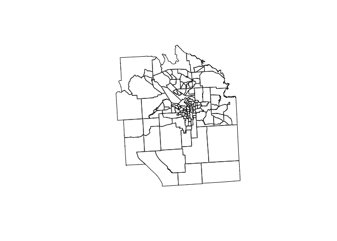
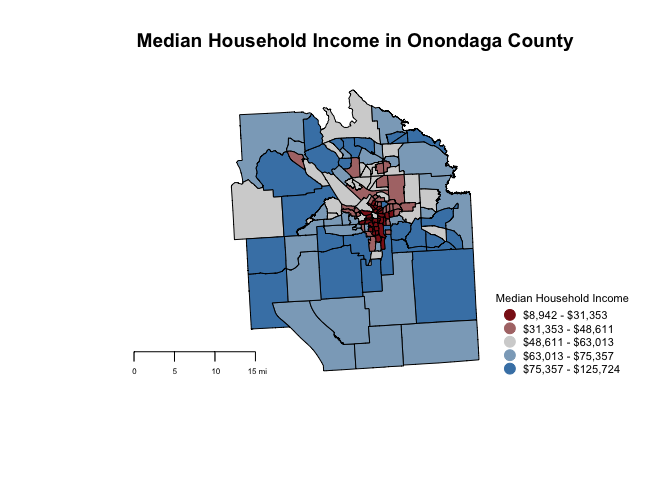
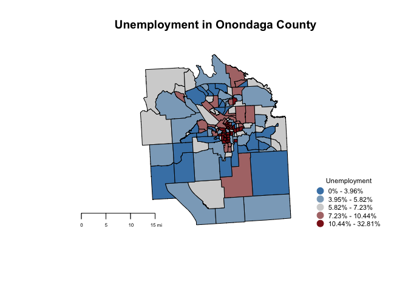
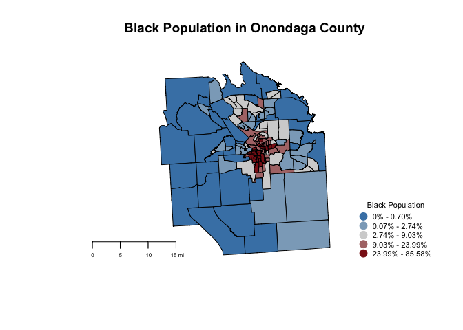

Lab03
================
Chris Davis
2/9/2017

Question 1: What are the demographics of neighborhoods in Syracuse?

• Download a TIGER shapefile of census tracts in Syracuse (Onondaga County)

``` r
#dir.create( "shapefiles" )
setwd( "./shapefiles" )

library( maptools )
```

    ## Warning: package 'maptools' was built under R version 3.3.2

    ## Loading required package: sp

    ## Checking rgeos availability: TRUE

``` r
library( sp )
library(maps)

syr <- readShapePoly( fn="tl_2015_36_tract/tl_2015_36_tract", proj4string=CRS("+proj=longlat +datum=WGS84") ) #had to download manually
```

    ## NOTE: rgdal::checkCRSArgs: no proj_defs.dat in PROJ.4 shared files

``` r
syr <- syr[syr$COUNTYFP=="067", ]
plot( syr,  border="gray10" )
```



• Download three demographic variables of interest, your choice, using the censusapi package

``` r
library(censusapi)
```

    ## 
    ## Attaching package: 'censusapi'

    ## The following object is masked from 'package:methods':
    ## 
    ##     getFunction

``` r
library(dplyr)
```

    ## 
    ## Attaching package: 'dplyr'

    ## The following objects are masked from 'package:stats':
    ## 
    ##     filter, lag

    ## The following objects are masked from 'package:base':
    ## 
    ##     intersect, setdiff, setequal, union

``` r
censuskey <- "b431c35dad89e2863681311677d12581e8f24c24"

labels <- c("name", "state", "county", "tract", "TOTAL", "MEDIANHOUSEINCOME", "BLACK", "UNEMPLOYED", "INLABORFORCE", "POVERTY")

dat <- getCensus(name = "acs5", vintage = 2015, key = censuskey, vars = c("NAME","B01001_001E", "B19013_001E", "B01001B_001E", "B23025_005E", "B23025_002E", "B17001_002E"), region = "tract:*", regionin = "state: 36 + county:067")

names(dat) <- labels
dat <-tbl_df(dat)
```

• Create choropleth maps that include a title and legend for each variable

``` r
color.function <- colorRampPalette( c("firebrick4","light gray", "steel blue") ) 

col.ramp <- color.function( 5 ) # number of groups you desire

color.vector <- cut( rank(dat$TOTAL), breaks=5, labels=col.ramp )

color.vector <- as.character( color.vector )


this.order <- match( syr$TRACTCE, dat$tract)

color.vec.ordered <- color.vector[ this.order ]

plot(syr, col=color.vec.ordered, main = "Total Population in Onondaga County: Note How Unhelpful")

map.scale( metric=F, ratio=F, relwidth = 0.15, cex=0.5 )

legend.text <- c(" 161-2156"," 2156-2726"," 2726-3488"," 3488-4524"," 4524-7790")

legend( "bottomright", bg="white",
        pch=19, pt.cex=1.5, cex=0.7,
        legend=legend.text, 
        col=col.ramp, 
        box.col="white",
        title="Total Population" 
       )
```


``` r
color.function <- colorRampPalette( c("firebrick4","light gray","steel blue") )  

col.ramp <- color.function( 5 ) # number of groups you desire

color.vector <- cut( rank(dat$MEDIANHOUSEINCOME), breaks=5, labels=col.ramp )

color.vector <- as.character( color.vector )


this.order <- match( syr$TRACTCE, dat$tract)

color.vec.ordered <- color.vector[ this.order ]

plot(syr, col=color.vec.ordered, main = "Median Household Income in Onondaga County")


map.scale( metric=F, ratio=F, relwidth = 0.15, cex=0.5 )

legend.text=c(" $8,942 - $31,353"," $31,353 - $48,611"," $48,611 - $63,013"," $63,013 - $75,357"," $75,357 - $125,724")

legend( "bottomright", bg="white",
        pch=19, pt.cex=1.5, cex=0.7,
        legend=legend.text, 
        col=col.ramp, 
        box.col="white",
        title="Median Household Income" 
       )
```



``` r
color.function <- colorRampPalette( c("steel blue","light gray","firebrick4" ) ) 

col.ramp <- color.function( 5 ) # number of groups you desire

color.vector <- cut( rank(dat$UNEMPLOYED/dat$INLABORFORCE), breaks=5, labels=col.ramp )

color.vector <- as.character( color.vector )

this.order <- match( syr$TRACTCE, dat$tract)

color.vec.ordered <- color.vector[ this.order ]

plot(syr, col=color.vec.ordered, main = "Unemployment in Onondaga County")


map.scale( metric=F, ratio=F, relwidth = 0.15, cex=0.5 )

legend.text=c(" 0% - 3.96%"," 3.95% - 5.82%"," 5.82% - 7.23%"," 7.23% - 10.44%"," 10.44% - 32.81%")

legend( "bottomright", bg="white",
        pch=19, pt.cex=1.5, cex=0.7,
        legend=legend.text, 
        col=col.ramp, 
        box.col="white",
        title="Unemployment" 
       )
```



``` r
color.function <- colorRampPalette( c("steel blue","light gray","firebrick4" ) ) 

col.ramp <- color.function( 5 ) # number of groups you desire

color.vector <- cut(rank(dat$BLACK/dat$TOTAL), breaks=5, labels=col.ramp )

color.vector <- as.character( color.vector )

this.order <- match( syr$TRACTCE, dat$tract)

color.vec.ordered <- color.vector[ this.order ]

plot(syr, col=color.vec.ordered, main = "Black Population in Onondaga County")

map.scale( metric=F, ratio=F, relwidth = 0.15, cex=0.5 )

legend.text=c(" 0% - 0.70%"," 0.07% - 2.74%"," 2.74% - 9.03%"," 9.03% - 23.99%"," 23.99% - 85.58%")

legend( "bottomright", bg="white",
        pch=19, pt.cex=1.5, cex=0.7,
        legend=legend.text, 
        col=col.ramp, 
        box.col="white",
        title="Black Population" 
       )
```


