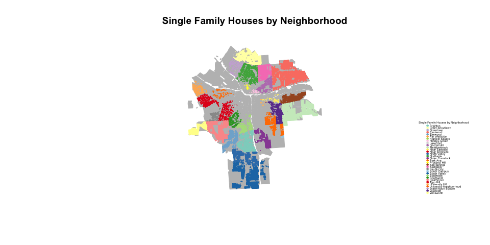
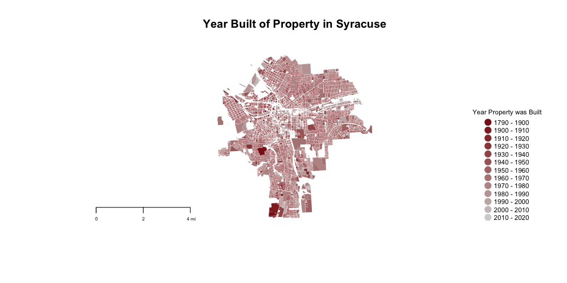

# Lab04
Chris Davis  
2/9/2017  


```r
setwd("~/Desktop/DDMII/ChrisDavisLabs/Lab04")
library( rgdal )
library( maptools )
library( geojsonio )
library(dplyr)
library(RColorBrewer)
library(maps)

syr <- readOGR(dsn = "syr_parcels.geojson")
```

```
## OGR data source with driver: GeoJSON 
## Source: "syr_parcels.geojson", layer: "OGRGeoJSON"
## with 41502 features
## It has 64 fields
```


```r
proj4string( syr )
```

```
## [1] "+proj=longlat +datum=WGS84 +no_defs +ellps=WGS84 +towgs84=0,0,0"
```

```r
syr <- spTransform( syr, CRS("+proj=longlat +datum=WGS84") )

proj4string( syr )
```

```
## [1] "+proj=longlat +datum=WGS84 +ellps=WGS84 +towgs84=0,0,0"
```


```r
dat <- as.data.frame(syr)
```

Question 1: How many single family homes are in each neighborhood?

•	Create a table of the count of single family homes by neighborhood


```r
dat<- tbl_df(dat)
singles <- filter(dat, LandUse == "Single Family")
datGrouped <- group_by(singles, Nhood)
summarize(datGrouped, total = n())
```

<div data-pagedtable="false">
  <script data-pagedtable-source type="application/json">
{"columns":[{"label":["Nhood"],"name":[1],"type":["fctr"],"align":["left"]},{"label":["total"],"name":[2],"type":["int"],"align":["right"]}],"data":[{"1":"Brighton","2":"1398"},{"1":"Court-Woodlawn","2":"1859"},{"1":"Downtown","2":"1"},{"1":"Eastwood","2":"3605"},{"1":"Elmwood","2":"909"},{"1":"Far Westside","2":"471"},{"1":"Hawley-Green","2":"52"},{"1":"Lakefront","2":"24"},{"1":"Lincoln Hill","2":"580"},{"1":"Meadowbrook","2":"1721"},{"1":"Near Eastside","2":"93"},{"1":"Near Westside","2":"521"},{"1":"North Valley","2":"1194"},{"1":"Northside","2":"1508"},{"1":"Outer Comstock","2":"697"},{"1":"Park Ave.","2":"167"},{"1":"Prospect Hill","2":"29"},{"1":"Salt Springs","2":"1029"},{"1":"Sedgwick","2":"892"},{"1":"Skunk City","2":"345"},{"1":"South Campus","2":"25"},{"1":"South Valley","2":"1605"},{"1":"Southside","2":"481"},{"1":"Southwest","2":"419"},{"1":"Strathmore","2":"1475"},{"1":"Tipp Hill","2":"785"},{"1":"University Hill","2":"17"},{"1":"University Neighborhood","2":"803"},{"1":"Washington Square","2":"425"},{"1":"Westcott","2":"851"},{"1":"Winkworth","2":"411"}],"options":{"columns":{"min":{},"max":[10]},"rows":{"min":[10],"max":[10]},"pages":{}}}
  </script>
</div>

•	Highlight all single family homes, using a different color for each neighborhood


```r
mySingles <- syr[syr$LandUse == "Single Family", ]
notSingles <- syr[syr$LandUse != "Single Family", ]

plot(notSingles, col = "grey", border = "grey", main = "Single Family Houses by Neighborhood")


myPallete <- c(brewer.pal(12, "Set3"), brewer.pal(9, "Set1"), brewer.pal(12, "Paired"))

palette(myPallete)

plot(mySingles, col = as.factor(mySingles$Nhood), border = as.factor(mySingles$Nhood), add = T)
legend( "bottomright", bg="white",
        pch=19, pt.cex=.5, cex=.35,
        legend=levels(mySingles$Nhood), 
        col=palette(), 
        box.col="white",
        title="Single Family Houses by Neighborhood" 
       )
```

<!-- -->

Question 2: Where does land in Syracuse have the highest value? 


•	Create a table of the count of single family homes with values above $200k in each neighborhood, as a pecentage of all single family homes

```r
 myTable <- summarize(datGrouped, total = n(), homesAbove200 = round(sum(AssessedVa > 200000)/nrow(mySingles)*100, digits = 3))

myTable <- arrange(myTable, desc(homesAbove200))

myTable$homesAbove200 <- paste(myTable$homesAbove200, "%", sep = "")

print(myTable, n = 31)
```

```
## # A tibble: 31 × 3
##                      Nhood total homesAbove200
##                     <fctr> <int>         <chr>
## 1                 Sedgwick   892        0.533%
## 2              Meadowbrook  1721        0.246%
## 3  University Neighborhood   803         0.07%
## 4               Strathmore  1475        0.066%
## 5                Winkworth   411        0.045%
## 6             Lincoln Hill   580        0.029%
## 7             South Valley  1605         0.02%
## 8           Outer Comstock   697        0.012%
## 9                Northside  1508        0.008%
## 10                Eastwood  3605        0.004%
## 11         University Hill    17        0.004%
## 12                Brighton  1398            0%
## 13          Court-Woodlawn  1859            0%
## 14                Downtown     1            0%
## 15                 Elmwood   909            0%
## 16            Far Westside   471            0%
## 17            Hawley-Green    52            0%
## 18               Lakefront    24            0%
## 19           Near Eastside    93            0%
## 20           Near Westside   521            0%
## 21            North Valley  1194            0%
## 22               Park Ave.   167            0%
## 23           Prospect Hill    29            0%
## 24            Salt Springs  1029            0%
## 25              Skunk City   345            0%
## 26            South Campus    25            0%
## 27               Southside   481            0%
## 28               Southwest   419            0%
## 29               Tipp Hill   785            0%
## 30       Washington Square   425            0%
## 31                Westcott   851            0%
```

•	Plot the value / acre of all parcels in Syracuse

```r
color.function <- colorRampPalette(c("light gray", "steel blue")) 
col.ramp <- color.function( 5 ) # number of groups you desire

color.vector <- cut(rank(dat$AssessedVa/dat$Acres), breaks=5, labels=col.ramp )

color.vector <- as.character( color.vector )

plot(syr, col=color.vector, border = F, main = "Value / Acre of All Parcels in Syracuse")

map.scale( metric=F, ratio=F, relwidth = 0.15, cex=0.5 )


legend( "bottomright", bg="white",
        pch=19, pt.cex=1.5, cex=0.7,
        legend = c("192 - 268,168", "268,168 - 401,571", "401,571 - 519,527", "519,527 - 673,842", "673,842 - 44,726,212"),
        col=col.ramp, 
        box.col="white",
        title="Assessed Value Per Acre" 
       )
```

<!-- -->


Question 3: What is the age of single family homes in each neighborhood? 

•	Create a table that reports the 10th, 25th, 50th, 75th, and 90th percentile of home ages in each neighborhood.

```r
dat <- mutate(dat, age =2017 - as.numeric(as.character(YearBuilt)))
singles <- filter(dat, LandUse == "Single Family")
datGrouped <- group_by(singles, Nhood)
 myTable <- summarize(datGrouped, 
         tenth = quantile(age, .1, na.rm = T),
         twentyFifth = quantile(age, .25, na.rm = T), 
         fiftyth = quantile(age, .5, na.rm = T),
         seventyFifth = quantile(age, .75, na.rm = T),
         ninetyth = quantile(age, .9, na.rm = T))
 options(tibble.width = Inf)
 myTable <- arrange(myTable, tenth)
 print(myTable, n = 45)
```

```
## # A tibble: 31 × 6
##                      Nhood tenth twentyFifth fiftyth seventyFifth ninetyth
##                     <fctr> <dbl>       <dbl>   <dbl>        <dbl>    <dbl>
## 1                Southwest  16.5       24.00      87          107    117.0
## 2            Near Westside  16.5       28.00      97          117    136.4
## 3                Southside  24.0       87.00      97          116    117.0
## 4             South Campus  30.8       52.00      60           71     89.0
## 5             Lincoln Hill  32.0       87.00      97          117    127.0
## 6                Winkworth  46.0       57.00      62           69     87.0
## 7           Outer Comstock  52.0       58.00      67           76     92.0
## 8             South Valley  54.0       62.00      67           87     97.0
## 9             Salt Springs  55.0       62.00      77           89     97.0
## 10              Skunk City  55.7       87.00      97          117    127.0
## 11             Meadowbrook  57.0       62.00      67           85     91.0
## 12            North Valley  57.0       62.00      82           92    105.0
## 13              Strathmore  61.0       81.00      91           97    109.0
## 14                 Elmwood  61.3       82.00      89           97    117.0
## 15                Brighton  62.0       87.00      97          107    117.0
## 16                Eastwood  62.0       74.00      87           97    102.0
## 17                Westcott  62.0       82.00      92          100    117.0
## 18          Court-Woodlawn  64.0       74.00      88           97    117.0
## 19                Sedgwick  64.0       73.75      87           95    107.0
## 20 University Neighborhood  65.0       71.00      89           97    107.0
## 21         University Hill  73.0       87.00      97          107    114.0
## 22           Near Eastside  74.1       82.00      97          112    127.0
## 23           Prospect Hill  75.0       87.00      97          117    130.0
## 24               Tipp Hill  77.9       92.00     107          117    127.0
## 25            Far Westside  87.0       97.00     107          117    127.0
## 26               Northside  87.0       97.00     107          117    127.0
## 27               Park Ave.  87.0       97.00     107          117    127.0
## 28       Washington Square  87.0       97.00     117          137    157.0
## 29            Hawley-Green  88.0      107.00     117          127    146.1
## 30               Lakefront  88.6       97.00     112          127    137.0
## 31                Downtown  89.0       89.00      89           89     89.0
```

•	Create a choropleth map that shows the age of properties by decade, pre-1900s can be one category.

```r
years <- as.numeric(as.character(dat$YearBuilt))

color.function <- colorRampPalette( c("firebrick4", "light gray" ) ) 

col.ramp <- color.function( 13 )

myAges <- cut(years, breaks = c(1790, seq(from = 1900, to = 2020, by = 10)), dig.lab = 10, labels = col.ramp)

plot(syr, col = as.character(myAges), border = F, main = "Year Built of Property in Syracuse")

map.scale( metric=F, ratio=F, relwidth = 0.15, cex=0.5 )

legend("bottomright", bg="white",
        pch=19, pt.cex=1.5, cex=0.7,
        legend = paste(c(1790, seq(from = 1900, to = 2010, by = 10)), "-", seq(from = 1900, to = 2020, by = 10),sep = " "),
        col=col.ramp, 
        box.col="white",
        title="Year Property was Built" 
       )
```

<!-- -->


