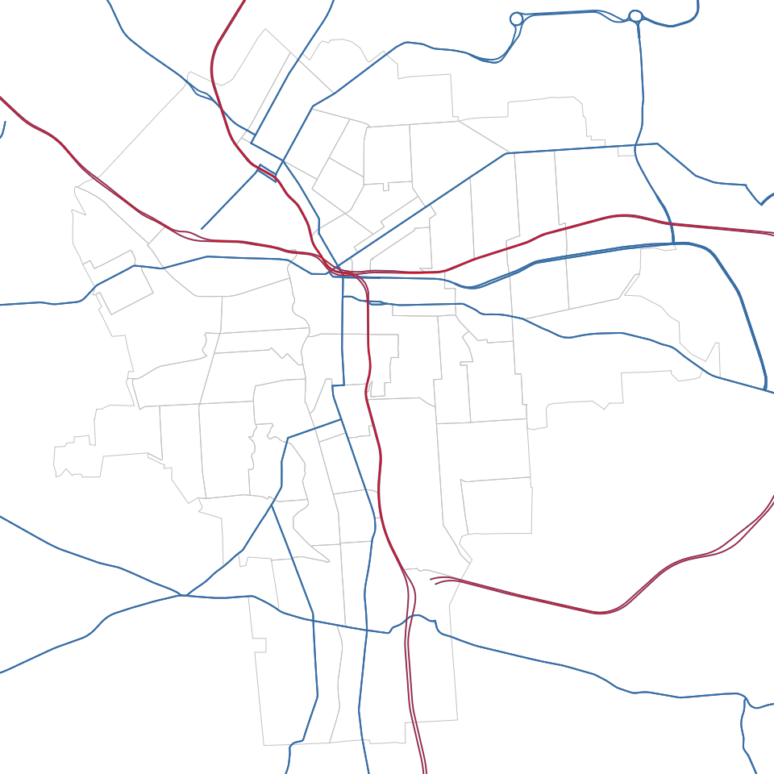
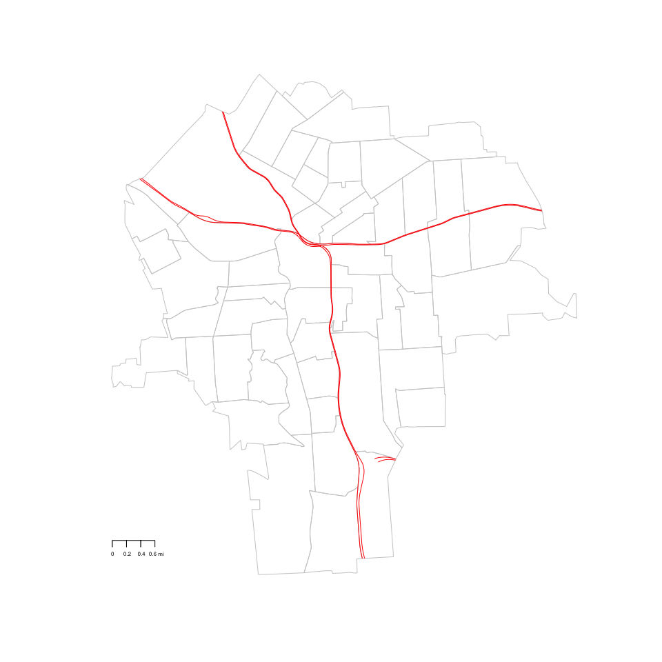
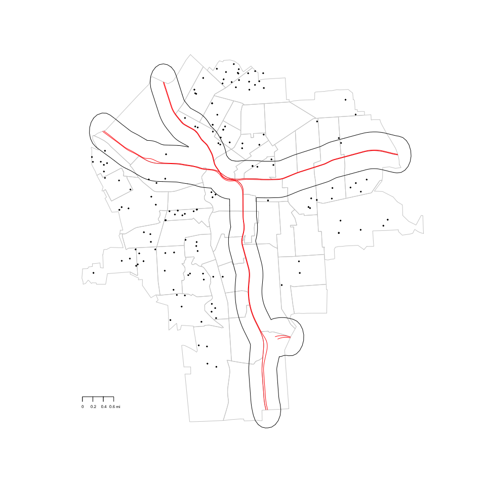
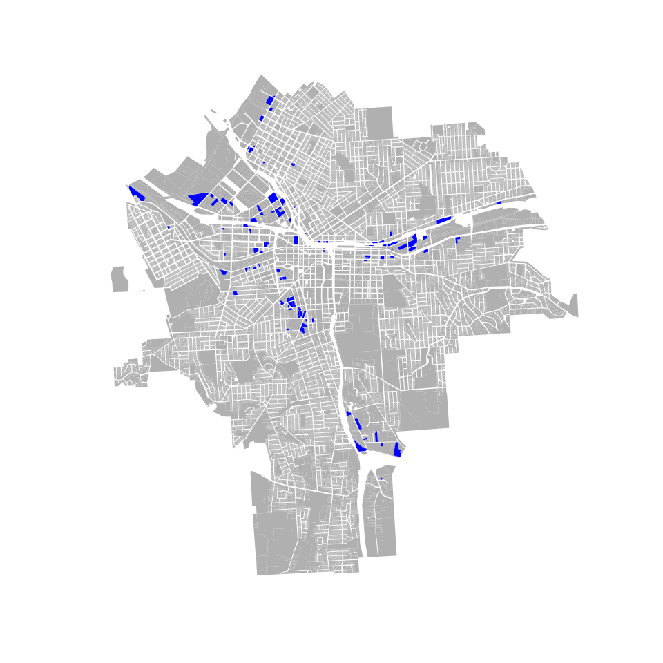

# Lab06
Chris Davis  
3/8/2017  


#Part I
##Load Plot and Shapefile

```r
library( maptools )
library( sp )
library(maps)

syr <- readShapePoly( fn="shapefiles/tl_2010_36067_tract10", proj4string=CRS("+proj=longlat +datum=WGS84") )
syr <- syr[as.numeric(as.character(syr$NAME10)) < 64, ]
par( mar=c(0,0,0,0) )
plot( syr,  border="gray10" )
```

<!-- -->

##Add Roads

```r
roads <- readShapeLines( fn="shapefiles/tl_2015_36_prisecroads", proj4string=CRS("+proj=longlat +datum=WGS84") )

head( roads@data )
```

<div data-pagedtable="false">
  <script data-pagedtable-source type="application/json">
{"columns":[{"label":["LINEARID"],"name":[1],"type":["fctr"],"align":["left"]},{"label":["FULLNAME"],"name":[2],"type":["fctr"],"align":["left"]},{"label":["RTTYP"],"name":[3],"type":["fctr"],"align":["left"]},{"label":["MTFCC"],"name":[4],"type":["fctr"],"align":["left"]}],"data":[{"1":"1104486676574","2":"Ny St Thruway Berkshire Exd","3":"M","4":"S1200"},{"1":"1104493254230","2":"Center St Exd","3":"M","4":"S1200"},{"1":"1104492126212","2":"Oak St Exd","3":"M","4":"S1200"},{"1":"110788145083","2":"Main St Exd","3":"M","4":"S1200"},{"1":"110788617875","2":"Gilbert St Exd","3":"M","4":"S1200"},{"1":"110496874399","2":"Forest Ave Exd","3":"M","4":"S1200"}],"options":{"columns":{"min":{},"max":[10]},"rows":{"min":[10],"max":[10]},"pages":{}}}
  </script>
</div>

```r
table( roads$RTTYP )
```

```
## 
##    C    I    M    O    S    U 
##  826  268 7009   40 2774  473
```

```r
#Extract Intersate
interstate <- roads[ roads$RTTYP == "I" , ]
```
##Look at unclipped portion

```r
par( mar=c(0,0,0,0) )
plot( syr,  border="gray80" )
plot( roads, col="steelblue", lwd=2, add=T)
plot(interstate, col = "red", add = T)
```

<!-- -->

##Clip

```r
library(raster)
library(rgeos)

interstate_clipped <- gIntersection(syr, interstate)
```
##Plot Clipped 

```r
plot( syr,  border="gray80" )
#plot( roads_clipped, col="steelblue", lwd=2, add=T)
plot( interstate_clipped, col="red", add=T)
map.scale( metric=F, ratio=F, relwidth = 0.05, cex=0.5 )
```

<!-- -->

##Houses

```r
library(dplyr)
houses <- read.csv("https://raw.githubusercontent.com/lecy/hedonic-prices/master/Data/Housing%20Price%20In-Class%20Exercise%20(Responses).csv", stringsAsFactors = F)

lat.lon <- read.csv("lat.lon.csv", stringsAsFactors = F)
lat.lon <- lat.lon[ c("lon","lat")]

plot( syr,  border="gray80" )
#plot( roads_clipped, col="steelblue", lwd=2, add=T)
plot( interstate_clipped, col="red", add=T)
map.scale( metric=F, ratio=F, relwidth = 0.05, cex=0.5 )
  
points(lat.lon$lon, lat.lon$lat, pch = 19, cex=.3)
buff <- gBuffer(interstate_clipped, width = .005)
plot(buff, add=T)
```

<!-- -->

##Less find the points near dat highway

```r
lat.lon <- SpatialPoints(lat.lon, proj4string = CRS("+proj=longlat +datum=WGS84") )

overStuff <- over(lat.lon, buff)
overStuff[is.na(overStuff)] <- 0
nearHighway <- overStuff==1

houses<- mutate(houses, nearHighway)

nearHighway
```

```
##     1     2     3     4     5     6     7     8     9    10    11    12 
## FALSE FALSE FALSE FALSE FALSE FALSE FALSE FALSE FALSE FALSE FALSE FALSE 
##    13    14    15    16    17    18    19    20    21    22    23    24 
## FALSE FALSE FALSE FALSE FALSE FALSE FALSE FALSE FALSE FALSE FALSE FALSE 
##    25    26    27    28    29    30    31    32    33    34    35    36 
## FALSE FALSE FALSE FALSE  TRUE FALSE FALSE FALSE FALSE FALSE FALSE FALSE 
##    37    38    39    40    41    42    43    44    45    46    47    48 
## FALSE FALSE FALSE FALSE FALSE FALSE FALSE  TRUE  TRUE  TRUE  TRUE FALSE 
##    49    50    51    52    53    54    55    56    57    58    59    60 
## FALSE FALSE FALSE FALSE FALSE FALSE FALSE FALSE FALSE FALSE FALSE FALSE 
##    61    62    63    64    65    66    67    68    69    70    71    72 
## FALSE FALSE FALSE FALSE FALSE FALSE FALSE FALSE FALSE FALSE FALSE FALSE 
##    73    74    75    76    77    78    79    80    81    82    83    84 
## FALSE FALSE FALSE FALSE FALSE FALSE FALSE FALSE FALSE FALSE  TRUE  TRUE 
##    85    86    87    88    89    90    91    92    93    94    95    96 
## FALSE  TRUE FALSE FALSE FALSE FALSE FALSE FALSE FALSE FALSE FALSE FALSE 
##    97    98    99   100   101   102   103   104   105   106   107   108 
## FALSE FALSE  TRUE FALSE FALSE  TRUE FALSE FALSE FALSE FALSE  TRUE FALSE 
##   109   110   111   112   113   114   115   116   117   118   119   120 
## FALSE FALSE FALSE FALSE FALSE FALSE FALSE FALSE FALSE FALSE FALSE FALSE 
##   121   122   123   124   125   126   127   128   129   130   131   132 
## FALSE FALSE FALSE FALSE FALSE FALSE FALSE FALSE FALSE FALSE FALSE FALSE 
##   133   134   135   136   137   138   139   140   141   142   143   144 
## FALSE  TRUE FALSE FALSE FALSE FALSE FALSE FALSE FALSE FALSE  TRUE  TRUE 
##   145   146   147   148 
##  TRUE FALSE FALSE FALSE
```

##Less plot it

```r
plot(syr, border = "gray80")
plot(interstate_clipped, col = "red", add = T)
points(lat.lon$lon[!nearHighway], lat.lon$lat[!nearHighway], pch = 19, cex = .3)
points(lat.lon$lon[nearHighway], lat.lon$lat[nearHighway], pch = 19, cex = 1, col = "yellow")
```

<!-- -->

#Part II

```r
library( rgdal )
library( maptools )
library( geojsonio )
library(dplyr)
library(RColorBrewer)
library(maps)

syr <- readOGR(dsn = "shapefiles/syr_parcels.geojson")
```

```
## OGR data source with driver: GeoJSON 
## Source: "shapefiles/syr_parcels.geojson", layer: "OGRGeoJSON"
## with 41502 features
## It has 64 fields
```

```r
industrials <- syr[syr$LandUse=="Industrial", ]
notIndustrials <- syr[syr$LandUse!="Industrial", ]

plot(notIndustrials, col = "grey", border = F)

plot(industrials, add = T, col = "blue")

industrialBuff <- gBuffer(industrials, width = .003621, capStyle = "FLAT", quadsegs = 1)

 overs <- over(syr, industrialBuff)

nearIndustry <- overs==1
nearIndustry[is.na(nearIndustry)]<- F

syr <- cbind(syr, nearIndustry)

plot(industrialBuff, add = T, col = rgb(44, 4, 248, alpha = 50, maxColorValue = 355))

map.scale( metric=F, ratio=F, relwidth = 0.15, cex=0.5 )
```

<!-- -->


```r
schools <- syr[syr$LandUse=="Schools", ]
notSchools <- syr[syr$LandUse!="Schools", ]

plot(notSchools, col = "grey", border = F)
plot(schools, add = T, col = "red")

schoolBuff <- gBuffer(schools, width = .001812, capStyle = "FLAT", quadsegs = 1)

 overs <- over(syr, schoolBuff)

nearSchools <- overs==1
nearSchools[is.na(nearSchools)]<- F

syr <- cbind(syr, nearSchools)

plot(schoolBuff, add = T, col = rgb(248, 18, 18, alpha = 50, maxColorValue = 355))

map.scale( metric=F, ratio=F, relwidth = 0.15, cex=0.5 )
```

<!-- -->


